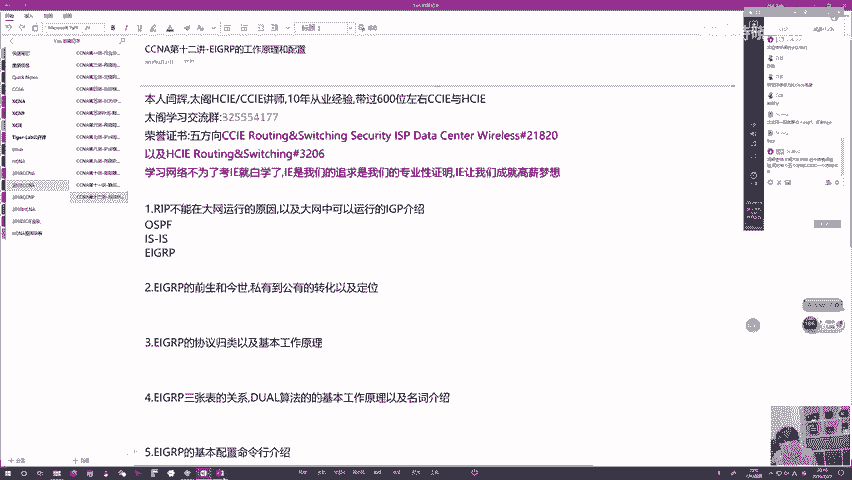
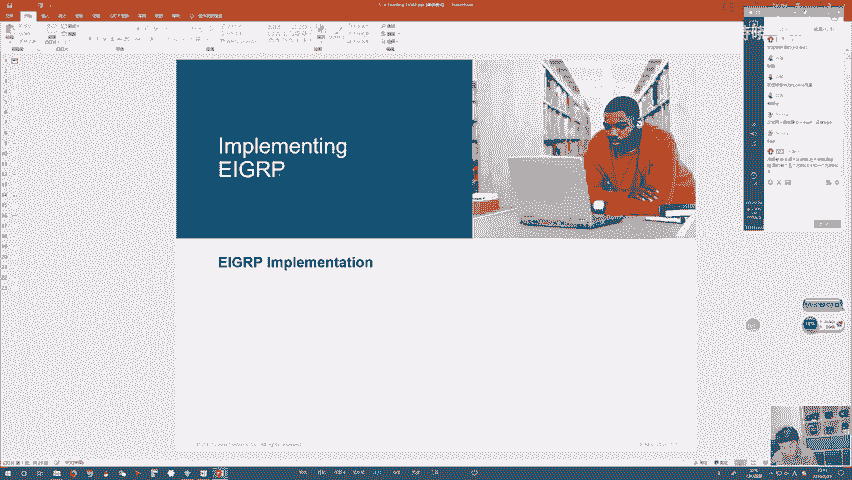
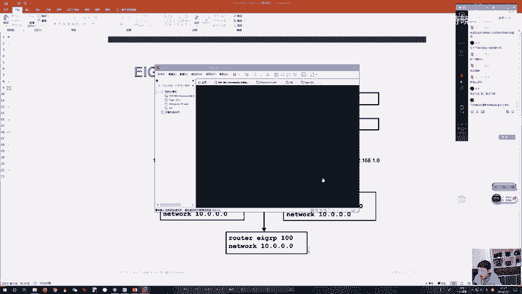
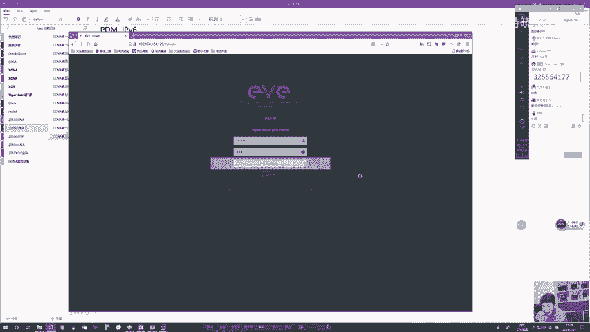
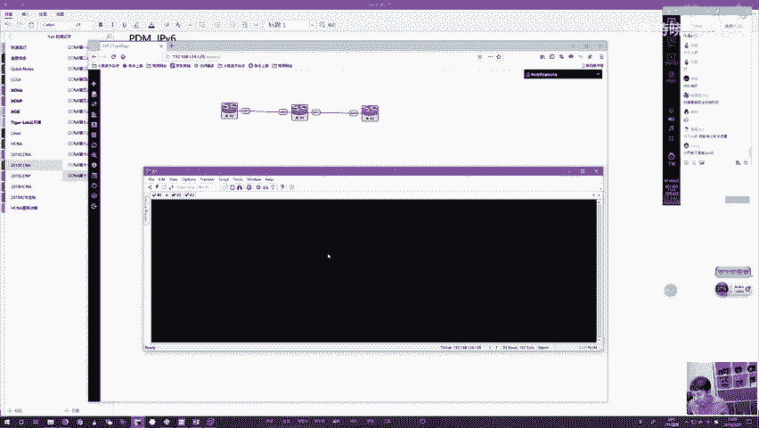
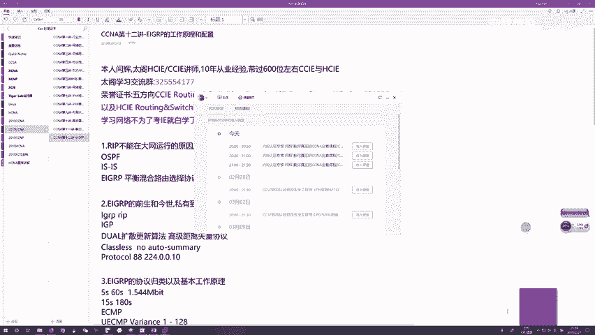

# CCNA教程合集：P13：EIGRP协议详解 🚀

## 概述
在本节课中，我们将要学习思科私有路由协议EIGRP的核心原理、特点、算法以及基础配置。EIGRP是一种高效、收敛快速且功能强大的高级距离矢量协议，特别适用于大型网络环境。

---



## 路由协议的选择与演进



上一节我们介绍了静态路由和RIP协议。RIP作为一种基础的路由选择协议，只适合在中到小型网络中部署，在大型网络中则存在诸多限制。

RIP协议的主要问题包括：
*   **收敛速度慢**：在大型网络中，收敛缓慢会带来严重问题。
*   **度量值不精确**：RIP通过**跳数（Hop Count）** 衡量路径好坏。经过的路由器数量越多，跳数越高，路径越差。这种方式选出的“最优路径”未必是管理员认可的实际最优路径。
*   **网络规模限制**：RIP路由的最大度量值为**15跳**。度量值为16跳的路由被视为不可达。在超过15台路由器的大型网络中，路由信息可能无法传递到所有路由器，导致部分网络不可达。

因此，在中到大型网络（如运营商内网、金融数据中心、跨国公司企业网）中，我们需要更强大的路由协议。常见的公有协议有**OSPF**和**IS-IS**，它们被设计用于大型网络且不存在兼容性问题。

然而，在金融等特定网络环境中，常使用第三款协议——**EIGRP**。EIGRP曾长期是思科私有协议，这意味着只有思科设备能够运行它。由于思科设备价格昂贵，通常只有在财力雄厚的金融单位（如银行、券商）才能实现端到端的纯思科网络部署，从而运行EIGRP。

一个重要的转折点发生在2013年，思科将EIGRP协议开源，使其转变为公有协议。虽然目前并非所有厂商（如华为）都支持，但其优秀的特性预示着未来可能有更广泛的应用前景，尤其是在IPv6环境中。

---

## EIGRP协议基础

### 协议名称与分类
EIGRP全称为**增强型内部网关路由选择协议（Enhanced Interior Gateway Routing Protocol）**。它是早期思科私有协议IGRP的升级版。

EIGRP的分类如下：
*   **范围**：内部网关协议（IGP）。
*   **算法**：使用**DUAL（扩散更新算法，Diffusing Update Algorithm）**。该算法兼具距离矢量和链路状态协议的优点。
*   **常见分类**：**高级距离矢量协议**。它基于邻居通告获取路由信息（距离矢量特征），但通过DUAL算法实现了快速收敛和无环路由（链路状态协议的优势）。
*   **地址类别**：**无类协议**。支持VLSM和不连续子网。

### 核心特性与优势
EIGRP集众多优点于一身：
*   **快速收敛**：依赖DUAL算法，能在最优路径失效时迅速启用备份路径或通过扩散计算找到新路径。
*   **保证无环**：DUAL算法从数学上保证了路由无环。
*   **资源消耗低**：相比OSPF等链路状态协议，对路由器CPU和内存的消耗更低。
*   **配置简单**：配置复杂度与RIP相当，易于掌握。
*   **增量更新**：仅在网络拓扑发生变化时发送更新，而非周期性广播，极大节省了带宽和资源。
*   **支持非等价负载均衡**：这是EIGRP的独特优势。它不仅能进行等价负载均衡（ECMP），还能在路径度量值不同的情况下，按比例进行**非等价负载均衡（Unequal-Cost Load Balancing）**。
*   **支持多种被路由协议**：通过协议依赖模块（PDM），EIGRP历史上支持IPX、AppleTalk等协议。如今主要支持IPv4和IPv6（需使用独立进程）。

### 报文类型
EIGRP路由器之间通过5种类型的报文进行通信：
1.  **Hello**：用于发现和维持邻居关系。默认在高速接口（带宽≥1.544 Mbps）每5秒发送一次，在低速接口每60秒发送一次。
2.  **Update（更新）**：包含路由信息。在建立邻居关系初期或网络拓扑变化时发送。
3.  **Query（查询）**：当路由器丢失某条路由且没有可用备份路径时，向所有邻居发送查询，询问通往目的网络的路由。
4.  **Reply（应答）**：邻居路由器对查询报文的响应。
5.  **ACK（确认）**：用于确认收到的`Update`、`Query`、`Reply`等可靠报文，确保传输可靠性。

这些报文封装在IP包中，协议号为**88**。组播地址为**224.0.0.10**。

---

## DUAL算法与关键概念

EIGRP的强大核心在于DUAL算法。要理解它，需要先掌握几个关键概念。

### 三张表
EIGRP维护三张表来运作：
1.  **邻居表（Neighbor Table）**：记录所有建立EIGRP邻居关系的路由器信息，包括邻居IP、本地出口接口、保持时间等。这是所有通信的基础。
2.  **拓扑表（Topology Table）**：存储从所有邻居学到的、前往某个目的网络的所有可能路由及其详细信息（包括度量值参数）。
3.  **路由表（Routing Table）**：从拓扑表中选出前往每个目的网络的最佳路径（后继路径）放入此表，用于实际数据转发。

### 度量值计算
EIGRP使用**复合度量值**计算路径开销，默认考虑带宽和延迟两个参数，公式为：
**度量值 = [K1 * 带宽 + (K2 * 带宽) / (256 - 负载) + K3 * 延迟] * [K5 / (可靠性 + K4)]**
默认K1=1, K3=1, K2/K4/K5=0，因此公式简化为：
**度量值 = 带宽 + 延迟**
其中：
*   **带宽**：取路径中**最小带宽**的倒数，再乘以一个常数（10^7）。
*   **延迟**：取路径中所有链路延迟的**总和**。
其他参数（负载、可靠性、MTU）默认不参与计算，且邻居间K值必须一致才能建立邻接关系。

### 后继与可行后继
这是DUAL算法的核心：
*   **可行距离（FD， Feasible Distance）**：本路由器到达目的网络的最佳度量值。
*   **通告距离（AD， Advertised Distance）**：邻居路由器通告的、它自己到达该目的网络的FD。
*   **后继（Successor）**：当前使用的、最优路径的下一跳路由器（或路径本身）。
*   **可行后继（Feasible Successor）**：备份路径的下一跳路由器。要成为可行后继，必须满足**可行性条件（FC， Feasible Condition）**：**备用路径的AD < 主用路径的FD**。

**可行性条件的意义**：如果邻居通告的、它去往目的地的度量值（AD）比我自己当前的最佳度量值（FD）还要小，说明这个邻居比我离目的地更近。那么，即使我将数据转发给它，数据包也是朝着离目的地更近的方向前进，从而**绝对避免了路由环路**。

### 收敛过程
DUAL算法通过两种计算实现快速收敛：
1.  **本地计算**：当最优路径失效，但存在满足FC条件的可行后继时，路由器会立即将可行后继路径提升为后继，并放入路由表。此过程瞬间完成。
2.  **扩散计算**：当最优路径失效，且没有可行后继时，路由器会向所有邻居发送`Query`报文。邻居们查询自己的拓扑表后，用`Reply`报文回应。路由器根据回应重新计算最优路径。此过程涉及多台路由器协作，但依然非常高效。

---

## EIGRP基础配置

本节我们来看看如何在思科路由器上配置EIGRP。其配置思路与RIP类似，但更加灵活。

以下是配置EIGRP的基本步骤：

1.  **启用EIGRP进程**：在全局配置模式下，使用`router eigrp [AS号]`命令。AS号具有全局意义，需要互通的路由器必须配置相同的AS号。通常使用其管理距离90作为AS号。
2.  **关闭自动汇总**（在较老IOS版本中需要）：在EIGRP进程下，使用`no auto-summary`命令。新版本IOS（如15.x）默认已关闭。
3.  **宣告网络**：在EIGRP进程下，使用`network`命令宣告直连网络。支持两种方式：
    *   **主类宣告**：`network [网络地址]`，如`network 10.0.0.0`。这会宣告所有属于该主类网络的接口。
    *   **精确宣告**：`network [接口IP地址] [通配符掩码]`，如`network 10.1.1.1 0.0.0.0`。通配符掩码中的`0`表示精确匹配，`1`表示忽略。这种方式更精确，推荐使用。
4.  **（可选）配置路由器ID**：使用`eigrp router-id [ID]`命令，通常配置为环回口地址。






配置示例：
```bash
Router(config)# router eigrp 90
Router(config-router)# eigrp router-id 1.1.1.1
Router(config-router)# no auto-summary
Router(config-router)# network 10.1.1.1 0.0.0.0
Router(config-router)# network 192.168.1.0 0.0.0.255
```



常用验证命令：
*   `show ip eigrp neighbors`：查看EIGRP邻居表。
*   `show ip route eigrp`：查看通过EIGRP学到的路由。
*   `show ip eigrp topology`：查看EIGRP拓扑表，可以看到后继和可行后继信息。

---



## 总结
本节课我们一起学习了EIGRP协议。我们从RIP协议的局限性引入，探讨了在中大型网络中为何需要EIGRP这类更强大的协议。我们详细剖析了EIGRP作为高级距离矢量协议的核心特性，特别是其快速收敛、无环路由和低资源消耗的优点。我们深入理解了DUAL算法的关键概念，如可行距离（FD）、通告距离（AD）、后继与可行后继，以及实现快速收敛的本地计算和扩散计算机制。最后，我们掌握了EIGRP的基础配置和验证方法。EIGRP是一个设计精良、效率极高的路由协议，虽然其历史发展受限于私有属性，但其技术优势使其在未来网络演进中依然具有重要价值。