# CCNA教程合集：01：网络工程师行业与认证体系概述

在本节课中，我们将要学习网络工程师行业的概况、厂商认证体系的价值，以及学习本课程的目标和路径。我们将从宏观角度了解这个行业，帮助你建立清晰的学习规划。

## 课程定位与学习方法

上一节我们介绍了课程的基本信息，本节中我们来看看学习网络技术的正确方法。我坚信在学习一项技术的细节之前，必须先了解这项技术能解决什么问题。技术永远是用来解决问题的。

以下是学习网络技术的四部曲，希望大家在研究任何技术时都能基于此进行思考：
1.  **了解问题**：明确当前出现了什么问题，问题的根源是什么，以及它会带来什么困扰。
2.  **分析解决方案**：研究什么样的技术能解决这些问题，其解决的出发点是什么。
3.  **研究技术细节**：深入探究技术到底是如何工作的，如何具体解决问题。
4.  **发散性思考**：评估该技术是否为最优解决方案。如果不是，是否存在弥补缺陷的方法或更优的替代方案。

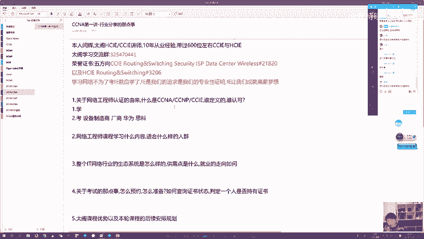

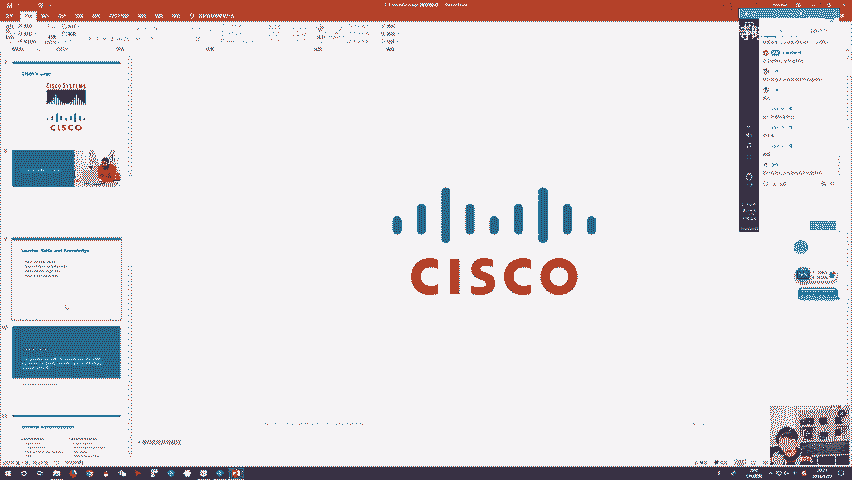

遵循这四部曲，能帮助你在学习技术时考虑到其根源和本质，从而在面试、就业、项目实践或运维中真正做到学以致用。

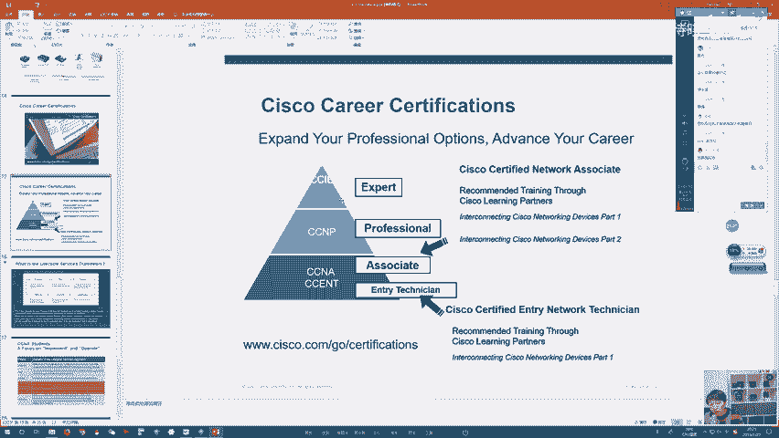

## 行业认证：国家认证与厂商认证

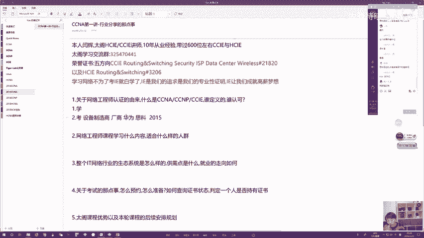

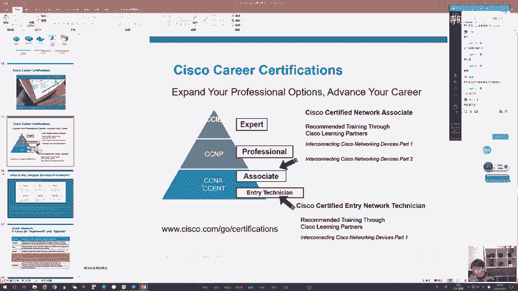

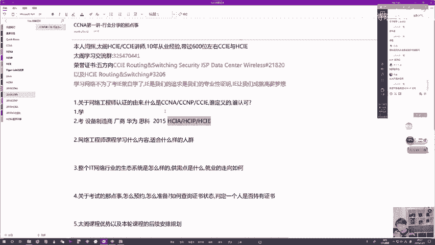

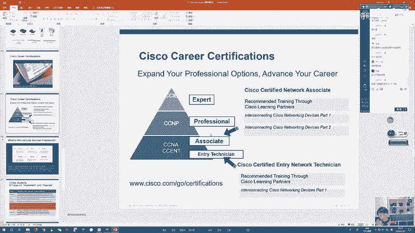

上一节我们探讨了学习方法，本节中我们来了解进入网络行业的关键凭证——认证。本课程分为“学”和“考”两部分。“学”是掌握网络技术原理与操作，“考”则是获取业界认可的资格证书。

在IT业界，证书主要分为两类。

第一类是国家认证，例如计算机等级考试、软考等。这类认证由教育部、人社局等国家部门颁发，通常采用笔试形式。它们对于进入国企、考取公务员或事业单位编制有较大帮助，但内容可能偏理论化，与实践结合不够紧密。

第二类是厂商认证，这也是本课程的重点。这类认证由设备制造商（厂商）颁发，例如思科（Cisco）和华为（Huawei）。厂商认证直接对应其生产的网络设备（如路由器、交换机）的实操技能，实用性更强，是大多数外企、私企招聘网络工程师时更看重的资质。

## 主流厂商认证体系详解

上一节我们区分了两类认证，本节中我们重点剖析主流的厂商认证体系。思科和华为作为全球网络设备市场的领导者，都建立了完善的认证金字塔。

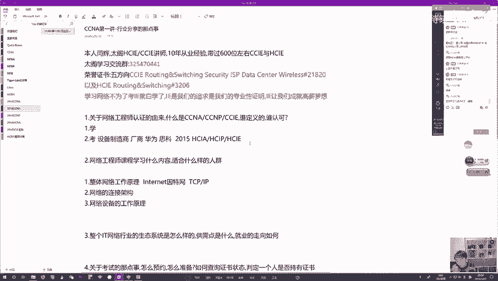

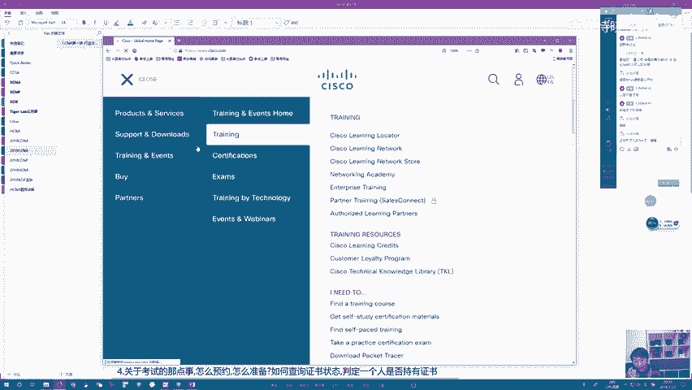

思科认证体系分为五个级别，我们主要关注其中三个核心等级：
*   **CCNA**：思科认证网络助理工程师。公式表示为：`CCNA = Cisco Certified Network Associate`
*   **CCNP**：思科认证资深网络工程师。公式表示为：`CCNP = Cisco Certified Network Professional`
*   **CCIE**：思科认证互联网专家。公式表示为：`CCIE = Cisco Certified Internetwork Expert`

华为认证体系与思科类似，其核心三级为：
*   **HCIA**：华为认证ICT工程师（原HCNA）。公式表示为：`HCIA = Huawei Certified ICT Associate`
*   **HCIP**：华为认证ICT资深工程师（原HCNP）。公式表示为：`HCIP = Huawei Certified ICT Professional`
*   **HCIE**：华为认证ICT专家。公式表示为：`HCIE = Huawei Certified ICT Expert`

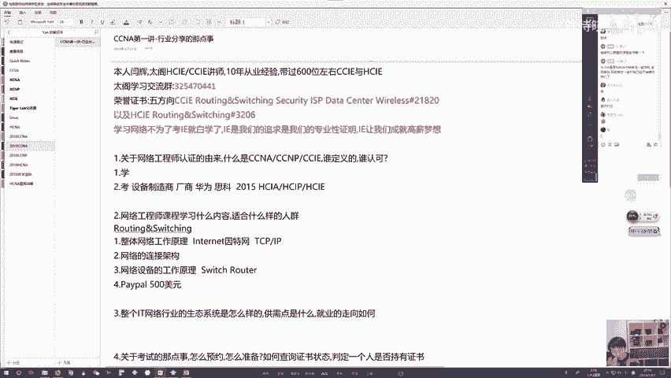

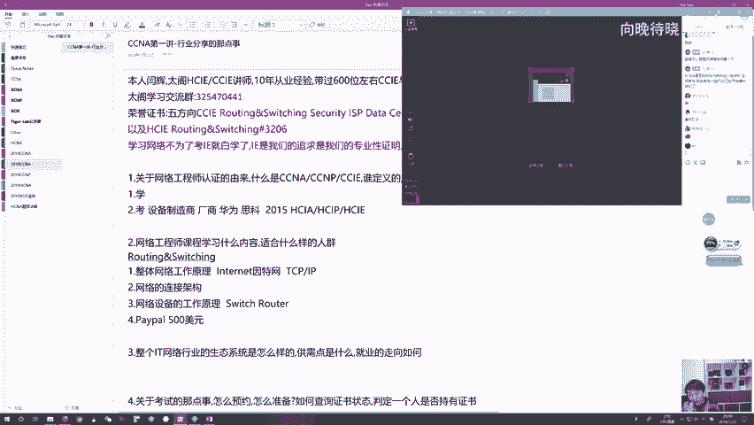

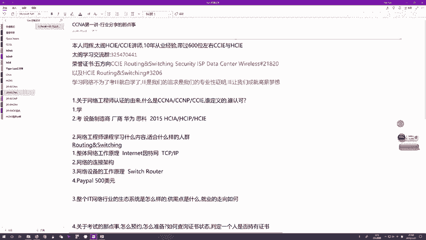

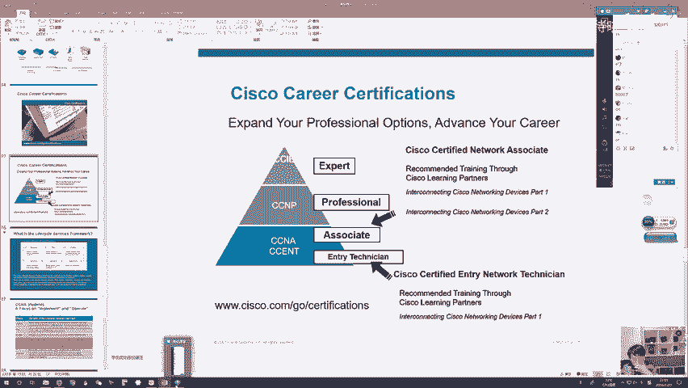

对于初学者，CCNA/HCIA是入门的起点；CCNP/HCIP是大多数企业招聘的常见要求；而CCIE/HCIE则代表了顶尖的技术专家水平，能帮助你进入更好的平台，获得更高的薪酬。

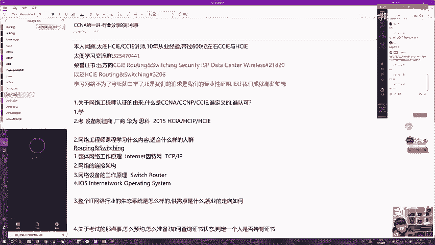

## 课程核心内容与技能构成

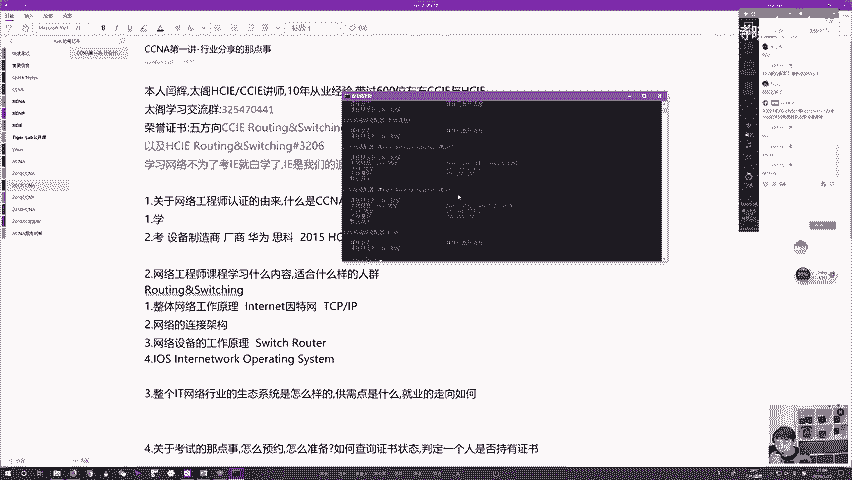

上一节我们了解了认证体系，本节中我们来看看本课程具体教授哪些内容。网络工程师的核心技能可以概括为以下四个部分：

1.  **网络工作原理**：理解互联网（Internet）如何运作，核心是掌握 **TCP/IP协议栈**。这就像网络的通用语言，确保所有设备能够按照统一规则通信。
2.  **网络连接架构**：学习如何为企业设计和搭建网络。这涉及到设备选型（企业级路由器、交换机）、连接方式以及如何构建一个成本节约、可扩展且高性能的网络拓扑。
3.  **网络设备工作原理**：深入理解核心设备——**交换机**和**路由器**——是如何工作的。它们是企业网络的基石，其功能与配置是面试和工作的重点。
4.  **实战操作配置**：学习如何通过命令行界面（CLI）登录并配置网络设备。思科设备的操作系统称为 **IOS**，华为设备的称为 **VRP**。你需要掌握通过命令启用、调试和验证网络功能。

> **提示**：路由交换方向是网络所有其他方向（如安全、无线、数据中心）的基础。学好路由交换，才能为学习更高级的增值技术打下坚实基础。

## 职业发展路径与行业生态

上一节我们明确了要学习的技能，本节中我们来看看学成之后的职业发展前景。网络技术适用于所有行业，就业方向主要分为甲方和乙方。

**乙方（服务提供方）**：
*   **厂商**：如思科、华为，主要从事设备研发，也招聘销售、售前/售后工程师。门槛和薪资最高。
*   **代理商**：代理厂商设备进行销售和实施。分为总代、金牌、银牌等级别，是招聘售前/售后工程师的主力军，薪资范围较广。
*   **集成商**：规模较小的公司，可能销售多家厂商设备。适合入门积累经验。

**甲方（服务采购方）**：
指各行各业拥有自己IT部门的公司，如银行、政府、互联网企业等。甲方的IT部门负责网络规划、选型和运维管理。薪资因行业和公司差异很大，发展空间广阔。

建议职业生涯从乙方开始，积累项目经验和技术能力，之后可向甲方或更高层级的乙方发展。IT行业包容性强，更看重技能和证书，为个人改变职业命运提供了无限可能。

## 课程安排与认证验证

上一节我们展望了职业前景，本节中我们来了解课程的具体安排并掌握一项实用技能。本课程系列通常在周一、三、五晚上进行。课程注重“学以致用”，我会根据多年的教学经验，按照科学的体系讲解知识，并布置作业帮助大家巩固。

最后，分享一个实用技能：如何验证一个人是否真的拥有CCIE证书？
1.  访问思科官网的认证验证页面。
2.  输入被验证人的 **姓氏（Last Name）**、**名字（First Name）** 和 **CCIE编号**。
3.  提交查询，系统会显示该编号与姓名是否匹配。

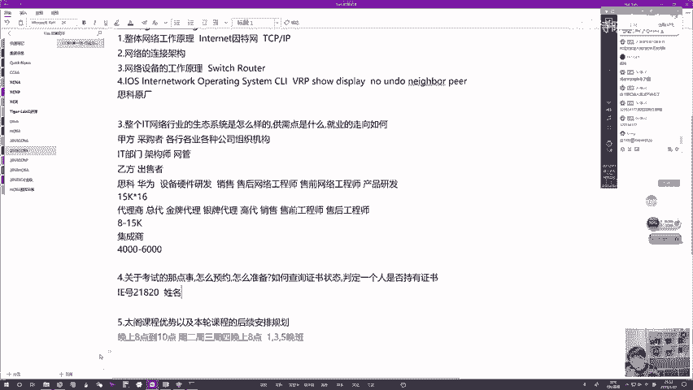

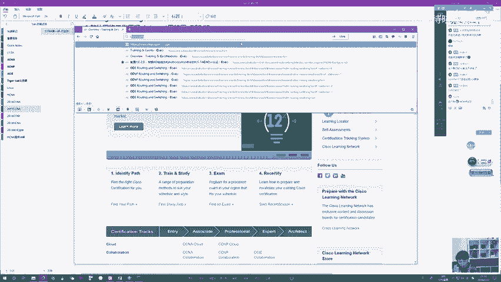

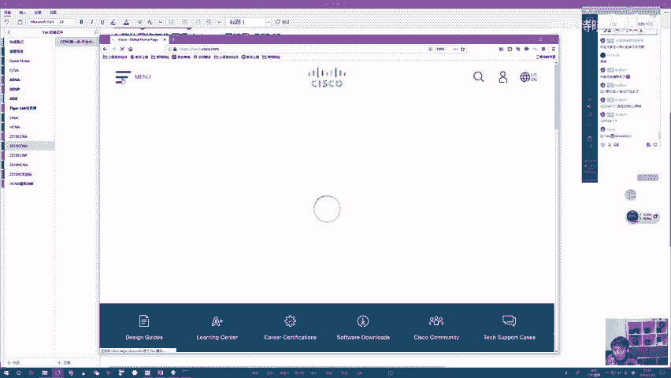

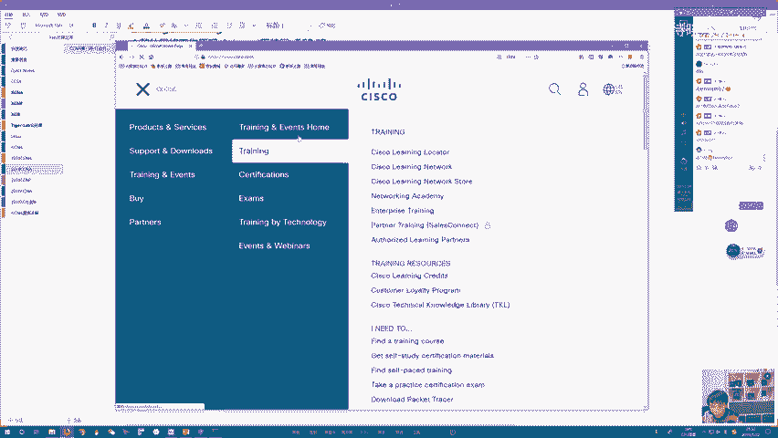

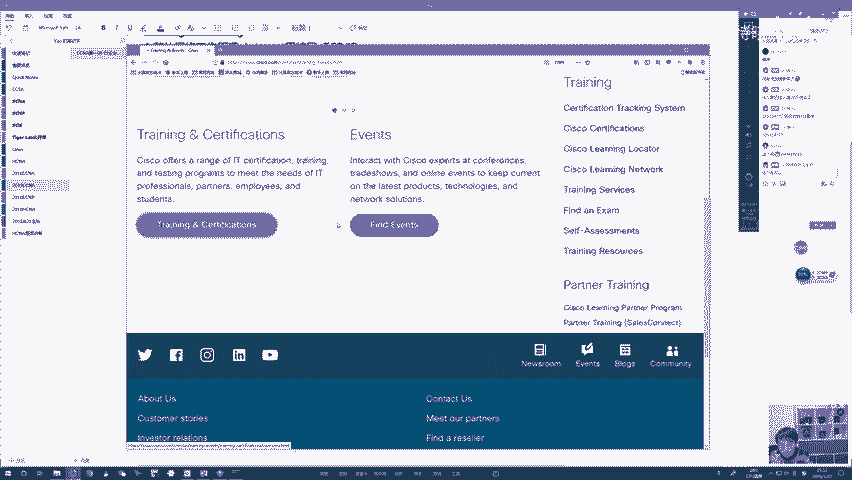

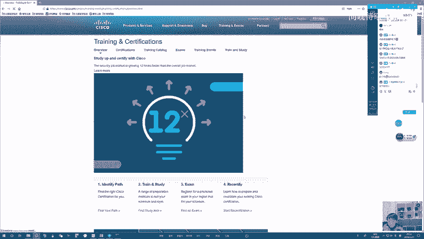

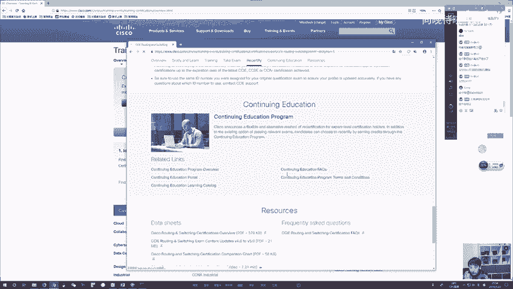

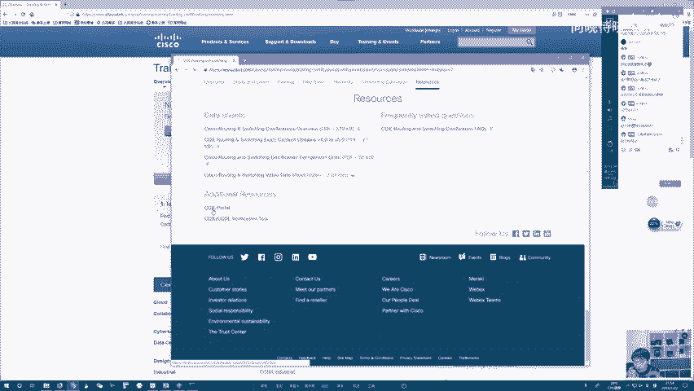

这能帮助你在求职或招聘时辨别真伪。

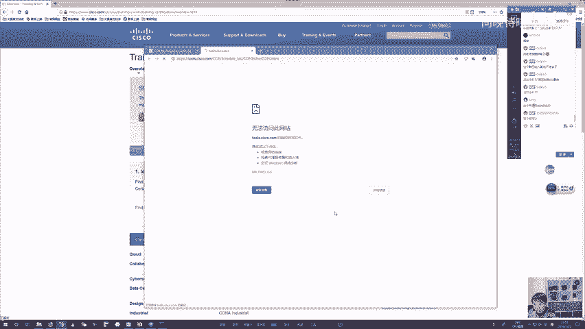

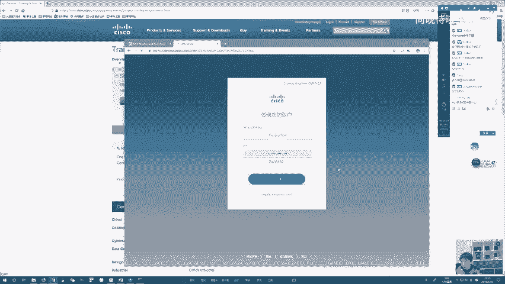

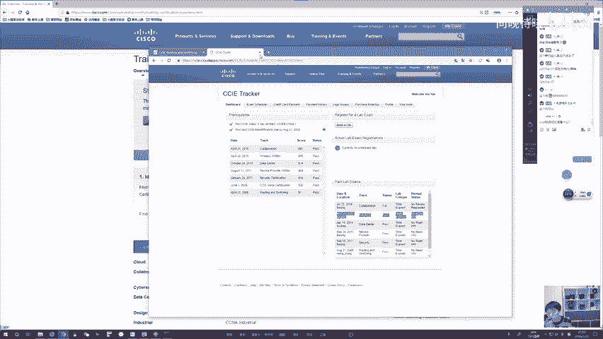

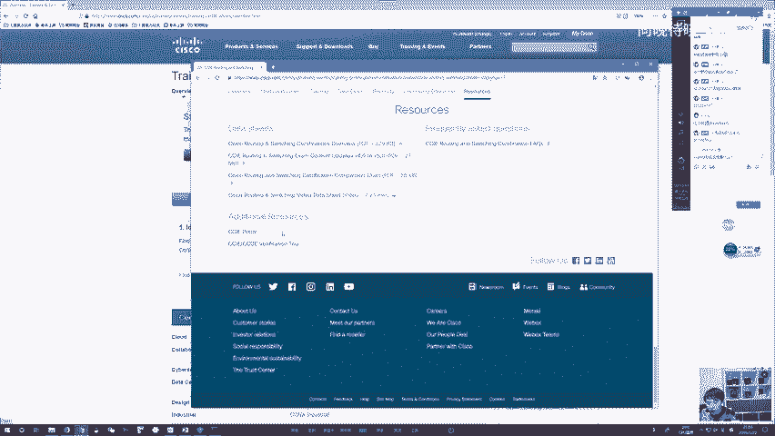

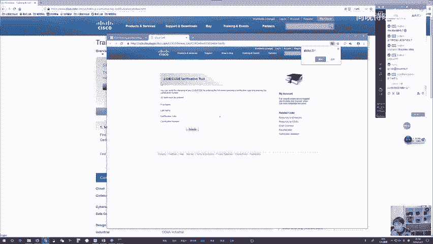

## 总结

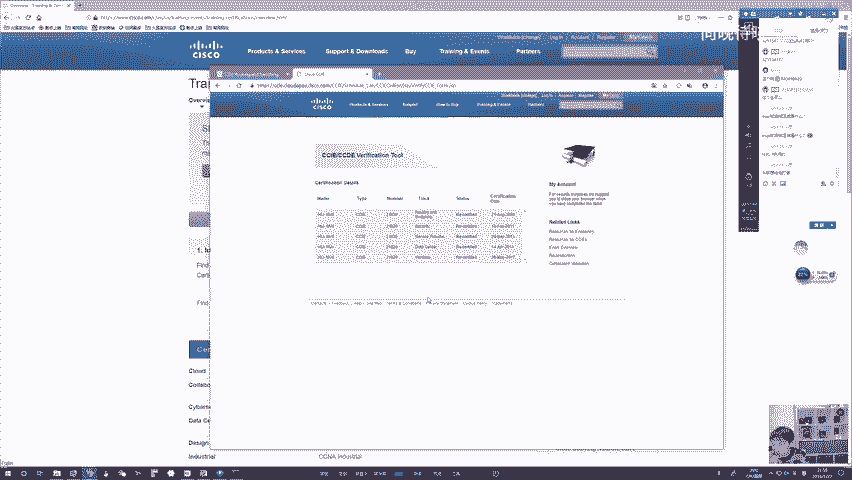

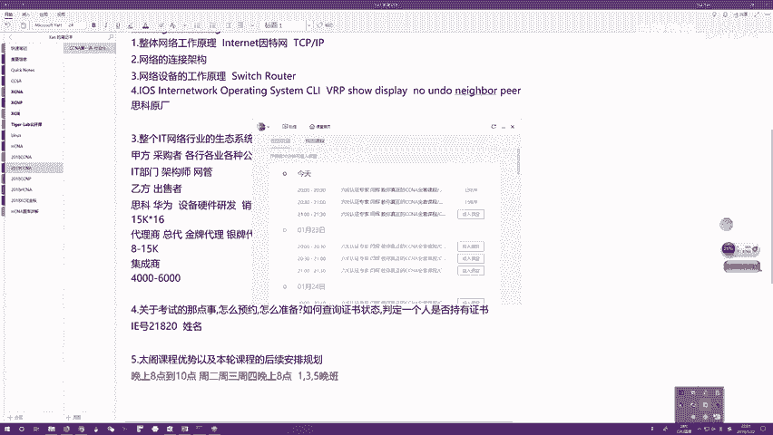

本节课中我们一起学习了网络工程师行业的基本情况、厂商认证体系的价值、CCNA课程的核心内容构成以及未来的职业发展路径。我们明确了学习技术的四部曲方法，并认识到“学”与“考”并重的重要性。网络是一个充满机遇的行业，通过系统学习和获取权威认证，你将具备改变职业轨迹的能力。从下一节课开始，我们将正式进入网络技术的具体学习。