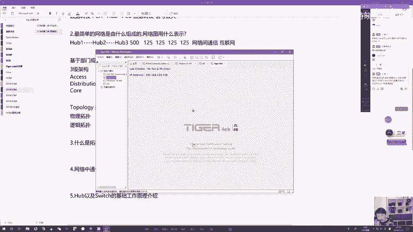
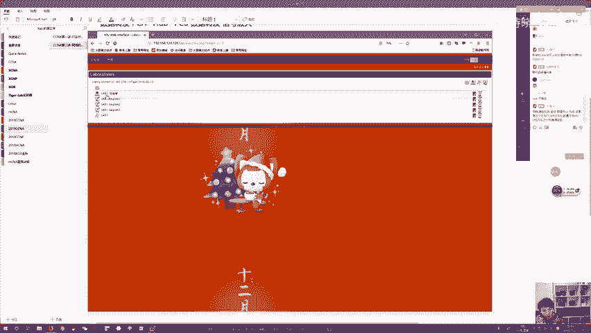
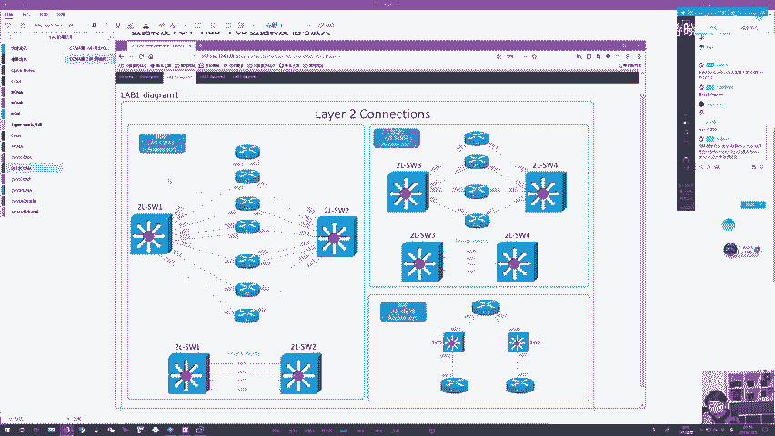
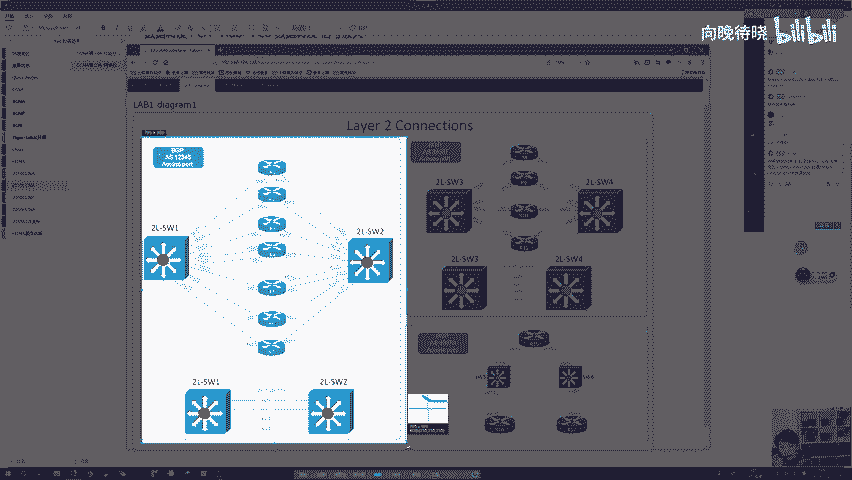
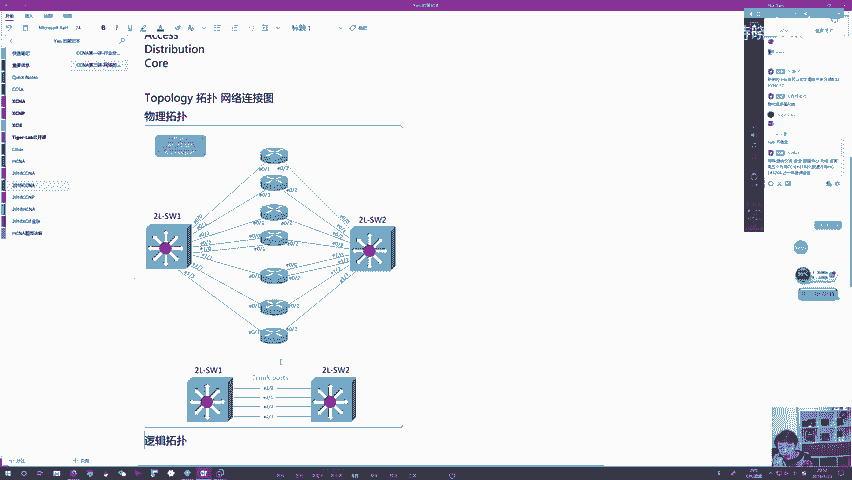
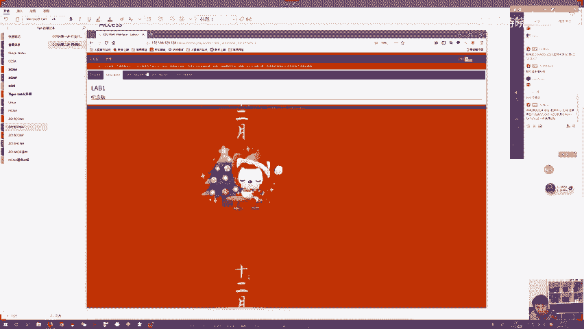
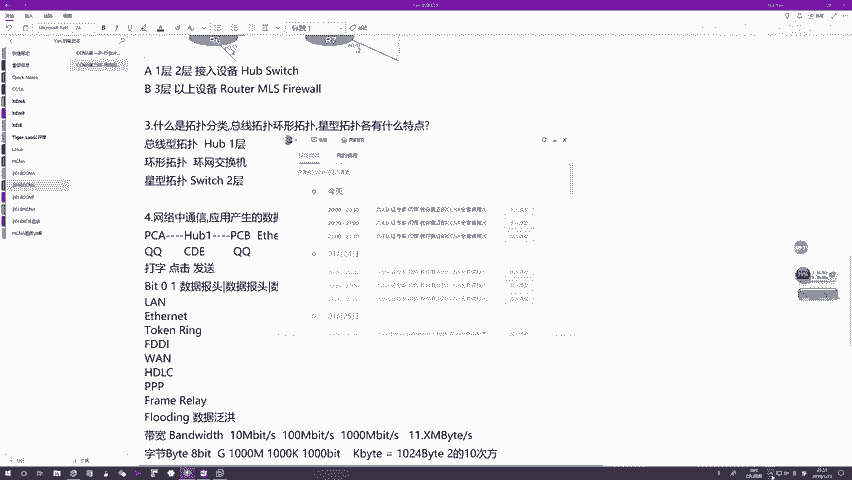

# CCNA教程合集：02：网络基础入门与设备原理 🚀

## 概述
在本节课中，我们将从零开始学习网络的基础知识。我们将了解什么是网络、网络如何组建、网络中的通信规则以及核心网络设备的定位和工作原理。课程内容力求简单直白，帮助初学者建立清晰的概念框架。

---

## 什么是网络？🌐
上一节我们介绍了行业生态和学习内容，本节中我们来看看网络的基础定义。

网络是一组设备组成的混合产物，主要作为数据流量的载体。数据流量通过网络从一个主机传输到另一个主机，最终实现资源共享。网络本质上是一个媒介，由各种设备连接而成，目的是方便数据在连接入网的设备之间交互。

组成网络的所有设备大体分为三大类：
*   **终端系统**：用户直接使用的设备，如个人电脑、手机。
*   **中间系统**：各式各样的网络设备。
*   **介质**：连接设备的线缆或无线信道。

网络为应用程序提供服务，而应用程序安装在终端系统上，因此网络最终是为用户服务的。

---

## 网络的三要素 🔧
了解了网络的定义后，我们来详细拆解其核心组成部分。

以下是组成网络的三个基本要素：

1.  **终端系统**
    *   定义：位于网络末端的设备，是网络的边界，由用户直接操作。
    *   作用：产生和消费数据，通过运行应用程序（如QQ、浏览器）实现具体的网络功能。
    *   示例：个人电脑（PC）、笔记本、智能手机。

2.  **介质**
    *   定义：数据传输的物理通道。
    *   作用：承载数据流量，是设备间通信的必经之路。
    *   类型：分为有线（如双绞线、光纤）和无线（如Wi-Fi）。现代网络通常采用“有线核心 + 无线接入”的混合架构，兼顾稳定性与灵活性。

3.  **中间系统（网络设备）**
    *   定义：部署在网络中间，用户通常接触不到的设备。
    *   作用：**连接**终端和**转发**数据，是网络扩展的关键。
    *   重要性：早期网络（如工作组）可以没有它们，但有了它们，网络的规模、覆盖范围和效率才能大幅提升。
    *   核心设备：在本课程中，我们主要研究**集线器 (Hub)**、**交换机 (Switch)** 和**路由器 (Router)**。

---

## 如何组建一个简单网络？🏗️
认识了网络组件后，本节我们来看看如何实际搭建一个网络。

最简单的网络组建方式是使用接入设备（集线器或交换机），通过线缆将办公室内的计算机连接起来。给计算机配置合理的设置（如IP地址）后，它们就能彼此通信。

当网络规模扩大（如一个房间有几十台电脑）时，可以用多台接入设备级联。但一个网络内的主机数量不宜过多（建议不超过200-300台），否则效率会下降。

对于更大规模的场景（如拥有多个部门、上千台电脑的企业），需要引入**路由器**。路由器可以将多个独立的网络连接起来，形成**互联网**，从而实现网络间的通信，同时保证每个内部网络的高效运行。

> **关键概念**：**英特网 (Internet)** 是全球最大的**互联网**，而非单一的“网络”。它由无数个通过路由器互联的小网络组成。

---

## 网络拓扑图 📐
设计网络时，我们需要一种方式来描述设备间的连接关系，这就是网络拓扑图。

网络拓扑图分为两类：

1.  **物理拓扑**
    *   定义：严格按照设备间物理连接的真实情况绘制的图纸。
    *   特点：包含所有设备（A类：一/二层设备，如集线器、交换机；B类：三层及以上设备，如路由器）和连线，非常详细，但也可能显得杂乱。

2.  **逻辑拓扑**
    *   定义：忽略部分物理细节（尤其是A类设备），着重描绘设备间逻辑通信关系的图纸。
    *   特点：通常只画出B类设备（如路由器），并用线表示它们之间“可以通信”。图纸更简洁，便于分析流量路径和排查故障。

此外，还有**拓扑分类**的概念，它根据网络的工作原理进行归类，例如**总线型**（使用集线器）、**星型**（使用交换机）、**环型**拓扑。

---

## 网络通信规则与协议 📜
设备连接好后，必须遵循统一的规则才能通信，这些规则称为协议。

应用程序产生的数据（称为**载荷**）不能直接发送。为了确保数据能正确送达目标主机并被正确的应用程序处理，必须在载荷前添加辅助信息，即**报头**。

至少需要两类报头：
1.  **地址信息报头**：包含**源地址**和**目的地址**，告诉网络设备“数据从哪来，到哪去”。网络设备（如路由器）主要查看这部分。
    *   公式：`数据包 = 地址报头 + 载荷`
2.  **端口信息报头**：包含**源端口**和**目的端口**，告诉目的主机“数据来自哪个应用，应交由哪个应用处理”。
    *   公式：`数据包 = 地址报头 + 端口报头 + 载荷`

协议是网络中的“交通法规”。**以太网协议**是当前最主流的局域网协议，它规定了在类似双绞线这样的介质上如何进行通信。

---

## 总线型网络与集线器原理 ⚙️
现在，让我们深入一种经典的网络类型——总线型网络，其核心设备是集线器。

**集线器**是一个**物理层（一层）** 设备，智能性很低。它采用**泛洪**方式工作：当从一个接口收到数据后，会复制多份，从**除接收接口外**的所有其他接口发送出去。

这种机制导致总线型网络存在严重问题：
*   **效率低下**：无关主机也会收到数据，浪费带宽和CPU资源。
*   **冲突频发**：集线器接口是**半双工**模式，同一时间只能单向传输。若多台主机同时发送，数据会碰撞产生**冲突碎片**，导致通信失败。

为了缓解冲突，以太网为总线型网络引入了**CSMA/CD（载波侦听多路访问/冲突检测）** 机制：
1.  **先听后发**：发送前先侦听链路是否空闲。
2.  **冲突检测**：发送中持续检测是否发生冲突。
3.  **冲突退避**：一旦检测到冲突，立即停止发送，并等待一段随机时间后重试。

尽管有CSMA/CD，但随着网络内主机增多，冲突概率仍会急剧上升，导致网络性能恶化。这是集线器和总线型网络被淘汰的根本原因。

> **带宽小知识**：带宽是描述网络速度的关键指标，单位是`比特/秒 (bps)`。常见的`100兆宽带`指的是`100Mbps`。而下载软件显示的`11MB/s`是`字节/秒`，`1字节=8比特`，且单位换算涉及`1000`和`1024`的差异，因此`100Mbps`的理论下载速度约为`12.5MB/s`左右。

---

## 总结
本节课中我们一起学习了网络的基础核心知识。

我们首先定义了网络作为数据载体和资源共享媒介的角色，并拆解了其三大要素：终端系统、介质和中间系统。接着，我们探讨了从小型办公室到大型企业网的不同组建思路，并学会了用物理和逻辑两种拓扑图来描述网络。

我们明确了网络通信必须遵循协议规则，数据需要添加地址和端口报头才能正确路由和处理。最后，我们深入剖析了以集线器为核心的总线型网络的工作原理，理解了其效率低下、易发冲突的缺陷，以及CSMA/CD机制如何试图缓解这些问题，这也为集线器被更先进的设备淘汰埋下了伏笔。

下一节，我们将学习集线器的升级版——交换机，看看它是如何解决冲突问题，并引领星型网络成为主流的。