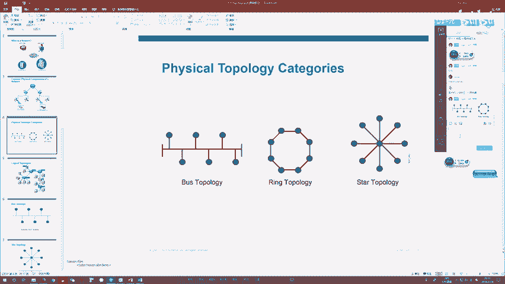
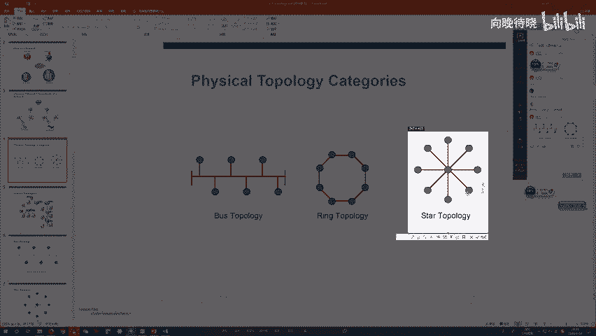
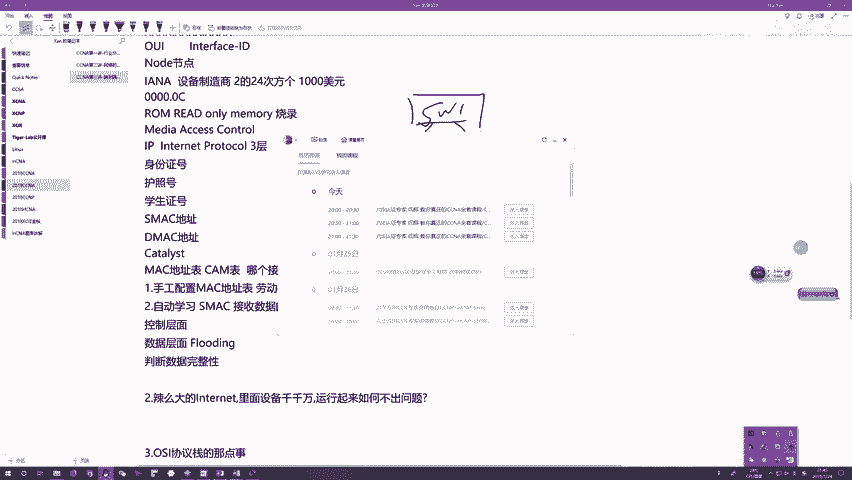

# CCNA教程合集：03：网络拓扑与交换机基础

在本节课中，我们将要学习网络拓扑的演进，特别是星型拓扑如何成为现代网络的主流，并深入理解以太网交换机的核心工作原理。

上一节我们介绍了网络的基本概念和拓扑类型，本节中我们来看看以太网交换机如何解决早期网络的缺陷，并构建出高效的星型网络。

## 以太网与地址体系

以太网协议定义了局域网通信的规则，其中最关键的两点是定义了**二层MAC地址**和**全双工通信模式**。

*   **MAC地址**：这是一个48比特（6字节）的全球唯一硬件地址，用于在网络内部标识一个网络接口。其格式通常表示为12个十六进制数，如 `0000.0C12.3456`。前24位是厂商代码（OUI），后24位由厂商分配。
*   **全双工模式**：允许设备在同一链路上同时发送和接收数据，这是现代网络应用（如在线游戏、视频通话）的基础。

**为什么有了MAC地址还需要IP地址？**
*   **MAC地址**用于**网络内通信**，标识同一局域网内的设备。
*   **IP地址**用于**网络间通信**，在全球互联网范围内唯一标识设备。这类似于你在学校用学号，在国内用身份证号，出国用护照号，在不同范围内使用不同的标识符。

## 交换机：星型网络的核心

星型网络使用以太网交换机作为中心设备连接所有计算机。交换机是一种智能的二层网络设备，其核心功能是学习MAC地址并实现数据的精确转发。

### 交换机的两大层面

研究交换机需要从两个层面理解：**控制层面**和**数据层面**。

1.  **控制层面**：负责“学习”网络是如何连接的。具体来说，就是构建和维护 **MAC地址表**。
2.  **数据层面**：负责根据已知的连接信息“转发”数据。

### MAC地址表与自学习机制

交换机的智能源于其内部的 **MAC地址表**。这张表记录了哪个MAC地址连接在它的哪个接口上。

**表示例：**
| 接口 | MAC地址 | VLAN |
| :--- | :--- | :--- |
| Fa0/1 | 0050.7966.6800 | 1 |
| Fa0/2 | 0000.0C12.3456 | 1 |

交换机通过 **自学习机制** 动态填充这张表，过程如下：

以下是交换机自学习MAC地址的基本步骤：
1.  **初始状态**：交换机启动时，MAC地址表为空。
2.  **接收帧**：当主机A（MAC_A）向主机B发送数据时，帧会进入交换机的接口Fa0/1。
3.  **学习源地址**：交换机会查看帧中的**源MAC地址（MAC_A）**，并将其与接收接口（Fa0/1）的绑定关系记录到MAC地址表中。
4.  **转发决策**：接着，交换机查看帧中的**目的MAC地址（MAC_B）**，并查询MAC地址表。
    *   如果找到对应条目（如MAC_B在Fa0/2），则进行**精确转发**，只将帧从Fa0/2发出。
    *   如果未找到对应条目，则进行**泛洪**，将帧从除接收接口外的所有其他接口复制并发送出去。

通过这个过程，交换机无需管理员手动配置，就能自动获知整个网络的连接拓扑。

### 交换机的优势

基于上述工作原理，交换机带来了革命性的优势：
*   **消除冲突**：交换机每个接口都是一个独立的冲突域，且工作在全双工模式，从根本上杜绝了冲突。
*   **高效转发**：基于MAC地址表进行精确转发，避免了像集线器那样的泛洪，极大提升了网络效率和带宽利用率。
*   **即插即用**：自学习机制使得网络部署和维护非常简单。

## 总结

本节课中我们一起学习了：
1.  星型拓扑和以太网交换机如何取代老旧的总线型和环形拓扑，成为现代网络的标准。
2.  理解了MAC地址和IP地址在不同通信范围中的作用。
3.  掌握了以太网交换机的核心：通过**控制层面**的自学习机制构建 **MAC地址表**，并在**数据层面**依据该表进行精确转发或必要的泛洪。
4.  认识到交换机通过**分割冲突域**和**支持全双工通信**，实现了高效、无冲突的网络环境，满足了当今所有网络应用的需求。

下一节，我们将探讨网络中不同类型的流量（单播、广播、组播）及其在交换网络中的传播方式。