# CCNA教程合集：07：IP协议详解与报文结构 📚

## 概述
在本节课中，我们将要学习网络层最核心的协议——IP协议。我们将重点了解IP协议的作用、IP报文的详细结构以及各个字段的功能，为后续学习路由交换技术打下坚实的基础。

---

## 回顾与引入
上一节我们详细讲解了OSI模型的下两层（物理层和数据链路层）。本节中，我们来看看网络层，特别是网络层中至关重要的IP协议。

网络工程师主要关注OSI模型的下四层，而网络层是其中的核心。网络层包含了许多协议，但最核心、最重要的就是IP协议。可以说，网络中80%的协议都与IP相关，后续要学习的路由选择协议（如OSPF、EIGRP、BGP）和各种VPN技术，其根源都是IP协议。因此，理解IP协议是学习网络技术的关键。

---

## IP协议的作用
网络存在的意义是让应用程序之间能够彼此通信。为了实现通信，数据包必须包含地址信息，以便网络设备（如路由器）知道数据从哪里来、要到哪里去，并进行正确的转发。

IP协议的核心作用就是定义了这个用于端到端标识主机的地址——**IP地址**。

*   **与二层地址（如MAC地址）的区别**：MAC地址只能在同一个局域网内标识主机。不同的网络可能使用不同的二层协议（如以太网、帧中继），导致MAC地址无法跨网络使用。而IP地址是独立于二层协议的，只要设备支持三层功能，就能拥有IP地址，从而实现跨网络的端到端通信。
*   **类比**：可以将MAC地址比作身份证（在国内有效），将IP地址比作护照号（在全球有效）。IP地址使得无论主机在哪个网络，都能被唯一标识并相互通信。

因此，IP协议主要定义了两件事：
1.  **三层地址（IP地址）**：用于唯一标识网络中的主机。
2.  **三层封装报头的格式**：规定了数据在网络层应该如何被封装，以便网络设备能够正确解析和转发。

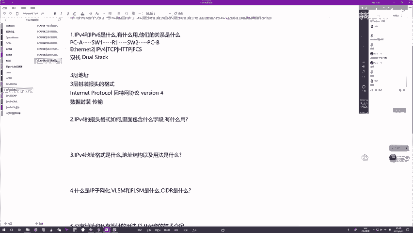

---

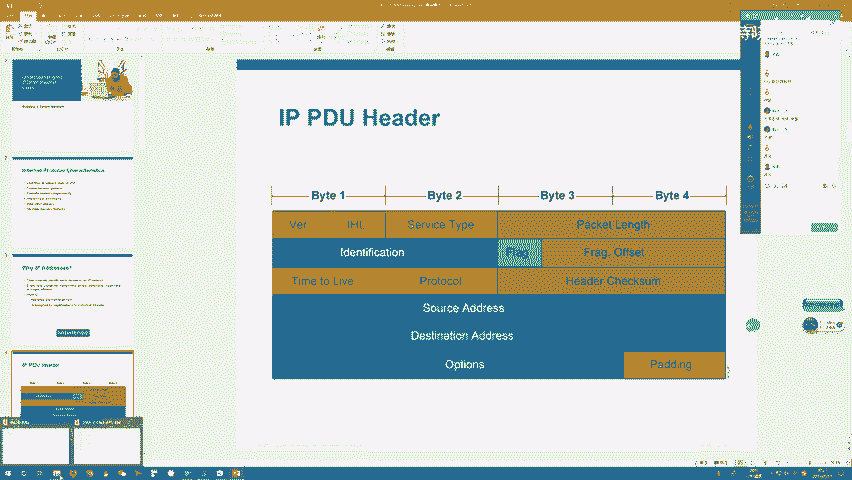

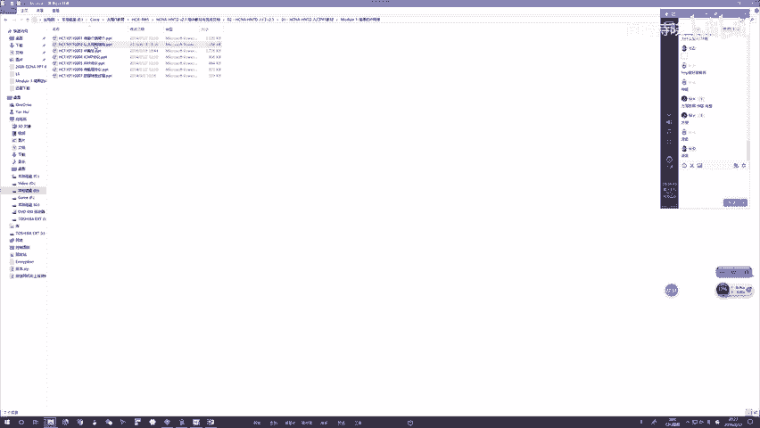

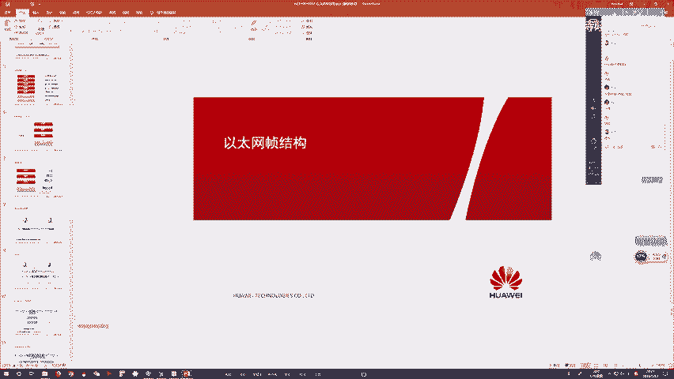

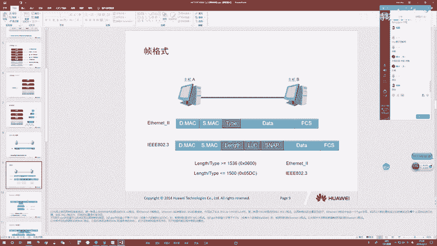

## IP协议版本：IPv4与IPv6
IP协议的全称是Internet Protocol。我们常说的IPv4指的是该协议的第4版。

*   **IPv6**：是IPv4的升级版本，在地址空间、安全性、效率等方面都更优，是未来的发展趋势（大势所趋）。
*   **现状**：目前网络仍以IPv4为主流，但正在向IPv6过渡。许多网络采用“双栈”模式，即设备同时支持IPv4和IPv6。
*   **本课重点**：由于当前IPv4仍是主流，且CCNA认证主要考察IPv4，因此本节课我们将专注于IPv4的讲解。

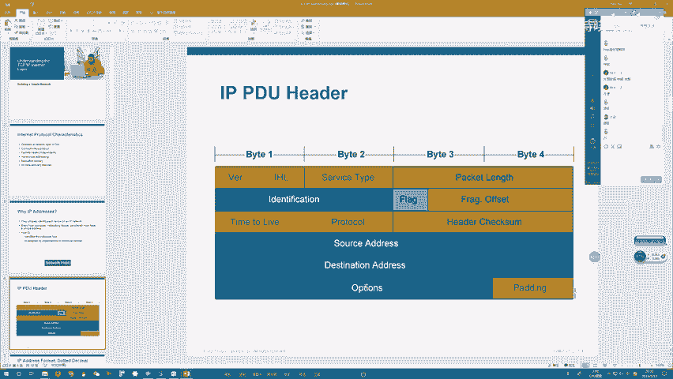

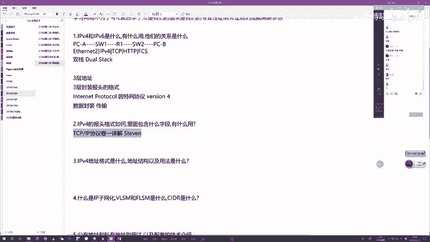

---

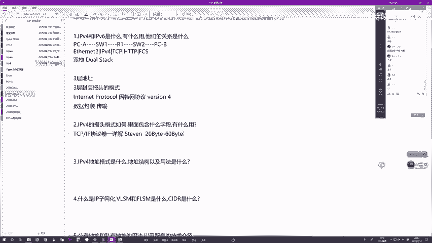

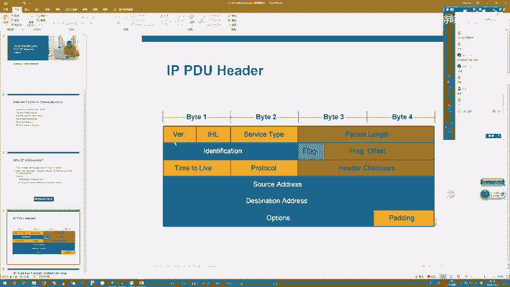

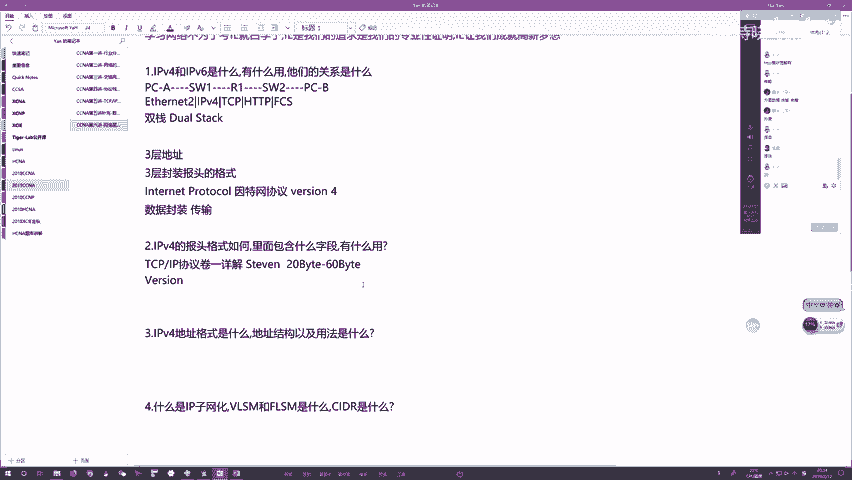

## IPv4报文头格式详解
数据封装是网络通信的基础。封装的目的之一就是在应用数据前添加报头，其中包含关键的地址信息。**三层封装（IP报头）** 中包含了源和目的IP地址，这是实现跨网络通信的核心。

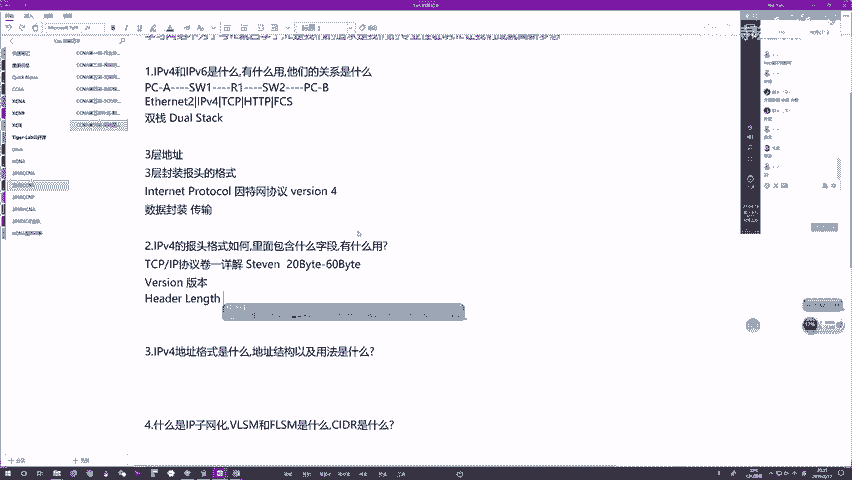

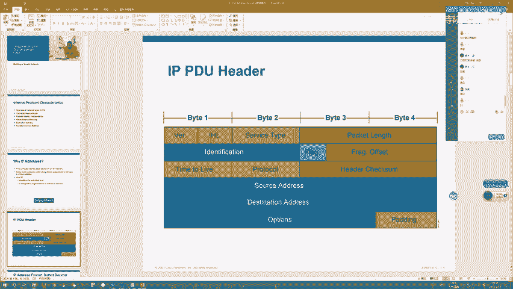

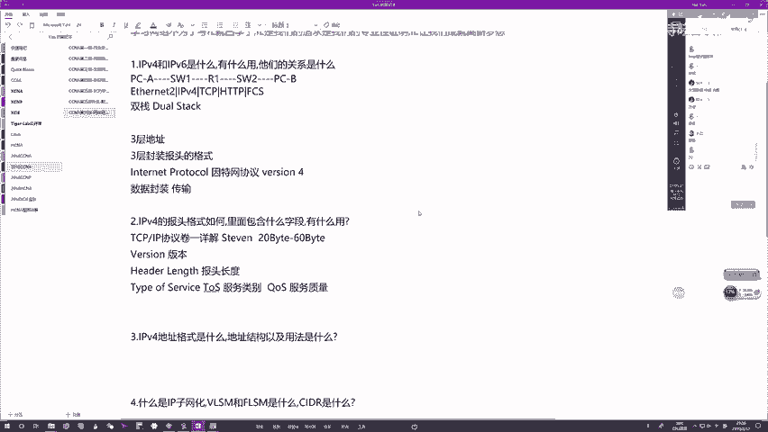

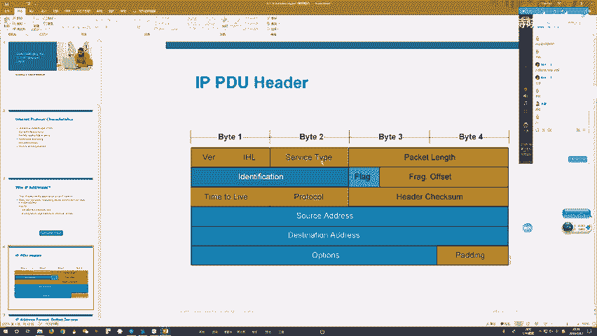

IPv4报文头长度可变（20-60字节），通常我们关注其**20字节的固定报头（主报头）**。可选项字段一般用于高级功能（如网络测试、攻击），普通通信中不常用。

以下是IPv4主报头（20字节）的详细结构，我们将按顺序解析每个字段：

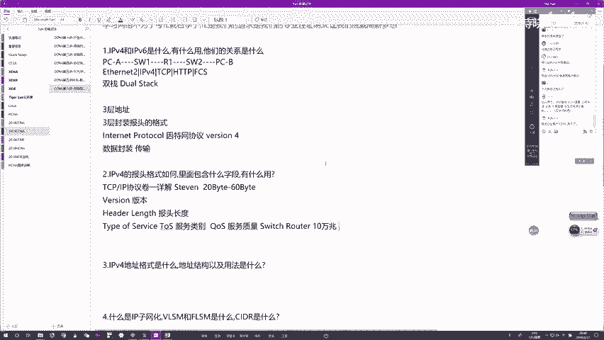

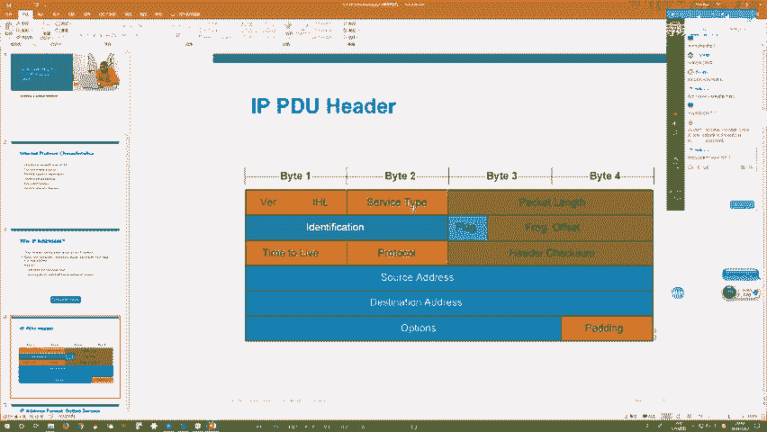

### 1. 版本 (Version - VER)
*   **作用**：指明IP协议的版本。对于IPv4，此字段值固定为 `4`。
*   **长度**：4比特。

### 2. 首部长度 (Internet Header Length - IHL)
*   **作用**：指明整个IP报头的长度（以4字节为单位）。因为IP报头长度可变（可能包含可选项），需要此字段来界定报头结束和负载开始的位置。
*   **常见值**：当没有可选项时，报头长度为20字节，此字段值为 `5` (20 ÷ 4 = 5)。
*   **长度**：4比特。

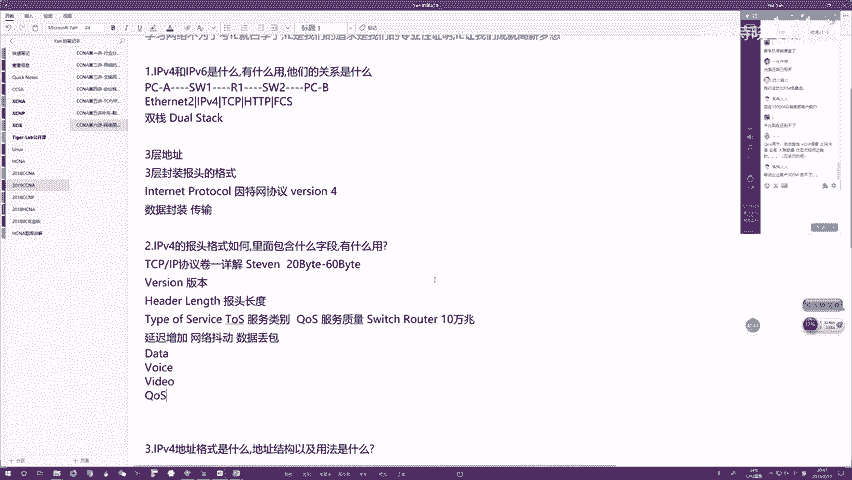

### 3. 服务类型 (Type of Service - ToS)
*   **作用**：用于标识数据包的优先级或服务类别，主要为实现**服务质量 (QoS)**。
*   **QoS背景**：企业内网带宽高，但连接互联网的外网带宽有限。当网络拥塞时，需要对不同类型的流量区别对待（如语音、视频对延迟敏感，电子邮件对延迟不敏感）。
*   **工作原理**：通过此字段给不同应用的数据包打上不同的标记值。网络设备根据标记值，在拥塞时优先转发高优先级的流量（如语音），延迟转发低优先级的流量（如邮件）。
*   **长度**：8比特。

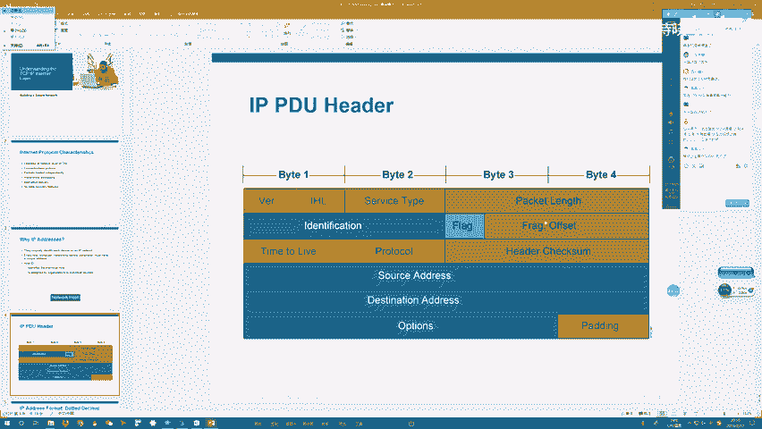

### 4. 总长度 (Total Length)
*   **作用**：定义整个IP数据包（包括报头和负载）的总长度，单位为字节。
*   **长度**：16比特。

### 5. 标识符 (Identification)
*   **作用**：用于**IP分片和重组**。当数据包过大，需要被拆分成多个“分片”传输时，所有属于同一个原始数据包的分片，其标识符字段的值相同。接收方根据此值将分片归类，以便重组。
*   **长度**：16比特。

### 6. 标志 (Flags)
*   **作用**：同样是用于IP分片控制的字段，包含3个比特。
    *   **第一位**：保留未用，恒为0。
    *   **DF位 (Don‘t Fragment)**：置为 `1` 时，表示不允许路由器对此数据包进行分片。如果数据包太大无法转发，则会被丢弃。此位可用于**路径MTU发现**。
    *   **MF位 (More Fragments)**：置为 `1` 时，表示当前分片不是原始数据包的最后一个分片；置为 `0` 时，表示是最后一个分片。
*   **长度**：3比特。

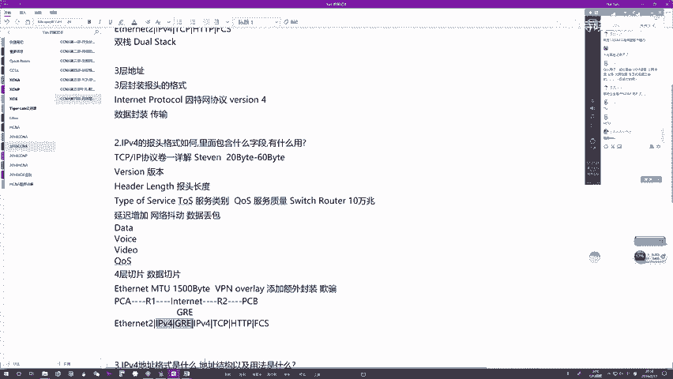

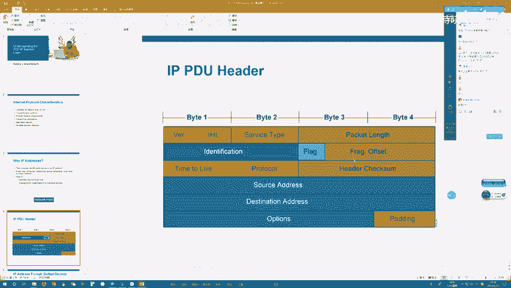

### 7. 片偏移 (Fragment Offset)
*   **作用**：用于IP分片重组。它指明了当前分片在原始数据包中的起始位置（以8字节为单位）。接收方根据此字段对乱序到达的分片进行正确排序。
*   **长度**：13比特。

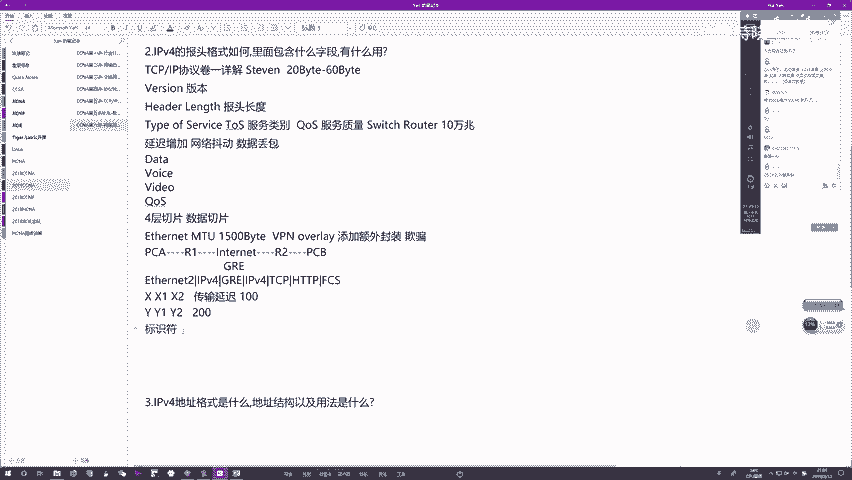

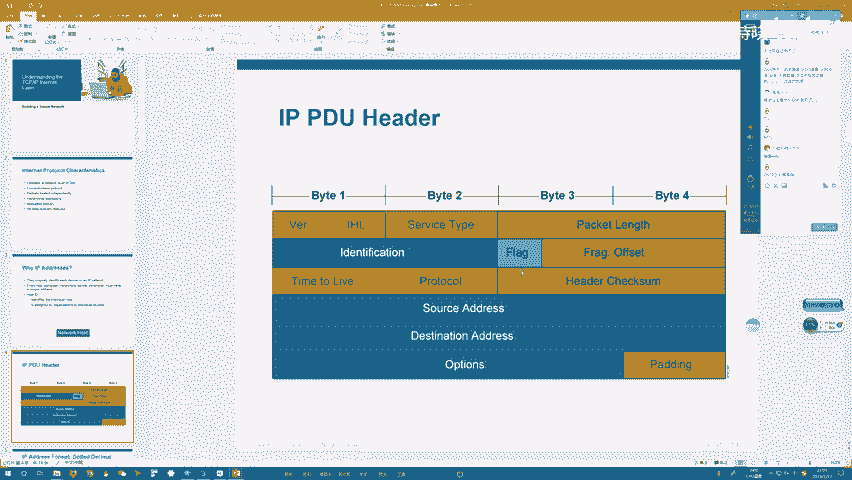

**关于IP分片的总结**：标识符、标志、片偏移三个字段共同协作，完成了IP层的数据分片与重组功能。分片会消耗设备资源并可能加剧拥塞，应尽量避免。

### 8. 生存时间 (Time to Live - TTL)
*   **作用**：防止数据包在网络中无限循环（路由环路）。该值定义了数据包在被丢弃前最多能经过多少台**三层设备（跳数）**。
*   **工作原理**：每经过一台路由器，TTL值减1。当TTL值减为0时，路由器将丢弃该数据包，并向源端发送错误消息。
*   **取值范围**：0-255。实际网络中，任意两点间跳数远小于255。
*   **长度**：8比特。

### 9. 协议 (Protocol)
*   **作用**：标识IP负载部分所使用的**上层协议**。接收方根据此字段的值，将解封装后的数据交给相应的上层协议处理。
*   **常见协议号**：
    *   `1` -> ICMP
    *   `6` -> TCP
    *   `17` -> UDP
    *   `88` -> EIGRP
    *   `89` -> OSPF
*   **类比**：类似于以太网帧中的“类型”字段，用于标识上层协议。
*   **长度**：8比特。

### 10. 首部校验和 (Header Checksum)
*   **作用**：用于检查IP报头在传输过程中是否出现错误（如比特翻转）。发送方计算校验和，接收方验证。如果校验失败，数据包将被丢弃。
*   **注意**：此校验和只针对IP报头，不校验数据部分。
*   **长度**：16比特。

### 11. 源IP地址 (Source IP Address)
*   **作用**：标识发送数据包的主机的IP地址。
*   **长度**：32比特。

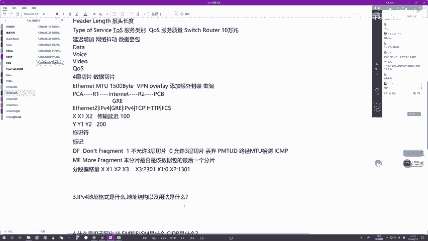

### 12. 目的IP地址 (Destination IP Address)
*   **作用**：标识接收数据包的目的主机的IP地址。**路由器主要根据此字段来查询路由表，决定如何转发数据包。**
*   **长度**：32比特。

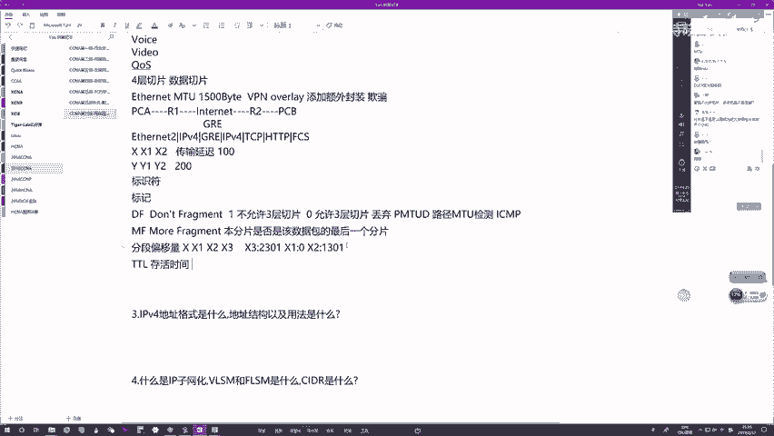

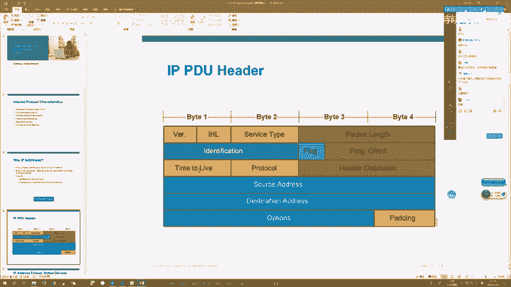

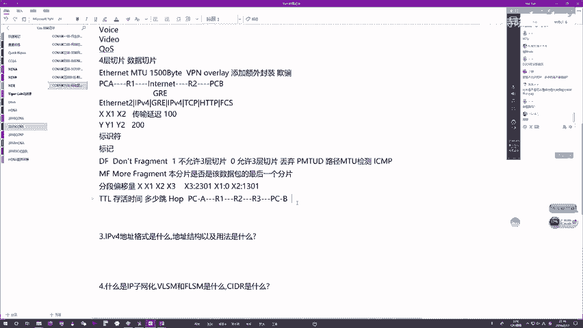

**关于路由器处理报文的补充**：路由器只有在数据链路层帧的目的MAC地址是自己接口的MAC地址时，才会拆开二层封装，查看三层IP报头。因此，PC需要配置网关，将去往外网的数据帧发给网关路由器。

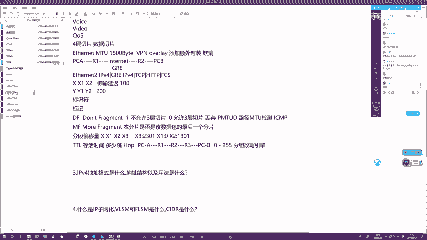

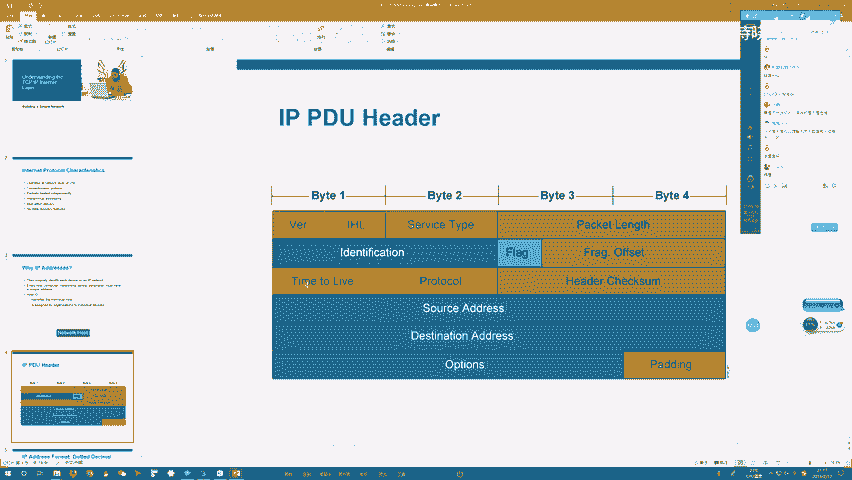

---

## 核心概念总结
*   **路由 (Route)**：指路由器去往某个目的网络的路径信息。
*   **路由表**：路由器中存储的所有路由信息的集合。
*   **路由协议**：用于在路由器之间动态交换路由信息，自动生成路由表的协议（如OSPF）。没有路由协议，路由器只知道直连的网络。

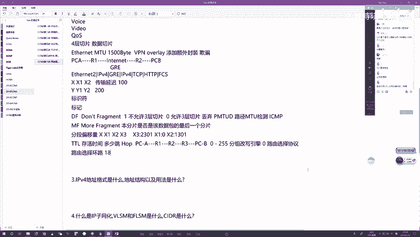

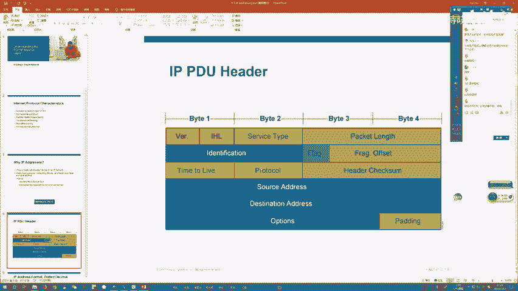

---

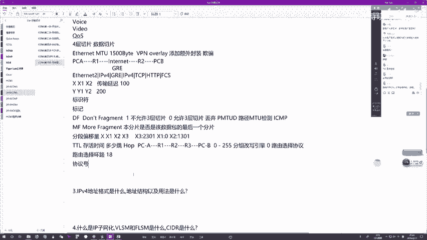

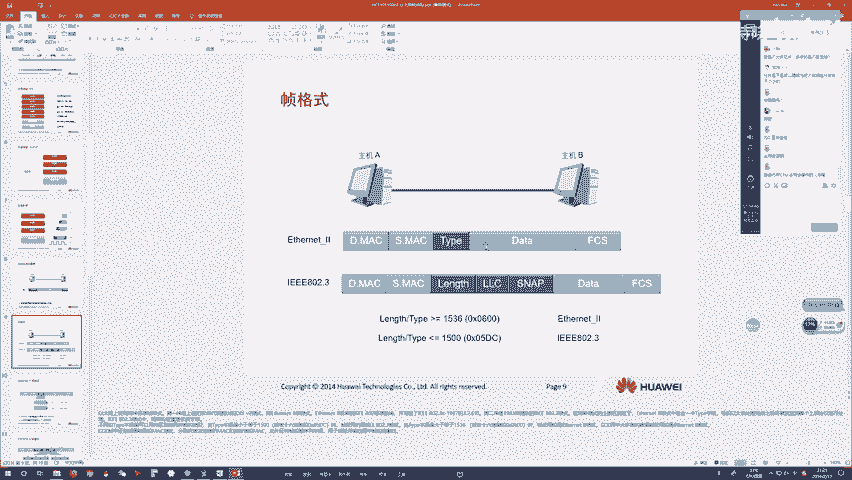

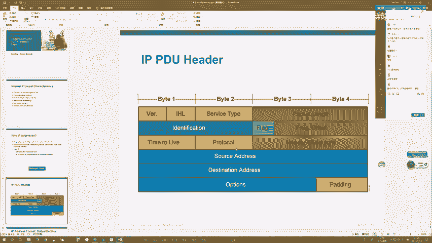

## 下节预告与学习建议
本节课我们详细剖析了IPv4报文头的结构和每个字段的含义。IP协议另一个核心——**IP地址编址与子网划分**——内容非常丰富且重要。

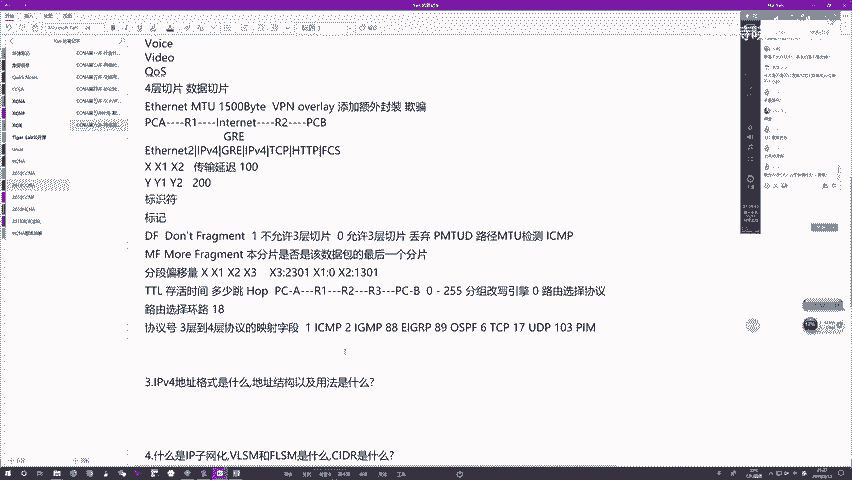

**学习建议**：请大家在课后预习IP地址和子网划分的相关内容，特别是**子网划分**。理解子网划分是掌握IP地址规划、进行网络设计的基础。大家可以联系课程顾问获取往期公开课视频进行预习。

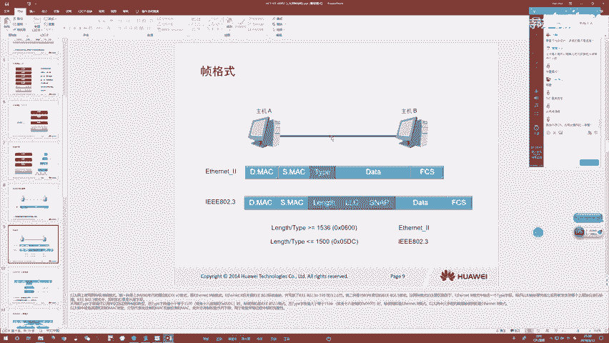

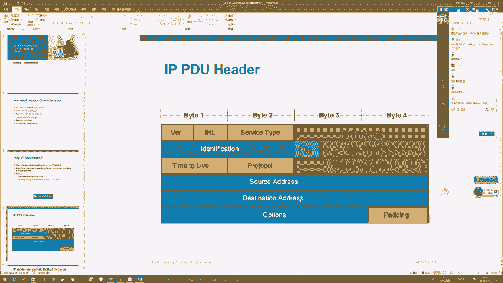

我们将在下节课（周四晚8点）深入讲解IP地址、子网掩码、子网划分等核心内容。

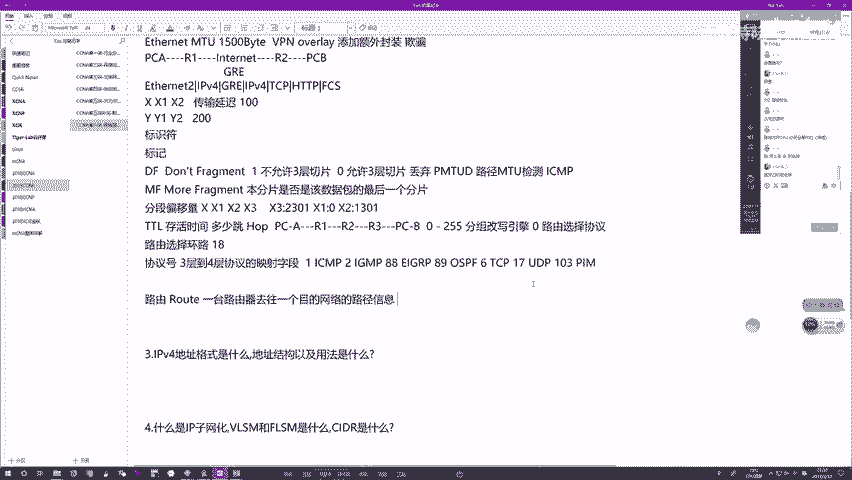

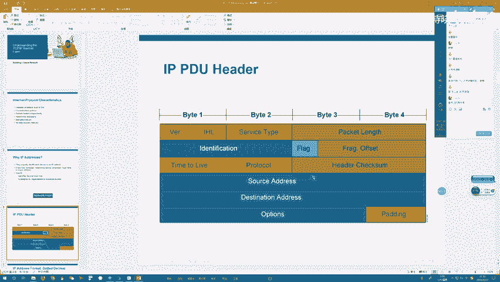

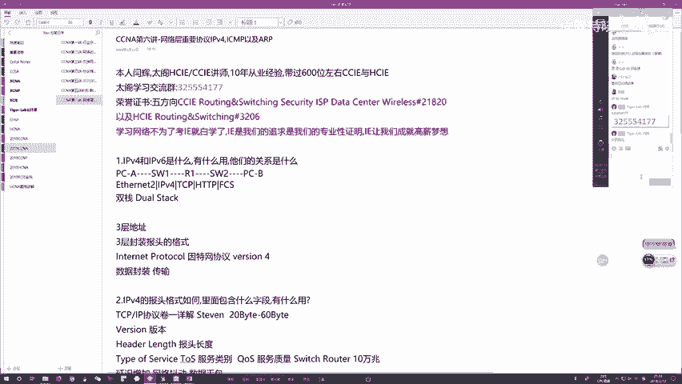

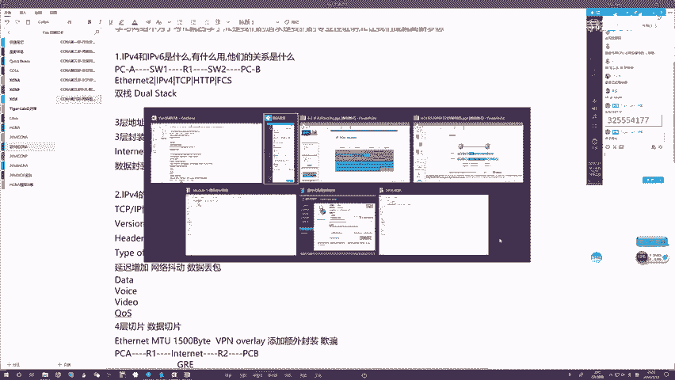

---

## 总结
本节课我们一起学习了：
1.  **IP协议的核心作用**：定义了三层IP地址和封装格式，是实现端到端通信的基石。
2.  **IPv4与IPv6的关系**：IPv6是更先进的版本，目前网络处于IPv4向IPv6过渡的双栈时期。
3.  **IPv4报文头12个字段的详细功能**：
    *   版本、首部长度、总长度（基础信息）
    *   服务类型（用于QoS）
    *   标识符、标志、片偏移（用于分片与重组）
    *   生存时间（防止路由环路）
    *   协议号（标识上层协议）
    *   首部校验和（检错）
    *   源IP地址、目的IP地址（通信的起点与终点）

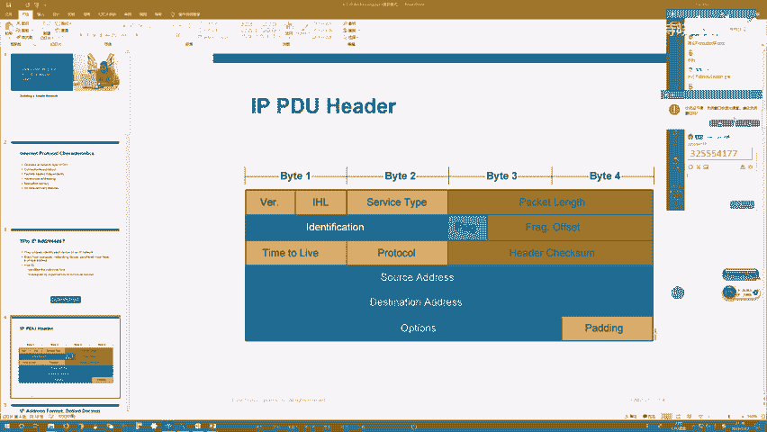

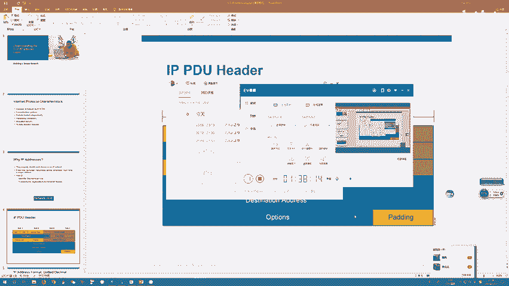

理解IP报文结构是理解后续所有路由协议和数据转发原理的基础。虽然内容有些枯燥，但这是成为合格网络工程师必须掌握的基本功。