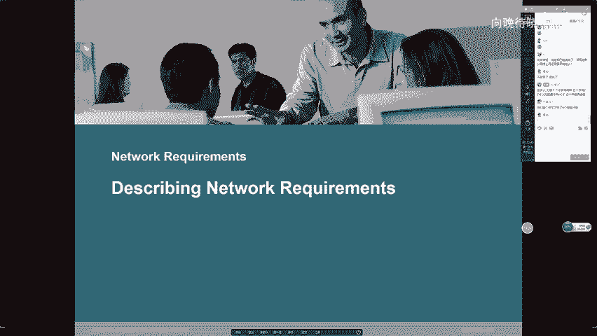
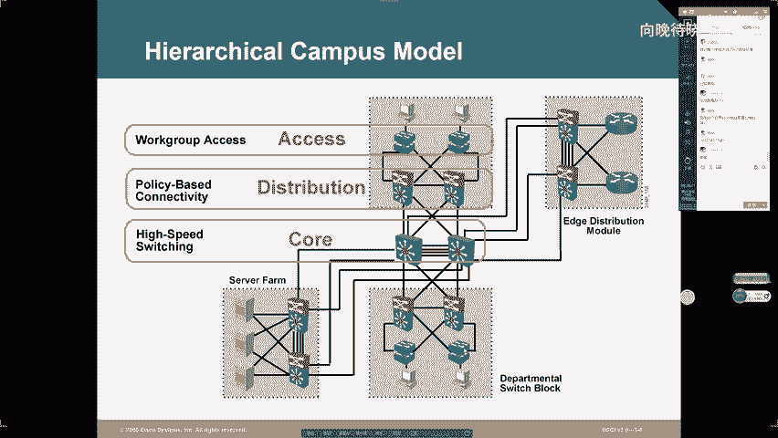
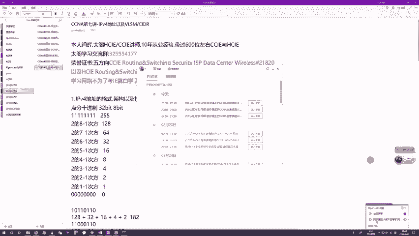

# CCNA教程合集：P9：IPV4进阶、私有地址与NAT、ICMP与ARP详解

## 📚 概述
在本节课中，我们将深入学习IPV4的剩余核心内容。我们将探讨子网化的根本目的、IPV4地址枯竭的现状及其解决方案——私有地址与NAT技术。同时，我们还将介绍网络层两个至关重要的辅助协议：ICMP和ARP，理解它们如何保障网络的连通性与通信效率。

---

## 🔍 上一节回顾：IPV4子网化
上一节我们介绍了IP地址的架构、网络位与主机位的概念，以及ABCDE类地址。我们还讲解了子网化技术。

本节中，我们来看看子网化的根本目的及其局限性。

### 子网化的目的与局限性
IPV4子网化是为了节约地址。购买一个主类地址段后，若将所有地址分配给单一网络，会造成大量地址浪费。由于IPV4地址总数有限（约42亿，其中仅约一半为单播地址），必须通过借位将一个主类地址段划分为若干子网，分配给不同网络，以节约地址并避免冲突。

然而，子网化本身也会造成地址浪费。每划分一次，每个子网段中的全零（网络地址）和全一（广播地址）地址不可用，划分次数越多，浪费的地址也越多。更重要的是，即使通过子网化极致节约，IPV4地址总量也无法满足互联网设备的爆炸式增长。根据统计，全球IPV4公网地址池已于2013年2月宣告耗尽。

---

## 🌐 IPV4地址枯竭的应对方案
既然地址总量不足，而互联网仍在持续扩展，我们必须改变地址使用规则。

### 从“一对一”到“一对多”：公有地址与私有地址
早期规则是一个节点使用一个全球唯一的IP地址（公有地址），以避免冲突。为解决地址不足问题，IETF在RFC1918中定义了**私有地址**。

*   **公有地址**：需要购买或租赁，保证全球唯一性，用于互联网核心（如运营商网络、数据中心服务器）。
*   **私有地址**：无需成本，可在内网（如企业、家庭园区网）自由使用，但无法保证全球唯一性。

当前，绝大多数新增的互联网终端（企业内主机、个人设备）都使用私有地址。这使得无论内网主机数量如何增长，对公有地址的消耗都极其有限，从而延续了IPV4的使用寿命。

### 南北流量与东西流量
要理解私有地址的使用场景，需先了解园区网的流量类型。

*   **南北走向流量**：指内网主机访问外网（如互联网服务器）的流量，以及返回的流量。这是上网行为的主体。
*   **东西走向流量**：指同一内网中，主机之间的相互访问流量。

私有地址主机在进行东西流量通信时没有问题，但在进行南北流量通信时会遇到障碍：数据包能出去，但回不来。原因是公网服务器无法将回应包正确送达一个全球不唯一的私有地址。

---

## 🔧 NAT/PAT：私有地址访问公网的关键
为了让使用私有地址的内网主机能够访问互联网，必须在园区网的边界设备（路由器或防火墙）上部署**网络地址转换**技术。

### NAT/PAT工作原理
1.  **出向转换**：当内网私有地址主机发送的数据包到达边界设备时，设备将其源IP地址从私有地址转换为一个公有地址，并记录该转换关系。
2.  **公网路由**：转换后的数据包以公有地址身份在互联网中路由，到达目的服务器。
3.  **入向转换**：服务器回应的数据包目的地址是该公有地址。当回应包到达边界设备时，设备根据之前记录的转换关系，将目的地址转换回原始的私有地址，并转发给内网主机。

通过这种方式，内网主机得以访问公网资源。**PAT（端口地址转换）** 是NAT的增强版，它允许使用**一个**公有IP地址，通过不同的端口号来区分内网**成千上万**台主机，实现了极致的地址复用。

`内网主机(私有IP) <-> 边界设备(NAT/PAT) <-> 公网服务器(公有IP)`

### NAT带来的影响
NAT打破了**端到端地址一致性**原则，使得通信变得不对称：
*   **内网主机可以主动访问公网服务器**。
*   **公网服务器无法主动访问内网主机**（因为不知道其对应的公有地址和端口）。

这种不对称性催生了专线、MPLS VPN、IPSec VPN等昂贵或复杂的技术，以实现不同私有地址园区网之间的互访。

---

## 🚀 IPV6：未来的解决方案
IPV4的根源问题在于32位的地址空间太小。最终的解决方案是迁移到**IPV6**。

### IPV6的核心优势
1.  **海量地址空间**：128位地址长度，地址数量为2^128个，几乎是无限的。
    `地址总数对比：IPv6 / IPv4 = 2^128 / 2^32 = 2^96`
2.  **回归对等通信**：地址充足，无需大量使用NAT，有望恢复端到端的对等通信。
3.  **协议栈优化**：报头更简洁，并原生集成IPsec、移动性支持等增强功能。

尽管面临运营商传统利益（如专线业务）等迁移阻力，但在全球范围内，向IPV6的迁移已是大势所趋，预计在未来几年内将加速普及。

---

## 🛠️ 网络层辅助协议详解
当前网络仍以IPV4为主流，其稳定运行离不开两个重要的辅助协议。

### ICMP：互联网控制报文协议
ICMP是一个工具集，用于辅助IPV4进行网络诊断和管理。其主要功能可分为三类：

以下是ICMP的三大功能类型及典型工具：

1.  **测试工具**
    *   **Ping**：测试双向连通性。发送`ICMP Echo Request`（类型8），接收`ICMP Echo Reply`（类型0）则表明连通。
    *   **Traceroute**：跟踪数据包路径。通过发送TTL递增的UDP包，并接收沿途路由器返回的`ICMP Time Exceeded`报文，逐跳显示路径。

2.  **差错报告工具**
    当路由器无法转发数据包时，会向源端发送ICMP差错报文，例如：
    *   `Destination Network Unreachable`：目的网络不可达（无路由）。
    *   `Destination Host Unreachable`：目的主机不可达（ARP解析失败）。
    *   `Protocol Unreachable`：协议不可达。
    *   `Port Unreachable`：端口不可达。

3.  **路径优化工具**
    *   **重定向 (Redirect)**：当路由器发现主机使用的并非最优下一跳时，会发送`ICMP Redirect`报文，告知主机更优的网关地址。

### ARP：地址解析协议
在以太网中，通信需要知道对方的MAC地址。ARP用于动态地将**IP地址解析为MAC地址**。

#### ARP工作流程
1.  主机A想与同网段的主机B通信，但不知道B的MAC地址。
2.  A在本网段内**广播**发送ARP请求报文，内容为：“我是IP_A/MAC_A，谁是IP_B？请告诉MAC_B。”
3.  网内所有主机收到请求，但只有B会响应。B**单播**回复ARP应答报文：“我是IP_B，我的MAC地址是MAC_B。”
4.  A收到应答，将IP_B到MAC_B的映射存入本地**ARP缓存表**，随后便可封装数据帧进行通信。

#### 高级ARP特性
*   **代理ARP**：当主机未配置网关，且欲访问外网主机时，网关路由器可以“冒充”目的主机回应ARP请求，将自己的MAC地址告知源主机，从而代为转发数据。
*   **免费ARP**：主机在获取IP地址（尤其是通过DHCP）后，会主动广播一个以自己IP地址为目标的ARP请求。若无冲突，则无响应；若收到应答，则说明地址冲突，需要重新获取。

---

## 📝 总结
本节课我们一起深入学习了IPV4地址规划的核心思想与实践。我们了解到子网化旨在节约地址，但无法解决根本的数量危机；私有地址与NAT/PAT技术的结合，通过地址复用巧妙地延续了IPV4的生命，但也带来了通信不对称等新问题。而IPV6以其近乎无限的地址空间，是解决这些问题的根本方向。最后，我们探讨了ICMP和ARP这两个关键的网络层辅助协议，它们分别是网络连通性的“诊断师”和局域网通信的“翻译官”，对于网络排错和日常通信至关重要。

---
*教程内容整理自公开课《CCNA09 - 向向向晚o》，仅供学习交流。*