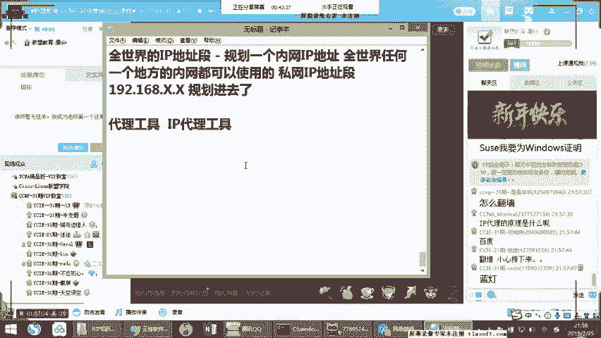

# 思科认证CCNA网络技术：第1节：网络基础扫盲预科 🧭

在本节课中，我们将学习网络技术中最基础、最核心的概念。我们将从零开始，扫清你对网络的各种疑惑，建立一个清晰的层次化认知框架。无论你是完全的初学者，还是对某些概念感到模糊，这节课都将为你打下坚实的基础。

## 模拟器准备 🛠️

在开始动手练习之前，我们需要准备好实验环境。以下是两种主流的网络模拟器，它们可以让我们在电脑上模拟真实的网络设备进行配置和实验。

*   **小凡模拟器**：这是GNS3模拟器的前身，界面相对简单。在课程前期的基础实验中，我们将主要使用它。安装时，如果你的操作系统是Win7及以上版本，需要配合安装WinPcap 4.1.2或更高版本，以确保网络通信正常。
*   **EVE-NG模拟器**：这是一个功能更强大的模拟器，集成在Linux系统中。它支持更多类型的设备镜像，如IOL（IOS on Linux）。在课程后期进行包含40-50台设备的大型综合实验时，我们会用到它。

对于电脑配置，前期实验要求不高。中后期进行复杂实验时，建议内存至少为8GB，最好能达到16GB，CPU为i3级别或以上即可。

## 认识身边的网络 🌐

上一节我们准备好了工具，现在让我们看看网络在我们身边以哪些形态存在。你可能会听到很多术语，我们先来对它们进行一个初步的归类。

*   **无线网络**：主要分为室内和室外覆盖。
    *   **3G/4G/5G**：属于移动通信标准，主要用于室外的广域无线覆盖。
    *   **Wi-Fi**：属于无线局域网标准，主要用于室内的局部无线覆盖。家庭常用无线路由器，而企业级环境则会使用更稳定、功能更强的无线AP（接入点）和AC（无线控制器）解决方案。
*   **有线接入方式（演进史）**：
    *   **1.0 窄带时代**：使用电话线通过Modem（猫）拨号上网，上网时电话无法打入。
    *   **2.0 宽带时代**：依然是电话线，但升级为ADSL技术，使用PPPoE协议拨号，可以实现上网、通话同时进行。
    *   **3.0 光网时代**：网线或光纤直接入户。目前主流是**光纤入户**，通过**光猫**进行光电转换，再使用PPPoE拨号获得高速网络。
*   **企业网络服务**：
    *   **企业带宽**：用于普通办公上网。分为上下行不对等的ADSL和上下行对等的固定带宽。后者通常伴有固定公网IP，适用于有对外服务（如网站、视频会议）的企业。
    *   **企业专线**：如MSTP、MPLS专线，主要用于连接企业的总部与分支机构，保障内部数据（如语音、视频会议）稳定、高效互通，与访问互联网无关。
    *   **VPN**：虚拟专用网络。企业除了购买专线，也可以通过互联网搭建VPN，来实现分支机构的安全互联。

## 网络的核心划分：局域网 vs. 广域网 🗺️

无论网络形态如何变化，从结构上看，所有网络都可以归结为两种基本类型：局域网和广域网。

*   **局域网**：通常指一个局部地理范围内的网络，比如一个家庭、一个办公室、一栋楼。**它的核心设备是交换机**，用于连接**相同IP网段**内的设备。例如，你和室友在宿舍用交换机联机打游戏，就是一个典型的局域网。
*   **广域网**：连接不同地理位置的局域网，构成更大范围的网络，最典型的例子就是互联网。**它的核心设备是路由器（或具备路由功能的设备）**，负责在不同IP网段之间转发数据。例如，你用电脑访问百度的网站，数据就需要通过路由器进行跨网段转发。

简单来说：**同网段通信，找交换机；跨网段通信，找路由器**。

## 数据转发的秘密：MAC地址与IP地址 🔑

既然知道了局域网和广域网的区别，那么它们各自是依靠什么来转发数据的呢？这是理解网络通信的关键。

*   **局域网转发：依靠MAC地址**
    *   **MAC地址**是设备的“物理地址”或“硬件地址”，通常烧录在网卡芯片中，理论上全球唯一。
    *   交换机内部维护着一张 **`MAC地址表`** ，记录了每个端口连接着哪个MAC地址的设备。当数据在局域网内传递时，交换机会查看数据帧中的目的MAC地址，然后根据这张表将数据从正确的端口转发出去。
    *   公式表示：`局域网通信 = 交换机 + MAC地址表`

*   **广域网转发：依靠IP地址**
    *   **IP地址**是设备的“逻辑地址”，可以手动配置或通过DHCP协议自动获取。它是网络层的标识。
    *   路由器内部维护着一张 **`路由表`** ，这张表就像地图，告诉路由器“要去往某个IP网段，应该从哪个接口走”。
    *   当数据需要跨网段传输时，路由器会检查数据包中的目的IP地址，查询路由表，决定转发路径。
    *   公式表示：`跨网段通信 = 路由器 + 路由表（IP地址转发表）`

## 设备的本质：它们都是计算机 💻

你可能觉得路由器、交换机很神秘，但实际上，它们的核心架构和你的电脑、手机、服务器没有本质区别。

无论是PC、服务器、手机还是网络设备，都包含**CPU、内存、存储器和网卡**这些核心组件。它们的区别主要在于：
*   **设计目标不同**：家用设备追求**速度**，商用设备（服务器、网络设备）追求**稳定性和可靠性**。
*   **操作系统不同**：家用PC多用Windows；服务器和网络设备则多采用**Linux/Unix**及其衍生系统（如思科的IOS就是基于Unix开发的）。

了解这一点有助于破除对高端网络设备的神秘感。许多网络功能（如软路由）完全可以用一台安装特定软件的普通PC来实现。

## 总结 📚

本节课中我们一起学习了网络世界的入门知识。我们首先准备了实验工具——小凡和EVE模拟器。然后，我们梳理了生活中常见的各种网络形态，包括无线网络、有线接入的演进以及企业级服务。接着，我们抓住了网络最核心的划分：**局域网（LAN）** 和 **广域网（WAN）**，并理解了交换机处理同网段通信、路由器处理跨网段通信的核心原则。最后，我们揭示了数据转发的两大凭据：局域网的**MAC地址**与广域网的**IP地址**，并认识到所有智能设备在架构上的共通性。

记住这个简单的框架：**网络 = 局域网 + 广域网；通信 = 同网段（MAC地址） + 跨网段（IP地址）**。在接下来的课程中，我们将基于这个框架，深入每一个技术细节。