# CCNA网络技术：第2节：网络基础扫盲与模拟器入门 🚀

在本节课中，我们将学习网络通信的基本概念，包括协议分层、IP地址、DNS服务、端口等核心知识，并初步了解如何使用模拟器搭建实验环境。

---

## 协议分层与TCP/IP基础

上一节我们介绍了局域网、广域网以及路由交换的基本概念。本节中，我们来看看网络设备之间是如何“对话”的，这依赖于一套共同的规则——网络协议。

网络协议是设备之间通信的语言。目前最通用的是**TCP/IP协议族**。我们可以这样理解它的分层结构：
*   **TCP/IP协议**是**地基**。它定义了最基础的通信规则，核心是**IP地址**。就像每部电话必须有号码，每台联网设备也必须配置IP地址才能进行最基本的点对点通信。
*   **OSPF、EIGRP等路由协议**是**建筑的框架**。在设备配置了IP地址（打好地基）后，运行这些协议是为了在多个设备间自动学习路径，生成**路由表**，从而实现跨设备的通信。
*   **HTTP、FTP等服务协议**是**建筑内的活动和功能**。在网络连通（建筑框架建成）的基础上，这些协议提供了网页浏览、文件传输等具体的应用服务。

简单来说，这是一个从底层到上层、逐层依赖的关系：没有TCP/IP（IP地址），就无法运行路由协议；网络不通，应用服务也就无法使用。

---

## IP地址与数据包

理解了协议框架后，我们聚焦到网络通信的“身份证”——IP地址。

关于IP地址，初学者需要先记住三个要点：
1.  **大小**：一个IPv4地址由 **32个比特（bit）** 组成，等于 **4个字节（Byte）**。
    > **公式**：`1 IPv4地址 = 32 bits = 4 Bytes`
2.  **格式**：它由4个0-255之间的数字组成，例如 `192.168.1.1`。
3.  **版本**：目前广泛使用的是IPv4，未来将全面过渡到IPv6。

设备之间传输的数据被分割成一个个“数据包”。每个数据包在默认情况下有一个最大尺寸限制，称为**MTU（最大传输单元）**，通常为 **1500字节**。这就像一个快递包裹有标准尺寸，过大的包裹需要分拆运输，在网络中这称为“分片”，可能会影响传输效率。

> **注意**：网络带宽的单位（如100兆“宽带”）通常是 **比特每秒（bps）**，而文件大小的单位通常是**字节（Byte）**。它们的关系是：`1 Byte = 8 bits`。因此，100兆带宽的理论最大下载速度约为 `100 Mbps / 8 = 12.5 MB/s`。

---

## DNS：域名的翻译官

我们习惯用 `www.baidu.com` 这样的域名访问网站，但网络设备只认识IP地址。DNS（域名系统）的作用就是将域名“翻译”成IP地址。

其工作过程类似于查号台：
1.  当你在浏览器输入域名时，计算机会首先向预设的**DNS服务器**发送查询请求。
2.  DNS服务器返回该域名对应的IP地址。
3.  计算机获得IP地址后，才真正开始向目标服务器发起连接。

因此，如果电脑能上QQ（直接连接IP）但打不开网页，很可能就是DNS设置出现了问题。常见的公共DNS地址有：
*   `114.114.114.114`
*   `8.8.8.8` （Google提供）

---

## 端口：服务的门牌号

有了目标IP地址，数据包需要知道访问目标设备上的哪个具体服务。这时就需要**端口号**。

每个网络服务都监听一个特定的端口号，就像不同的房间有不同的门牌号。以下是一些必须记住的常见服务端口：

以下是常见网络服务及其默认端口：
*   **HTTP（网页）**：`80`
*   **HTTPS（安全网页）**：`443`
*   **FTP（文件传输）**：`20`（数据）, `21`（控制）
*   **SSH（安全远程登录）**：`22`
*   **Telnet（远程登录）**：`23`
*   **DNS（域名解析）**：`53`
*   **RDP（远程桌面）**：`3389`

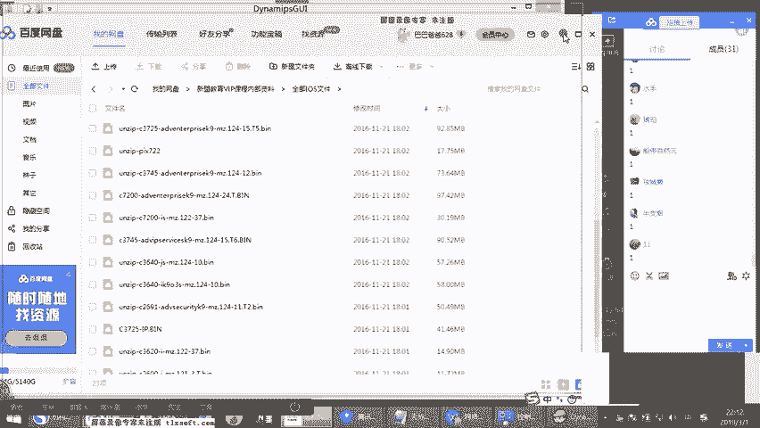

> **代码示例**：在浏览器中访问 `http://192.168.1.1:80`，等同于访问 `http://192.168.1.1`，因为80是HTTP的默认端口。

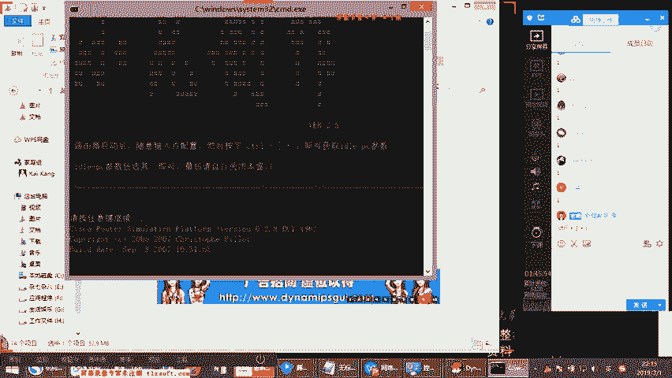

---

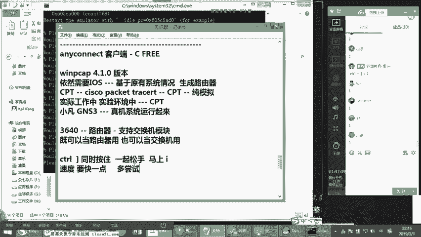

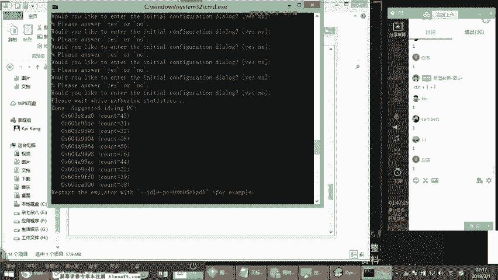

## 模拟器环境搭建入门

理论学习需要实践巩固。我们将使用**小凡模拟器**来搭建一个接近真实的网络实验环境。以下是核心步骤的简要介绍。

以下是使用小凡模拟器创建实验环境的关键步骤：
1.  **安装与准备**：安装小凡模拟器及WinPcap驱动。准备好路由器的IOS镜像文件（如 `c3640` 系列）。
2.  **创建设备**：以管理员身份运行小凡模拟器，选择`c3640` IOS，计算并设置正确的`idle-pc`值（以降低CPU占用），设置设备内存（如256MB）。
3.  **添加模块**：为虚拟路由器添加网络模块，例如 `NM-1FE-TX`（1个百兆以太网口）。
4.  **连接设备**：在拓扑图中，将两台路由器的指定接口（如`F0/0`）连接起来。
5.  **生成与启动**：生成批处理（`.bat`）文件。运行它，即可启动虚拟路由器。
6.  **登录设备**：使用终端软件（如SecureCRT、PuTTY），通过`Telnet`方式连接。关键点是：
    *   **主机地址**：`127.0.0.1`（本机）
    *   **端口号**：第一台路由器是`2001`，第二台是`2002`，以此类推。

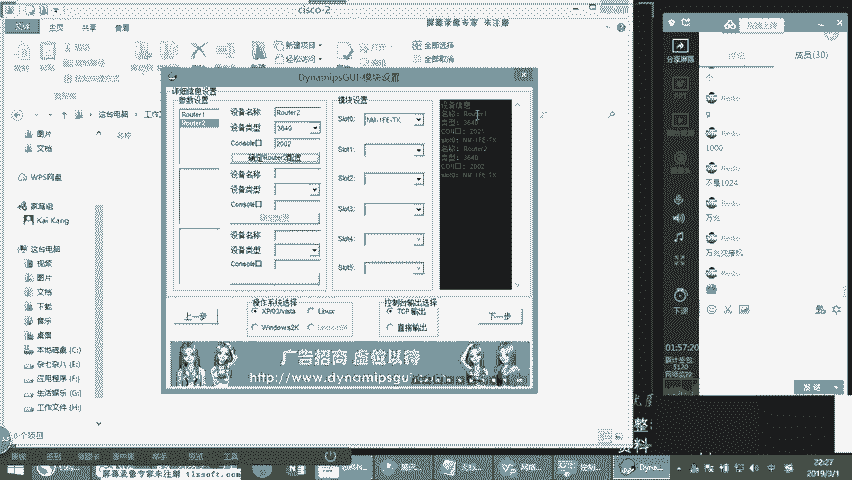

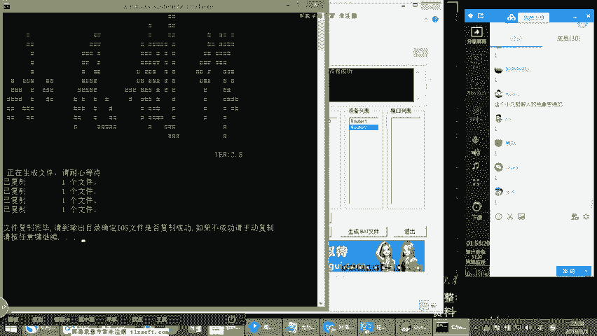

通过`Alt+数字`（如`Alt+1`， `Alt+2`）可以在不同设备的终端窗口间快速切换。

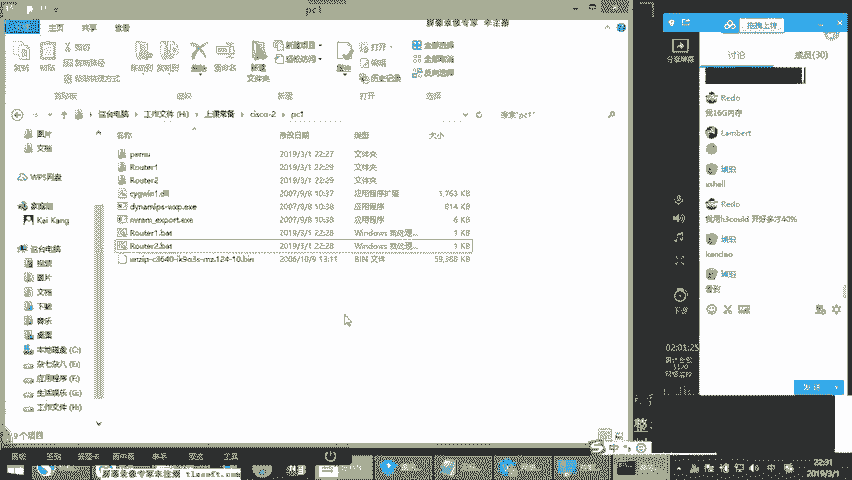

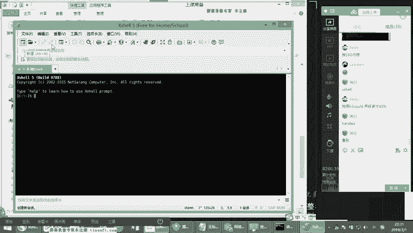

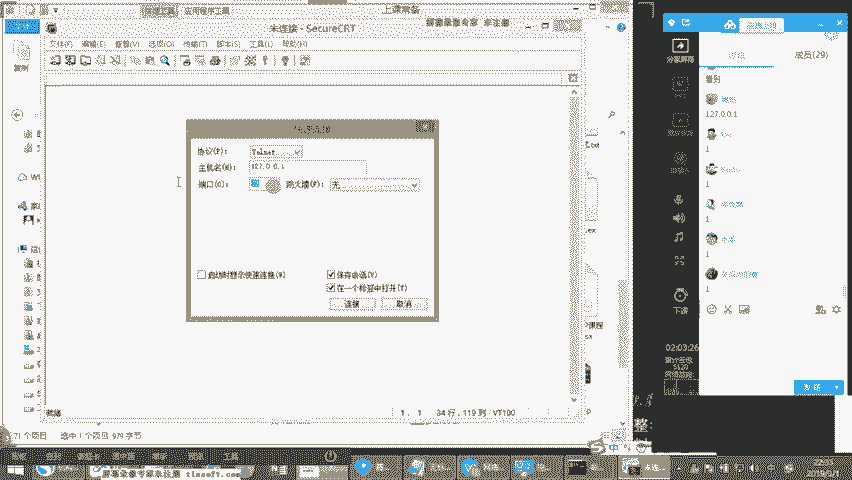

---

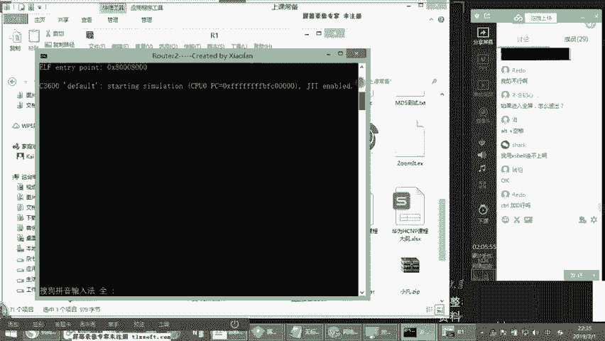

## 总结

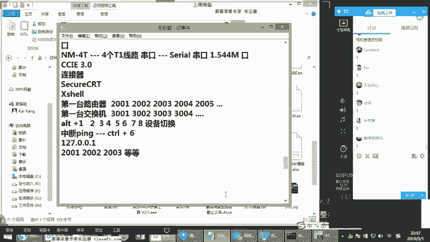

本节课中我们一起学习了网络通信的核心基础。我们明确了TCP/IP协议的基础地位，理解了IP地址、数据包MTU的概念，知道了DNS如何将域名转换为IP地址，以及端口如何标识不同服务。最后，我们初步掌握了使用小凡模拟器搭建实验环境的方法，为后续的动手实验打下了基础。记住，网络技术是一个分层、协作的体系，从底层连通到上层应用，每一步都不可或缺。