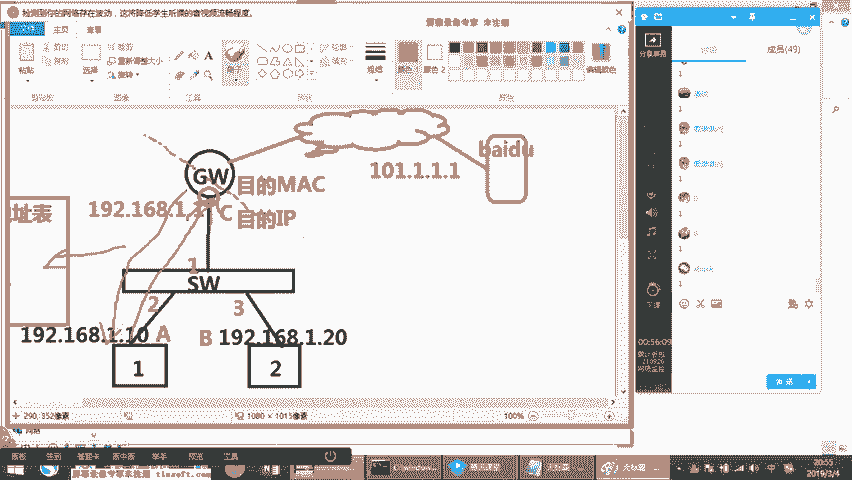
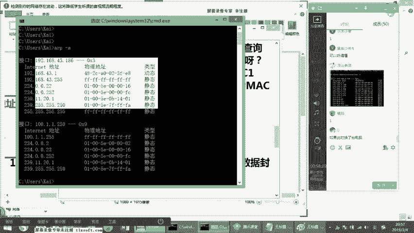
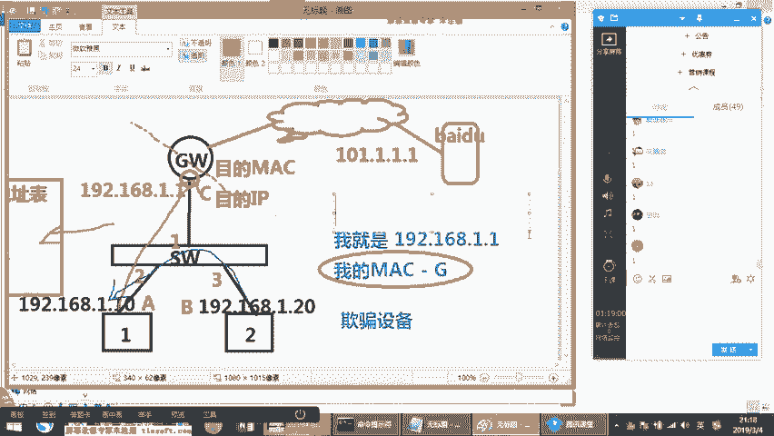
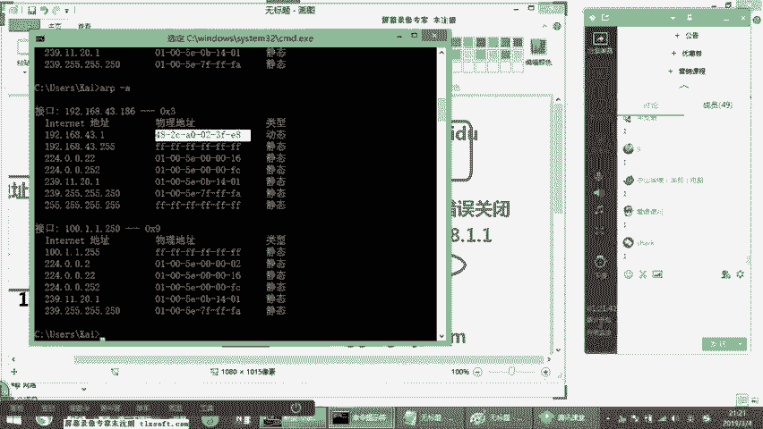
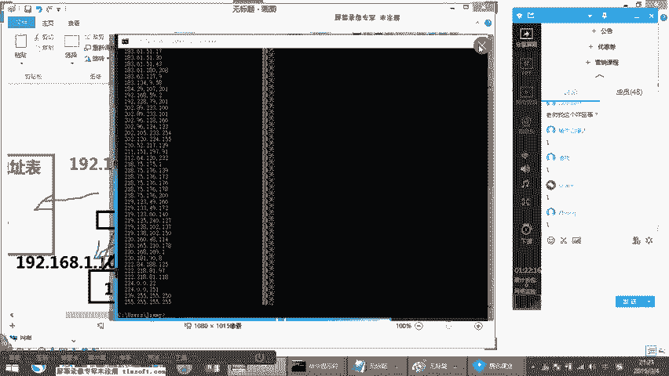
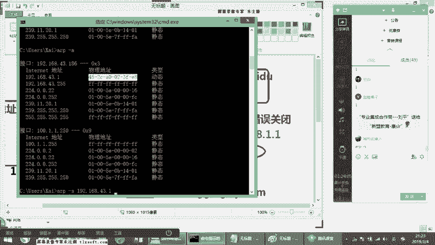
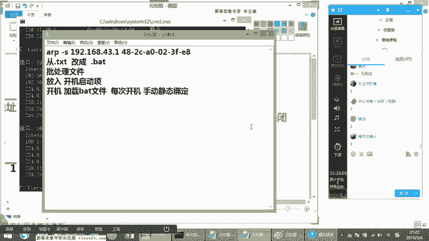
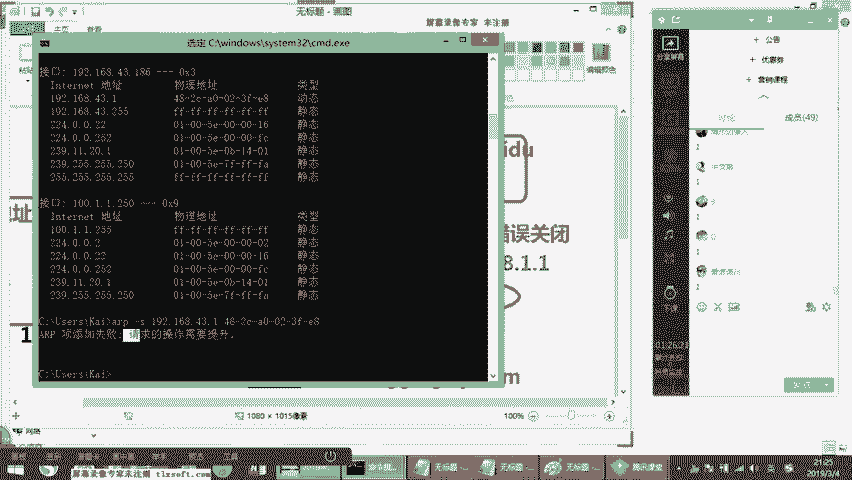
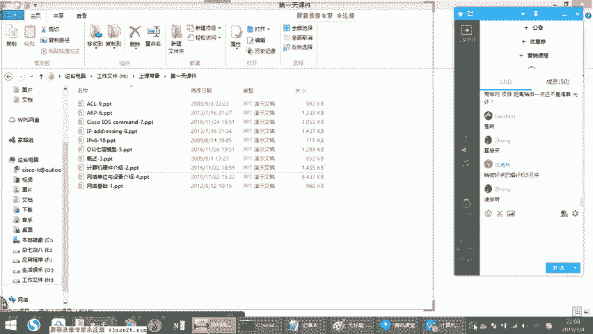

# 思科认证CCNA网络技术：第3节：网络基础入门与ARP协议详解 🖧


在本节课中，我们将要学习网络通信的基础架构，特别是数据如何在局域网内以及跨网段进行转发。我们将深入探讨IP地址、子网掩码、网关的作用，并重点解析ARP（地址解析协议）的工作原理、攻击方式及防御策略。通过本节课的学习，你将能够理解网络设备间通信的基本逻辑。

## 网络基础架构与通信原理

上一节我们进行了课程扫盲，本节中我们来看看网络的基本互连架构。在基础阶段，我们首先需要理解终端设备如何通过交换机、路由器等设备进行通信。

### 终端与网络连接

所有的个人电脑（PC）和服务器（Server）都通称为终端设备。它们是网络的末端，意味着没有其他线路从这些设备再连接出去。终端设备要接入网络，必须配置三个核心参数：**IP地址**、**子网掩码**和**网关**。

*   **IP地址**：是本机在网络中的唯一标识，类似于定位符。
*   **子网掩码**：核心作用是划分网段。它用于判断本机与网络中的其他主机（或网关）是否处于同一个IP地址段内。只有同处一个网段内的设备，才被认为在同一个局域网（LAN）中。
*   **网关**：通常是一台硬件设备（如路由器或三层交换机），其特点是**一个接口连接内网（局域网），另一个接口连接外网（如Internet）**。网关的IP地址被称为“下一跳地址”（Next Hop），当终端需要访问非本网段的目标时，数据包会首先发送给网关。

> **注意**：网关地址并非必须是常见的 `192.168.1.1` 或 `192.168.1.254`。它可以是该网段内的任何一个有效IP地址，只要该地址确实配置在作为网关的设备上即可。

### 基础网络设备角色

在一个简单的企业网络中，通常包含以下几种设备：

*   **交换机（Switch， 简称SW）**：主要作用是连接局域网内的设备，实现同网段数据的快速转发。
*   **路由器（Router， 简称R）**：主要作用是连接不同的网络（跨网段），实现广域网（WAN）接入和数据路由。
*   **防火墙（Firewall， 简称FW）**：主要作用是对网络流量进行安全策略控制。

> **现代设备趋势**：在实际项目中，设备常以业务系列划分（如思科的ASR、NCS系列），而非严格按传统交换、路由功能区分。现代设备多为多业务集成产品，可能同时具备路由、交换、安全等多种功能。

### 数据转发过程：MAC地址与ARP

当一台PC（例如PC1）需要与另一台设备通信时，它不仅需要知道对方的IP地址，还需要知道对方的**MAC地址**（物理硬件地址）才能在局域网内进行数据封装和传递。

以下是通信过程中的关键表项：

*   **MAC地址表**：存在于**交换机**中。交换机通过记录每个接口所连接设备的MAC地址来学习网络拓扑。当数据包进入交换机，交换机会查询此表，以决定从哪个接口转发出去。如果表中没有目的MAC地址的记录，交换机会将数据包向所有接口（除接收口外）广播。
*   **ARP表**：存在于**终端设备**（如PC、服务器）中。终端为了获取目标IP地址对应的MAC地址，会使用**ARP协议**。

**ARP（地址解析协议）的核心作用是通过IP地址来寻找对应的MAC地址**。其工作过程如下：





1.  **ARP请求（广播）**：当PC1需要与网关（IP: 192.168.1.1）通信时，它会先在局域网内广播一个ARP请求包，内容为：“谁的IP是192.168.1.1？请告诉你的MAC地址。”
2.  **ARP响应（单播）**：局域网内所有设备都会收到这个广播包。只有IP地址为192.168.1.1的网关设备会做出响应，向PC1发送一个单播回复：“我的IP是192.168.1.1，我的MAC地址是XX:XX:XX:XX:XX:XX。”
3.  **记录ARP表**：PC1收到响应后，会将`IP 192.168.1.1 -> MAC XX:XX:XX:XX:XX:XX`的对应关系记录到本机的ARP表中。后续发往该IP的数据包，都会直接使用这个MAC地址进行封装。

你可以通过在电脑的命令行（CMD）中输入 `arp -a` 命令来查看本机的ARP表。

## ARP攻击与防御策略



理解了ARP的工作原理，我们就能分析常见的网络攻击——ARP欺骗/攻击。



### ARP攻击原理





攻击者通过伪造ARP响应包，扰乱正常设备的ARP表，主要分为两种目的：





1.  **ARP欺骗（断网攻击）**：
    *   攻击者（例如被病毒感染的PC2）持续向网络发送伪造的ARP广播，声称：“网关IP（192.168.1.1）的MAC地址是GG:GG:GG:GG:GG:GG”（一个虚假的MAC）。
    *   同局域网内的PC1收到后，会更新自己的ARP表，错误地将网关IP指向这个虚假的MAC。
    *   当PC1尝试上网时，数据包被发往虚假MAC，由于该地址不存在，数据包在局域网内泛洪后丢失，导致PC1无法上网。由于网关也会发送正确的ARP响应，受害主机的ARP表会不断被正确和错误的条目刷新，造成**网络时断时续**的现象。

2.  **ARP挂马（中间人攻击）**：
    *   攻击者发送伪造的ARP响应，声称：“网关IP的MAC地址是BB:BB:BB:BB:BB:BB”（即攻击者PC2自己的真实MAC）。
    *   PC1信以为真，将所有发往网关的数据都发送给PC2。
    *   PC2收到数据后，可以**窃取所有明文传输的数据**（如用户名、密码），然后再将数据转发给真正的网关，PC1依然可以上网，不易察觉。
    *   更甚者，PC2可以在返回给PC1的数据流中**插入恶意代码（挂马）**，导致PC1感染病毒或木马。

### ARP攻击的防御方法

以下是几种常见的防御策略：

*   **手动静态绑定**：在终端电脑上，通过命令手动将网关的IP和正确的MAC地址进行绑定。
    ```bash
    arp -s 192.168.1.1 00-11-22-33-44-55
    ```
    > **缺点**：电脑重启后绑定失效。可通过编写批处理（.bat）脚本并加入开机启动项来实现每次开机自动绑定。
*   **网络设备防护**：在交换机上启用安全功能。
    *   **动态ARP检测（DAI）**：交换机会检查ARP包的合法性，拦截非法的ARP报文。
    *   **ARP速率限制**：在交换机接口上配置，限制单位时间内通过的ARP报文数量。如果某个接口发送的ARP包超过阈值，交换机可自动关闭该接口，并触发日志报警。
*   **安全软件与监控**：安装杀毒软件、部署网络监控系统（如Zabbix），通过抓包分析定位ARP攻击源。

## 网络硬件基础认识

了解一些基础硬件有助于后续的实验和项目工作。

### 服务器与网卡

*   **服务器**：常见为机架式服务器（如1U、2U规格），用于节省数据中心空间。现代趋势是**虚拟化**和**云主机**，它们能提供弹性计算资源，根据业务峰值灵活调配CPU、内存和带宽，节约成本。
*   **服务器网卡**：不同于普通PC的百兆/千兆网卡（如Realtek 8139），服务器通常使用高性能、高负载的专用千兆/万兆网卡，以满足7x24小时大流量数据处理的需求。

### 控制台连接（Console）

网络设备初始配置通常通过**Console口**进行。由于现代笔记本电脑已没有串口（COM口），我们需要使用以下工具：

*   **Console线**：一端为RJ-45水晶头（连接设备Console口），另一端为DB9母头（连接电脑串口）。注意，此水晶头线序为反转线，非普通网线。
*   **USB转串口适配器**：将Console线的DB9头通过此适配器连接到笔记本电脑的USB口。建议购买免驱的集成线缆，方便使用。

> **给工程师的建议**：从事网络工程建议配备一台轻便、耐用的二手商务笔记本（如ThinkPad X或T系列）。调试时养成使用主键盘区上方数字键的习惯，因为许多项目用的小尺寸笔记本和部分考场键盘可能没有小键盘区。

---



本节课中我们一起学习了网络通信的基础，包括IP、掩码、网关的作用，深入剖析了ARP协议的工作机制、常见的ARP攻击原理（欺骗与挂马）以及相应的防御策略。同时，我们也认识了服务器、网卡和控制台连接等基础硬件知识。理解这些概念是后续学习更复杂网络技术的基石。请务必完成手写ARP流程与攻击防御分析的课后作业，以巩固理解。下节课我们将学习如何连接和初始化配置网络设备。