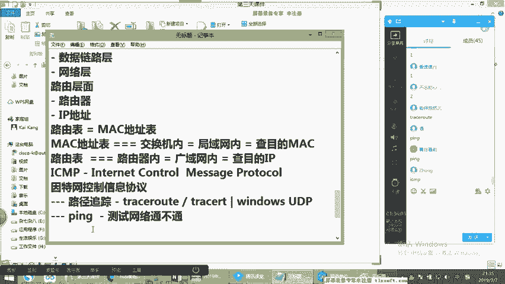
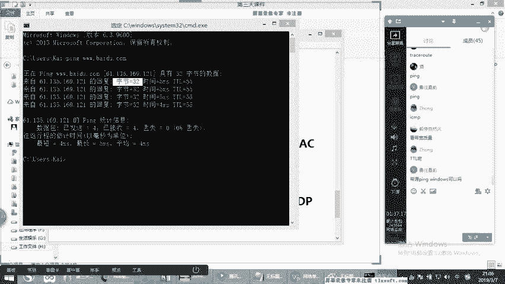
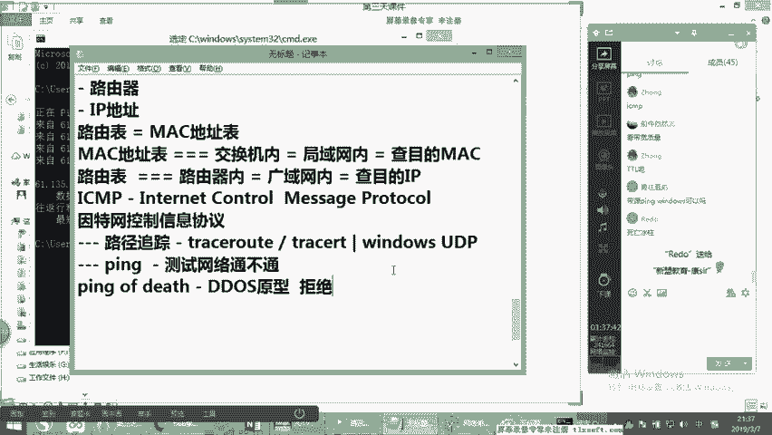
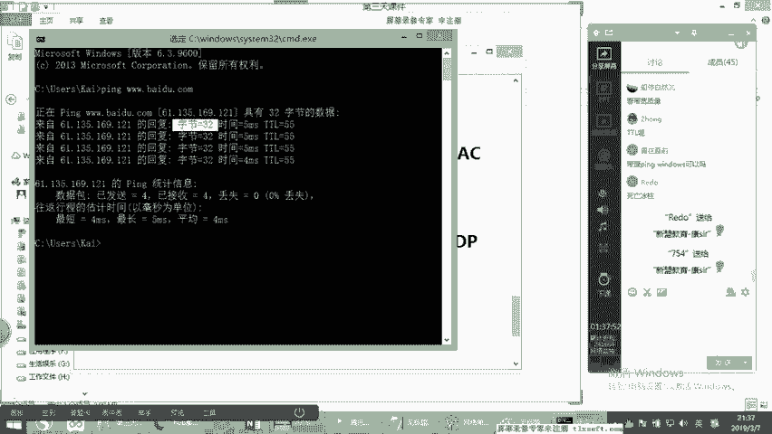
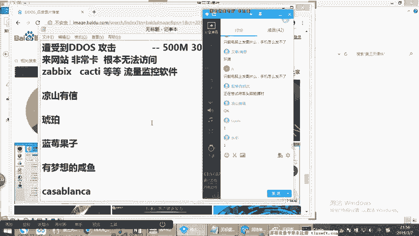
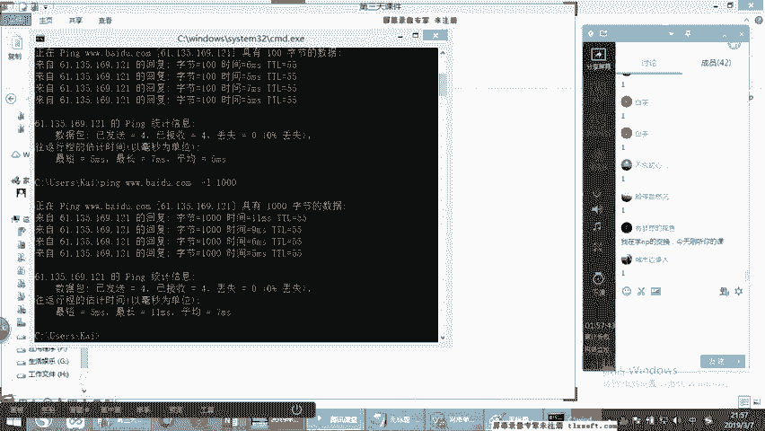
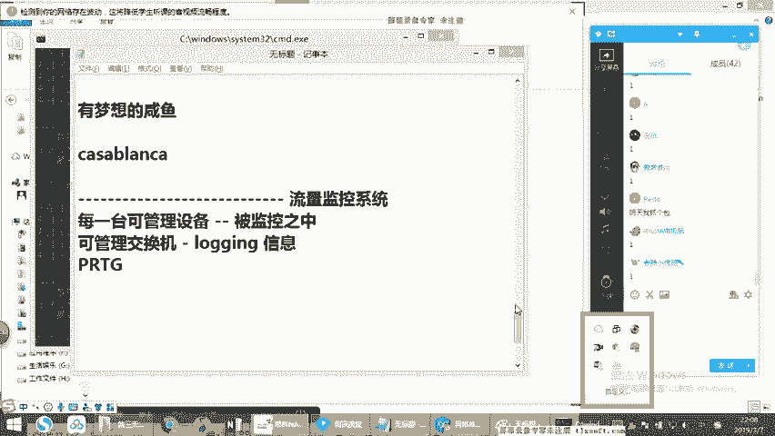

# CCNA网络技术详解：第4节：OSI模型-1


在本节课中，我们将学习网络通信的基础框架——OSI参考模型。我们将重点探讨其下四层（物理层、数据链路层、网络层、传输层）的核心概念与实际应用，帮助你理解数据在网络中传输的基本步骤和原理。

## 物理层：网络通信的基石

上一节我们介绍了网络组建的基本框架，本节中我们来看看OSI模型的最底层——物理层。物理层定义了网络通信的物理介质和电气信号标准，是数据传输的物理基础。

物理层的主要职责是传输原始的比特流。它不关心数据的含义或结构，只负责通过物理介质（如网线、光纤）将信号从一个点传送到另一个点。

以下是物理层涉及的一些关键组件和概念：

*   **传输介质**：包括双绞线（网线）、同轴电缆、光纤等。例如，常见的网线遵循 **568A** 或 **568B** 线序标准。
*   **接口与设备**：如网卡（NIC）、光纤收发器（光猫）、中继器（Hub）等。这些设备负责信号的生成、接收和放大。
*   **信号与编码**：将数字数据（0和1）转换为可以在介质上传输的物理信号（如电脉冲、光信号）。

需要注意的是，随着技术发展，一些早期的物理层概念（如集线器Hub、交叉线与直通线的严格区分）在实际工作中已较少见，现代设备大多支持**自动翻转**功能。

## 数据链路层：局域网内的可靠传输

理解了物理层的信号传输后，我们进入数据链路层。这一层负责在**同一局域网（LAN）** 内的两个设备之间建立可靠的数据链路。

数据链路层将网络层传来的数据包封装成**帧**，并添加头部和尾部信息（如源和目的MAC地址、帧校验序列）。它的核心功能包括**帧的封装与解封装**、**物理寻址（MAC地址）** 和**差错检测**。

数据链路层的典型代表设备是**交换机**。与物理层的集线器（Hub）相比，交换机带来了显著改进：

1.  **全双工通信**：交换机支持同时进行发送和接收，有效提升了带宽利用率。公式表示为：`全双工带宽 = 端口速率 × 2`。
2.  **基于MAC地址的转发**：交换机内部维护一张 **MAC地址表**，记录每个端口所连接设备的MAC地址。当数据帧到达时，交换机会查询此表，将帧**单播**转发到目标端口，而非像Hub那样向所有端口**泛洪**。这提高了效率并增强了安全性。
3.  **冲突域隔离**：交换机的每个端口都是一个独立的冲突域，大大减少了数据帧碰撞的可能性。

MAC地址是一个48位的全球唯一标识符，通常表示为 `XX:XX:XX:XX:XX:XX` 的形式。交换机通过“学习”机制动态构建MAC地址表。

## 网络层：实现跨网段的通信

数据链路层解决了局域网内部的通信问题，但当数据需要跨越不同的网络（网段）时，就需要网络层发挥作用。网络层负责将数据从源主机经过多个中间节点（路由器）路由到目的主机。

网络层的核心任务是**逻辑寻址**和**路由选择**。它使用**IP地址**来唯一标识网络中的设备，并通过**路由表**来决定数据包传输的最佳路径。

网络层的核心协议是**IP协议**。一个IP数据包的基本头部包含源IP地址、目的IP地址、生存时间（TTL）等关键字段。

该层的典型设备是**路由器**。路由器根据目的IP地址查询自身的路由表，决定将数据包从哪个接口转发出去。路由表可以通过手动配置（静态路由）或路由协议（如OSPF、EIGRP）动态学习。

此外，网络层还有一个重要协议——**ICMP**。它用于传递控制消息，例如常用的 `ping` 命令就是利用ICMP回显请求和应答来测试网络连通性。代码示例：`ping 192.168.1.1`

## 传输层：端到端的连接与控制

网络层确保了数据包能够跨网络送达目标主机，而传输层则负责确保数据**可靠、有序**地送达主机上的**特定应用程序**。

传输层通过**端口号**来区分同一主机上的不同服务或应用。例如，Web服务通常使用80端口，电子邮件服务使用25端口。

传输层主要有两个协议：









1.  **TCP**：一种面向连接的、可靠的协议。它通过“三次握手”建立连接，并提供确认、重传、流量控制和拥塞控制机制，确保数据无误交付。代码示例（伪代码）：
    ```python
    # TCP三次握手
    客户端发送 SYN
    服务器回复 SYN-ACK
    客户端发送 ACK
    # 连接建立，开始可靠数据传输
    ```
2.  **UDP**：一种无连接的、不可靠的协议。它不建立连接，直接将数据包发送出去，不保证顺序和可达性。但正因为其开销小、速度快，常用于视频通话、在线游戏等实时性要求高的场景。

简单来说，**TCP注重可靠性，UDP注重效率**。应用层协议会根据需求选择使用TCP或UDP。

## 应用层、表示层、会话层简介

OSI模型的上三层（应用层、表示层、会话层）通常被合并称为“应用层面”，它们更贴近用户和具体的应用程序。

*   **应用层**：为应用程序提供网络服务接口。例如，HTTP用于网页浏览，FTP用于文件传输，SMTP用于发送电子邮件。
*   **表示层**：负责数据的格式转换、加密与解密、压缩与解压缩，确保应用层发出的数据能被另一端系统理解。
*   **会话层**：负责建立、管理和终止应用程序之间的会话（Session）。它控制对话的同步和检查点。

对于网络工程师而言，重点通常在于确保下四层（数据层面）的畅通，而上三层的具体问题多由应用开发或服务器运维人员处理。





## 总结与下节预告

本节课中我们一起学习了OSI参考模型的核心框架。我们深入探讨了：
1.  **物理层**的介质与信号基础。
2.  **数据链路层**的MAC寻址与交换机工作原理。
3.  **网络层**的IP寻址、路由选择及ICMP协议。
4.  **传输层**的TCP与UDP协议，及其在端到端通信中的作用。
5.  简要介绍了上三层（应用层面）的基本功能。



理解OSI模型的分层思想，是进行网络故障排查、协议分析和网络设计的基石。下一节中，我们将结合OSI模型，探讨常见的网络攻击（如DDoS攻击）原理及其防御思路，并继续深化对网络实际运维的理解。