# CCNA网络技术：第5节：OSI模型详解（第二部分）📚

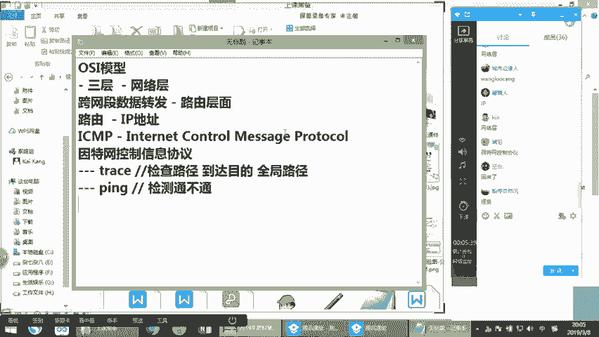

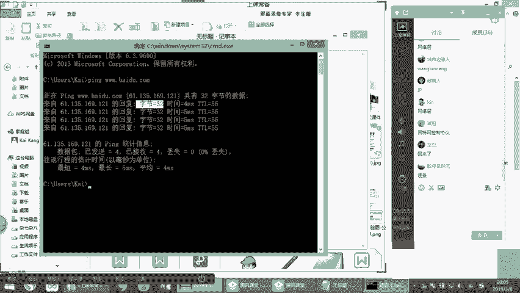

在本节课中，我们将深入学习OSI模型的第三层（网络层）和第四层（传输层），并了解它们在实际网络通信中的核心作用。我们还将探讨一些相关的网络安全概念，并学习如何连接和使用网络模拟设备。

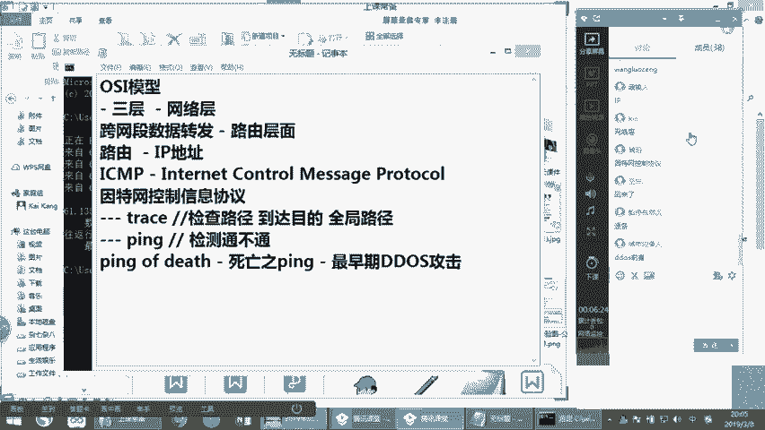

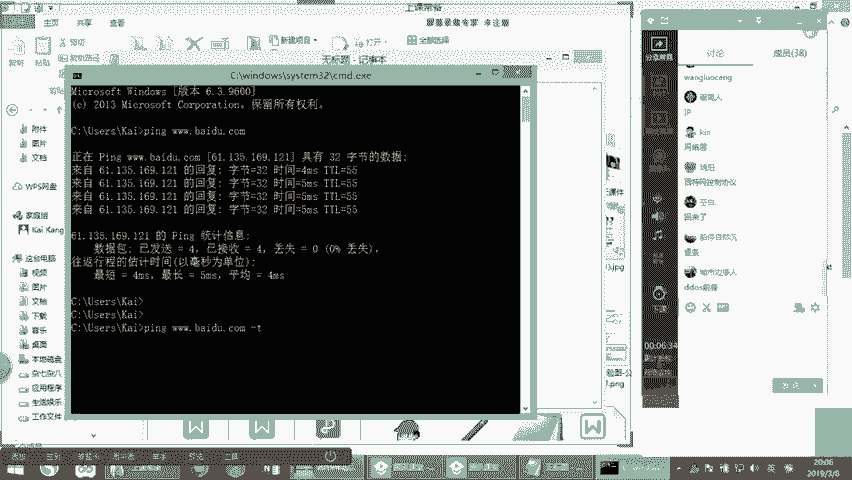

---

## 回顾：OSI模型第三层（网络层）

上一节我们介绍了OSI模型的基本框架，本节中我们来看看网络层的具体功能。

网络层主要负责跨网段的数据转发，这是其最核心的工作。在网络层中，最重要的两个概念是**路由**和**IP地址**。

### 网络层的核心协议

除了路由和IP，网络层还包含一个重要的协议：**ICMP**。

ICMP是Internet Control Message Protocol（互联网控制消息协议）的缩写。它主要用于网络诊断和错误报告。ICMP包含两个常用的工具：

*   **Traceroute**：用于检查数据包从源到目的地所经过的路径。其主要作用是**检查路径**，帮助我们了解数据包传输的全局路由。
*   **Ping**：用于检查网络连通性。其主要作用是**检查通不通**，即测试两台设备之间是否可以通信。

在Ping的过程中，数据包的大小是可以调整的。例如，在命令中可以使用 `-l` 参数指定数据包大小，但其最大值通常为 **65500字节**。

> **早期攻击**：利用超大Ping包发起的攻击被称为 **Ping of Death（死亡之Ping）**，这是早期DDoS攻击的一种形式。其原理是让大量主机同时向目标发送巨大的Ping包，消耗目标的带宽和处理能力。

---

## 现代DDoS攻击与防御

上一节我们提到了早期的攻击方式，本节中我们来看看现代更常见的攻击手段。

现代的DDoS攻击已经很少使用Ping，而是采用 **UDP洪水攻击**。与需要回复的Ping包不同，UDP攻击是无连接的，攻击者只是单向地、持续地向目标发送大量UDP数据包，耗尽目标的带宽资源。

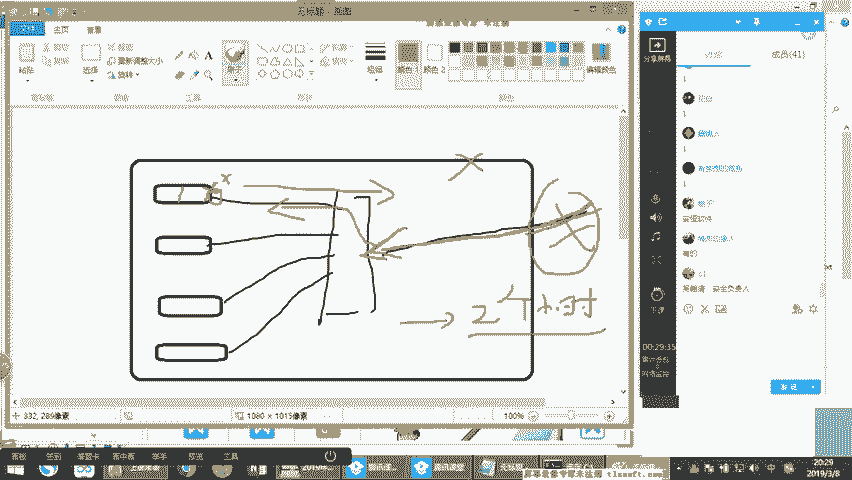

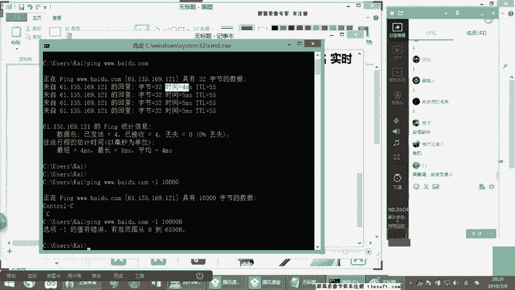

以下是关于DDoS攻击的两个关键方面：

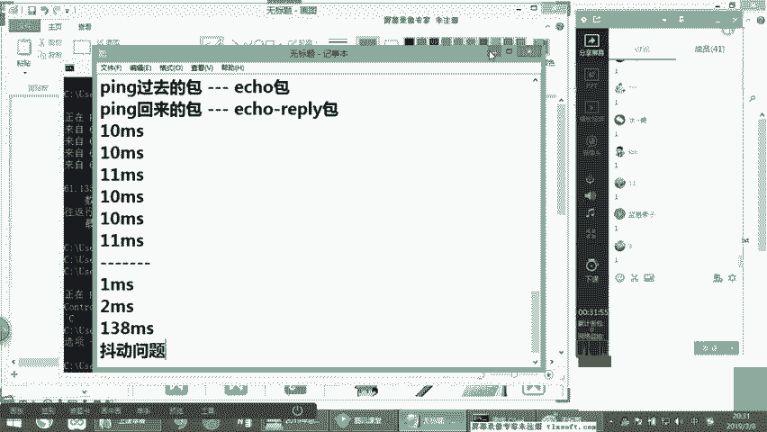

### 攻击来源

DDoS攻击流量通常来源于被黑客控制的、感染了病毒的计算机，这些计算机被称为 **“肉鸡”**。攻击者通过网页挂马、捆绑恶意软件、利用软件漏洞等方式传播病毒，远程控制这些“肉鸡”，并利用它们发起协同攻击。

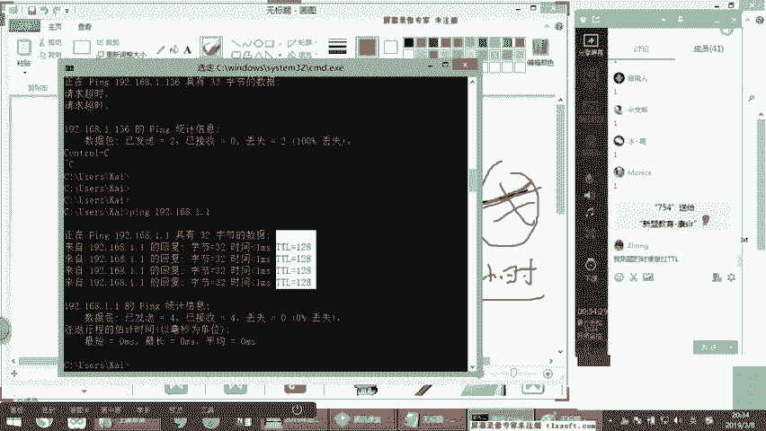

为了控制这些散布各处的“肉鸡”，攻击者常使用 **DDNS** 服务。由于大多数“肉鸡”和攻击者自身都使用动态IP（如家庭宽带），IP地址会经常变化。攻击者会申请一个固定的域名，并通过DDNS服务使其始终解析到攻击者当前的控制端IP上，这样“肉鸡”就能随时找到控制端。

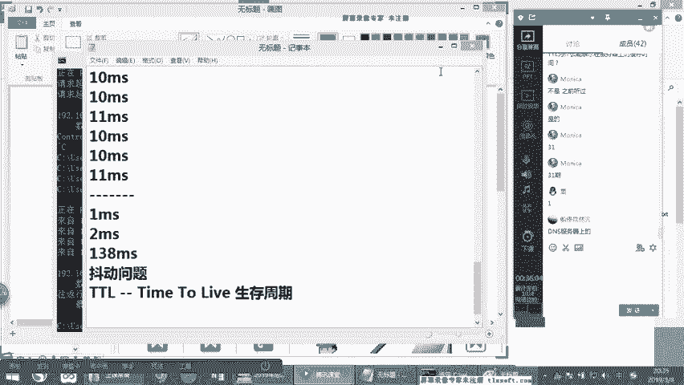

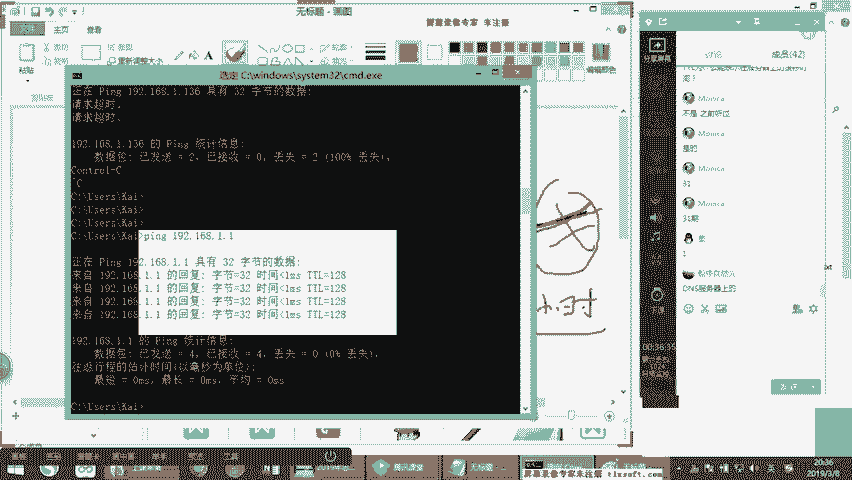

### 解决方案

面对DDoS攻击，一个常见的应急措施是 **封禁IP**。但需要注意的是，封禁的不是攻击者的IP（因为攻击源成千上万，无法逐一封禁），而是**封禁被攻击服务器的IP地址**。

具体操作是，将受到攻击的服务器IP地址上报给上级网络运营商，由运营商在骨干网上将该IP的流量导入“黑洞”（即丢弃所有发往该IP的流量），从而保护机房内其他服务器不受影响。单纯拔掉被攻击服务器的网线是无效的，因为攻击流量依然会到达网络总出口并造成拥堵。

> **重要提示**：对于大型网络，部署**流量监控系统**至关重要。没有它，在发生攻击时你将难以快速定位问题根源。

---

## 传输层：TCP与UDP

理解了网络层的寻址和路由后，本节我们来看看传输层如何管理数据的传输方式。

传输层位于网络层之上，负责建立端到端的通信。最常见的传输层协议是 **TCP** 和 **UDP**。它们都基于IP协议工作，但提供了截然不同的数据传输服务。

### TCP：传输控制协议

TCP是一种**面向连接**的、**可靠**的传输协议。它在数据传输前需要进行“三次握手”来建立连接，确保通信双方都已准备好。

**TCP三次握手过程**：
1.  客户端发送 **SYN** 报文给服务器，请求建立连接。
2.  服务器回复 **SYN-ACK** 报文，表示同意建立连接。
3.  客户端再发送 **ACK** 报文进行最终确认。至此，连接建立。

TCP的可靠性体现在**确认和重传**机制上。发送方发送数据后，会等待接收方的确认回复。如果未收到确认，发送方会重传数据，确保数据最终能完整到达。因此，TCP适用于对数据完整性要求高、但对实时性要求不高的场景，例如：
*   网页浏览
*   电子邮件
*   文件传输

### UDP：用户数据报协议

UDP是一种**无连接**的、**不可靠**的传输协议。它不建立连接，直接发送数据，也不提供确认和重传机制。

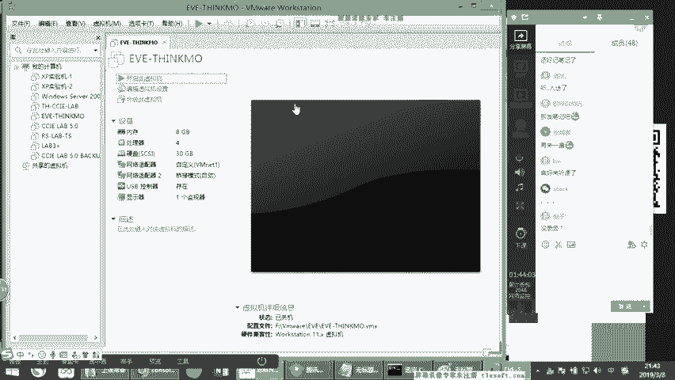

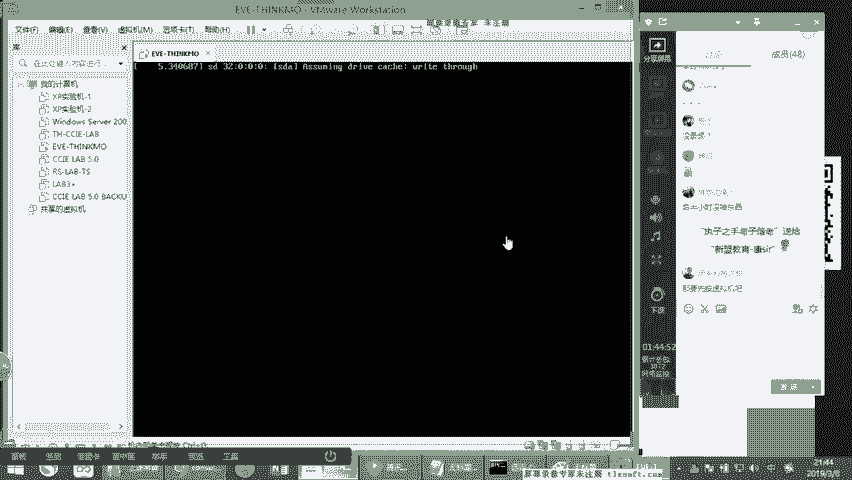

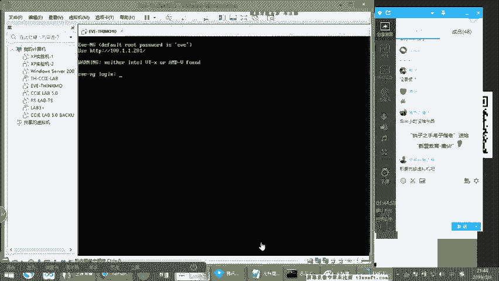

UDP的优势是**速度快、开销小**。它适用于对实时性要求高、能容忍少量数据丢失的场景，例如：
*   视频会议
*   在线直播
*   语音通话
*   DNS查询

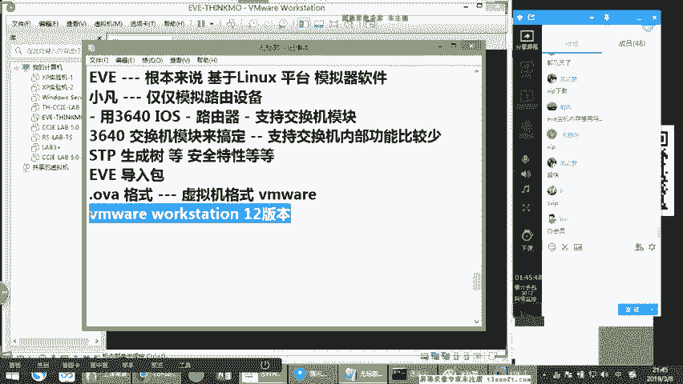

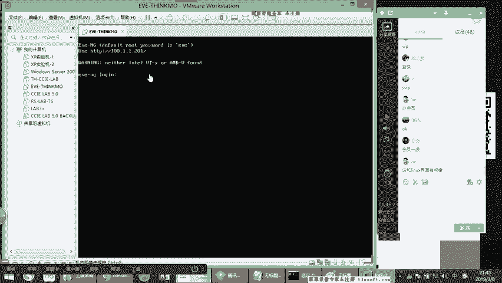

> **关联知识**：**组播**技术通常与UDP结合使用，用于实现一对多的高效数据传输（如视频直播），避免发送方为每个接收者复制一份数据流。

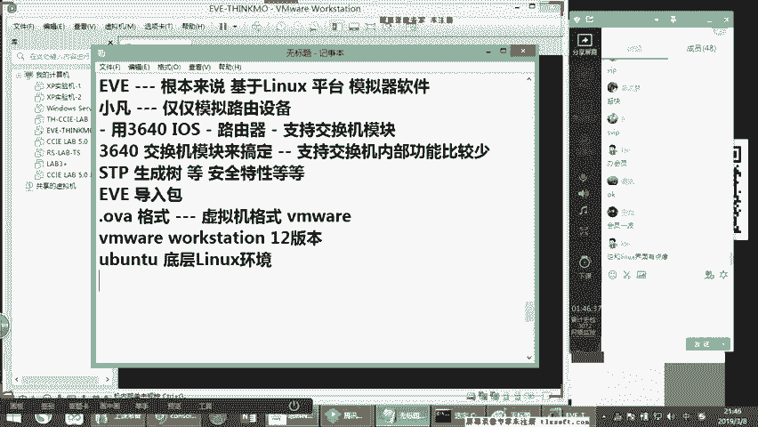

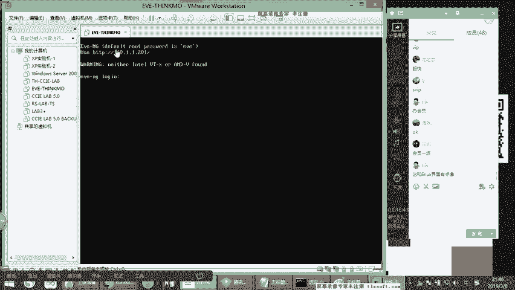

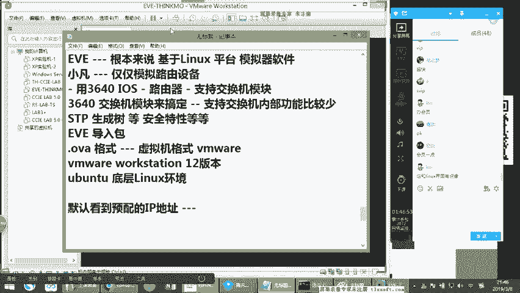

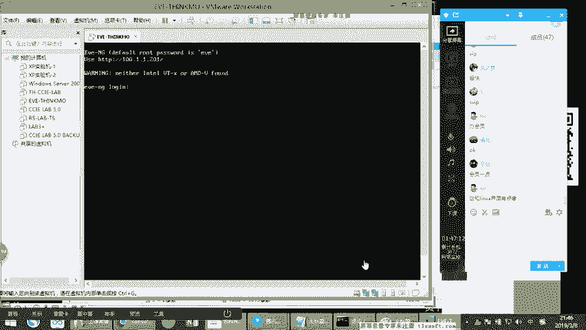

---

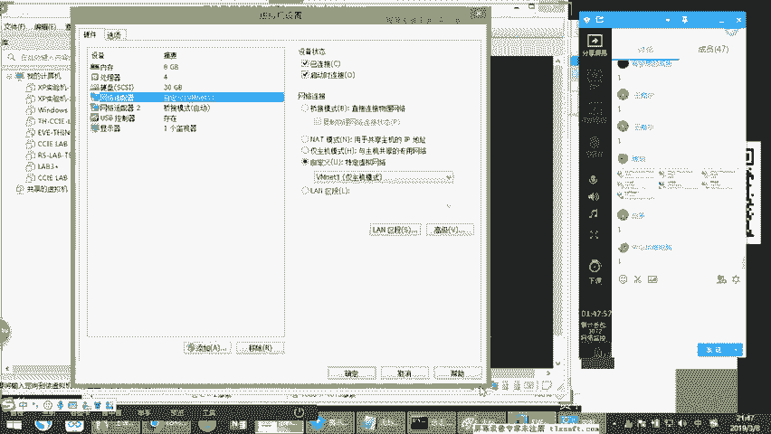

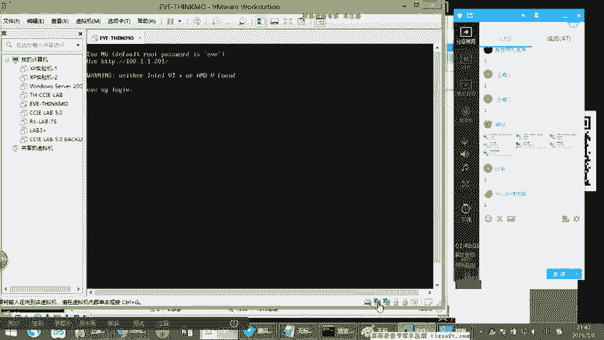

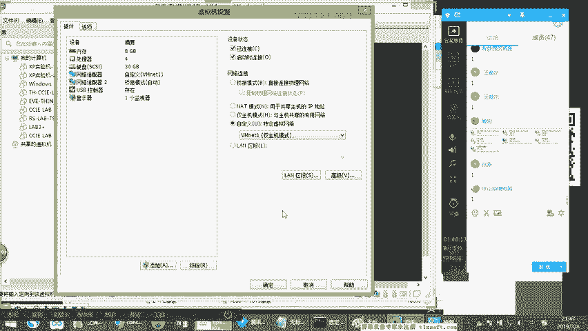

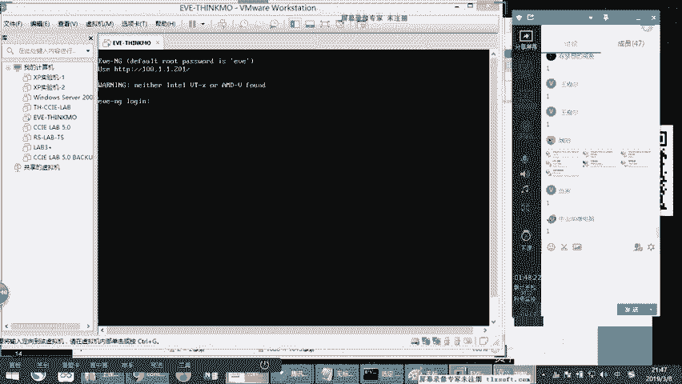

## 协议层次总结

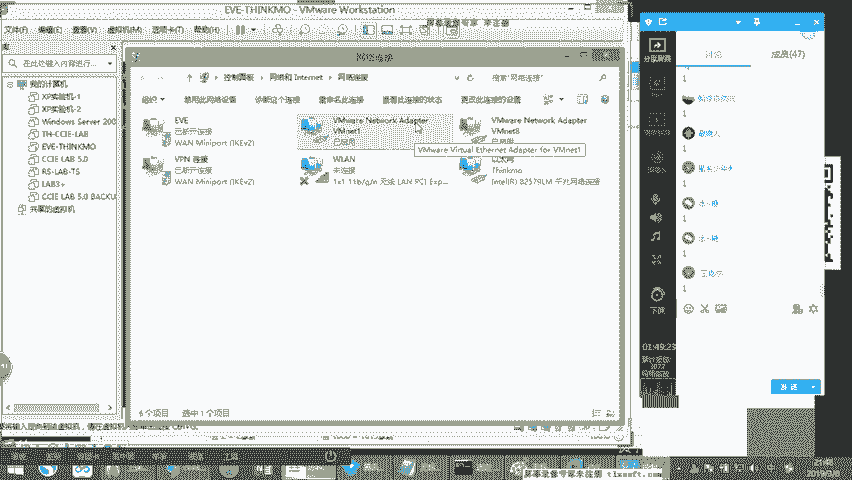

通过OSI模型，我们可以清晰地理解网络协议的层次关系：

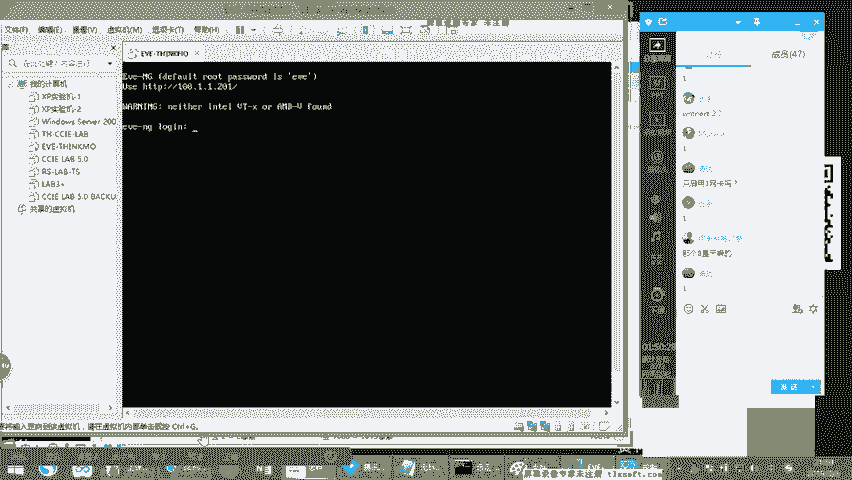

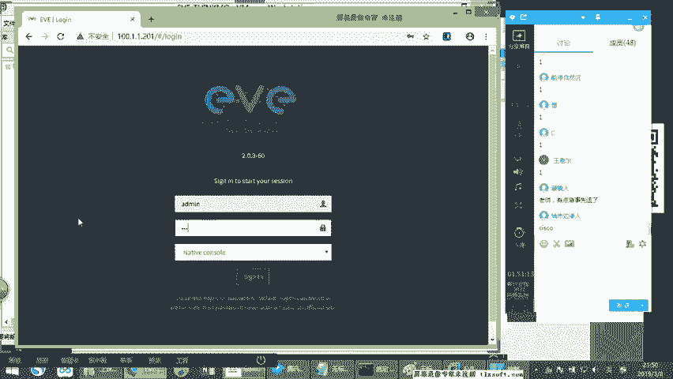

1.  **网络层**：以 **IP协议** 为核心，负责逻辑寻址和路由，为数据包选择路径。
2.  **传输层**：包含 **TCP** 和 **UDP** 等协议，负责定义数据传输的方式（是否可靠、是否面向连接）。
3.  **应用层**：包含 **HTTP、FTP、SMTP** 等协议，这些是最终面向用户的具体网络服务。它们都建立在底层的TCP/IP协议栈之上。

这种分层结构使得网络设计模块化，每一层只需关注自己的核心功能，通过标准的接口与上下层交互。

---

## 实验环境搭建与设备连接

理论需要实践来巩固，本节我们将学习如何搭建实验环境并连接网络设备。

我们将使用 **EVE-NG** 网络模拟器来创建实验环境。以下是基本步骤：

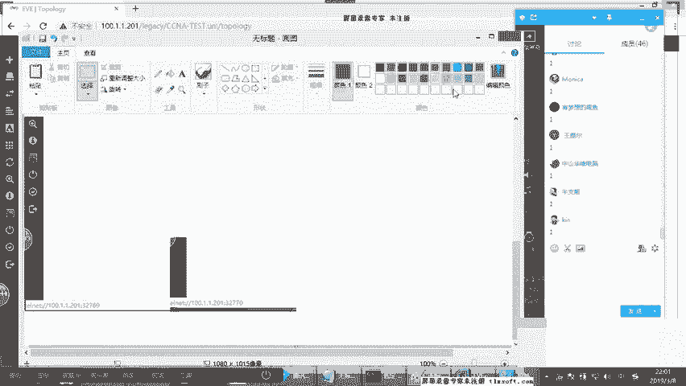

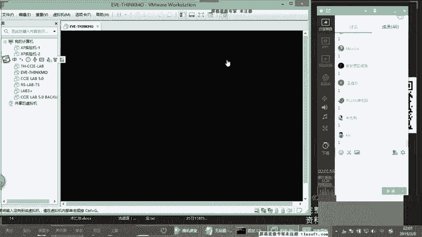

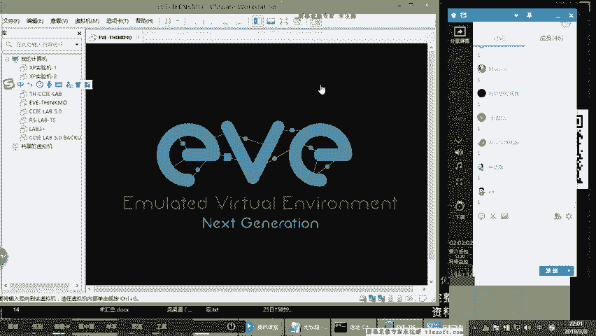

1.  **启动EVE-NG虚拟机**：导入并启动EVE-NG的虚拟机镜像。
2.  **配置网络连接**：将虚拟机的网络适配器设置为 **VMnet1**（仅主机模式）。在本机电脑上，为VMnet1网卡配置一个与EVE-NG管理IP在同一网段的IP地址。
3.  **登录Web界面**：在浏览器中输入EVE-NG的管理IP地址（如 `http://192.168.10.100`），使用默认用户名 `eve` 和密码 `eve` 登录。
4.  **创建实验拓扑**：
    *   在界面中添加新实验。
    *   从设备列表中拖入所需设备，如路由器（选择 `vIOS` 或 `3725` 镜像）和交换机（选择 `vIOS L2` 镜像）。
    *   使用连线工具连接设备接口。
5.  **启动并连接设备**：
    *   右键点击设备，选择 `Start` 启动。
    *   将鼠标悬停在设备上，会显示其Telnet连接端口号（如 `32769`）。
    *   使用终端软件（如SecureCRT）新建Telnet连接，地址为EVE-NG的IP，端口为设备对应的端口号，即可登录设备进行配置。

---

## 本节课总结

本节课中我们一起学习了：
1.  **OSI模型网络层**的深入知识，包括路由、IP地址以及ICMP协议中的Ping和Traceroute工具。
2.  现代 **DDoS攻击** 的原理、来源和基本的防御思路。
3.  **传输层** 的核心协议 **TCP** 和 **UDP**，理解了它们面向连接/无连接、可靠/不可靠的特性及其适用场景。
4.  网络协议的**层次化模型**，明确了从IP到TCP/UDP，再到上层应用协议的承载关系。
5.  如何使用 **EVE-NG** 模拟器搭建实验环境并连接虚拟网络设备，为后续的动手实验打下基础。

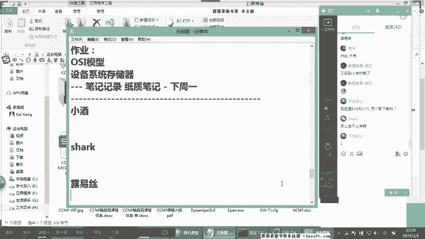

通过本课的学习，你应该对数据在网络中是如何被寻址、路由以及可靠或高效地传输有了更清晰的认识。这些概念是理解更复杂网络技术的基础。