# 思科认证CCNA网络技术：第7节：静态路由配置详解 🚀


在本节课中，我们将要学习网络通信中的一个核心概念——跨网段互通，并重点掌握实现这一功能的关键技术之一：静态路由。我们将了解静态路由的原理、配置方法、应用场景以及与动态路由的区别。

---

## 概述：路由与跨网段通信

上一节我们介绍了网络设备和基础配置命令。本节中我们来看看如何让数据在不同网段之间传输，这主要依赖于路由器及其路由表。

路由器最主要的作用是实现跨网段的数据转发。当数据到达路由器后，路由器需要查询其**路由表**来决定将数据包发往何处。路由表可以通过多种方式构建，其中两种主要方式是**静态路由**和**动态路由**。我们的目标是学习如何正确构建这张表，因为错误的路径会导致数据绕远、延迟，甚至产生**路由黑洞**（数据无法到达目的地）。

---

## 静态路由与动态路由

首先，我们来区分静态路由和动态路由的核心概念。

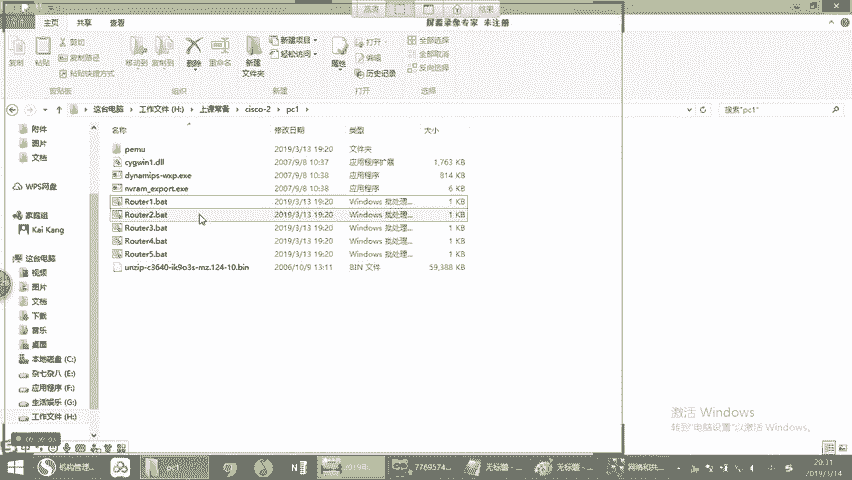

*   **静态路由**：由网络管理员手动配置，一条一条写入设备。其优点是稳定、可控，但缺点是维护工作量大，尤其是在大型网络中。
*   **动态路由**：由网络设备（如路由器）之间通过特定的**路由协议**（如OSPF、EIGRP）自动学习并同步路由信息。其优点是能自动适应网络变化，减少人工配置，但在网络不稳定时可能出现**路由抖动**（路径频繁切换）。

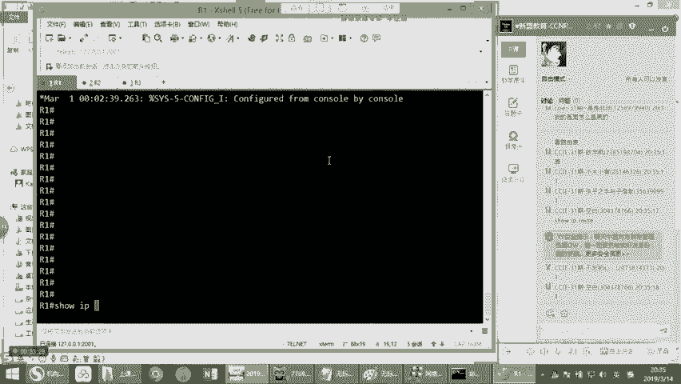

传统观念认为静态路由只适用于中小型网络。但实际上，在追求极高稳定性的场景（如运营商骨干网）中，即使网络规模很大，也会大量使用静态路由。在实际工作中，通常是静态路由和动态路由**结合使用**。

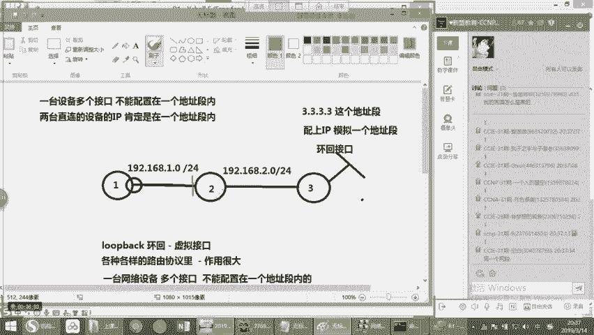

---

## 静态路由的两种类型

静态路由主要分为两种：普通静态路由和默认静态路由。

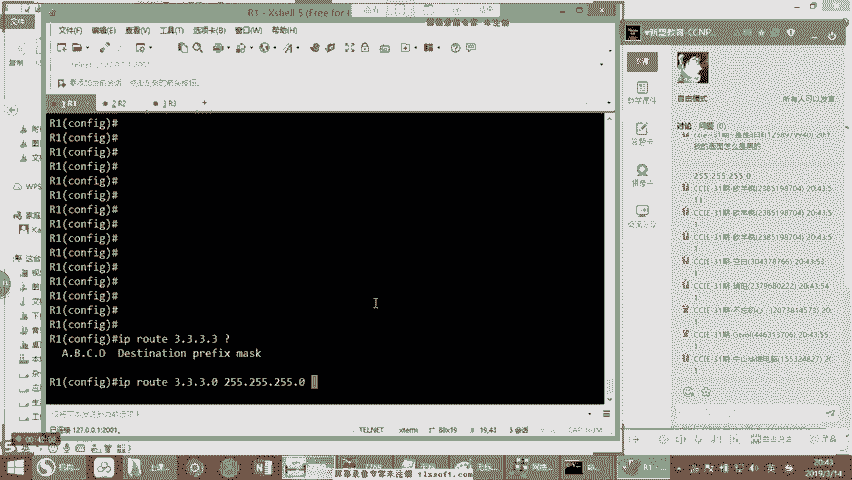

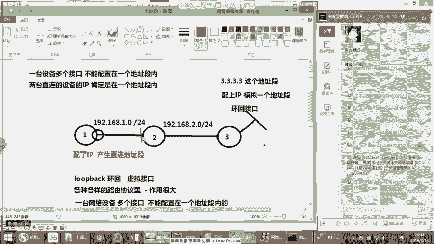

以下是两种类型的核心区别：

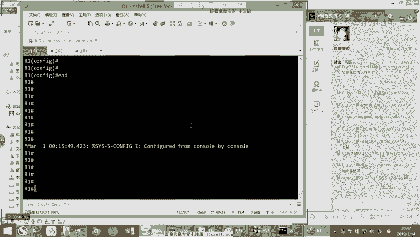

1.  **普通静态路由**
    *   **定义**：指向特定目标网络或主机的明细路由条目。
    *   **格式**：`ip route [目标网络] [子网掩码] [下一跳地址]`
    *   **示例**：`ip route 192.168.3.0 255.255.255.0 192.168.1.2`
    *   **含义**：去往 `192.168.3.0/24` 网段的数据包，全部发送给地址为 `192.168.1.2` 的下一台设备。


2.  **默认静态路由**
    *   **定义**：一条“包罗万象”的路由，当数据包的目标地址与路由表中的任何明细条目都不匹配时，将使用这条路由。通常用于连接互联网的出口。
    *   **格式**：`ip route 0.0.0.0 0.0.0.0 [下一跳地址或出接口]`
    *   **示例**：`ip route 0.0.0.0 0.0.0.0 192.168.1.1`
    *   **含义**：所有目的地未知的数据包，都发送给地址为 `192.168.1.1` 的网关设备。这类似于我们个人电脑上设置的“默认网关”。

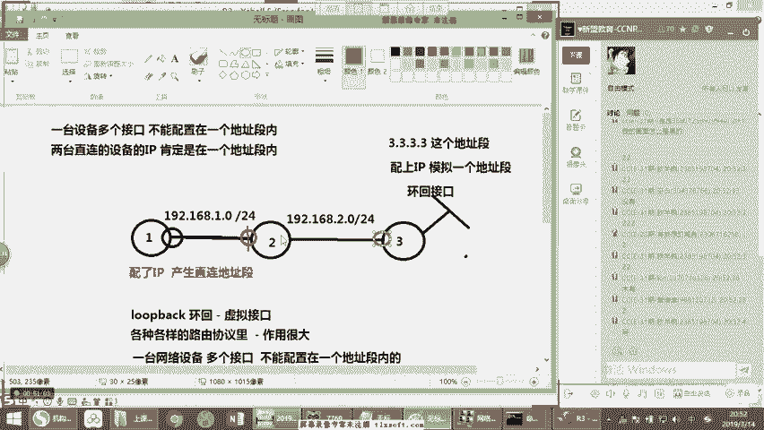

> **注意**：当设备上同时存在明细路由和默认路由时，路由器遵循**最长匹配原则**。即，它会选择子网掩码最长的、最精确的那条路由进行转发。

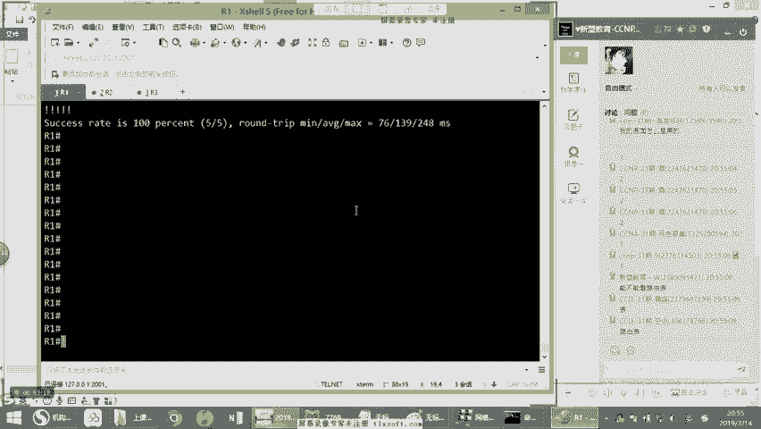

---

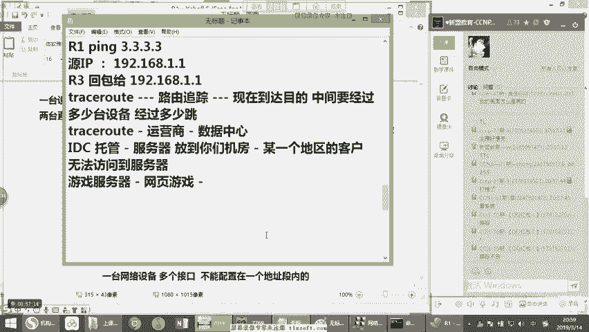

## 实验：配置静态路由实现互通

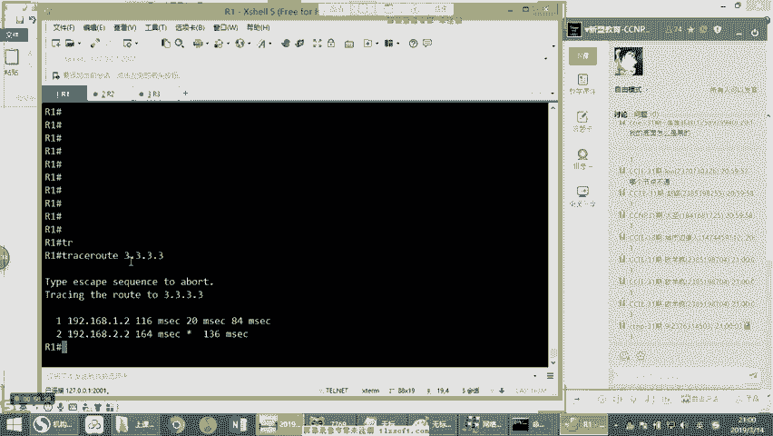


接下来，我们通过一个实验来演示如何配置静态路由。我们搭建一个包含三台路由器（R1， R2， R3）的拓扑。

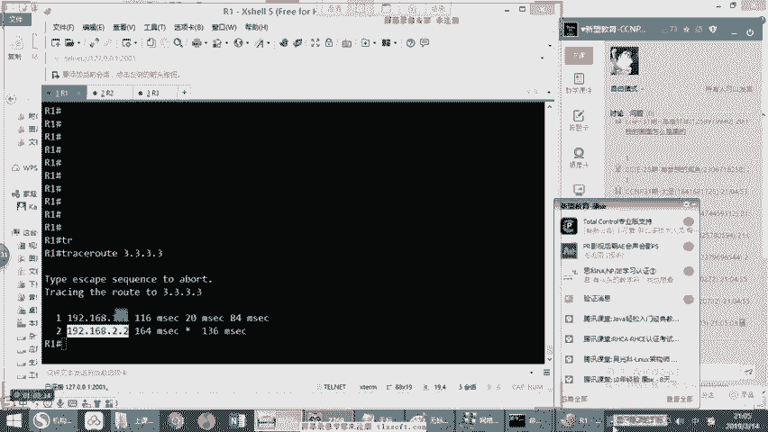

**实验拓扑与地址规划：**
*   R1 与 R2 互联：`192.168.1.0/24` (R1: .1， R2: .2)
*   R2 与 R3 互联：`192.168.2.0/24` (R2: .1， R3: .2)
*   R3 上创建一个环回接口（Loopback）模拟一个网段：`3.3.3.3/32`

**目标**：让 R1 能够 `ping` 通 R3 的环回地址 `3.3.3.3`。

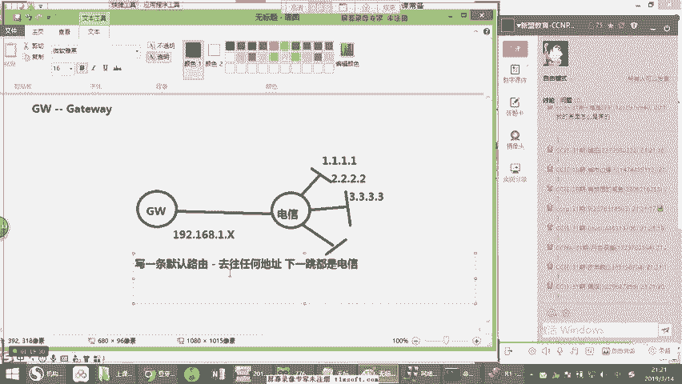

**配置步骤：**

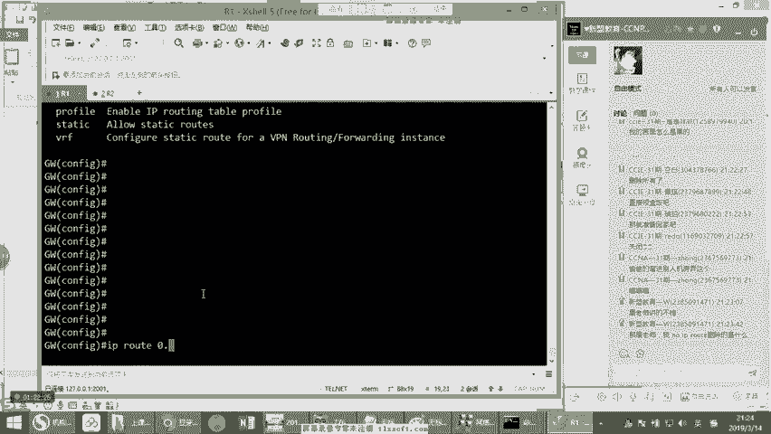

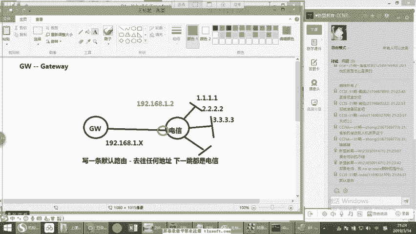

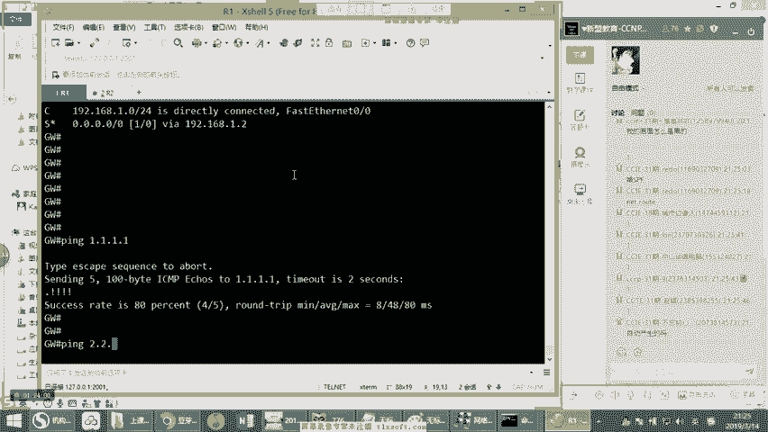

1.  **基础IP配置**：为各接口配置上述IP地址。
2.  **在R1上配置静态路由**：R1需要知道如何去往 `3.3.3.3`。下一跳是 R2。
    ```bash
    R1(config)# ip route 3.3.3.3 255.255.255.255 192.168.1.2
    ```
3.  **在R2上配置静态路由**：R2收到目标为 `3.3.3.3` 的数据包后，需要知道如何转发给 R3。
    ```bash
    R2(config)# ip route 3.3.3.3 255.255.255.255 192.168.2.2
    ```
4.  **在R3上配置回程路由**：数据包从 R1 成功到达 R3 后，R3 需要回复。回复包的源IP是 `3.3.3.3`，目标IP是 R1 的 `192.168.1.1`。因此，R3 需要知道如何去往 `192.168.1.1`。
    ```bash
    R3(config)# ip route 192.168.1.1 255.255.255.255 192.168.2.1
    ```
    > **关键概念**：网络通信是双向的，必须确保**去程和回程**都有正确的路由。

配置完成后，在 R1 上执行 `ping 3.3.3.3` 应该能够成功。可以使用 `show ip route` 命令查看路由表，确认静态路由条目（以 `S` 标识）是否存在。

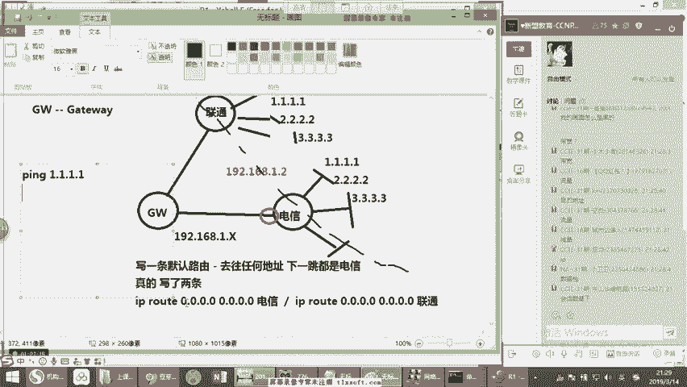

---

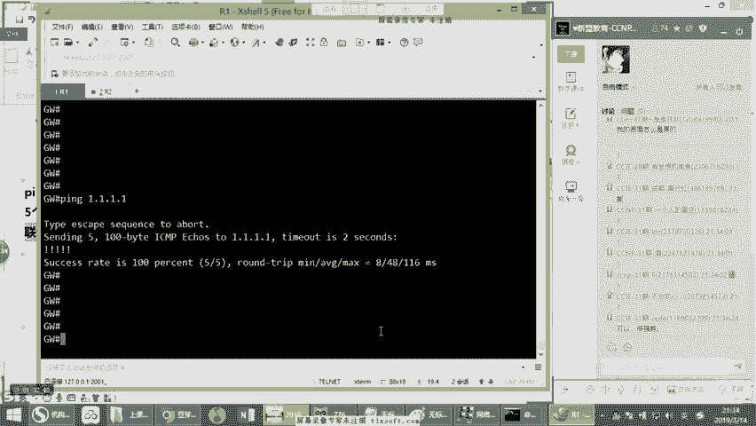

## 高级概念与排错工具

在配置和排查路由问题时，以下工具和概念非常有用：

*   **`traceroute` 命令**：用于追踪数据包从源到目的地所经过的路径。当网络不通时，可以精确定位故障发生在哪一跳设备。命令为 `traceroute [目标地址]`。
*   **CEF（Cisco Express Forwarding）**：思科快速转发表。这是现代路由器使用的核心转发机制。它并非直接查询复杂的路由表，而是根据路由表生成一个高效的**转发信息库（FIB）**，极大地提高了数据包转发速度。
*   **负载均衡**：当存在多条等价路径到达同一目的地时，路由器可以进行负载均衡。常见方式有：
    *   **基于数据包**：轮流使用不同路径发送数据包（可能造成数据包乱序）。
    *   **基于CEF的流负载均衡**：根据数据流的五元组（源IP、目的IP、源端口、目的端口、协议）哈希决定路径，同一流的数据走同一路径，这是更优的选择。


---

## 总结

本节课中我们一起学习了静态路由的核心知识。我们首先理解了路由器通过路由表实现跨网段通信的原理，然后重点学习了**静态路由**的手动配置方法，包括**普通静态路由**和**默认静态路由**。通过实验，我们掌握了如何通过配置双向路由来实现网络互通，并了解了 `traceroute`、`CEF` 等重要的排错和转发概念。

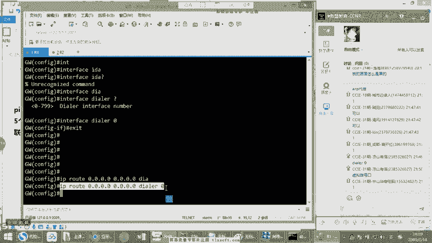

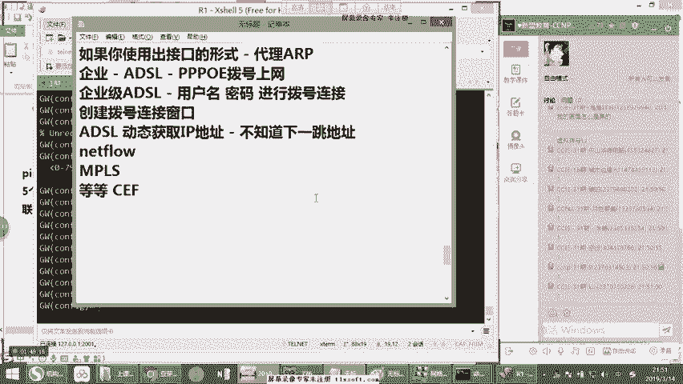

记住，路由是网络的基础，而静态路由是构建可控、稳定网络环境的基石。下一节，我们将开始探索能够自动适应网络变化的**动态路由协议**。