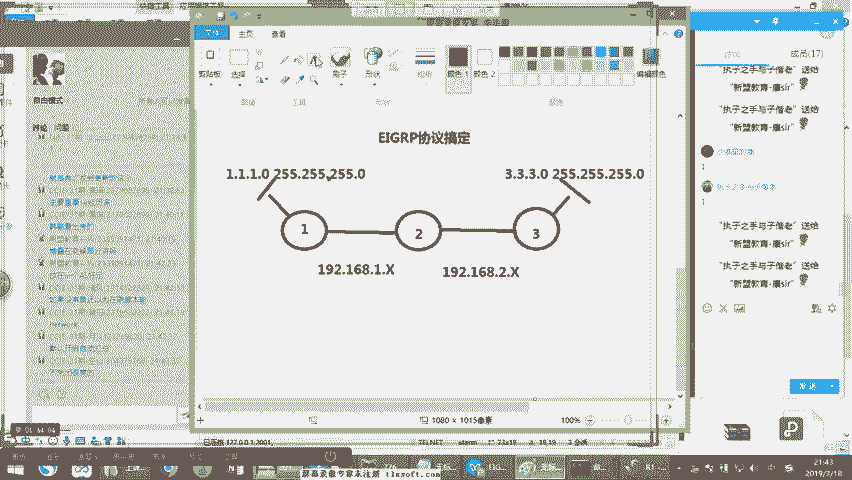
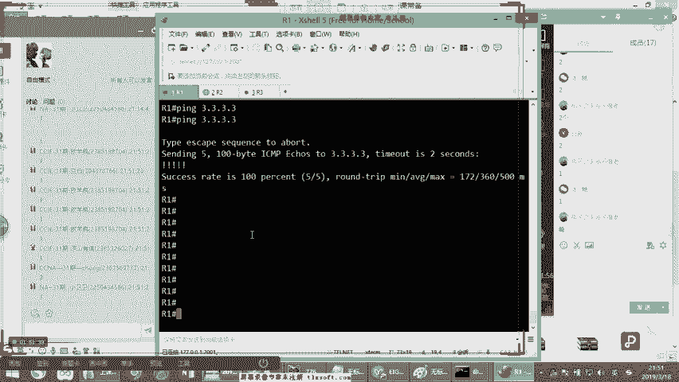

# 思科认证CCNA网络技术：第9节：EIGRP协议详解 🚀


在本节课中，我们将深入学习思科私有协议EIGRP（增强型内部网关路由协议）。我们将探讨其工作原理、核心算法、配置方法以及它为何在某些网络环境中备受青睐。

---

## 协议概述与背景

上一节我们介绍了静态路由以及距离矢量与链路状态协议的区别。本节中，我们来看看一个结合了二者特点的协议——EIGRP。

EIGRP全称为**增强型内部网关路由协议**。它是思科私有协议IGRP的升级版，后期已对其他厂商开放。虽然OSPF协议更为普及，但在一些全思科设备构成的环境中（如部分银行或外企网络），EIGRP因其**收敛速度快**的优势仍被使用。

> **收敛速度**：指网络拓扑发生变化后，路由协议重新计算并稳定到最优路径的速度。收敛越快，网络中断时间越短。

---

## 核心概念：管理距离与度量值

理解EIGRP前，需要回顾两个上节课提到的关键概念：

*   **管理距离 (Administrative Distance)**：用于比较**不同路由协议**获悉的、通往同一目的地的路由条目。数值越小，优先级越高。EIGRP的默认管理距离是 **90**。
*   **度量值 (Metric)**：用于在**同一路由协议内**，比较通往同一目的地的**不同路径**。EIGRP使用一个复合度量值进行计算。

当一台设备从不同协议学到相同路由时，比较**管理距离**。当从同一协议（如EIGRP）的不同路径学到相同路由时，则比较**度量值**。

---

## EIGRP的复合度量值

EIGRP的度量值是一个复合值，默认参考以下两个参数进行计算：
1.  **带宽 (Bandwidth)**：路径中的最小带宽。
2.  **延迟 (Delay)**：路径的总延迟。

此外，它还可以选择性地参考可靠性(Reliability)、负载(Load)和MTU，但默认不启用。度量值的计算公式相对复杂，我们只需知道它由带宽和延迟计算得出，用于选择最优路径。

---

## EIGRP的工作机制与三张表

EIGRP通过三张表来维护路由信息：

1.  **邻居表 (Neighbor Table)**：记录所有建立了EIGRP邻居关系的直连路由器。
2.  **拓扑表 (Topology Table)**：包含从所有邻居那里学到的、通往目标网络的所有可能路由（需满足特定条件）。
3.  **路由表 (Routing Table)**：从拓扑表中选出**最优路径**（后继者）放入此表，用于实际数据转发。

以下是EIGRP的关键工作角色：
*   **后继者 (Successor)**：当前到达目的网络的最优下一跳路由器，其路由条目存放在**路由表**中。
*   **可行后继者 (Feasible Successor)**：到达目的网络的备份下一跳路由器，其路由条目存放在**拓扑表**中。要成为可行后继者，必须满足可行性条件(FC)。

---

## 可行性条件与快速收敛

EIGRP快速收敛的秘诀在于其**可行后继者**和**DUAL（弥散更新）算法**。

**可行性条件 (Feasible Condition, FC)**：一个邻居要成为可行后继者，它**通告**的到达目的网络的度量值（称为**通告距离，AD**），必须**小于**本地路由器当前最优路径的**可行距离 (FD)**。

> **可行距离 (FD)**：本地路由器到达目的网络当前最优路径的总度量值。
> **通告距离 (AD)**：邻居路由器通告的、它自己到达该目的网络的度量值。

**简单比喻**：你想买一部手机。最优路径（后继者）的朋友A说：“我进货价3000元，卖你4000元”（FD=4000）。备份路径（可行后继者）的朋友B说：“我进货价3500元”。由于3500（B的AD）< 4000（当前FD），B满足FC，成为可行后继者。如果A断联，你可以立即以“3500元+少量利润”的价格从B那里购买，实现快速切换。

如果拓扑表中没有满足FC的可行后继者，当主路径失效时，路由器会启动**DUAL算法**，向所有邻居发送**查询(Query)**报文，寻找新路径，并等待**应答(Reply)**。这个过程比直接切换要慢。

---

## EIGRP的报文与邻居建立

EIGRP使用多种报文类型来维持邻居关系和交换路由信息：

*   **Hello报文**：用于发现和维持邻居关系。默认每5秒发送一次，保持时间为15秒。**以组播方式**发送到 `224.0.0.10`。
*   **Update报文**：携带路由更新信息。在邻居关系建立时或拓扑变化时发送，采用**增量更新**（只发送变化的部分）和**可靠传输**（需要确认）。
*   **ACK报文**：确认收到的Update报文，以**单播**方式发送。
*   **Query与Reply报文**：在DUAL算法计算过程中使用。


建立EIGRP邻居必须满足以下条件：
1.  收到对方的Hello报文。
2.  双方配置的**自治系统号(AS)**相同。
3.  计算度量值的**K值**（即权重因子，决定参考哪些参数）必须一致。


---



## 基础配置演示

以下是一个简单的三台路由器EIGRP配置示例，实现全网互通。



**拓扑说明：**
*   R1 - R2: 网段 `192.168.1.0/24`
*   R2 - R3: 网段 `192.168.2.0/24`
*   R1 环回口: `1.1.1.1/24`
*   R3 环回口: `3.3.3.3/24`

**配置步骤：**

1.  **在R1上配置：**
    ```cisco
    ! 进入全局配置模式
    configure terminal
    ! 启动EIGRP进程，自治系统号为100
    router eigrp 100
    ! 关闭自动汇总（重要，避免路由黑洞）
    no auto-summary
    ! 宣告直连网段（注意使用反掩码）
    network 192.168.1.0 0.0.0.255
    network 1.1.1.0 0.0.0.255
    ```

2.  **在R2上配置：**
    ```cisco
    configure terminal
    router eigrp 100
    no auto-summary
    network 192.168.1.0 0.0.0.255
    network 192.168.2.0 0.0.0.255
    ```

3.  **在R3上配置：**
    ```cisco
    configure terminal
    router eigrp 100
    no auto-summary
    network 192.168.2.0 0.0.0.255
    network 3.3.3.0 0.0.0.255
    ```

**验证命令：**
*   `show ip route`：查看路由表，应能看到以 `D` 标记的EIGRP路由。
*   `show ip eigrp neighbors`：查看EIGRP邻居表。
*   `ping 3.3.3.3`：在R1上测试与R3环回口的连通性。

---

## 总结


本节课中我们一起学习了EIGRP协议。我们了解到EIGRP是一个高级距离矢量协议，具有收敛快速的优点。其核心在于通过**后继者**和**可行后继者**实现备份，并利用**DUAL算法**确保无环路径计算。我们掌握了其**管理距离**、**复合度量值**、**三张表**的关系，以及通过**Hello**、**Update**等报文维持邻居和更新路由的机制。最后，我们完成了基础的EIGRP配置，实现了网络互通。

理解EIGRP的工作原理，对于构建稳定、高效的网络至关重要。