# 网络工程入门：01：行业介绍与职业规划 🚀

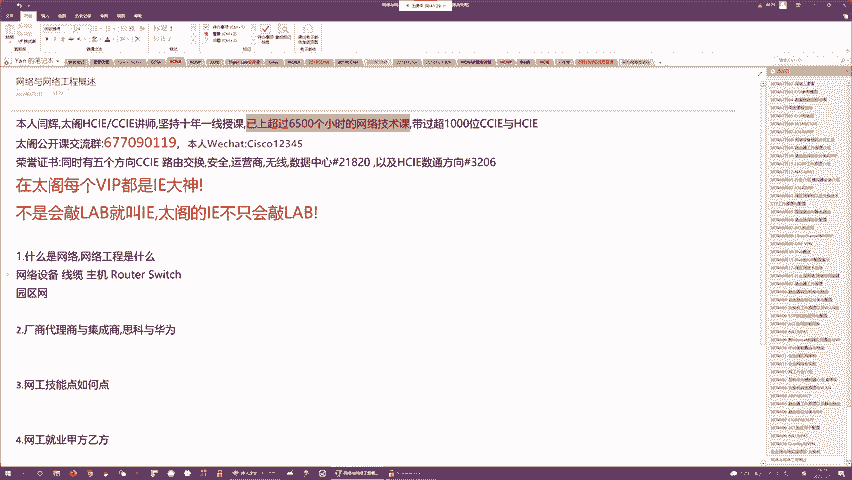

在本节课中，我们将要学习网络工程的基本概念、行业内的主要厂商、产业链结构以及网络工程师的职业发展路径。通过本节课，你将了解什么是网络，什么是网络工程，以及学习这门课程后能获得哪些技能，未来可以从事什么样的工作。

## 什么是网络与网络工程？ 🌐

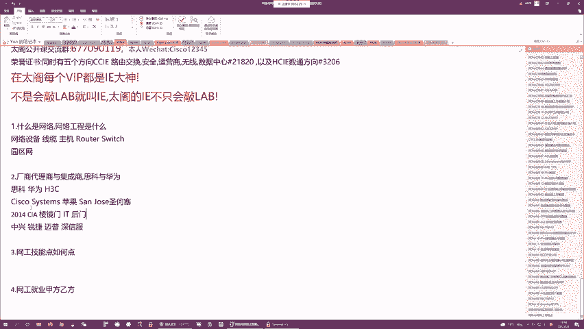

网络是由网络设备（如路由器、交换机）、线缆和主机（如计算机、服务器）连接在一起，使主机之间能够相互通信的计算机系统。网络中的主体是网络设备。

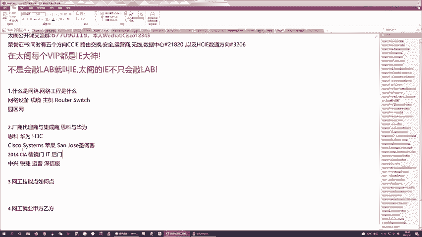

网络工程是指通过调试网络设备，实现网络联通的工作。从事网络工程的人被称为网络工程师，简称网工。

## 网络设备厂商 🏢

网络设备由特定的厂商制造。厂商可以分为一线和二线。

### 一线厂商
一线厂商产品线广，能提供网络领域几乎所有设备的解决方案。国内主要的一线厂商有三家：
*   **思科 (Cisco)**：美国公司，技术领先，是网络设备领域的标杆，类似于手机行业的苹果。其设备操作系统为 **IOS**。
*   **华为 (Huawei)**：中国公司，从通信领域扩展到企业网络市场。其设备操作系统为 **VRP**。
*   **新华三 (H3C)**：原为华为与3Com的合资公司，几经易手，现为清华紫光旗下。其设备操作系统早期与华为相同，现为 **Comware**。

### 二线厂商
二线厂商产品线相对单一，通常专注于某个细分领域，例如：
*   中兴 (ZTE)
*   锐捷 (Ruijie)
*   迈普 (Maipu)
*   深信服 (Sangfor)

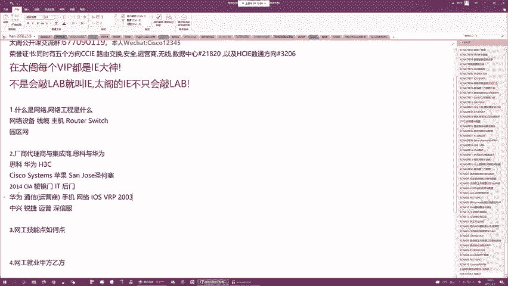

## 网络产业链结构 🔗

网络产业链主要包含以下几个角色：

### 厂商
负责研发、设计和生产网络设备及制定技术标准。

### 代理商
代理特定厂商的产品，负责销售、实施和售后服务。代理商内部主要角色有：
*   **销售**：开拓客户，促成交易。
*   **售前工程师**：配合销售，根据客户需求提供技术方案。
*   **售后工程师**：负责设备交付、安装、调试、运维和故障排除。

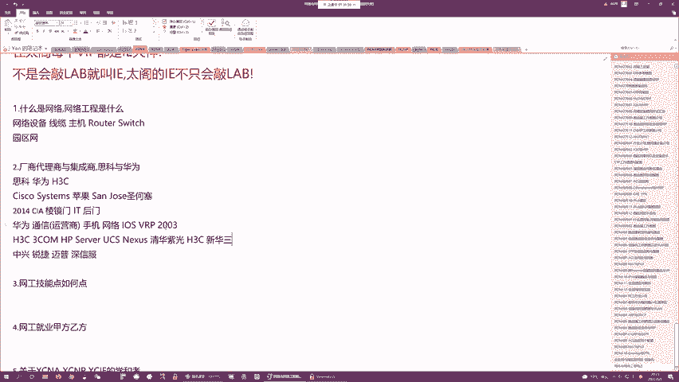

### 集成商
规模较小的公司，业务灵活，可集成多家厂商的产品，为中小型项目提供一站式解决方案。员工往往身兼数职。

### 甲方
即采购方，如运营商、大型企业、数据中心等。甲方设立IT部门，负责制定IT战略、采购设备、管理项目并运维系统。甲方工程师需要了解技术，但更多侧重于规划、管理和协调。

## 网络工程师的技能与职业发展 🛠️

要成为一名合格的网络工程师（以售后为例），需要掌握三大核心技能：

1.  **网络通信原理**：理解数据如何在网络中端到端传输，掌握 **OSI/TCP/IP** 模型及各种通信协议。
2.  **网络架构设计**：了解不同场景（企业网、数据中心、运营商网络）的网络架构设计方法。
3.  **设备配置与排错**：掌握登录和配置网络设备的方法，包括命令行（CLI）和新型的API（如NETCONF/RESTCONF）配置方式。

随着技能提升，工程师可以沿着以下路径发展：

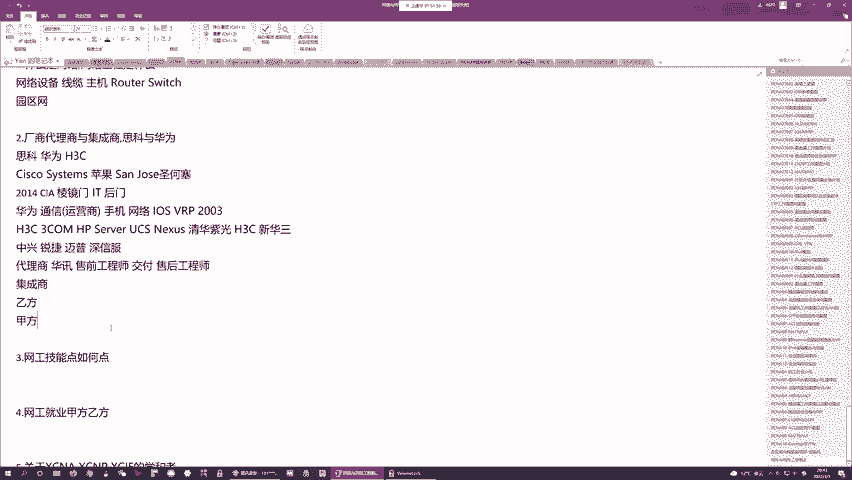

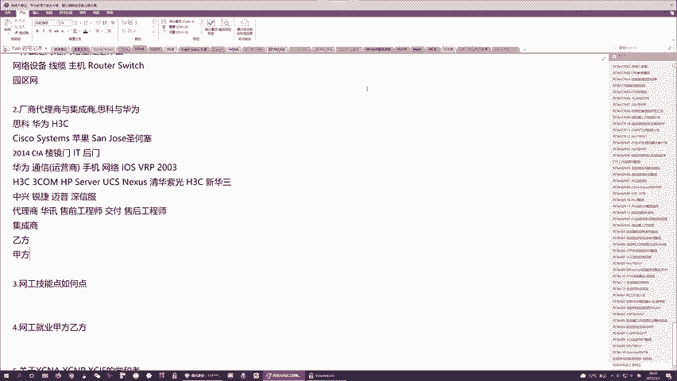

*   **认证路径**：从初级认证（如HCIA/CCNA）到中级认证（如HCIP/CCNP），最终到专家级认证（如HCIE/CCIE）。高级认证是获得高薪职位的重要敲门砖。
*   **职业路径**：
    *   **乙方发展**：从售后工程师起步，可转向售前工程师或销售，也可深耕技术成为技术总监。
    *   **甲方发展**：通常在乙方积累经验后，转向甲方的IT部门，工作更侧重于规划、管理和运维，相对稳定。

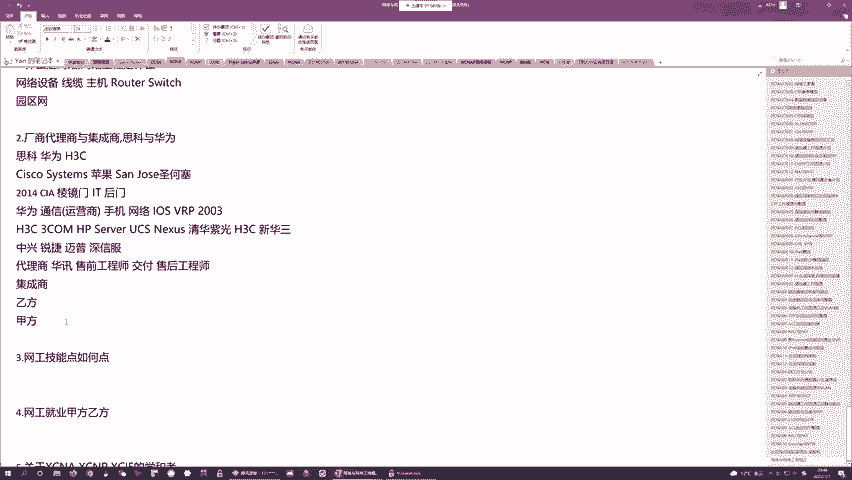

## 课程体系与学习建议 📚

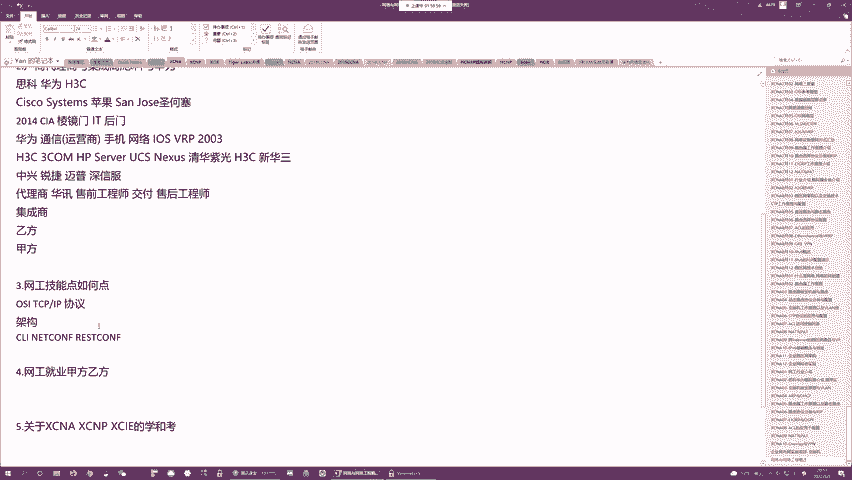

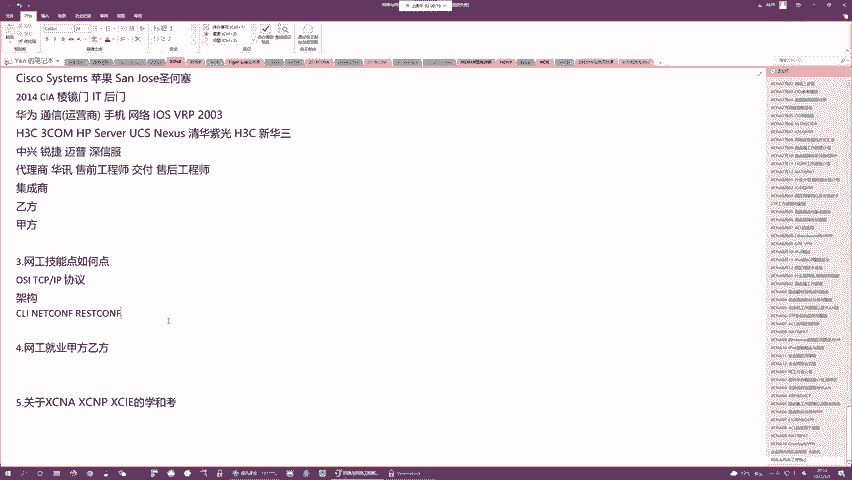

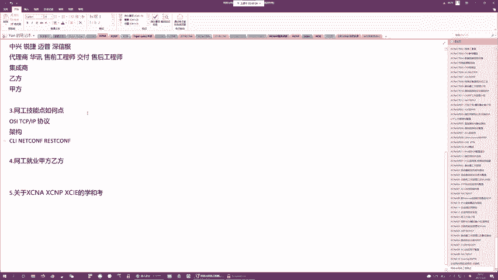

我们的课程体系遵循从易到难的原则：

*   **NA (初级)**：零基础入门，讲解网络基础框架、协议原理和基本命令。
*   **NP (中级)**：深化路由交换等核心技术的理解，培养设计、分析和排错能力。
*   **IE (专家级)**：网络技术的金字塔尖，是获得高薪和重要职位的保证。

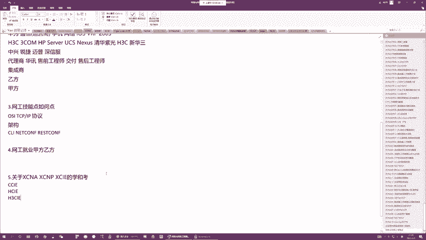

对于初学者，首要且必须学习的方向是 **路由交换**（华为称为Datacom，思科称为EI），这是所有其他网络方向（如安全、无线、数据中心）的基础。

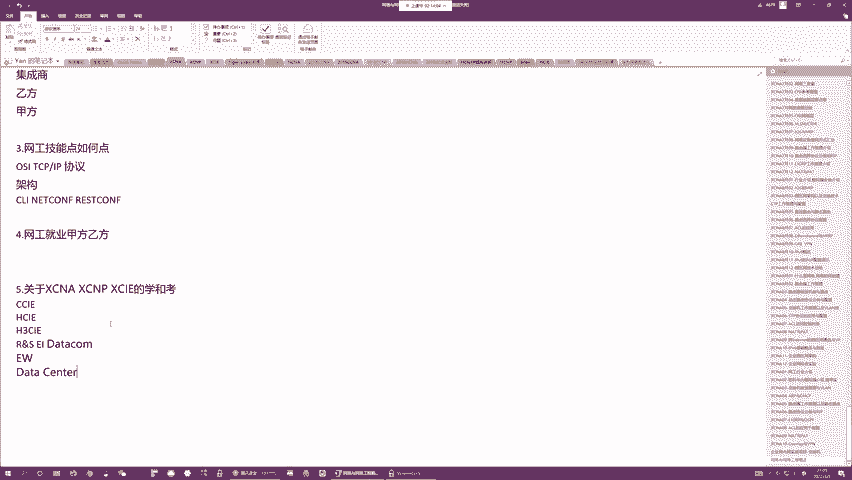

## 总结 📝

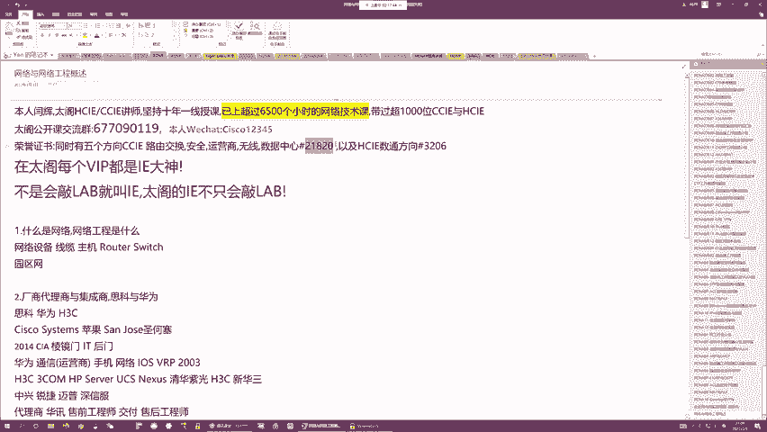

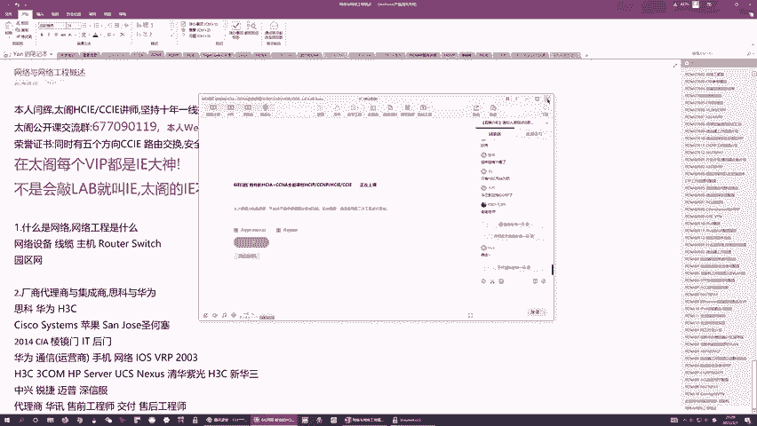

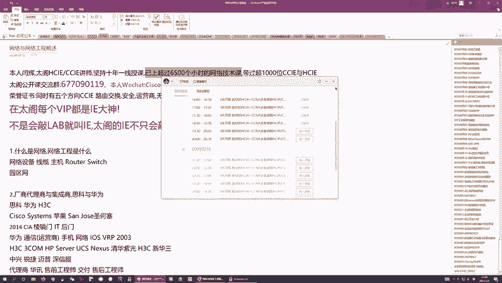

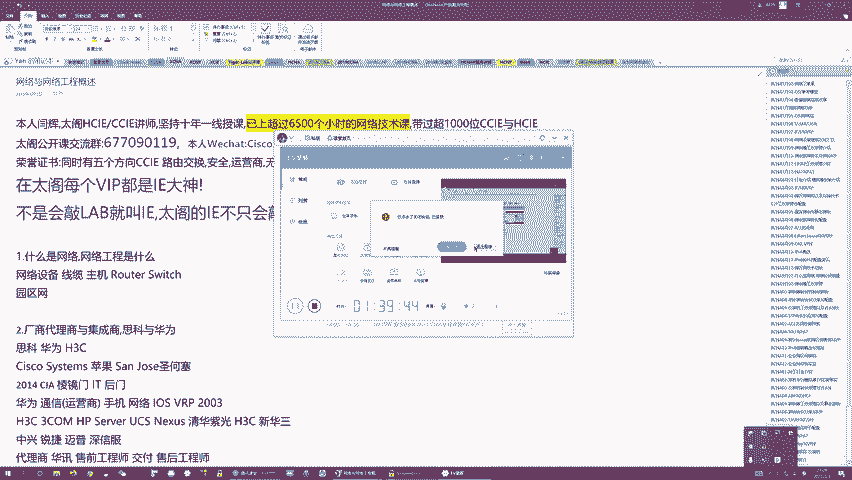

本节课我们一起学习了网络与网络工程的基本定义，认识了思科、华为、新华三等主要设备厂商，了解了由厂商、代理商、集成商和甲方构成的产业链。我们还探讨了网络工程师所需的三大核心技能以及从初级到专家的认证与职业发展路径。最后，明确了以路由交换为基础开始学习的重要性。希望本节课能帮助你建立起对网络行业的整体认知，为后续的技术学习打下坚实的基础。