# 华为认证HCIA-DATACOM教程：P11：XCNA-11-VLAN

## 概述

在本节课中，我们将要学习交换机上最常用的技术之一——VLAN。VLAN是一个用于隔离广播域的二层工具，而非协议。我们将了解VLAN的作用、工作原理，以及交换机上三种关键的接口模式：Access、Trunk和Hybrid。通过本课的学习，你将掌握如何通过VLAN来规划和优化企业网络。

---

## VLAN的基本概念与作用

上一节我们介绍了交换机的基本工作原理，本节中我们来看看VLAN这个核心工具。

VLAN的全称是Virtual Local Area Network，即虚拟局域网。它的核心作用是在二层交换机上实现广播域的隔离。

在设计网络时，一个广播域内的主机数量不宜过多（通常建议不超过300台）。如果主机数量过多，虽然通信仍能进行，但网络质量会变差。这是因为在一个以太网环境中，主机发送的广播帧（如ARP请求）会被同一广播域内的所有主机接收和处理，造成不必要的资源消耗和潜在的网络拥塞。

传统上，我们使用路由器来隔离不同的网络（广播域）。然而，路由器接口数量有限、成本较高，且其基于软件的三层转发效率低于交换机的硬件二层转发。因此，在企业内网中，我们更倾向于使用交换机作为主要互联设备。

那么，如何仅用交换机来实现网络隔离呢？答案就是使用VLAN。

**VLAN的本质是一个二层隔离工具**。交换机收到一个数据帧后，首先需要确定这个帧来自哪个VLAN。一旦确定，交换机就只能将该帧转发给同一VLAN内的其他成员。来自VLAN A的流量不能通过二层交换直接发送给VLAN B的成员。

*   **同一VLAN内的主机**：IP地址属于同一网段，可以通过二层交换直接通信。
*   **不同VLAN间的主机**：IP地址属于不同网段，它们之间的通信必须通过三层设备（如路由器或三层交换机）进行路由转发。

默认情况下，交换机所有接口都属于VLAN 1。因此，未配置VLAN时，所有连接的主机都在同一个广播域内。通过创建新的VLAN并将交换机接口划分到不同的VLAN，我们可以将一个大广播域分割成多个小的广播域。

---

## 交换机的接口模式

了解了VLAN的基本作用后，我们来看看交换机上如何配置接口以支持VLAN。以下是交换机三种主要的二层接口模式：

### Access接口

Access接口通常用于连接终端设备，如PC、服务器或路由器。

*   **特点**：一个Access接口只能属于一个VLAN，这个VLAN称为该接口的PVID。
*   **数据帧处理**：
    *   **接收**：收到不带VLAN标签的帧，会打上接口PVID的标签；收到带标签的帧，仅当标签VLAN ID与接口PVID一致时才接收。
    *   **发送**：在将帧发送给终端设备前，会剥离VLAN标签，因为终端设备无法识别带标签的帧。

### Trunk接口

Trunk接口通常用于交换机之间的互联，以实现跨交换机的VLAN通信。

*   **特点**：可以允许多个VLAN的流量通过，用于链路复用。有一个特殊的“本征VLAN”，默认为VLAN 1。
*   **数据帧处理**：
    *   **接收**：收到带标签的帧，根据标签确定VLAN；收到不带标签的帧，则认为是来自本征VLAN。
    *   **发送**：对于非本征VLAN的帧，携带标签发送；对于本征VLAN的帧，则不带标签发送。某些协议报文（如STP BPDU）必须在本征VLAN中不带标签传输。

### Hybrid接口

Hybrid接口是华为设备的特色模式，兼具Access和Trunk接口的特性，提供了更灵活的标签控制能力。

*   **特点**：可以以`tagged`或`untagged`方式加入多个VLAN。接口的PVID用于标识收到的无标签帧所属的VLAN。
*   **数据帧处理**：
    *   **接收**：根据是否带标签以及接口配置决定是否接收。
    *   **发送**：根据接口上针对该VLAN的配置是`tagged`还是`untagged`，决定发送时是否携带标签。这允许我们精细控制流量在何处剥离标签。

**Hybrid接口的默认隐藏命令**：华为交换机的Hybrid接口默认有两条隐藏命令：`port hybrid pvid vlan 1` 和 `port hybrid untagged vlan 1`。这使得未配置的接口默认允许VLAN 1的流量以无标签方式通行。

---

## VLAN的部署方式

根据VLAN成员关系的确定方式，可以分为静态部署和动态部署。

### 基于接口的静态VLAN部署

这是最常用、最标准的部署方式。
*   **方法**：在交换机上创建VLAN，然后将交换机的接口（设为Access模式）静态绑定到特定的VLAN。
*   **特点**：配置简单、稳定。接口连接的主机自动属于该接口绑定的VLAN。

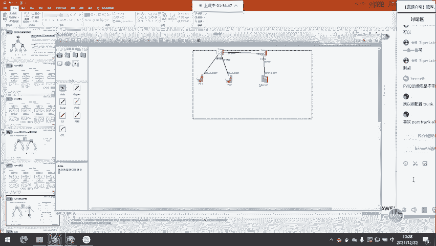

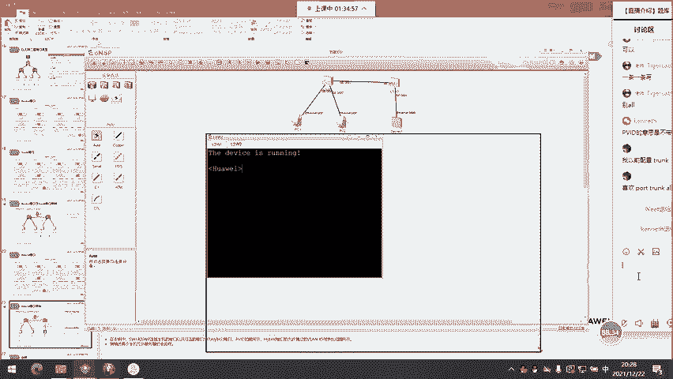

### 基于MAC地址的动态VLAN部署

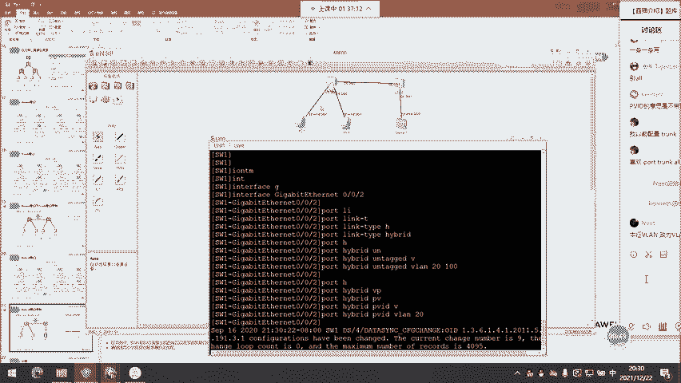

这种方式提供了设备移动的灵活性。
*   **方法**：在交换机上创建VLAN，并将VLAN与主机的MAC地址进行绑定。连接主机的接口需设置为Hybrid模式，并`untagged`方式放行相关VLAN。
*   **特点**：主机无论连接到网络中哪台交换机的哪个接口，只要其MAC地址已绑定，就能保持其VLAN身份不变。适用于小型网络或特定安全要求场景，大型网络配置维护工作量巨大。

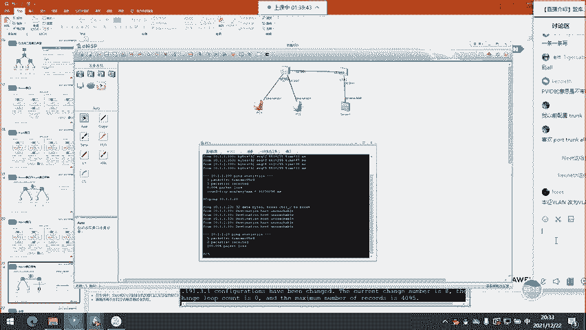

其他动态VLAN部署方式（如基于IP子网、协议、策略）在实际应用中较少见。

---

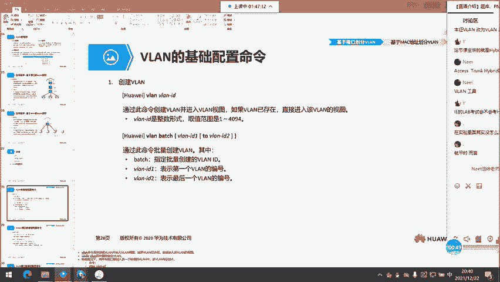

## VLAN间通信与802.1Q标签

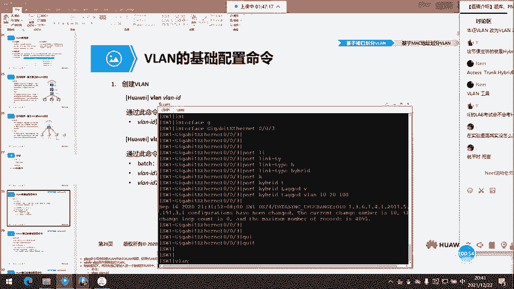

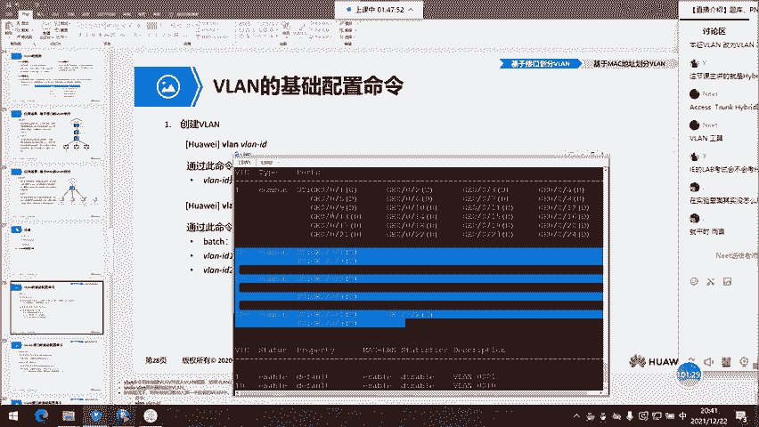

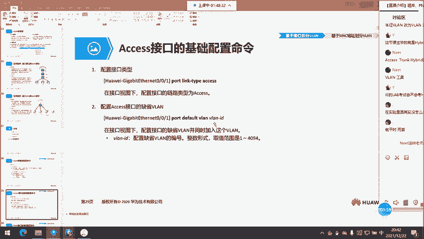

要实现跨交换机的同一VLAN内通信，交换机间链路必须能够区分不同VLAN的流量。这是通过802.1Q标签实现的。

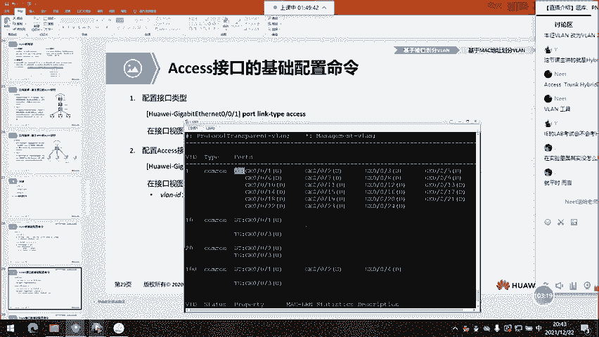

**802.1Q帧格式**：在标准的以太网帧头（目的MAC、源MAC、类型字段）之间，插入了4字节的802.1Q标签。
*   **TPID**：固定值0x8100，表明这是一个带802.1Q标签的帧。
*   **Priority**：3比特，用于QoS优先级。
*   **CFI**：1比特，通常为0。
*   **VLAN ID**：12比特，标识VLAN，范围1-4094。

**通信流程示例**：
1.  PC1（VLAN 10）发送无标签帧给Switch1。
2.  Switch1从Access接口收到帧，打上VLAN 10的标签。
3.  Switch1通过Trunk链路将带VLAN 10标签的帧发送给Switch2。
4.  Switch2从Trunk接口收到带标签帧，识别出属于VLAN 10。
5.  Switch2将帧转发给目标PC2（VLAN 10）所在的Access接口，并在发送前剥离VLAN 10标签。
6.  PC2收到标准的无标签以太网帧。

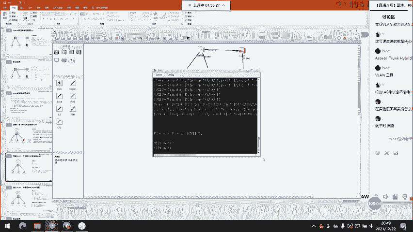

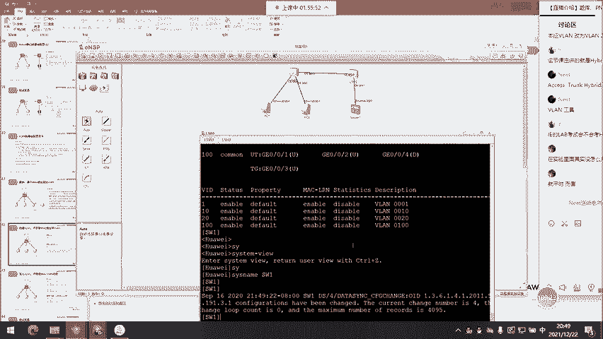

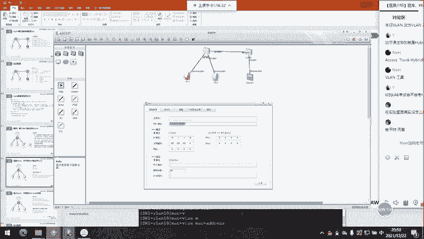

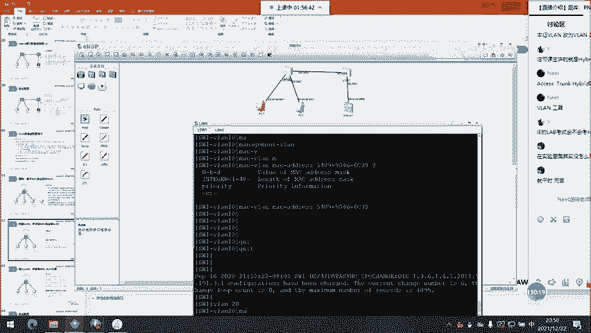

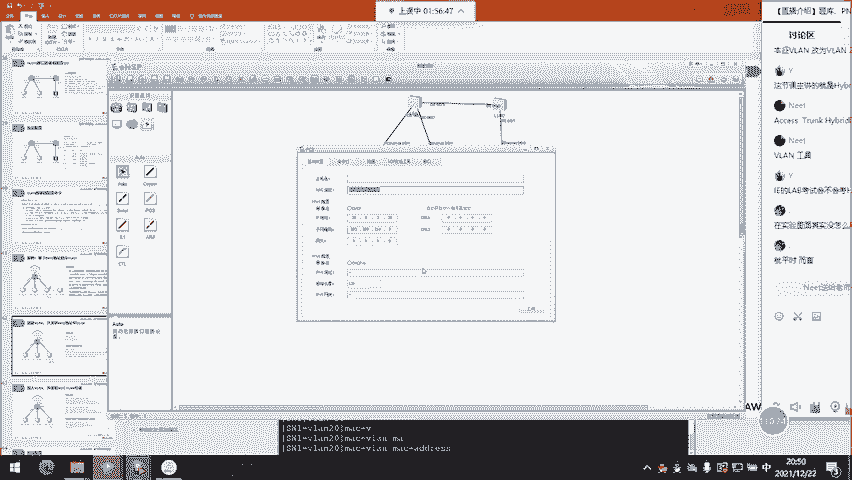

---

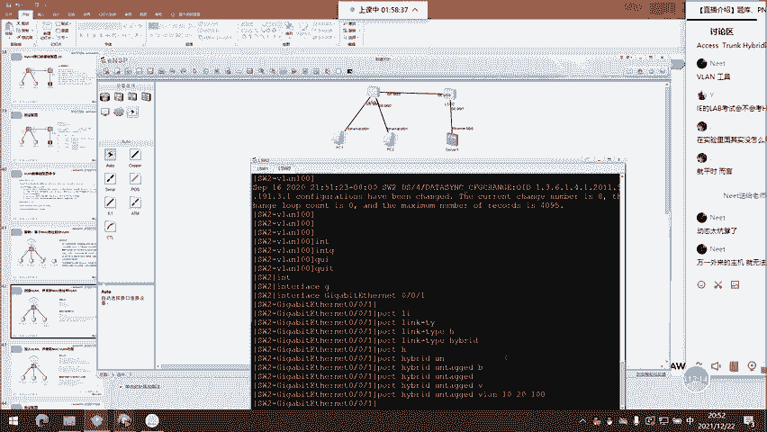

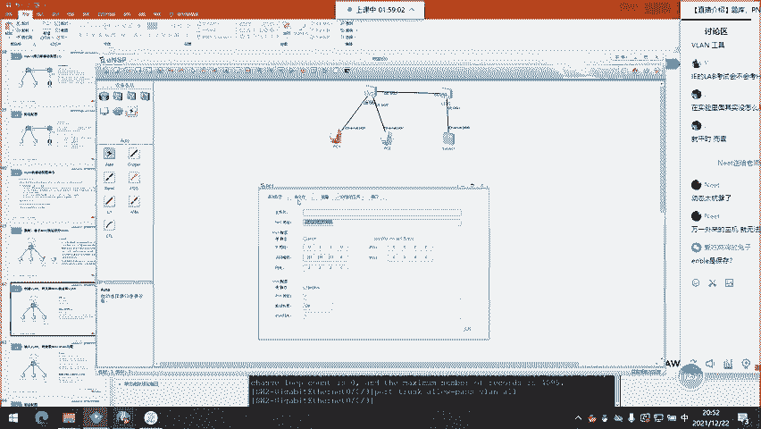

## 总结

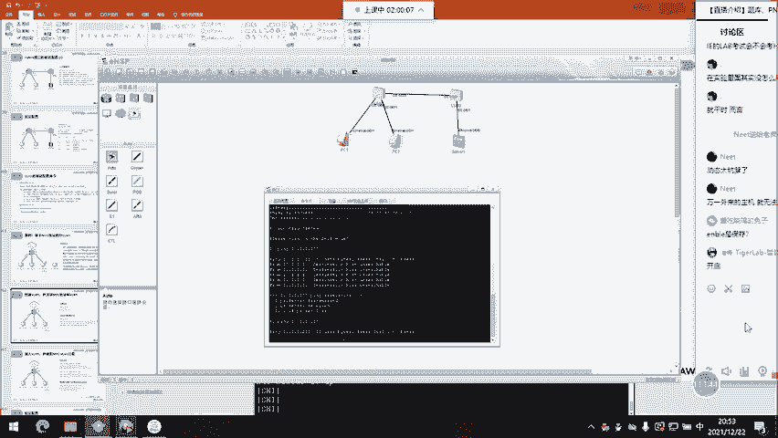

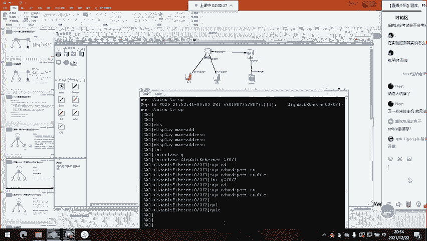

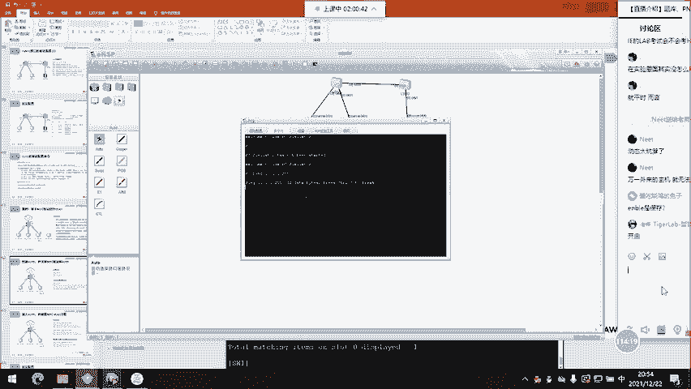

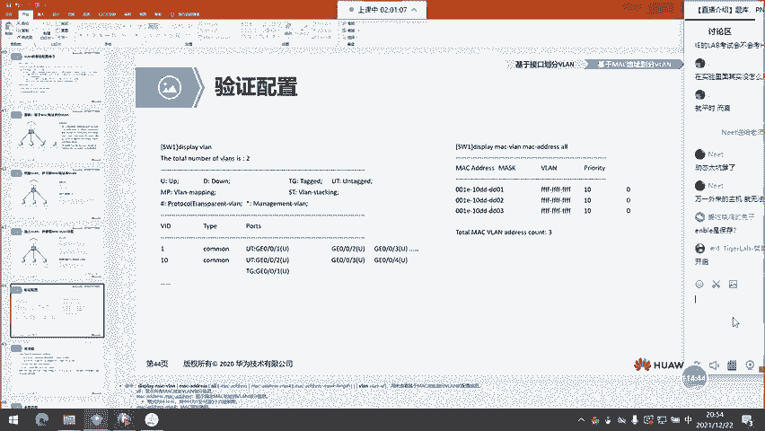

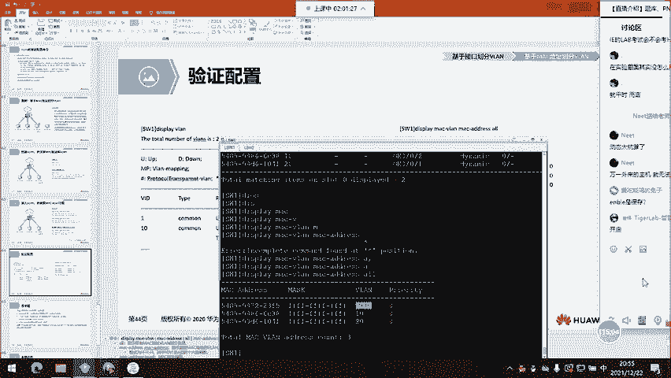

本节课中我们一起学习了VLAN技术的核心内容。

我们首先明确了**VLAN是一个二层隔离工具**，用于将大的广播域划分为多个小的广播域，从而提高网络效率和安全性。同一VLAN内主机可直接二层通信，不同VLAN间主机通信需要三层设备介入。

接着，我们深入探讨了交换机上支持VLAN的三种接口模式：连接终端的**Access接口**、交换机互联的**Trunk接口**，以及华为特色、功能灵活的**Hybrid接口**。每种接口对数据帧标签的处理方式是其关键区别。

然后，我们了解了VLAN的两种主要部署方式：最常用的**基于接口的静态部署**和基于MAC地址的**动态部署**。

最后，我们学习了跨交换机VLAN通信的基础——**802.1Q标签协议**，它通过在以太网帧中插入VLAN ID标签，使得Trunk链路能够承载多个VLAN的流量。

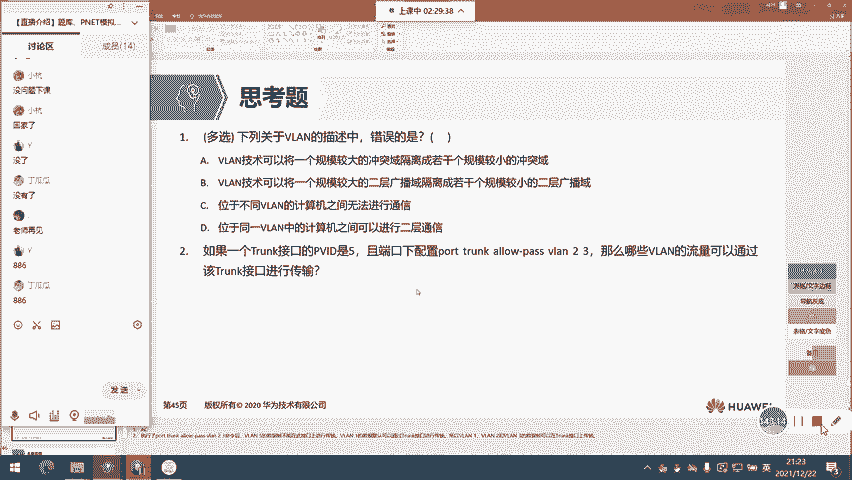

掌握VLAN是构建高效、可管理企业网络的基础。在后续课程中，我们将学习如何实现不同VLAN之间的通信（如单臂路由、SVI），以及更高级的VLAN扩展技术。