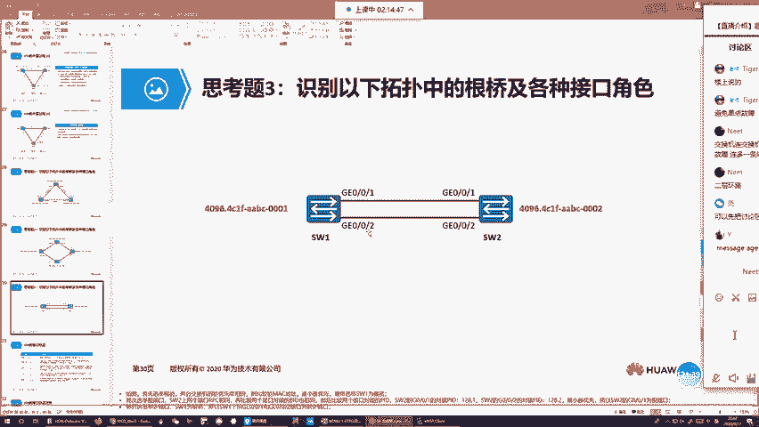
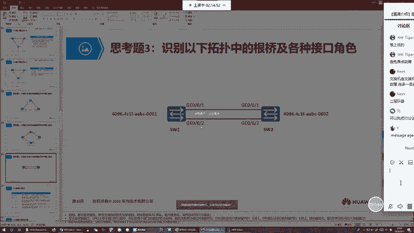
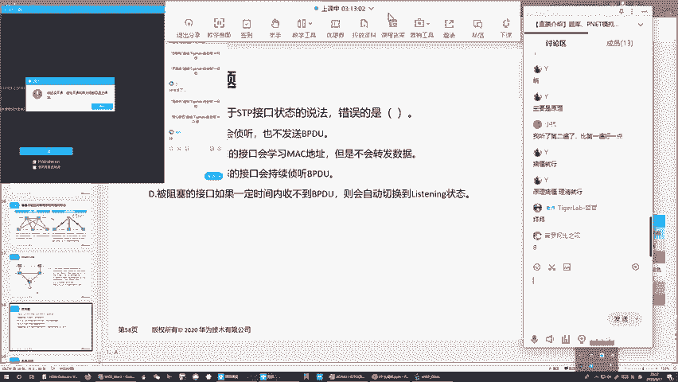

# 华为认证HCIA-DATACOM教程：P12：XCNA-12-STP

## 概述

在本节课中，我们将学习生成树协议（STP）的核心原理。STP是二层网络中防止环路和广播风暴的关键协议。我们将从交换机的工作原理和缺陷入手，逐步理解环路产生的原因，并深入探讨STP如何通过选举机制阻塞冗余路径，构建无环网络拓扑，同时保证网络的高可用性。

---

## 交换机的工作原理与缺陷

上一节我们介绍了交换机的基本转发机制。本节中我们来看看交换机控制层面的一个重要缺陷。

交换机总会认为，通过一个接口收到一个帧，那么该帧的发送者主机就连在这个接收接口上。换句话说，交换机认为一个网络里所有能收到其数据的主机都直连在它的某个接口上。

由于这种认知，交换机无法真正了解网络的整体连接情况，其对于网络连接的认知是有缺陷的。

**示例场景**：
假设有一台主机A连接在Switch1上，Switch1连接Switch2。当主机A发送数据时，Switch2能收到。Switch2会认为主机A连接在它接收数据的接口上。但实际上，这个接口连接的是Switch1，而Switch1身后才连接着主机A。

这种错误的连接认知，会导致在一个包含多台交换机的网络中，由于交换机的认知问题，引发交换环路和广播风暴。

---

## 冗余设计与环路问题

在设计网络时，我们通常使用交换机。一个标准的交换机通常有24个下行接口，最多连接24台主机。如果网络需要包含更多主机，就需要添加更多交换机，并将它们连接起来。

### 单点故障与冗余

如果网络中只有两台交换机，用一根线连接，虽然能通信，但可靠性不高。这根线一旦故障，网络就会被分隔。这被称为**单点故障**，即由于没有连接冗余，端到端通信只有一条可行路径，一旦该路径故障，整体网络就会崩溃。

规避单点故障最简单的方式是增加冗余连接。例如，连接两根线。这样不仅带宽翻倍，而且当一根线故障时，流量可以切换到另一根链路，继续通信，从而提供网络高可用性，增加网络健壮性。

**冗余**：指相同的东西准备两份或多份。例如，交换机间连接两根线，这两根线就是冗余关系。

### 冗余带来的新问题：环路与广播风暴

然而，连接冗余链路后，网络会出现新的问题。

**实验场景分析**：
假设主机A和主机B都属于VLAN 10。交换机连接主机的接口是接入接口，绑定VLAN 10。交换机间互联的链路使用中继链路，并放行VLAN 10的流量。

1.  **ARP广播泛洪**：主机A发送给主机B的第一个报文通常是ARP请求广播。Switch1收到后，会学习主机A的MAC地址，并将其与接收接口关联。由于是广播帧，Switch1会进行泛洪，通过VLAN 10的所有其他接口（包括两条上行中继链路）发送出去。
2.  **MAC地址表漂移**：Switch2会先后通过上下两条链路收到这个广播帧。它会先通过上面链路学到主机A的MAC表象，然后又通过下面链路收到，瞬间将表象更新为下面接口。这称为**MAC地址表象漂移**。
3.  **环路形成**：Switch2收到广播帧后，同样会进行泛洪。它会将帧发送给主机B，同时也会通过另一条中继链路发回给Switch1。Switch1收到返回的广播帧后，又会再次学习（导致MAC表象再次漂移）并再次泛洪。如此循环，广播帧会在两台交换机间来回传递，永无止境。
4.  **广播风暴**：主机A产生的一份广播流量，会被拷贝成多份，在冗余链路间来回发送。由于二层帧头中没有类似IP TTL的限制字段，这些帧永远不会被丢弃。随着广播报文越来越多，链路带宽和交换机转发资源会被耗尽，最终导致网络假死，这就是**广播风暴**。

**环路与风暴的根源**：根源在于交换机控制层面的认知缺陷（认为帧的发送者直连接收接口）。当网络中包含多台交换机且存在冗余链路时，就会引发环路和广播风暴。

---

## 生成树协议（STP）的引入

既然交换机的认知无法提升，那么如何防止环路呢？一个直接的方法是**不连接冗余链路**，只连一根线。这样确实能消除环路和广播风暴，但会引入单点故障，客户无法接受。

因此，我们需要一种在冗余连接环境下避免环路和广播风暴的机制，这就是**生成树协议（STP）**。

### STP的定位与作用

STP通过一个树形结构算法，判断交换机间哪些链路最优，哪些是次优的冗余路径。然后，它会阻塞所有冗余路径，只保留最优的无环路径来转发数据。

**核心作用**：
1.  **阻塞冗余路径**：分析网络拓扑，阻塞非最优的冗余链路，确保任意两点间只有一条无环路径。
2.  **实时监控与自适应调整**：持续监控网络状态（交换机、接口、链路）。当拓扑发生变化（如链路故障）时，根据变更进行自适应调整（如恢复曾被阻塞的路径）。

这样，我们既设计了冗余连接以保证高可用性，又通过STP临时阻塞冗余路径解决了环路问题。当最优路径故障时，STP能快速恢复被阻塞的路径，保证通信不中断。

**协议版本**：
*   **STP (802.1D)**：第一代，经典生成树。
*   **RSTP (802.1W)**：第二代，快速生成树，收敛速度快。
*   **MSTP (802.1S)**：第三代，多生成树，效率高且兼容性好。

本节课我们重点学习STP (802.1D) 的工作原理。

---

## STP关键概念与参数

在深入STP选举过程前，我们需要先理解几个核心概念和参数。

### 1. 桥ID (Bridge ID, BID)

桥ID是交换机的标识符，类似于OSPF中的Router ID。
*   **格式**：8字节。前2字节是**优先级**，后6字节是交换机的**背板MAC地址**（全球唯一）。
*   **优先级**：取值范围0-65535。实际可配置部分为前4比特，因此调整值必须是**4096的倍数**。默认值为32768。
*   **作用**：用于选举根桥。比较BID时，**值越小越优**。先比较优先级，优先级相同则比较MAC地址。

### 2. 路径开销 (Cost)

路径开销用于衡量链路的优劣，基于带宽计算。
*   **原则**：带宽越高，开销值越小，链路越优。
*   **计算公式标准**：有多种，如802.1D-1998标准、华为私有标准、802.1T标准。**802.1T标准**是线性计算，更合理（例如：百兆=200,000，千兆=20,000，万兆=2,000）。
*   **根路径开销 (RPC)**：一台非根桥通过某接口到达根桥的端到端路径上，所有**入方向**接口的Cost值累加总和。这是选择最优路径的关键依据。

### 3. 端口ID (Port ID)

端口ID是交换机接口的标识符。
*   **格式**：2字节。前1字节是**端口优先级**，后1字节是**端口编号**。
*   **优先级**：默认128。修改时通常为16的倍数（依设备型号而定）。
*   **作用**：在比较路径优劣时，作为最后的裁决依据。比较时也是**值越小越优**。

### 4. BPDU (网桥协议数据单元)

BPDU是STP协议交互的报文，是选举和监控的基础。
*   **封装**：基于802.3封装。
*   **类型**：
    *   **配置BPDU**：由根桥周期性（默认2秒）发送，用于维护拓扑信息。
    *   **TCN BPDU**：当拓扑发生变化时，由感知变化的交换机产生，用于通知根桥。
*   **关键字段**：
    *   **Root ID**：根桥的BID。
    *   **RPC**：根路径开销。根桥始发时为0，每经过一台交换机，就在接收接口累加该接口的Cost值。
    *   **Bridge ID**：转发此BPDU的交换机的BID。
    *   **Port ID**：发送此BPDU的接口的Port ID。
    *   **Message Age**：BPDU已传递的跳数。每经过一台交换机加1，不能超过Max Age（默认20）。
    *   **Max Age**：BPDU的最大生存时间（默认20秒）。接口缓存BPDU的超时时间。
    *   **Hello Time**：根桥发送配置BPDU的周期（默认2秒）。
    *   **Forward Delay**：端口状态迁移的延迟时间（默认15秒）。用于避免临时环路。
    *   **Flags**：标志位。最重要的是**TC位**（拓扑变更位）和**TCA位**（拓扑变更确认位）。

**BPDU传递与字段变化**：
根桥始发BPDU时，Root ID和Bridge ID都是自己的BID，RPC为0，Port ID为发送接口ID。
下游交换机收到后，在**接收接口**累加RPC，将Bridge ID改为自己的BID，将Port ID改为转发接口的ID，然后发送出去。Root ID始终保持不变。

---

## STP的选举过程

STP通过三步选举来构建无环树形拓扑。

### 第一步：选举根桥 (Root Bridge)

*   **原则**：一个STP域内，有且只有一台根桥。
*   **过程**：初始时，所有交换机都认为自己是根桥，并向外发送BPDU。通过比较BPDU中的Root ID（即发送者自己的BID），**BID最小的交换机**成为根桥。
*   **结果**：根桥确定后，只有根桥会周期性发送配置BPDU。其他交换机（非根桥）停止发送，并转发根桥的BPDU。

### 第二步：在每台非根桥上选举根端口 (Root Port, RP)

*   **定义**：非根桥上**去往根桥路径最优的接口**。每台非根桥有且只有一个根端口。
*   **选举原则**：比较该非根桥所有能收到根桥BPDU的接口，选择收到“最优BPDU”的接口。
*   **比较顺序（逐级比较）**：
    1.  **比较RPC**：累加接收接口Cost后，RPC最小的路径最优。
    2.  **比较对端BID**：如果RPC相同，则比较发送该BPDU的邻居交换机的BID，越小越优。
    3.  **比较对端PID**：如果对端BID也相同（例如连接到同一台交换机的不同接口），则比较邻居发送BPDU的那个接口的Port ID，越小越优。
    4.  **比较本端PID**：如果以上全部相同（极少见，如通过Hub连接），则比较本端接收接口自身的Port ID，越小越优。
*   **结果**：选举出的根端口所连接的路径，就是该非根桥去往根桥的最优路径，将被保留用于转发数据。

### 第三步：在每个网段上选举指定端口 (Designated Port, DP)

*   **定义**：在每一个交换机互联的链路上，需要选出一个负责转发BPDU和数据流的端口，即指定端口。链路的另一端可能是根端口或**非指定端口**。
*   **选举原则**：在链路两端的端口之间进行PK，选出“更优”的一方作为DP。
*   **比较顺序**：
    1.  比较两端端口所能发出的BPDU中携带的RPC，RPC小的更优（离根桥更近）。
    2.  如果RPC相同，比较两端交换机本身的BID，BID小的更优。
    3.  如果BID也相同（例如同一台交换机的两个接口通过Hub连接对端），则比较两端端口自身的Port ID，小的更优。
*   **特殊规则**：**根桥的所有端口都是指定端口**（因为其发出的BPDU中RPC为0，总是最优）。
*   **结果**：未被选为根端口或指定端口的端口，将成为**非指定端口**，被逻辑阻塞，不转发用户数据。

**最终状态**：
*   **根端口**和**指定端口**最终会进入**Forwarding**状态，正常转发数据。
*   **非指定端口**会进入**Blocking**状态，被阻塞。

通过这三步选举，STP成功地在冗余网络中阻塞了部分链路，形成了一个无环的树形拓扑。

---

## STP的端口状态与拓扑变更

### 端口状态

为了避免临时环路，STP端口状态迁移需要时间，共有5种状态：
1.  **Disabled**：接口物理关闭。
2.  **Blocking**：阻塞状态。仅接收BPDU，不学习MAC地址，不转发数据。是非指定端口的最终状态。
3.  **Listening**：侦听状态。可以收发BPDU，参与选举，但不学习MAC地址，不转发数据。是RP/DP的临时状态，持续一个Forward Delay（15秒）。
4.  **Learning**：学习状态。可以收发BPDU，并开始学习MAC地址，但仍不转发数据。是RP/DP的另一个临时状态，再持续一个Forward Delay（15秒）。
5.  **Forwarding**：转发状态。正常收发BPDU和数据，学习MAC地址。是RP/DP的最终工作状态。

**状态迁移**：RP/DP从Blocking到Forwarding需要经历 `Listening -> Learning -> Forwarding`，总共需要30秒（2 * Forward Delay）。这保证了网络拓扑信息在全网同步，避免了临时环路。

### 拓扑变更机制

当网络拓扑发生变化（如链路故障、新增设备）时，STP需要重新收敛。收敛时间取决于变更类型：
*   **直接拓扑变更**：故障后，非根桥仍有接口能直接收到根桥BPDU。收敛较快，约需30秒（主要是Forward Delay时间）。
*   **间接拓扑变更**：故障后，非根桥所有接口都收不到根桥BPDU。需要等待Max Age（20秒）超时删除旧BPDU，才能开始重新选举，再加上Forward Delay，总时间约50秒。

为了加速MAC地址表在拓扑变更后的更新，STP引入了**TCN BPDU**机制：
1.  感知拓扑变化的交换机会从根端口向上游发送TCN BPDU。
2.  上游交换机收到后，回复TCA置位的BPDU进行确认，并继续向上游转发TCN，直至根桥。
3.  根桥收到TCN后，会向下游发送TC置位的配置BPDU。
4.  所有交换机收到TC BPDU后，会将动态MAC地址表的老化时间缩短为Forward Delay（默认15秒），从而快速清除旧拓扑下的MAC表象，加速新拓扑下的通信恢复。

---

## 总结

本节课我们一起学习了生成树协议（STP）的完整工作原理。

我们首先了解了交换机在冗余网络中为何会产生**环路**和**广播风暴**，其根源在于二层转发机制的认知缺陷。为了解决这个问题，引入了**生成树协议（STP）**。

STP的核心是通过**三步选举**（根桥、根端口、指定端口）在网络中构建一棵无环的树，逻辑阻塞冗余路径。我们详细学习了选举中使用的关键参数：**桥ID (BID)**、**路径开销 (Cost)**、**端口ID (PID)** 以及协议报文 **BPDU**。

此外，我们还探讨了STP的**端口状态机**（Blocking, Listening, Learning, Forwarding）及其迁移延迟的作用，以及网络发生**拓扑变更**时的收敛过程和**TCN BPDU**机制。

STP是二层网络稳定运行的基石。虽然经典的802.1D STP收敛较慢，但它为后续快速的RSTP和多实例的MSTP奠定了基础。理解STP是掌握更高级二层网络技术的关键。