# 华为认证HCIA-DATACOM教程：P13：XCNA-13-ACL 🔐

## 概述
在本节课中，我们将要学习一个网络工程中至关重要的工具——访问控制列表（ACL）。我们将了解ACL的基本概念、分类、工作原理以及它在网络安全和流量控制中的核心应用。

---

## 什么是访问控制列表（ACL）？
访问控制列表，简称ACL，全称是Access Control List。这是一个功能强大的网络工具。

ACL主要有两大用途：一是用于安全领域的流量过滤，二是用于路由交换层面的路由控制。随着课程的展开，我们会详细探讨这两大用途的具体应用场景。

### ACL在安全领域的核心贡献
ACL最关键的作用体现在安全领域。有了ACL，我们能够将路由器当作一台简易的防火墙来使用。

这里简单介绍一下防火墙。华为的防火墙产品线叫USG，在模拟器中可以使用的是USG 6000V虚拟防火墙。防火墙与路由器不同，虽然它也有三层接口，但通常不作为网关使用。在企业网络中，防火墙更多地被部署在网络边界。

防火墙的一个核心概念是安全区域（Security Zone）。通常，企业网络会被划分为三个基本的安全区域：
*   **Trust区域**：放置内网主机、打印机、IP电话等内部资源。
*   **Untrust区域**：连接外部网络（如互联网）的接口所属区域。
*   **DMZ区域**：放置需要对外提供服务的服务器，如Web服务器、FTP服务器。

划分区域的好处在于，即使DMZ区的服务器被外部攻击者攻陷，由于从DMZ区访问内网（Trust区）的流量仍需经过防火墙的安全策略检查，攻击者难以将服务器作为跳板进一步攻击内网，从而极大地保障了内网安全。

**防火墙的核心规则是：默认情况下，不同安全区域之间不允许通信。** 任何需要在区域间流通的流量，都必须通过安全策略显式放行。这与路由器“有路由即转发”的行为有本质区别。

---

## 将路由器模拟为防火墙
在实际网络中，客户可能希望用路由器实现类似防火墙的流量控制功能，即：即使有去往目的网络的路由，也能选择性地放行或过滤特定流量。这可以通过在路由器接口上调用ACL来实现。

简单来说，创建一个ACL，并在路由器的接口上调用它（分为入方向和出方向调用），就能实现对流量的精细化控制。

### ACL的调用方向
*   **入方向调用**：当路由器通过该接口接收数据时，会根据ACL策略决定是接收并查表转发，还是直接丢弃。
*   **出方向调用**：仅对“穿越流量”生效，不影响路由器自身“始发”的流量（如路由协议报文、Ping包）。穿越流量指源和目的都不是本路由器，只是经过本设备中转的流量。出方向ACL会在流量离开接口前进行检查。

---

## ACL的类型与特点
ACL有多种类型，如基于IPv4、IPv6、ARP、MAC地址等。本节课我们聚焦最常用的**IPv4 ACL**。

IPv4 ACL主要分为两类：

### 1. 基本ACL
*   **数字范围**：2000-2999。
*   **特点**：纯三层工具。
*   **匹配依据**：**只能基于数据包的三层源IP地址**进行流量识别。
*   **局限性**：它只关心“流量是谁发的”，不关心“流量发给谁”或“流量是什么类型”。因此，控制粒度较粗。例如，一条策略拒绝源IP为A的流量，意味着A发出的、去往任何目的地的所有类型流量都会被拒绝。
*   **部署建议**：由于控制粒度粗，为避免误伤，在用于流量过滤时，**建议尽可能靠近流量的目的地部署**。

### 2. 高级ACL
*   **数字范围**：3000-3999。
*   **特点**：三层+四层工具。
*   **匹配依据**：可以基于**源IP、目的IP、协议类型（如TCP/UDP）、源端口、目的端口**，甚至TCP标志位等进行精细化的流量识别。
*   **优势**：控制粒度非常细。可以实现诸如“允许A访问B的Web流量，但拒绝A访问B的Telnet流量”这样的复杂策略。
*   **部署建议**：由于控制精确，不会误伤其他流量，**建议尽可能靠近流量的源端部署**，以尽早丢弃非法流量，节省网络资源。

---

## ACL的结构与匹配机制
一个ACL由若干条策略语句组成，每条语句称为一个ACE（Access Control Entry，访问控制条目）。

### 关键概念：序列号
每个ACE都有一个序列号（Sequence Number）。配置时若不指定，默认第一条为5，后续以5为步长递增（如10，15…）。**序列号越小，优先级越高**。

### 匹配流程
ACL采用“自顶向下，首次匹配”的匹配流程：
1.  对ACL中的所有ACE，按照序列号从小到大排序。
2.  当检查一个数据包时，从序列号最小的ACE开始逐一匹配。
3.  **一旦某条ACE匹配成功，则立即执行该ACE规定的动作（permit或deny），并停止后续匹配。**
4.  如果所有ACE都未能匹配该数据包，则执行**默认处理**。**请注意，华为设备与思科设备在此处有重要区别**：
    *   **华为**：对未匹配的数据包进行“自然转发”，即：有路由则转发，无路由则丢弃。**华为ACL末尾没有隐式的“deny any”语句。**
    *   **思科**：在ACL末尾有一条隐式的“deny any”语句，会拒绝所有未匹配的流量。

### 策略行为
*   **permit**：允许（放行）匹配的流量。
*   **deny**：拒绝（丢弃）匹配的流量。
    *   在流量过滤场景下，permit/deny表示放行/拒绝。
    *   在其他场景（如匹配兴趣流量），permit/deny表示抓取/不抓取。

---

## ACL的配置语法
### 1. 创建数字型基本ACL
```bash
[Router] acl number 2000
[Router-acl-basic-2000] rule 5 deny source 192.168.1.0 0.0.0.255
[Router-acl-basic-2000] rule 10 permit # 允许所有其他流量（华为中非必须）
```
*   `acl number 2000`：创建编号为2000的基本ACL。
*   `rule 5`：定义序列号为5的规则。
*   `deny`：动作为拒绝。
*   `source 192.168.1.0 0.0.0.255`：匹配源IP地址为192.168.1.0/24网段。`0.0.0.255`是通配符掩码。

### 2. 创建数字型高级ACL
```bash
[Router] acl number 3000
[Router-acl-adv-3000] rule 5 permit ip source 10.1.1.0 0.0.0.255 destination 10.1.2.0 0.0.0.255
[Router-acl-adv-3000] rule 10 deny tcp source 10.1.1.1 0 destination 10.1.3.1 0 destination-port eq 21
```
*   `permit ip`：允许所有IP协议流量。
*   `deny tcp`：拒绝TCP协议流量。
*   `destination-port eq 21`：匹配目的端口等于21（FTP）。

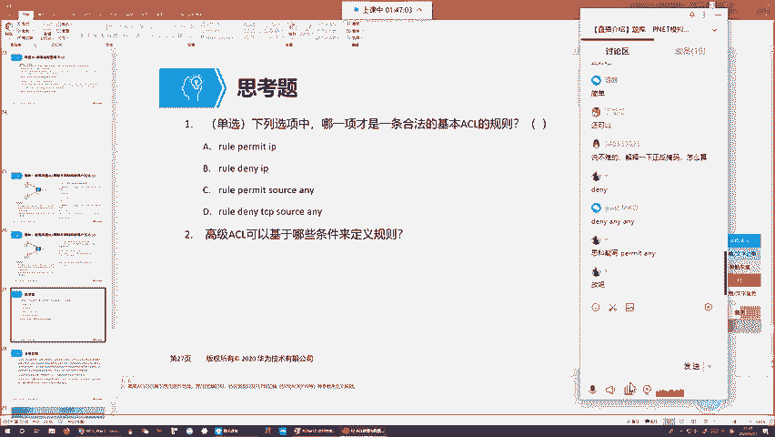

### 3. 在接口上调用ACL
```bash
[Router] interface GigabitEthernet 0/0/0
[Router-GigabitEthernet0/0/0] traffic-filter inbound acl 2000  # 入方向调用
[Router-GigabitEthernet0/0/0] traffic-filter outbound acl 3000 # 出方向调用
```

### 关于通配符掩码
通配符掩码（Wildcard Mask）用于匹配一个IP地址范围。它由0和1组成：
*   **0** 表示必须精确匹配。
*   **1** 表示“任意”（该位可以是0或1）。

例如：`source 192.168.1.0 0.0.0.255` 匹配的是 `192.168.1.0` 到 `192.168.1.255` 这个范围。
*   通配符掩码 `0.0.0.255` 的二进制是 `00000000.00000000.00000000.11111111`。
*   前24位（三个0.0.0）为0，要求IP地址的前三组必须严格是192.168.1。
*   最后8位为1，意味着IP地址最后一组可以是0-255中的任意值。

**特殊写法**：
*   `0`：是 `0.0.0.0` 的简写，表示精确匹配一个IP地址。例如 `source 10.1.1.1 0`。
*   `any`：是 `0.0.0.0 255.255.255.255` 的简写，表示匹配任何源或目的IP地址。

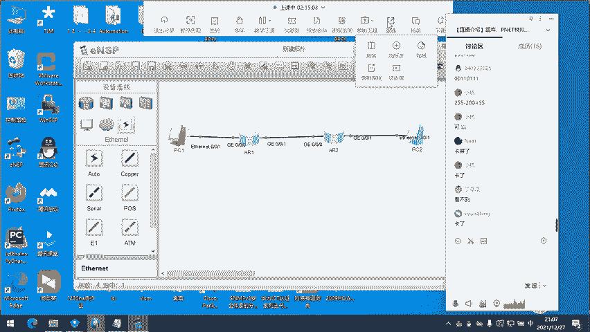

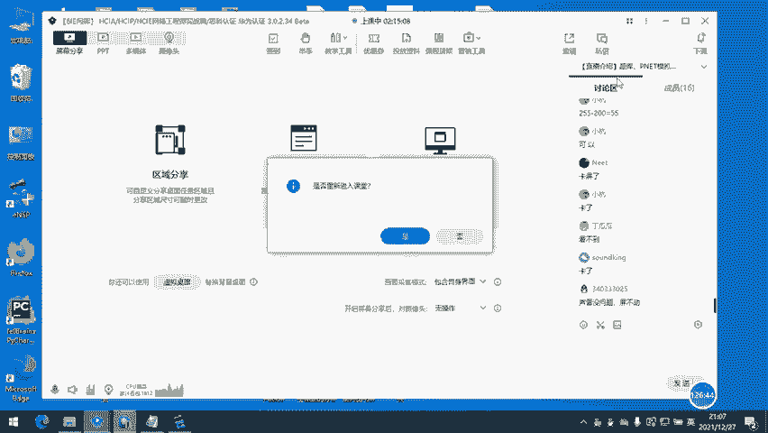

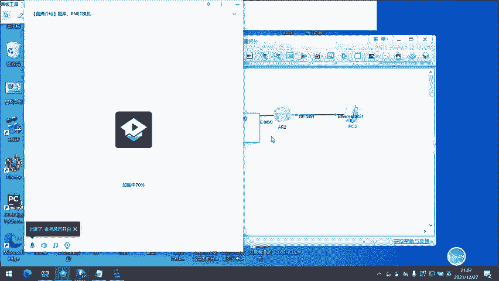

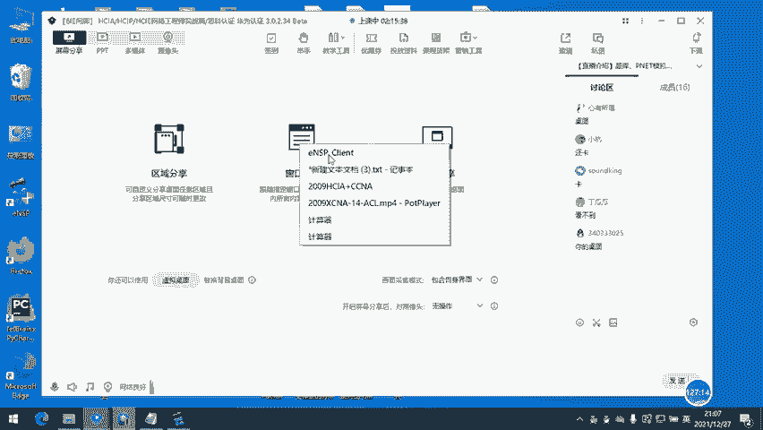

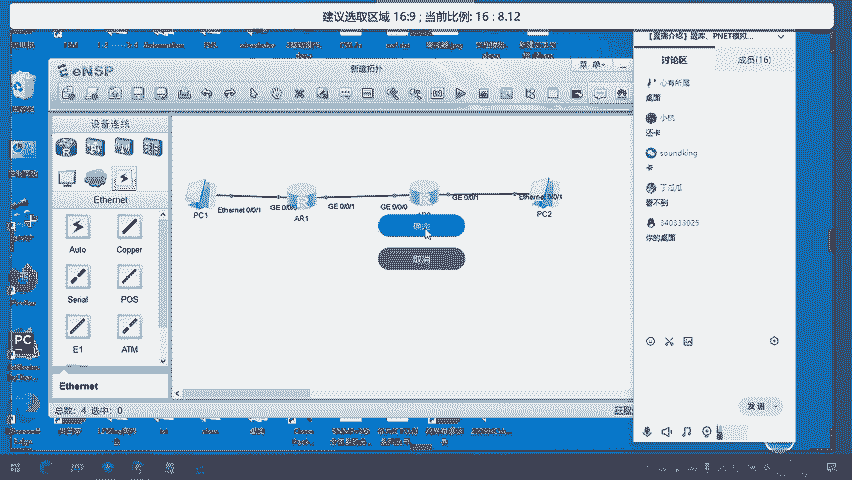

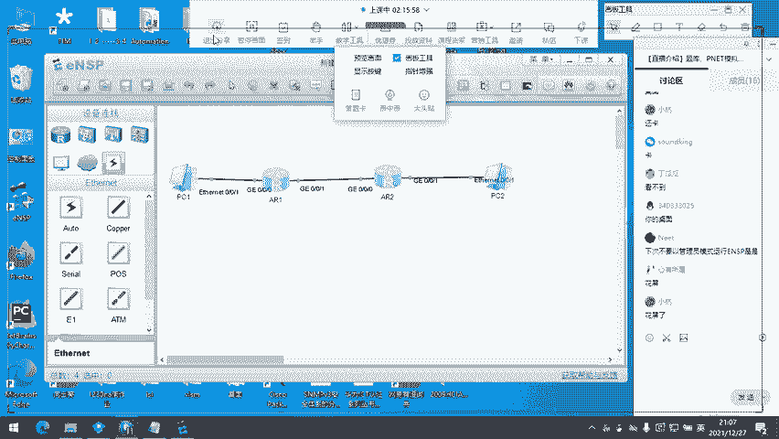

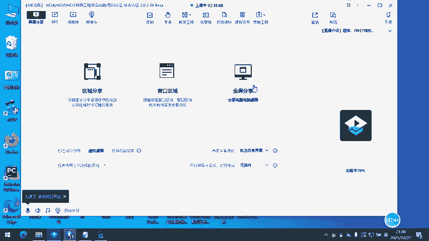

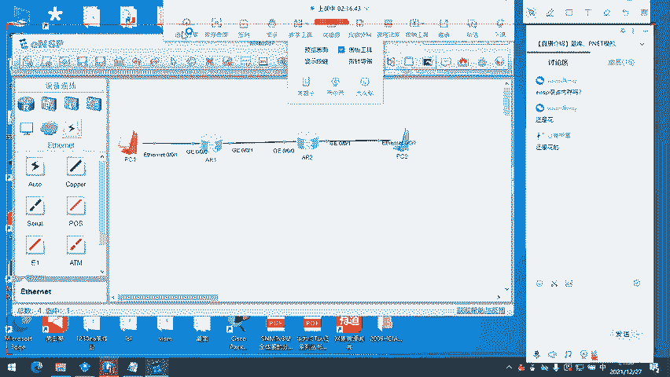

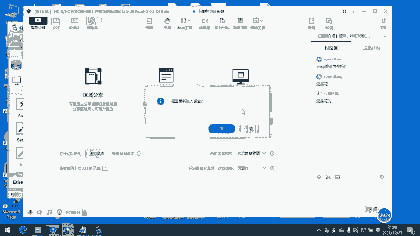

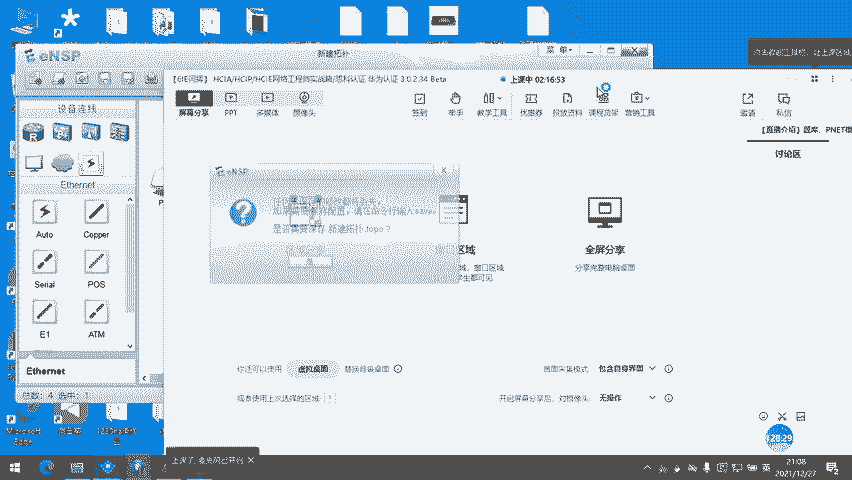

---

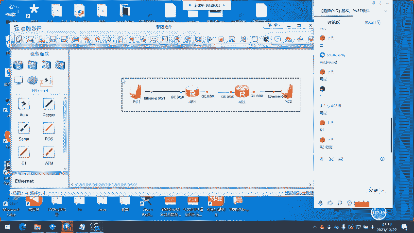

## ACL的广泛应用
ACL作为一个基础工具，其用途远不止于接口流量过滤：
1.  **网络地址转换**：在NAT中，用于匹配哪些内网流量需要进行地址转换。
2.  **VPN**：在IPSec VPN中，用于定义哪些流量需要受到VPN保护。
3.  **路由策略**：在路由控制中，用于匹配特定的路由条目，以便修改其属性（如度量值、管理距离）。
4.  **服务质量**：在QoS中，用于分类和标记感兴趣的流量。
5.  **防火墙策略**：在防火墙中，作为更高级安全策略的基础。

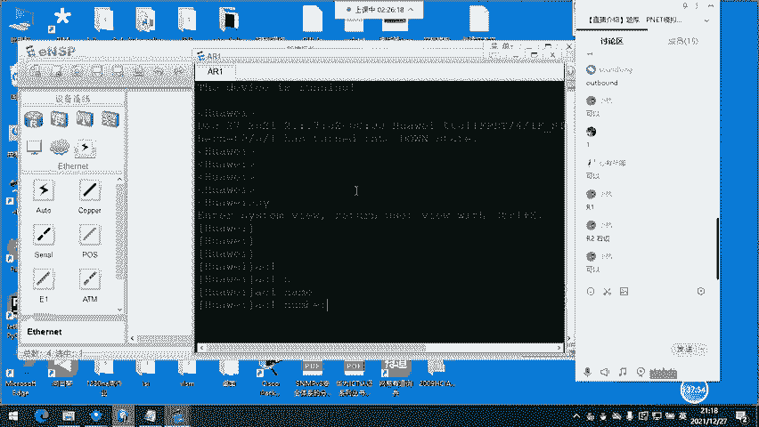

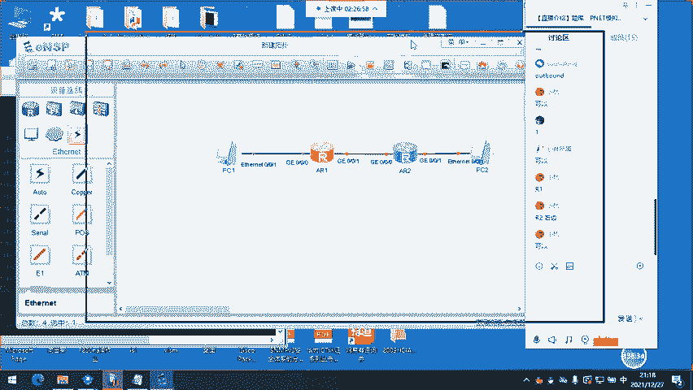

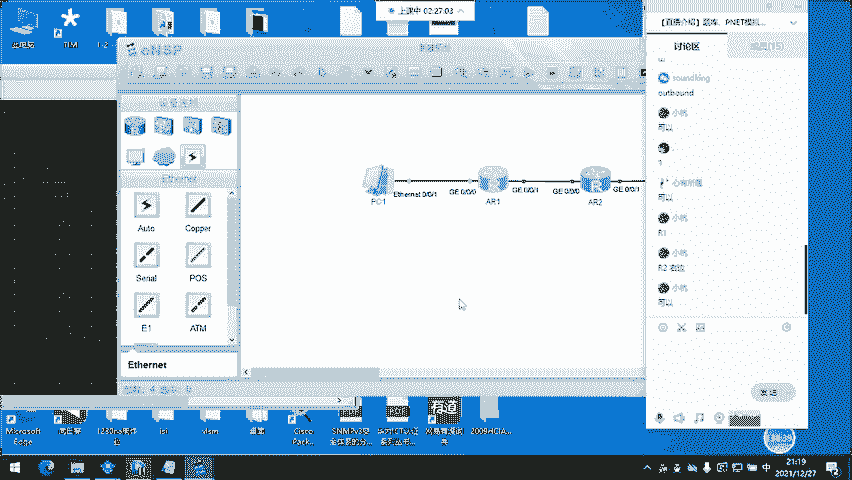

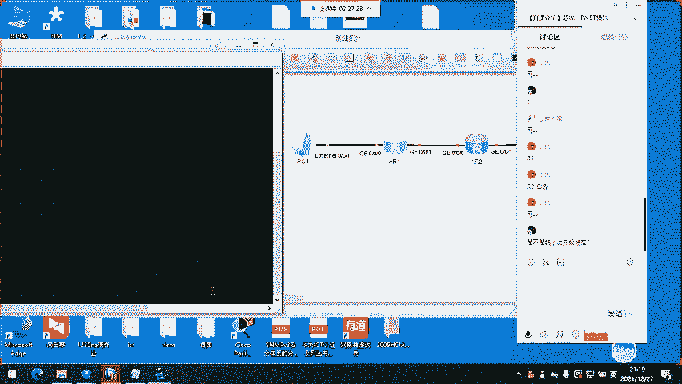

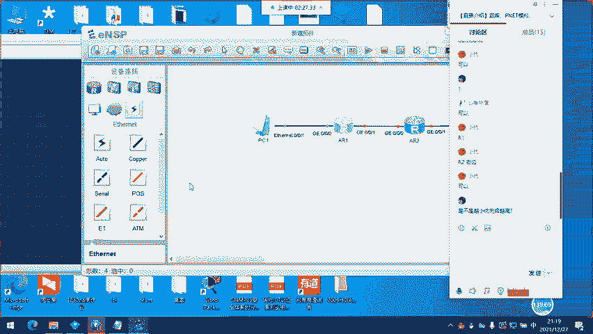

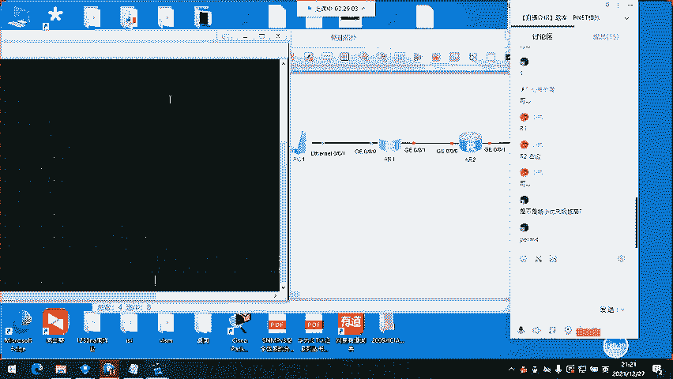

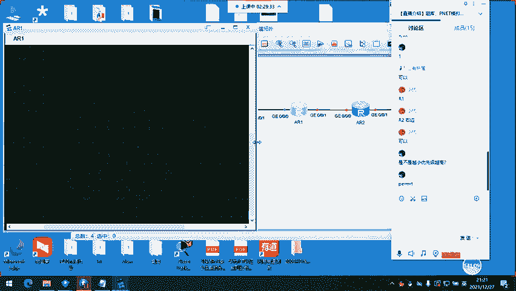

---

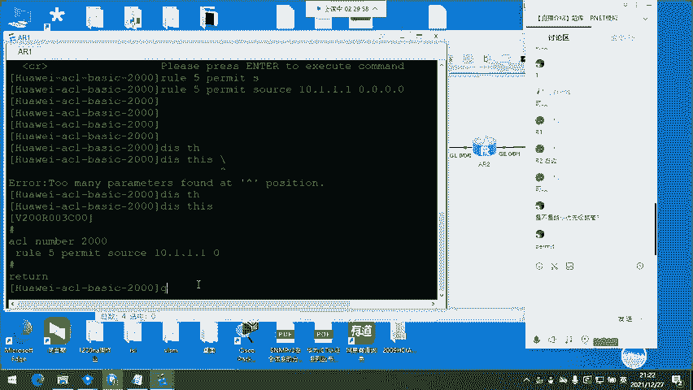

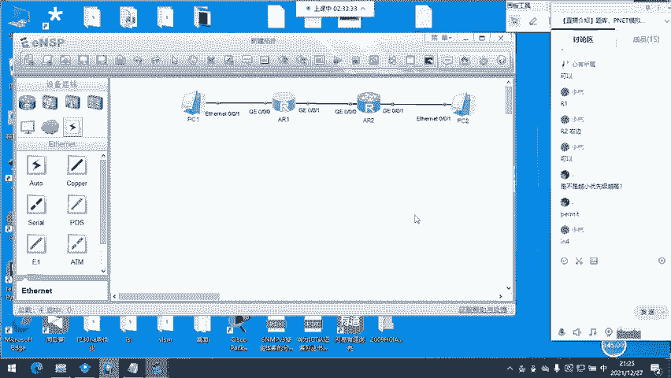

## 总结
本节课我们一起学习了访问控制列表（ACL）的核心知识。我们了解了ACL如何作为一款关键工具，将路由器赋予基础的防火墙能力，实现流量过滤。我们重点区分了**基本ACL**和**高级ACL**的特点、匹配方式及部署原则，并掌握了ACL“自顶向下，首次匹配”的工作机制以及华为与思科在默认行为上的差异。最后，我们学习了ACL的基础配置命令。请记住，ACL是许多高级网络功能（如NAT、VPN、QoS）的基石，理解其原理至关重要。