# 华为认证HCIA-DATACOM教程：P14：NAT - 网络地址转换

## 概述
在本节课中，我们将要学习网络地址转换技术。这项技术是解决IPv4地址空间不足、实现内网私有地址主机访问公网服务器的关键。我们将从NAT的必要性讲起，逐步深入到其工作原理、不同类型以及具体配置方法。

## 为什么需要NAT？
在IPv4时代，32位的地址空间总共只有约43亿个地址。这些地址需要分配给全球互联网上的所有节点。为了保证通信，每个节点都需要一个全球唯一的IP地址。然而，节点数量远超地址数量，地址显然不够用。

为了解决这个问题，我们改变了地址的使用规则，将IP地址分为两大类：
*   **公有地址**：用于公网环境，如运营商网络、数据中心。这些地址需要购买或租赁，并保证全球唯一性。
*   **私有地址**：用于企业、学校、政府等内部网络。这些地址无需购买，可以在不同网络内部重复使用。

私有地址段包括：
*   `10.0.0.0/8`
*   `172.16.0.0/12`
*   `192.168.0.0/16`

虽然私有地址解决了地址不足的问题，但带来了新的挑战：**使用私有地址的内网主机无法直接与公网主机通信**。因为公网路由器的路由表中不允许存在私有路由，当它们收到目的IP为私有地址的回包时，会直接丢弃。

NAT技术正是在企业网络的边界设备（路由器或防火墙）上，为解决这一问题而诞生的。

## NAT的工作原理
NAT的核心思想是在数据包经过边界设备时，修改其IP头部中的地址信息。

以下是NAT的基本工作流程：
1.  **出方向转换（内网到外网）**：当内网主机（如 `192.168.1.10`）访问公网服务器（如 `200.1.2.3`）时，数据包到达边界路由器。路由器识别其源IP为私有地址，便从预先配置的公有地址池中选取一个地址（如 `122.1.2.1`），将数据包的**源IP地址**进行替换。
    *   转换前：源IP=`192.168.1.10`， 目的IP=`200.1.2.3`
    *   转换后：源IP=`122.1.2.1`， 目的IP=`200.1.2.3`
2.  **建立映射记录**：路由器会生成一条NAT转换表项，记录“内部本地地址（Inside Local）”到“内部全局地址（Inside Global）”的映射关系（例如：`192.168.1.10 <-> 122.1.2.1`）。
3.  **公网路由**：转换后的数据包以公有地址 `122.1.2.1` 的身份在公网中路由，最终到达服务器。服务器回应时，目的IP就是 `122.1.2.1`。
4.  **入方向转换（外网到内网）**：回包到达边界路由器。路由器查询NAT转换表，发现目的IP `122.1.2.1` 对应内网地址 `192.168.1.10`。于是将数据包的**目的IP地址**替换回私有地址。
    *   转换前：源IP=`200.1.2.3`， 目的IP=`122.1.2.1`
    *   转换后：源IP=`200.1.2.3`， 目的IP=`192.168.1.10`
5.  **内网路由**：替换后的数据包根据内网路由表，被转发给原始的内网主机。

通过这个过程，内网主机“伪装”成公网地址与外界通信，成功收到了回包，实现了上网功能。

## NAT的类型
NAT技术主要分为两大类：基本NAT和NAPT（端口地址转换）。华为设备对NAPT有更细致的分类。

### 静态NAT
静态NAT建立的是私有地址和公有地址之间固定的一对一映射。

**特点**：
*   **手动配置**：管理员通过命令明确指定哪个内网地址映射到哪个公网地址。
*   **双向通信**：映射关系永久存在于NAT表中，因此既能实现内网访问外网，也能实现**外网主动访问内网**的特定服务器。这常被称为“服务器发布”。
*   **缺点**：不灵活，浪费公网地址（一个公网地址只能给一台内网主机用），配置量大。

**配置示例**：
将内网服务器 `192.168.1.1` 发布为公网地址 `12.1.2.100`。
```bash
interface GigabitEthernet 0/0/1 # 进入连接公网的接口
 nat static global 12.1.2.100 inside 192.168.1.1 # 配置静态NAT映射
```

### 动态NAT
动态NAT使用一个公有地址池，为内网主机的出站流量动态分配公有地址。

**特点**：
*   **动态分配**：内网主机需要访问外网时，从地址池中临时分配一个空闲的公网地址。
*   **单向发起**：NAT表项是临时生成的（有超时时间，如5分钟）。主要用于解决内网主机上网问题，**一般不支持外网主动访问内网主机**。
*   **缺点**：同样存在地址浪费问题，一个公网地址在同一时刻只能给一台内网主机使用。如果地址池中的地址耗尽，后续的主机需要等待。

**配置示例**：
1.  创建ACL，定义哪些内网地址需要做NAT。
    ```bash
    acl 2000
     rule 5 permit source 192.168.1.0 0.0.0.255
    ```
2.  创建NAT地址池。
    ```bash
    nat address-group 1 12.1.2.10 12.1.2.20
    ```
3.  在外网接口上应用动态NAT策略。
    ```bash
    interface GigabitEthernet 0/0/1
     nat outbound 2000 address-group 1 no-pat
    ```
    *注意：`no-pat` 参数表示不使用端口转换，即纯动态NAT。*

### NAPT（网络地址端口转换）
NAPT是NAT的增强版，它不仅能转换IP地址，还能转换传输层的端口号。

**核心优势：地址复用**。一个公有地址可以通过不同的端口号，同时为多个内网主机进行转换，极大地节约了公网地址。

**工作原理**：
当两台内网主机（`192.168.1.10:1234` 和 `192.168.1.11:5678`）同时访问同一个公网服务器时，边界路由器进行NAPT转换：
*   主机A：`192.168.1.10:1234` -> `12.1.2.1:1025`
*   主机B：`192.168.1.11:5678` -> `12.1.2.1:1026`

路由器通过记录 **“五元组”（协议、源IP、源端口、目的IP、目的端口）** 的转换关系，可以准确地将返回的数据包（目的IP为 `12.1.2.1`，目的端口分别为 `1025` 和 `1026`）正确还原并转发给对应的内网主机。

在华为设备中，NAPT主要通过以下两种方式实现：

#### 1. 动态NAPT（使用地址池）
配置与动态NAT类似，但**不加 `no-pat` 参数**。
```bash
interface GigabitEthernet 0/0/1
 nat outbound 2000 address-group 1
# 不加 ‘no-pat‘，即启用NAPT（端口转换）
```

#### 2. Easy IP
Easy IP是NAPT的一种特殊形式，它直接使用**路由器外网接口的IP地址**作为NAPT转换的公有地址，无需单独配置地址池。

**特点**：配置最简单，最节约地址（整个企业只需一个公网地址）。
```bash
interface GigabitEthernet 0/0/1
 nat outbound 2000
# 直接调用ACL，使用接口IP进行NAPT转换
```
*注意：Easy IP功能通常在中小型企业级设备上支持。*

### NAT Server（端口映射）
NAT Server属于静态的NAPT，用于将内网服务器发布到公网。


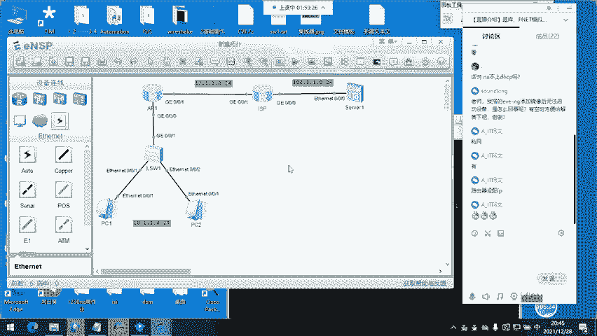

**特点**：
*   **静态端口映射**：将一个公网地址的特定端口，固定映射到内网服务器的IP和端口。
*   **服务器发布**：实现外网用户通过公网地址和端口访问内网服务（如Web、FTP）。
*   **节约地址**：多个不同的服务（如Web的80端口、FTP的21端口）可以映射到同一个公网地址的不同端口上。

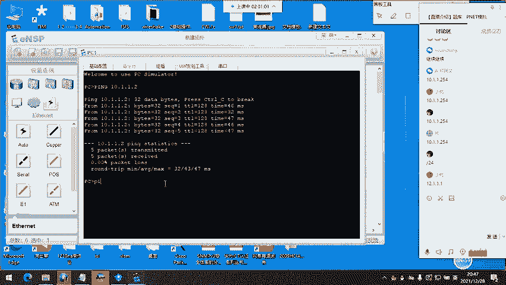

**配置示例**：
将内网IP为 `192.168.1.100`，端口为 `8080` 的Web服务器，发布为公网地址 `12.1.2.1` 的 `80` 端口。
```bash
interface GigabitEthernet 0/0/1
 nat server protocol tcp global 12.1.2.1 www inside 192.168.1.100 8080
# ‘www‘ 代表端口80
```

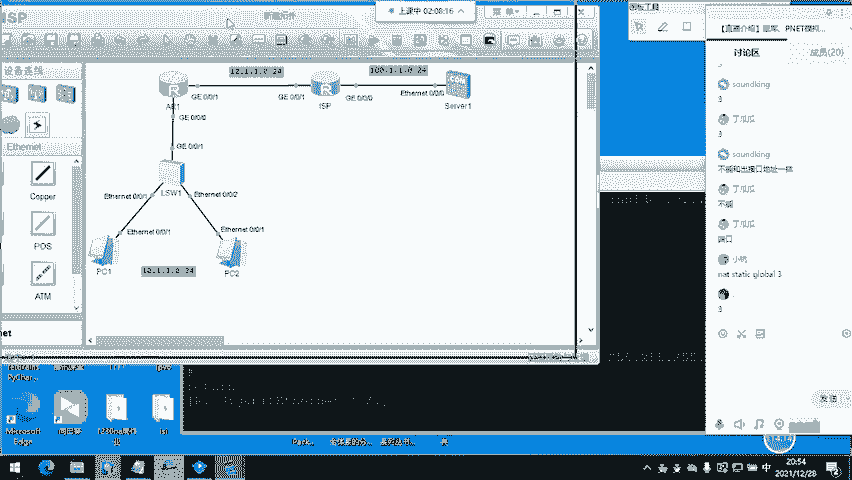

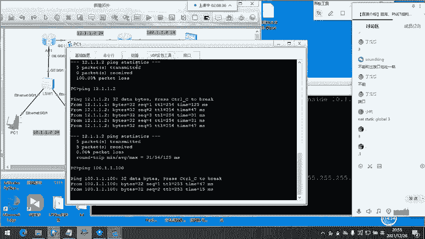

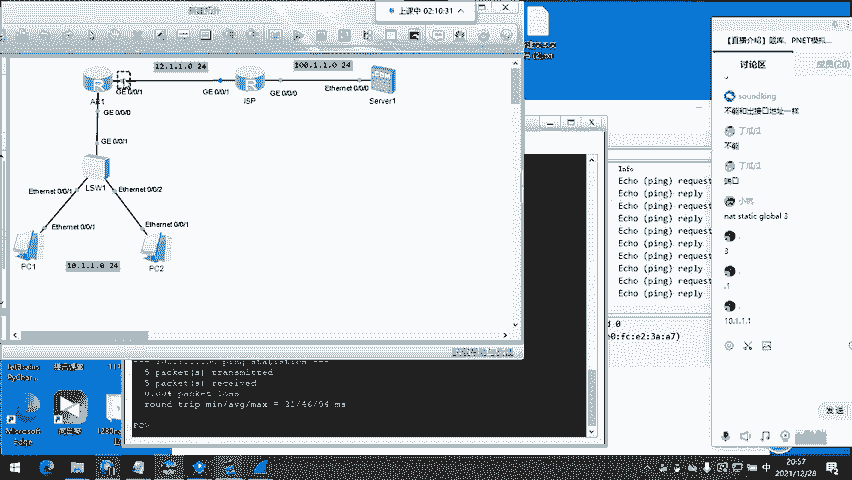


## 实验演示要点
在实验环境中，我们模拟了企业内网（`10.1.1.0/24`）、边界路由器、运营商网络（`12.1.1.0/24`）和公网服务器（`100.1.1.100`）。关键配置步骤如下：

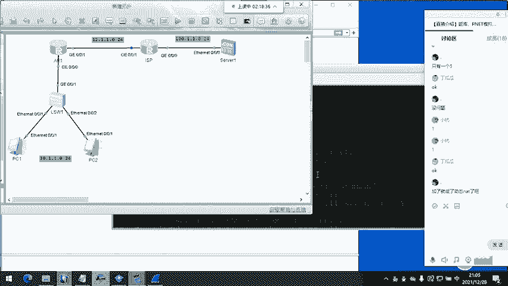


1.  **基础网络配置**：为所有设备配置IP地址和网关，在边界路由器上配置指向运营商的默认路由。
    ```bash
    ip route-static 0.0.0.0 0.0.0.0 12.1.1.2
    ```
2.  **配置Easy IP实现内网上网**：
    *   创建ACL匹配内网网段。
    *   在外网接口直接应用 `nat outbound` 命令。
3.  **配置NAT Server发布内网服务器**：
    *   使用 `nat server` 命令将内网服务器的私有IP和端口映射到公网IP和端口。
4.  **验证与抓包**：通过Ping测试连通性，并在边界路由器的内外网接口抓包，可以清晰地看到数据包在进出时IP头部地址的变化过程。

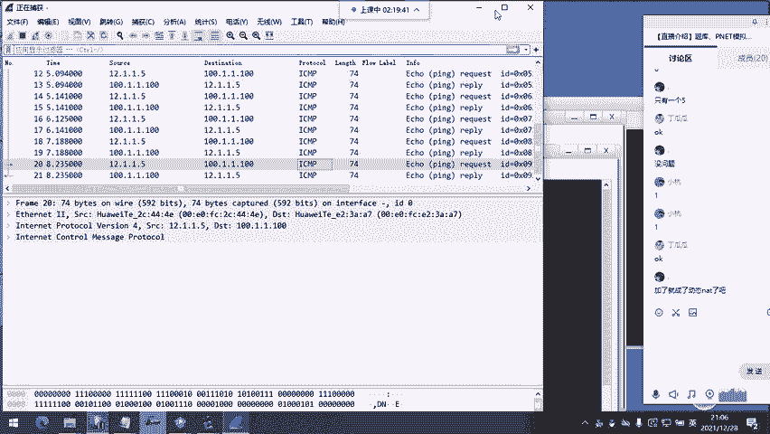

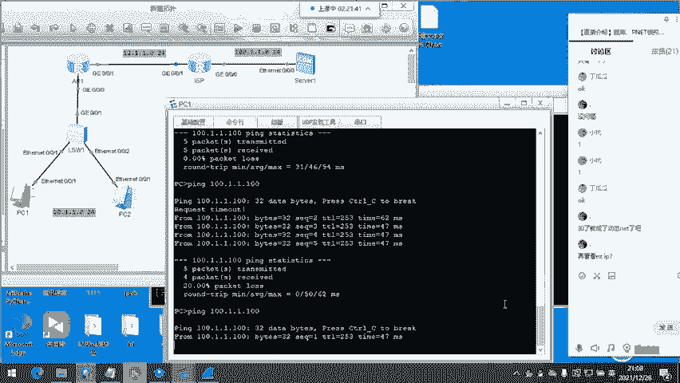

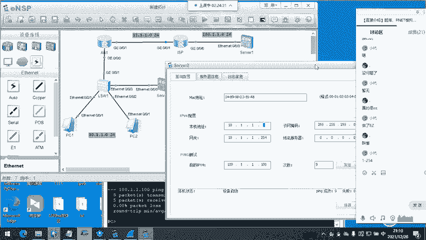

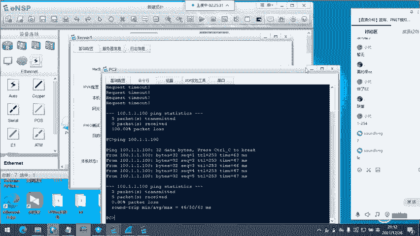

## 总结
本节课我们一起学习了网络地址转换技术。我们从IPv4地址短缺的背景出发，理解了NAT技术存在的必要性。我们深入探讨了NAT的工作原理，即通过在网络边界修改数据包的IP地址，实现私网与公网之间的通信。

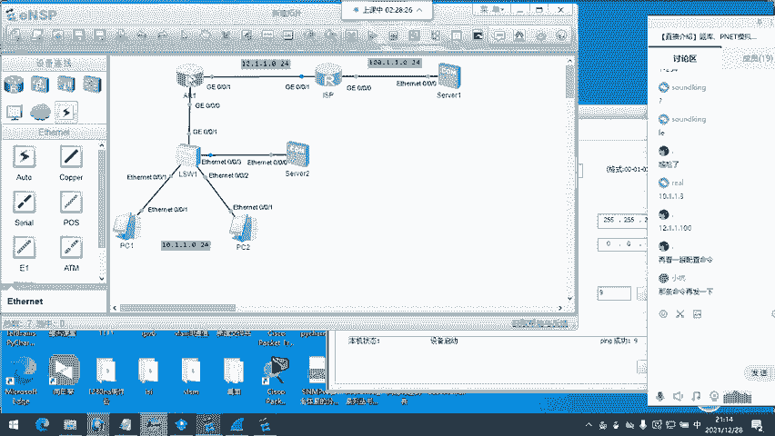

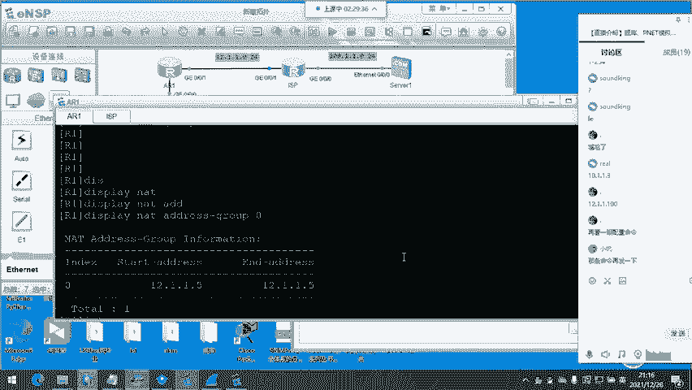


我们系统地学习了NAT的几种主要类型：
*   **静态NAT**：用于固定的服务器发布，实现双向访问。
*   **动态NAT**：为内网主机动态分配公网地址，但地址利用率低。
*   **NAPT/Easy IP**：通过同时转换IP地址和端口号，实现一个公网地址供大量内网主机共用，是实际应用中最主流、最节约的方案。
*   **NAT Server**：用于将内网服务器的特定端口映射到公网，提供对外服务。

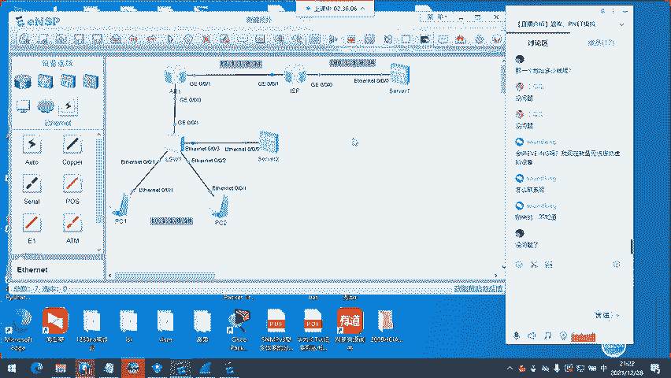


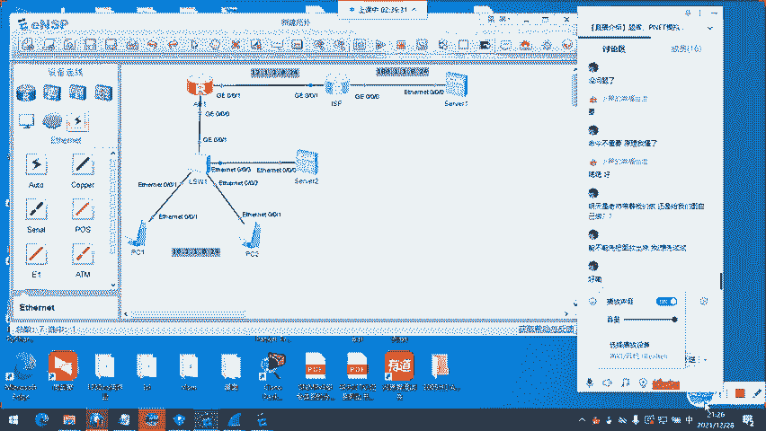

尽管NAT技术打破了IP协议端到端通信的原则，并带来了一些复杂性（如影响某些对等连接应用），但在IPv4向IPv6过渡的漫长时期内，它仍然是保障网络连通性不可或缺的关键技术。理解并掌握NAT，是成为一名合格网络工程师的重要基础。