# HCIA-DATACOM教程：P15：XCNA15-NA综合实验

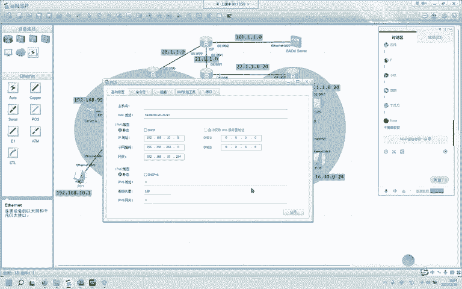

## 概述
在本节课中，我们将通过一个综合实验，应用之前NA阶段学到的所有核心知识点。这个实验模拟了一个包含总部和分部的网络环境，我们将完成从基础VLAN划分、SVI配置、动态路由协议（OSPF）部署，到NAT地址转换、VRRP网关冗余，以及GRE VPN隧道建立等一系列配置任务。通过动手实践，你将巩固对网络基础架构的理解。

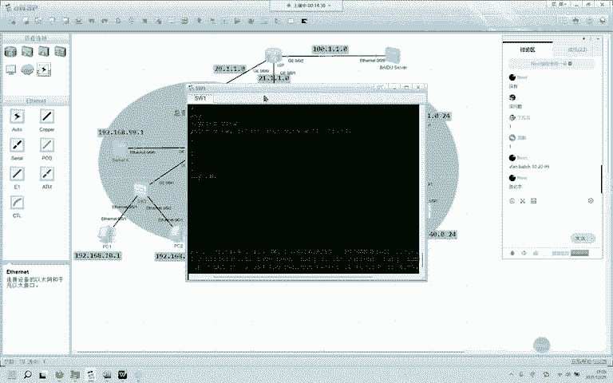

---

## 实验需求分析
实验网络分为总部和分部两个部分。以下是具体的配置要求：

1.  **总部内网VLAN划分**：PC1和PC3属于VLAN 10，使用192.168.10.0/24网段；PC2和PC4属于VLAN 20，使用192.168.20.0/24网段；服务器A属于VLAN 99，使用192.168.99.0/24网段。具体IP地址和网关自行规划。
2.  **总部内网三层互通**：在核心交换机SW1上配置SVI（交换虚拟接口），实现总部内不同VLAN间的通信。
3.  **动态路由协议**：在总部和分部的边界路由器及核心设备上运行动态路由协议OSPF，确保内网主机能够成功到达各自的边界设备。
4.  **总部网络地址转换与服务器发布**：
    *   配置NAT，使总部内网主机可以访问互联网（外网）。
    *   配置NAT Server，将内部服务器A发布到公网，使外网能够访问该服务器。
5.  **分部网关冗余（VRRP）**：在分部网络中配置VRRP（虚拟路由器冗余协议），实现网关的冗余备份。具体要求是：PC5以SW7作为主网关，SW8作为备份网关；PC6以SW8作为主网关，SW7作为备份网关。
6.  **分部网络地址转换**：配置NAT，使分部内网主机可以访问互联网。
7.  **总部与分部间VPN互通**：在总部（R1）和分部（R2）的边界路由器之间建立GRE VPN隧道，并通过OSPF交换路由，实现总部与分部内网之间的安全通信。

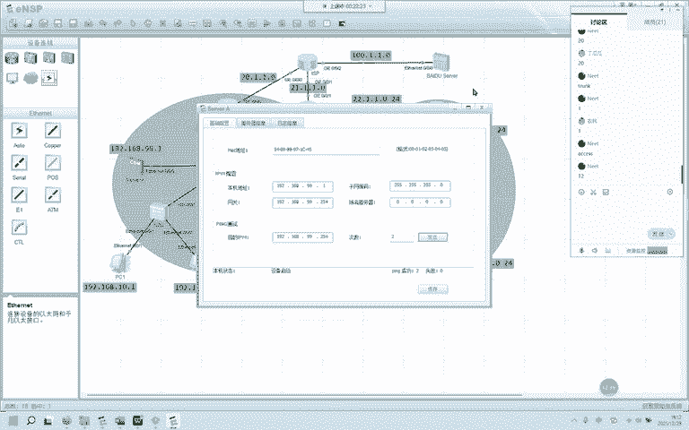

---

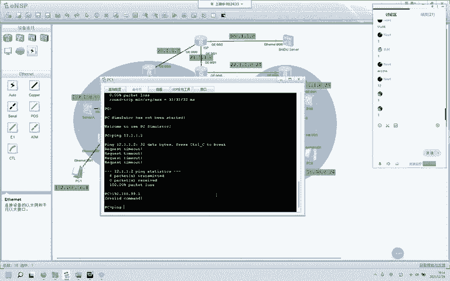

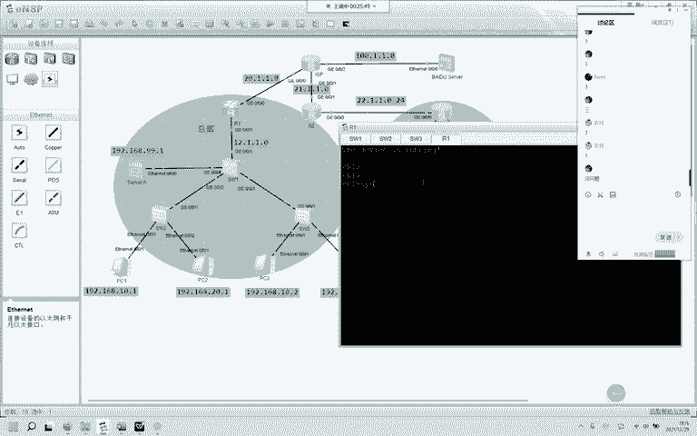

## 实验配置步骤


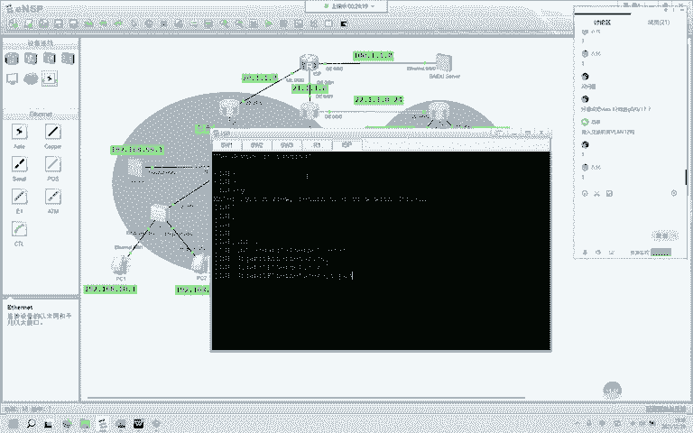

### 第一步：总部基础网络配置
上一节我们分析了实验需求，本节中我们首先来完成总部网络的基础配置，包括设备命名、VLAN划分和接口配置。

**1. 设备命名**
为了方便管理，首先修改所有网络设备的名称。
```bash
# 在每台设备上执行，例如将核心交换机命名为SW1
[Huawei] sysname SW1
```

**2. VLAN创建与接口划分**
在总部三台交换机上创建所需的VLAN（10， 20， 99， 12），并将相应接口划入VLAN。连接交换机的链路需配置为Trunk类型。
```bash
# 在SW1， SW2， SW3上创建VLAN
[SW1] vlan batch 10 20 99 12

# 配置交换机之间的Trunk链路（以SW1的G0/0/2口为例）
[SW1] interface GigabitEthernet 0/0/2
[SW1-GigabitEthernet0/0/2] port link-type trunk
[SW1-GigabitEthernet0/0/2] port trunk allow-pass vlan all

# 配置连接PC和服务器的Access链路（以SW2连接PC1的接口为例）
[SW2] interface Ethernet 0/0/1
[SW2-Ethernet0/0/1] port link-type access
[SW2-Ethernet0/0/1] port default vlan 10
```

**3. 配置SVI实现三层互通**
在核心交换机SW1上为VLAN 10， 20， 99创建SVI接口，并配置IP地址作为各网段的网关。
```bash
# 创建VLANIF 10接口并配置IP
[SW1] interface Vlanif 10
[SW1-Vlanif10] ip address 192.168.10.254 24

# 创建VLANIF 20接口并配置IP
[SW1] interface Vlanif 20
[SW1-Vlanif20] ip address 192.168.20.254 24

# 创建VLANIF 99接口并配置IP（服务器网关）
[SW1] interface Vlanif 99
[SW1-Vlanif99] ip address 192.168.99.254 24
```
配置完成后，总部内不同VLAN的主机之间以及主机与服务器之间应能正常通信。

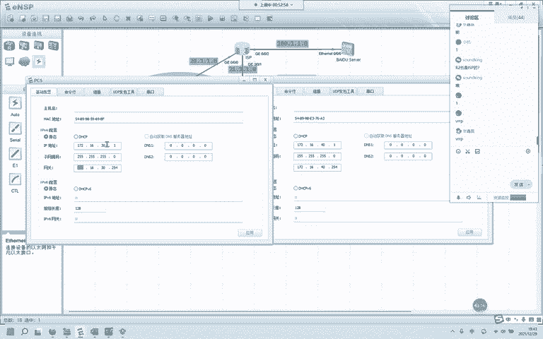

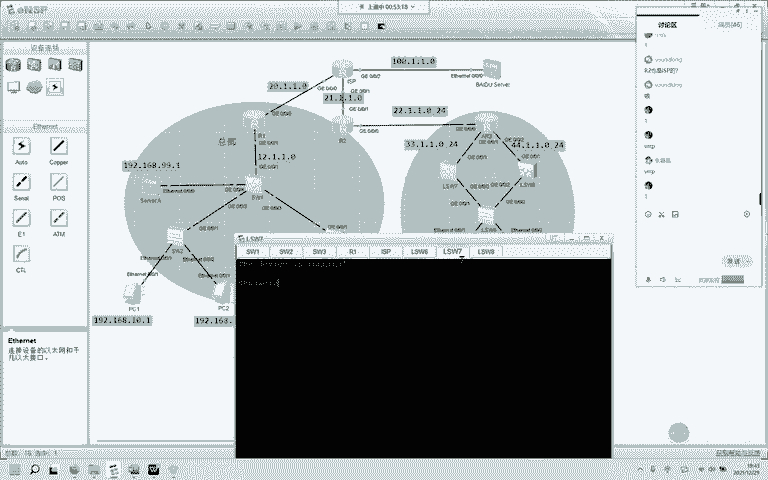

---

### 第二步：配置动态路由协议（OSPF）
上一节我们实现了总部内网的互通，本节中我们通过配置OSPF动态路由协议，让内网路由能够传递到边界设备。


**1. 总部OSPF配置**
在总部边界路由器R1和核心交换机SW1上配置OSPF，宣告内网网段和互联网段。
```bash
# 在R1上配置OSPF
[R1] ospf 10 router-id 1.1.1.1
[R1-ospf-10] area 0
[R1-ospf-10-area-0.0.0.0] network 12.1.1.0 0.0.0.255 # 宣告与SW1的互联网段

# 在SW1上配置OSPF
[SW1] ospf 10 router-id 11.11.11.11
[SW1-ospf-10] area 0
[SW1-ospf-10-area-0.0.0.0] network 192.168.10.0 0.0.0.255
[SW1-ospf-10-area-0.0.0.0] network 192.168.20.0 0.0.0.255
[SW1-ospf-10-area-0.0.0.0] network 192.168.99.0 0.0.0.255
[SW1-ospf-10-area-0.0.0.0] network 12.1.1.0 0.0.0.255
```
配置后，R1应能通过OSPF学习到总部内网的路由。

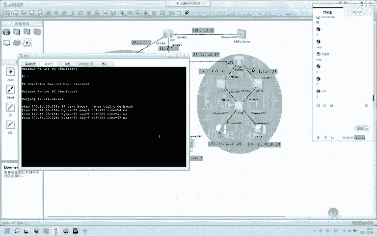

**2. 配置默认路由与下发**
在R1上配置指向运营商（ISP）的默认路由，并通过OSPF将其下发到内网。
```bash
# 在R1上配置静态默认路由
[R1] ip route-static 0.0.0.0 0 20.1.1.2

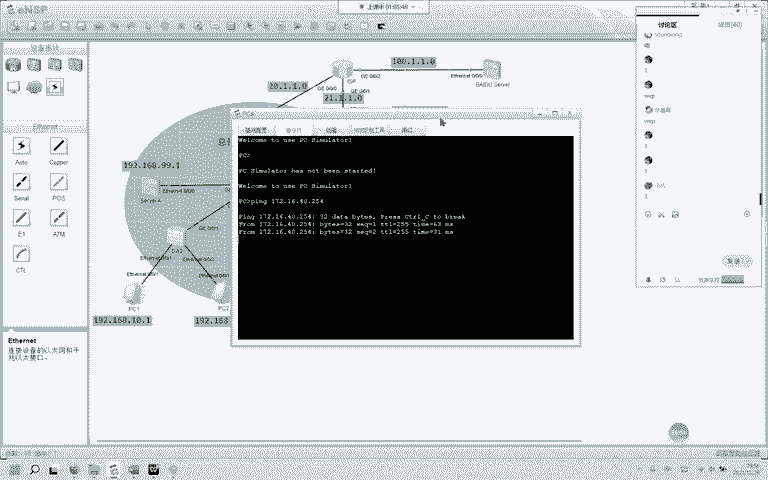

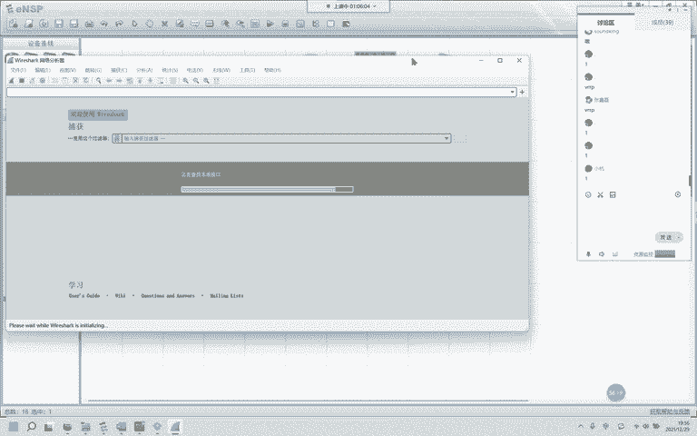


# 在R1的OSPF进程中下发默认路由
[R1-ospf-10] default-route-advertise always
```

---


### 第三步：配置NAT实现上网与服务器发布
上一节我们通过OSPF打通了内网到边界的路由，本节中我们配置NAT，使内网可以访问互联网，并将内部服务器发布到公网。

**1. 配置ACL匹配内网流量**
创建一个基本ACL，匹配需要做NAT转换的内网私网地址。
```bash
[R1] acl 2000
[R1-acl-basic-2000] rule permit source 192.168.0.0 0.0.255.255
```

**2. 配置Easy IP实现内网上网**
在R1连接运营商的出接口上应用Easy IP，将ACL匹配的流量源IP转换为该接口的公网IP。
```bash
[R1] interface GigabitEthernet 0/0/0
[R1-GigabitEthernet0/0/0] nat outbound 2000
```

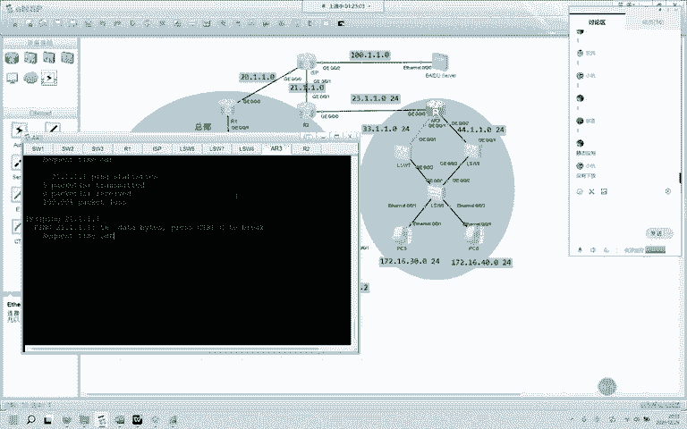

**3. 配置NAT Server发布内部服务器**
在R1的出接口上配置NAT Server，将内部服务器192.168.99.1映射为公网IP 20.1.1.3。
```bash
[R1-GigabitEthernet0/0/0] nat server protocol tcp global 20.1.1.3 www inside 192.168.99.1 www
[R1-GigabitEthernet0/0/0] nat server protocol icmp global 20.1.1.3 inside 192.168.99.1
```
配置完成后，总部内网主机可以访问互联网，外网主机也可以通过公网IP 20.1.1.3访问内部的服务器A。

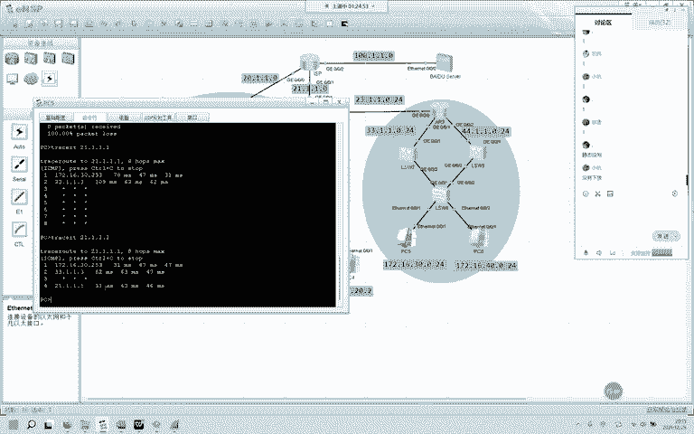

---


### 第四步：分部网关冗余配置（VRRP）
现在我们将视线转向分部网络。分部网络的核心需求是实现网关的冗余备份，我们使用VRRP协议来完成。

**1. 分部基础VLAN与接口配置**
首先，在分部交换机SW7和SW8上创建VLAN 30和40，并划分接入接口。交换机之间的链路配置为Trunk。
```bash
# 在SW7和SW8上创建VLAN
[SW7] vlan batch 30 40

# 配置交换机间Trunk链路
[SW7] interface GigabitEthernet 0/0/2
[SW7-GigabitEthernet0/0/2] port link-type trunk
[SW7-GigabitEthernet0/0/2] port trunk allow-pass vlan all
```

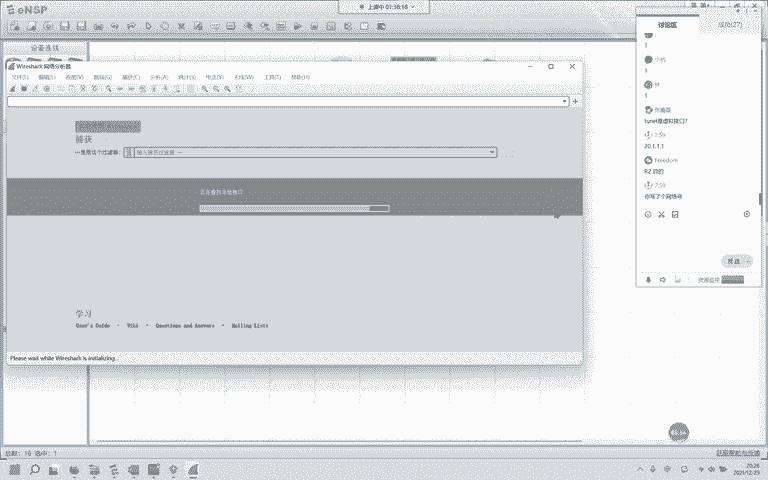

**2. 配置VRRP虚拟网关**
在SW7和SW8上为VLAN 30和40的SVI接口配置VRRP。通过调整优先级，指定主备设备。
```bash
# 在SW7上配置VLAN 30的VRRP，并设置较高优先级使其成为Master
[SW7] interface Vlanif 30
[SW7-Vlanif30] ip address 172.16.30.253 24
[SW7-Vlanif30] vrrp vrid 30 virtual-ip 172.16.30.254
[SW7-Vlanif30] vrrp vrid 30 priority 120

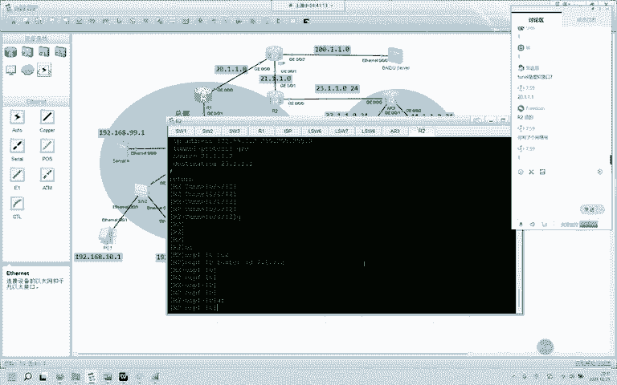

# 在SW8上配置VLAN 30的VRRP，使用默认优先级（100）作为Backup
[SW8] interface Vlanif 30
[SW8-Vlanif30] ip address 172.16.30.252 24
[SW8-Vlanif30] vrrp vrid 30 virtual-ip 172.16.30.254
```
VLAN 40的配置逻辑类似，但主备角色相反（SW8为Master， SW7为Backup）。当主设备故障时，备份设备会自动接管网关职责，保障网络不中断。

---


### 第五步：分部动态路由与NAT配置
上一节我们为分部网络配置了高可用的网关，本节中我们配置分部的OSPF和NAT，使其能够访问互联网。

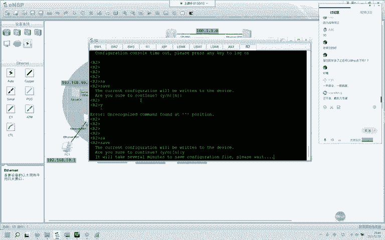

**1. 分部OSPF配置**
在分部边界路由器R2、交换机SW7和SW8上配置OSPF，宣告分部内网路由。
```bash
# 在R2上配置OSPF，宣告与分部的互联网段
[R2] ospf 10 router-id 2.2.2.2
[R2-ospf-10] area 0
[R2-ospf-10-area-0.0.0.0] network 23.1.1.1 0.0.0.0

# 在SW7和SW8上配置OSPF，宣告内网VLAN网段
[SW7] ospf 10 router-id 7.7.7.7
[SW7-ospf-10] area 0
[SW7-ospf-10-area-0.0.0.0] network 172.16.30.0 0.0.0.255
[SW7-ospf-10-area-0.0.0.0] network 172.16.40.0 0.0.0.255
```

**2. 分部NAT配置**
在R2上配置ACL匹配分部内网地址，并在出接口上应用Easy IP。
```bash
[R2] acl 2000
[R2-acl-basic-2000] rule permit source 172.16.0.0 0.0.255.255
[R2] interface GigabitEthernet 0/0/1
[R2-GigabitEthernet0/0/1] nat outbound 2000
```
配置完成后，分部内网主机应能访问互联网。

---

### 第六步：建立GRE VPN实现总部与分部互通
最后，也是最关键的一步，我们需要在总部（R1）和分部（R2）之间建立一条穿越公网的隧道，让双方的内网能够安全通信。这里我们使用GRE隧道。

**1. 配置Tunnel接口**
在R1和R2上创建Tunnel接口，并指定隧道的源目IP地址（即双方连接公网的接口IP）以及隧道自身的IP地址。
```bash
# 在R1上配置Tunnel接口
[R1] interface Tunnel 0/0/12
[R1-Tunnel0/0/12] tunnel-protocol gre
[R1-Tunnel0/0/12] source 20.1.1.1
[R1-Tunnel0/0/12] destination 21.1.1.2
[R1-Tunnel0/0/12] ip address 172.99.1.1 24

# 在R2上配置Tunnel接口
[R2] interface Tunnel 0/0/12
[R2-Tunnel0/0/12] tunnel-protocol gre
[R2-Tunnel0/0/12] source 21.1.1.2
[R2-Tunnel0/0/12] destination 20.1.1.1
[R2-Tunnel0/0/12] ip address 172.99.1.2 24
```

**2. 通过OSPF发布隧道路由**
将Tunnel接口的网段宣告到OSPF进程中，这样双方就能通过OSPF学习到对端内网的详细路由。
```bash
# 在R1的OSPF进程中宣告Tunnel接口网段
[R1-ospf-10] area 0
[R1-ospf-10-area-0.0.0.0] network 172.99.1.0 0.0.0.255

# 在R2的OSPF进程中宣告Tunnel接口网段
[R2-ospf-10] area 0
[R2-ospf-10-area-0.0.0.0] network 172.99.1.0 0.0.0.255
```
配置完成后，总部和分部的内网主机之间（例如PC1与PC5）应能相互ping通。数据包会被封装在GRE隧道中穿越公网。

---

## 总结
本节课中我们一起完成了一个综合性的网络实验，系统地应用了HCIA-DATACOM阶段的核心技术：
1.  **二层技术**：VLAN划分、Access/Trunk接口配置。
2.  **三层技术**：SVI接口配置、静态路由、OSPF动态路由协议。
3.  **网络地址转换**：通过ACL和Easy IP实现PAT，满足内网上网需求；通过NAT Server实现内部服务器对外发布。
4.  **网络可靠性**：使用VRRP协议实现网关设备的冗余备份，提升网络可用性。
5.  **广域网技术**：通过建立GRE VPN隧道，在公网上构建虚拟私有通道，实现总部与分部内网的安全互联。

这个实验涵盖了中小型企业网络的典型部署场景。通过亲手配置和排错，相信你对这些技术的原理和实际操作有了更深刻的理解。建议保存实验配置，并尝试独立完成，以巩固学习成果。