# 华为认证HCIA-DATACOM教程：01：网络行业概览与课程架构介绍

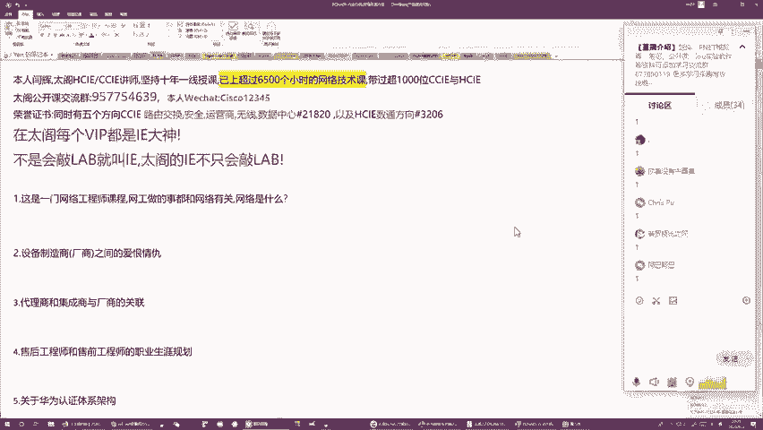

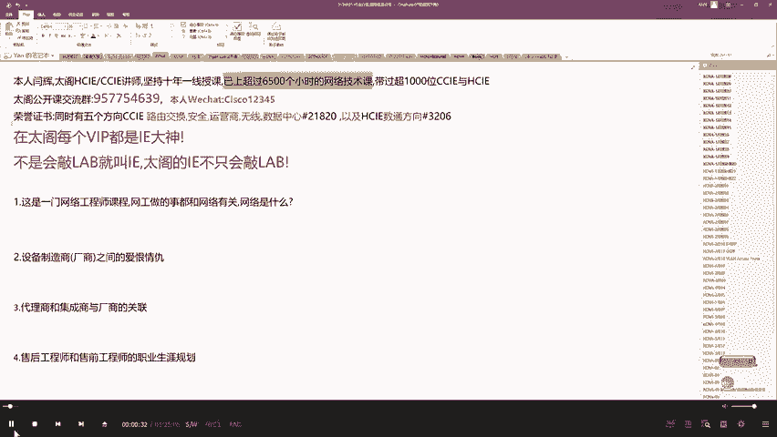

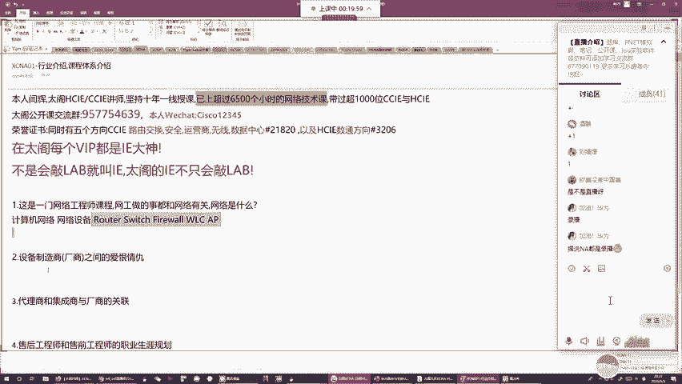

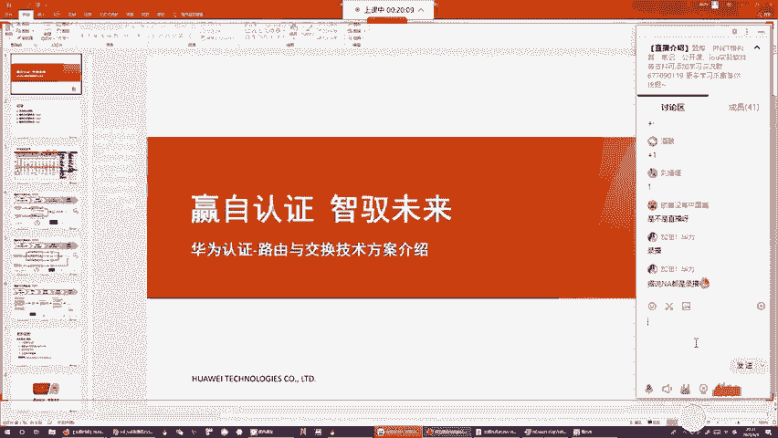

## 概述
在本节课中，我们将一起了解网络工程师的行业背景、华为公司的发展历程、网络设备厂商的竞争格局，以及华为认证体系的结构和职业发展路径。这些知识将帮助你理解整个行业的运作方式，并为后续的技术学习奠定基础。

## 什么是网络工程师？
网络工程师的核心工作是围绕“网络”展开的。具体来说，网络工程师负责设计、实施、配置、维护和排错计算机网络。

那么，什么是计算机网络呢？计算机网络是一个通信载体，它使用各种网络设备（如路由器、交换机、防火墙、无线控制器和AP）通过线缆连接而成，以实现设备间的通信。

## 华为的崛起之路
网络设备需要有人研发和生产。本节中，我们将聚焦于一家伟大的公司——华为。

华为最初的主营业务是通信技术，为中国的三大运营商（电信、联通、移动）提供2G、3G、4G乃至5G的通信设备。为了拓展产品线和增加利润，华为决定进入网络设备领域。

当时，网络领域的全球领导者是美国的思科公司。华为通过学习思科的产品和技术，快速进入了市场，并以价格优势和强大的销售能力，在中国运营商市场与思科展开了激烈竞争。

2003年，思科以侵权为由起诉华为。华为败诉后，决定自主研发，推出了中国第一款网络操作系统VRP 5.0，从此走上了自主创新的道路。

在巩固了运营商市场后，华为希望进军企业网市场。但企业网更依赖交换机技术，而华为当时主要擅长路由器。为此，华为选择了与擅长交换机的美国公司3Com合资，成立了H3C（华为3Com），以此学习交换机技术。

当华为掌握了所需技术后，便与H3C分道扬镳。后来，H3C先后被惠普和中国的清华紫光收购，成为了今天的“新华三”。

2014年的“棱镜门”事件曝光了美国公司设备可能存在安全后门，导致中国开始大力推行“去IOE”（IBM、Oracle、EMC）及国产化替代。思科等美国厂商的市场份额急剧下滑，华为则凭借过硬的技术和国产化优势，迅速成为中国市场的绝对领导者。

目前，在中国网络设备市场，华为是S级厂商，思科和新华三是A级厂商，其他如中兴、锐捷等属于B级厂商。

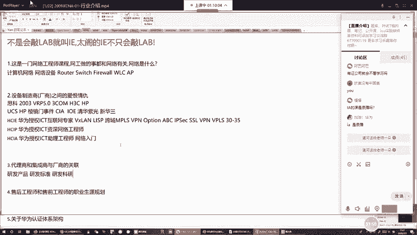

## 华为认证体系
作为设备制造商，华为为了帮助工程师更好地使用其设备，建立了一套专业的认证体系。这套体系分为三个级别：

1.  **HCIA（华为认证ICT初级工程师）**
    *   **定位**：网络入门，培养助理工程师。
    *   **学习内容**：网络基础概念、IP地址、OSI模型、基础路由交换技术（如静态路由、VLAN、STP）。
    *   **公式/代码示例**：一个基础的IP地址配置可能如下所示：
        ```bash
        system-view
        interface GigabitEthernet 0/0/1
        ip address 192.168.1.1 255.255.255.0
        ```

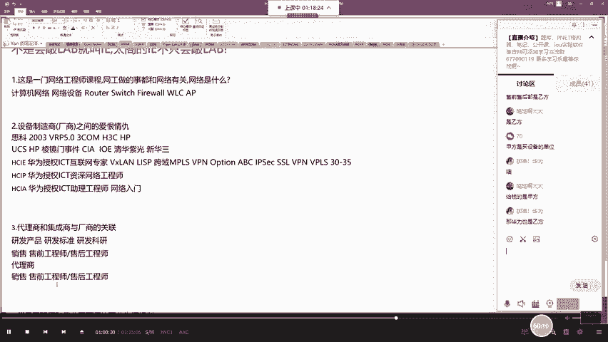

2.  **HCIP（华为认证ICT高级工程师）**
    *   **定位**：资深工程师，可独立负责中小型项目。
    *   **学习内容**：高级路由协议（如OSPF、BGP）、高级交换技术（如堆叠、MSTP）、企业网常用技术（如DHCP、VRRP）。
    *   **核心概念**：OSPF的邻居建立过程涉及`Hello`报文交换和状态机转换。

3.  **HCIE（华为认证ICT专家）**
    *   **定位**：专家级工程师，能处理复杂大型项目。
    *   **学习内容**：前沿技术，如VXLAN、SDN、各种VPN（MPLS VPN、SSL VPN）及跨领域融合技术。
    *   **职业价值**：在一线城市起薪较高，且职业生命周期长，经验越丰富越有价值。

## 网络工程师的职业路径
了解了厂商和认证，我们来看看网络工程师具体的职业发展方向。网络工程师主要服务于两类公司：设备厂商（如华为）和渠道伙伴（代理商、集成商）。

在岗位类型上，主要有两个方向：

1.  **售前工程师**
    *   **工作**：配合销售，与客户沟通需求，设计技术方案，解决“做什么”的问题。
    *   **要求**：技术扎实，沟通能力强，善于呈现和方案设计。

2.  **售后工程师**
    *   **工作**：负责设备的安装、调试、配置和故障排除，解决“怎么做”的问题。
    *   **要求**：技术精湛，动手能力强，善于分析和解决问题。

职业发展通常从售后工程师开始，积累经验后，可根据个人兴趣和特长向售前、技术管理或架构师等方向发展。

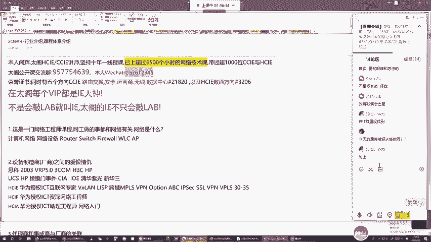

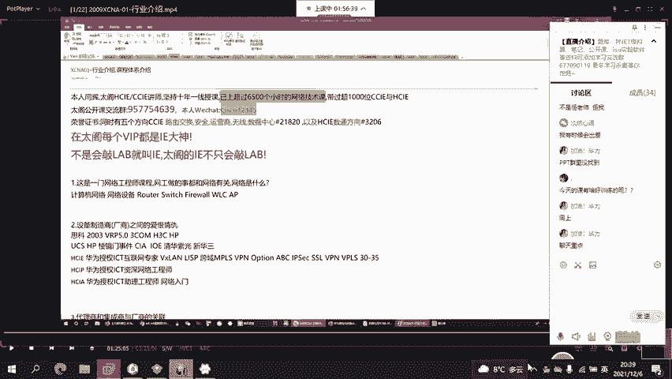

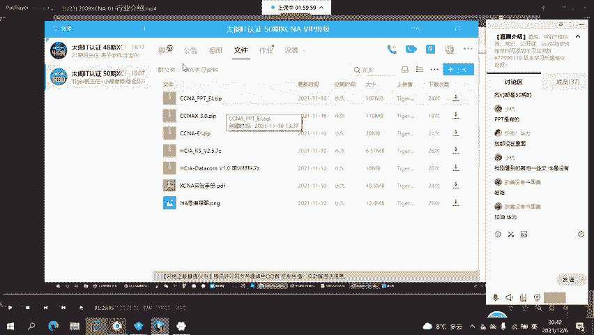

## 如何学习与课程介绍
要成为一名优秀的网络工程师，必须理解网络的基础原理。华为、思科的设备实现的是公共的标准协议。因此，学习的关键在于：
1.  **理解问题**：清楚网络通信中遇到了什么问题。
2.  **掌握原理**：理解协议和技术是如何解决这些问题的。
3.  **动手实践**：在设备上通过命令实现技术，并验证结果。
4.  **对比思考**：思考不同技术的优劣及适用场景。

本课程体系旨在贯彻“学以致用”和“应试取证”相结合的理念。课程由我（杨辉）主讲，我拥有多个方向的CCIE和HCIE认证，并有十余年的授课与项目经验。我们的目标是不仅帮助大家通过考试，更要掌握扎实的技能，真正改变职业命运。

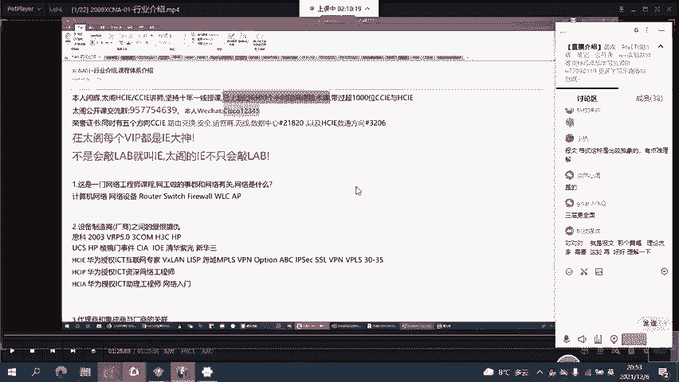

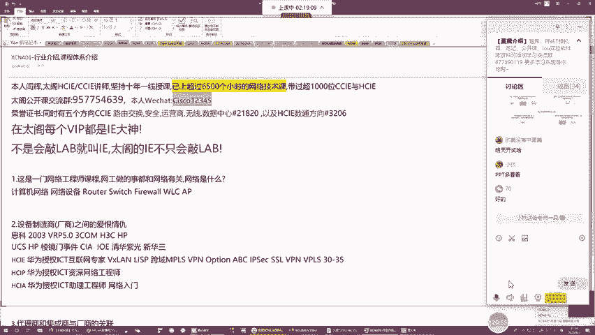

## 总结
本节课我们一起学习了网络工程师的职责、华为公司的成长历史、网络设备市场的竞争格局、华为三级认证体系的内容与价值，以及网络工程师主要的职业发展路径。从下一节课开始，我们将正式进入技术学习阶段，从最基础的网络概念讲起，一步步构建完整的知识体系。请大家做好准备，我们共同开启这段学习之旅。