# 华为认证HCIA-DATACOM教程：XCNA-02：网络三要素 📚

## 概述
在本节课中，我们将要学习网络的基础概念，特别是构成网络的三个核心要素。通过本节课的学习，你将能够理解网络的基本组成，并初步了解路由器、交换机等网络设备的作用。

---

## 网络的作用与主体
计算机网络的核心作用是实现通信，最终目标是资源共享。但需要通过网络进行通信的，并非计算机、手机或平板电脑本身，而是这些终端设备上运行的应用程序。

*   **终端**：指直接面向用户的设备，如计算机、手机、平板电脑等。
*   **应用程序**：安装在终端操作系统之上的软件，如QQ、浏览器、游戏等。正是这些应用程序需要通过网络来交互数据。

网络为应用程序提供数据传输服务，使不同终端上的应用能够彼此交换信息，从而实现“我有的你也有”的资源共享。

---

## 网络的三要素
一个成熟的网络通常包含以下三个基本要素：

### 1. 终端 🖥️
终端是网络的主体和服务的对象。终端通过网卡接入网络，其上的应用程序利用网络连接来收发数据。没有终端，网络就失去了存在的价值。

### 2. 介质 📡
介质是数据传输的物理通道，主要分为两类：
*   **有线介质**：如双绞线（网线）、光纤等，需要物理连接。
*   **无线介质**：如Wi-Fi信号，通过无线接入点提供连接。

### 3. 中间系统（网络设备）🔄
中间系统是指各种网络设备，如路由器、交换机、防火墙等。这些设备通常部署在机房，用户不可见，但它们对于组建可扩展、高性能的网络至关重要。它们负责在终端之间转发数据，是实现通信的关键。

---

## 网络的演进与连接
上一节我们介绍了网络的三要素，本节中我们来看看网络是如何连接和发展的。

### 从工作组到互联网
*   **工作组**：最简单的网络形式，如两台计算机直接用网线相连。但受限于网卡接口数量和网线传输距离（通常不超过100米），可扩展性极差。
*   **引入交换机**：为了解决连接更多设备的问题，我们使用**交换机**。交换机接口多、成本较低，适合作为**接入设备**连接大量终端。多台交换机还可以通过级联接口互连，进一步扩大网络规模。
*   **引入路由器与网络分段**：然而，一个网络（也称为一个**广播域**）内的设备过多会导致广播流量（如ARP请求）泛滥，严重影响网络性能。因此，需要使用**路由器**这类**汇聚/核心设备**将一个大网络分割成多个较小的网络（即分段）。路由器能隔离广播流量，提升网络效率。
*   **互联网**：通过路由器将多个不同的网络连接起来，就形成了**互联网**。全球最大的互联网就是由各国运营商网络互连而成的 **Internet**。

### 企业网络架构
一个典型的企业园区网络通常采用分层设计：
*   **接入层**：连接终端用户，设备以交换机为主，可能部署无线AP。
*   **汇聚层**：汇聚接入层的流量，常采用多层交换机，并部署冗余设备。
*   **核心层**：高速转发不同汇聚层之间的流量，是网络的骨干。
*   **出口**：通过防火墙或路由器连接到Internet。

---

## 网络通信原理：快递的比喻
理解了网络如何连接，我们再来看看数据是如何在网络中传输的。这个过程很像寄送快递。

1.  **数据载荷**：好比你要寄送的**巧克力**，是应用程序产生的实际内容（如聊天文字）。
2.  **封装**：不能直接寄送巧克力，需要将它放入**快递盒**并贴上**快递单**。在网络中，这就是给数据载荷添加**报头**的过程。报头中包含了关键的控制信息：
    *   **网络层报头**：包含**源IP地址**和**目的IP地址**，就像快递单上的收寄件人地址，告诉网络设备数据从哪里来、到哪里去。
    *   **传输层报头**：包含**源端口号**和**目的端口号**，用于标识发送和接收数据的具体应用程序，确保数据能交给正确的“收件人”（如QQ程序）。
3.  **传输与转发**：封装好的**数据包**（快递包裹）被交给网络设备（快递小哥）。设备根据目的地址（路由表）选择最佳路径进行转发。
4.  **解封装**：数据包到达目的终端后，终端会逐层拆开“包裹”（移除报头），最终将数据载荷交给目标应用程序处理。

**核心概念公式/代码描述**：
*   数据包 = 应用数据 + TCP/UDP报头 + IP报头 + 二层帧头帧尾
*   封装过程伪代码示意：`数据包 = 添加帧头(添加IP头(添加TCP头(应用数据)))`

---

## 关键概念解析
以下是本节课涉及的一些核心名词解释：

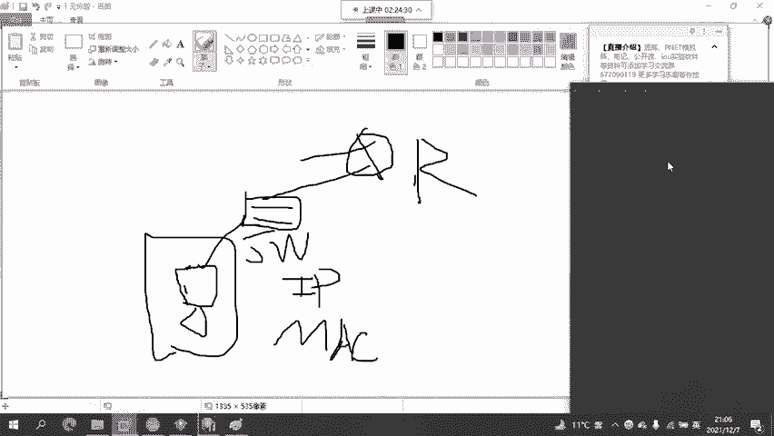

*   **网关**：一个网络的“出口”。通常指路由器（或三层交换机、防火墙）连接该网络的接口IP地址。终端设备必须配置正确的网关地址，才能访问本网络之外的资源。
*   **广播域**：广播流量所能到达的所有设备的集合。通常一个IP子网（网络）就是一个广播域。路由器是广播域的边界。
*   **路由**：路由器根据**路由表**确定去往目的网络的最佳路径的过程。路由表记录了“如何到达某个网络”的信息。
*   **防火墙**：部署在网络边界的安全设备，通过安全策略控制不同区域（如内网、外网、DMZ区）之间的访问，保护网络安全。

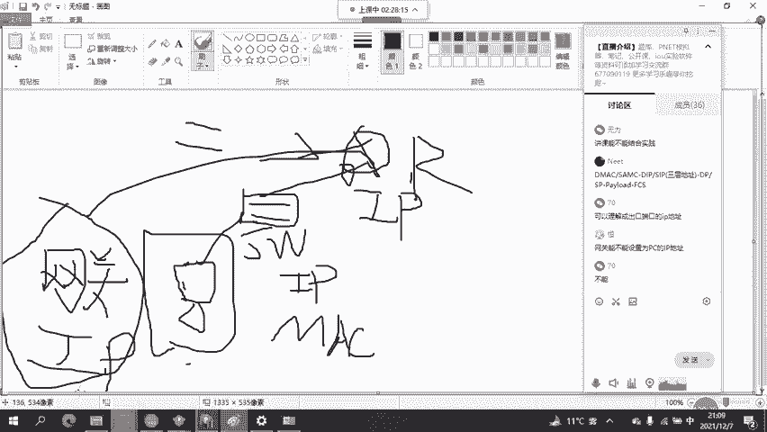

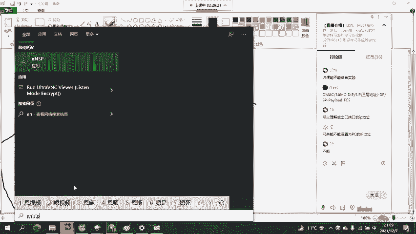

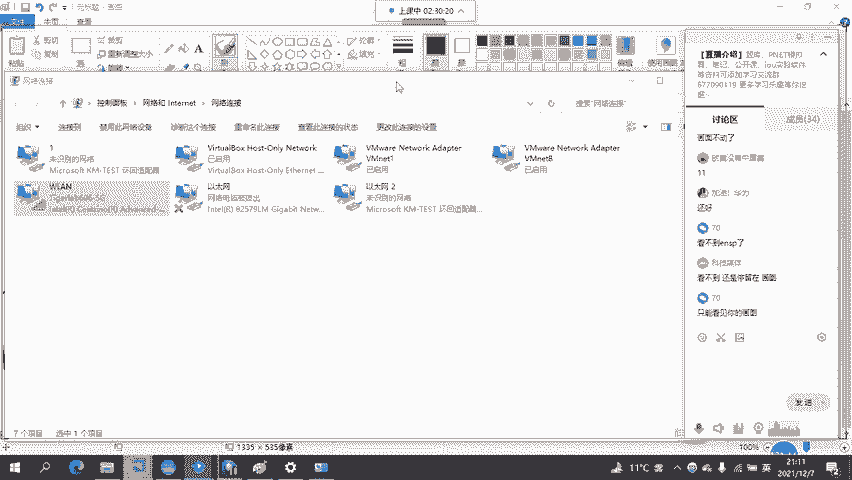

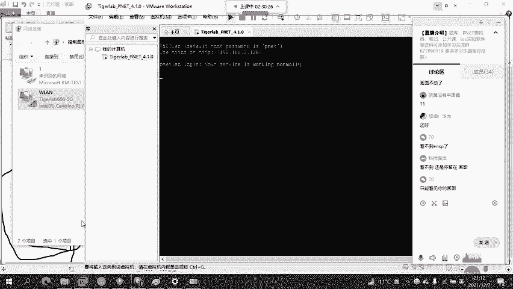

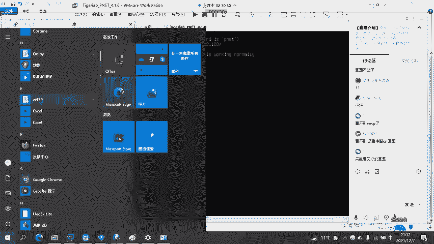

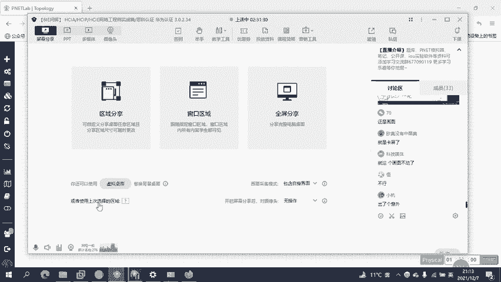

---

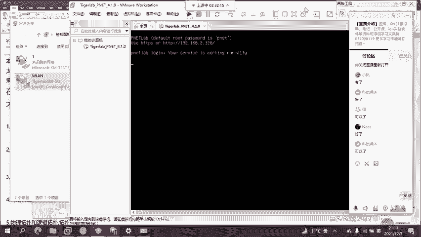

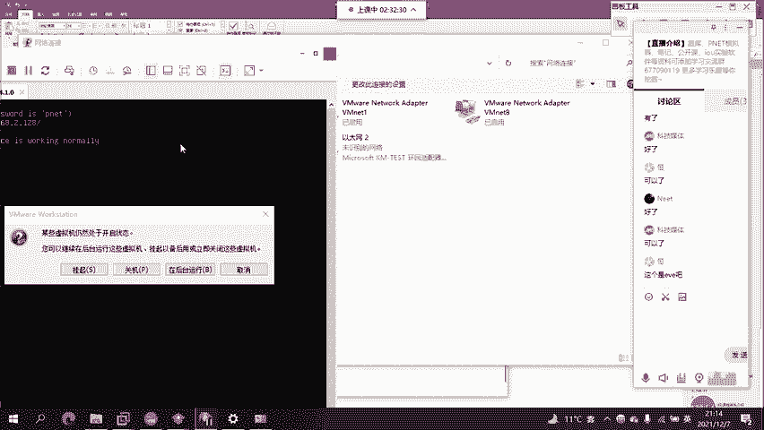

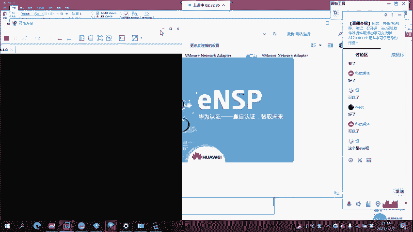

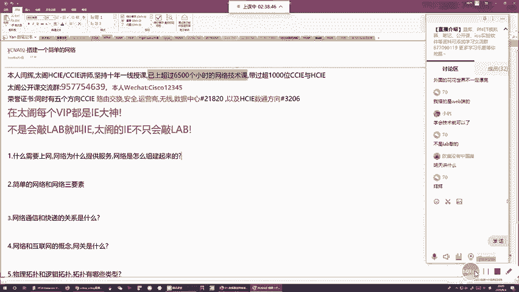

## 总结
本节课中我们一起学习了网络的基础知识。我们首先明确了网络为应用程序提供通信服务的核心目的，然后深入探讨了构成网络的三大要素：终端、介质和中间系统。我们了解了网络从简单的工作组演进到复杂互联网的过程，以及企业网络的分层架构。最后，我们通过生动的快递比喻，理解了数据封装、传输和解封装的基本通信原理，并掌握了网关、广播域、路由等关键概念。这些内容是后续深入学习网络技术的基石。