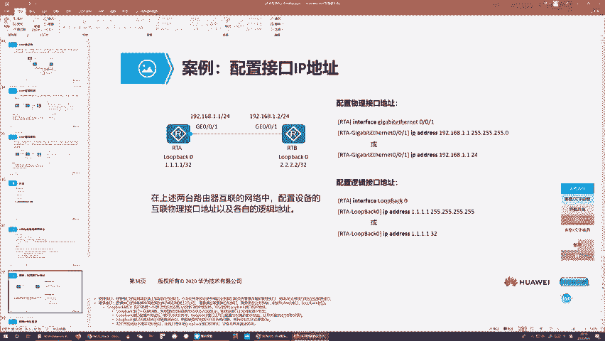
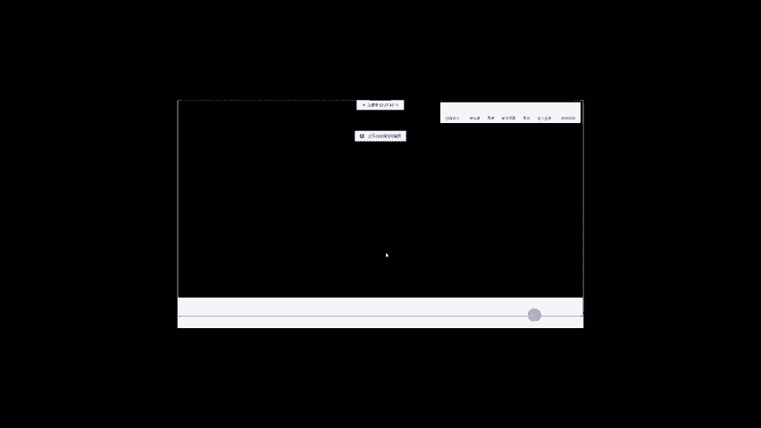
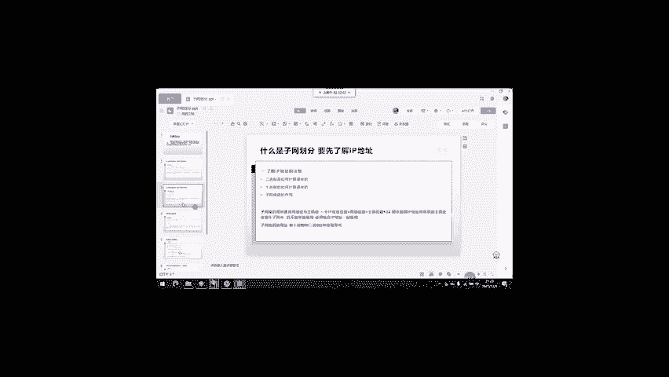
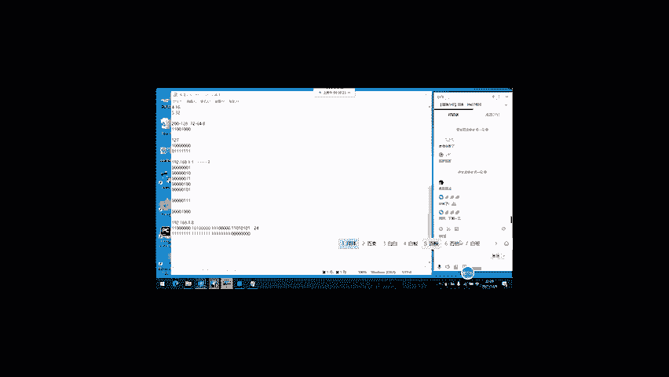

# 华为认证HCIA-DATACOM教程：04：IP协议与子网划分

## 概述

在本节课中，我们将要学习网络层最核心的协议——IP协议。我们将从IP报头结构开始，深入理解IP地址的构成、分类与作用，并重点掌握子网划分的原理与方法，以解决实际网络规划中的地址分配问题。

---

## IP协议概述

上一节我们介绍了OSI模型，网络层是与网络工程师关联最紧密的一层。网络层中最关键的技术就是IP协议。

多层交换机和路由器负责网络间的数据转发，而转发时需要基于地址进行寻址。在TCP/IP协议栈中，这个地址就是IP地址。IP协议属于网络层，因此网络层是OSI模型中与网络工程师工作最贴近的一层。

IP协议主要有两大贡献：
1.  定义了IP报头结构。
2.  定义了IP地址体系。

---

## IP报头详解

### 报头封装与结构

数据在网络上传输时需要进行层层封装。例如，用浏览器访问百度时，数据包的封装层次如下：
*   应用层数据（HTTP载荷）
*   传输层报头（TCP）
*   网络层报头（IPv4）
*   数据链路层报头（以太网帧头）和帧尾（FCS）

IP协议定义的报头就是网络层报头。

IPv4报头长度可变，范围是20到60字节。通常，正常通信不需要使用可选项字段，因此报头长度一般为20字节。报头必须是4字节的整数倍。

以下是IPv4报头的主要字段：

1.  **版本**：标识IP协议版本，IPv4值为4，IPv6值为6。
2.  **报头长度**：描述当前数据包三层报头的长度（单位：4字节）。
3.  **服务类型**：用于标识数据包的服务质量类别，是实施QoS（服务质量）的基础。通过为不同类型的数据（如语音、视频、文本）标记不同的TOS值，网络设备可以优先转发对延迟敏感的数据。
4.  **总长度**：描述包含IP报头在内的完整三层数据包的总字节数。
5.  **标识符、标记、分段偏移量**：这三个字段共同用于实现**三层分片**。当数据包大小超过链路MTU时，需要进行分片。
    *   **标识符**：标识分片属于哪个原始数据包。
    *   **标记**：
        *   DF位：置1表示不允许分片。
        *   MF位：置1表示后面还有更多分片，置0表示是最后一个分片。
    *   **分段偏移量**：描述该分片在原始数据包中的起始字节位置，用于接收端重组数据包。
6.  **生存时间**：限制数据包在网络中经过的最大跳数（路由器数量）。每经过一台路由器，TTL值减1。当TTL减为0时，数据包被丢弃。这可以防止因路由环路导致的数据包无限循环。
7.  **协议**：标识上层（传输层）使用的协议，例如：1代表ICMP，6代表TCP，17代表UDP。
8.  **首部校验和**：用于验证IP报头在传输过程中是否出错。
9.  **源IP地址**：发送数据包的节点IP地址。
10. **目的IP地址**：接收数据包的节点IP地址。在端到端传输中，源和目的IP地址应保持不变，这称为**端到端地址一致性规则**。

---

## IP地址基础

了解了IP报头后，我们来看IP协议的另一大贡献——IP地址。

### IP地址的作用与构成

IP地址具有双重作用：
1.  **标识一个节点**：作为网络设备接口的唯一标识。
2.  **描述节点位置**：指明节点位于哪个网络，并在该网络内区分不同的节点。

一个**节点**通常指一个配置了IP地址的三层或三层以上接口。在整个Internet范围内，不能有两个节点使用相同的IP地址，否则会发生地址冲突。

IP地址是一个32位的二进制数，通常以点分十进制表示，例如 `192.168.1.1`。它被分为4段，每段8位，取值范围是0到255。

### 网络位与主机位

IP地址由两部分组成：
*   **网络位**：高位部分，描述节点所在的网络。
*   **主机位**：低位部分，在同一个网络内区分不同的节点。

例如，地址 `192.168.10.1` 配合子网掩码 `255.255.255.0`，表示前24位是网络位，后8位是主机位。同一个网络内的所有节点，其网络位必须相同，主机位必须不同。

### 子网掩码

子网掩码是一个32位的工具，用来明确标识IP地址中哪些位是网络位，哪些位是主机位。其特点是高位为连续的1，低位为连续的0。

*   子网掩码中的“1”对应IP地址的网络位。
*   子网掩码中的“0”对应IP地址的主机位。

书写时，除了使用点分十进制（如 `255.255.255.0`），更常用斜杠加位数表示（如 `/24`），代表网络位的长度。

---

## IP地址分类与特殊地址

### 地址分类

IANA将IP地址分为五大类：

| 类别 | 首字节范围 | 网络位长度 | 主机位长度 | 用途 |
| :--- | :--- | :--- | :--- | :--- |
| **A类** | 1 - 126 | 8位 | 24位 | 单播地址 |
| **B类** | 128 - 191 | 16位 | 16位 | 单播地址 |
| **C类** | 192 - 223 | 24位 | 8位 | 单播地址 |
| **D类** | 224 - 239 | N/A | N/A | 组播地址 |
| **E类** | 240 - 255 | N/A | N/A | 保留地址 |

> **注意**：
> *   `0.0.0.0` 代表默认路由或未指定地址。
> *   `127.0.0.1` 是环回地址，用于测试本机TCP/IP协议栈。
> *   D类地址用于组播，标识一组接收者。
> *   E类地址被保留，用于研究。

### 网络号与广播地址

在一个网段中，有两个特殊地址不能分配给主机使用：
1.  **网络号**：主机位全为0的地址，用于标识网络本身。例如 `192.168.1.0/24`。
2.  **广播地址**：主机位全为1的地址，用于向该网络内所有主机发送数据。例如 `192.168.1.255/24`。

因此，一个网段中可用的主机地址数量是 `2^(主机位数) - 2`。

### 公有地址与私有地址

由于IPv4地址枯竭，引入了地址分类：
*   **公有地址**：需要在IANA注册，保证全球唯一，用于Internet。
*   **私有地址**：无需注册，仅在私有网络内部保证唯一，不能直接在Internet上路由。企业内网通常使用私有地址。
    *   A类私有：`10.0.0.0/8`
    *   B类私有：`172.16.0.0/12` (`172.16.0.0` 到 `172.31.255.255`)
    *   C类私有：`192.168.0.0/16` (`192.168.0.0` 到 `192.168.255.255`)

为了让使用私有地址的内网主机访问Internet，需要在网络边界设备上部署**NAT**技术。

---

## 子网划分

### 子网划分的目的

将一个主类地址段（如一个C类网段 `192.168.1.0/24`）直接用于一个网络，可能会造成地址浪费（该网络可能只有几十台主机）。若将其中的不同地址用于多个不同网络，又会因网络位相同而导致地址冲突。

**子网划分**通过“借位”的方式解决这个问题：从主机位借用若干高位，将其变为**子网位**（扩展的网络位）。这样，一个大的主类网络就被划分成了多个更小的子网，每个子网拥有不同的网络标识，可以分配给不同的物理网络使用，既避免了冲突，又节约了地址。

### 子网划分示例

假设有主类网络 `192.168.1.0/24`（网络位24，主机位8）。

*   **借1位**：从主机位最高位借1位作为子网位。
    *   新掩码：`/25` (255.255.255.128)
    *   划分出2个子网：
        *   子网1：`192.168.1.0/25` (子网位为0)
        *   子网2：`192.168.1.128/25` (子网位为1)
    *   每个子网有7位主机位，可用主机地址为 `2^7 - 2 = 126` 个。

*   **借2位**：可划分出 `2^2 = 4` 个子网，掩码为 `/26`。
*   **借n位**：可划分出 `2^n` 个子网，新掩码长度为 `原网络位长度 + n`。

> **关键规则**：借位时，必须从主机位的最高位开始借，依次向低位进行。

### FLSM 与 VLSM

根据子网划分的灵活性，分为两种方式：

*   **FLSM**：使用同一个子网掩码长度来划分所有子网。所有子网大小相同。
*   **VLSM**：允许使用不同的子网掩码长度来划分子网。可以针对不同大小的网络（如30台主机的网络和10台主机的网络）分配大小合适的子网，实现地址的精细化管理与最大程度的节约。

现代网络规划中普遍采用VLSM。

---

## ICMP协议

网络层除了IP协议，还有一个重要的辅助协议——**ICMP**。

ICMP协议封装在IP数据包内（IP报头协议字段值为1），主要用于网络连通性测试和错误报告。

### 常用工具

*   **Ping**：使用ICMP Echo Request和Echo Reply消息，测试网络连通性。
*   **Traceroute**：通过发送TTL值递增的数据包，探测到达目的地址的路径，并显示途径的每一跳路由器地址。

### 常见ICMP消息类型

*   **Type 0**: Echo Reply (Ping应答)
*   **Type 8**: Echo Request (Ping请求)
*   **Type 3**: Destination Unreachable (目的不可达)
    *   Code 0: Network unreachable (网络不可达)
    *   Code 1: Host unreachable (主机不可达)
    *   Code 2: Protocol unreachable (协议不可达)
    *   Code 3: Port unreachable (端口不可达)
*   **Type 5**: Redirect (重定向) - 用于优化路径。

---

## 总结

本节课我们一起学习了网络层的核心内容：
1.  **IP报头结构**：理解了各字段的作用，特别是TTL、分片、协议类型等关键字段。
2.  **IP地址体系**：掌握了IP地址的点分十进制表示、网络位/主机位的概念、子网掩码的作用，以及ABC类地址的范围和公有/私有地址的区别。
3.  **子网划分**：这是本节课的重点。我们学习了通过借位进行子网划分的原理、目的和方法，理解了FLSM与VLSM的区别，并掌握了基本的子网计算思路。
4.  **ICMP协议**：了解了这个用于网络测试和差错报告的辅助协议及其常用工具Ping和Traceroute。

这些知识是进行网络设计、地址规划、故障排查的基础，需要大家认真理解和掌握。