# 华为认证HCIA-DATACOM教程：P6：思科华为系统及常用命令

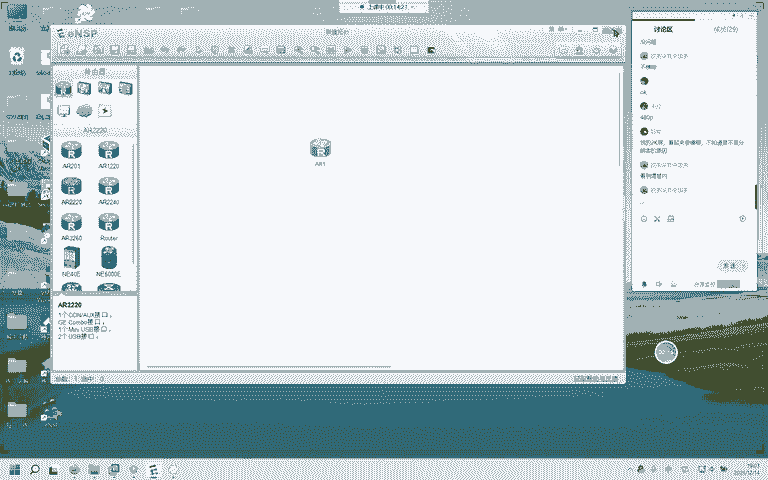

在本节课中，我们将学习华为ENSP模拟器的基本操作、常用命令，并通过一个简单的网络实验，理解不同网段间通信的原理。课程最后，我们会简要对比思科设备的配置方式。


## 🖥️ 华为ENSP模拟器基础


上一节我们介绍了课程安排，本节中我们来看看华为ENSP模拟器的基本界面和操作。

### 运行环境与注意事项
在运行ENSP模拟器前，需注意以下事项：
*   关闭或卸载电脑管家、杀毒软件等，它们可能拖慢系统速度并干扰模拟器运行。
*   下载软件时，请认准官方网站，避免下载捆绑了恶意软件的安装包。
*   运行ENSP时，请务必使用**管理员身份**打开。

### 主界面与设备介绍
打开ENSP后，主界面顶部有7个图标，代表不同类型的网络设备：
*   **路由器 (R)**
*   **交换机 (S/W)**
*   **无线设备 (W)**
*   **防火墙 (F)**
*   **终端 (End)**
*   **其他设备**
*   **连线 (Link)**

以下是常用设备型号建议：
*   **路由器**：常使用 `AR2220`，性能适中。
*   **交换机**：接入层使用 `S3700`，汇聚层使用 `S5700`。
*   **终端**：使用 `PC` 或 `Server`。

将设备拖入拓扑区后，蓝色表示设备未启动。可以右键设备查看后面板，以添加或更换接口板卡。

### 工具栏功能
工具栏提供了快速操作按钮，以下是核心功能介绍：
*   **新建/打开/保存拓扑**：管理实验文件。
*   **撤销/恢复**：用于操作回退。
*   **删除**：删除选中设备或所有连线。
*   **放大/缩小/1:1**：调整拓扑视图。
*   **显示接口/网络**：在拓扑上显示设备接口或网络信息。
*   **数据抓包**：点击链路可启动抓包工具。
*   **显示网格**：辅助对齐设备。

### 设备连线
点击闪电图标进行连线。选择 `Copper`（铜缆）即可。连线后，可点击“显示接口标签”按钮，以便查看接口名称。

### 界面设置
在“设置”菜单中，可以调整界面：
*   **界面设置**：可调整设备标签、背景、对话框透明度等。
*   **字体设置**：可修改命令行字体颜色和大小，建议初学者保持默认。

### 常见问题解决
如果启动设备时出现 `40` 或 `41` 错误，请尝试以下步骤：
1.  以管理员身份打开 `VirtualBox`。
2.  删除所有虚拟机。
3.  在ENSP的“工具”菜单中，点击“注册设备”，全选后注册。

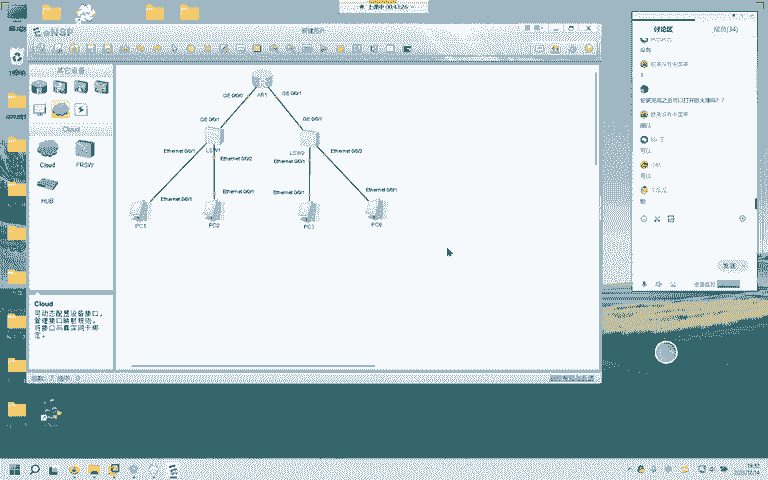

---

## ⌨️ 华为设备基础命令

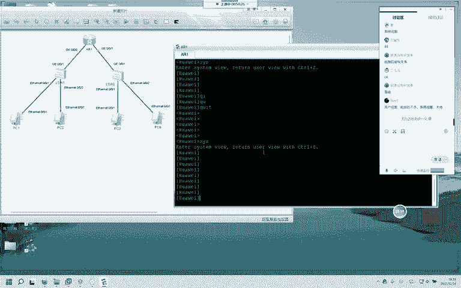

熟悉了模拟器界面后，本节我们来看看华为设备的基本配置命令和操作技巧。

### 视图与导航
华为设备配置具有层级关系，称为“视图”。
*   **用户视图**：设备启动后进入的视图，提示符为 `<Huawei>`。在此视图下可执行少量查看命令。
*   **系统视图**：在用户视图下输入 `system-view` 进入，提示符变为 `[Huawei]`。大部分配置在此视图下进行。
*   **接口视图等**：在系统视图下输入 `interface GigabitEthernet 0/0/0` 可进入特定接口的配置视图。

**导航命令**：
*   `quit`：退出当前视图，返回上一级视图。
*   `Ctrl+Z` 或 `return`：直接从任何视图**一次性返回用户视图**。

### 常用快捷键与帮助
*   **方向键 ↑ ↓**：调出历史命令。
*   **Tab键**：自动补全命令。当输入的前几个字母能唯一确定一条命令时，按 `Tab` 可直接补全。
*   **? 键**：获取帮助。在命令后输入 `?`，会显示该位置所有可用的参数或子命令。

### 基础配置命令
以下是几个最常用的配置和查看命令：
*   **修改设备名称**：在系统视图下，使用 `sysname R1` 将设备名称改为 `R1`。
*   **查看当前视图配置**：在任何视图下，使用 `display this` 查看本视图下已做的配置。
*   **查看设备全部配置**：在用户视图下，使用 `display current-configuration`。
*   **查看接口IP摘要**：使用 `display ip interface brief` 快速查看所有接口的IP地址和状态。
*   **查看路由表**：使用 `display ip routing-table`。
    *   可附加参数细化查看，例如 `display ip routing-table protocol ospf` 只查看通过OSPF学到的路由。

### 接口配置与测试
进入接口视图后，可以配置IP地址：
```
[Huawei] interface GigabitEthernet 0/0/0
[Huawei-GigabitEthernet0/0/0] ip address 10.1.1.1 255.255.255.0
```
配置完成后，接口协议状态会变为 `Up`。

**测试命令**：
*   `ping {IP地址}`：测试网络连通性。
*   `tracert {IP地址}`：追踪数据包路径，用于网络故障排查。

---

## 🌐 实现跨网段通信实验

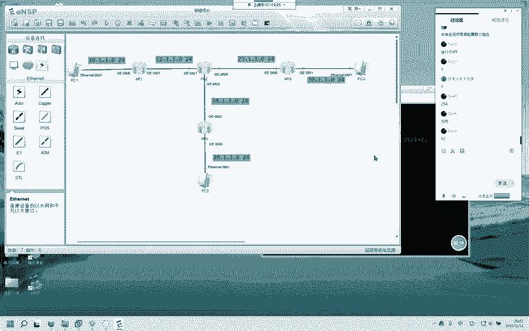

上一节我们学会了基础命令，本节我们通过一个实验，理解如何让不同网段的主机相互通信。

### 实验拓扑与需求
我们构建一个包含多台路由器和PC的简单网络。目标是让 `PC1` (192.168.1.0/24网段) 能够与 `PC2` (172.16.1.0/24网段) 通信。

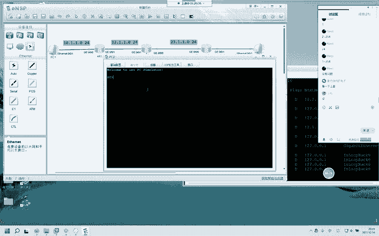

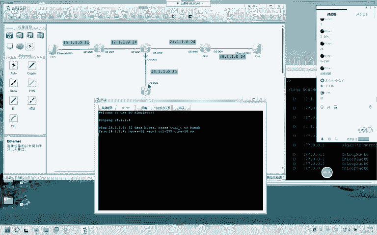


**核心概念**：路由器只能自动知晓与其**直连**的网络。对于非直连的网络，必须通过**静态路由**或**动态路由协议**来告知路由器如何到达。

### 配置步骤
1.  **基础IP配置**：为所有路由器的接口配置正确的IP地址，并确保直连链路能 `ping` 通。
2.  **配置静态路由**：
    *   在 `R1` 上，告诉它如何去往 `PC2` 所在的网络 `172.16.1.0/24`。下一跳是 `R2` 的接口地址 `12.1.1.2`。
        ```
        [R1] ip route-static 172.16.1.0 255.255.255.0 12.1.1.2
        ```
    *   在 `R2` 上，告诉它如何去往 `PC1` 所在的网络 `192.168.1.0/24`。下一跳是 `R1` 的接口地址 `12.1.1.1`。
        ```
        [R2] ip route-static 192.168.1.0 255.255.255.0 12.1.1.1
        ```
    *   **下一跳**：指数据包从本设备发出后，第一个接收它的邻居设备接口地址。

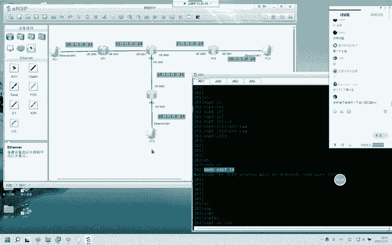

### 验证与排错
配置完成后，在 `PC1` 上 `ping PC2` 的地址 `172.16.1.1`。
*   若不通，可使用 `tracert 172.16.1.1` 命令追踪路径，查看数据包在哪个节点中断，从而缩小故障排查范围。
*   检查路由表：使用 `display ip routing-table` 确认静态路由是否已生效。

通过此实验，我们理解了路由是跨网段通信的基础。

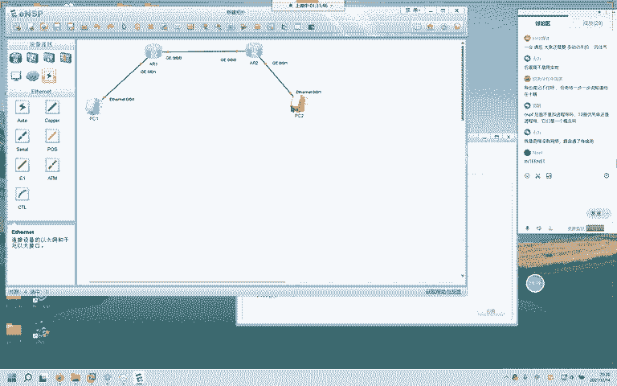

---

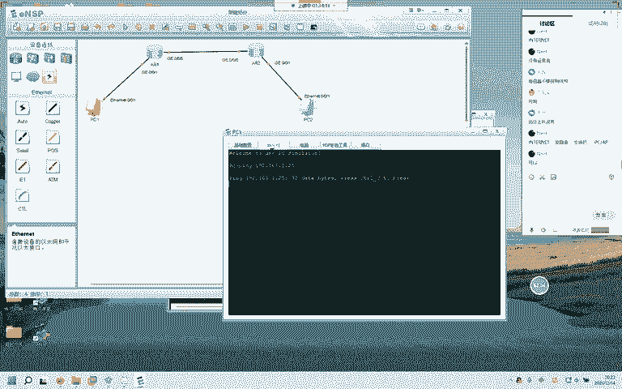

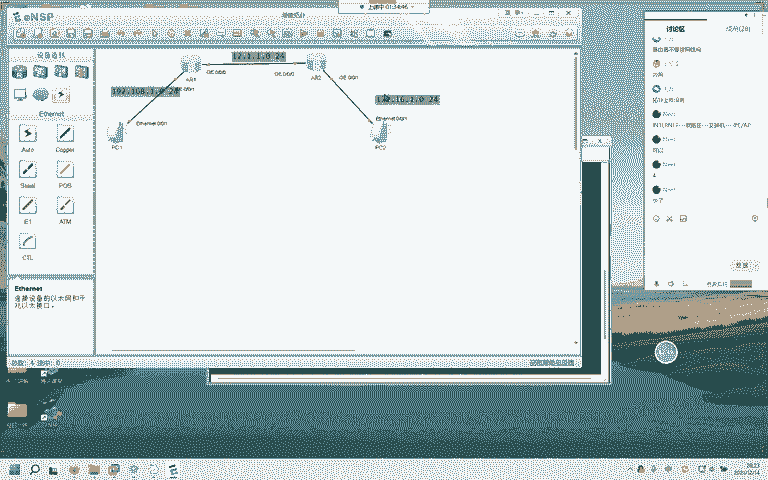

## 🔄 思科设备命令简要对比

最后，我们简要对比思科设备的配置，其逻辑与华为相似，但命令格式有差异。

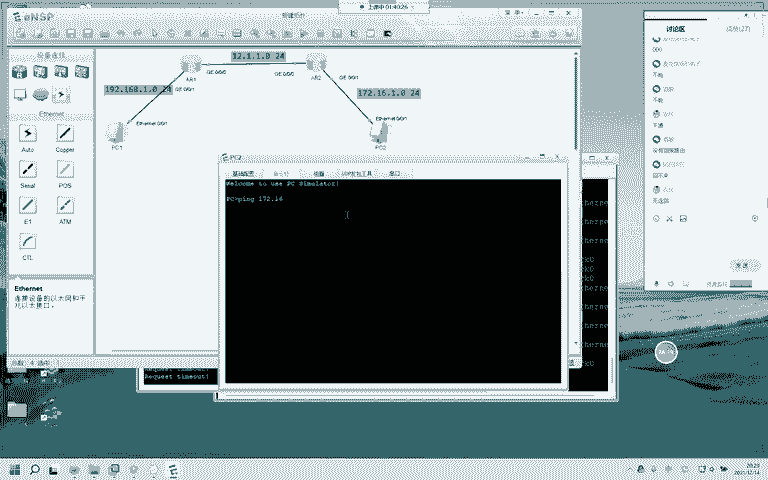

### 主要区别
1.  **视图进入**：思科的用户视图叫“用户执行模式”，系统视图叫“全局配置模式”，使用 `configure terminal` 进入。
2.  **命令关键字**：华为的 `display` 在思科中为 `show`。
3.  **接口默认状态**：思科路由器接口默认是关闭的，配置IP后需执行 `no shutdown` 命令手动开启。
4.  **静态路由配置**：思科命令为 `ip route`，且子网掩码必须用点分十进制格式（如255.255.255.0），不能直接写`24`。
    ```
    R1(config)# ip route 172.16.1.0 255.255.255.0 12.1.1.2
    ```

### 配置保存
*   **华为**：在用户视图下使用 `save` 命令保存配置。
*   **思科**：在特权执行模式下使用 `write` 或 `copy running-config startup-config` 保存配置。

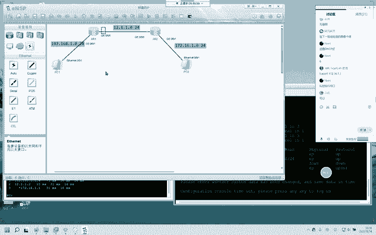


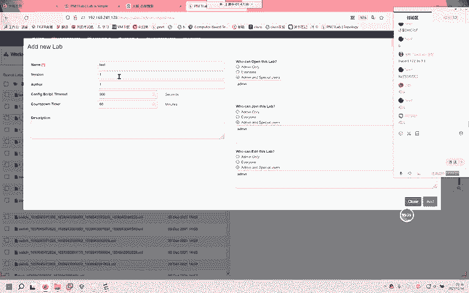

尽管命令不同，但网络配置的原理（如IP规划、路由概念）是完全相通的。

---

## 📚 本节课总结

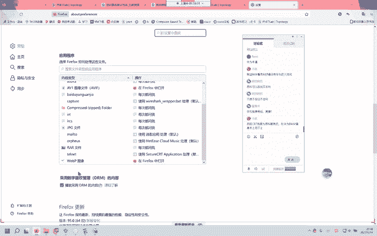

在本节课中，我们一起学习了：
1.  **华为ENSP模拟器**的基本操作、设备添加、连线及界面设置。
2.  **华为设备命令行**的基础，包括视图切换、快捷键、帮助系统以及常用的配置和查看命令。
3.  **网络通信原理**，通过一个静态路由实验，理解了路由器如何通过路由表实现跨网段通信，并掌握了 `ping` 和 `tracert` 等测试工具。
4.  **思科与华为的对比**，了解了两者在配置命令上的主要差异，认识到其底层网络原理的一致性。

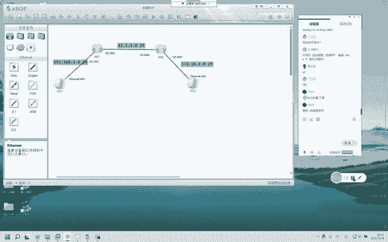

掌握这些基础是成为一名网络工程师的第一步。下节课我们将深入讲解路由条目的构成、静态路由与默认路由的详细配置。