# 华为认证HCIA-DATACOM教程：07：静态路由与路由器工作原理 🚦

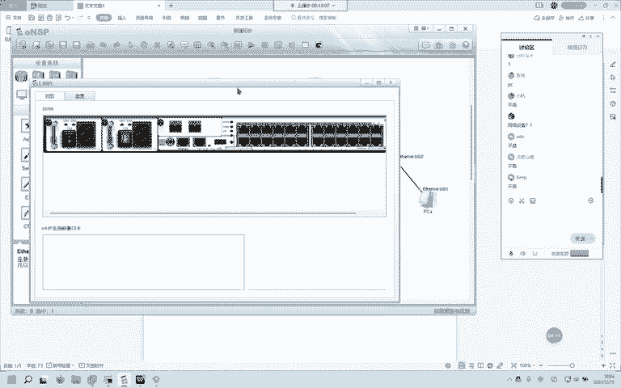

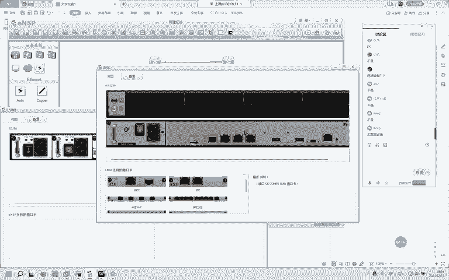

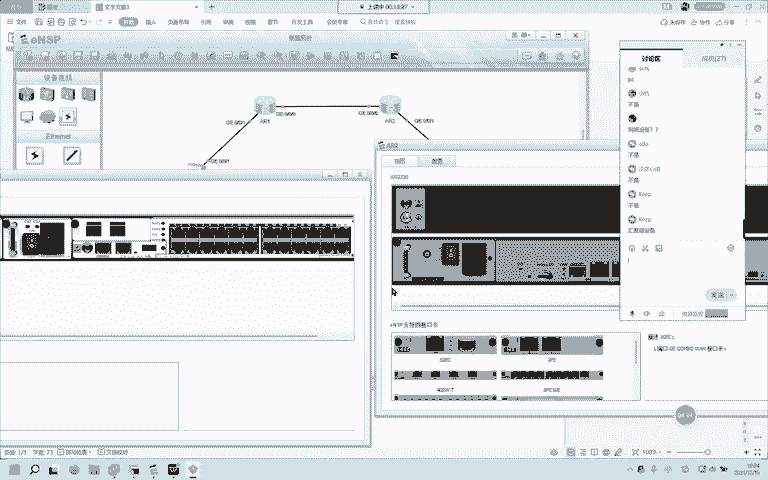

在本节课中，我们将要学习路由器的核心工作原理，包括其定位、路由表的概念、以及数据层面与控制层面的区别。我们还将深入探讨静态路由的配置方法，并理解路由条目中的关键要素。这些知识是理解网络数据如何在不同网络间传输的基础。

## 路由器的定位 🧭

上一节我们介绍了网络的基本构成，本节中我们来看看网络中的关键设备——路由器。路由器在网络中扮演着两个核心角色。

首先，路由器可以**隔离广播域**。这意味着它能阻止广播流量从一个网络传播到另一个网络，从而将大型网络划分为更小、更易管理的广播域。

其次，路由器用于**连接不同的网络**。它作为不同网络（或广播域）之间的桥梁，使得这些网络中的设备能够相互通信。同时，路由器负责执行**网络间的数据转发**，根据目的IP地址将数据包从一个网络传递到另一个网络。

## 路由条目与路由表 📋

理解了路由器的定位后，我们来看看它是如何知道该把数据发往何处的。这依赖于路由条目和路由表。

*   **路由**：指的是一台路由器去往一个特定目的网络的**路径**。
*   **路由表**：是路由器中存储的**所有路由条目的集合**。路由表中的每一条路由条目都能告诉路由器，去往某个目的网络应该如何走。

简单来说，路由是具体的“路线指示”，而路由表是存储所有这些“路线指示”的“地图册”。

## 路由器的控制层面与数据层面 ⚙️

路由器的工作可以清晰地分为两个层面：控制层面和数据层面。这是理解路由器工作原理的重中之重。

### 控制层面：学习路由

控制层面负责**学习和生成路由表**。路由器通过以下三种方式获取路由信息：

以下是路由器学习路由的三种主要方式：
1.  **直连路由**：当路由器的接口配置了IP地址并处于激活状态时，路由器会自动发现并学习到该接口所直接连接的网络路由。
2.  **静态路由**：由网络管理员手动配置并写入路由器的路由条目。管理员明确指定了去往某个网络应该通过哪个接口、下一跳地址是什么。
3.  **动态路由选择协议**：路由器运行如OSPF、RIP等协议，通过与网络中的其他路由器自动交换路由信息，动态地学习到最佳路径。

### 数据层面：转发数据

数据层面则负责**根据已有的路由表来实际转发数据包**。其工作流程可以分为三步：

以下是数据层面处理数据包的三个核心步骤：
1.  **检查数据包目标**：路由器收到数据帧后，首先检查其**目的MAC地址**是否与接收接口的MAC地址匹配。如果不是发送给自己的，则丢弃；如果是，则拆开数据帧，查看三层IP包头。
2.  **查找路由表**：查看IP包头中的**目的IP地址**，将其与自身路由表中的条目逐一进行匹配（这个过程涉及IP地址与掩码的“与”运算，以得到网络号）。
3.  **执行转发或丢弃**：
    *   如果找到匹配的路由条目，则按照该条目的指示（指定出接口和下一跳）转发数据包。
    *   如果找不到任何匹配的路由条目，则丢弃该数据包。
    *   如果有多条路由条目都能匹配目的地址，则遵循**最长掩码匹配规则**，选择**掩码最长**（即最精确）的那条路由进行转发。

## 直连路由与非直连路由 🔗

根据路由的获取方式，我们可以将其分类：
*   **直连路由**：路由器接口直接相连的网络路由，可以自动获悉。
*   **非直连路由**：非直接相连的远程网络路由，必须通过配置**静态路由**或运行动态**路由选择协议**来学习。

## 网关的概念 🚪

**网关**是一个网络的“出口”。当一台设备（如PC）需要将数据发送到其他网络时，它首先会把数据包发送给其配置的网关地址（通常是本地路由器接口的IP地址）。网关是数据离开本地网络的第一站。

## 路由条目六要素 🧮

一条完整的路由条目通常包含六个关键要素，无论是查看还是配置路由时都需要理解它们。

以下是构成一条路由条目的六个核心要素及其解释：
1.  **前缀/目的网络**：指目的网络的网络号（通过IP地址与掩码“与”运算得出）。
2.  **掩码**：用于区分IP地址中的网络部分和主机部分，并指明前缀的长度。
3.  **出接口**：数据包离开路由器去往目的网络时，**从本路由器的哪个物理或逻辑接口发出**。
4.  **下一跳**：数据包为了到达目的网络，需要经过的**下一个三层设备（通常是路由器）接口的IP地址**。它描述了路径上的第一个节点。
5.  **管理距离/优先级**：用于衡量从不同来源（直连、静态、不同动态协议）学到的**同一条路由的可靠性**。**数值越小，优先级越高，路由越可信**。例如，华为设备中OSPF路由的优先级为10，静态路由为60，OSPF路由更优。
6.  **度量值**：用于比较**从同一种路由协议学到的、通往同一目的地的不同路径的优劣**。度量值计算方式因协议而异（如RIP使用跳数，OSPF使用带宽成本），**值越小路径越优**。


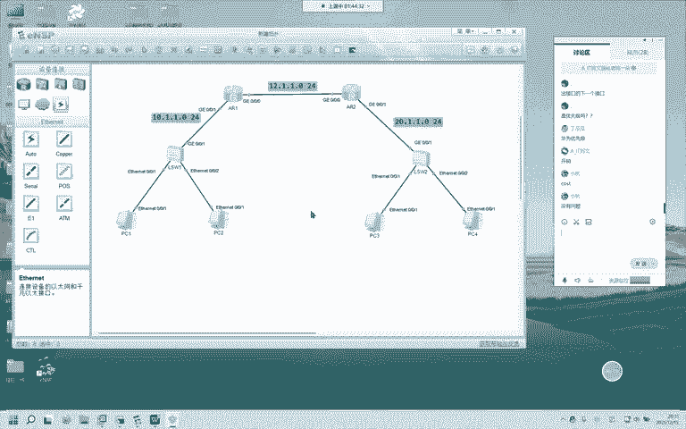

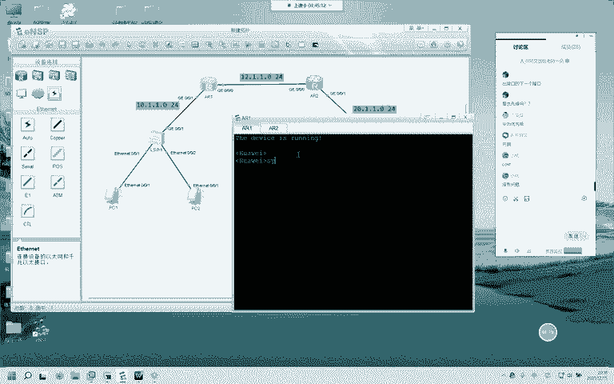

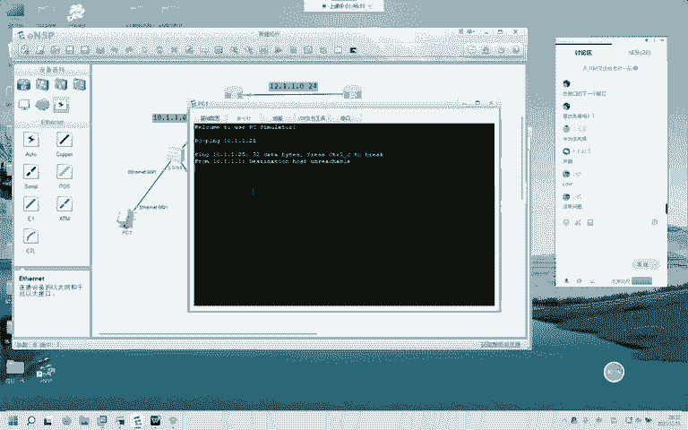

> **注意**：管理距离用于在不同“信息来源”间做选择；度量值用于在同一“信息来源”的不同“路径”间做选择。


## 静态路由配置示例 💻

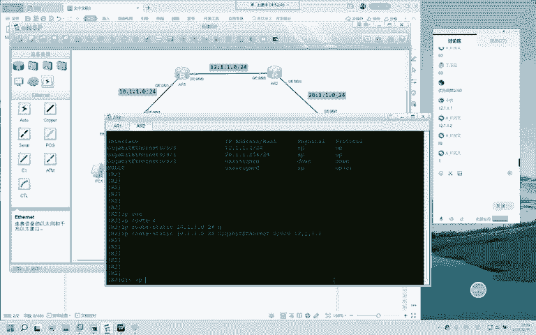

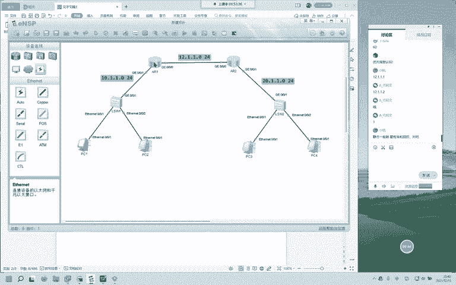

理论需要结合实际操作。下面我们通过一个简单示例，演示如何在华为设备上配置静态路由，使两个非直连网络能够通信。

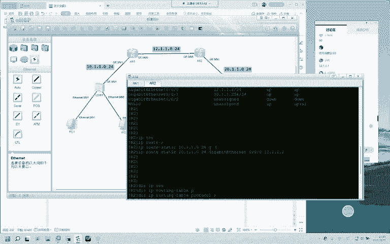

假设我们需要让R1知道如何到达网络 `20.1.1.0/24`。
在R1上的配置命令如下：
```bash
ip route-static 20.1.1.0 255.255.255.0 GigabitEthernet 0/0/0 12.1.1.2
```
*   `20.1.1.0 255.255.255.0`：目的网络的前缀和掩码。
*   `GigabitEthernet 0/0/0`：出接口。
*   `12.1.1.2`：下一跳IP地址。

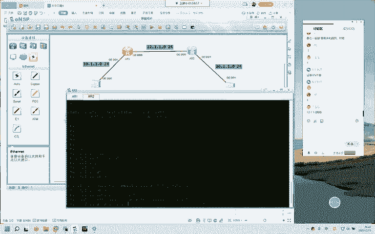

配置完成后，可以使用 `display ip routing-table` 命令查看路由表，确认静态路由是否已生效。

## 环回接口简介 🔄

在实验环境中，我们经常使用**环回接口**来模拟路由器身后的主机或网络。环回接口是路由器内部的虚拟接口，非常稳定（因为不存在物理链路故障）。

创建环回接口并配置IP地址的命令示例如下：
```bash
interface LoopBack 0
 ip address 2.2.2.2 255.255.255.255
```
这样，`2.2.2.2/32` 这个地址就可以代表R2所连接的一个终端，简化了实验拓扑。

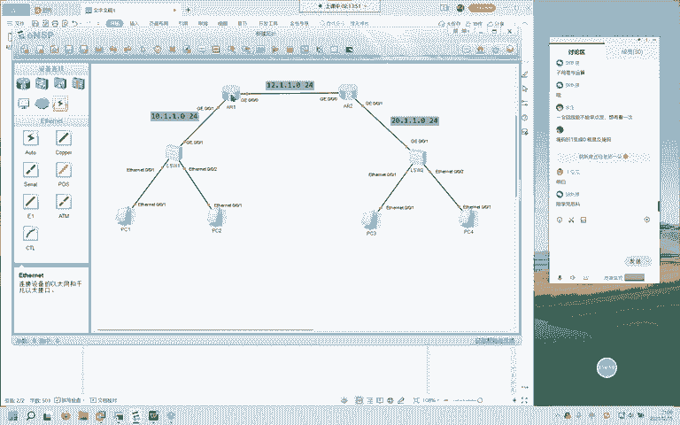

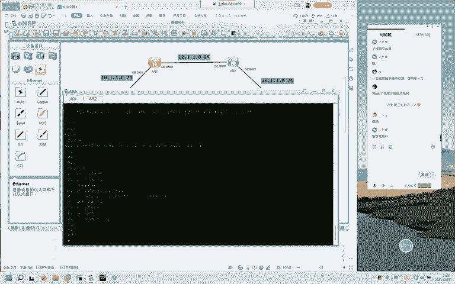

---


本节课中我们一起学习了路由器的核心工作原理。我们明确了路由器隔离广播域、连接不同网络并进行数据转发的定位；深入剖析了路由表如何通过控制层面（直连、静态、动态）学习生成，以及数据层面如何依据路由表执行转发决策（包括最长掩码匹配规则）；我们还详细解析了路由条目的六个要素，并通过实例演示了静态路由的配置。理解这些概念是掌握IP路由和进行网络故障排查的坚实基础。