# IS-IS高级特性：P102：IS-IS LSP分片扩展与GR

在本节课中，我们将要学习IS-IS协议的两个高级特性：LSP分片扩展和优雅重启。这些特性旨在解决大规模网络中LSP容量不足的问题，以及在路由器重启或主备切换时保证网络流量的不中断。

## LSP分片扩展

上一节我们介绍了IS-IS的基础工作原理，本节中我们来看看当网络规模扩大时，如何解决LSP分片数量不足的问题。

### 核心概念与术语

在理解LSP分片扩展之前，我们需要先了解几个核心概念。

*   **初始系统**：指实际运行IS-IS协议的物理路由器。
*   **初始系统ID**：即我们在配置IS-IS时，通过`network-entity`命令设置的系统ID。
*   **虚拟系统**：为了扩展LSP容量，我们可以在一个物理路由器上手动创建多个虚拟的IS-IS路由器实例。每个虚拟系统都需要一个唯一的系统ID来标识。
*   **虚拟系统ID**：用于唯一标识一个虚拟系统的系统ID。

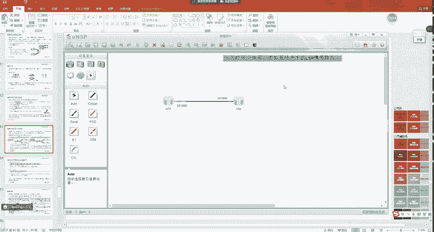

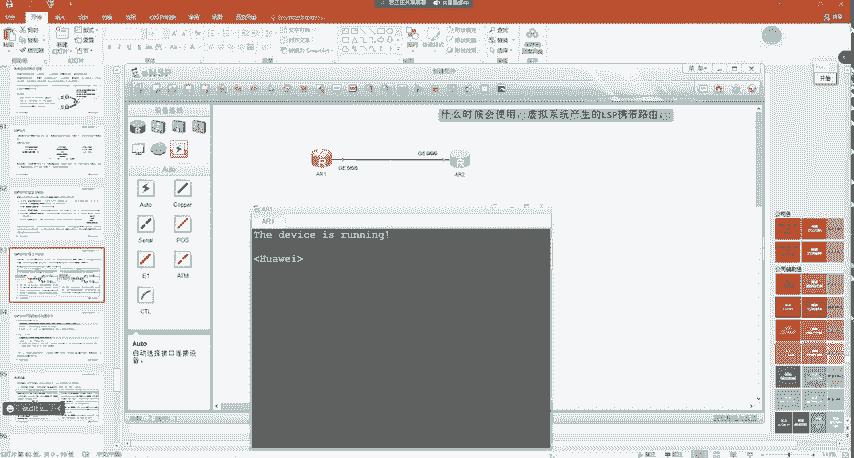

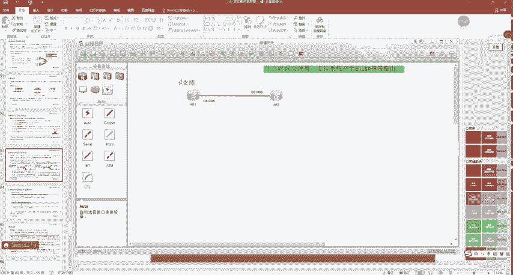

一个物理路由器最多可以配置50个虚拟系统，从而理论上可以支持超过1万个LSP分片，足以应对大规模网络的需求。

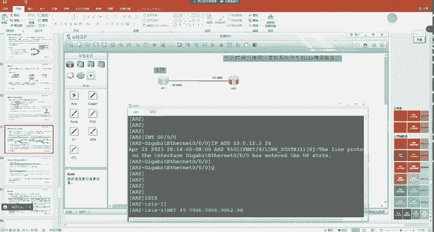

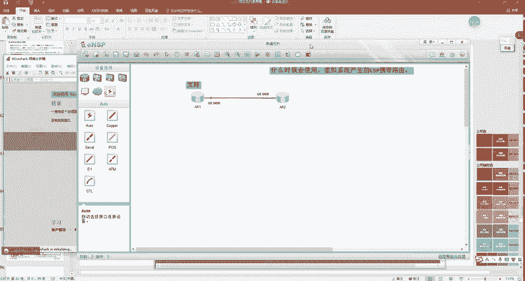

### 工作原理

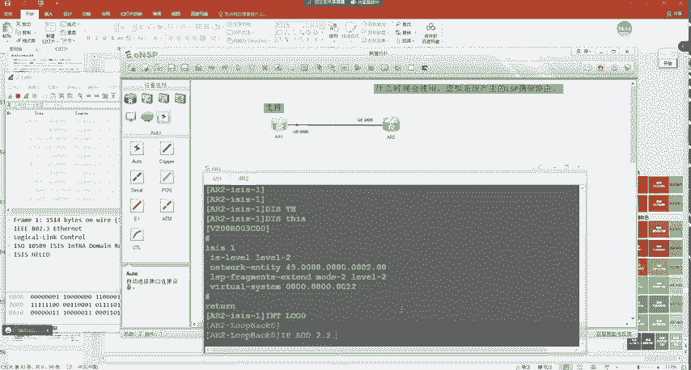

虚拟系统的概念类似于OSPF中的伪节点。在邻居路由器的视角中，每个虚拟系统就像一台独立的路由器。为了保证路由计算的正确性，**初始系统到所有虚拟系统的链路开销默认设置为0**。

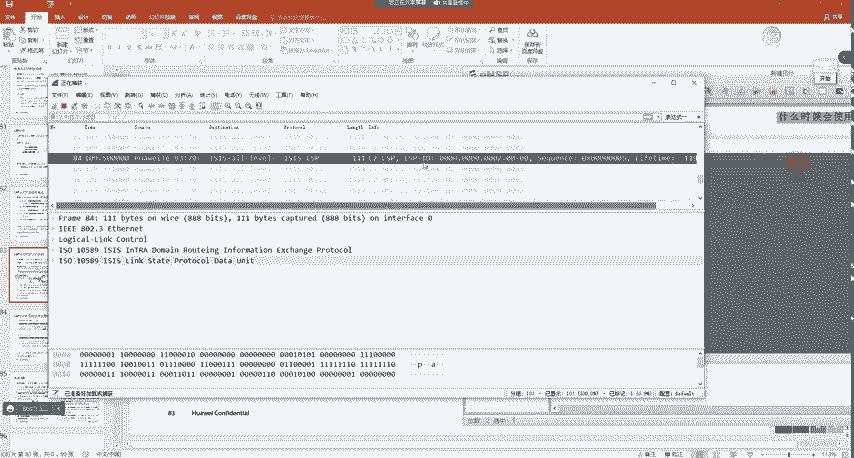

启用LSP分片扩展时，有两种工作模式，适用于不同的网络环境。

以下是两种模式的主要区别：

*   **模式一**：适用于网络中部分路由器**不支持**LSP分片扩展的场景。在此模式下，每个虚拟系统都会生成独立的LSP，并正常描述其邻居关系。不支持该特性的路由器会将这些虚拟系统视为真实的路由器并进行正常的SPF计算。
*   **模式二**：适用于网络中所有路由器都**支持**LSP分片扩展的场景。在此模式下，虚拟系统产生的LSP会携带一个特殊的**TLV 24**，用于声明这些LSP属于哪个初始系统。支持该特性的路由器在计算SPF时，会将所有虚拟系统的LSP信息都归属到其初始系统上，从而简化拓扑视图。

### 配置演示

虽然模拟器环境难以复现LSP分片耗尽并触发扩展的场景，但我们可以了解其配置命令。

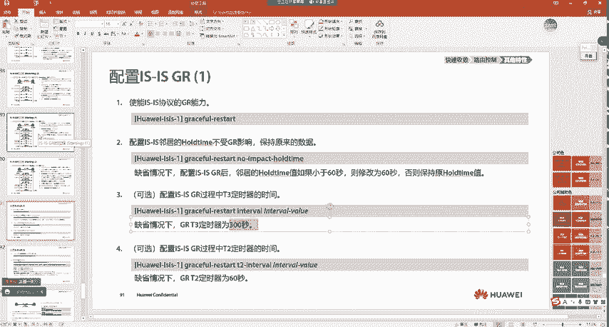

假设路由器R2的LSP分片已满，需要启用分片扩展，我们可以进行如下配置：

```bash
# 进入IS-IS视图
[R2] isis 1
# 为Level-2级别启用LSP分片扩展，并指定模式为模式二
[R2-isis-1] lsp-fragment extend level-2 mode-2
# 创建一个虚拟系统，并为其指定系统ID
[R2-isis-1] virtual-system 0000.0000.0022
```

配置完成后，当初始系统的LSP分片用尽时，新增的路由信息将由虚拟系统生成的LSP来携带。

## IS-IS优雅重启

接下来，我们探讨IS-IS的优雅重启特性。其核心目标与OSPF GR一致：在路由器控制平面重启（如进程重启、主备切换）时，保持数据平面的转发不中断。

### GR相关TLV与定时器

IS-IS GR引入了一个新的**TLV 211**来协助完成重启过程，其格式包含几个关键标志位：
*   **R位**：重启请求位，由重启路由器发出。
*   **I位**：重启应答位，由辅助路由器发出。
*   **SA位**：抑制邻接发布位，用于冷启动场景。

此外，GR过程依赖于三个定时器：
*   **T1定时器**：用于等待邻居对GR请求的确认报文。默认3秒，重传3次。
*   **T2定时器**：用于等待LSDB同步完成。默认60秒。
*   **T3定时器**：整个GR过程的最大等待时间。默认300秒，超时则GR失败。

### 热启动流程

热启动适用于设备不断电、仅IS-IS进程重启或主备切换的场景，其流程如下：

1.  **GR协商**：重启路由器（如R2）向邻居（R1/R3）发送携带**R位**的Hello报文，通知其将要GR重启。邻居回复携带**I位**的Hello报文进行确认。
2.  **进程重启**：R2的IS-IS进程快速重启，但其转发表（FIB）保持不变。
3.  **LSDB同步**：R2重启后，邻居会向其发送CSNP摘要和完整的LSP，以同步链路状态数据库。
4.  **路由计算与收敛**：R2在同步完LSDB后，进行SPF计算，并更新FIB表。整个过程在T3定时器内完成，对外表现为流量无中断。

### 冷启动流程

冷启动适用于设备意外掉电后重新开机的场景，主要解决IS-IS邻居建立先于LSDB同步可能导致的临时流量黑洞问题。

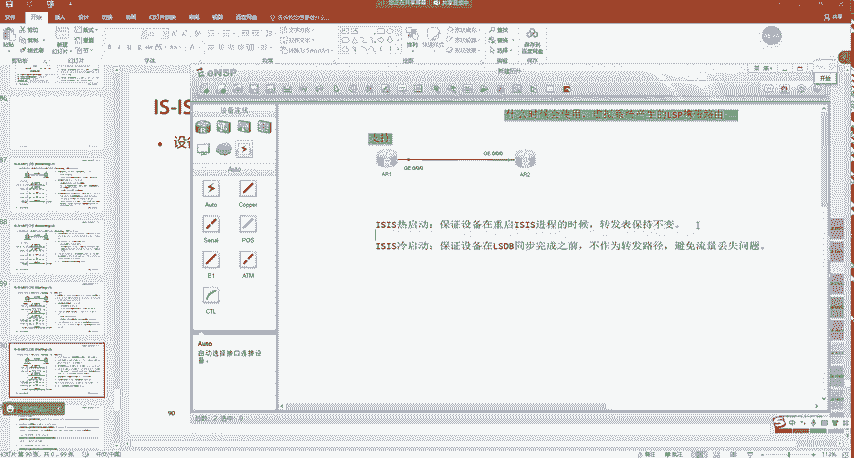


1.  **抑制邻接发布**：重启路由器（R2）上线后，在发送的Hello报文中设置**SA位为1**，请求邻居暂时不要对外发布与自己的邻接关系。
2.  **建立邻居与同步LSDB**：支持GR的邻居（R1/R3）与R2建立邻居关系，但遵循SA位的指示，不对外宣告。随后，双方在“保密”状态下完成LSDB同步。
3.  **恢复邻接发布**：当R2完成LSDB同步和路由计算后，停止发送SA位为1的Hello。邻居此时才对外发布与R2的邻接关系，其他路由器（如R4）随之更新路由。
4.  **避免流量黑洞**：通过此机制，确保了只有当R2完全具备转发能力后，流量才会被引导至R2，避免了同步期间的丢包。

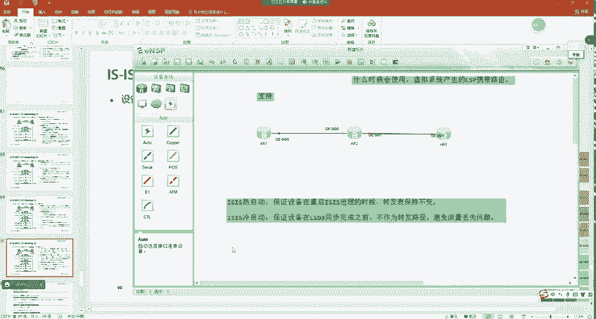

### 热启动实验演示

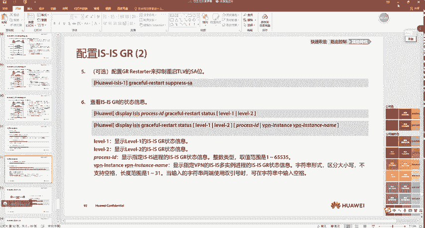

我们可以在设备上配置并验证IS-IS GR热启动的效果。

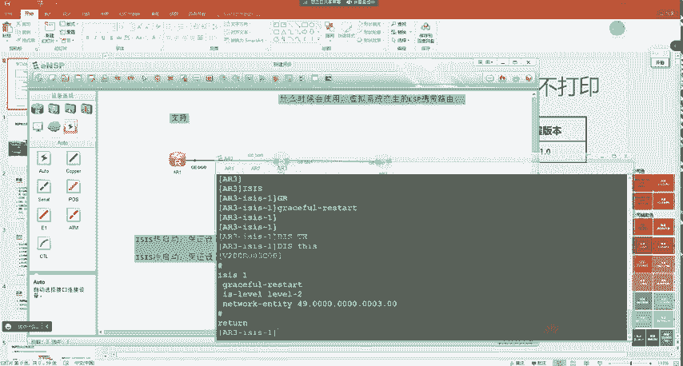

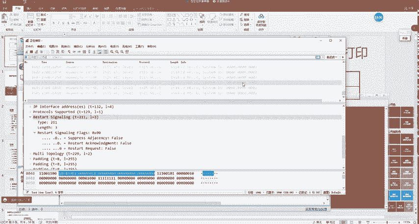

```bash
# 在路由器R1、R2、R3上分别启用IS-IS GR能力
[R1] isis 1
[R1-isis-1] graceful-restart
[R2] isis 1
[R2-isis-1] graceful-restart
[R3] isis 1
[R3-isis-1] graceful-restart
```

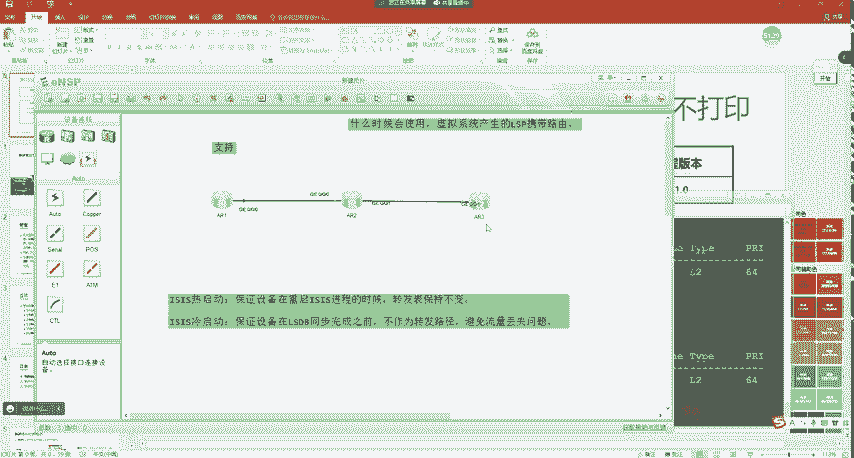

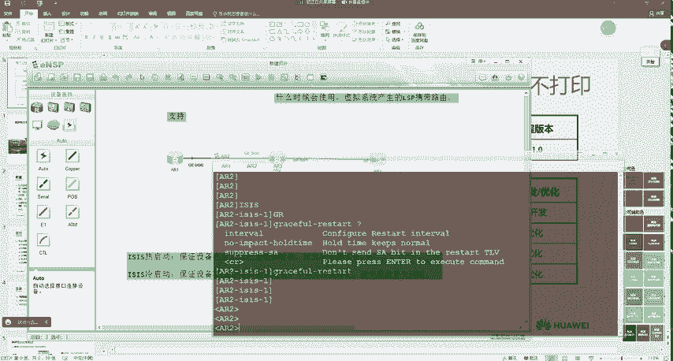

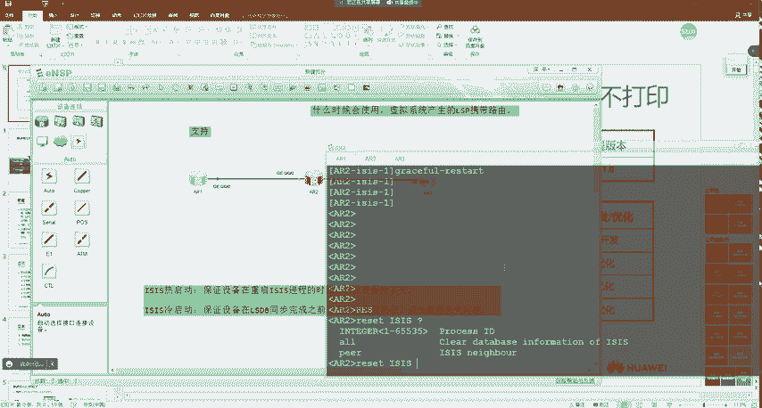

配置完成后，在R1上持续ping测试目标（如3.3.3.3），同时在R2上重启IS-IS进程：


```bash
<R2> reset isis all 1
```

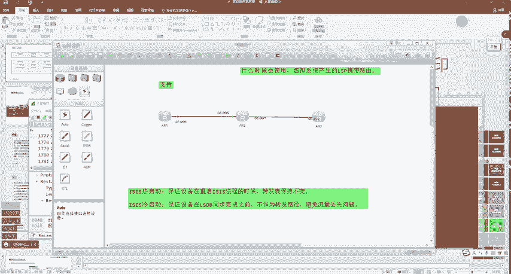

可以观察到，ping流量没有发生任何中断，验证了GR热启动的成功。

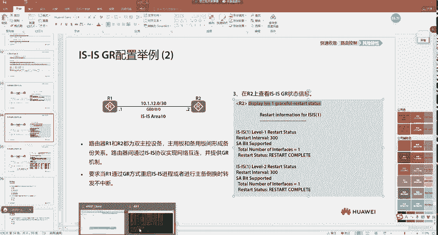

## 总结

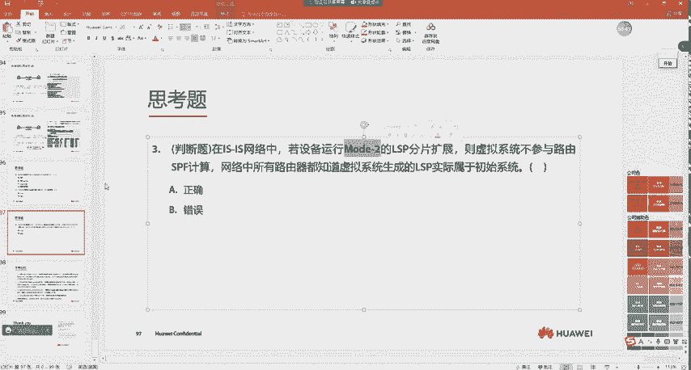

本节课中我们一起学习了IS-IS的两个重要高级特性。
*   **LSP分片扩展**通过创建虚拟系统，极大地提升了单个IS-IS路由器所能通告的路由信息容量，增强了协议的可扩展性。
*   **优雅重启**则保证了网络设备在计划内重启或意外故障恢复时，业务流量的连续性。其中，热启动保障了进程重启时的零丢包，而冷启动机制则巧妙地避免了设备刚上线时因LSDB未同步而产生的流量黑洞问题。

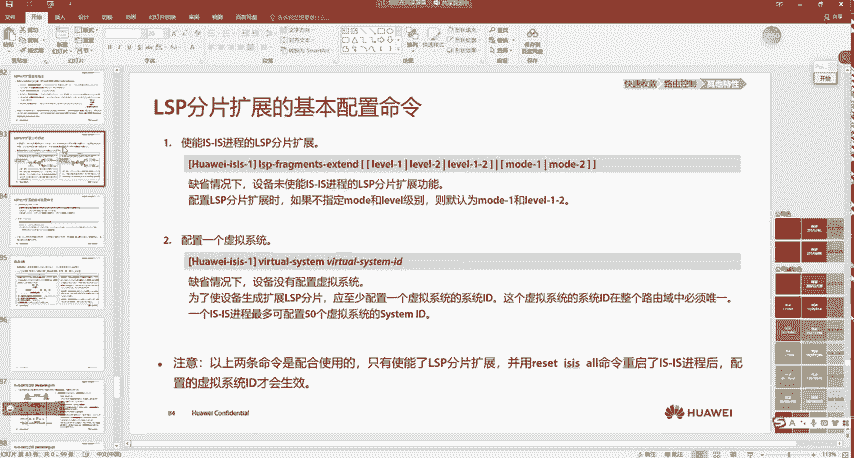

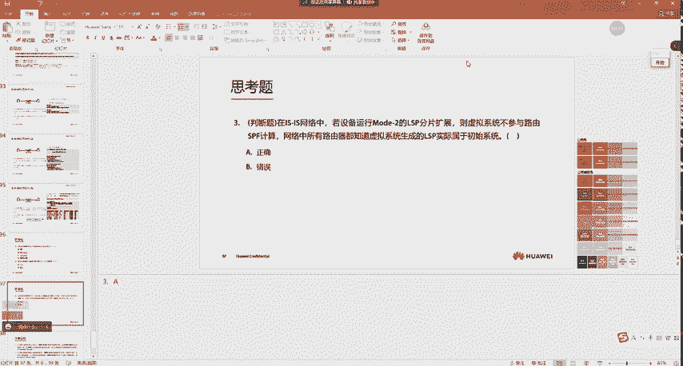

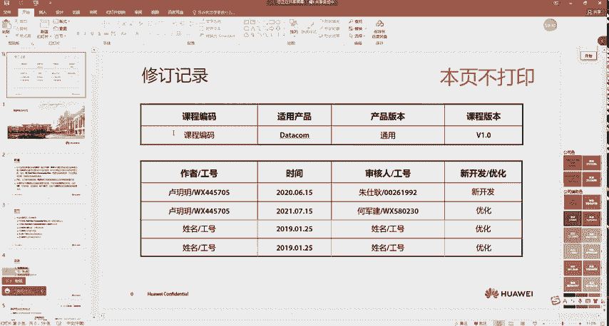

理解并合理应用这些特性，对于设计和维护一个高可靠、可扩展的大型网络至关重要。