# IPv6技术详解：1：IPv6概述、报文结构与地址格式

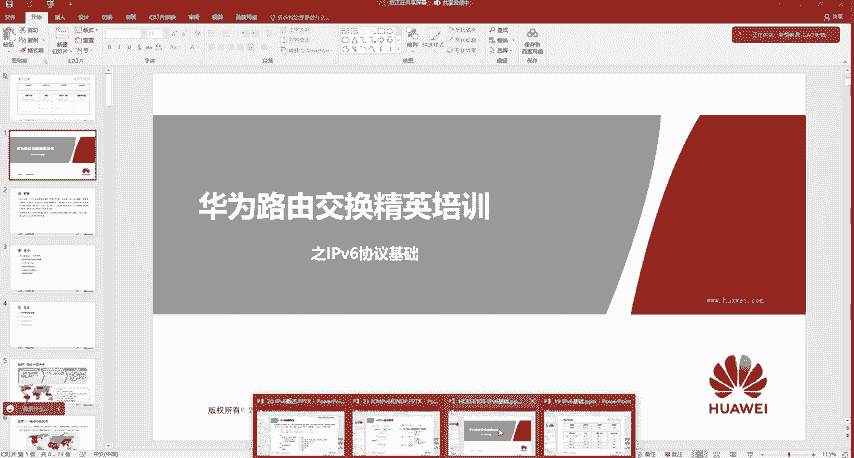

## 概述

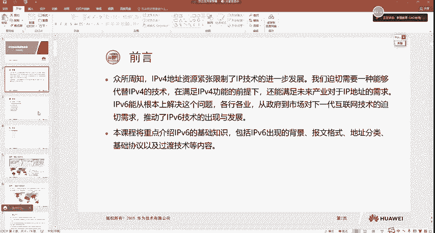

在本节课中，我们将要学习IPv6技术的基础知识。我们将从IPv4的局限性开始，了解为何需要向IPv6过渡，然后详细解析IPv6的报文结构、扩展包头以及其独特的地址格式。通过对比IPv4与IPv6，我们将清晰地看到新一代互联网协议的优势与设计理念。

---

## IPv6的引入背景

上一节我们介绍了课程的整体安排，本节中我们来看看IPv6技术出现的背景。

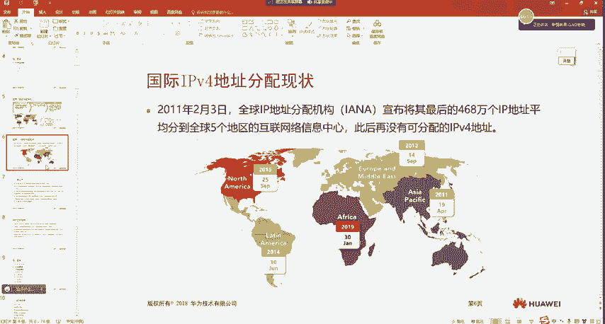

IPv6是一个新的技术点。大家在IA阶段学习IPv4时，可能会觉得子网掩码、子网划分等内容比较绕。IPv6的基本原理与IPv4相似，有IPv4基础的同学学习起来会相对容易。但IPv6地址较长，初期可能不太习惯。

在IPv4中，我们学习的是第一版互联网协议。由于是初次尝试，就像人类第一次登月一样，缺乏经验和技术，对未来的宏观认知不足，因此IPv4在设计上存在一些先天的不足。随着互联网的迅猛发展，超出了最初的预期，IPv4的缺陷逐渐显现。

这些问题主要体现在地址不足上。当IPv4出现缺陷后，我们就像为软件打补丁一样，想办法更新版本，使其功能更加完善。IP协议也是如此，需要不断更新。

在真正理解IPv6之前，需要了解一些基础概念，例如国际IP地址是如何分配的。普通用户向运营商购买地址，运营商则从更上一级的机构获取。

以下是整个IP地址分配的组织架构：
*   **IANA**：互联网号码分配局，是IP地址管理的起点，相当于“董事长”。
*   **RIR**：区域互联网注册管理机构，全球共有五个，根据地理版图分配地址。
*   **ISP**：互联网服务提供商，即运营商。RIR将地址分配给ISP。
*   **机构/用户**：运营商根据内部规划，将地址最终分配给机构或家庭用户。

地址的分配方式是从IANA到RIR，再到运营商，最后到终端用户，是一种层级式的分配。

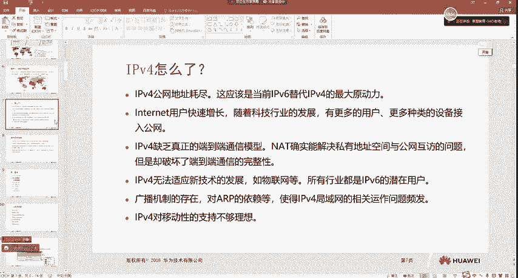

目前，IPv4地址面临的最大问题是已经耗尽。2011年2月3日，IANA将最后468万个地址平均分配给了全球5个RIR，此后便没有新的IPv4地址可分配。互联网仍在快速发展，新的产业如物联网、自动驾驶不断涌现，但作为“基石”的IPv4地址已经用完，这限制了新技术的发展。

因此，从IPv4过渡到IPv6的最大动力，就是公网地址耗尽。这是无法回避的底线问题。

除了地址耗尽，IPv4还存在其他缺陷：
1.  **用户与设备快速增长**：更多用户和种类的设备需要接入公网。
2.  **缺乏真正的端到端模型**：理想的互联网模型是端到端一对一通信。NAT技术虽然解决了私网访问公网的问题，但破坏了端到端通信的完整性，并带来了配置复杂性。
3.  **无法适应新技术**：未来的新兴产业需要更多的地址和更好的协议支持，IPv4难以胜任。
4.  **广播机制的安全隐患**：IPv4依赖ARP协议进行地址解析，而ARP攻击频发，导致局域网运作问题。
5.  **对移动性支持不足**：主要涉及移动基站等领域。

针对这些缺陷，早期也提出过一些临时应对措施，例如在1991年推出公网/私网地址划分，1993年推出NAT。但这些都只是过渡方案，只能减缓地址枯竭的速度，无法从根本上解决问题。

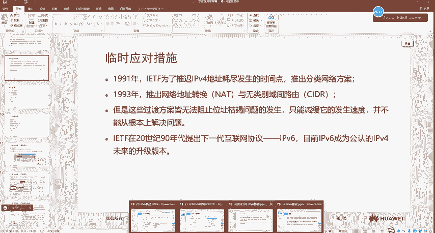

IPv6在20世纪90年代就被提出，作为IPv4的升级版本。其大规模部署需要时间，就像新技术的普及一样，需要逐步过渡。

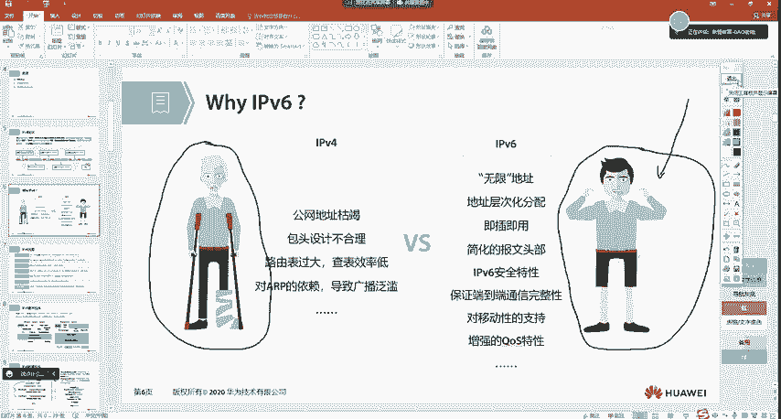

截至2011年至2019年，全球各大RIR已相继宣布IPv4地址分配完毕。IPv6取代IPv4已成必然趋势。

---

## IPv6的优势

上一节我们探讨了IPv4的诸多缺陷，本节中我们来看看IPv6带来了哪些优势。

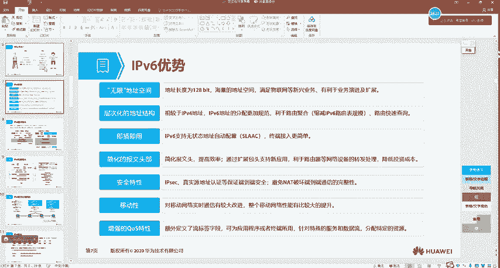

相较于“年迈”的IPv4，IPv6就像一个“年轻健壮的小伙子”，拥有显著的优势：

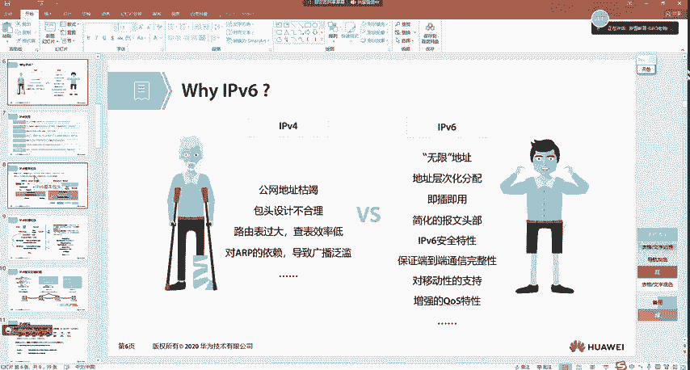

1.  **近乎无限的地址空间**：地址长度为128比特，提供了海量的地址空间，足以满足未来所有新兴业务的需求。其地址数量之多，甚至超过了绝大多数人对数学单位的认知。
2.  **层次化的地址结构**：地址分配更加规范，有利于路由聚合，从而缩小路由表规模，提高查询效率。
3.  **即插即用**：支持无状态地址自动配置，设备接入网络后可自动获得地址，无需DHCP服务器，特别适合物联网场景。
4.  **简化的报文头部**：固定40字节的基本包头，提高了处理效率。
5.  **更高的安全性**：原生支持IPsec等安全功能。
6.  **更好的移动性支持**：优化了对移动设备的支持。
7.  **增强的QoS能力**：通过流标签字段，可以基于流进行服务质量保障。

---

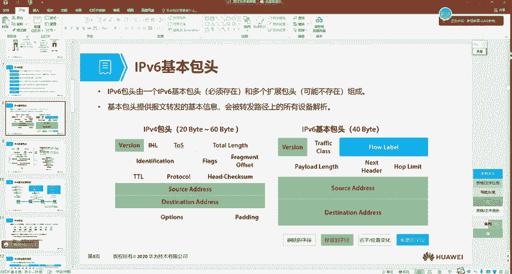

## IPv6报文结构

上一节我们了解了IPv6的整体优势，本节中我们来深入剖析其报文结构。

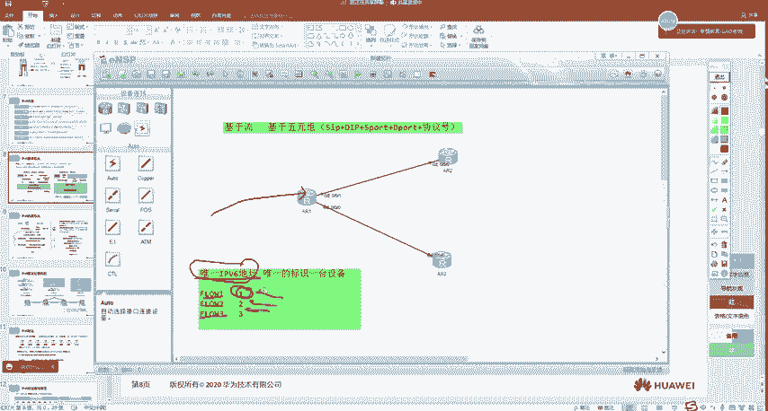

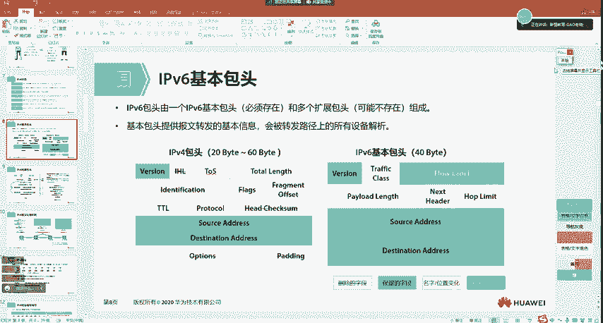

我们将IPv6与IPv4的包头进行对比，可以清晰地看到其设计上的优化。

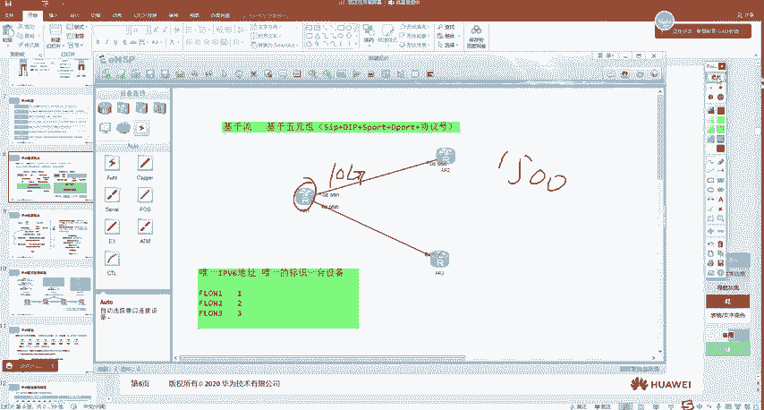

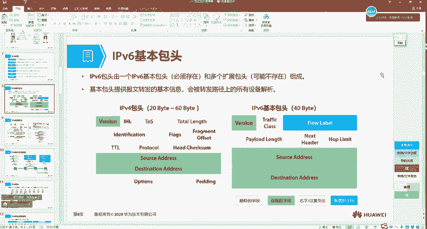

**保留或语义更明确的字段**：
*   **版本**：IPv4为4，IPv6为6。
*   **源/目的地址**：IPv6为128比特，IPv4为32比特。
*   **上层协议**：IPv4的“协议”字段，在IPv6中称为“下一个包头”，语义更明确。
*   **服务类型**：IPv4的TOS字段，在IPv6中称为“流类别”。
*   **生存时间**：IPv4的TTL字段，在IPv6中称为“跳数限制”，直接表明报文能经过多少跳。

**新增字段**：
*   **流标签**：用于标识特定流，使路由器可以基于“源IP+流标签”快速识别流，而无需深入解析传输层，大幅提高了转发效率，便于实施基于流的QoS。

**删除的字段**：
*   **包头长度**：因为IPv6基本包头固定为40字节，无可变选项，故无需此字段。
*   **分片相关字段**：包括标识、标志、片偏移。这些功能被移至可选的“扩展包头”中，当报文无需分片时，不携带这些信息，提高了效率。
*   **首部校验和**：因为二层和四层协议已有校验机制，此字段在IPv4中就较为鸡肋，IPv6将其删除以使包头更精简。

综上所述，IPv6的基本包头更加精简、高效，语义也更明确。

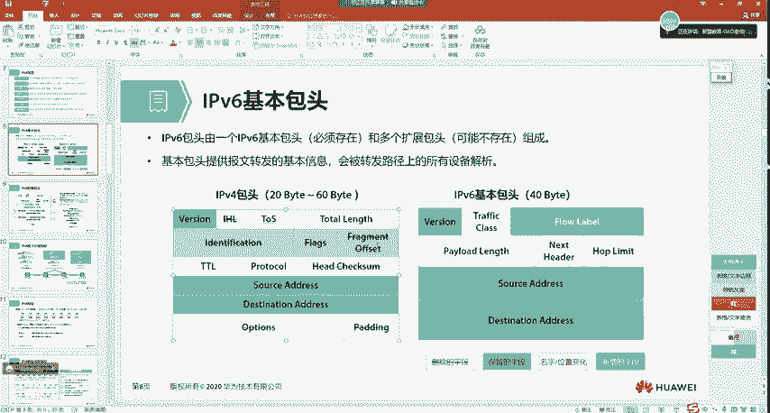

---

## IPv6扩展包头

上一节我们介绍了高效的IPv6基本包头，本节中我们来看看如何通过扩展包头实现更多功能。

IPv6的扩展包头用于实现IPv4中“可选项”的功能，其特点是“按需携带”，即需要实现特定功能时才添加对应的扩展包头。

扩展包头采用链状结构组织。基本包头的“下一个包头”字段指向第一个扩展包头，而每个扩展包头也包含“下一个包头”字段，可以指向下一个扩展包头或上层协议。

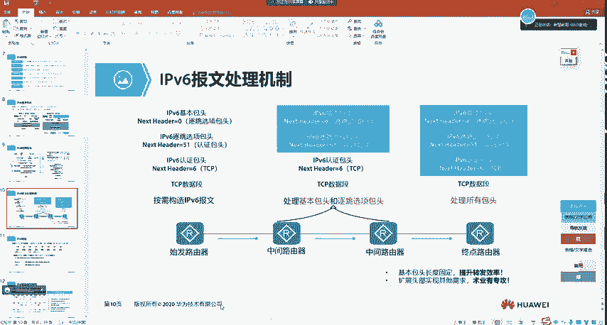

每个扩展包头通常包含三个部分：
1.  **下一个包头**：指示紧随其后的内容。
2.  **扩展包头长度**：描述本扩展包头的长度。
3.  **扩展包头数据**：携带具体的功能数据。

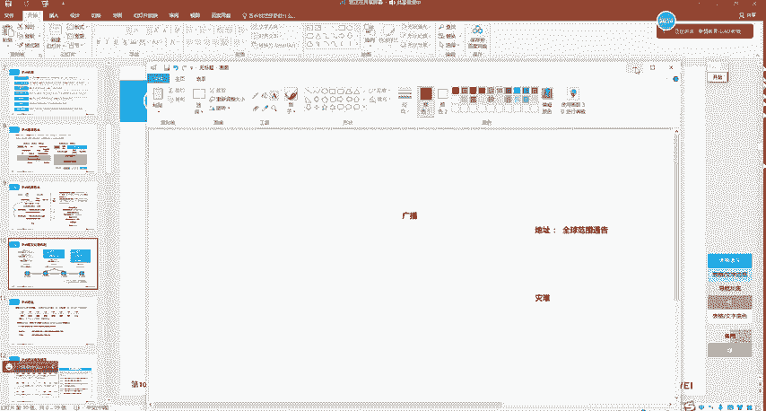

以下是常见的扩展包头类型，它们必须按照以下顺序出现：
1.  **逐跳选项包头**：路径上的每一跳路由器都需要处理的信息，用于资源预留等。
2.  **目的选项包头**：携带仅需目的节点处理的信息。
3.  **路由包头**：指定报文的转发路径。
4.  **分段包头**：当报文需要分片时使用。
5.  **认证包头**：用于IPsec认证。
6.  **封装安全载荷包头**：用于IPsec加密。

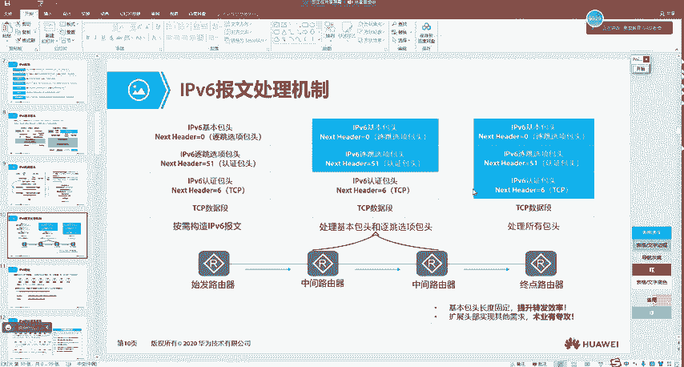

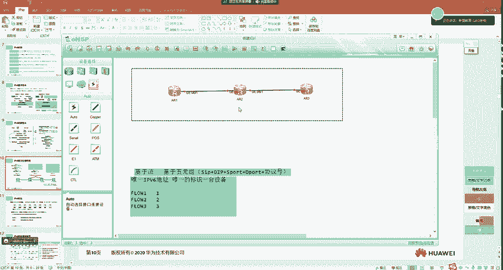

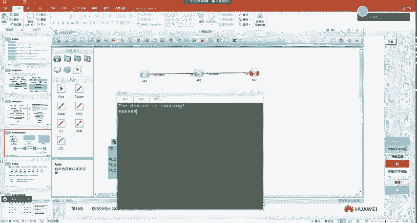

这种设计实现了“术业有专攻”。普通转发只需基本包头，高速高效；需要额外功能时，再添加对应的扩展包头。

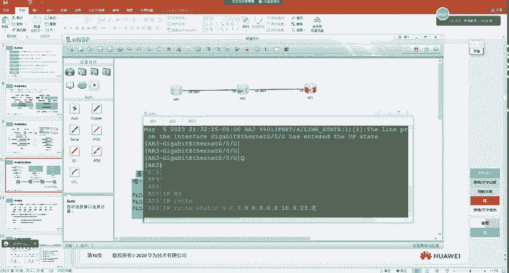

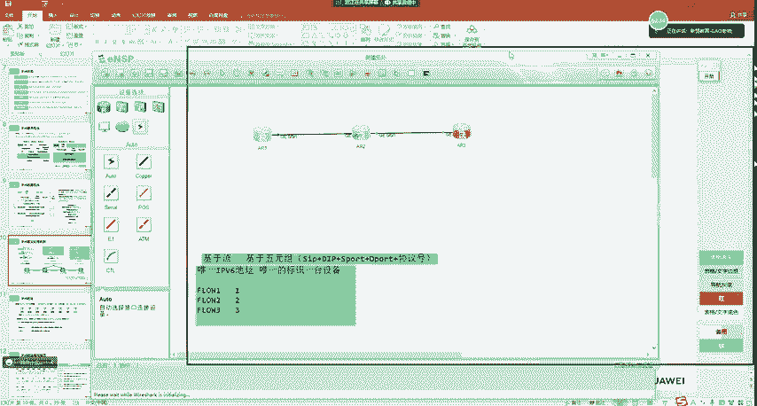

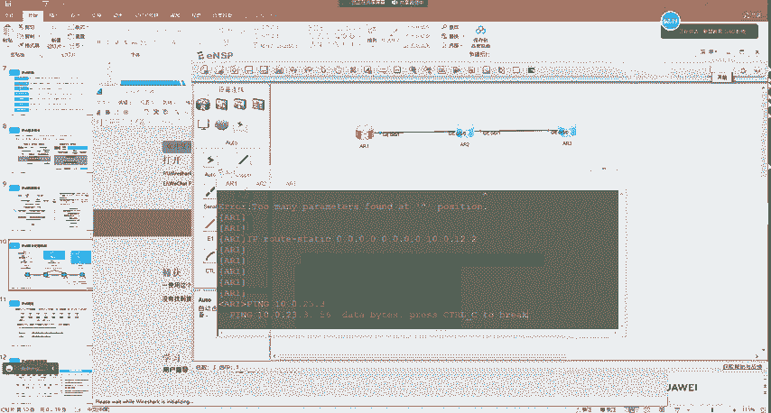

---

## IPv6地址格式

上一节我们学习了IPv6的报文封装，本节中我们来看看IPv6地址独特的表示方法。

IPv6地址长度为128比特。为了便于书写和阅读，采用冒号十六进制表示法：
*   地址被冒号分割为8段。
*   每段16比特，用4个十六进制数表示。

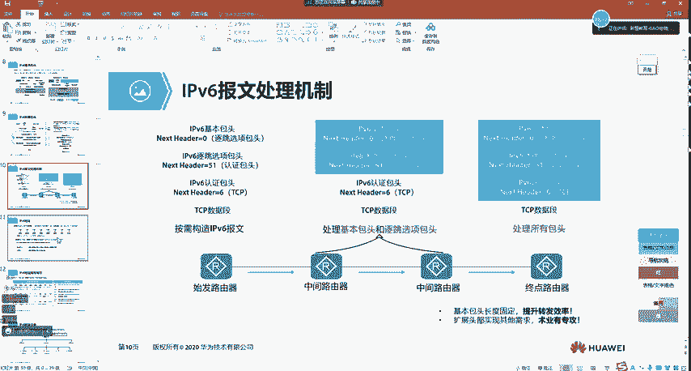

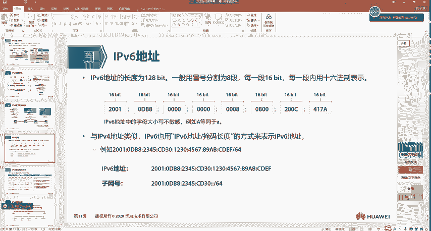

例如：`2001:0DB8:0000:0000:0000:0000:0000:0001`

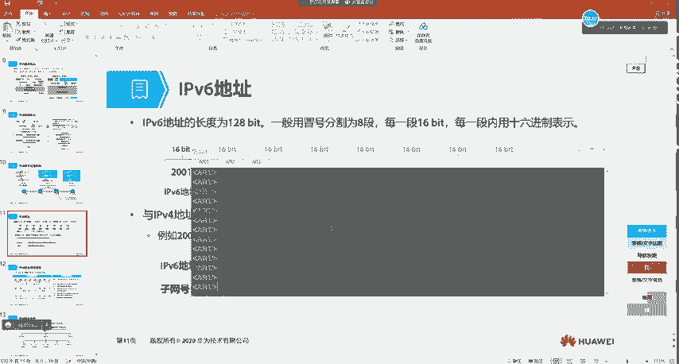

为了进一步简化，IPv6地址支持缩写：

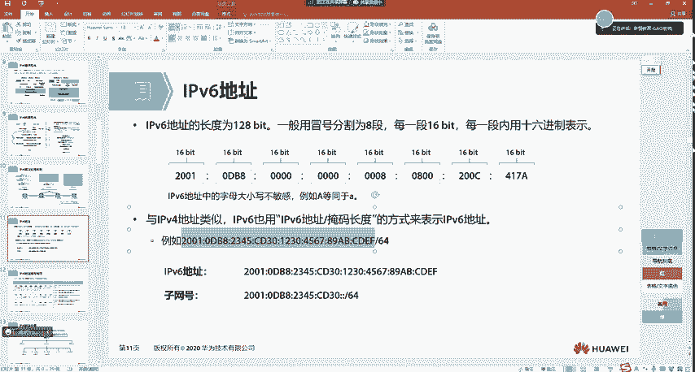

**缩写规则**：
1.  每段中前导的零可以省略。
    *   例如，`0DB8` 可缩写为 `DB8`。
2.  如果一整段都为0，可以缩写为一个0。
3.  **一个或多个连续的全0段**，可以用双冒号 `::` 代替。**注意：一个地址中只能使用一次双冒号**。

**缩写示例**：
原始地址：`2001:0DB8:0000:0000:0000:0000:0000:0001`
1.  省略前导零：`2001:DB8:0:0:0:0:0:1`
2.  压缩连续全0段：`2001:DB8::1`

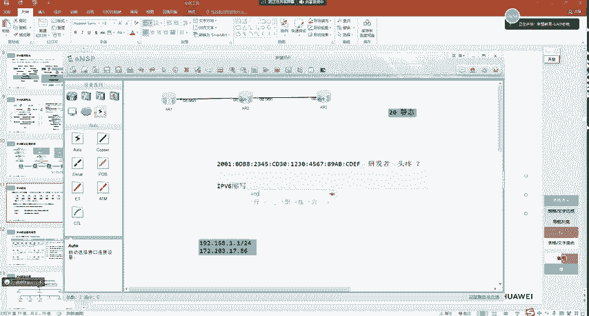

**缩写冲突处理**：
当存在多处连续全0段时，压缩规则是：
*   **首先**，压缩最长的一段。
*   **如果长度相同**，则压缩靠前（高位）的一段。

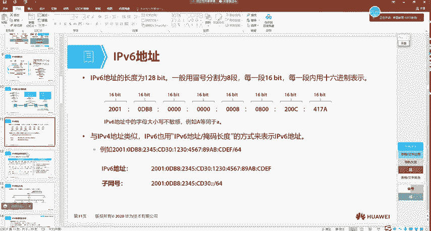

**配置示例**：
在接口上配置IPv6地址非常简单：
1.  系统视图下开启IPv6功能：`ipv6`
2.  接口视图下启用IPv6：`ipv6 enable`
3.  配置IPv6地址：`ipv6 address 2001:db8::1/64`

IPv6使用前缀长度表示法（如`/64`）作为子网掩码，其子网划分原理与IPv4相同。

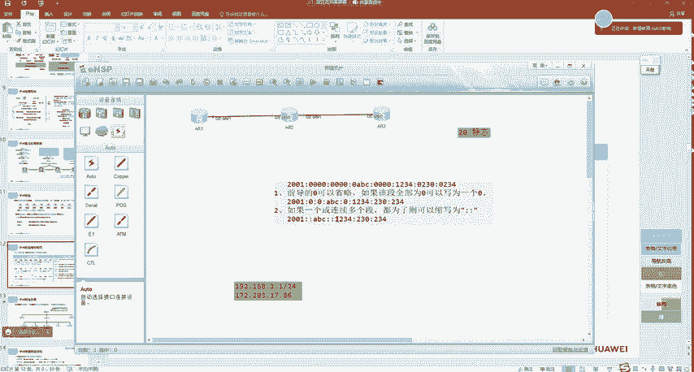

---

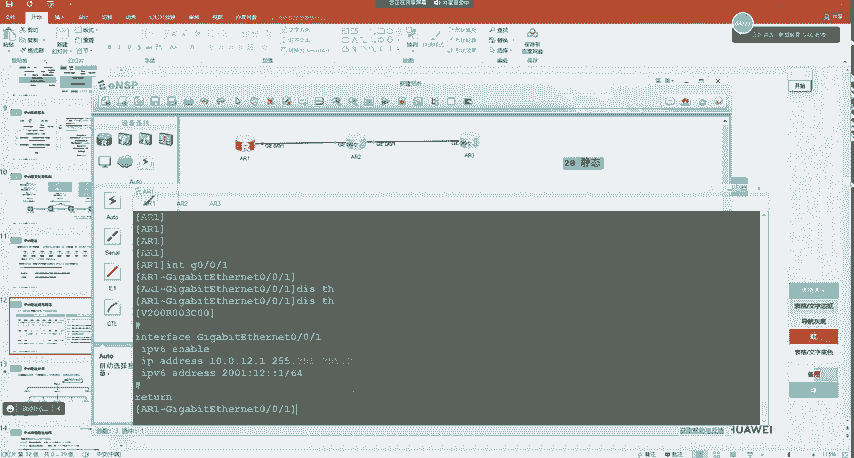

## 总结

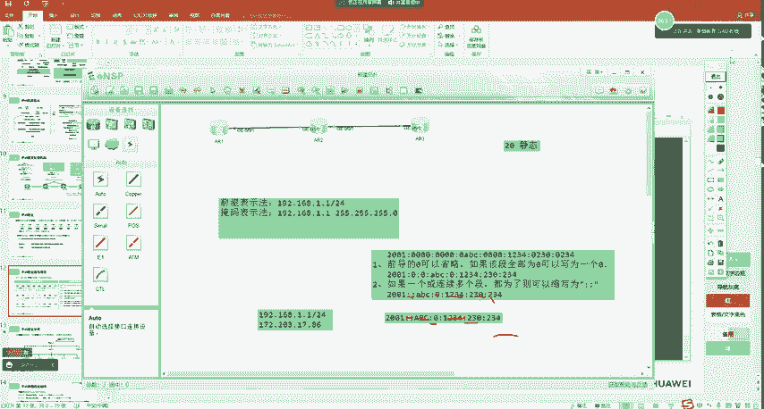

本节课中，我们一起学习了IPv6技术的基础核心内容。

我们首先回顾了IPv4的局限性，特别是地址耗尽问题，理解了向IPv6过渡的必要性。接着，我们探讨了IPv6的诸多优势，如巨大的地址空间、简化的报头和更高的效率。

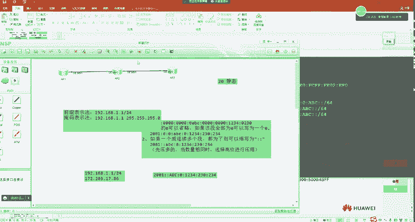

然后，我们深入分析了IPv6的报文结构，对比了其与IPv4包头的异同，并理解了新增的“流标签”和“扩展包头”机制如何提升网络性能和灵活性。

最后，我们掌握了IPv6地址的冒号十六进制表示法及其缩写规则，这是使用和配置IPv6的基础。

通过本节课的学习，我们已经对IPv6有了一个全面的初步认识，为后续学习IPv6地址分类、路由协议等更深入的内容打下了坚实的基础。