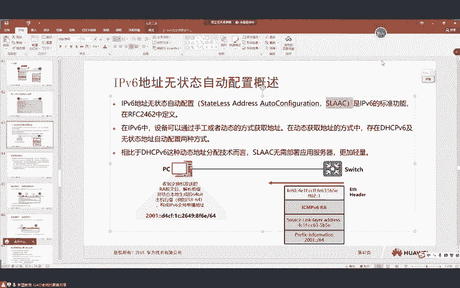
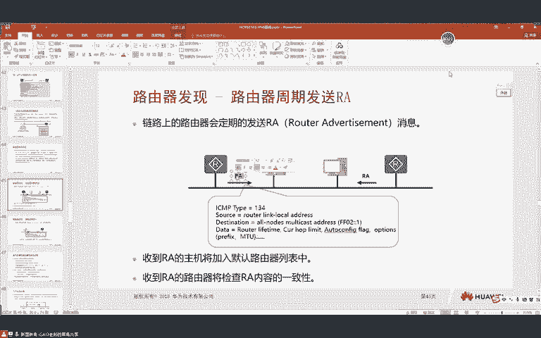

# IPv6 技术详解：P107：IPv6，DAD，地址冲突检测

## 概述

在本节课中，我们将深入学习 IPv6 协议中的几个核心概念，包括任播地址、ICMPv6 协议、邻居发现协议、地址解析、邻居状态跟踪以及重复地址检测。这些内容是理解 IPv6 网络通信和地址管理机制的基础。

---

## IPv6 任播地址

上一节我们介绍了 IPv6 的各种地址类型，本节中我们来看看一种特殊的地址应用——任播地址。

任播与其说是一种地址类型，不如说是一种网络应用模式。它的设计初衷是为了解决早期互联网中，用户访问远端服务器延迟高的问题。例如，一个网站在全球多个地区部署了内容相同的服务器，希望用户能自动访问距离最近的那一台，以提升访问速度。

在 IPv4 时代，为了实现类似效果，需要在不同地区部署不同 IP 地址的服务器，并通过复杂的 DNS 解析策略将用户引导到最近的服务器。而在 IPv6 中，任播地址被明确定义：**多台位于不同地理位置的服务器可以配置相同的 IPv6 任播地址**。

以下是其工作流程：
1.  用户访问一个域名。
2.  DNS 服务器将该域名解析到那个唯一的任播地址。
3.  用户的设备将数据包发送给该任播地址。
4.  网络中的路由器根据路由协议（如 OSPFv3）计算出到达该任播地址的最短路径，将数据包转发给离用户最近的那台配置了该任播地址的服务器。

**核心特点与命令**：
*   **地址空间**：任播地址使用单播地址空间，在配置时通过特定命令声明其为任播地址。
*   **无冲突检测**：配置任播地址时，不进行 DAD 检测。
*   **配置示例**（在路由器接口上，实际多用于服务器）：
    ```bash
    interface GigabitEthernet0/0/0
      ipv6 address 2001:db8::1 64 anycast
    ```

**过渡说明**：任播地址主要用于优化服务访问，在网络设备配置中不常见。接下来，我们将探讨 IPv6 中用于网络控制和诊断的重要协议——ICMPv6。

---

## ICMPv6 协议

ICMPv6 是 IPv6 版的互联网控制报文协议，它封装在 IPv6 数据包内，其下一个报头字段值为 **58**。

ICMPv6 报文主要分为两大类：
1.  **差错报文**：用于报告转发数据包时出现的错误，如目的不可达、超时、参数错误等。
2.  **信息报文**：用于网络诊断和功能交互，如我们熟悉的 `ping` 命令（回送请求和回送应答）。

**差错报文类型与代码示例**：
*   **Type=1**: 目的不可达
    *   **Code=0**: 无路由到达目的地
    *   **Code=1**: 因管理策略禁止通信
    *   **Code=3**: 地址不可达
    *   **Code=4**: 端口不可达
*   **Type=3**: 超时
    *   **Code=0**: 传输中超过跳数限制
    *   **Code=1**: 分片重组超时
*   **Type=4**: 参数错误

**过渡说明**：ICMPv6 不仅是诊断工具，更是 IPv6 许多核心功能的载体。其中最重要的就是邻居发现协议。

---

## 邻居发现协议

邻居发现协议是 IPv6 协议栈的核心组件之一，它没有自己独立的报文格式，而是**借用 ICMPv6 的报文**来实现多种功能。

NDP 实现的功能包括：
*   地址解析（替代 ARP）
*   路由器发现
*   无状态地址自动配置
*   重复地址检测
*   邻居状态跟踪
*   前缀重新编址
*   路由重定向

NDP 主要使用四种 ICMPv6 报文：
*   **路由器请求**：Type=133
*   **路由器通告**：Type=134
*   **邻居请求**：Type=135
*   **邻居通告**：Type=136

**过渡说明**：了解了 NDP 的概貌后，我们首先深入看看它如何实现地址解析，这是设备间通信的第一步。

---

## IPv6 地址解析

地址解析是指已知目标设备的 IPv6 地址，获取其链路层地址（如 MAC 地址）的过程。IPv6 使用 NDP 的 **NS** 和 **NA** 报文完成此功能，替代了 IPv4 中的 ARP。

**工作流程**：
1.  主机 A 需要与主机 B 通信，已知 B 的 IPv6 地址。
2.  A 向 B 的**被请求节点组播地址**发送一个 **NS** 报文。该报文源 IP 是 A 的地址，目的 IP 是 B 对应的被请求节点组播地址，报文内包含 A 的 MAC 地址并询问“谁的 IP 是 B 的地址？”。
3.  主机 B 收到发往自己监听组播地址的 NS 报文后，向 A 回复一个 **NA** 报文（单播）。该报文包含 B 的 MAC 地址，宣告“B 的 IP 地址对应的 MAC 地址是我”。
4.  主机 A 收到 NA 后，即获得了 B 的 MAC 地址，可进行二层封装。

**与 IPv4 ARP 对比的优势**：
1.  **基于三层**：使用 ICMPv6 报文，独立于二层链路类型，通用性更强。
2.  **使用组播**：NS 发往被请求节点组播地址，而非广播，减少了对链路上其他主机的干扰。
3.  **安全性提升**：由于使用组播且基于三层，更容易与 IPsec 等安全机制结合，减少“ARP 欺骗”类攻击。

**过渡说明**：成功解析地址后，设备会生成一个邻居缓存表项。IPv6 对这个表项的状态管理比 IPv4 的 ARP 表更为精细和智能。

---

## 邻居状态跟踪

IPv6 邻居表记录了邻居的 IP 地址、MAC 地址、出接口及其**状态**。状态机机制确保了邻居的可达性得到动态维护。

邻居状态迁移过程如下：

1.  **INCOMPLETE**：地址解析进行中。设备发送了 NS 请求，但尚未收到 NA 应答。
2.  **REACHABLE**：可达状态。收到了 NA 应答，确认邻居可达。此状态默认持续 **30 秒**。
3.  **STALE**：陈旧状态。REACHABLE 状态超时（30秒内无流量触发刷新）后进入。此状态表示“不确定邻居是否可达”，但表项仍保留。
4.  **DELAY**：延迟状态。当需要向处于 STALE 状态的邻居发送数据时，不会立即使用旧 MAC 地址，而是先进入 DELAY 状态（持续5秒），并同时发送新的 NS 请求。
    *   这5秒是给上层协议（如 TCP 握手成功）一个机会来证明邻居仍然可达。
5.  **PROBE**：探测状态。如果 DELAY 状态超时仍未收到 NA 或上层确认，则进入 PROBE 状态。此时会每隔1秒重传 NS，最多发送3次。
    *   如果收到 NA，则状态回到 REACHABLE。
    *   如果3次后均无应答，则删除该邻居表项。

这种机制有效避免了 IPv4 中 ARP 表项长期无效但仍被使用的问题，能更快地感知拓扑变化，清理无效条目。

**过渡说明**：在设备使用一个地址前，无论是手动配置还是自动获取，都必须确保该地址在网络中是唯一的。这就是 DAD 要完成的任务。

---

## 重复地址检测




重复地址检测用于确保一个单播 IPv6 地址在链路上是唯一的。**任播地址不需要进行 DAD**。




**DAD 过程**：
1.  当接口配置了一个新的单播 IPv6 地址后，该地址首先处于 **“试验”** 状态，暂不可用于通信。
2.  接口会立刻向这个“试验地址”对应的**被请求节点组播地址**发送一个 **NS** 报文。
    *   该 NS 报文的**源 IP 地址是未指定地址 `::`**。
    *   目标地址是“试验地址”的被请求节点组播地址。
    *   报文内容询问：“谁在使用这个‘试验地址’？”
3.  如果在指定时间内（通常为1秒），**没有收到任何 NA 应答**，则认为该地址在链路上唯一，地址状态变为“首选”，可以正常使用。
4.  如果**收到了 NA 应答**，则说明该地址已被其他设备使用。配置该地址的设备会将其标记为“重复”，该地址将无法用于通信。

**实验现象**：
当尝试配置一个已存在的地址时，使用 `display ipv6 interface` 命令可以看到该地址后标记为 `DUPLICATE`。

**过渡说明**：DAD 保证了地址本地唯一性。而 IPv6 地址的自动获取，则通过一种称为无状态地址自动配置的机制来实现，它同样依赖于我们之前提到的 NDP 报文。

---

## 无状态地址自动配置

无状态地址自动配置允许主机仅根据网络中的路由通告信息，自动生成全局 IPv6 地址，无需 DHCP 服务器。

**工作流程**：
1.  **路由器周期性地**向 `FF02::1`（所有节点组播地址）发送 **RA** 报文，或在收到主机的 **RS** 请求后立即回应 RA。
2.  **RA 报文中携带网络前缀信息**（例如 `2001:db8::/64`）以及其他标志位（如 M, O, A 标志）。
3.  主机收到 RA 后，如果其中的 **A** 标志位为 1，则使用该前缀结合 **EUI-64** 算法生成接口标识符，组合形成完整的 128 位 IPv6 地址。
4.  主机可以为该地址自动生成一条默认路由，指向发送 RA 的路由器链路本地地址。

**关键配置命令**：
*   **在路由器上启用 RA 通告**（默认抑制）：
    ```bash
    interface GigabitEthernet0/0/0
      undo ipv6 nd ra halt
    ```
*   **配置 RA 参数**：
    ```bash
    interface GigabitEthernet0/0/0
      ipv6 nd ra interval min 100 max 200  # 设置RA发送间隔
      ipv6 nd ra prefix 2001:db8::/64 3600 3600 no-autoconfig # 通告前缀但不允许自动配置
    ```
*   **在主机上启用自动配置**：
    ```bash
    interface GigabitEthernet0/0/0
      ipv6 address auto global  # 仅获取地址
      ipv6 address auto global default-route  # 获取地址和默认路由
    ```

**SLAAC 与 DHCPv6**：
*   **SLAAC**：无状态，路由器不记录主机信息。适用于物联网等大量简单设备接入的场景。
*   **DHCPv6**：有状态，服务器分配并记录地址。适用于需要精确管理地址的企业网。

---

## 总结

本节课中我们一起学习了 IPv6 的多个核心机制：
1.  **任播地址**：一种服务部署模式，实现流量就近访问。
2.  **ICMPv6**：IPv6 的控制与诊断协议，也是 NDP 的载体。
3.  **邻居发现协议**：IPv6 的核心，实现了地址解析、路由器发现、地址自动配置等关键功能。
4.  **地址解析**：使用 NS/NA 报文，基于组播，更高效安全地获取邻居 MAC 地址。
5.  **邻居状态跟踪**：通过精细的状态机（INCOMPLETE、REACHABLE、STALE、DELAY、PROBE）动态维护邻居可达性。
6.  **重复地址检测**：在地址使用前，通过发送 NS 报文检测地址冲突，保证地址唯一性。
7.  **无状态地址自动配置**：主机根据路由器通告的 RA 报文，自动生成 IPv6 地址和默认路由。


这些机制共同构成了 IPv6 即插即用、高效可靠的基础网络能力。