# IPv6技术详解：第54讲：SLAAC与IPv6手工隧道

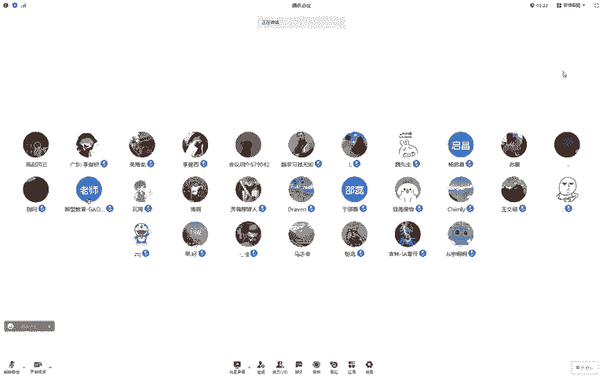


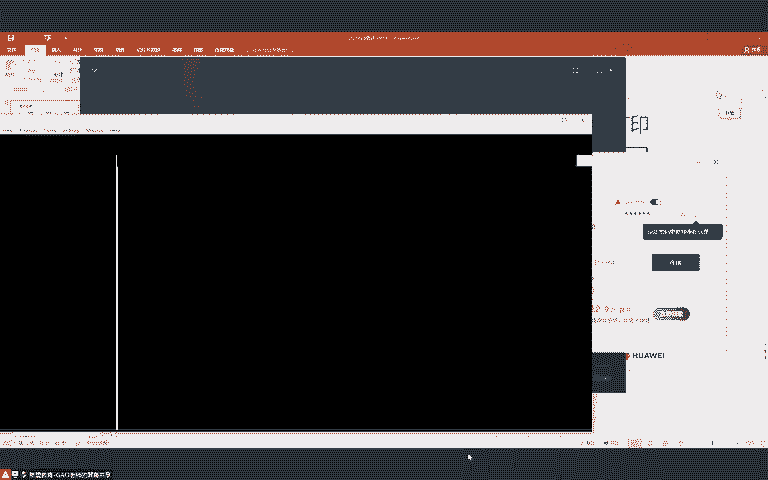

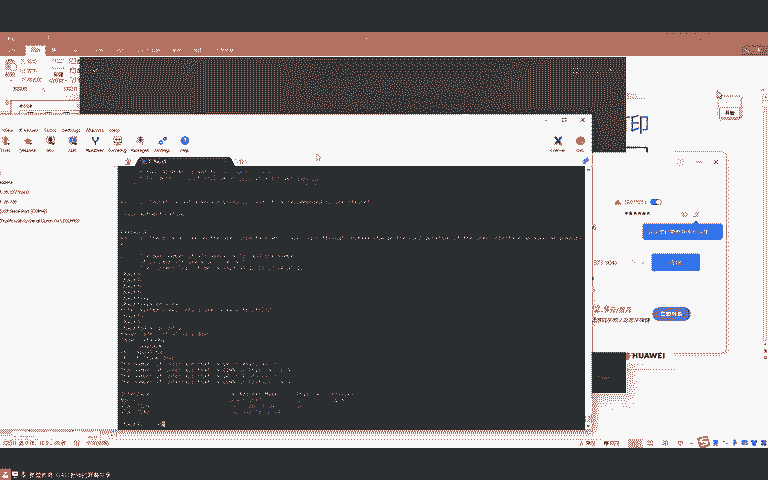

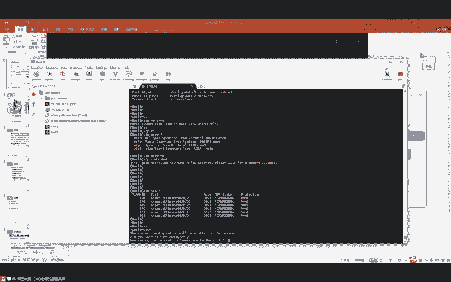

## 概述

在本节课中，我们将深入学习IPv6的两个重要技术：无状态地址自动配置（SLAAC）的进阶机制，以及IPv6与IPv4网络共存的过渡技术——手工隧道。我们将详细探讨IPv6地址的生命周期、RA报文中的关键标志位，并动手配置两种主要的手工隧道（6to4和GRE隧道），以实现IPv6网络跨越IPv4骨干网的通信。

---

## IPv6地址生命周期与RA报文详解

上一节我们介绍了SLAAC的基本机制，即主机如何通过路由器通告（RA）报文自动配置IPv6地址。本节中，我们来看看IPv6地址配置中更精细的控制机制——地址的生命周期管理。

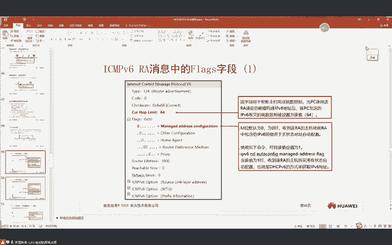

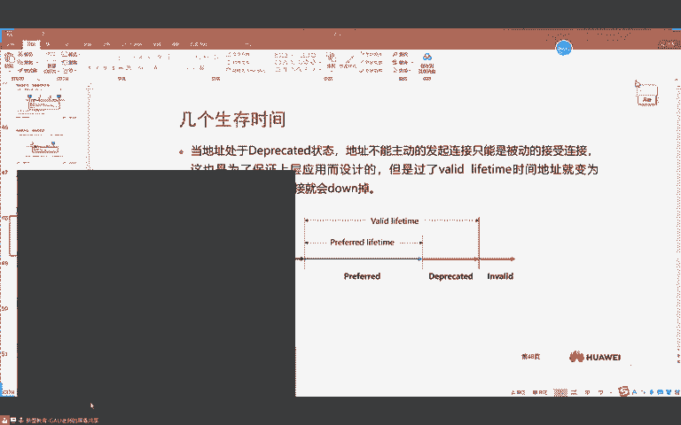

一个IPv6地址会经历几个阶段，类似于人的一生：
*   **试验地址（Tentative Address）**：在完成重复地址检测（DAD）之前，地址处于此状态。
*   **优选地址（Preferred Address）**：通过DAD后，地址进入“优选”阶段。此阶段由 **优选生存期（Preferred Lifetime）** 定义。
*   **不建议使用地址（Deprecated Address）**：超过优选生存期后，地址进入“不建议使用”阶段，直到 **有效生存期（Valid Lifetime）** 结束。
*   **无效地址（Invalid Address）**：超过有效生存期后，地址失效。

**公式/概念**：
*   `有效生存期`：地址可用的总时长，默认 **30天**。
*   `优选生存期`：地址处于“优选”状态的时间，默认 **7天**。
*   `不建议使用期 = 有效生存期 - 优选生存期`

这些时间值由路由器在RA报文中携带，并通告给主机。它们的主要作用是实现地址的 **平滑切换**。例如，当服务器需要更换IPv6地址时，可以先将新地址引入（优选期），让新连接使用新地址，而旧地址进入“不建议使用期”以维持已有的TCP连接，直到所有旧连接自然结束。这样可以在不中断业务的情况下完成地址迁移。

---

## RA报文中的关键标志位

除了生存期，RA报文还包含几个重要的标志位，用于指导主机如何配置地址及其他网络参数。

以下是RA报文中用于地址配置的关键标记位（A, M, O）及其常见组合含义：

| A位 (Autoconfig) | M位 (Managed) | O位 (Other) | 配置含义 |
| :--- | :--- | :--- | :--- |
| 1 | 0 | 0 | **仅使用SLAAC**配置IPv6地址。不获取DNS等信息。 |
| 1 | 0 | 1 | **使用SLAAC配置IPv6地址**，同时**使用无状态DHCPv6**获取DNS等其他参数。 |
| 0 | 1 | 0 | **仅使用有状态DHCPv6**配置IPv6地址和DNS等所有参数。 |
| 0 | 1 | 1 | **使用有状态DHCPv6**配置地址和参数（O位通常被忽略）。 |

**注意**：这些标志位对主机而言通常是“建议”，某些操作系统（如Windows）可以通过命令忽略这些建议。

---

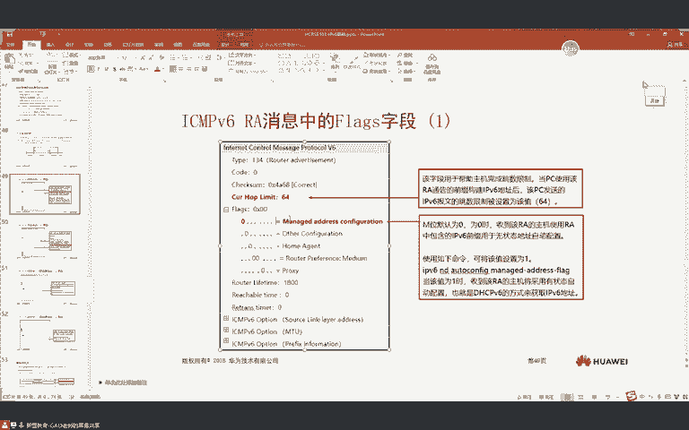

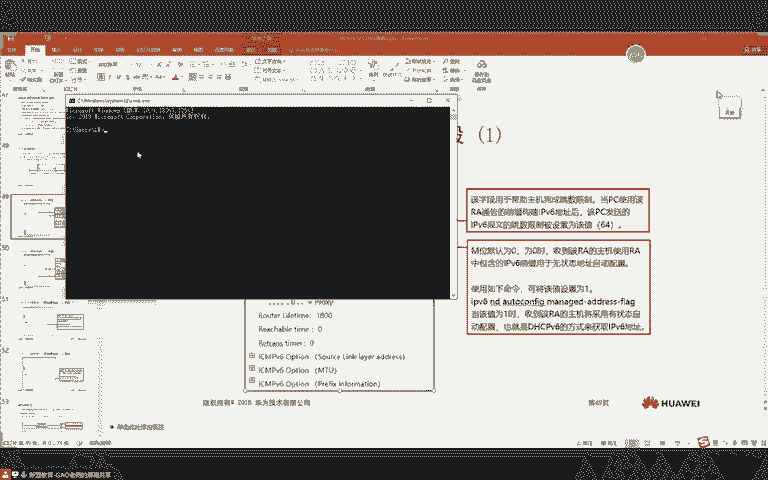

## IPv6基础机制补充

在深入隧道技术前，我们简要回顾两个IPv6的基础机制。

**ICMPv6重定向**
当路由器发现数据包的下一跳与源主机在同一网段时，会发送ICMPv6重定向报文，告知主机更优的路径。例如，主机A访问主机B，网关RTA发现RTB是更近的下一跳，就会通知主机A后续直接发往RTB。

**路径MTU发现（PMTUD）**
IPv6规定中间路由器不能对数据包分片，分片只能在源主机进行。PMTUD机制确保主机能发现整条路径上的最小MTU。
1.  主机按本机MTU发送数据包。
2.  路径上任何路由器若因MTU太小无法转发，将回复“Packet Too Big” ICMPv6报文，并告知其接口MTU值。
3.  主机根据此MTU值重新分片并发送。
此过程持续进行，直到数据包能到达目的地。IPv6要求链路最小MTU为 **1280** 字节。

---


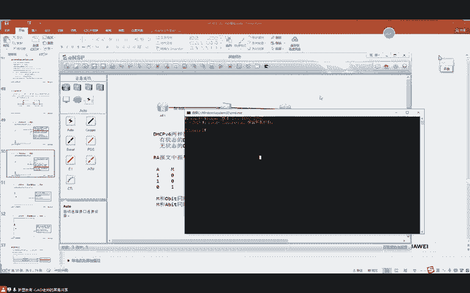

## IPv6过渡技术：双栈与手工隧道

由于IPv4向IPv6的迁移无法一蹴而就，网络中常存在两种协议共存的场景。过渡技术主要分为两类：**共存** 与 **互通**。本节重点介绍共存技术中的 **双栈** 和 **手工隧道**。

### 双栈技术

双栈是最简单直接的共存方式。网络中的设备（主机、路由器）同时运行IPv4和IPv6协议栈，并配置两种协议的地址。IPv4和IPv6通信相互独立，互不影响。
*   **优点**：原理简单，无需协议转换。
*   **缺点**：要求端到端所有设备支持双栈，且应用需兼容两者，是一种理想化模型。

**配置示例**：
```bash
# 在路由器接口上同时配置IPv4和IPv6地址
interface GigabitEthernet0/0/0
 ip address 10.0.12.1 255.255.255.0
 ipv6 enable
 ipv6 address 2001:12::1/64
```

---

### 手工隧道技术

当两个IPv6网络被一个IPv4网络隔开时，可以使用隧道技术，将IPv6数据包封装在IPv4数据包中，通过IPv4网络进行传输。主要有两种类型：**IPv6 over IPv4手动隧道** 和 **GRE over IPv4隧道**。

#### 实验拓扑与目标
*   **PC1** (IPv6: 2001:192::1/64) 和 **PC2** (IPv6: 2001:172::1/64) 位于两个IPv6网络。
*   **中间网络** (R1-R2-R3) 为IPv4网络。
*   **目标**：在R1和R3之间建立隧道，使PC1与PC2能够互通。

**基础配置（IP地址、路由略）**

---

#### 1. IPv6 over IPv4 手动隧道

这种隧道直接在IPv6数据包外封装一个IPv4头部。

**在隧道端点R1和R3上的配置**：

```bash
# 创建隧道接口并指定封装类型
interface Tunnel0/0/1
 tunnel-protocol ipv6-ipv4  # 指定为IPv6 over IPv4手动隧道
 source 10.0.12.1           # 隧道源地址（本端IPv4地址）
 destination 10.0.23.3      # 隧道目的地址（对端IPv4地址）
 ipv6 enable
 ipv6 address 2001::1/64    # 为隧道接口配置一个IPv6地址，使协议UP
```

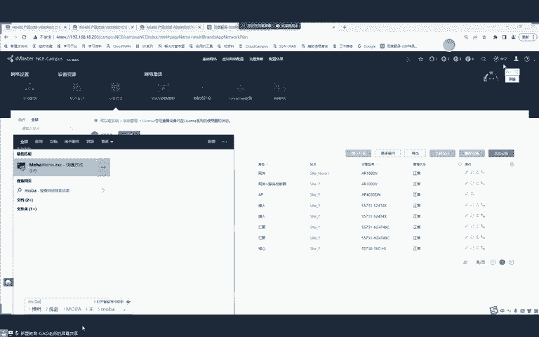

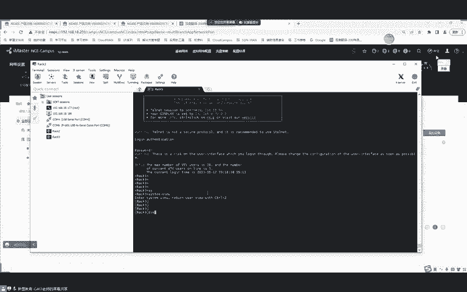


**配置静态路由引流**：
```bash
# 在R1上，将去往PC2网段的路由指向隧道接口
ipv6 route-static 2001:172:: 64 Tunnel0/0/1

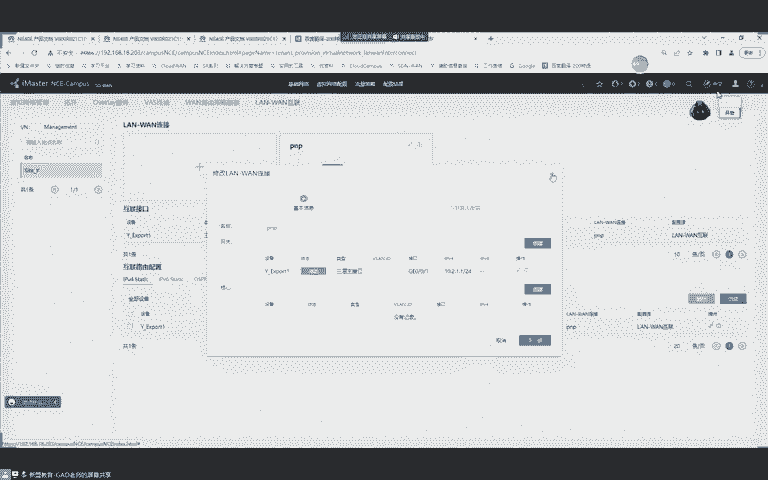

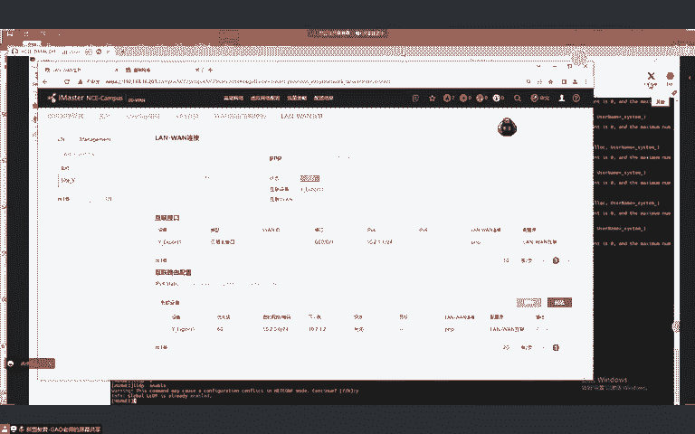

# 在R3上，将去往PC1网段的路由指向隧道接口
ipv6 route-static 2001:192:: 64 Tunnel0/0/1
```

**通信过程**：
1.  PC1访问PC2的IPv6包到达R1。
2.  R1查IPv6路由表，匹配到静态路由，将数据包送入隧道接口`Tunnel0/0/1`。
3.  隧道接口为原始IPv6包添加一个外层IPv4包头，源为`10.0.12.1`，目的为`10.0.23.3`。
4.  封装后的IPv4包在IPv4网络中路由，到达R3。
5.  R3拆掉外层IPv4包头，得到内层IPv6包，查其IPv6路由表，转发给PC2。
6.  回程过程类似。

**优点**：封装开销小，比GRE隧道少一个协议头。
**缺点**：纯手工配置，无法检测隧道状态。

---

#### 2. GRE over IPv4 隧道

这种隧道使用通用的GRE协议进行封装，灵活性更高。

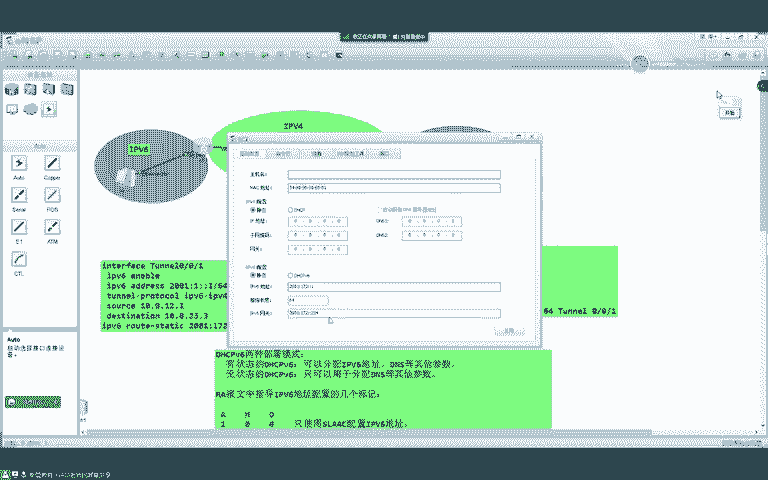

**在隧道端点R1和R3上的配置**：

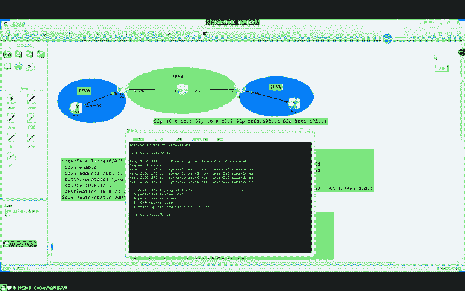

```bash
# 创建隧道接口并指定封装类型为GRE
interface Tunnel0/0/1
 tunnel-protocol gre        # 指定为GRE隧道
 source 10.0.12.1           # 隧道源地址
 destination 10.0.23.3      # 隧道目的地址
 ipv6 enable
 ipv6 address 2001::1/64    # 为隧道接口配置IPv6地址
```

**路由引流配置与手动隧道相同**。

**通信过程**：
与手动隧道类似，区别在于封装时，在原始IPv6包和外层IPv4包之间，还添加了一个 **GRE头部**。

**GRE隧道相较于手动隧道的优势**：
1.  **支持Keepalive检测**：可以配置`keepalive`命令来检测隧道链路的状态。
    ```bash
    interface Tunnel0/0/1
     keepalive
    ```
2.  **支持简单的认证**：可以配置GRE Key，提供简单的验证机制。
    ```bash
    # 在R1和R3的隧道接口下配置相同的Key
    interface Tunnel0/0/1
     gre key 123
    ```
    *如果两端Key不一致，隧道将无法建立。* 但需注意，Key在报文中是明文传输的，安全性较弱。

**缺点**：比手动隧道多一个GRE头（通常4字节），有效载荷略少。

---

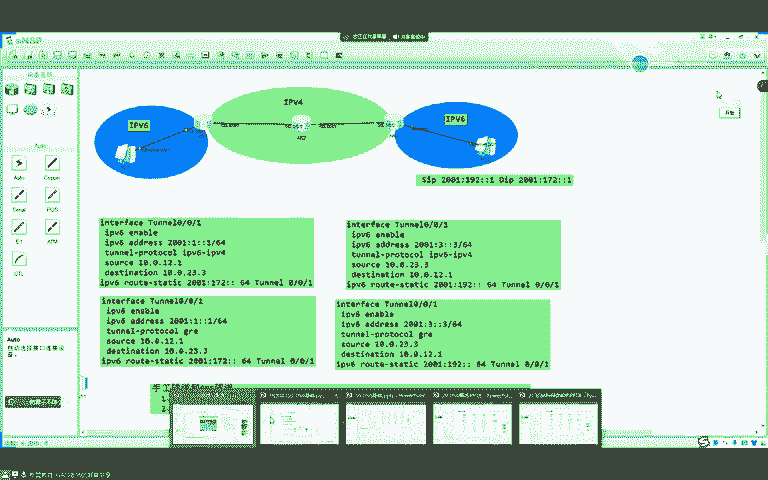

## 总结

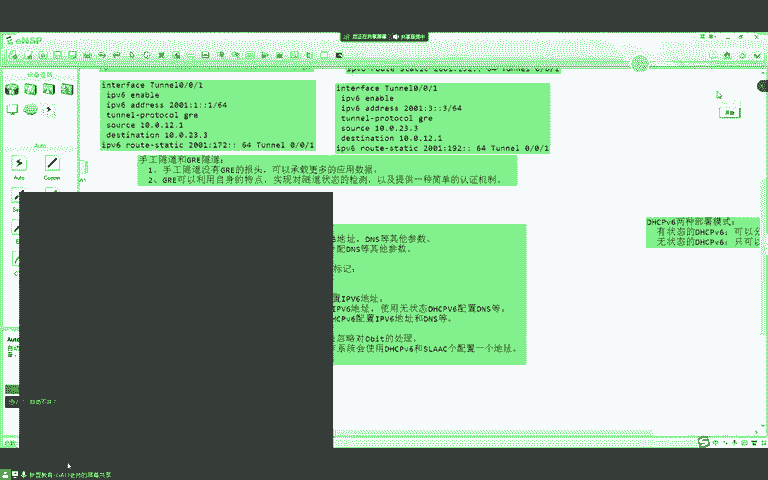

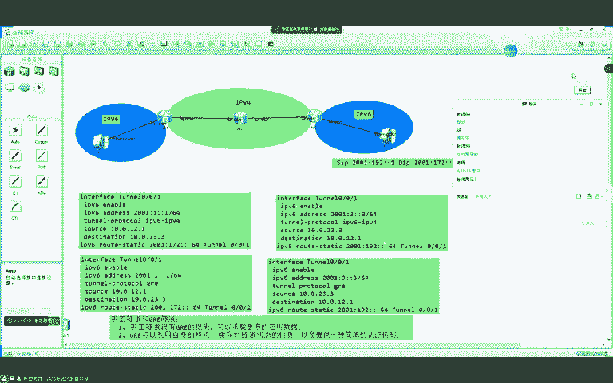

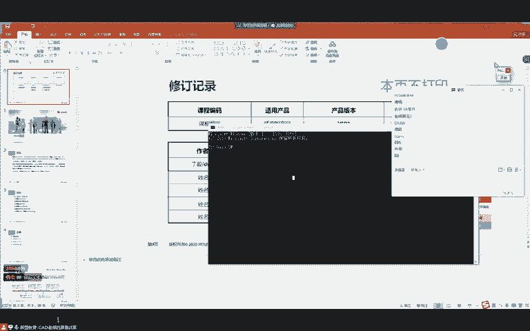

本节课我们一起深入学习了IPv6的多个核心机制与过渡技术。
1.  **IPv6地址生命周期**：理解了优选生存期和有效生存期的概念及其在地址平滑切换中的重要作用。
2.  **RA报文标志位**：掌握了A、M、O标志位的含义及其组合所定义的地址配置方式（纯SLAAC、SLAAC+无状态DHCPv6、有状态DHCPv6）。
3.  **基础机制**：回顾了ICMPv6重定向和路径MTU发现（PMTUD）的工作原理。
4.  **过渡技术-双栈**：了解了最简单的IPv4/IPv6共存方式。
5.  **过渡技术-手工隧道**：重点实践了两种手工隧道（IPv6 over IPv4和GRE over IPv4）的配置，理解了其封装原理、通信流程以及各自的优缺点（GRE隧道支持状态检测和简单认证，手动隧道封装效率更高）。

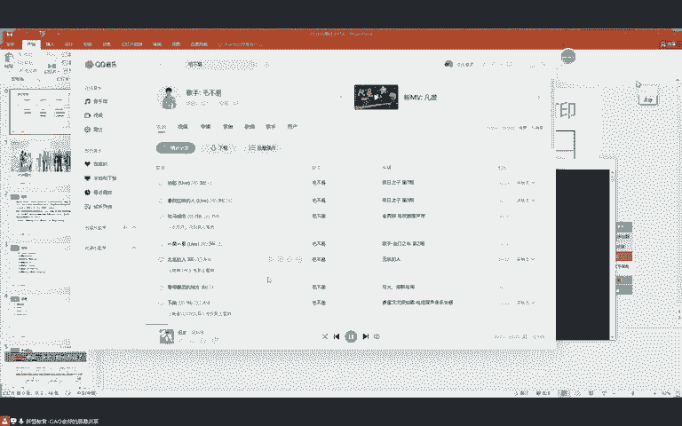

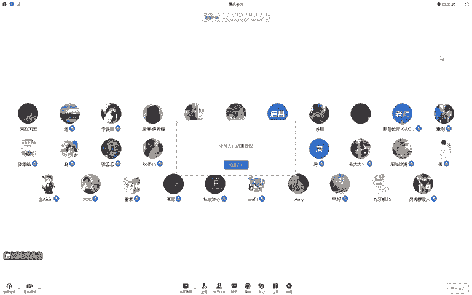

通过本课的学习，你已能够配置基本的IPv6网络，并使其通过隧道跨越IPv4网络进行通信。下一节课我们将探讨更自动化的隧道技术。