# OSPFv3 课程：P110：OSPFv3 新增特性详解

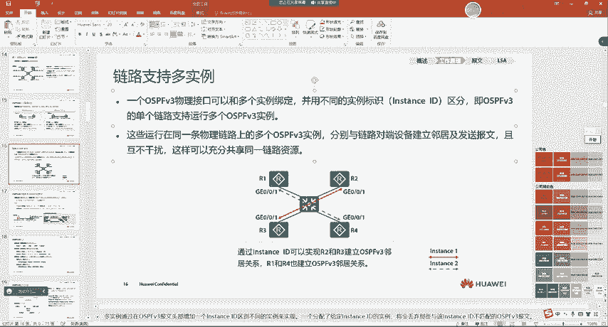

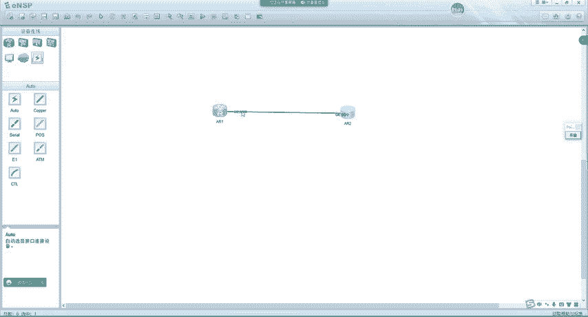

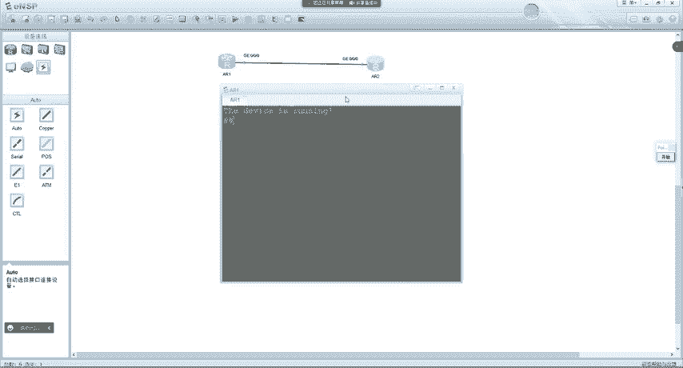

在本节课中，我们将深入学习 OSPFv3 协议，重点探讨其相较于 OSPFv2 新增的核心特性。我们将从链路多实例支持开始，逐步分析 OSPFv3 报文结构、链路本地地址的使用以及 LSA 类型的重大变化，特别是其对未知 LSA 的泛洪支持机制。

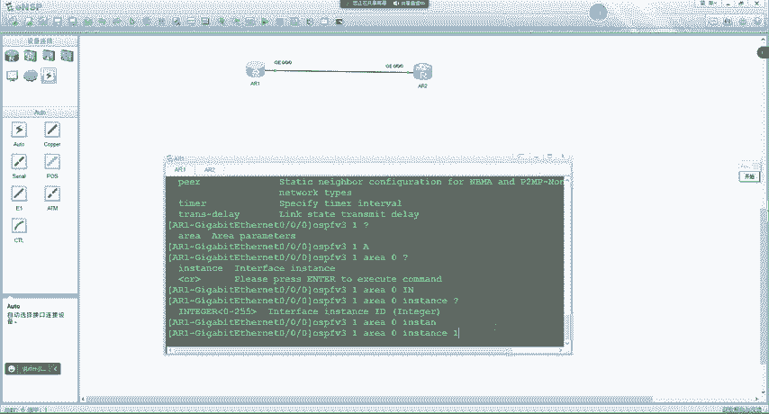

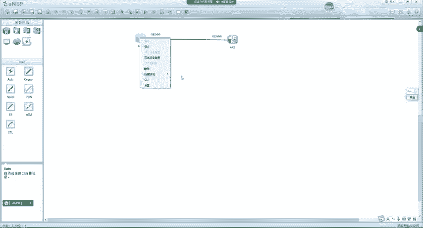

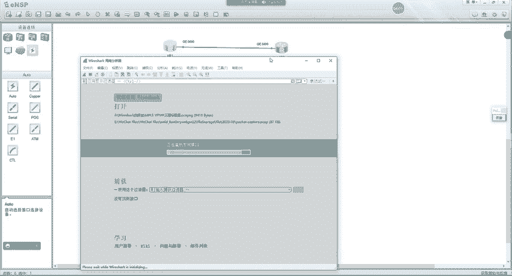

## 链路支持多实例

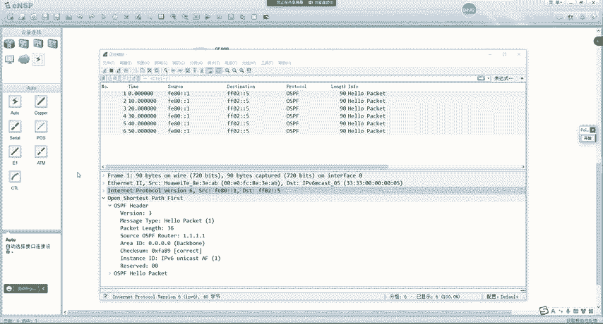

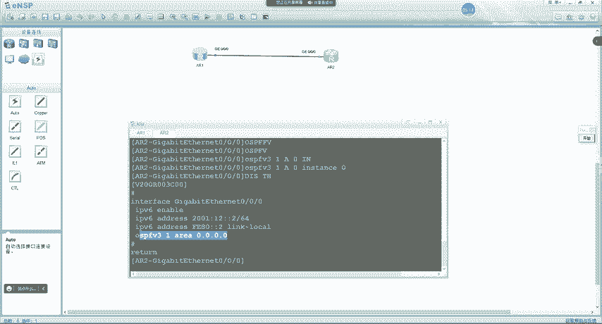


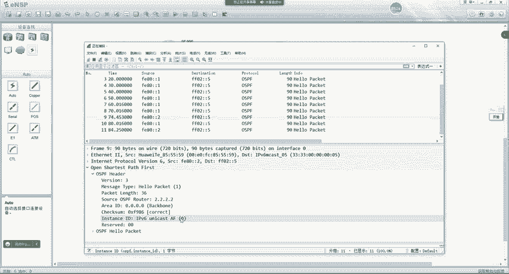

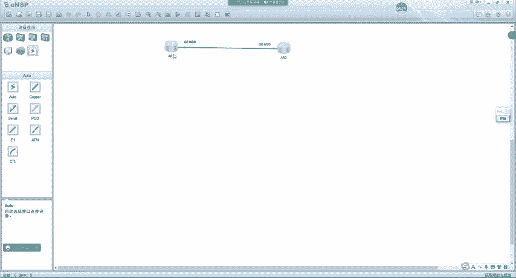

上一节我们介绍了 OSPFv3 的基本概念，本节中我们来看看 OSPFv3 一个重要的新增特性：**链路支持多实例**。

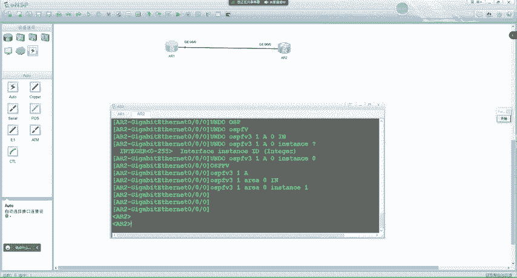

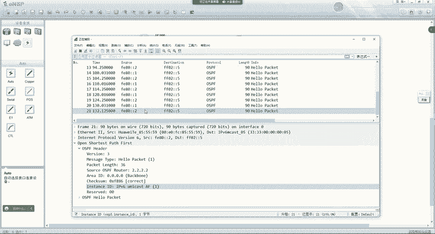

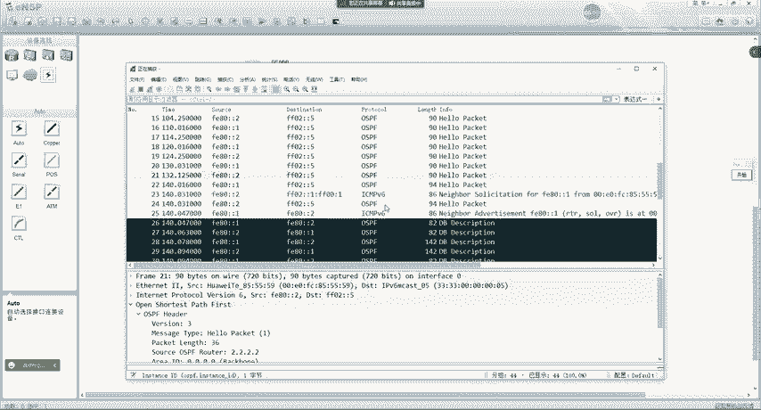

在 OSPFv2 中，提到“多实例”容易联想到多进程。但在 OSPFv3 中，情况有所不同。OSPFv3 在 Hello 报文中新增了一个字段：**Instance ID（实例 ID）**。这个字段相当于一个“暗号”。建立邻居时，不再要求两端 IP 地址在同一网段，但要求双方的 **Instance ID 必须相同**。


我们可以通过抓包来观察 Instance ID。配置两台路由器运行 OSPFv3，在接口下启用 OSPFv3 时，可以指定实例 ID，默认值为 0。

```bash
# 在接口下配置 OSPFv3 并指定实例 ID
interface GigabitEthernet0/0/0
 ospfv3 1 area 0 instance-id 1
```

如果两台路由器的实例 ID 不一致（例如一端为 1，另一端为 0），则邻居关系无法建立。只有当双方实例 ID 修改为一致后，邻居关系才能正常建立。

基于此现象，我们可以得出结论：**OSPFv3 建立邻居时，要求两端的实例 ID 相同，否则无法建立邻居关系。**

那么，这个特性的作用是什么呢？它主要用于实现 **链路的多路复用**。

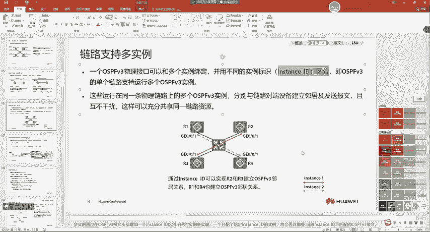


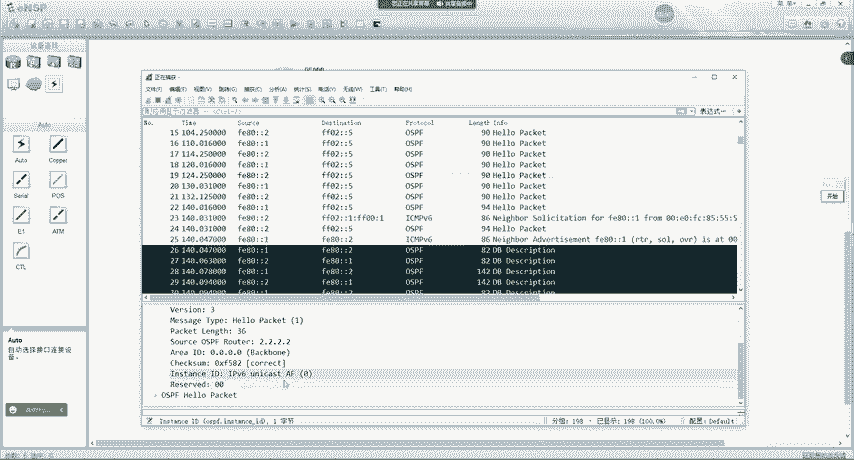


考虑一个场景：四台路由器连接在同一台二层交换机上。我们希望 R1 只与 R4 建立邻居，R2 只与 R3 建立邻居，两组邻居彼此隔离。在 OSPFv2 中，可以通过划分 VLAN 或配置认证等方式实现，但配置相对复杂。

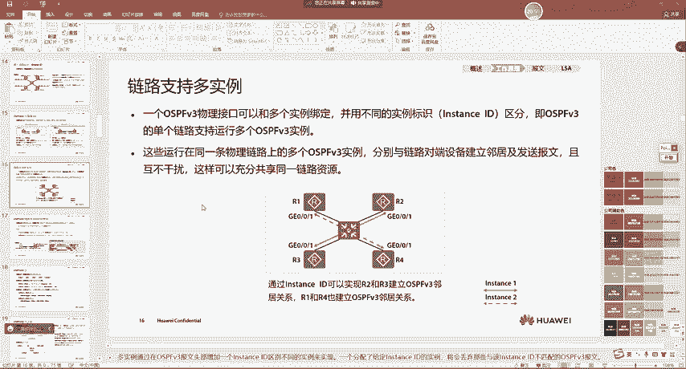

在 OSPFv3 中，利用实例 ID 可以更简洁地实现：
*   让 R1 和 R4 使用相同的实例 ID（例如 1）。
*   让 R2 和 R3 使用相同的实例 ID（例如 2）。
*   由于实例 ID 不同，R1/R4 与 R2/R3 之间不会建立邻居关系，从而在逻辑上形成了两个独立的网络，共享同一条物理链路。

这种设计可以充分利用链路资源，无需额外的物理设备或复杂的二层隔离配置。需要注意的是，**实例 ID 仅用于控制邻居关系的建立，并不能实现路由表的隔离**（这是 VPN 实例的功能）。

## OSPFv3 对链路本地地址的使用

接下来，我们探讨 OSPFv3 对链路本地地址的依赖，这是其与 OSPFv2 的另一个关键区别。

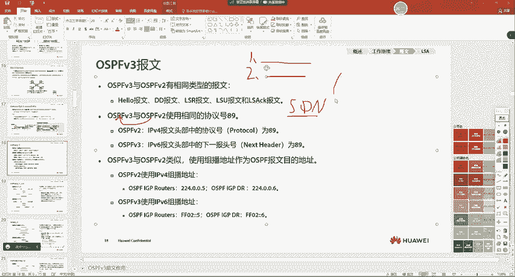

在 OSPFv3 中：
1.  **链路本地地址**被用作报文发送的**源地址**和路由条目的**下一跳**。
2.  邻居关系的建立、维持以及 LSA 的同步都基于链路本地地址。

这带来了两大优势：
*   **实现拓扑与地址分离**：无需配置全局单播地址，仅凭链路本地地址即可构建 OSPFv3 的拓扑。这实现了网络拓扑与全球单播地址的解耦。
*   **减少不必要的泛洪**：OSPFv3 报文以链路本地地址为源，其组播目的地址（如 `FF02::5`）也仅在本地链路有效，因此报文不会被转发到始发链路之外，节省了带宽。

> **注意**：关于第二点优势，OSPFv2 的组播报文同样只在本地链路传播，这是组播地址的特性。此处主要是说明 OSPFv3 具备此特点。

## OSPFv3 报文类型与结构

OSPFv3 与 OSPFv2 一样，有五种报文类型：Hello、DD、LSR、LSU、LSAck。其协议号在 IPv6 报头中同样标识为 89，并使用类似的组播地址（`FF02::5` 和 `FF02::6`）。这种设计保持了工程师从 OSPFv2 过渡到 OSPFv3 时的熟悉感，利于技术普及。

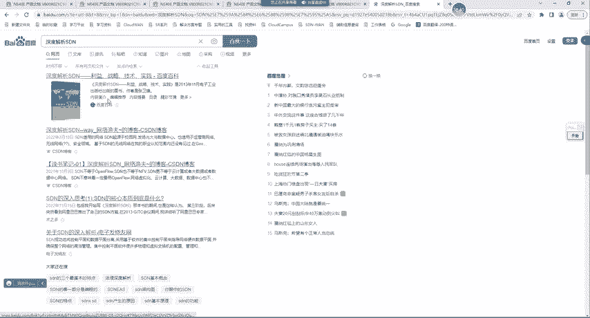

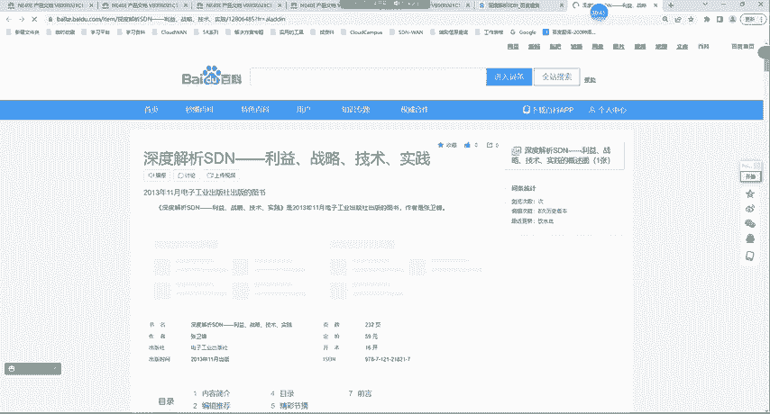

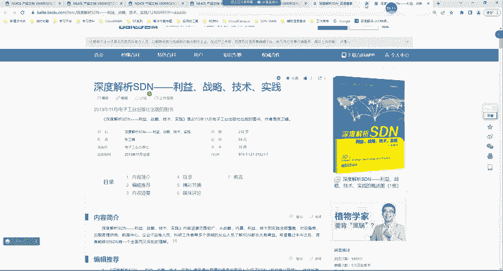


### 通用包头对比


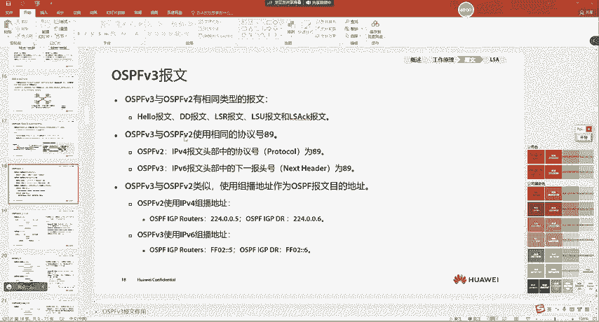

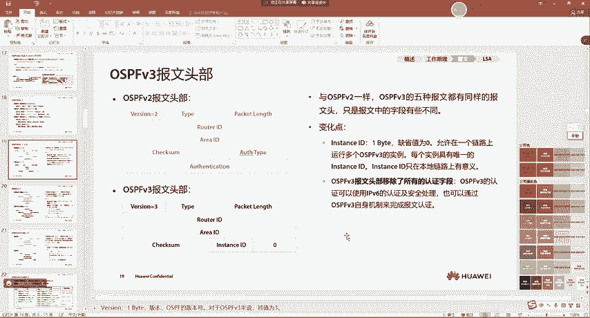

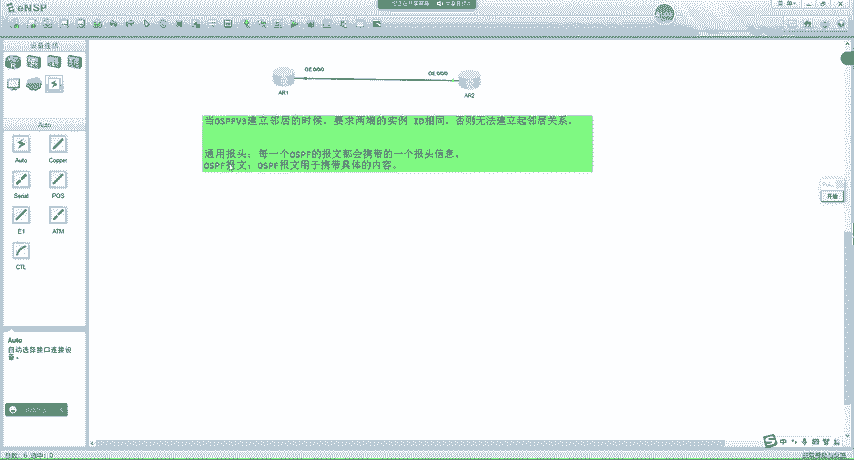

以下是 OSPFv3 与 OSPFv2 通用包头的主要区别：

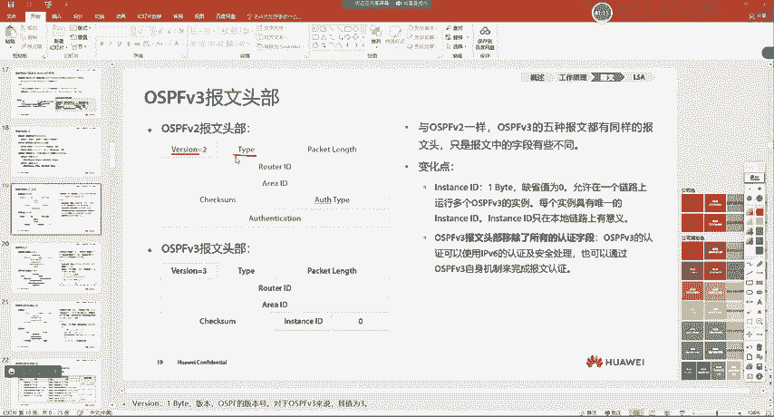


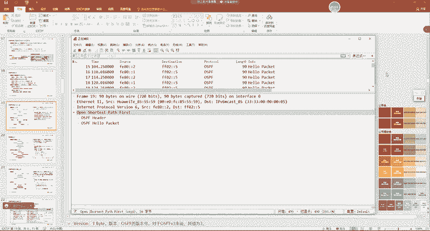

| 字段 | OSPFv2 | OSPFv3 | 说明 |
| :--- | :--- | :--- | :--- |
| **版本** | 2 | 3 | 协议版本号。 |
| **Instance ID** | 无 | 有 | OSPFv3 新增，用于多实例。 |
| **认证字段** | 有 | 无 | OSPFv3 自身不提供认证，依赖 IPv6 的 AH/ESP 扩展头。 |

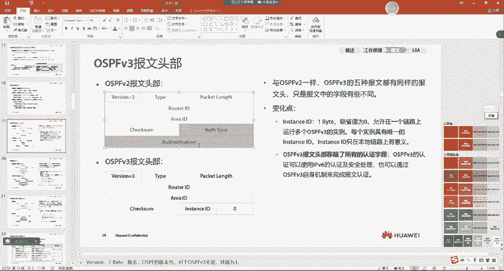

### Hello 报文与 Option 字段

OSPFv3 的 Hello 报文包含了与 OSPFv2 类似的字段，如路由器优先级、Hello/Dead 间隔、DR/BDR、邻居列表等。主要新增了两个字段：
*   **Interface ID**：用于唯一标识启用了 OSPFv3 的接口。其具体作用将在讲解 SPF 算法时深入理解。
*   **Option 字段**：长度扩展为 3 字节（24 比特），新增了三个关键比特位：
    *   **R 位**：指示始发路由器是否具备**转发能力**。若 R=0，则其他路由器在计算 SPF 树时会忽略由此路由器生成的拓扑信息（但仍可计算其发布的叶子网络）。可用于设备维护前的流量引流。
    *   **V6 位**：指示是否参与 **IPv6 路由计算**。若 V6=0，则其他路由器在 SPF 计算中会完全忽略此路由器及其连接的所有网络。
    *   **AT 位**：指示设备是否支持 **OSPFv3 认证**（通过 IPv6 扩展头实现）。

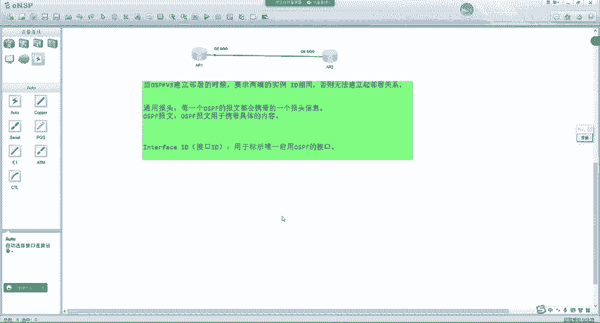

## OSPFv3 LSA 的革新

OSPFv3 的 LSA 头部发生了重大变化，其中最核心的是 **LSA Type** 字段的重新定义。

在 OSPFv2 中，每增加一项新功能（如 Graceful Restart、MPLS TE），就需要定义一种新的 LSA 类型（如第 9、10 类 LSA）。如果网络中的某台路由器软件版本较旧，无法识别这种新的 LSA，它会直接丢弃该 LSA，导致后续需要该信息的路由器无法收到。

OSPFv3 借鉴了 BGP 中“可选过渡属性”的思想，引入了对**未知 LSA 的泛洪支持**。这是通过重新设计的 LSA Type 字段实现的。

OSPFv3 的 LSA Type 是一个 16 位的字段，其结构如下：
*   **U 比特**：指示路由器应如何处理无法识别的 LSA。
    *   `U=0`：将 LSA 视为链路本地范围，并像存储它一样将其泛洪。
    *   `U=1`：像存储已知 LSA 一样存储并泛洪未知 LSA。
*   **S1/S2 比特**：共同指示 LSA 的**泛洪范围**。
    *   `00`：链路本地范围
    *   `01`：区域范围
    *   `10`：自治系统范围
    *   `11`：保留
*   **LSA 功能代码**：剩余比特位用于标识 LSA 的具体功能。

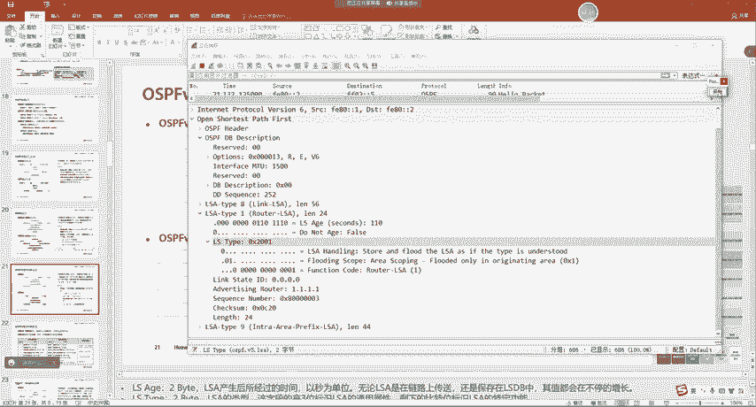

这种机制允许一台不支持新功能的路由器，在收到未知 LSA 时，根据 U 比特和 S 比特的指示，将其正确地泛洪给其他邻居，从而保证了新特性信息能在网络中传递，即使部分节点尚未升级。

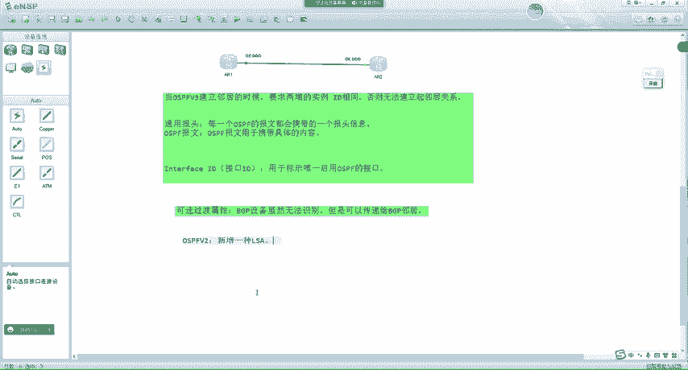


## 总结

本节课中我们一起学习了 OSPFv3 的多个核心新增特性：
1.  **链路多实例**：通过 **Instance ID** 控制邻居建立，实现单条物理链路的逻辑复用。
2.  **链路本地地址为核心**：使用链路本地地址进行通信，实现拓扑与全球单播地址的分离，增强了稳定性。
3.  **报文结构优化**：通用包头移除内置认证，Hello 报文新增 **Interface ID** 和扩展的 **Option** 字段（特别是 **R 位**和 **V6 位**），用于控制路由计算和转发行为。
4.  **LSA 泛洪机制增强**：通过重新定义 **LSA Type** 字段（**U/S 比特**），支持对未知 LSA 的存储和泛洪，极大地提高了协议的扩展性和向后兼容性。

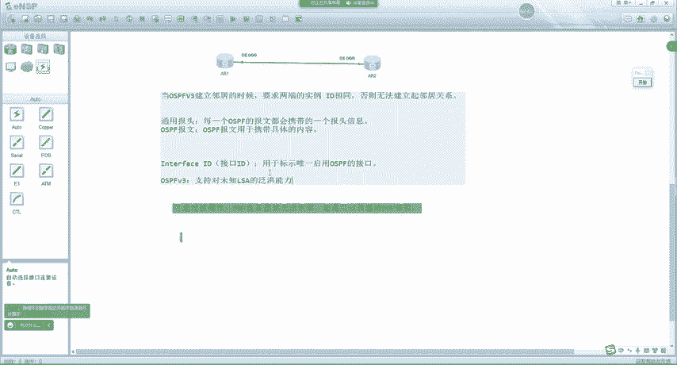

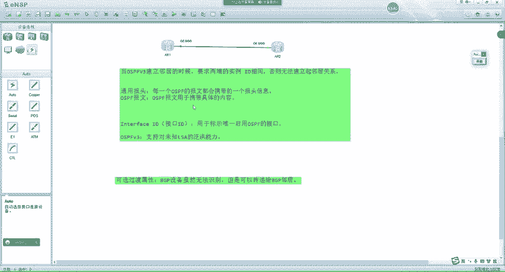

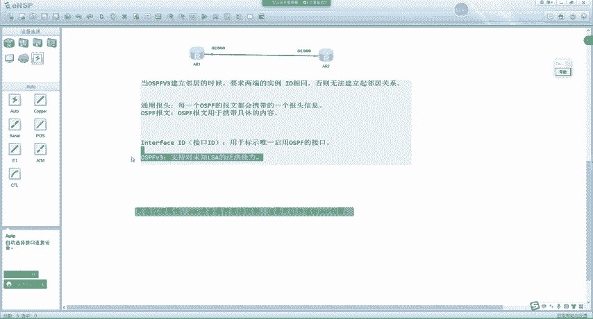

这些特性使得 OSPFv3 不仅是一个支持 IPv6 的 OSPF 版本，更是一个在可扩展性、灵活性和稳定性方面都有显著提升的路由协议。