# OSPFv3 深入解析：P111：OSPFv3 LSA 类型与拓扑构建 🧩

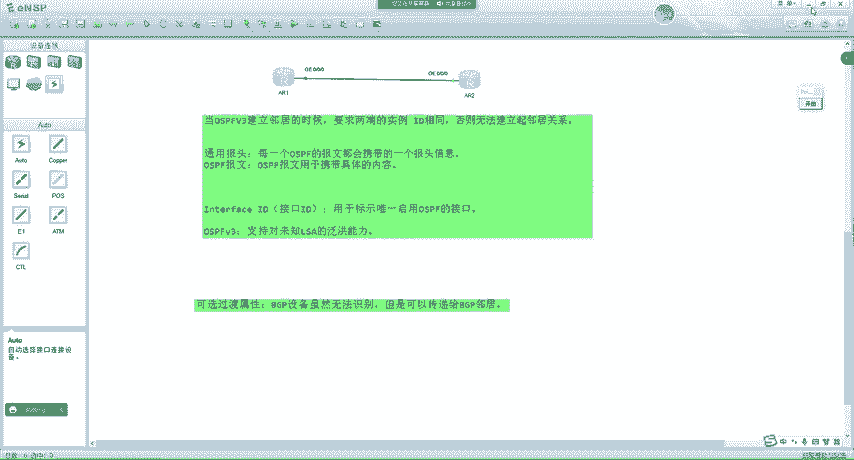

在本节课中，我们将深入学习 OSPFv3 中 LSA 的构成、类型以及路由器如何利用它们来构建网络拓扑图。我们将重点关注 U/S 比特的作用、LSA 类型的新编码方式，并与 OSPFv2 进行对比，最后通过实例演示拓扑构建过程。

## LSA 头部中的 U/S 比特解析 🔍

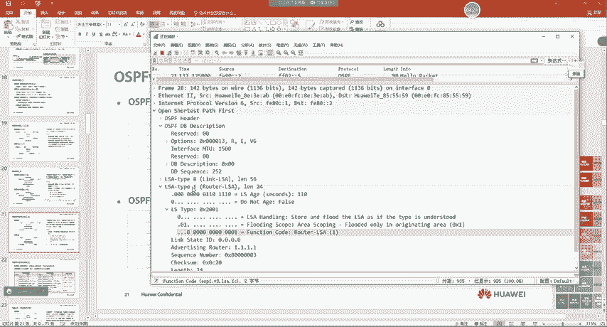

上一节我们介绍了 OSPFv3 支持对未知 LSA 的泛洪。本节中我们来看看指导泛洪行为的 U 比特和 S1/S2 比特具体如何工作。

U 比特标识对未知 LSA 的处理方法。
*   如果 **U=0**，代表将此 LSA 当作具有**链路本地**泛洪范围来对待。这意味着 LSA 只能在直连链路上泛洪，不能跨越路由器转发。
*   如果 **U=1**，代表把此 LSA 类型当成**已知的 LSA** 来处理。路由器会存储并参考 S1/S2 比特决定其泛洪范围。

当路由器收到一个无法识别的 LSA（U=1）时，它会“不懂装懂”，参考 S1 和 S2 比特来决定泛洪范围。
以下是 S1 和 S2 比特的组合含义：
*   **S2S1 = 00**：链路本地范围。
*   **S2S1 = 01**：区域范围。
*   **S2S1 = 10**：AS 范围。
*   **S2S1 = 11**：保留未定义。

## OSPFv3 LSA 类型（LS Type）的构成 🧮

功能代码（Function Code）用于唯一标识 LSA 的类型，例如 1 类、5 类、8 类等。
在描述一个 LSA 时，U 比特、S2/S1 比特和功能代码会组合成一个 16 位的 **LS Type** 字段。

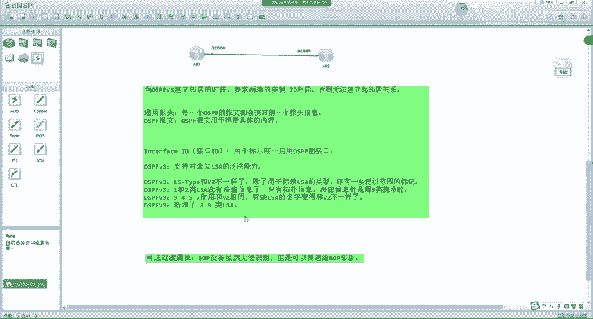

例如，1 类 LSA 的构成如下：
*   U=0
*   S2S1=01 (区域范围)
*   功能代码=1
组合成 16 进制为：**0x2001**。

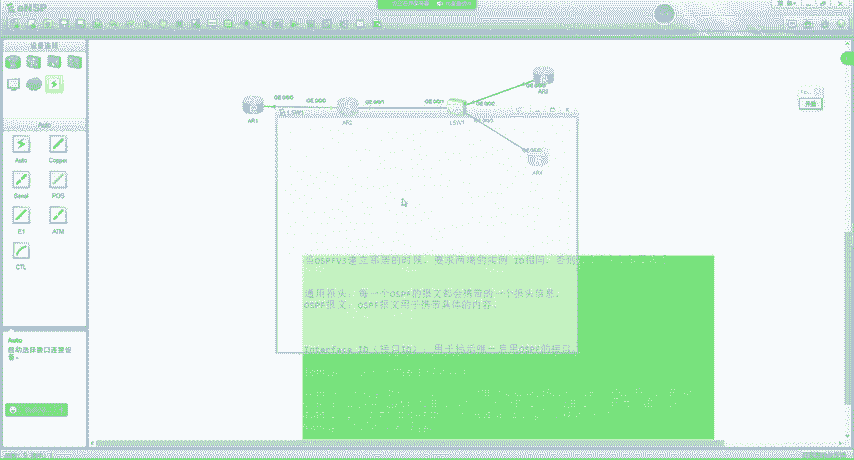

基于此规则，常见的 OSPFv3 LSA 类型如下：
*   1类 LSA (Router LSA): **0x2001**
*   2类 LSA (Network LSA): **0x2002**
*   3类 LSA (Inter-Area-Prefix LSA): **0x2003**
*   4类 LSA (Inter-Area-Router LSA): **0x2004**
*   5类 LSA (AS-External LSA): **0x4005** (U=1, S2S1=10)
*   7类 LSA (NSSA LSA): **0x2007**
*   8类 LSA (Link LSA): **0x0008** (U=0, S2S1=00， 链路本地)
*   9类 LSA (Intra-Area-Prefix LSA): **0x2009**

## OSPFv3 与 OSPFv2 LSA 的核心区别 ⚖️

了解 LS Type 的构成后，我们来看看 OSPFv3 中 LSA 的作用与 OSPFv2 的主要区别。

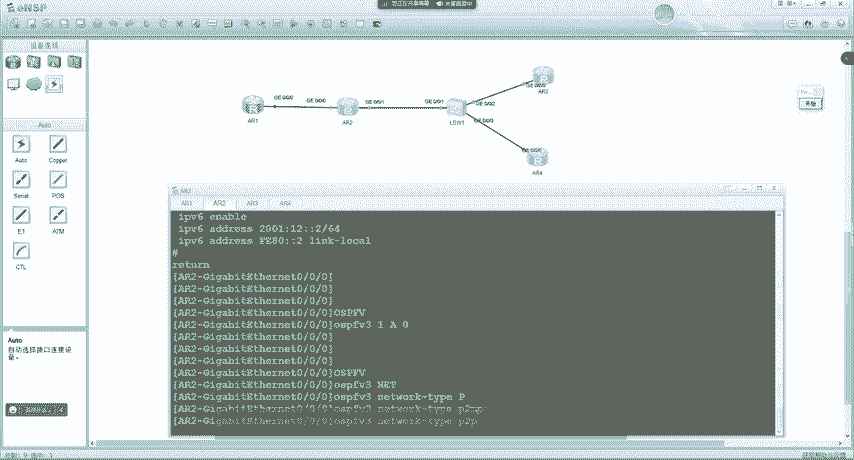

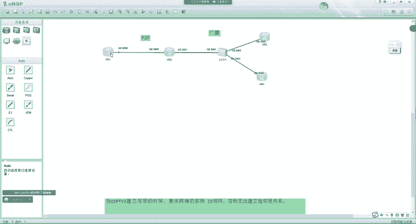

1.  **1类 & 2类 LSA 不再携带路由信息**：在 OSPFv3 中，Router LSA 和 Network LSA **只描述拓扑信息**（如邻居、链路类型），不再包含具体的 IPv6 前缀（路由信息）。这些路由信息改由 **9类 LSA (Intra-Area-Prefix LSA)** 携带。
2.  **LSA 名称更具语义化**：部分 LSA 名称变更，使其作用更明确（如 3类 LSA 称为“区域间前缀 LSA”）。
3.  **新增 LSA 类型**：OSPFv3 新增了 8类（Link LSA）和 9类（Intra-Area-Prefix LSA）LSA。

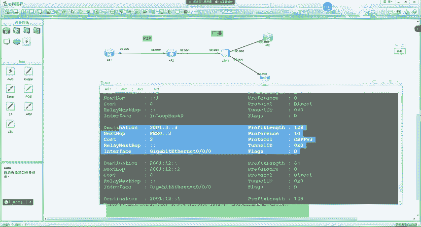


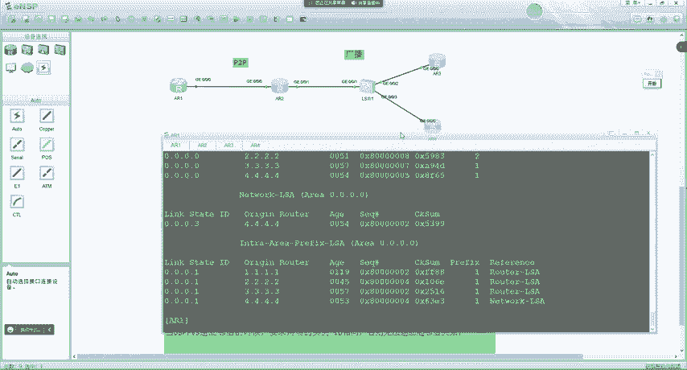

简单总结，需要记住以下几点：
*   OSPFv3 的 LS Type 融合了类型标识和泛洪范围。
*   OSPFv3 的 1类、2类 LSA 只有拓扑，路由由 9类 LSA 携带。
*   OSPFv3 的 3、4、5、7 类 LSA 作用与 v2 相同，但部分名称改变。
*   OSPFv3 新增了 8类、9类 LSA。

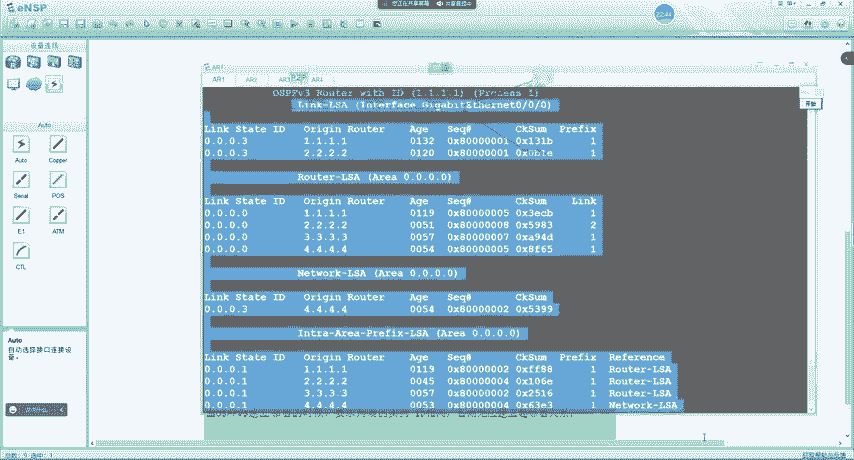

## 实战：解析 LSA 与构建拓扑图 🛠️

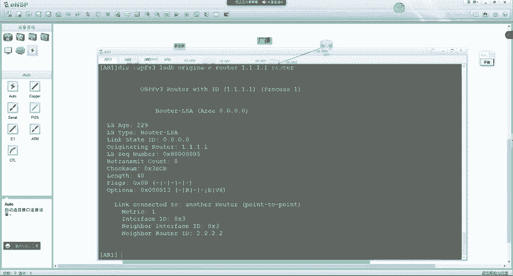

理论需要结合实际。接下来我们通过一个实验场景，看看路由器如何利用 1类和 2类 LSA 来构建区域内的拓扑图。

假设有一个小型网络：路由器 R1, R2, R3, R4。R1 与 R2 是 P2P 链路，R2、R3、R4 连接在同一个广播网络中（DR 为 R4）。

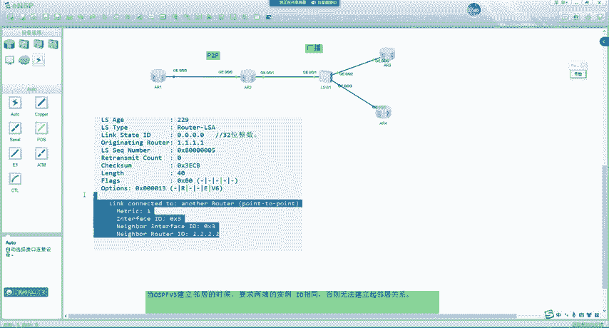

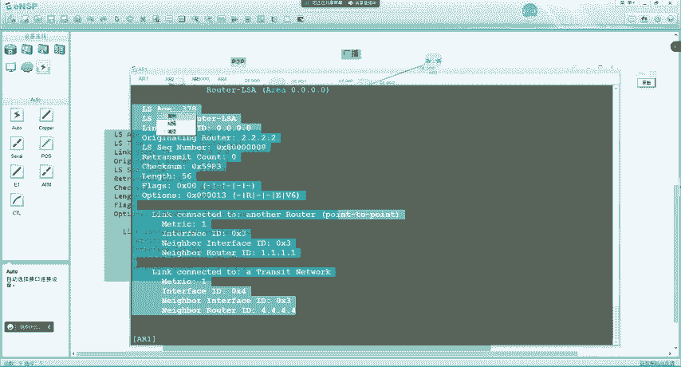

在 R1 上查看 OSPFv3 链路状态数据库，会发现多种 LSA。我们重点关注 1类 (Router LSA) 和 2类 (Network LSA)。

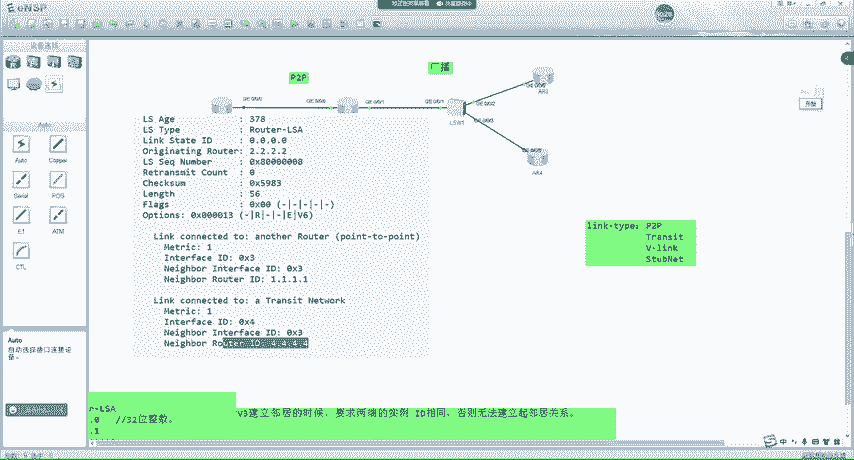

**第一步：查看 R1 自己产生的 1类 LSA**
`display ospfv3 lsdb router self-originate`
输出信息中，关键部分在于“Links”字段。它会显示 R1 的接口 ID（例如 0x3），以及通过该接口连接的邻居（R2）的 Router ID 和接口 ID，还有到达此邻居的 Cost 值。
由此，R1 可以画出：`R1 --(接口3， cost=1)--> R2`

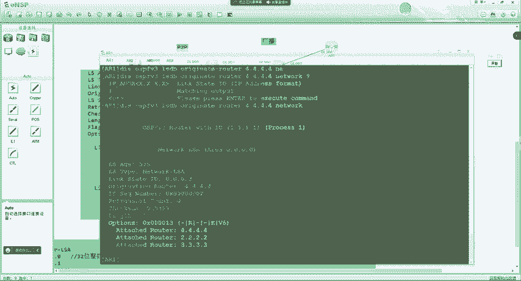

**第二步：查看 R2 产生的 1类 LSA**
`display ospfv3 lsdb router adv-router 2.2.2.2`
R2 的 LSA 显示它连接了两个邻居：
1.  一个 P2P 邻居（R1），已在拓扑中。
2.  一个 Transit Network（广播网络），连接到 DR（R4）。这提示网络中存在一个伪节点（DR）。

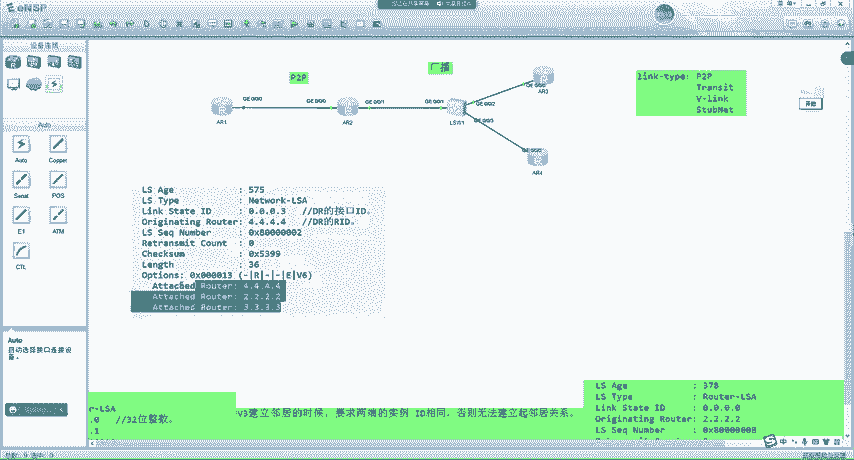

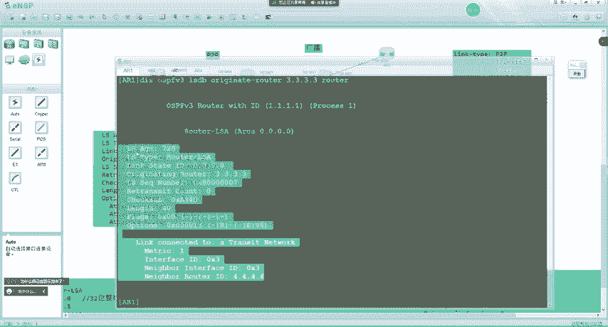

由此，拓扑更新为：`R1 -- R2 --(广播网)--> (伪节点 DR)`

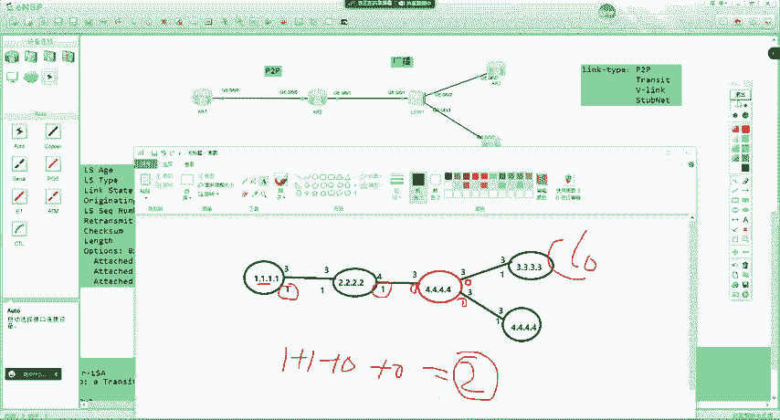

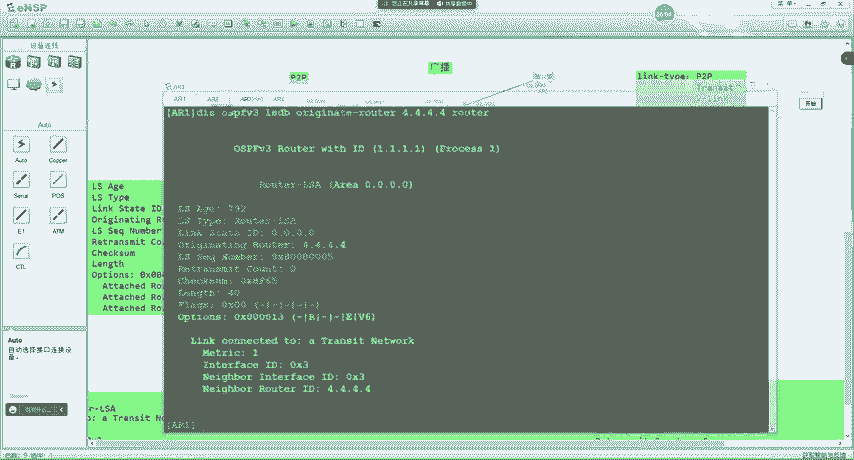

**第三步：查看伪节点（DR-R4）产生的 2类 LSA**
`display ospfv3 lsdb network adv-router 4.4.4.4`
2类 LSA 会列出连接到此广播网络的所有路由器的 Router ID（即 R2, R3, R4）。
由此，R1 知道了这个广播网络上还有 R3 和 R4。

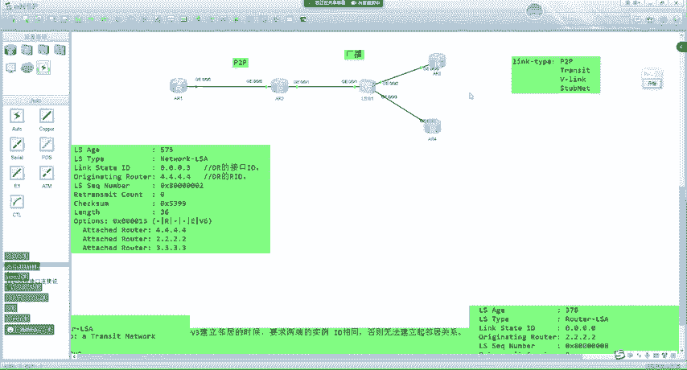

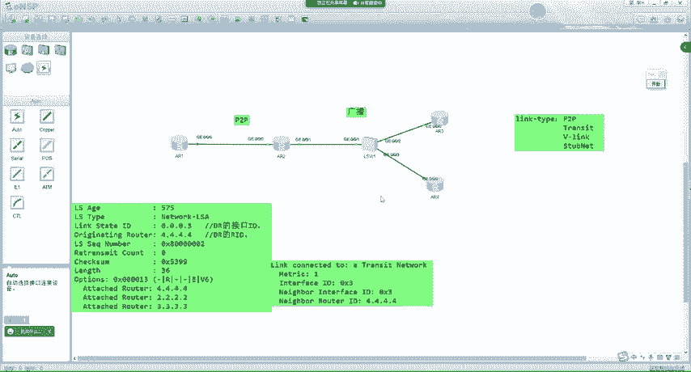

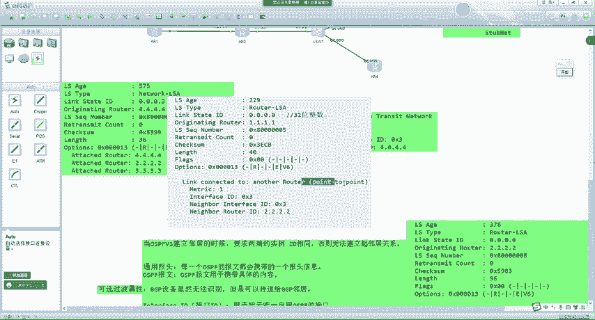

**第四步：查看 R3 和 R4 产生的 1类 LSA**
分别查看 R3 和 R4 的 1类 LSA，确认它们连接到伪节点的接口 ID 和 Cost。
最终，R1 构建出完整的区域拓扑图：
```
        R1
        | (cost=1)
        R2
        | (cost=1)
     (伪节点 DR)
     /         \
(cost=1)       (cost=1)
   /               \
 R3                 R4
```
有了拓扑图，结合 9类 LSA 携带的前缀信息，R1 就能通过 SPF 算法计算出到达所有网络的最短路径树和路由。

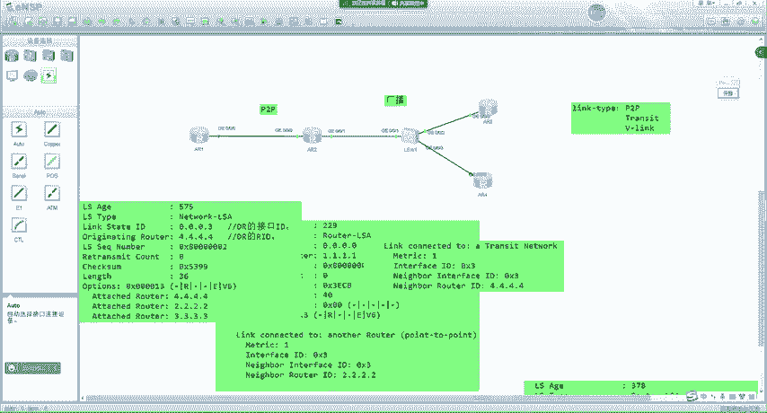


**关于接口 ID**：OSPFv3 中的接口 ID 是一个内部标识符，通常映射自 SNMP 的接口索引，无需对应物理接口名。路由器自己保证其唯一性即可。

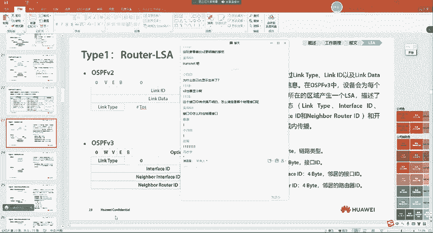

**Flags 与 Options 中的 ‘E’ 比特区别**：
*   **LSA Header 中 Flags 的 E-bit**：标识**本路由器**是否是 ASBR。
*   **Options 字段中的 E-bit**：标识**本路由器**是否支持处理 5类 AS-External LSA。Stub 区域内的路由器会清除此比特。

---

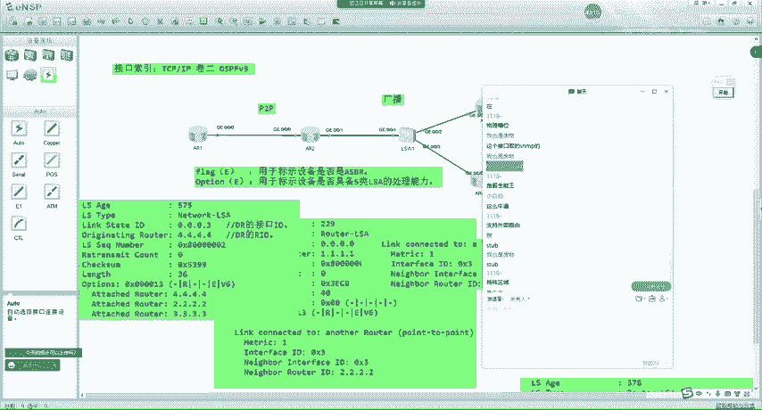

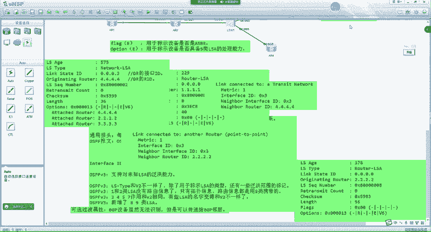

本节课中我们一起学习了 OSPFv3 LSA 类型的核心构成，包括 U/S 比特的作用和 LS Type 的编码方式。我们对比了 OSPFv3 与 v2 在 LSA 功能上的主要区别，特别是 1/2 类 LSA 不再携带路由信息这一关键变化。最后，我们通过一个实例，一步步解析了路由器如何利用 1 类和 2 类 LSA 来构建网络拓扑图，为后续的路由计算打下基础。下节课我们将深入探讨 9 类 LSA 如何携带前缀信息，并完成最终的路由计算。