# HCIE Datacom：P113：BGP4+与MPLS基础

## 概述
在本节课中，我们将学习两个重要的网络协议扩展：**BGP4+** 和 **MPLS**。首先，我们会了解BGP如何扩展以支持IPv6路由的传递，即BGP4+。随后，我们将初步探索多协议标签交换（MPLS）技术，理解其基本概念、产生背景和核心工作原理。

---

## BGP4+：支持IPv6的BGP扩展

上一节我们结束了BGP核心内容的学习，本节中我们来看看BGP如何支持IPv6。

### BGP4+简介
传统的BGP版本4（BGP-4）最初仅支持IPv4单播路由。为了支持IPv6等更多网络层协议，BGP被扩展为**多协议BGP（MP-BGP）**。其中，专门用于传递IPv6单播路由的扩展版本，常被称为 **BGP4+**。

**核心关系**：
*   MP-BGP是一个统称，涵盖了支持多种地址族（如IPv6单播/组播、VPNv4/v6等）的BGP扩展。
*   BGP4+特指MP-BGP中用于IPv6单播路由传递的部分。

### BGP4+的工作原理
BGP4+的协议机制（如邻居建立、路径属性、选路原则）与传统的IPv4 BGP完全一致。其主要区别在于**路由信息的携带方式**。

在传统BGP中，使用 **NLRI（网络层可达性信息）** 字段来通告IPv4路由。为了通告IPv6等其他协议的路由，BGP4+引入了两个新的路径属性：

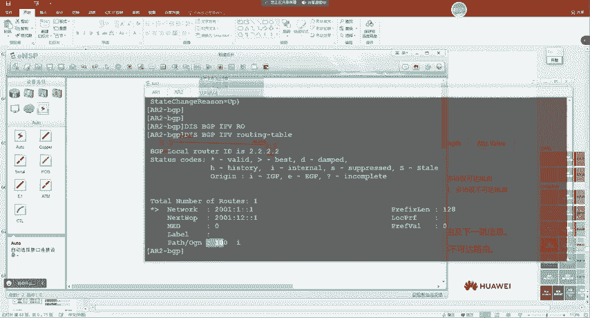

1.  **MP_REACH_NLRI（多协议可达NLRI）**：用于发布可达路由及其下一跳信息。
2.  **MP_UNREACH_NLRI（多协议不可达NLRI）**：用于撤销（删除）路由。

这两个属性使得BGP报文能够封装IPv6等协议的路由信息。

**MP_REACH_NLRI属性结构示例（概念性描述）**：
```
MP_REACH_NLRI {
    Address Family Identifier (AFI): 2,          // 2 代表 IPv6
    Subsequent Address Family Identifier (SAFI): 1, // 1 代表单播
    Next Hop Network Address: 2001:db8::1,       // IPv6 下一跳地址
    Network Layer Reachability Information (NLRI): // 路由前缀列表
        [2001:db8:1::/64, ...]
}
```

### BGP4+基础配置演示
以下通过一个简单实验展示IPv6 BGP邻居的配置。注意，IPv6地址族默认不激活，需要手动进入并激活。

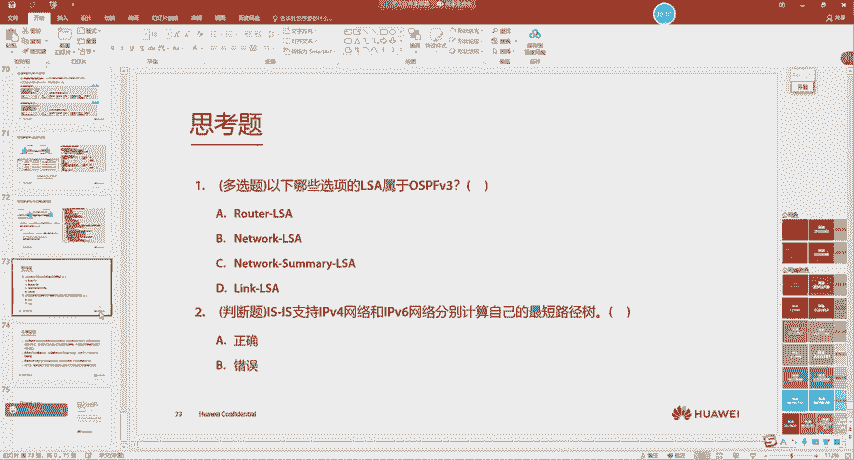

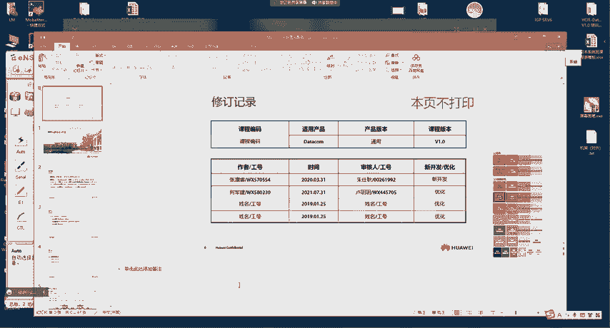

**实验拓扑**：AR1 (AS 100) —— AR2 (AS 200)

**配置步骤**：
1.  配置接口IPv6地址，确保链路连通性。
2.  配置BGP进程并指定Router-ID（纯IPv6环境中需手动配置）。
3.  指定对等体（使用IPv6地址）。
4.  在IPv6地址族视图下激活对等体。

**AR1 关键配置**：
```bash
sysname AR1
ipv6
interface GigabitEthernet0/0/0
 ipv6 enable
 ipv6 address 2001:12::1/64
#
bgp 100
 router-id 1.1.1.1
 peer 2001:12::2 as-number 200
 #
 ipv6-family unicast
  peer 2001:12::2 enable
```

**AR2 关键配置**：
```bash
sysname AR2
ipv6
interface GigabitEthernet0/0/0
 ipv6 enable
 ipv6 address 2001:12::2/64
#
bgp 200
 router-id 2.2.2.2
 peer 2001:12::1 as-number 100
 #
 ipv6-family unicast
  peer 2001:12::1 enable
```

**验证命令**：
*   查看IPv6 BGP邻居状态：`display bgp ipv6 peer`
*   查看IPv6 BGP路由表：`display bgp ipv6 routing-table`

通过抓包可以观察到，BGP Open报文中会协商多协议扩展能力，Update报文中则通过`MP_REACH_NLRI`属性携带IPv6路由。

### 本节小结
本节我们学习了BGP4+。它本质上是BGP的多协议扩展（MP-BGP）在IPv6单播路由场景下的应用。其配置逻辑与IPv4 BGP高度相似，主要区别在于需要在IPv6地址族视图下激活邻居，并且路由通过新增的`MP_REACH_NLRI`和`MP_UNREACH_NLRI`属性传递。

---

## MPLS基础：多协议标签交换

在理解了BGP如何适应新协议后，我们转向另一个提升网络效率的技术——MPLS。

### MPLS的产生背景
在互联网快速发展的90年代中期，传统的IP转发（基于软件查询路由表，进行最长掩码匹配）成为网络性能的瓶颈。与此同时，**ATM（异步传输模式）** 技术虽然基于标签转发，速度很快，但成本高昂且与IP网络兼容复杂。

MPLS应运而生，它**融合了IP的灵活性和ATM标签转发的高效性**。最初目标是提升转发速度。随着硬件性能的提升，MPLS在纯转发速度上的优势不再明显，但其**支持多层标签和转发与控制分离**的特性，使其在**VPN（虚拟专用网）和流量工程（TE）** 等领域大放异彩。

### MPLS核心概念与术语
学习MPLS，首先需要理解其基本术语。

**LSR与MPLS域**：
*   **LSR（标签交换路由器）**：能够理解MPLS标签并基于标签进行数据转发的设备。
*   **MPLS域**：由一系列连续的LSR构成的网络区域。

**LSR的角色分类（基于数据流视角）**：
*   **Ingress LSR（入站LSR）**：数据流进入MPLS域的边界设备，负责**压入（Push）** 标签。
*   **Transit LSR（中转LSR）**：在MPLS域内部，负责根据标签进行**交换（Swap）**。
*   **Egress LSR（出站LSR）**：数据流离开MPLS域的边界设备，负责**弹出（Pop）** 标签。

**FEC（转发等价类）**：
一组具有相同处理方式（如相同的路径、相同的转发优先级）的数据流集合。在MPLS中，**通常将一条IP路由视为一个FEC**。LSR会为每个FEC分配一个本地唯一的标签。

**LSP（标签交换路径）**：
数据包在MPLS网络中从Ingress LSR到Egress LSR所经过的路径。这条路径由一系列标签操作（Push, Swap, Pop）构成。

### MPLS标签
MPLS的转发基于标签。标签是封装在二层帧头与三层IP包之间的一个短小、定长的标识。

**MPLS标签格式（32比特）**：
```
 0                   1                   2                   3
 0 1 2 3 4 5 6 7 8 9 0 1 2 3 4 5 6 7 8 9 0 1 2 3 4 5 6 7 8 9 0 1
+-+-+-+-+-+-+-+-+-+-+-+-+-+-+-+-+-+-+-+-+-+-+-+-+-+-+-+-+-+-+-+-+
|                Label                  | Exp |S|       TTL     |
+-+-+-+-+-+-+-+-+-+-+-+-+-+-+-+-+-+-+-+-+-+-+-+-+-+-+-+-+-+-+-+-+
```
*   **Label（20比特）**：标签值，范围0 - 1048575。
*   **Exp（3比特）**：实验字段，常用于承载QoS（服务质量）信息。
*   **S（1比特）**：栈底标识。MPLS支持多层标签（标签栈），S=1表示这是最内层的标签。
*   **TTL（8比特）**：生存时间，与IP TTL作用相同，防止环路。

**标签空间**：
*   **0-15**：特殊标签。例如，标签`3`是“隐式空标签”，标签`0`是“显式空标签”，用于优化Egress LSR的弹出操作。
*   **16-1023**：静态LSP使用的标签范围。
*   **1024及以上**：动态标签分发协议（如LDP）使用的标签范围。

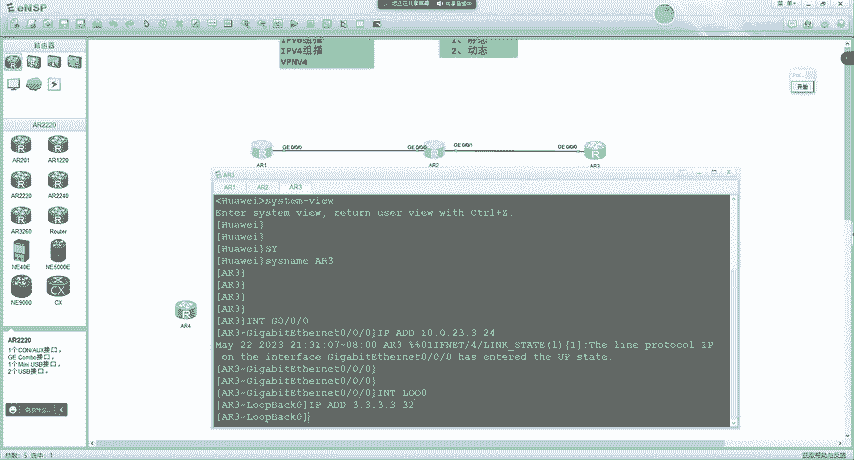

### 静态LSP配置实验
为了直观理解LSP，我们通过配置一条静态LSP来演示。

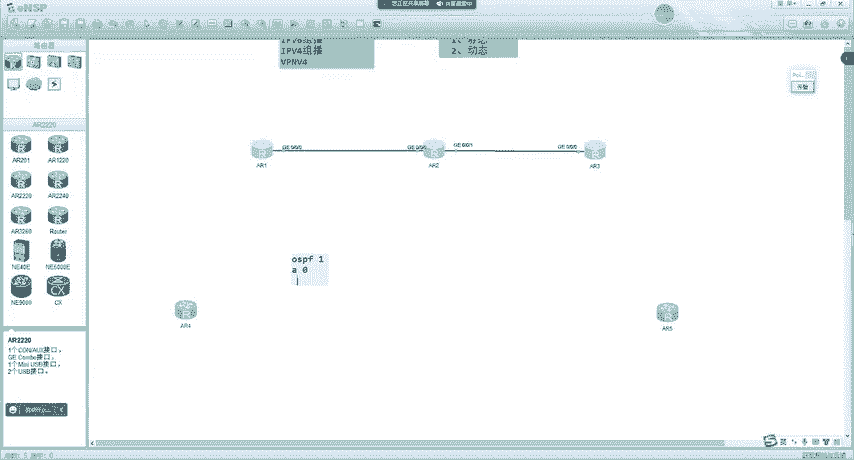

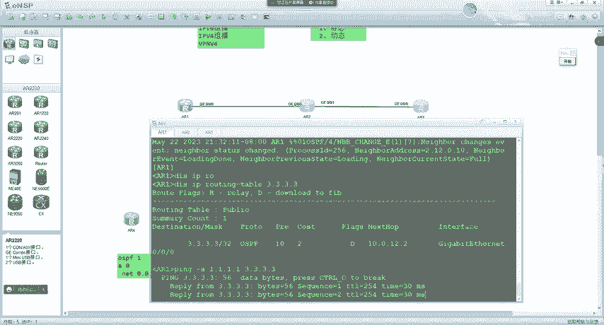

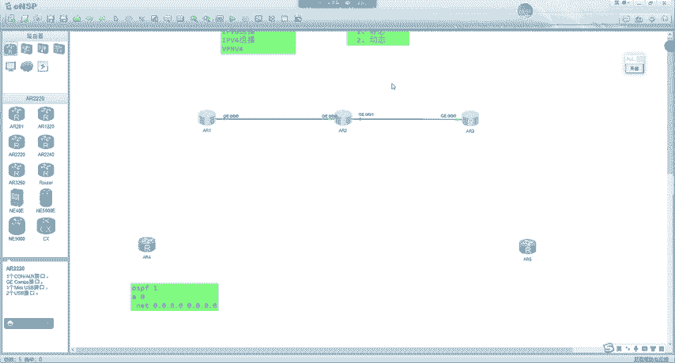

**实验拓扑**：AR1 (Ingress) —— AR2 (Transit) —— AR3 (Egress)
目标：让从AR1发往AR3环回口（3.3.3.3/32）的流量走静态LSP。

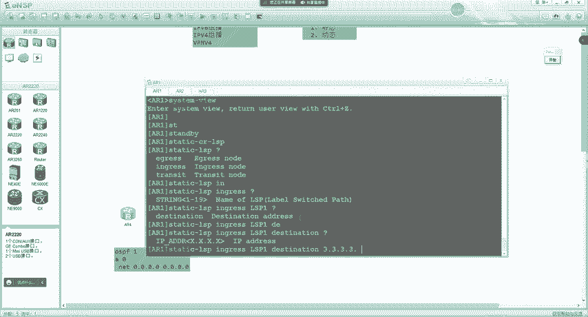

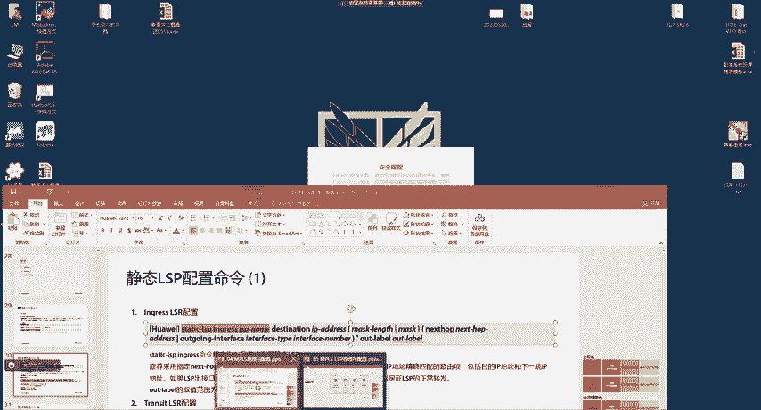

**配置思路**：
1.  在所有LSR上全局使能MPLS，并配置LSR ID。
2.  在数据转发接口上使能MPLS。
3.  逐跳配置静态LSP，指定入标签、出标签、下一跳和出接口。

**AR1 (Ingress) 配置**：
```bash
mpls lsr-id 1.1.1.1
mpls
#
interface GigabitEthernet0/0/0
 mpls
#
static-lsp ingress TO_R3 destination 3.3.3.3 32 nexthop 10.0.12.2 out-label 101
```

**AR2 (Transit) 配置**：
```bash
mpls lsr-id 2.2.2.2
mpls
#
interface GigabitEthernet0/0/0
 mpls
interface GigabitEthernet0/0/1
 mpls
#
static-lsp transit RSP1 incoming-interface GigabitEthernet0/0/0 in-label 101 nexthop 10.0.23.3 out-label 202
```

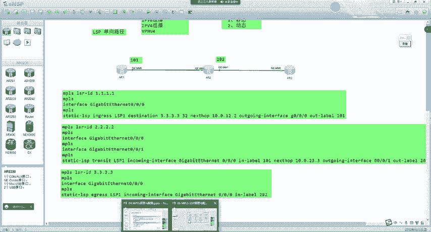

**AR3 (Egress) 配置**：
```bash
mpls lsr-id 3.3.3.3
mpls
#
interface GigabitEthernet0/0/0
 mpls
#
static-lsp egress RSP1 incoming-interface GigabitEthernet0/0/0 in-label 202
```

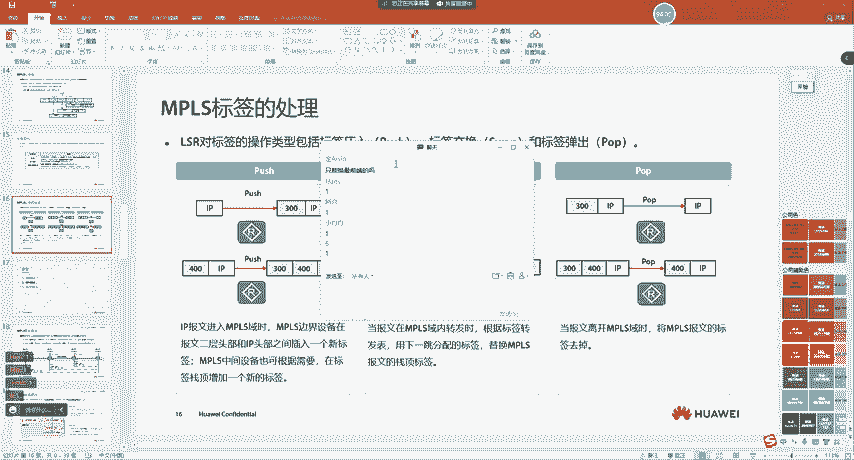

**验证与抓包**：
*   使用 `display mpls static-lsp` 查看各设备上的LSP状态。
*   从AR1 ping 3.3.3.3，并在链路上抓包。可以观察到：
    *   AR1发给AR2的报文，二层帧头后多了MPLS标签`101`。
    *   AR2发给AR3的报文，标签被交换为`202`。
    *   AR3收到后，弹出标签，进行IP路由转发。

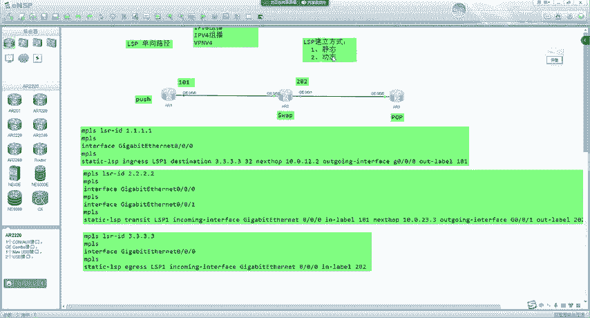

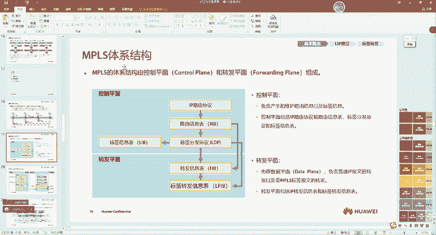

**MPLS标签处理动作**：
通过实验，我们可以看到LSR对标签的三种基本操作：
1.  **Push（压入）**：在Ingress LSR，为IP包加上MPLS标签。
2.  **Swap（交换）**：在Transit LSR，将入标签替换为出标签。
3.  **Pop（弹出）**：在Egress LSR，移除MPLS标签。

### 静态LSP的局限性
静态配置LSP就像配置静态路由，**工作量大、易出错、且无法自适应网络变化**。想象一下，在一个大型网络中为所有路由条目手动建立双向LSP，这几乎不可管理。因此，在实际网络中，主要使用**动态协议（如LDP、RSVP-TE、MP-BGP）** 来自动建立和维护LSP。

---

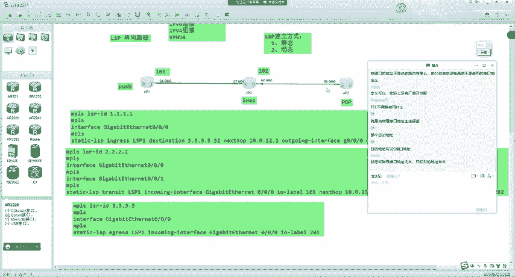

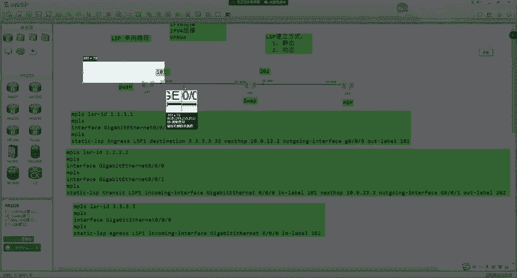

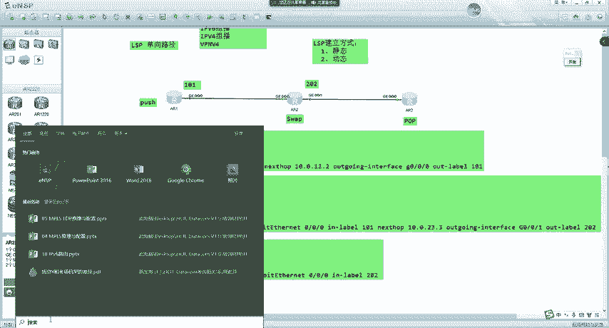

## 总结
本节课我们一起学习了两个关键内容：
1.  **BGP4+**：作为MP-BGP的一部分，它通过`MP_REACH_NLRI`和`MP_UNREACH_NLRI`属性来实现对IPv6路由信息的传递，配置逻辑与IPv4 BGP一脉相承。
2.  **MPLS基础**：我们探讨了MPLS的产生背景是为了提升转发效率，并深入学习了其核心概念，包括LSR、MPLS域、FEC、LSP以及标签的结构。通过一个静态LSP的实验，我们直观看到了基于标签的转发过程以及`Push`、`Swap`、`Pop`三种标签操作，同时也认识到静态配置的局限性，为后续学习动态标签分发协议打下了基础。

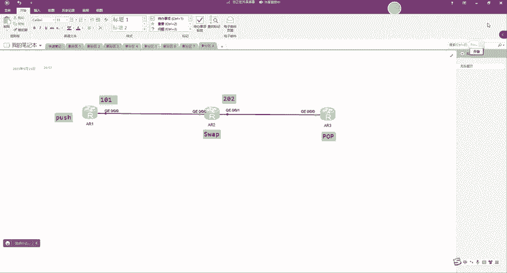

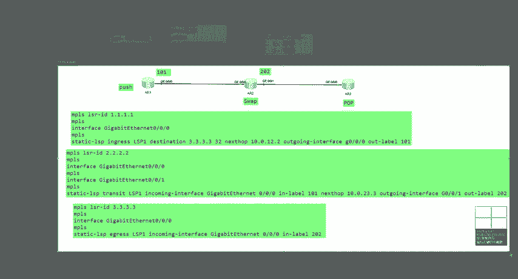

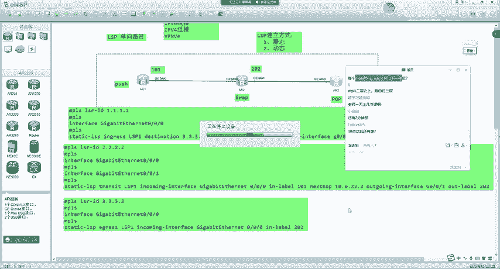

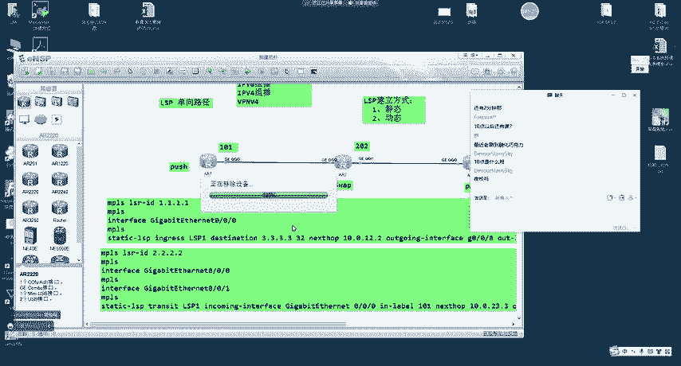

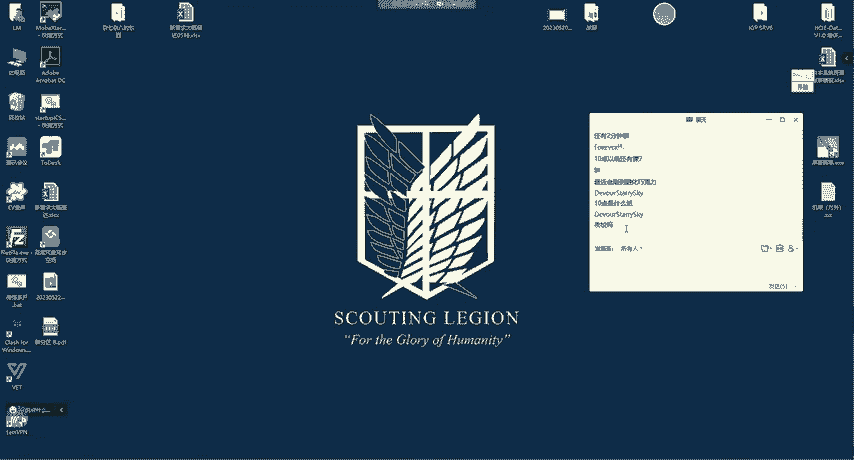

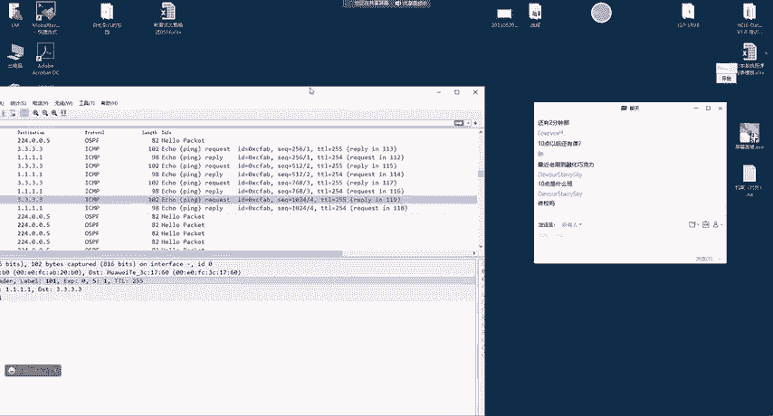

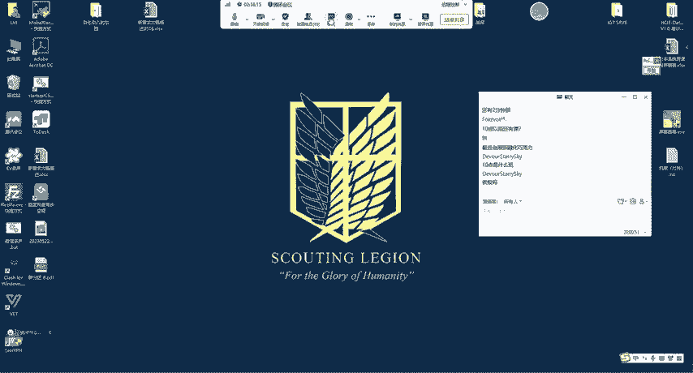

下节课，我们将继续深入MPLS，学习其体系结构以及如何通过LDP协议动态建立LSP。