# MPLS课程：P114：MPLS体系结构与LDP协议详解

## 概述
在本节课中，我们将深入学习MPLS的体系结构，并详细探讨其核心控制协议——标签分发协议（LDP）。我们将从MPLS的控制平面与转发平面入手，理解LSP的建立方式，并重点分析LDP协议的工作机制、邻居建立过程以及标签的发布与管理方式。

---

## MPLS体系结构：控制平面与转发平面

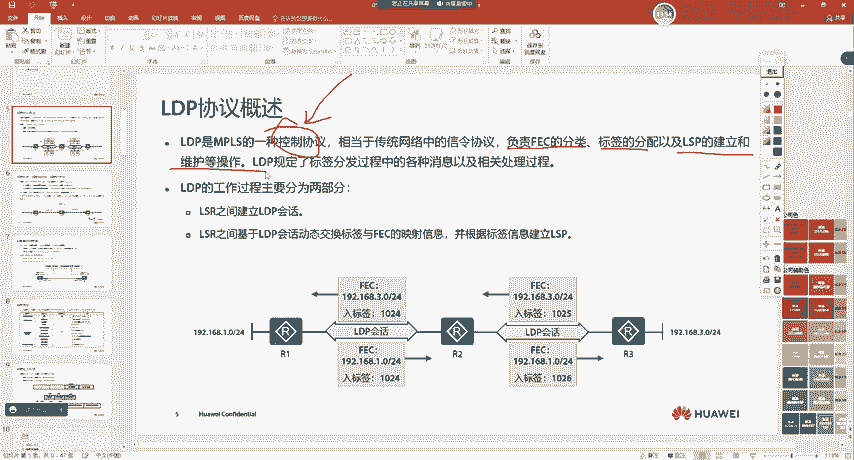

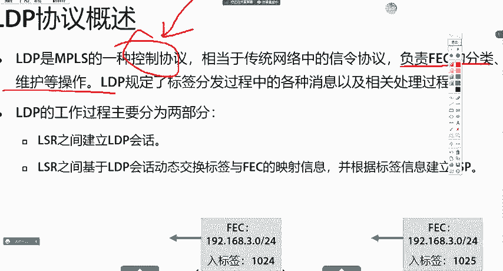

上一节我们介绍了MPLS对标签的压入、交换和弹出操作。本节中，我们来看看支撑这些操作的MPLS整体体系结构。

MPLS体系由**控制平面**和**转发平面**组成。

*   **控制平面**：负责根据路由信息生成标签，并建立标签转发路径。其核心工作是运行IP路由协议（如OSPF）生成路由表，然后由标签分发协议（如LDP）根据路由表（视为FEC）来分配标签并生成**标签转发信息表（LFIB）**。
*   **转发平面**：也称为数据平面，负责根据LFIB对收到的数据包（无论是IP包还是带标签的MPLS包）进行实际的转发。

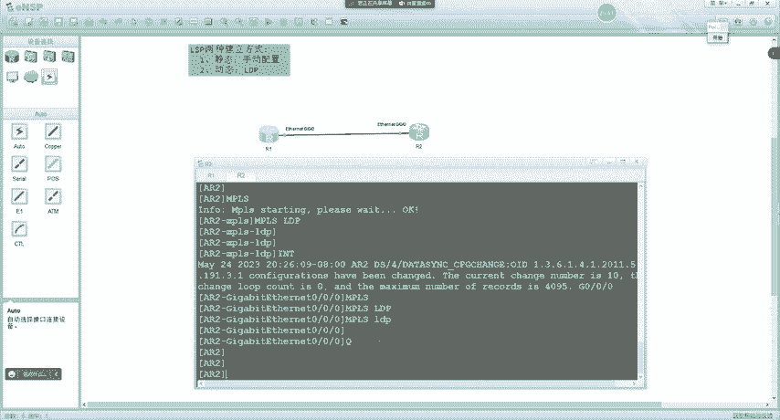

两个平面的协作关系可以概括为：**IP路由协议 -> 路由表 -> LDP协议 -> LFIB**。即使在启用MPLS的网络中，纯IP报文依然能通过传统的FIB表正常转发，MPLS只是在此基础上增加了对标签报文的转发能力。

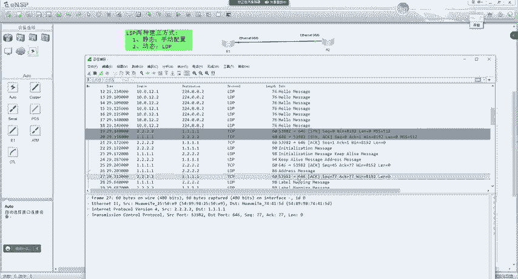

---

## LSP的建立方式

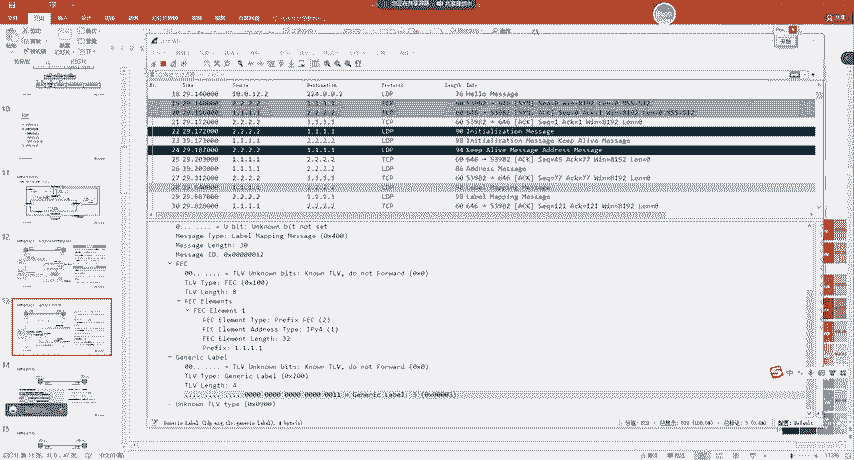

理解了MPLS的体系结构后，我们来看看标签交换路径（LSP）是如何建立的。

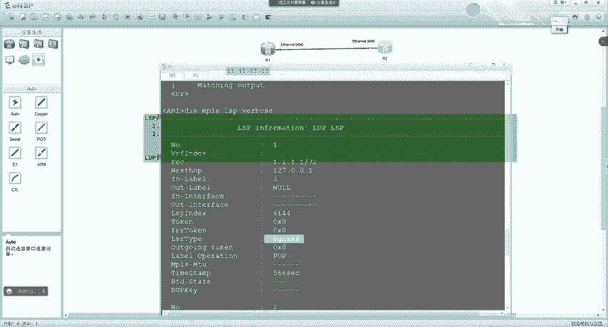

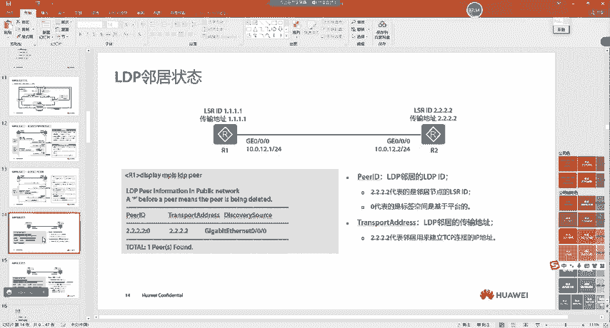

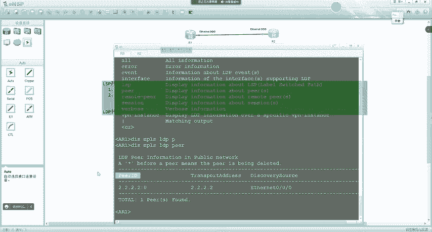

LSP的建立主要有两种方式：静态LSP和动态LSP。

以下是两种方式的对比：

| 特性 | 静态LSP | 动态LSP |
| :--- | :--- | :--- |
| **建立方式** | 管理员手工为每条FEC分配标签 | 通过标签分发协议（如LDP）自动建立 |
| **协议依赖** | 不使用标签发布协议 | 依赖LDP等协议 |
| **资源消耗** | 较少 | 相对较多 |
| **灵活性** | 差，无法根据拓扑变化动态调整 | 好，可动态适应网络变化 |
| **适用场景** | 小型、稳定的网络 | 中大型、需要灵活性的网络 |
| **配置原则** | 上游设备的出标签值必须等于下游设备的入标签值 | 由协议自动协商和分配 |

**核心概念**：
*   **FEC（转发等价类）**：在MPLS中，一组以相同方式（如通过同一条路径、使用相同的转发处理）转发的数据流。通常，**一条IP路由就被视为一个FEC**。
*   **LSP建立原则**：数据必须携带正确的标签，LSR才能正确处理。标签的分配和通告遵循**从下游到上游**的方向。例如，下游设备R2会告诉上游设备R1：“访问FEC X时，请打上标签1027发给我”。

---

## LDP协议详解

动态LSP的建立依赖于标签分发协议。接下来，我们重点学习最常用的LDP协议。

### LDP协议概述
LDP是MPLS的一种控制协议，主要负责**FEC的分类、标签的分配以及LSP的建立和维护**。其工作过程主要分为两步：
1.  与邻居建立LDP会话。
2.  在会话基础上交换标签映射消息，从而构建LSP。

### LDP基本概念
在深入学习LDP工作过程前，需要厘清几个关键概念：
*   **LDP会话**：两个LDP对等体之间交换标签消息的通信过程。
*   **LDP对等体**：相互交换LDP消息、建立LDP会话的两台LSR。
*   **传输地址**：用于建立LDP会话的TCP连接的IP地址。**默认情况下，传输地址等于设备的LSR ID**。因此，必须确保LSR ID是一个真实存在且路由可达的地址，否则LDP会话无法建立。
*   **LDP标识符**：格式为`<LSR-ID>:<标签空间标识符>`。标签空间标识符为0表示基于平台（每设备）的标签空间，这是最常见的方式。

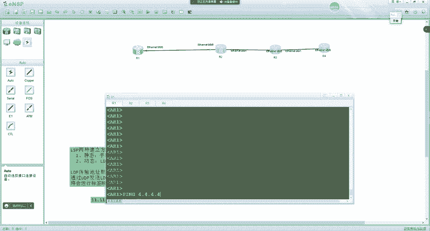

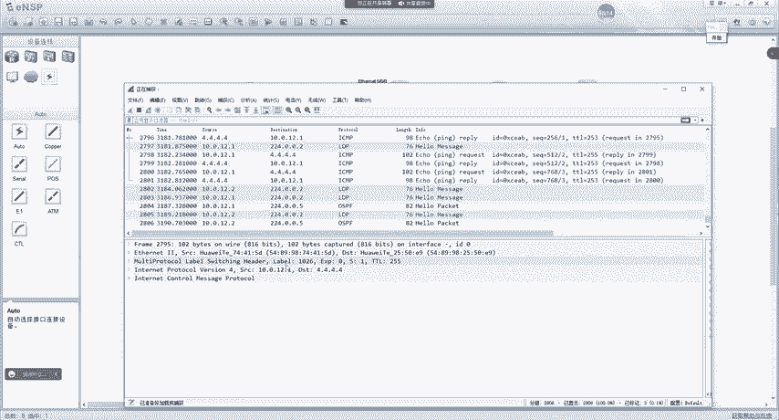

### LDP邻居建立过程
LDP邻居建立是动态LSP构建的第一步。以下是其建立流程的简要说明：

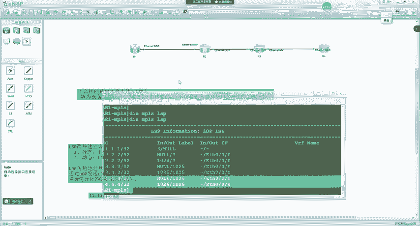

1.  **邻居发现**：双方通过向组播地址`224.0.0.2`发送**Hello报文（UDP 646端口）**来发现直连的LDP邻居。Hello报文中携带自己的传输地址。
2.  **TCP连接建立**：双方比较Hello报文中的传输地址，**地址较大的一方作为主动方，发起TCP连接**。
3.  **会话初始化**：TCP连接建立后，主动方发送**Initialization报文**，其中包含LDP协议版本、标签分发方式等参数进行协商。
4.  **会话确认**：被动方若接受参数，则回复**Keepalive报文**进行确认，同时也会发送自己的Initialization报文。主动方收到后也回复Keepalive报文。
5.  **会话建立**：双方成功交换Keepalive报文后，LDP会话进入**Operational状态**，此时可以开始交换标签映射消息。

**关键点**：LDP邻居的稳定建立，根本在于**传输地址（默认=LSR ID）的路由可达性**。

### LDP标签发布与管理
LDP会话建立后，设备之间开始通告标签，从而形成LSP。这个过程由三组重要的模式控制：

1.  **标签发布方式**
    *   **下游自主（DU）**：LSR无需上游请求，主动向上游通告标签映射。
    *   **下游按需（DoD）**：LSR只有在收到上游的标签请求后，才向上游通告标签映射。
    *   **对比**：DU方式收敛更快，DoD方式更节省标签资源。

2.  **标签分配控制方式**
    *   **独立（Independent）**：LSR可以自主地为FEC分配标签并通告，无需等待下游的标签。
    *   **有序（Ordered）**：LSR必须等待收到下游对于某FEC的标签映射后，才能向上游通告该FEC的标签映射。
    *   **对比**：独立方式可能导致暂时的LSP断裂，但建立更快；有序方式能保证LSP的端到端完整性，更可靠。

3.  **标签保持方式**
    *   **自由（Liberal）**：LSR保留从任何LDP对等体收到的标签映射，即使该对等体不是当前最优下一跳。
    *   **保守（Conservative）**：LSR只保留来自最优下一跳的标签映射。
    *   **对比**：自由方式提供了快速的路径切换能力（当主路径失效时，可立即使用备用标签），但消耗更多内存；保守方式节省内存，但路径切换时有延迟。

**华为设备默认采用 `DU + 有序 + 自由` 的组合**。这种组合在保证可靠性的同时，实现了较快的收敛速度和故障切换能力，是较为理想的默认设置。

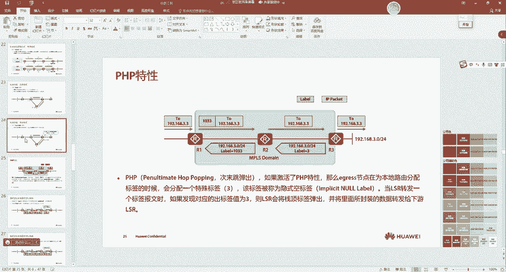

---

## 总结
本节课中，我们一起学习了MPLS的核心体系结构与LDP协议。

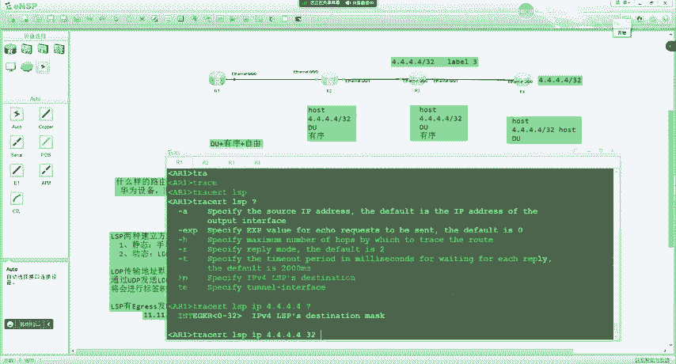

我们首先剖析了MPLS控制平面与转发平面的分工协作。然后，对比了静态与动态两种LSP建立方式，并明确了动态方式更适用于现代网络。之后，我们深入探讨了动态LSP的核心——LDP协议，详细讲解了其基本概念、邻居建立的完整流程（发现->TCP连接->初始化->建立），以及控制标签分发的三种关键模式（发布、分配控制、保持方式）。理解这些模式（尤其是默认的DU+有序+自由组合）对于理解MPLS网络如何自动、可靠地构建转发路径至关重要。

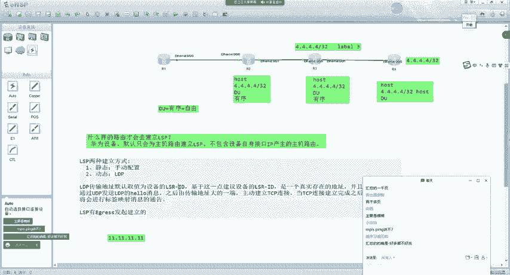

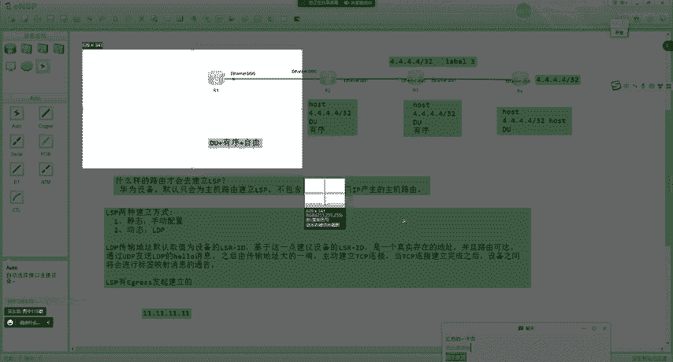

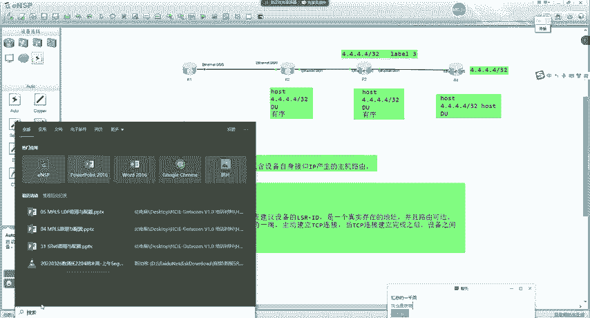

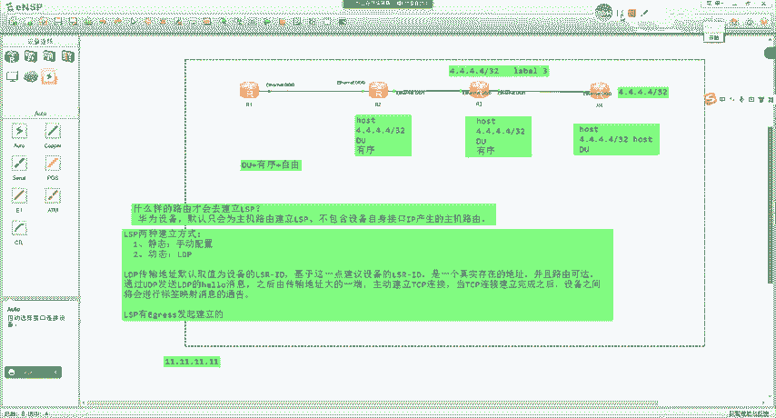

通过本课的学习，你应该对MPLS如何从路由信息自动生成标签转发路径有了清晰的认识，为后续学习更复杂的MPLS应用（如VPN）打下了坚实的基础。