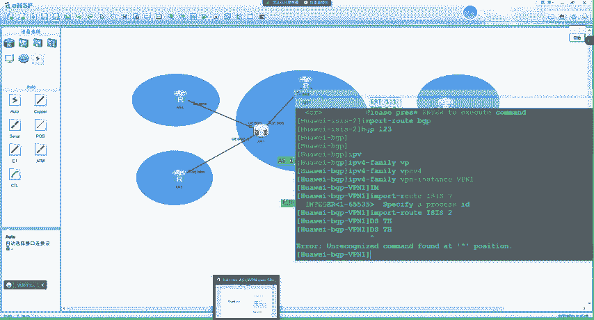
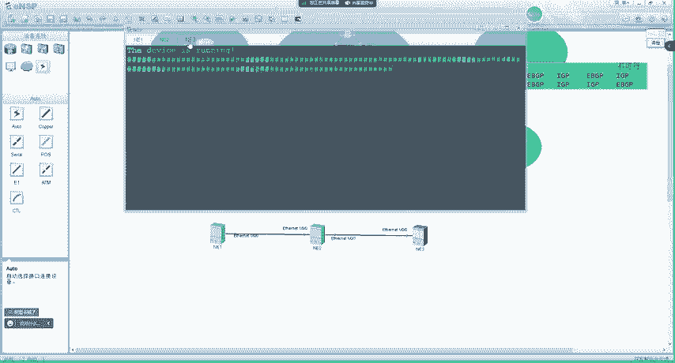
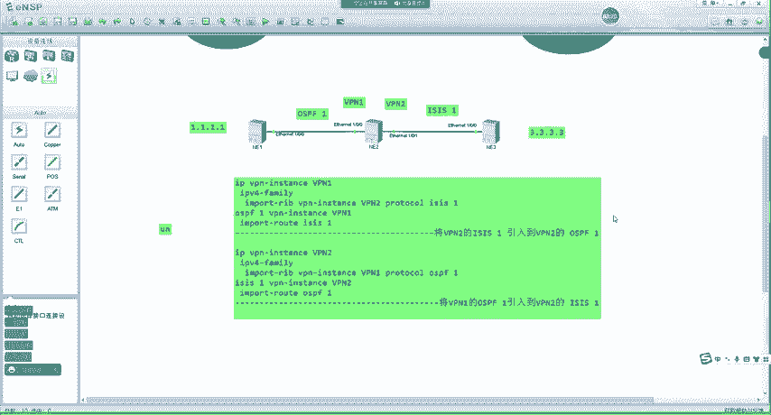
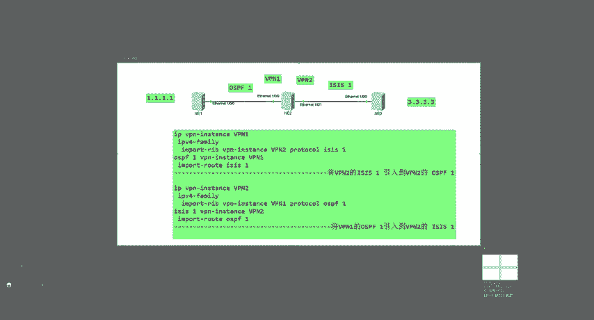
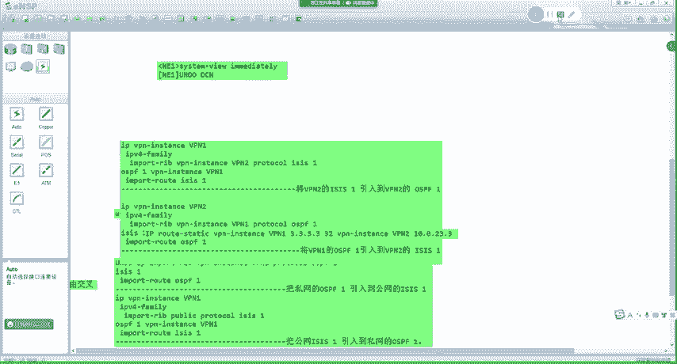

# MPLS VPN 部署与应用：P117：MPLS VPN 高级特性与部署方案

在本节课中，我们将学习 MPLS VPN 网络中的几种高级部署方案和特性，包括 MCE（多实例 CE）、跨域 VPN、不同 VPN 实例间的路由互通，以及 Hub-Spoke 组网中的路由策略。这些知识将帮助你更灵活地设计和部署复杂的 MPLS VPN 网络。

## 概述：MCE 多实例 CE 技术

上一节我们介绍了 MVPN 的几种组网方式。本节中，我们来看看一种特殊的应用场景——MCE。

MCE 技术用于解决同一个 VPN 客户内部不同业务需要隔离的需求。例如，一个公司可能有办公（OA）、语音、视频等多种业务，它们虽然属于同一个客户，但希望在网络层面实现隔离，以获得不同的服务质量保障。

传统的做法是为每种业务单独部署一台 CE 设备，并通过不同的物理链路连接到 PE。但这会增加设备成本和维护复杂度。

MCE 的核心思想是：**在一台物理 CE 设备上，通过创建多个 VPN 实例（类似于虚拟路由器 VRF），逻辑上模拟出多台 CE 设备**。每个 VPN 实例拥有独立的路由表、路由协议和接口。然后，PE 设备上对应的 VPN 实例分别与 CE 上不同的 VPN 实例对接。

**实现逻辑**：
```
PE1-VPN1 <---> CE-VRF1 (承载业务A)
PE1-VPN2 <---> CE-VRF2 (承载业务B)
PE1-VPN3 <---> CE-VRF3 (承载业务C)
```
流量进入 CE 的特定 VRF 后，只会查找该 VRF 的路由表，并转发到 PE 上对应的 VPN 实例，最终到达远端站点的相同 VPN 实例，从而实现业务间的严格隔离。这本质上相当于为不同业务创建了不同的“虚拟公司”VPN。

## 跨域 MPLS VPN 简介

我们之前学习的 MPLS VPN 都是“单域”的，即整个 MPLS 骨干网处于同一个自治系统（AS）内。但在实际网络中，运营商的骨干网可能由多个 AS 组成。



**跨域 MPLS VPN** 就是指 VPN 站点需要跨越多个 AS 进行互联。解决跨域问题有多种技术方案（例如 Option A/B/C），但这涉及到更复杂的 BGP 和标签分发机制。目前我们只需了解这个概念，后续课程会深入讲解具体的跨域方案。

## 不同 VPN 实例间的路由互通

在标准的 MPLS VPN 中，一个 VPN 实例只能与 RT（Route Target）匹配的其他 VPN 实例通信，无法与公网或其他 RT 不匹配的 VPN 实例通信。但在某些场景下，我们需要实现它们之间的路由互通。

路由互通主要分为两种场景：
1.  **公网与私网路由互通**：即 `public` 路由表与某个 VPN 实例路由表之间的路由引入。
2.  **私网与私网路由互通**：即两个不同 VPN 实例路由表之间的路由引入。

这需要通过**路由策略**，在不同路由表之间手动引入（import）路由来实现。下面我们通过实验来理解具体的配置方法。

### 实验：公网与私网路由互通

假设我们有如下简单拓扑：NE1（运行 OSPF，属于 VPN_A）、NE2（PE 设备）、NE3（运行 ISIS，属于公网）。目标是让 NE1 (1.1.1.1) 与 NE3 (3.3.3.3) 能够互通。

**配置思路与关键命令**：

1.  **将私网（VPN_A）路由引入公网**：
    在 PE (NE2) 上，将 VPN_A 实例中的 OSPF 路由引入到公网（public）路由表。
    ```bash
    [NE2] ip import-rib vpn-instance VPN_A public
    ```
    此时，公网路由表中会出现 1.1.1.1 的路由，但其类型仍是 OSPF。

2.  **在公网协议中发布私网路由**：
    在 PE (NE2) 的公网 ISIS 进程中，引入 OSPF 路由。
    ```bash
    [NE2-isis-1] import-route ospf 1
    ```
    这样，NE3 就能通过 ISIS 学到 1.1.1.1 的路由。

3.  **将公网路由引入私网**：
    在 PE (NE2) 的 VPN_A 实例地址族下，将公网路由引入。
    ```bash
    [NE2-vpn-instance-VPN_A-af-ipv4] import-rib public
    ```
    此时，VPN_A 的路由表中会出现公网路由（如 3.3.3.3），类型为 ISIS。

4.  **在私网协议中发布公网路由**：
    在 PE (NE2) 的 VPN_A OSPF 进程中，引入 ISIS 路由。
    ```bash
    [NE2-ospf-1-vpn-instance-VPN_A] import-route isis 1
    ```
    这样，NE1 就能通过 OSPF 学到 3.3.3.3 的路由。




完成以上步骤后，NE1 与 NE3 之间即可实现 IP 连通性。这个过程的本质是**在 PE 设备上，通过路由引入，在不同层次的路由表（公网public vs. 私网VPN）和路由协议（OSPF vs. ISIS）之间搭建桥梁**。


### 实验：私网与私网路由互通

假设在 PE 上创建了两个 VPN 实例：VPN_A 和 VPN_B，分别连接不同的客户站点。现在需要让它们能够互相访问。

**配置思路与关键命令**：

1.  **将 VPN_B 的路由引入 VPN_A**：
    在 PE 的 VPN_A 实例地址族下，引入 VPN_B 实例的路由。
    ```bash
    [PE-vpn-instance-VPN_A-af-ipv4] import-rib vpn-instance VPN_B
    ```

2.  **在 VPN_A 的 IGP 中发布引入的路由**：
    在 VPN_A 的 OSPF 进程中，引入这些路由（假设 VPN_B 内部运行 ISIS）。
    ```bash
    [PE-ospf-1-vpn-instance-VPN_A] import-route isis 1
    ```

3.  **将 VPN_A 的路由引入 VPN_B**（反向操作）：
    在 PE 的 VPN_B 实例地址族下，引入 VPN_A 实例的路由。
    ```bash
    [PE-vpn-instance-VPN_B-af-ipv4] import-rib vpn-instance VPN_A
    ```

4.  **在 VPN_B 的 IGP 中发布引入的路由**：
    在 VPN_B 的 ISIS 进程中，引入 OSPF 路由。
    ```bash
    [PE-isis-1-vpn-instance-VPN_B] import-route ospf 1
    ```

通过这种双向的路由引入，两个原本隔离的 VPN 实例就可以实现路由互通。**BGP VPNv4 路由也可以通过类似方式引入**，但需要注意，该命令对本地 `network` 命令发布的路由可能不生效，通常用于引入从其他 PE 学来的远端路由。

## Hub-Spoke 组网方案细化

上节课我们实验了 Hub-Spoke 组网。Hub-Spoke 中，Hub 站点与 Spoke 站点之间、以及 Spoke 站点之间的路由传递需要精心设计。主要有以下几种可行的 IGP/BGP 组合方案：

以下是可行的 Hub-Spoke 组网方案：
*   **方案一**：Hub-CE 与 Hub-PE、Spoke-CE 与 Spoke-PE **全部使用 EBGP**。
*   **方案二**：Hub-CE 与 Hub-PE、Spoke-CE 与 Spoke-PE **全部使用 IGP**（如 OSPF, ISIS）。
*   **方案三**：Hub-CE 与 Hub-PE 使用 **EBGP**，Spoke-CE 与 Spoke-PE 使用 **IGP**。





**为什么没有“Hub 端用 IGP，Spoke 端用 EBGP”的方案？**
这种方案可能导致路由环路和路由震荡。简单来说，从 Spoke 传来的 EBGP 路由带有 AS_Path 属性，在 Hub 端引入 IGP 后，AS_Path 信息会丢失。当这条路由再从 Hub 发回 Spoke 时，Spoke 会同时收到一条来自原始 Spoke 的 EBGP 路由（带 AS_Path）和一条来自 Hub 的 EBGP 路由（AS_Path 被替换或丢失）。根据 BGP 选路规则，设备可能会优选没有 AS_Path 或 AS_Path 更短的路由，从而导致原有路由被撤销，引发持续的路由振荡。因此，该方案不可行。

## 特殊场景：AS 号替换与 SoO 属性

在 Hub-Spoke 或某些网络整合场景中，可能会遇到两端 CE 的 AS 号相同的情况（例如公司并购）。BGP 默认会拒绝接收 AS_Path 中包含自身 AS 号的路由，以防止环路。

**解决方案一：允许接收重复 AS 号**
在路由接收方（PE）的 BGP 对等体配置下，允许接收 AS_Path 中包含本地 AS 号的路由。
```bash
[PE-bgp-af-ipv4] peer <ce-ip> allow-as-loop
```

**解决方案二：AS 号替换**
在路由发送方（PE）的 BGP 对等体配置下，配置 AS 号替换。当 PE 向 CE 发送路由时，如果发现路由的 AS_Path 中第一个 AS 号与 CE 的 AS 号相同，则会将其替换为 PE 自身的 AS 号，从而“骗过”CE 的 AS_Path 环路检测。
```bash
[PE-bgp-af-ipv4] peer <ce-ip> substitute-as
```

**SoO（Site-of-Origin）属性防环**
启用 `substitute-as` 后，可能会破坏原始的 AS_Path 防环机制，引入新的环路风险。此时可以启用 SoO 属性。
*   **原理**：PE 在从某个站点（通过特定邻居）学习路由时，为该路由打上唯一的 SoO 标签（如 `200:1`）。当 PE 需要向该站点的另一个邻居（或同一邻居）发送路由时，会检查路由的 SoO 值。如果 SoO 值与目标邻居配置的 SoO 值匹配，则 PE 不会发送该路由，因为这意味着该路由最初就来源于这个站点，再发回去会导致环路。
*   **配置**：
    ```bash
    [PE-bgp-af-ipv4] peer <ce-ip> soo <soo-value>
    ```
SoO 是一种有效的站点级防环机制，尤其在多归属（CE 双上联）和 AS 号替换场景中非常有用。

## 总结

本节课中我们一起学习了 MPLS VPN 的几种高级部署与特性：
1.  **MCE（多实例 CE）**：通过单台 CE 设备虚拟多个 VPN 实例，经济高效地实现客户内部业务隔离。
2.  **跨域 VPN 概念**：了解了 VPN 需要跨越多个 AS 互联的场景。
3.  **路由互通**：掌握了通过路由引入实现公网与私网、以及不同私网 VPN 实例间通信的方法和配置。
4.  **Hub-Spoke 细化**：明确了 Hub-Spoke 组网中可用的 IGP/BGP 方案组合及其原因。
5.  **AS 号处理**：学习了通过 `allow-as-loop` 或 `substitute-as` 解决 CE 同 AS 号问题，并了解了使用 SoO 属性防止因此产生环路。



这些高级特性使得 MPLS VPN 能够适应更复杂、更灵活的网络规划需求，是构建大型、多业务企业网络的关键技术。