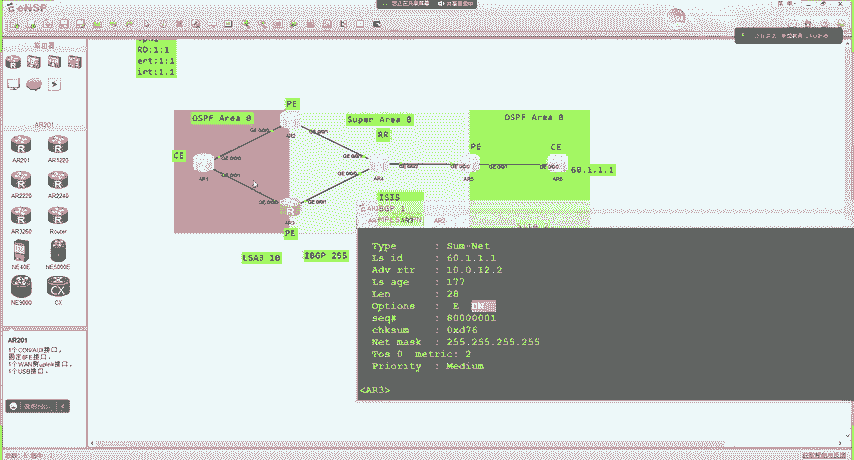
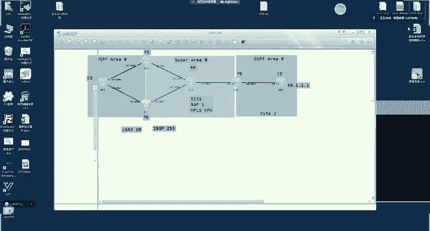
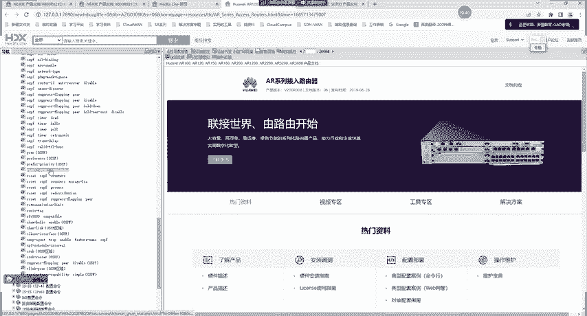
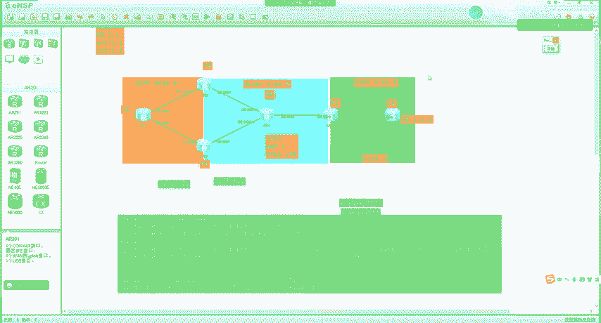
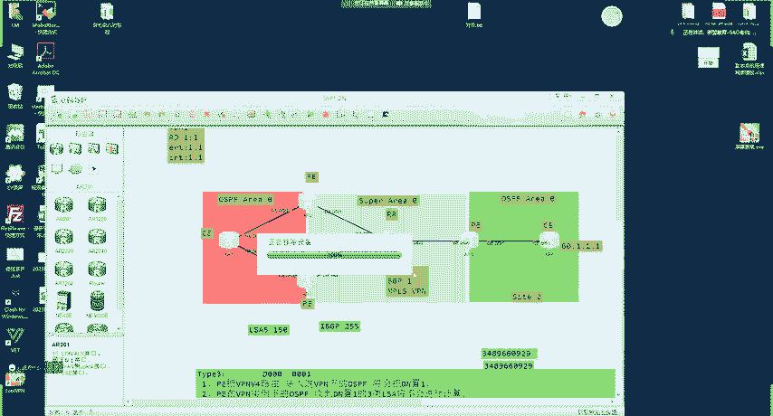
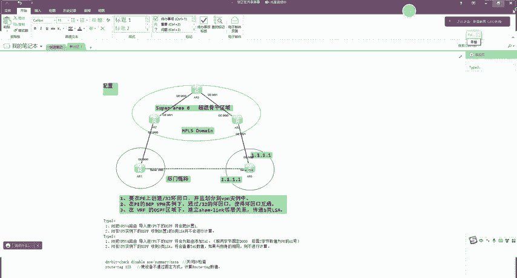

# MPLS VPN 技术详解：P119：OSPF 防环机制与 Shamlink

## 概述
在本节课中，我们将学习 MPLS VPN 网络中，当 OSPF 作为 PE-CE 间路由协议时，如何通过 DN（Down Bit）比特和 Route Tag 机制来防止路由环路。我们将通过一个具体的实验拓扑，详细解析 Type 3 和 Type 5 LSA 的防环原理。

---

## 实验环境搭建

上一节我们介绍了 MPLS VPN 的基本架构，本节中我们来看看一个具体的双归属组网环境。

以下是实验拓扑与初始配置：
*   **AR6** 作为远端站点，拥有环回口地址 `60.1.1.1`。
*   **AR2** 和 **AR3** 作为 PE 设备，通过 MP-BGP 骨干网与 **AR4（作为 RR）** 相连。
*   **AR1** 作为 CE 设备，与 PE（AR2 和 AR3）运行 OSPF。
*   在 AR2 的 OSPF 进程下，配置了引入 BGP 路由。





关键配置如下：
```bash
# 在 AR2 上的 OSPF 配置示例
ospf 1 vpn-instance VPN1
 area 0.0.0.0
  network 10.0.12.2 0.0.0.0
  network 10.0.13.2 0.0.0.0
 import-route bgp
```

在此配置下，AR6 的 `60.1.1.1` 路由将通过 MP-BGP 传递到 AR2 和 AR3。AR2 会将其引入 OSPF，生成一条 Type 5 LSA 传递给 CE（AR1）。

---

## Type 3 LSA 的防环机制：DN 比特

现在，我们来分析路由从 CE（AR1）传回另一台 PE（AR3）时，如何防止环路。

根据实验，AR3 会从两个来源学习到 `60.1.1.1` 的路由：
1.  来自 RR（AR4）的 MP-BGP 路由（优先级 255）。
2.  来自 CE（AR1）的 OSPF Type 3 LSA 路由（优先级 150）。

理论上，OSPF 内部路由（150）优于 BGP 路由（255），AR3 应该优选 OSPF 路由。但查看 AR3 的路由表，却发现其优选了 BGP 路由。

**原因在于防环机制**。在 MPLS VPN 的 OSPF 多实例环境中，PE 设备将 VPNv4 路由导入到 VPN 实例的 OSPF 进程时，会在生成的 **Type 3 LSA 中设置 DN（Down Bit）标志位**。

防环规则如下：
1.  **设置规则**：PE 将 VPNv4 路由导入到 **VPN 实例的 OSPF** 时，会在生成的 LSA 中设置 DN 比特。
2.  **检查规则**：PE 在 **VPN 实例的 OSPF** 中收到 DN 比特被置位的 **Type 3 LSA** 时，**不会** 将其计算进路由表。

因此，AR3 收到来自 AR1（实为源自 AR2）的 Type 3 LSA 后，因为其 DN 比特为 1，便忽略此 LSA，从而避免了在 PE 之间形成路由环路。此时，AR3 只能通过 BGP 学习到该路由。

> **注意**：此机制仅在 VPN 实例的 OSPF 中生效，公网 OSPF 不涉及 DN 比特。

我们可以通过命令关闭 DN 比特检查来验证：
```bash
# 在 AR3 的 OSPF VPN 实例视图下
ospf 1 vpn-instance VPN1
 area 0.0.0.0
  vlink-peer 10.0.13.1
  disable-dn-bit-check summary   # 关闭对 Type 3 LSA 的 DN 比特检查
```
关闭后，AR3 的路由表将优选 OSPF 路由，但这会引入潜在环路风险，**生产环境中通常保持默认开启**。



---

## Type 5 LSA 的防环机制：Route Tag

除了 Type 3 LSA，PE 也可能将 VPNv4 路由以 Type 5 LSA 的形式引入 OSPF。其防环机制依赖于 **Route Tag**。

我们在 AR6 上创建一条静态路由 `192.168.1.0/24` 并引入 OSPF。AR2 通过 BGP 学到后，会将其还原为 Type 5 LSA 发布给 AR1，再传至 AR3。

查看 AR2 生成的这条 Type 5 LSA，会发现其 **Route Tag 值非常大**（例如 `3489660929`），而非普通的 `1`。这是防环的关键。

**Route Tag 的生成规则如下**：
*   PE 将 VPNv4 路由导入到 VPN 实例的 OSPF 时，会自动生成一个 Route Tag。
*   **Tag 值 = 0xD0000000 + 本端 PE 的 BGP AS 号**。
    *   前两个字节固定为 `0xD000`。
    *   后两个字节为本设备的 BGP AS 号（例如 AS 1 即为 `0x0001`）。
*   计算示例：`0xD0000001` 转换为十进制即为 `3489660929`。

**防环检查规则**：
PE 在 VPN 实例的 OSPF 中收到 Type 5 LSA 时，会检查其 Route Tag 值。如果该 Tag 值 **与根据自身 AS 号计算出的值相同**，则 PE **不会** 计算此 LSA。

因此，AR3（同属 AS 1）收到 Tag 为 `3489660929` 的 LSA 时，因与自身计算值相同，便忽略此路由。AR3 最终仍通过 BGP 学习路由。

同样，我们可以通过命令修改 Tag 值来绕过检查：
```bash
# 在 AR3 上修改 OSPF 引入外部路由的默认 Tag
route-tag 123
```
同时，需注意 Type 5 LSA **同样携带 DN 比特**，可能也需要关闭其检查：
```bash
# 在 AR3 的 OSPF VPN 实例视图下
ospf 1 vpn-instance VPN1
 area 0.0.0.0
  disable-dn-bit-check ase      # 关闭对 Type 5/7 LSA 的 DN 比特检查
```

> **提示**：Type 7 LSA 的防环机制与 Type 5 LSA 相同。

---

## 与其他协议的对比

学完 OSPF 的防环机制，你可能会问：IS-IS 和 BGP 如何防环？

以下是简要对比：
*   **BGP**：防环最简单。PE 和 CE 通常属于不同 AS，通过 AS_Path 属性即可天然防环。
*   **IS-IS**：设计定位不同，**没有**类似的自动防环机制（如 DN 比特或特殊 Tag）。在双点双向引入场景中，必须像传统网络一样，**手动配置路由策略**（如打 Tag 并过滤）来避免环路。
*   **OSPF**：因其在企业网中广泛应用，场景复杂，故设计了（DN比特 + Route Tag）双重自动化防环机制，最为周全。

---

## 知识总结与考题分析

本节课中我们一起学习了 MPLS VPN 中 OSPF 的防环机制。我们来回顾核心要点并分析两道考题。

**核心要点总结**：
1.  **防环场景**：发生在 PE-CE 间运行 OSPF 的双归属组网中，防止路由在 PE 间循环引入。
2.  **Type 3 LSA 防环**：依靠 **DN（Down Bit）** 比特。PE 发出的 3 类 LSA 置位 DN，其他 PE 收到后不计算。
3.  **Type 5/7 LSA 防环**：依靠 **Route Tag**。PE 根据公式 **`0xD0000000 + 本端AS号`** 自动生成 Tag，其他 PE 对比后若相同则不计算。
4.  **命令提示**：
    *   `disable-dn-bit-check { summary | ase }`：关闭 DN 比特检查（慎用）。
    *   `route-tag <value>`：修改路由 Tag，影响防环计算。
5.  **协议对比**：OSPF 防环机制最完善；IS-IS 需手动配置；BGP 依靠 AS_Path 天然防环。

**考题分析**：
1.  **题目**：在 MPLS VPN 组网中，PE 向 OSPF 引入其他 PE 学来的 VPN 路由时，可以产生几种 LSA？
    *   **答案**：Type 3, Type 5, Type 7。PE 根据 VPN 路由的来源和 OSPF 区域类型，可能将其以 3 类（区域间）、5 类（外部路由）或 7 类（NSSA 区域）LSA 的形式发布。
2.  **题目**：CE 通过 BGP 传递路由给 PE 时，可能会携带 SoO（Site-of-Origin）属性。
    *   **答案**：错误。SoO 是 BGP 的扩展团体属性，用于在 **PE 之间** 传递的 **VPNv4 路由** 上，防止路由回馈到源站点。在 **PE 与 CE 之间** 传递的是普通 **IPv4 路由**，不会携带 SoO 属性。

---





## 实验建议与下节预告



建议你根据本节课的讲解，亲手搭建并配置实验环境。通过查看 LSA 详细信息、路由表变化，以及尝试开关防环命令，可以更深刻地理解 OSPF 在 MPLS VPN 中的防环原理。


下节课，我们将进入一个更具挑战性的主题：**MPLS VPN 的跨域解决方案**。请做好准备，我们下次课见！🚀