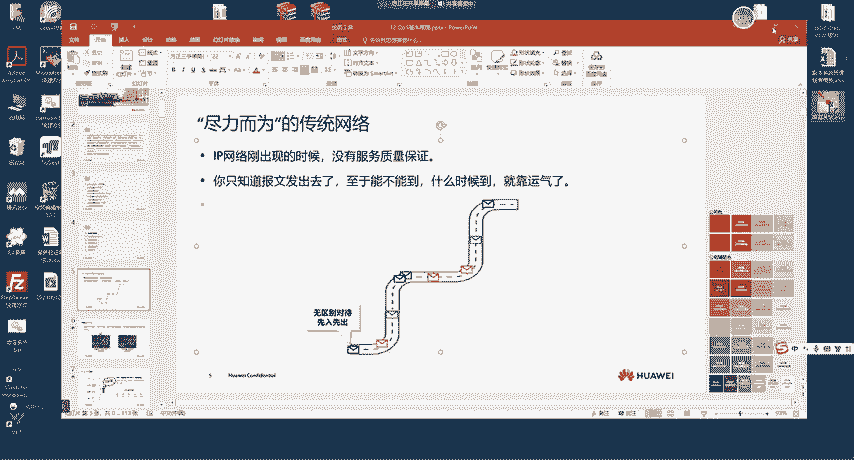
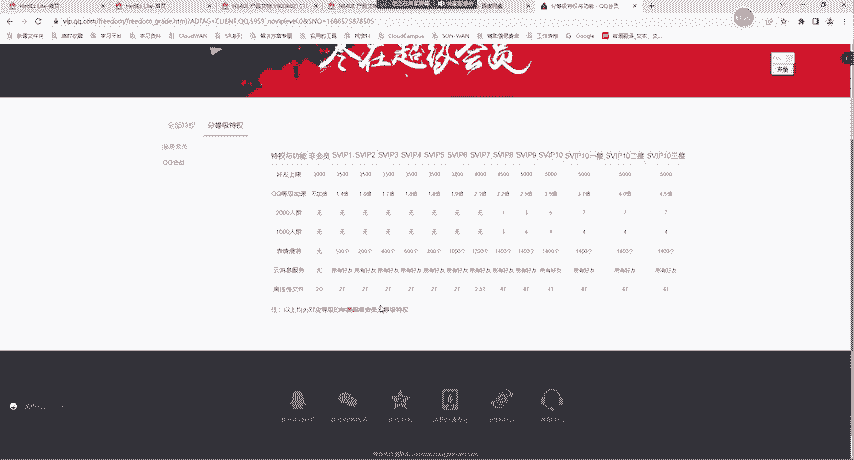
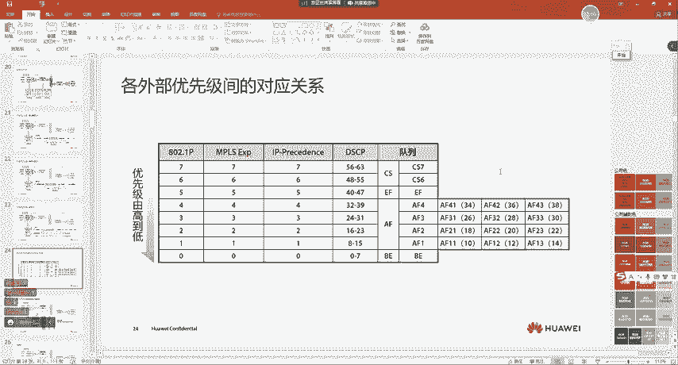
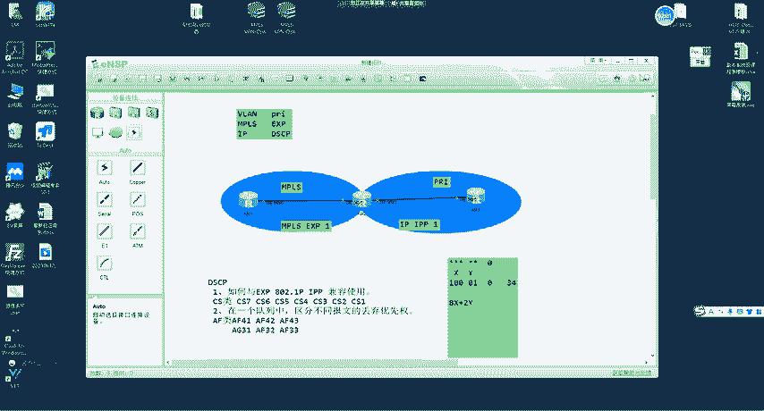
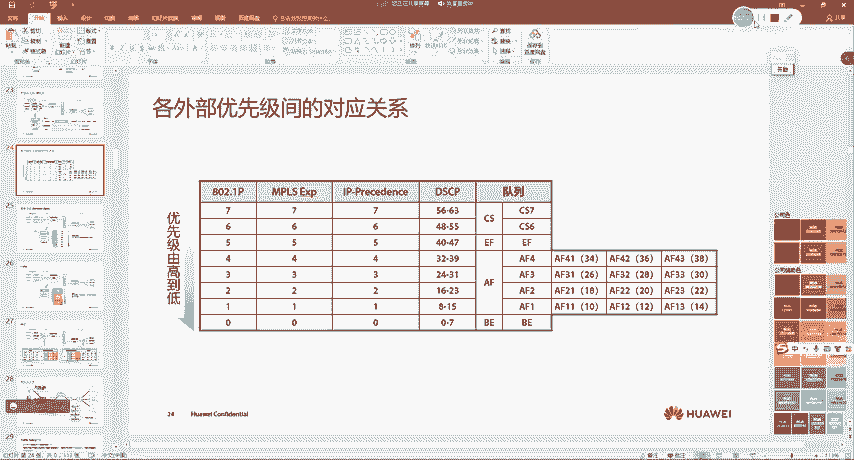

# 华为认证HCIE Datacom课程：第59节：QoS服务模型与报文标记

## 概述
在本节课中，我们将要学习QoS（服务质量）技术。QoS是网络管理中一项重要且抽象的技术，用于在网络带宽有限的情况下，为不同类型的网络流量提供差异化的服务，例如保证关键业务的流畅性、限制非关键业务的带宽等。我们将从QoS的基本概念、产生背景讲起，重点介绍其核心思想——区分服务模型，并深入讲解报文分类与标记的原理。

---




## QoS技术简介
网络带宽资源总是有限的。无论带宽如何提升，总会有新的应用（如高清视频、VR、无人驾驶）出现并占用这些资源。因此，在网络带宽有限的前提下，如何保证不同业务流量的优先传输级别，就成为网络管理的关键。QoS技术正是为了解决这个问题而生的，它可以理解为网络流量的“调度员”或“交警”，负责为不同的数据报文分配不同的优先级和资源。

上一节我们介绍了QoS的基本概念，本节中我们来看看影响网络通讯质量的具体因素。

以下是影响网络通讯质量的几个关键因素：
*   **带宽**：单位时间内能够传输的数据量。带宽不足会导致网络卡顿。
*   **延迟**：数据从发送端到接收端所需的时间。高延迟在实时应用（如语音通话、在线游戏）中影响显著。
*   **抖动**：数据包到达目的地的时间间隔不一致。抖动会影响语音、视频的连贯性。
*   **丢包率**：传输过程中丢失的数据包比例。丢包会导致信息不完整或需要重传。
*   **可用性**：网络服务的可靠性和持续可用时间。频繁断网会严重影响服务质量。

为了提升用户对这些因素的体验，QoS提供了不同的服务模型来实现。

---

## QoS服务模型
QoS通过不同的服务模型来提供质量保证。目前主要使用以下三种模型，但实际网络中广泛应用的是最后一种——区分服务模型。

### 尽力而为服务模型
这是传统网络的默认模型，即不提供任何QoS保证。
*   **核心思想**：网络设备会尽最大努力发送报文，但不保证带宽、延迟、丢包率等。所有报文享有同等的、无差别的转发机会。
*   **类比**：就像普通邮政服务，信件寄出后，不保证送达时间和是否丢失。
*   **公式/代码表示**：`Best-Effort Service = No Guarantee`

### 综合服务模型
这种模型试图为每一条独立的网络数据流预留端到端的资源。
*   **核心思想**：在数据发送前，通过信令协议（如RSVP）在网络路径的每一跳设备上为该数据流预留固定的带宽资源。
*   **缺点**：
    1.  **实现复杂**：需要全网设备支持复杂的信令协议。
    2.  **扩展性差**：需要为每一条流维护状态，消耗大量设备资源。
    3.  **资源利用率低**：预留的带宽即使空闲，也不能被其他流使用。
*   **类比**：就像为专车预订了一条专属车道，无论车上是否有人，车道都为其保留。

### 区分服务模型
这是当前主流的QoS实现模型，也是本节课的重点。
*   **核心思想**：将网络流量划分为有限的几个大类（类别），并为每个类别提供不同等级的服务。它不针对单条流，而是针对一类流。
*   **类比**：就像高铁站的服务，根据车票（商务座、一等座、二等座）提供不同的候车室、检票通道和服务。
*   **核心流程**：
    1.  **分类与标记**：在网络边缘（DS边界节点），根据IP地址、端口、协议等复杂条件将流量分类，并为其打上标记（如DSCP值）。
    2.  **提供服务**：在网络内部（DS域），设备只需查看报文携带的标记，即可为其提供对应的优先级服务（如进入高优先级队列、保证带宽等）。

上一节我们了解了三种服务模型，本节中我们重点探讨区分服务模型的核心基础：报文的分类与标记。

---

## 报文分类与标记
分类和标记是实施区分服务的基础。设备必须能够识别出不同的流量，才能提供差异化服务。

### 分类方式
主要有两种分类方式：





**1. 简单流分类**
*   **原理**：根据数据报文**原有**的优先级字段进行粗略分类。
*   **标记位置**：
    *   以太网帧（802.1Q）：**PRI**（3比特，值0-7）
    *   MPLS帧：**EXP**（3比特，值0-7）
    *   IP报文：早期使用 **IP Precedence**（IP优先级，3比特，值0-7）
*   **特点**：处理简单快速，但不够精细。因为报文自带的标记可能是随机的，无法准确反映业务重要性。

**2. 复杂流分类**
*   **原理**：根据报文的多重特征进行精细分类，例如：
    *   五元组（源/目IP、源/目端口、协议）
    *   入接口
    *   二层协议类型等
*   **特点**：灵活、精确，可以基于业务策略进行分类。但匹配规则复杂，处理开销较大。
*   **代码示例（概念性）**：
    ```bash
    # 例如，匹配源IP为192.168.1.100的流量，并将其分类为“重要客户”
    if packet.src_ip == “192.168.1.100”:
        traffic_class = “VIP_Customer”
    ```

**简单流分类与复杂流分类的协作**：
在实际网络中，通常在网络边缘设备（DS边界节点）使用**复杂流分类**进行精细识别并重新标记；而在网络内部设备（DS域内）则使用**简单流分类**，直接依据报文标记进行快速转发，从而提高整体处理效率。

### 标记字段与映射
报文被打上标记后，网络设备需要根据这些标记来决定将其送入哪个内部队列（即提供何种服务）。

**1. 服务等级与内部优先级**
设备内部有多个队列，对应不同的服务等级。最初有4种，后来扩展为8种，分别用数字7-0表示内部优先级，数字越大优先级越高。
*   **CS7、CS6**：通常用于网络协议控制流量（如路由协议），最高优先级。
*   **EF (Expedited Forwarding)**：加速转发，用于低延迟、低抖动的业务，如语音。
*   **AF4、AF3、AF2、AF1 (Assured Forwarding)**：确保转发，用于需要保证带宽的业务，如视频、重要数据。
*   **BE (Best Effort)**：尽力而为，用于普通业务，如网页浏览、邮件。

**2. DSCP与DS Codepoint Name**
IP报文目前主要使用**DSCP**字段进行标记，它占6个比特，取值范围为0-63。为了便于理解和使用，RFC标准定义了一些有特殊意义的DSCP值，并给它们起了名字，称为 **DS Codepoint Name**。
*   **CS类**：`DSCP = 8 * X` （X=1~7）。例如 CS6 = 48， CS5 = 40。这类值的高3位与旧的IP Precedence完全兼容。
*   **EF**：值为46，固定用于加速转发。
*   **AF类**：`DSCP = 8 * X + 2 * Y`。其中X代表AF等级（4,3,2,1），Y代表丢弃优先级（1,2,3）。例如 AF41=34， AF42=36， AF43=38。
    *   **X（等级）**：决定报文进入哪个队列（如AF4队列）。
    *   **Y（丢弃优先级）**：当队列发生拥塞时，决定在同一队列内报文的丢弃顺序，Y值越大，越先被丢弃。
*   **BE**：值为0。

**3. 标记到队列的映射**
设备收到报文后，会根据其DSCP值，通过预定义的映射表，将其分配到相应的内部优先级队列中。例如：
*   DSCP 46(EF) -> 映射到内部优先级5 (EF队列)
*   DSCP 34(AF41) -> 映射到内部优先级4 (AF4队列)
*   DSCP 0(BE) -> 映射到内部优先级0 (BE队列)





---

## 总结
本节课中我们一起学习了QoS的核心知识。
1.  **QoS的作用**：在网络带宽有限的条件下，通过区分不同流量的优先级来保障关键业务的服务质量。
2.  **服务模型**：重点掌握了**区分服务模型**，它通过“边缘分类标记，内部依标服务”的方式，高效地实现了流量差异化处理。
3.  **分类与标记**：理解了**简单流分类**（基于原有标记）和**复杂流分类**（基于多重规则）的区别与配合。掌握了IP报文使用**DSCP**（0-63）进行标记，并认识了**DS Codepoint Name**（如EF、AF41、CS6等）的含义及其与内部服务队列的映射关系。



这些概念是理解和配置具体QoS技术（如流量监管、整形、队列调度等）的基础。下节课我们将通过实验来加深对这些知识的理解。