# 华为认证HCIE Datacom课程：P127：HQOS - 层次化服务质量

## 概述
在本节课中，我们将要学习传统QoS的局限性以及华为提出的解决方案——层次化服务质量。我们将了解HQOS的基本概念、工作原理、应用场景及其配置逻辑，特别是它在区分不同用户和不同业务流量方面的优势。

---

## 传统QoS的局限性
上一节我们通过实验回顾了流量管理、拥塞避免、流量分类、标记等传统QoS技术。本节中我们来看看传统QoS存在的一个主要问题。

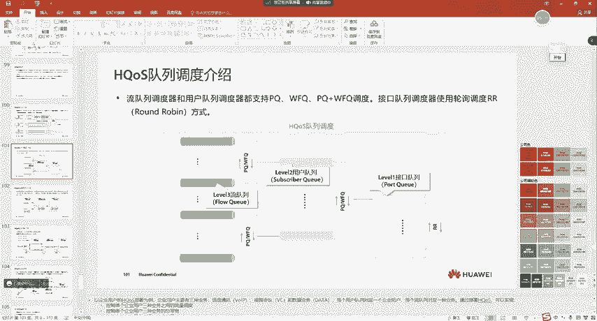

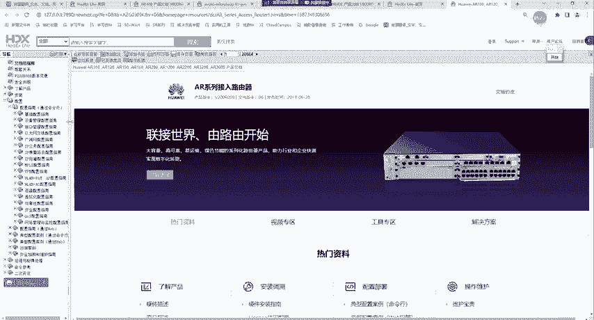

传统QoS基于接口进行调度，一个接口只有8个队列。在多租户场景下，这个限制会变得非常明显。例如，一个网络出口连接了多个用户，这些用户购买了不同带宽和业务套餐。传统QoS无法基于具体的用户来执行差异化的QoS策略，因为它只能区分业务的优先级，而无法区分不同用户的相同业务。

## HQOS的核心概念
为了解决传统QoS的局限性，我们引入了层次化服务质量。它的核心思想是将队列调度分为多个层级，从而实现更精细化的控制。

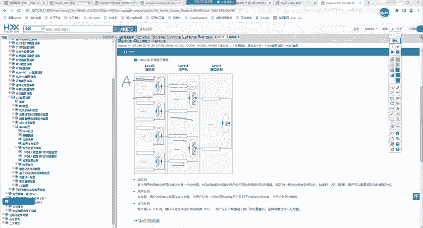

HQOS的模型类似于传统QoS的层次化扩展。以下是其基本结构：

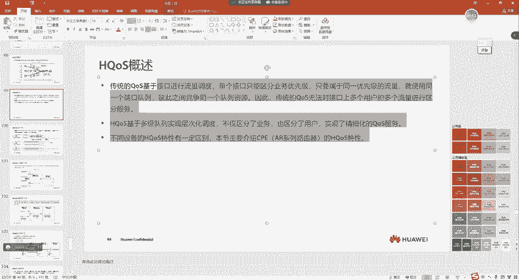

1.  **流队列**：这是最底层的队列。针对同一个用户的不同业务流量（如语音、视频、FTP），会进入不同的流队列。我们可以在这个层级使用调度算法（如PQ、WFQ）来区分同一用户内部不同业务的优先级。
    *   **公式/概念**：`用户A的语音流量 -> 流队列1 (高优先级)`；`用户A的FTP流量 -> 流队列2 (低优先级)`。

2.  **用户队列**：每个用户拥有自己的用户队列。来自该用户所有流队列的流量，在经过流队列层级的调度后，会汇聚到其对应的用户队列中。在这个层级，我们可以使用调度算法来区分不同用户之间的优先级。
    *   **公式/概念**：`用户A的所有流量 -> 用户队列A`；`用户B的所有流量 -> 用户队列B`；调度器决定优先调度用户队列A还是B。


3.  **接口队列**：这是最终的出口队列。所有用户的用户队列流量最终都会进入物理接口的接口队列。在接口队列层级，通常采用**轮询调度**算法，以保证最基本的公平性。
    *   **公式/概念**：`调度方式 = RR (Round Robin，轮询)`。例如，对于100M带宽的8个接口队列，RR调度会试图让每个队列平均获得约12.5M的带宽。

**核心优势**：
*   在**流队列**层面，实现了对**同一用户不同业务**的区分服务。
*   在**用户队列**层面，实现了对**不同用户**的区分服务。
*   在**接口队列**层面，保证了基本的公平性。

## HQOS的调度与整形
理解了HQOS的三级队列模型后，我们来看看调度和整形在这些层级上是如何工作的。

HQOS支持在每一级队列上进行调度和整形。

*   **调度**：
    *   流队列 -> 用户队列：可使用PQ、WFQ等。
    *   用户队列 -> 接口队列：可使用PQ、WFQ等。
    *   接口队列 -> 出接口：通常使用RR调度。

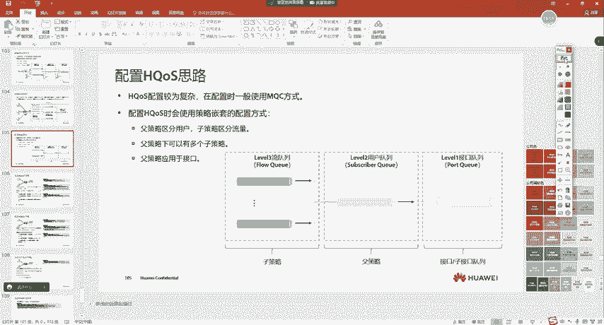

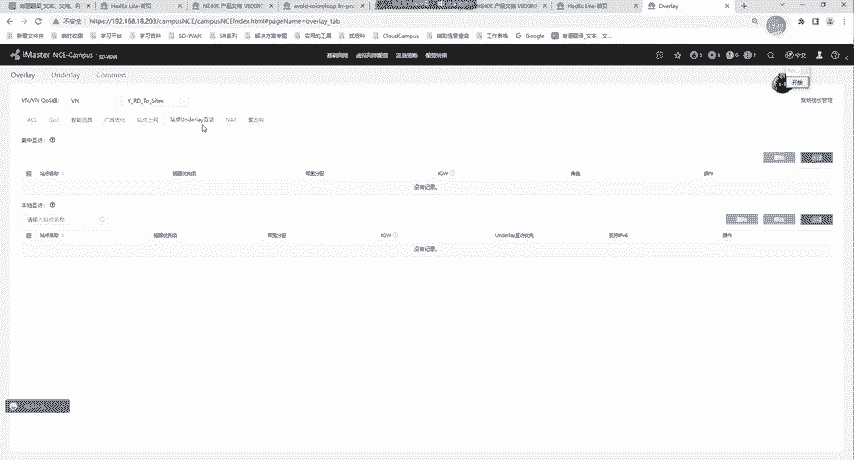

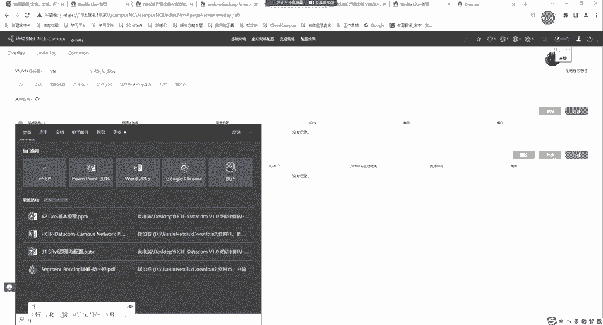

*   **整形**：
    设备支持三级整形器，可以对流队列、用户队列和接口队列分别进行整形，以控制其发送速率。
    *   **公式/概念**：`GTS (Generic Traffic Shaping) 可应用于每一级队列`。

*   **丢弃**：
    *   流队列支持配置WRED，实现基于优先级的早期随机丢弃。
    *   用户队列和接口队列通常只支持尾丢弃。当队列满时，新到的报文将被丢弃。

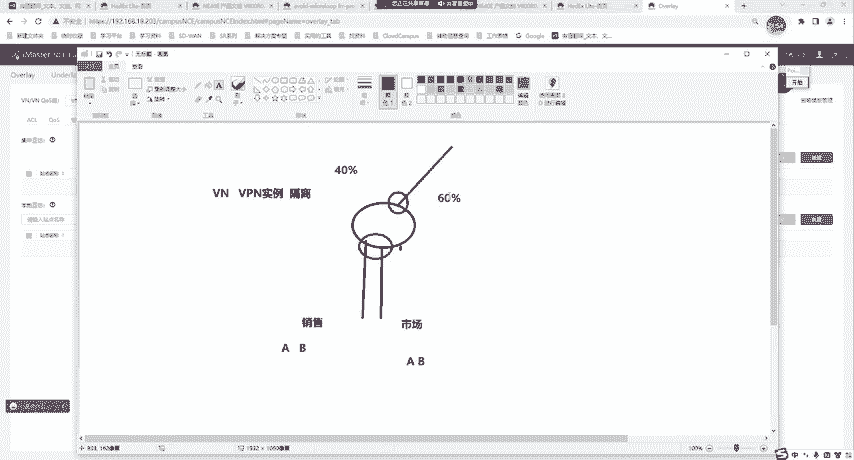

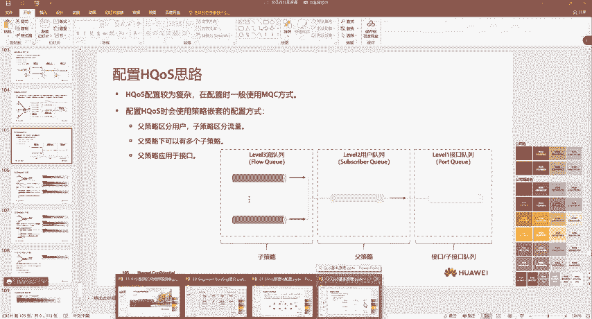

## HQOS的应用举例
为了让概念更清晰，我们来看一个HQOS的典型应用场景。

假设一栋楼内有三个家庭（用户）：
*   **家庭A**：购买了10M套餐，包含语音(VoIP)、视频(IPTV)和上网(HSI)业务。
*   **家庭B**：购买了20M套餐，包含视频(IPTV)和上网(HSI)业务。
*   **家庭C**：购买了30M套餐，仅包含上网(HSI)业务。

网络设备（如AR路由器）的配置思路如下：

1.  **流队列配置**：为每个家庭的不同业务类型创建流队列。例如，为家庭A的语音、视频、上网流量分别分配流队列，并设置语音为最高优先级(PQ)。
2.  **用户队列配置**：为家庭A、B、C分别创建用户队列。可以根据套餐设置其权重或优先级。例如，家庭C的30M用户队列可能获得比家庭A的10M用户队列更高的调度权重(WFQ)。
3.  **接口队列与整形**：在物理出口，设置接口队列整形为60M（假设总带宽为60M）。同时，可以为家庭A的语音流队列设置2M的整形器，确保即使其优先级高，也不会占用超过2M的带宽，从而影响其他用户的公平性。

## HQOS的配置逻辑
HQOS的配置比传统QoS复杂，它采用了一种嵌套的策略结构。

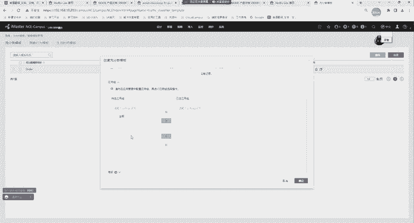

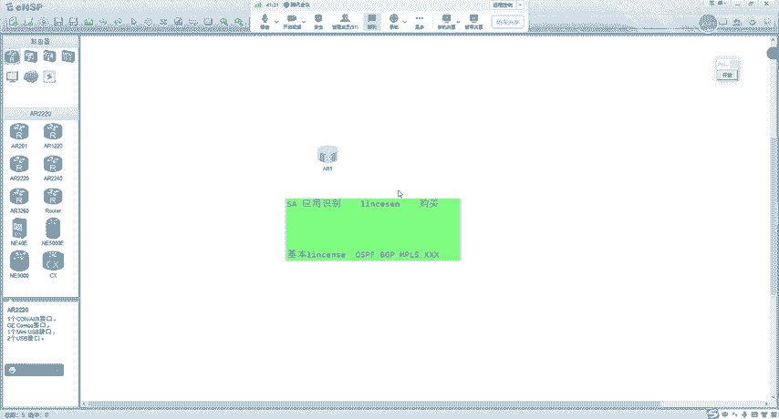

其核心配置逻辑如下：

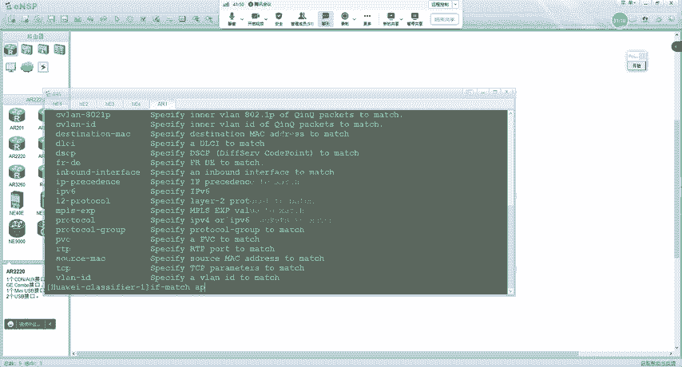

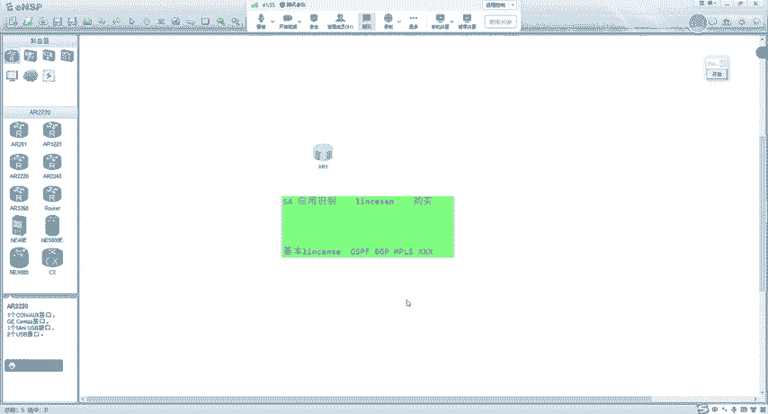

1.  **创建子策略**：使用传统的MQC方式，针对**不同的业务流量**进行分类和行为绑定。这个子策略定义了如何对待某一类业务（例如，将语音流量标记为EF并放入PQ队列）。
    *   **代码示例（逻辑）**：
        ```bash
        traffic classifier VOICE // 匹配语音流量
        if-match ...
        traffic behavior VOICE-HANDLING // 定义语音处理行为
        queue ef
        traffic policy SUB_POLICY // 创建子策略
        classifier VOICE behavior VOICE-HANDLING
        ```

2.  **创建父策略**：创建一个父策略，其分类器用于匹配**特定的用户**（例如，通过VLAN ID匹配家庭A的所有流量）。其行为是调用前面创建的子策略。
    *   **代码示例（逻辑）**：
        ```bash
        traffic classifier USER-A // 匹配用户A（如VLAN 10）
        if-match vlan-id 10
        traffic behavior APPLY-SUB-POLICY // 定义行为：应用子策略
        traffic-policy SUB_POLICY
        traffic policy PARENT_POLICY // 创建父策略
        classifier USER-A behavior APPLY-SUB-POLICY
        ```

3.  **应用策略**：将父策略应用到物理接口或子接口上。

这种“父策略调用子策略”的嵌套方式，正是HQOS实现“用户-业务”两级层次化调度的关键。父策略区分用户，子策略区分该用户内部的业务。

## 总结
本节课中我们一起学习了层次化服务质量。

*   我们首先分析了传统QoS在区分不同用户方面的局限性。
*   接着，我们深入探讨了HQOS的三级队列模型：**流队列**、**用户队列**和**接口队列**，理解了它如何在多个层级上实现精细化的调度。
*   我们看到了HQOS如何应用于多租户场景（如家庭宽带），为不同用户和不同业务提供差异化的服务质量保证。
*   最后，我们了解了HQOS基于MQC的嵌套式配置逻辑，即通过父策略匹配用户，再调用子策略处理用户内部的具体业务。

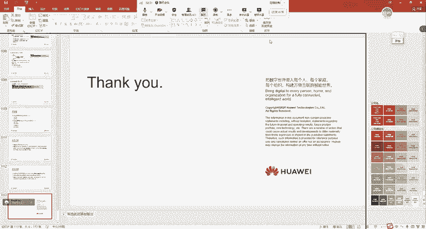

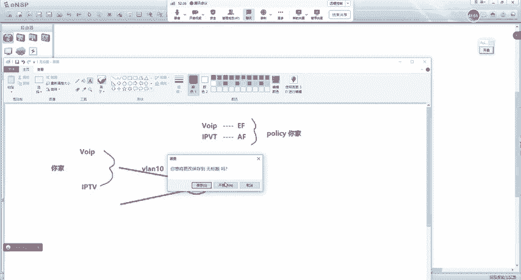

HQOS是构建可管理、可运营网络的重要工具，尤其在需要基于用户进行资源控制和计费的场景中发挥着关键作用。