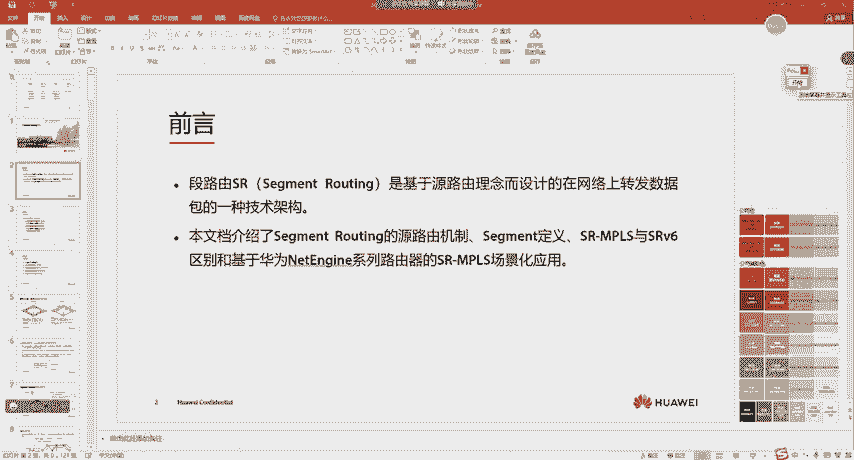
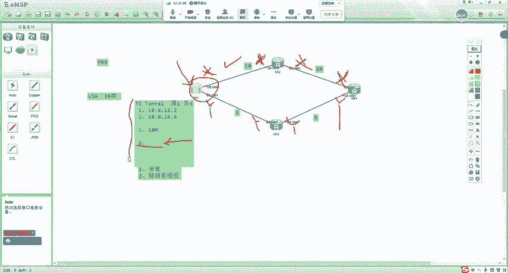
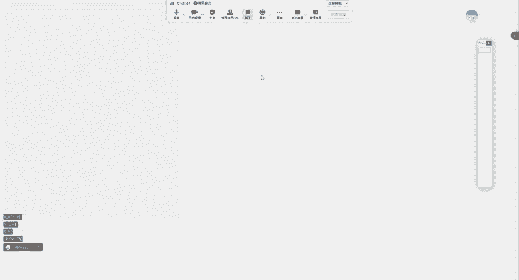
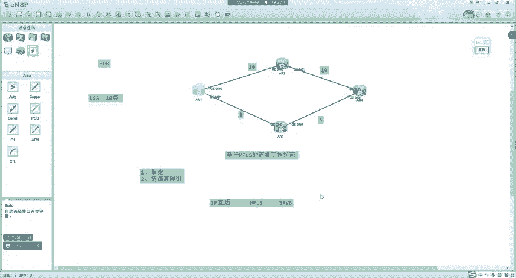
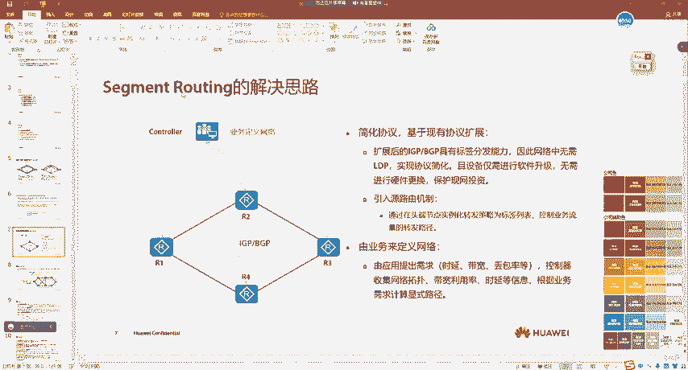
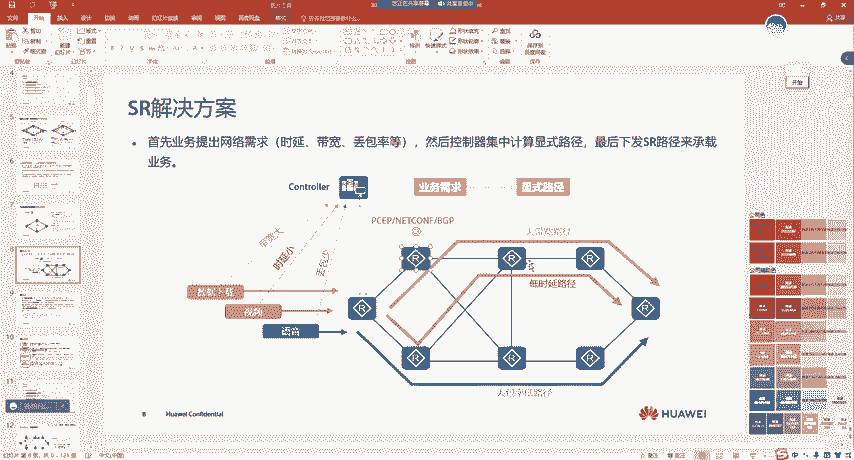
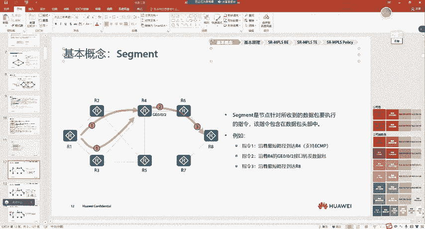
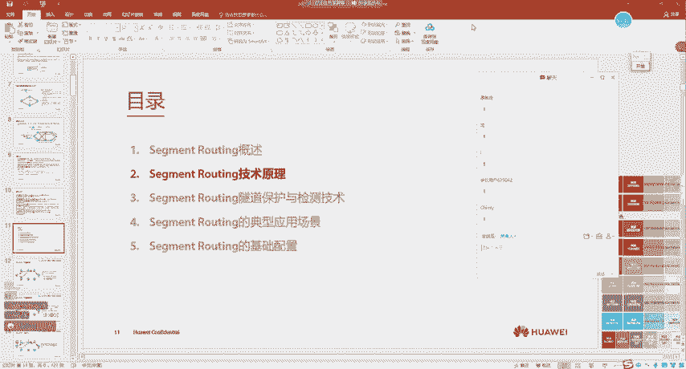

# 华为认证HCIE Datacom课程：P128：SR产生背景

在本节课中，我们将要学习Segment Routing（段路由，简称SR）技术的产生背景。我们将了解传统网络技术面临的挑战，以及SR作为一种新的技术架构是如何应运而生的，它解决了哪些核心问题。

## 课程内容调整说明

上一节我们完成了其他技术主题的讲解。本节中，我们来看看SR和SRV6相关内容。



由于课程时间安排，后续关于SR的详细讲解将以录播形式提供。学员可以通过指定平台（如“大黄蜂”）观看相关录播课程。本次直播课程将重点介绍SR的产生背景和核心思想。

## 一、什么是Segment Routing（SR）？ 🧩

SR翻译为“段路由”，是一种基于**源路由**理念设计的、在网络上转发数据包的技术架构。

这里需要解释两个核心概念：
*   **技术架构**：指一套完整的技术框架和设计思想，通常涉及面较广。
*   **源路由**：与传统“基于目的IP地址”的转发方式不同，源路由是指在发送报文的**源端**就预先规定好报文需要经过的路径。路径上的设备只需根据报文携带的路径信息进行转发，而不再仅仅依赖目的IP地址。

**传统IP转发（基于目的地址）**：
```
设备A ->（看目的IP）-> 设备B ->（看目的IP）-> 设备C
```
**源路由转发（如SR）**：
```
设备A ->（携带路径：B->C）-> 设备B ->（按路径指示给C）-> 设备C
```

## 二、传统承载网技术的挑战 ⚙️

在SR出现之前，承载网（如运营商骨干网）主要运行MPLS技术，其实现方式主要有两种：LDP用于“尽力而为”转发，RSVP-TE用于“流量工程”。但它们都存在一些固有缺陷。

### 1. MPLS LDP的问题

LDP协议本身没有算路能力，需要依赖IGP（如OSPF、IS-IS）计算路由。这带来了以下问题：
*   **控制平面复杂**：设备需要同时运行IGP和LDP两种控制协议，消耗CPU和内存资源。
*   **运维复杂**：技术人员需要学习并维护两套协议。
*   **协议不同步可能导致流量黑洞**：当网络故障时，IGP收敛速度与LDP会话重建速度可能不一致，导致流量丢失。

### 2. MPLS RSVP-TE的问题

RSVP-TE用于实现**流量工程**，即对网络中流量的路径进行规划和编排，而不仅仅是走最短路径。

**流量工程**：可以简单理解为对网络流量的路径进行手动或自动的规划和控制。例如，让一部分流量走上面链路，另一部分走下面链路，以实现负载分担或避开拥塞。





RSVP-TE虽然强大，但同样存在显著缺点：
*   **协议本身非常复杂**：报文结构、状态维护机制复杂，学习和部署难度大。
*   **分布式架构存在局限**：每个设备只知道自己和邻居的状态，缺乏全局视角。路径计算依赖于设备间的频繁信令交互。
*   **不支持负载分担**：在存在多条等价路径时，通常只能选择其中一条。

无论是LDP还是RSVP-TE，都使得网络控制平面变得复杂，难以适应快速变化的业务需求。

## 三、新思想的出现：业务驱动网络 🚀



随着5G和云时代的发展，网络应用数量激增，对连接质量（如低时延、高带宽）提出了更高要求。

如果依旧采用“网络适配业务”的旧思路（即业务上线后，再人工调整网络），将无法匹配业务的快速发展，并使网络运维变得极其复杂。

因此，产生了 **“业务驱动网络”** 的新思想：
1.  业务应用直接向网络**控制器**（一个拥有全局视角的“大脑”）提出需求（例如：需要一条低时延的路径）。
2.  控制器掌握全网实时的拓扑、带宽、时延等信息。
3.  控制器计算出满足业务需求的最佳路径，并直接下发到网络设备上执行。

这种思想的核心是**集中控制**和**自动化**，但需要在数据转发层面找到一种合适的实现技术。

## 四、为什么是Segment Routing？ ✅

在众多SDN（软件定义网络）数据面技术中，SR最终成为广域网承载的主流选择，主要基于以下优势：

*   **平滑演进，兼容现有硬件**：SR仍然使用MPLS标签进行数据转发，**无需更换现有网络设备**的硬件。只需通过软件升级将控制平面迁移到SR即可。这对运营商来说成本风险极低。
*   **支持分布式与集中式混合控制**：SR既可以像传统协议一样分布式运行，也可以与控制器结合实现集中式控制。客户可以根据自身情况灵活选择，迁移路径平滑。
*   **简化控制平面**：SR无需LDP和RSVP-TE这样复杂的独立信令协议。它通过对现有IGP协议进行扩展来分发“段”信息，极大简化了控制平面。
*   **基于源路由，状态无关**：路径信息由源端携带，中间转发设备无需维护每条流的状态，只需根据标签进行转发，提高了扩展性和可靠性。



正是这些优势，使得SR能够很好地承载“业务驱动网络”的理念，成为下一代承载网演进的事实标准。

## 五、SR的核心思想简述 🧠

SR将网络抽象成一个个的“段”。每个“段”可以是指向某个设备的指令（如“去往设备D”），也可以是指向某条链路的指令（如“从接口X出去”）。每个“段”都有一个唯一的标识（Segment ID）。

**SR路径的构建**：通过将一系列“段”的标识有序排列，就能组合成一条完整的端到端转发路径。这就像规划旅行路线：“从北京（段A）坐高铁（段B）到郑州（段C），再换乘飞机（段D）到上海”。

网络源端设备将这个“段”序列压入报文头，报文就会像按照编好的程序一样，顺序经过指定的“段”到达目的地。

## 课程总结



本节课中我们一起学习了：
1.  **SR的定义**：一种基于源路由的转发架构。
2.  **传统技术的挑战**：MPLS LDP和RSVP-TE在复杂性和灵活性上的不足。
3.  **新思想的驱动**：“业务驱动网络”要求网络能够快速、自动响应业务需求。
4.  **SR的胜出原因**：凭借其兼容现网、平滑演进、简化控制面、支持集中式与分布式混合控制等核心优势，SR成为实现新一代承载网的理想技术。
5.  **SR的核心思想**：将网络路径分解为带标识的“段”，并通过组合“段”来构建转发路径。





理解SR的产生背景和核心思想，是后续深入学习其具体技术细节的基础。下节课，我们将开始探讨SR的基本概念和工作原理。