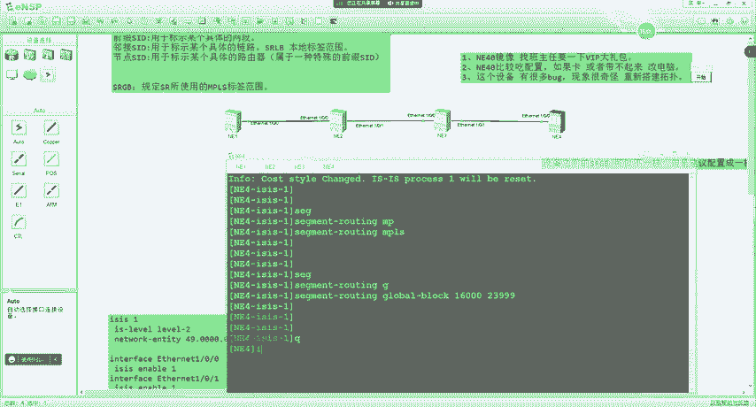
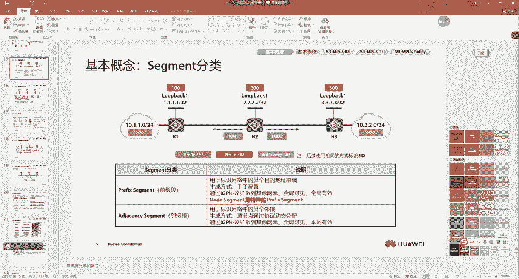
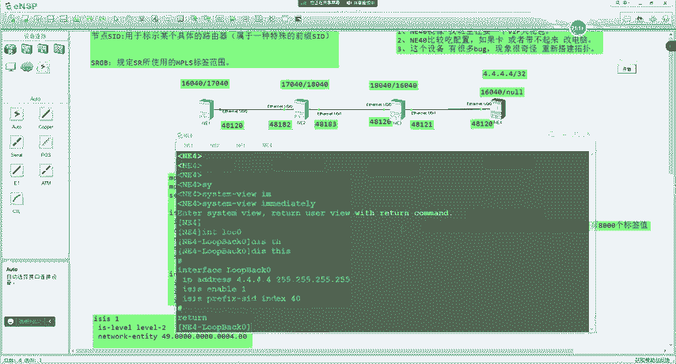
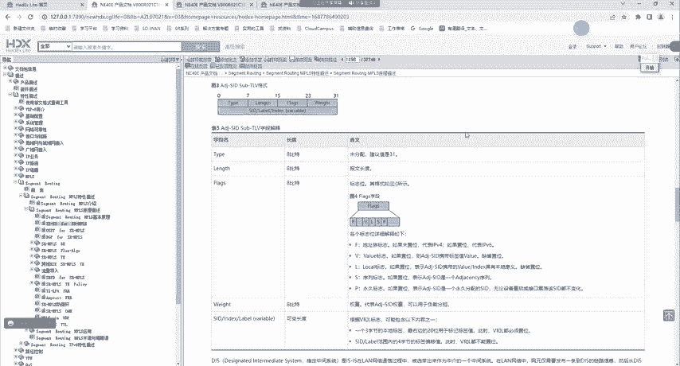
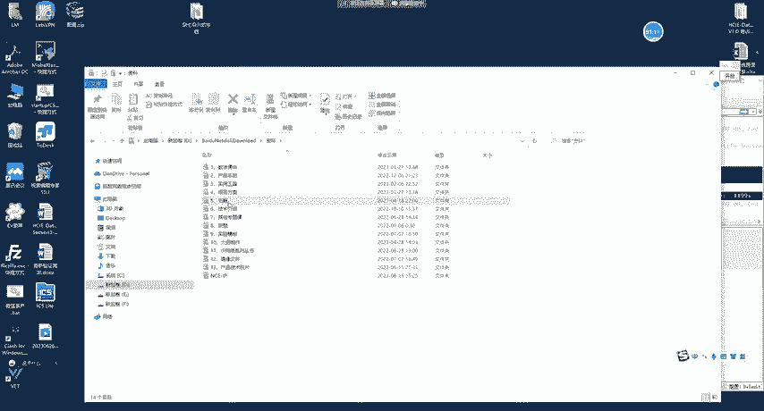
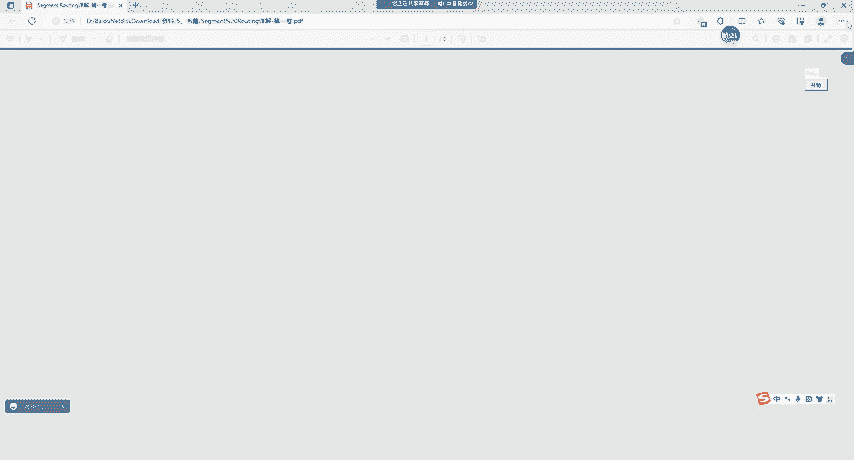
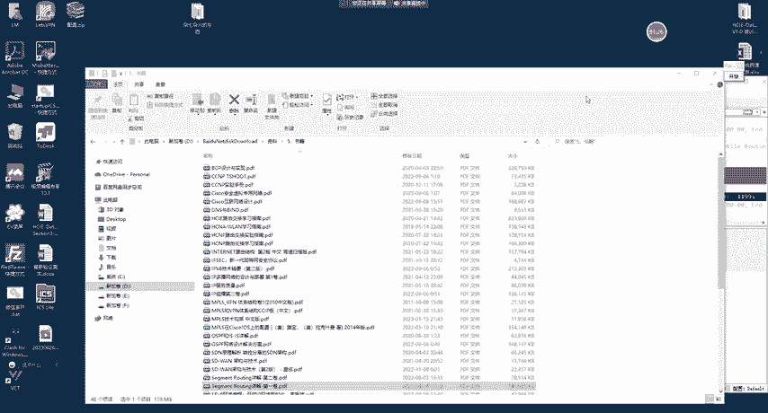
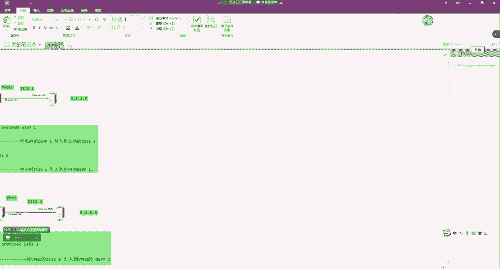
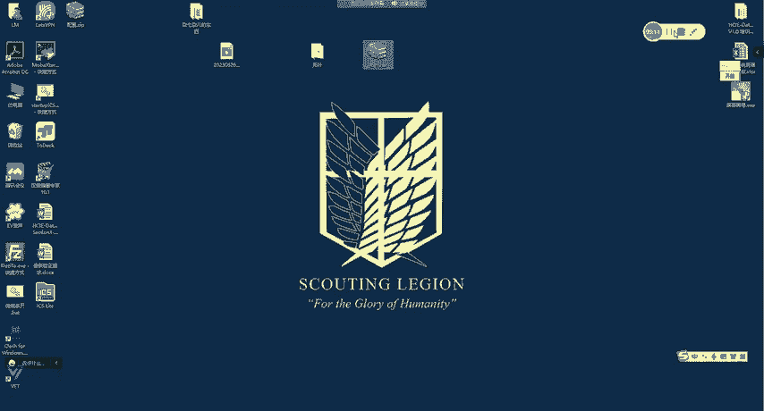

# SR技术详解：P129：SR基本原理、ISIS SR扩展

## 概述

在本节课中，我们将深入学习Segment Routing（SR）的基本原理，特别是SR-MPLS的实现方式。我们将从SR的核心概念入手，理解其如何简化网络路径控制，并详细探讨IS-IS协议为支持SR所做的扩展。通过本课，您将掌握SR的工作机制、关键术语以及如何在网络中部署和验证SR。

---

## SR核心思想回顾

上一节我们介绍了SR作为一种配合SDN思想落地的具体技术。SDN是一种控制与转发分离的思想，而SR则是实现这种思想在广域承载网上的关键技术。

我们可以将SDN思想比作“实现共同富裕”的目标，而SR技术则类似于为实现这个目标而采取的“改革开放”、“招商引资”等具体行动。SR技术最初在广域承载网上进行实践，就像改革开放初期将深圳作为试点一样。

## SR基础概念

接下来，我们来看看SR技术涉及的一些关键概念。

### Segment（段）与Segment ID（SID）

**Segment**，通常简称为“段”，是SR中最基本的概念。它本质上是一种**指令**，指导数据包在网络中的转发行为。

我们可以用一个旅行例子来理解：从北京到上海，指令“先到郑州”就是一个Segment。在网络中，如果路由器R1要访问R8，指令“先到R4”同样是一个Segment。

**Segment ID**，简称**SID**，是Segment的具体标识。它用于唯一标识一个指令。例如，指令“先到R4”可能被标识为SID 400。

在SR-MPLS中，SID使用**MPLS标签**来标识；而在SRv6中，SID则使用**IPv6地址**来标识。

### 路径控制示例

假设R1要访问R8，并且我们想控制路径为 R1 -> R4 -> R8。
1.  网络规划时，为R4分配节点SID 400。
2.  R1在发送数据包时，压入SID 400的标签。
3.  R1看到标签400，知道需要将数据包发给R4。
4.  数据包到达R4后，R4弹出自己的节点SID标签（400）。
5.  R4根据后续的转发信息（可能是另一个SID，或者目的IP），将数据包从指定接口（例如G0/0/2）发送给R8。

通过压入不同的SID序列，我们可以像编排剧本一样，精确控制数据包穿越网络的每一跳。

### Segment列表（Segment List）

在实际转发中，一个数据包头部可能压入多个SID，形成一个有序列表，称为 **Segment列表**。

处理时遵循“后进先出”的栈原则：总是先处理最外层的SID标签，弹出后再处理内层的标签。这个有序的SID列表定义了数据包从源到目的地的完整路径。

## Segment的分类

Segment（或SID）主要有以下几种分类：

**1. 前缀SID**
*   **作用**：用于标识一个具体的**IP地址前缀**（网段）。
*   **配置**：必须通过**手工方式**配置。
*   **特性**：**全局可见，全局有效**。全网唯一。
*   **示例**：为网段10.2.0.0/24分配前缀SID 16002。

**2. 邻接SID**
*   **作用**：用于标识一条具体的**链路**或**邻接关系**。
*   **分配**：由IGP协议（如IS-IS, OSPF）**动态分配**。
*   **特性**：**全局可见，本地有效**。不同设备可以分配相同的邻接SID值。
*   **示例**：R4为通往R6的链路G0/0/2分配邻接SID 1046。

**3. 节点SID**
*   **作用**：用于标识一台特定的**路由器**。
*   **本质**：节点SID是一种**特殊的前缀SID**，它是设备Loopback接口地址所分配的前缀SID。
*   **示例**：为R4的Loopback接口地址4.4.4.4/32分配前缀SID，这个SID同时也是R4的节点SID。

通过组合使用前缀SID（包括节点SID）和邻接SID，我们可以在网络中编排任意复杂的转发路径。

## SRGB与标签分配

在SR-MPLS中，SID表现为MPLS标签。为了避免与传统的MPLS LDP分配的标签冲突，SR引入了 **SRGB** 的概念。

**SRGB** 是一个由用户指定的、为SR-MPLS预留的**全局标签范围**。所有设备上需要手动配置SRGB。

*   **常见配置**：`segment-routing mpls global-block 16000 23999`
*   **建议**：虽然设备间的SRGB**可以不同**，但为了便于管理和维护，**建议配置为相同**。

### 前缀SID标签值的计算

前缀SID的配置通常使用 **索引值**。设备通告的是索引值，而实际的MPLS标签值由各设备根据以下规则计算得出：

*   **入标签计算**：设备使用 **自身的SRGB起始值 + 收到的前缀SID索引值**。
    *   公式：`入标签 = 本地SRGB起始值 + Prefix SID索引`
*   **出标签计算**：设备使用 **下一跳设备的SRGB起始值 + 收到的前缀SID索引值**。
    *   公式：`出标签 = 下一跳SRGB起始值 + Prefix SID索引`

**示例**：
假设全网SRGB均为16000-23999。
R4为其Loopback接口(4.4.4.4/32)配置前缀SID索引为40。
*   R4本地的入标签 = 16000 + 40 = 16040
*   R3收到关于4.4.4.4的路由，下一跳是R4。则R3的出标签 = R4的SRGB起始值(16000) + 40 = 16040
*   R3的入标签 = R3自身的SRGB起始值(16000) + 40 = 16040
*   依此类推，最终在R1上形成一条LSP，出标签为16040。

这个过程与传统MPLS LDP建立LSP的“下游自主分配、下游按需分配”模式在效果上类似，但控制信令完全由IGP承载，大大简化了协议栈。

## IS-IS对SR的扩展

IS-IS协议通过定义新的TLV（Type-Length-Value）和子TLV来携带SR相关的信息，并将其泛洪到整个网络，使得所有节点能同步SR所需的各项数据。

以下是几个关键的扩展TLV：

**1. 前缀SID子TLV**
*   **作用**：通告SR-MPLS的前缀SID。
*   **关键字段**：
    *   **Flags**：包含多个标志位。
        *   **R-bit**：重分发标志。
        *   **N-bit**：置位表示此SID是节点SID。
        *   **P-bit**：置位表示**不**执行倒数第二跳弹出。
        *   **E-bit**：置位表示使用显式空标签。
        *   **V-bit/L-bit**：与SID是具体值还是索引值相关。
    *   **Algorithm**：算法标识，目前通常为0（SPF算法）。
    *   **SID/Index/Label**：携带SID的索引值或具体值。

**2. 邻接SID子TLV / LAN邻接SID子TLV**
*   **作用**：分别用于通告P2P链路和广播网络中的邻接SID。

**3. SR能力子TLV**
*   **作用**：通告节点的SR能力。
*   **位置**：位于“路由器能力TLV”内部。
*   **关键字段**：
    *   **Flags**：
        *   **I-bit**：置位表示能处理SR-MPLS封装的IPv4数据。
        *   **V-bit**：置位表示能处理SR-MPLS封装的IPv6数据。

**4. SID/标签范围子TLV**
*   **作用**：通告本设备的SRGB范围。
*   **关键字段**：包含标签范围的起始值和范围大小。

**学习方法建议**：对于TLV中具体的标志位含义，无需死记硬背。在实际工作或学习中，应掌握通过查阅官方产品文档或权威技术书籍来获取详细信息的方法。

## 实验演示与注意事项

本节通过一个简单的四节点拓扑演示了SR-MPLS的基础配置。

**基础配置步骤**：
1.  配置接口IP地址和Loopback地址。
2.  配置IS-IS，并启用Wide Metric。
3.  配置MPLS LSR ID。
4.  全局使能Segment Routing功能：`segment-routing mpls`
5.  在IS-IS视图下使能SR-MPLS：`segment-routing mpls`
6.  配置SRGB：`segment-routing mpls global-block 16000 23999`
7.  在Loopback接口下配置前缀SID索引：`isis prefix-sid index 40`

**使用NE系列模拟器的注意事项**：
1.  镜像文件需向课程方获取。
2.  NE设备对硬件资源要求较高，建议电脑内存不少于16GB。
3.  该模拟器存在一些已知Bug，若实验现象与预期不符，在确认配置无误后，可尝试重启设备或重新搭建拓扑。

**关键查看命令**：
*   `display isis lsdb local verbose`：查看本地生成的LSP详细信息，包括通告的SID。
*   `display segment-routing prefix mpls forwarding`：查看SR前缀的MPLS转发表。
*   `display segment-routing adjacency mpls forwarding`：查看SR邻接的MPLS转发表。

通过实验，可以验证前缀SID标签的计算、转发路径以及IS-IS协议中携带的SR TLV。

---

## 总结

本节课我们一起学习了SR的核心原理。我们从SR作为SDN思想的具体实践这一宏观定位入手，逐步剖析了Segment、SID、SRGB等基础概念，并明确了前缀SID、邻接SID和节点SID的作用与区别。我们深入了解了SR-MPLS中标签的计算方式，以及IS-IS协议为支持SR所做的关键扩展。通过理论讲解与实验演示，大家应该对SR如何简化网络、实现源路由路径控制有了初步的认识。下节课我们将继续探讨OSPF协议对SR的扩展。