# 16：条件语句 - 如果 p 则 q

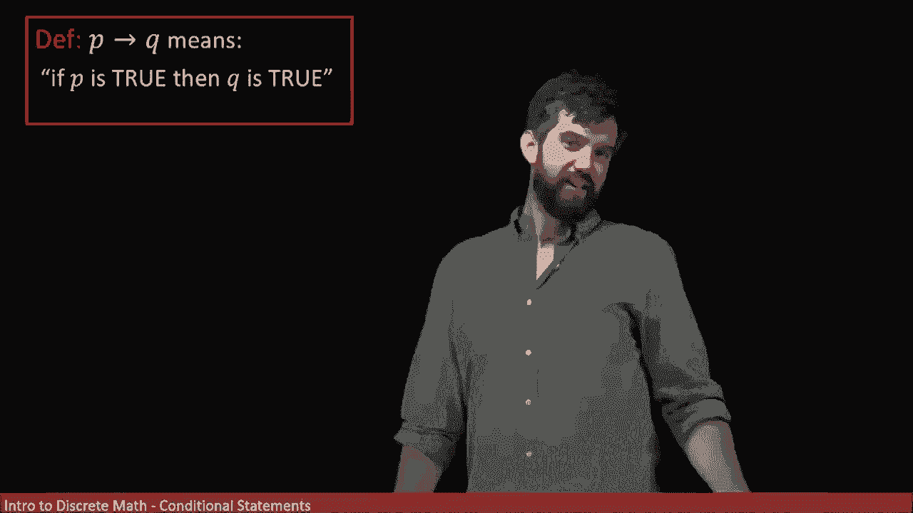

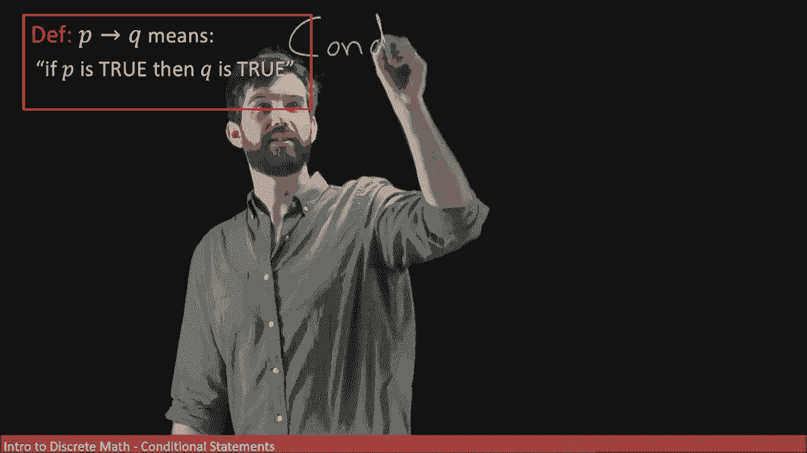

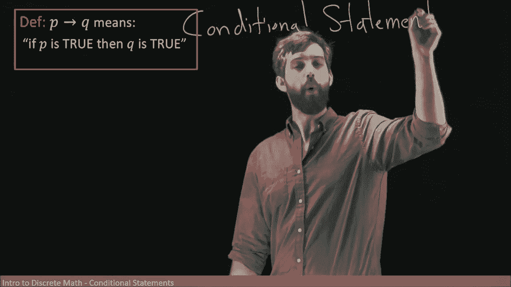

在本节课中，我们将要学习一种称为“条件语句”的逻辑结构。我们将探讨其定义、真值表，以及如何将其与其他逻辑语句结合理解。

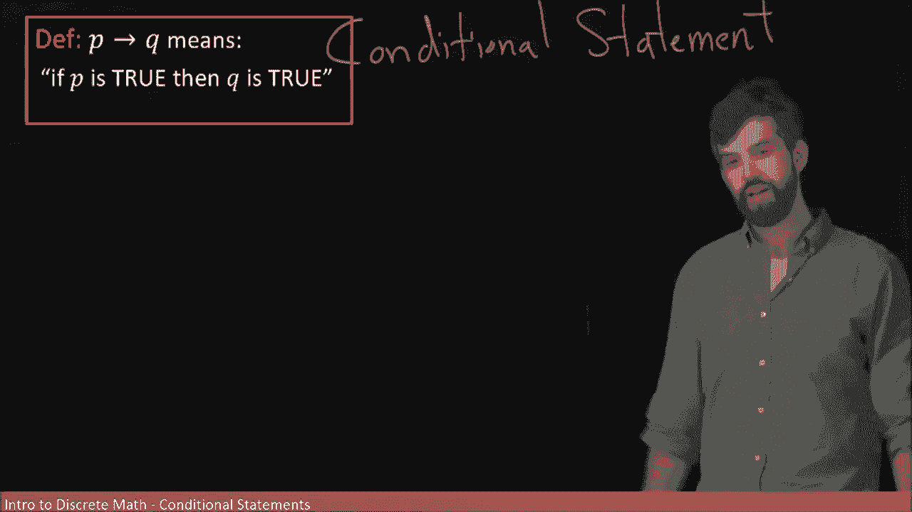

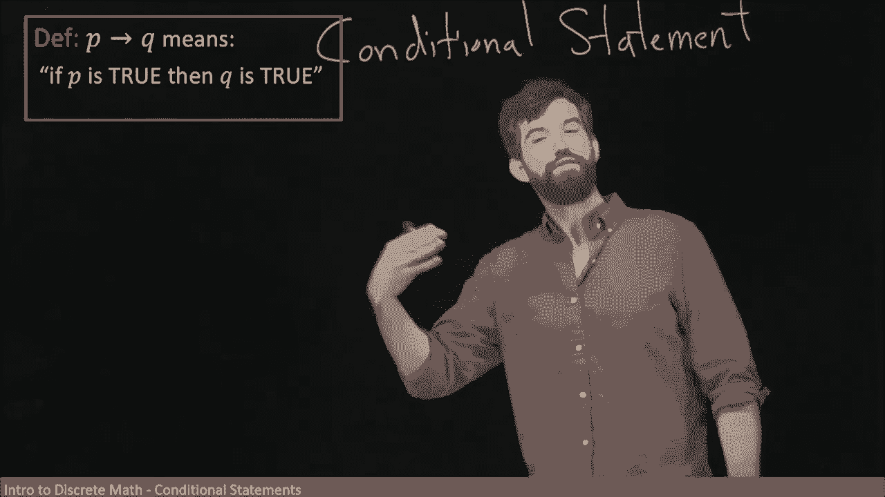

## 条件语句的定义

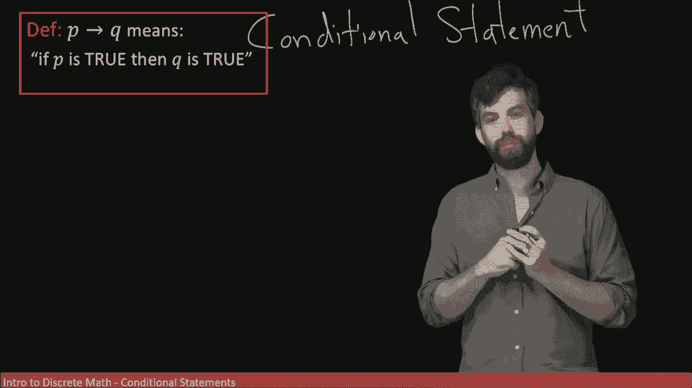

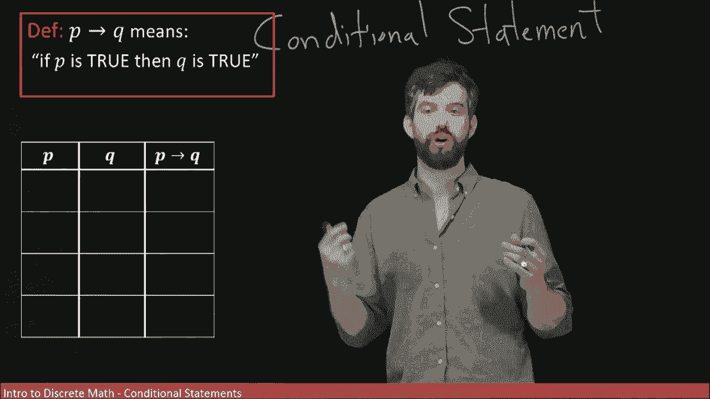

条件语句的形式是“如果 P，则 Q”。它表示存在一个初始假设 P，如果该假设为真，那么结论 Q 也必须为真。

我们可以用符号表示为：**P → Q**。

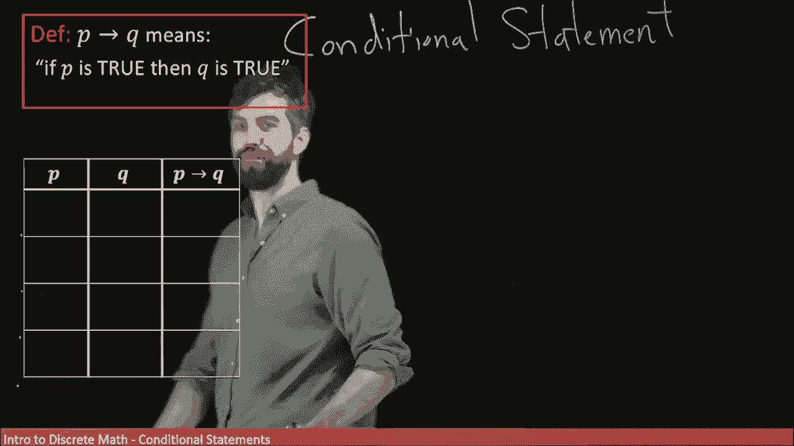

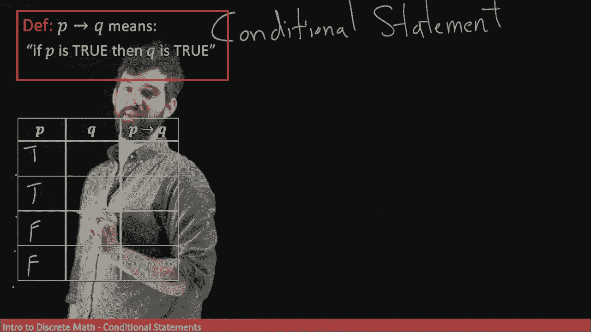

## 条件语句的真值表

上一节我们介绍了条件语句的基本形式，本节中我们来看看如何为其构建真值表。

首先，我们需要列出变量 P 和 Q 所有可能的真值组合。

以下是构建真值表的步骤：

1.  列出 P 和 Q 的所有真值组合。
2.  根据条件语句的逻辑，逐行判断 P → Q 的真值。

| P | Q | P → Q |
|---|---|:---:|
| T | T | T |
| T | F | F |
| F | T | T |
| F | F | T |

**解释**：
*   当 P 为真且 Q 为真时，条件语句为真。
*   当 P 为真但 Q 为假时，条件语句为假。
*   当 P 为假时，无论 Q 为真或假，条件语句都被认为是“虚真”的。这是因为条件语句的前提（P）未满足，因此整个语句没有被“激活”，我们默认其为真。

## 条件语句的等价形式

我们刚刚构建了条件语句的真值表。现在，让我们看看条件语句是否有一个更简单的等价逻辑表达式。

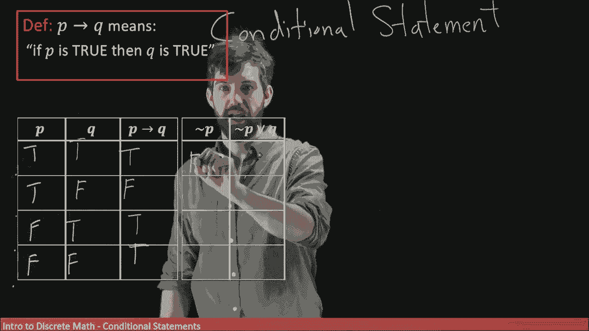

通过观察，我们可以发现 **P → Q** 的真值表与 **¬P ∨ Q** 的真值表完全相同。

| P | Q | ¬P | ¬P ∨ Q | P → Q |
|---|---|:---:|:---:|:---:|
| T | T | F | T | T |
| T | F | F | F | F |
| F | T | T | T | T |
| F | F | T | T | T |

因此，条件语句 **P → Q** 在逻辑上等价于析取语句 **¬P ∨ Q**。这意味着“如果 P 则 Q”与“非 P 或 Q”表达的是相同的逻辑关系。

## 实例分析

为了更直观地理解，让我们用一个例子来说明。

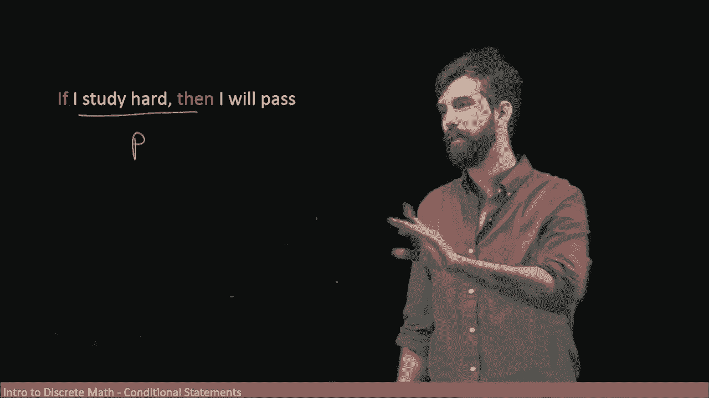

考虑这个条件语句：“如果我努力学习，那么我会通过考试。”

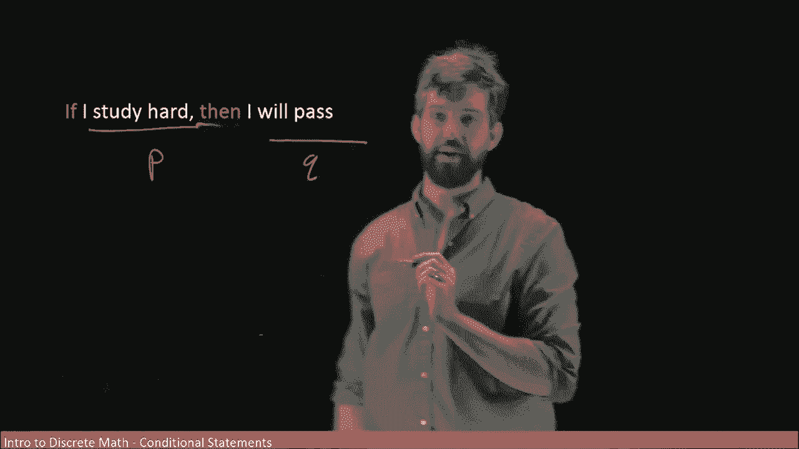

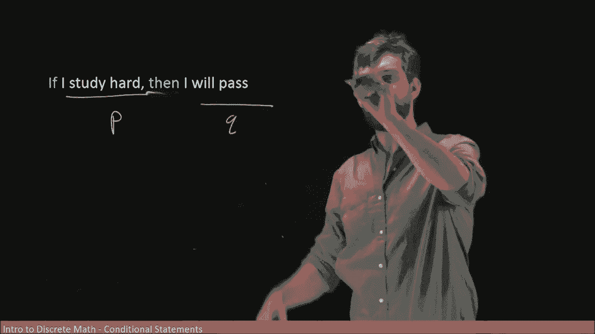

*   令 **P** 表示“我努力学习”。
*   令 **Q** 表示“我通过考试”。

那么原语句可以符号化为：**P → Q**。

根据我们学到的等价形式 **¬P ∨ Q**，这个语句也可以表述为：“要么我不努力学习，要么我通过考试。”

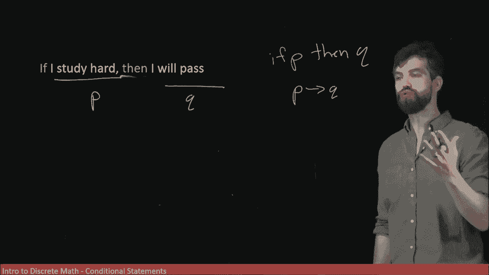

这两个句子在逻辑上是等价的。它们描述了相同的可能性：我可能通过了考试，或者我可能没有努力学习。

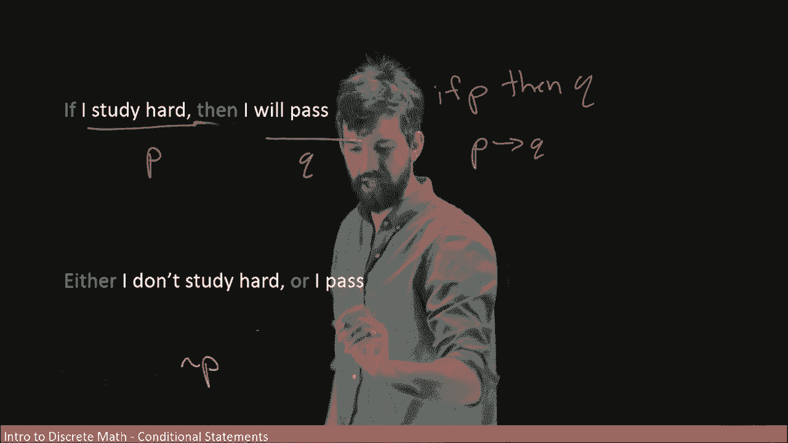

## 总结

本节课中我们一起学习了条件语句 **P → Q**。我们首先定义了它的形式，然后构建了其真值表，并理解了在前提 P 为假时语句为“虚真”的概念。最重要的是，我们发现了条件语句的一个关键等价形式：**P → Q** 在逻辑上完全等同于 **¬P ∨ Q**。这个等价关系是理解和操作条件语句的基础。