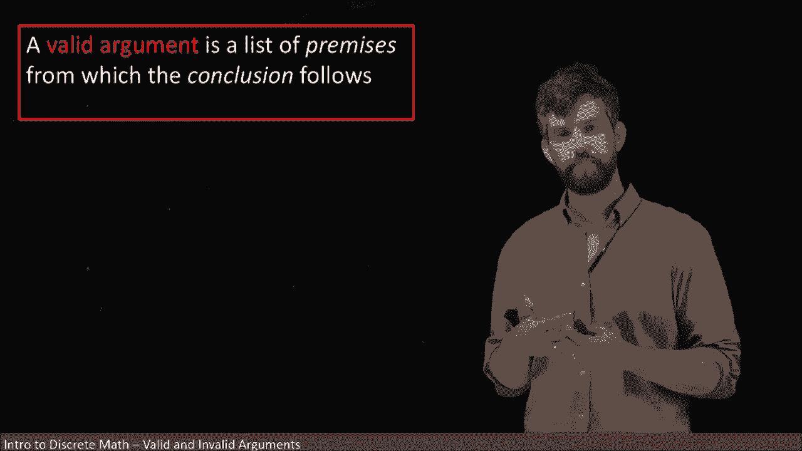
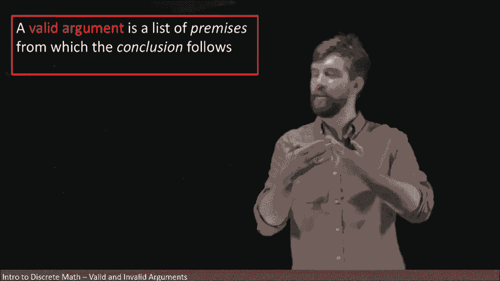
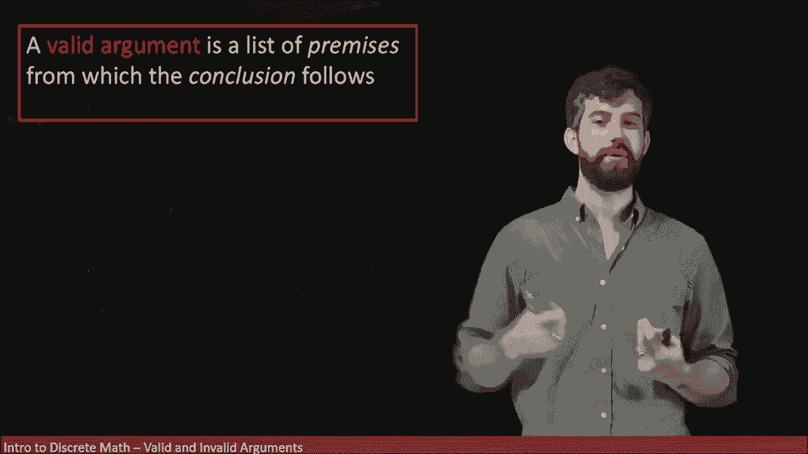
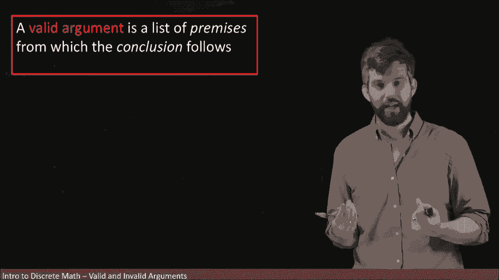
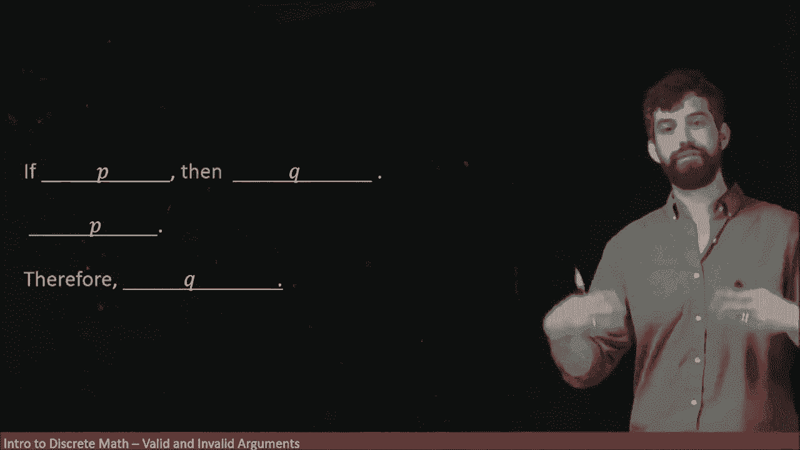
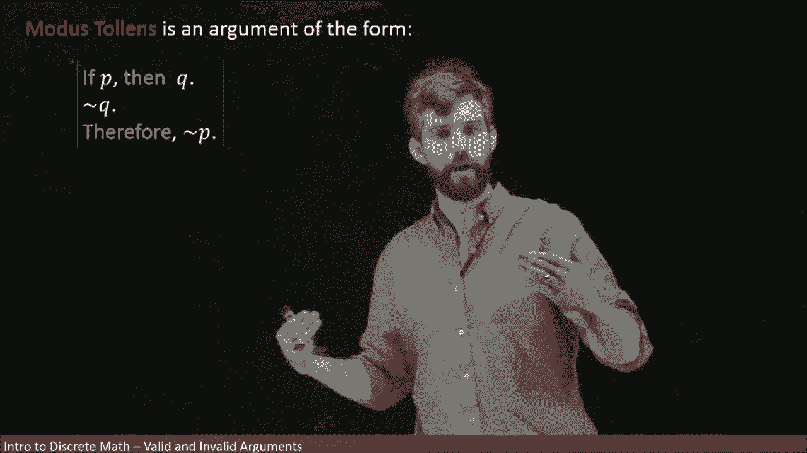

# 22：逻辑论证 - 肯定前件与否定后件

## 概述

在本节课中，我们将要学习逻辑论证的基本概念，特别是两种核心的论证形式：**肯定前件**和**否定后件**。我们将理解什么是有效的逻辑论证，并学习如何使用真值表来验证论证的有效性。

---

## 逻辑论证简介

到目前为止，我们一直在研究单个陈述，分析其真假，并将其分解为逻辑形式。然而，我们真正的目标是构建能够说服我们相信某个结论为真的论证。

一个有效的论证由一系列被称为**前提**的陈述组成。如果你接受所有这些前提，那么结论就会逻辑地随之而来。这是我们的真正目标：无论是证明定理，还是向他人论证某事为何为真，我们都试图构建一个逻辑上有效的论证来完成这一任务。

逻辑上有效的论证意味着其结构是无可争议的。我们无法否认结论是从前提中得出的。当然，你可能会对论证提出其他批评，例如，你可能会说某个前提本身就不成立。如果前提不真，结论自然无法成立。

但是，如果你构建了一个有效的论证，那么每个人都应该同意，从“结论确实从前提中得出”这个意义上说，你的论证是有效的。

---

## 一个论证示例

让我们来看一个论证示例。我将它分解为几个部分。

首先，我说：“如果我洗碗，那么我的妻子会对我感到满意。” 这只是一个前提，我并没有说它是一个真实的前提，也没有说它是一个虚假的前提。它只是一个陈述，具体来说，是一个条件陈述。

然后，我声称：“我洗碗了。”

因此，结论是：“我的妻子对我感到满意。”

这两个前提可能都不成立，也许我并没有洗碗，也许这个推理过程过于简单，不足以推断出我妻子会满意。但是，我认为其中的逻辑是合理的：如果我有一个假设，那么我会得到一个结论；我假设我确实有这个假设，因此我确实得到了这个结论。这就是论证的结构。

---

## 论证的结构与形式

现在，让我们暂时抛开这个玩笑式的例子，只看论证结构本身。我可以在这个结构中填入任何内容。

例如，我可以用 **P** 和 **Q** 来代替这些陈述。在原来“我洗碗”的两个位置，我将填入 **P**；在原来“我的妻子会对我感到满意”的位置，我将填入 **Q**。

这样我们就得到了论证的**逻辑形式**。具体来说，这种形式有一个名称，叫做 **Modus Ponens**。这是一个拉丁语名称，其含义是以下形式的逻辑结构：

**如果 P，那么 Q。**
**P 成立。**
**因此，Q 成立。**

我认为这个论证看起来相对合理：如果你有一个假设，并且从这个假设可以推出一个结论，而我断言你确实有这个假设，那么你确实会得到这个结论。这对我来说在直觉上是合理的。事实上，我认为我们在日常生活中经常使用这样的论证，尽管可能不会如此明确地构建结构。

---

## 使用真值表验证有效性

然而，让我们尝试从真值表层面来验证这个在直觉上非常合理的论证是否确实有效。

首先，我列出我的变量 **P** 和 **Q**。

在我的论证中，我有三行：第一行有时被称为 **P1**，第二行被称为 **P2**，第三行被称为 **C**。

在我的真值表中，我现在要列出我的两个前提：**P → Q** 和 **P**。

以下是真值表的构建过程：

1.  **P → Q** 列：根据条件陈述的真值规则，当 P 真 Q 真时，结果为真；P 真 Q 假时，结果为假；P 假时，结果为真。
2.  **P** 列：直接复制变量 P 的值。
3.  **结论 Q** 列：直接复制变量 Q 的值。

论证有效的关键在于：在所有前提都为真的每一行中，结论也必须为真。

观察真值表，我们发现只有在第一行（P 真，Q 真）中，两个前提 **P → Q** 和 **P** 同时为真。而在这一行中，结论 **Q** 也为真。在其他行中，至少有一个前提为假，因此我们无需关心结论的真假。

因此，通过真值表，我们证明了 **Modus Ponens** 是逻辑上有效的论证形式。

---

## 另一种重要论证形式：否定后件

另一个非常著名且重要的逻辑论证形式被称为 **Modus Tollens**。

其结构如下：
**如果 P，那么 Q。**
**非 Q。**
**因此，非 P。**

这里的逻辑是：如果你有一个条件陈述“P 蕴含 Q”，但结论 Q 是假的，那么假设 P 就不可能是真的。因为如果 P 是真的，那么 Q 也必须是真的。所以，知道结论 Q 为假，就迫使假设 P 也为假。

如果我们愿意，也可以像为 **Modus Ponens** 所做的那样，为 **Modus Tollens** 写出真值表，并验证其有效性。

---

## 示例与应用

需要指出的是，**Modus Ponens** 和 **Modus Tollens** 都被称为**三段论**，它们是具有两个前提（一个大前提和一个小前提）并从中得出结论的典型例子。

让我们看一个 **Modus Tollens** 的例子。

这是我的论证：
**如果我是美国总统，那么我是美国公民。**
**我不是美国公民。（事实上，我是加拿大人。）**
**因此，我不是美国总统。**

这并不是证明我不是美国总统的唯一方法，但它是一个逻辑上有效的论证。事实上，这两个条件都成立：成为美国总统必须是美国公民，而我不是美国公民。因此，我必然不是美国总统。

如果我们分析这个论证的结构：
*   “我是美国总统”是陈述 **P**。
*   “我是美国公民”是陈述 **Q**。
*   论证中，我否定了 **Q**（“我不是美国公民”），并因此得出了否定 **P** 的结论（“我不是美国总统”）。

这样，我就通过逻辑论证证明了“我不是美国总统”。

---

## 总结

在本节课中，我们一起学习了逻辑论证的基础。我们了解了有效论证的含义，即结论必须从真实的前提中逻辑地得出。我们重点研究了两种核心的论证形式：

1.  **肯定前件**：其形式为 `如果 P 则 Q`，且 `P` 成立，因此 `Q` 成立。
2.  **否定后件**：其形式为 `如果 P 则 Q`，且 `非 Q` 成立，因此 `非 P` 成立。

我们通过构建真值表验证了这两种形式的逻辑有效性，并通过具体例子展示了它们在实际推理中的应用。掌握这些基本的有效论证形式，是进行严谨逻辑思考和数学证明的重要基石。