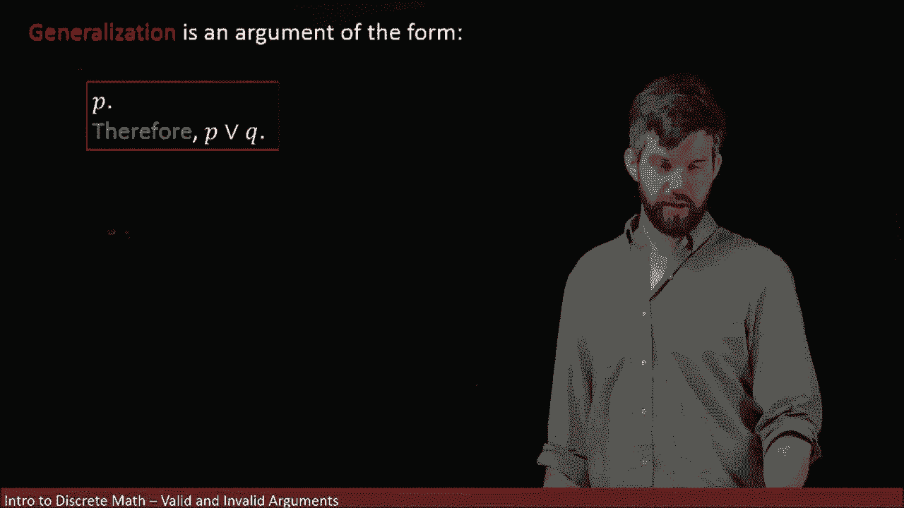
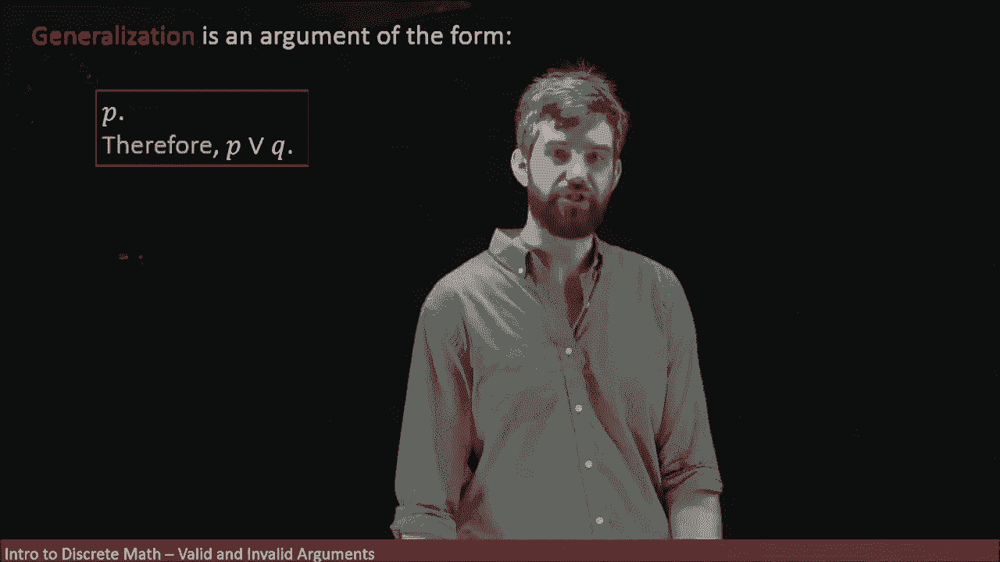
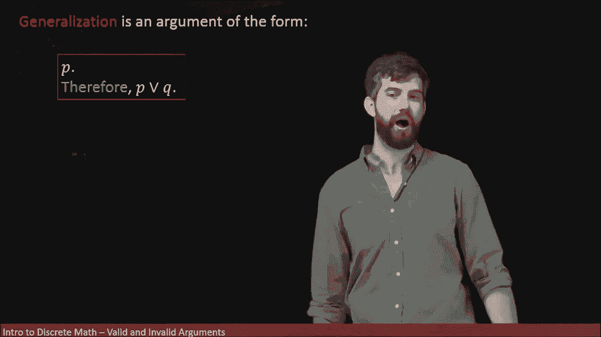
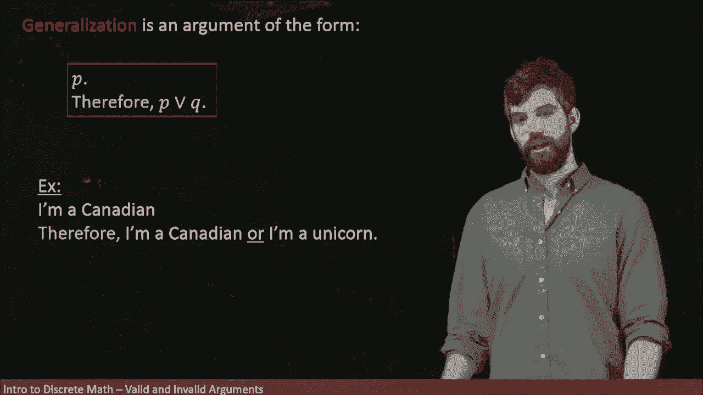
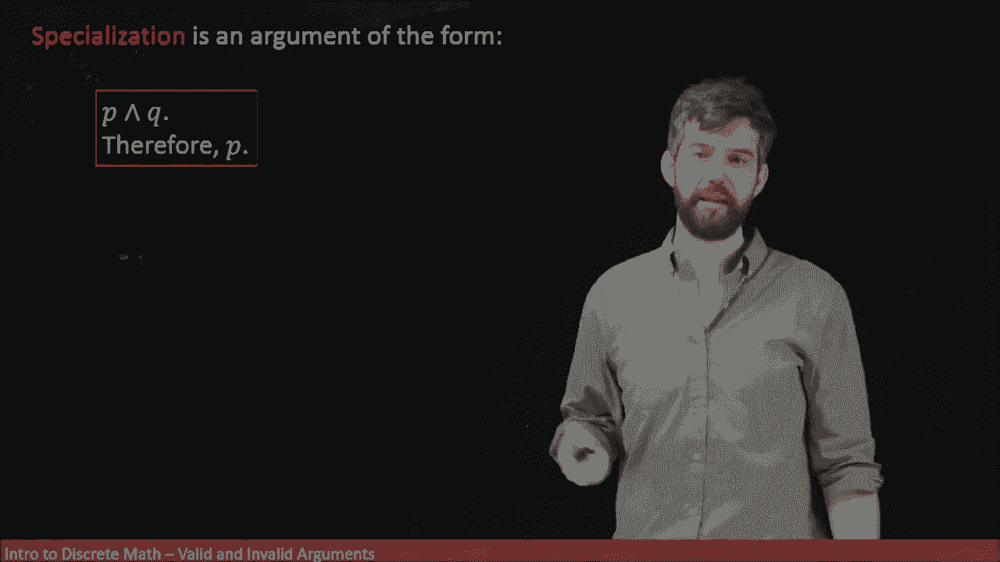
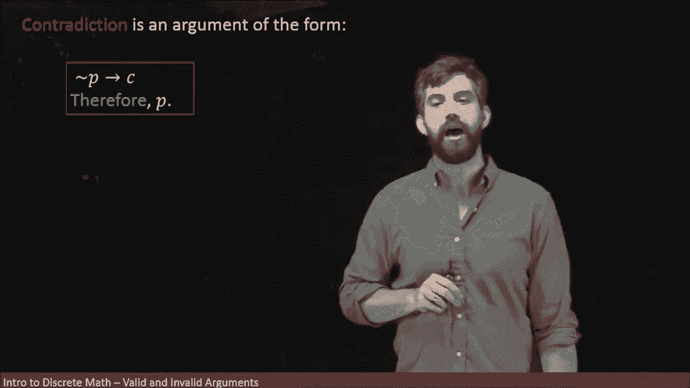
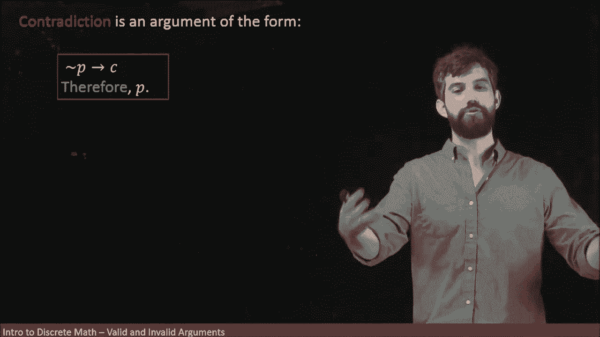
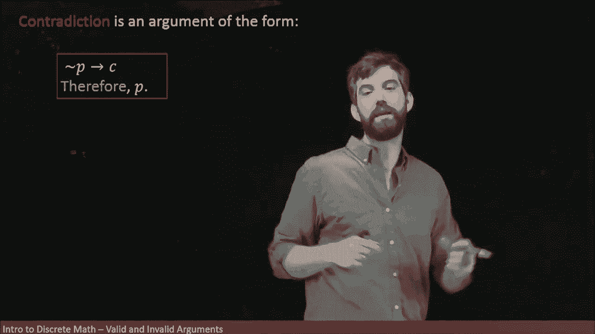
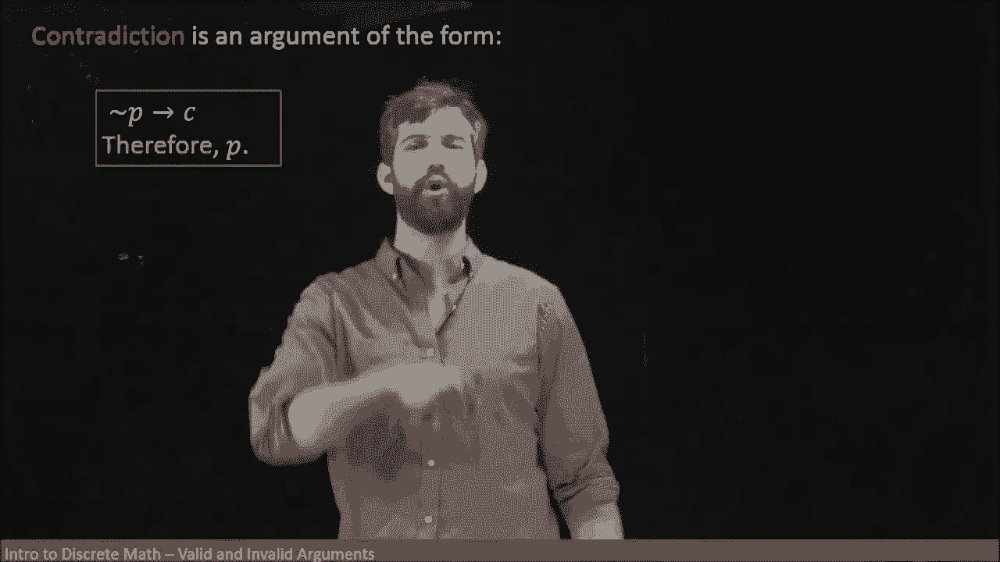
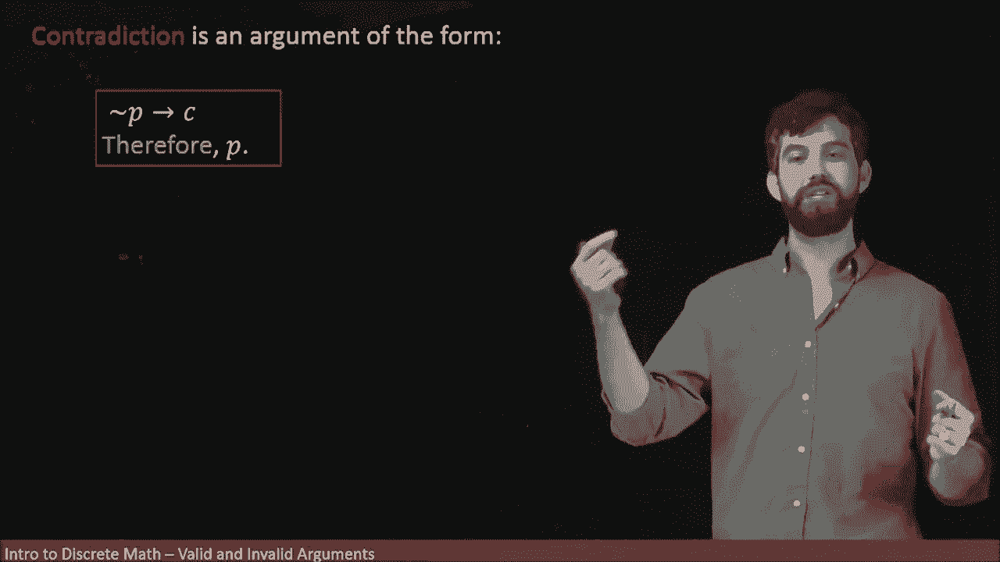

# 离散数学：L23：逻辑论证形式 - 泛化、特化与矛盾

在本节课中，我们将学习三种基础的逻辑论证形式：**泛化**、**特化**和**矛盾论证**。这些形式是构建复杂数学证明的基石，理解它们有助于我们确保推理过程的每一步都是严谨有效的。

## 泛化 (Generalization) 🧩

上一节我们介绍了逻辑论证的基本概念，本节中我们首先来看看**泛化**。泛化的核心思想是：如果一个陈述为真，那么该陈述与任何其他陈述的“或”组合也必然为真。因为“或”语句只需要其中一个部分为真即可。

其逻辑形式可以表示为：
**如果 P 为真，则 P ∨ Q 为真。**

以下是理解泛化的一个例子：
*   陈述 P：“我是加拿大人。”
*   根据泛化，我们可以得出结论：“我是加拿大人或者我是一只独角兽。”
*   因为“我是加拿大人”这部分为真，所以整个析取语句（或语句）为真。这个结论并不涉及“我是否是独角兽”的真假。

## 特化 (Specialization) 🔍

与泛化相对的是**特化**。特化是指，如果我们知道一个合取语句（“且”语句）为真，那么我们可以单独提取出其中的一部分，并断定该部分为真。

其逻辑形式可以表示为：
**如果 P ∧ Q 为真，则 P 为真。**

以下是理解特化的一个例子：
*   陈述：“我是加拿大人并且我拥有博士学位。”
*   根据特化，我们可以得出结论：“我是加拿大人。”
*   在这个例子中，我们“丢弃”了“拥有博士学位”这部分信息，只保留了论证所需的“我是加拿大人”这一部分。

泛化和特化在日常生活中被频繁使用，只是我们未必以如此明确的结构化形式来思考。在将复杂的论证转化为数学语言时，我们必须确保每一步都绝对有效。即使是泛化或特化这样相对简单的步骤，我们也可以通过真值表来验证其有效性，从而确保推理没有任何错误。

## 矛盾论证 (Proof by Contradiction) ⚡

最后，我们来看数学中一个非常重要、将会被大量使用的论证方法：**矛盾论证法**。

矛盾论证法的思路如下：为了证明一个陈述 **P** 为真，我们首先**假设 P 为假**（即假设 ¬P 为真）。然后，从这个假设出发进行推导，如果最终导出了一个**矛盾**，那么这个矛盾就表明我们最初的假设（¬P）是错误的。

矛盾通常指逻辑上不可能成立的情况，例如：
*   0 = 1
*   “某物既是哺乳动物又是爬行动物”

其逻辑形式可以表示为：
**如果 ¬P → (矛盾) 为真，则 P 为真。**

因为矛盾恒为假，而一个真前提（¬P）不可能推出假结论，所以前提 ¬P 本身必定为假，从而原命题 P 为真。

关于矛盾论证的具体例子，我们将在后续的视频中详细展示。

## 总结 📝

本节课中我们一起学习了三种核心的逻辑论证形式。
1.  **泛化**：从一个真陈述 P，可以有效地推导出更一般的陈述 P ∨ Q。
2.  **特化**：从一个真合取陈述 P ∧ Q，可以有效地推导出其中的一个组成部分 P。
3.  **矛盾论证**：通过假设命题为假并推导出矛盾，来反证原命题为真。

掌握这些基本的论证形式，是理解和构建严谨数学证明的关键第一步。