# 离散数学：L28：否定包含多个量词的逻辑语句

在本节课中，我们将学习如何分析和否定包含多个量词的逻辑语句。我们将通过具体的例子，逐步拆解语句的逻辑结构，并应用量词的否定规则。

## 分析“每个整数都有一个更大的整数”

上一节我们回顾了量词的基本概念，本节中我们来看看一个包含嵌套量词的复杂语句。

考虑这个语句：“每个整数都有一个更大的整数”。

这个语句中实际上隐藏了两个不同的量词。首先，“每个”这个词提示我们这里有一个**全称量词**。因此，要翻译这部分，我们可以说：对于整数集合中的每一个 `x`（即“每个整数”的含义）。

接着，我们分析“有一个更大的整数”这个属性。这个属性意味着存在另一个值，比如 `y`，它比我的 `x` 大。换句话说，对于某个给定的 `x`，“存在一个更大的整数”这个主张就是：存在某个其他数字 `y`，使得 `y` 大于 `x`。

因此，我们可以将整个语句用逻辑符号表示为：
`∀x ∈ ℤ, ∃y ∈ ℤ, y > x`

这个语句是正确的。因为对于任意给定的整数 `x`，你总能找到一个更大的整数，例如 `y = x + 1`。

## 否定包含多个量词的语句

现在，我们想要尝试否定这个语句。

之前我们学过，否定一个全称量词时，需要将全称量词变为存在量词，并否定其后的谓词。因此，对于 `∀x ∈ ℤ, P(x)`，其否定是 `∃x ∈ ℤ, ¬P(x)`。

在我们的例子中，`P(x)` 本身是 `∃y ∈ ℤ, y > x`。所以，否定 `P(x)` 就需要应用否定存在量词的规则：将存在量词变为全称量词，并否定其后的谓词。

以下是完整的否定步骤：
1.  否定外层全称量词：`∀x ∈ ℤ` 变为 `∃x ∈ ℤ`。
2.  否定内层谓词 `P(x)`，即 `∃y ∈ ℤ, y > x`：
    *   否定存在量词：`∃y ∈ ℤ` 变为 `∀y ∈ ℤ`。
    *   否定最终属性：`y > x` 变为 `y ≤ x`。

因此，原语句的否定是：
`∃x ∈ ℤ, ∀y ∈ ℤ, y ≤ x`

这个否定语句的意思是：“存在某个整数 `x`，使得所有整数 `y` 都小于或等于它”。换句话说，存在一个最大的整数。在整数集合中，这个陈述是**错误**的，因为整数可以无限增大，没有最大值。这符合预期，因为原语句为真，其否定应为假。

## 分析“某个数是最大的数”

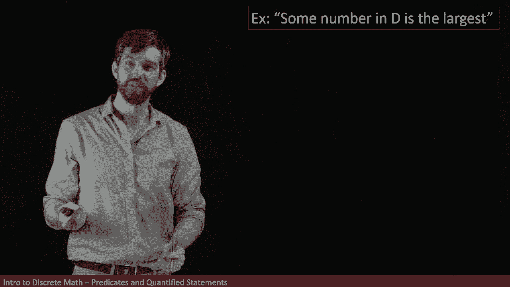

让我们看另一个例子：“某个数是最大的数”。

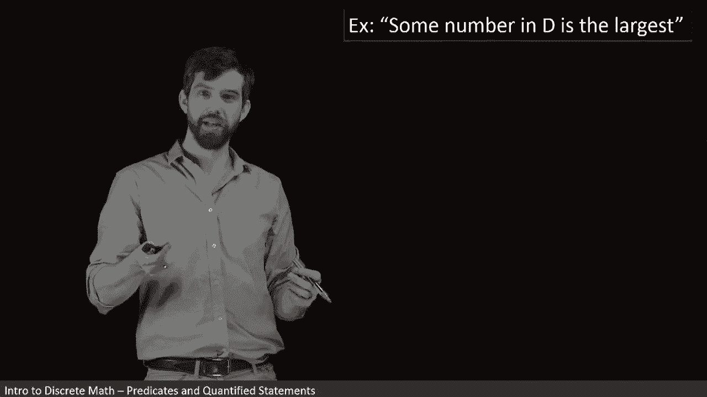

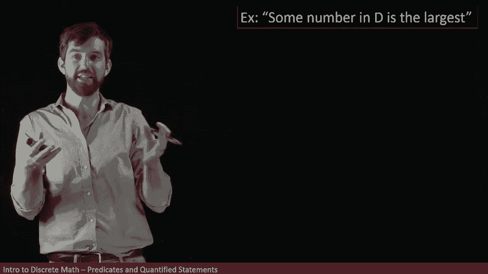

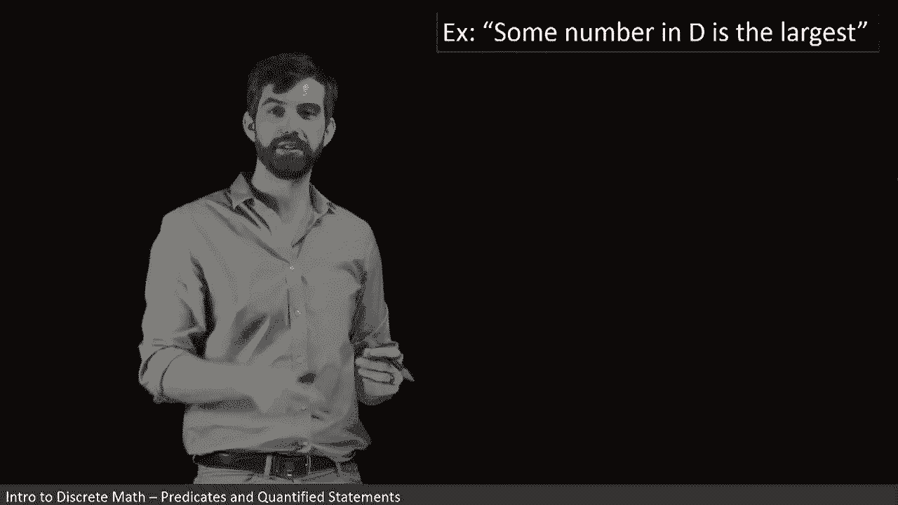

首先，我们将其拆解为量词。“某个数”是“存在”的代码词。所以，我们可以说：在定义域 `D` 中，存在某个 `x`。

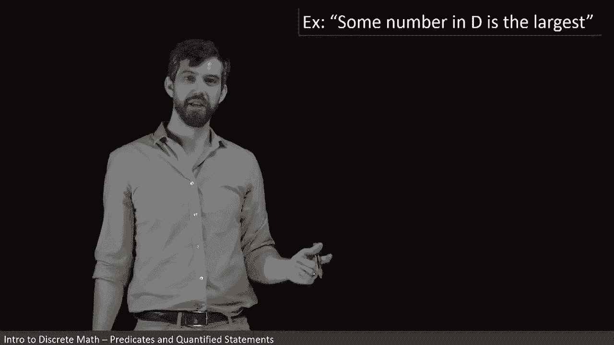

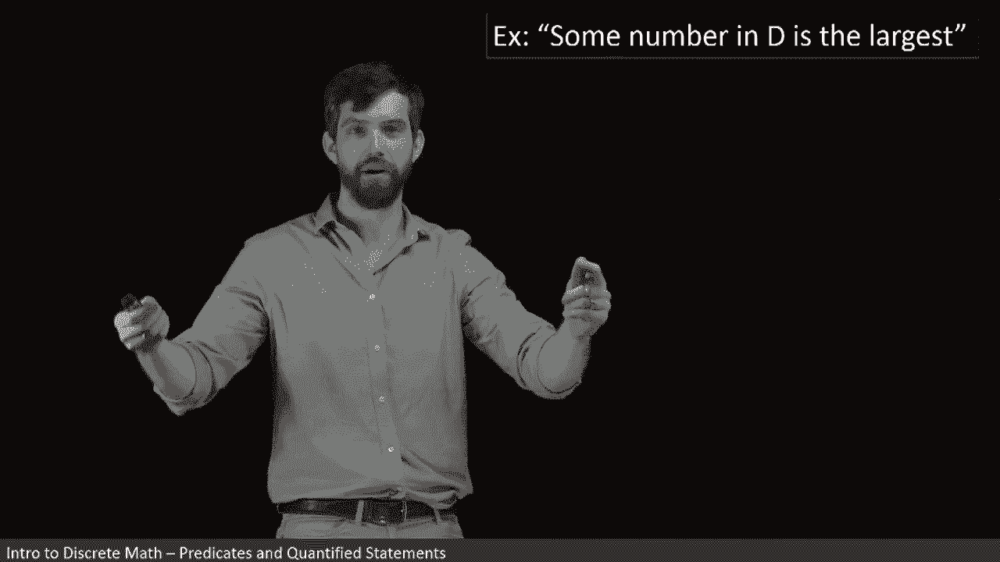

“是最大的数”这个属性 `P(x)` 可以进一步展开。如果 `x` 是最大的数，那就意味着 `x` 大于或等于定义域 `D` 中的每一个其他元素 `y`。

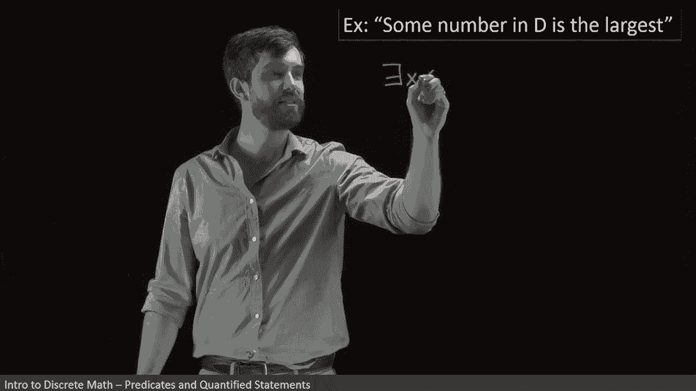

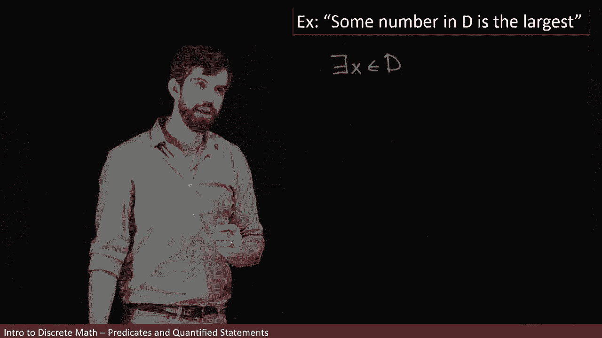

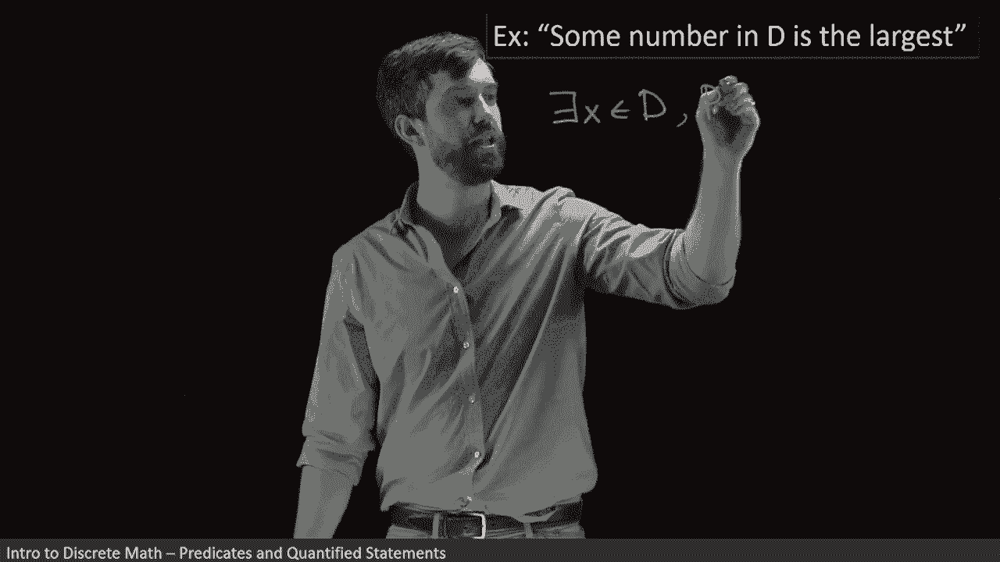

因此，整个语句的逻辑形式是：
`∃x ∈ D, ∀y ∈ D, x ≥ y`

## 否定“某个数是最大的数”

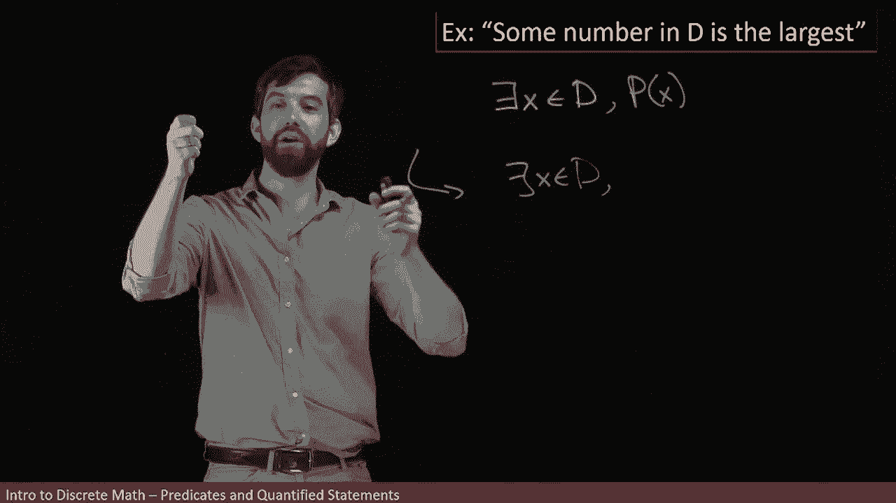

现在，我们来否定这个语句。否定规则是：从外到内，依次翻转每个量词，并最终否定最内层的属性。

以下是步骤：
1.  否定外层存在量词：`∃x ∈ D` 变为 `∀x ∈ D`。
2.  否定内层全称量词：`∀y ∈ D` 变为 `∃y ∈ D`。
3.  否定最终属性：`x ≥ y` 变为 `x < y`。

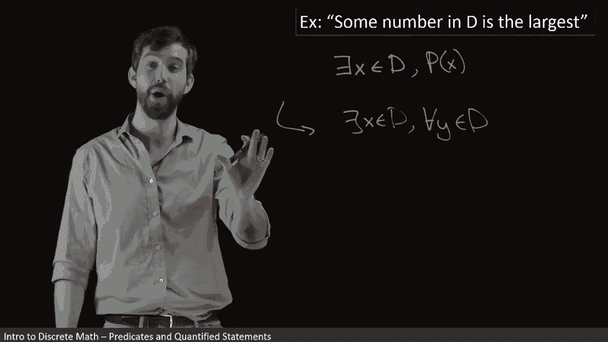

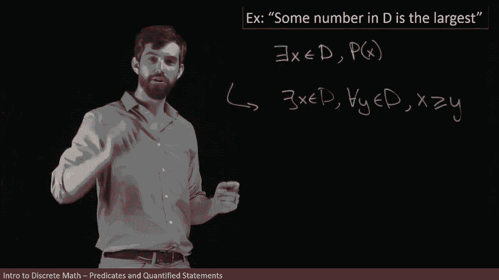

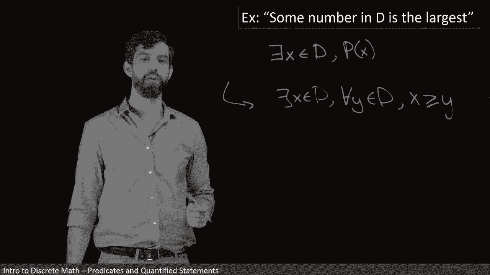

因此，否定后的语句是：
`∀x ∈ D, ∃y ∈ D, x < y`

这个否定语句的意思是：“对于定义域 `D` 中的每一个数 `x`，都存在另一个数 `y` 比它大”。这恰恰否定了“存在一个最大数”的原始主张，它声称无论你选哪个数，总能找到一个更大的数。

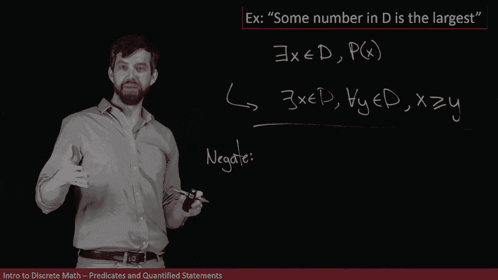

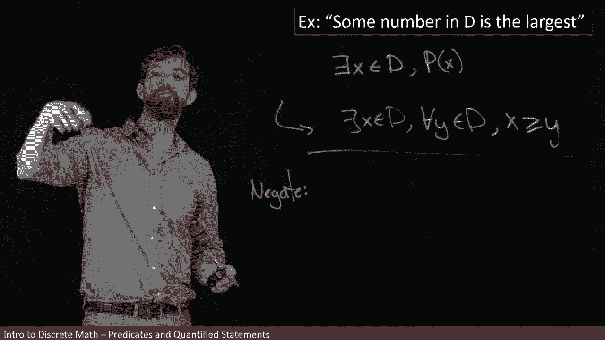

这个例子与前一个例子正好相反，唯一的区别在于这里的定义域 `D` 是任意集合，而前一个例子明确指定为整数集。

## 总结

本节课中我们一起学习了如何处理包含多个量词的逻辑语句。
1.  我们首先学习了如何将自然语言陈述（如“每个整数都有一个更大的整数”）分解为嵌套的量词逻辑形式。
2.  接着，我们系统性地应用了量词的否定规则：**否定全称量词 `∀` 会得到存在量词 `∃`，并否定其后的谓词；否定存在量词 `∃` 会得到全称量词 `∀`，并否定其后的谓词**。
3.  我们通过两个具体例子（关于整数和关于任意定义域中的最大数）演示了从外到内、逐步翻转量词并否定最终属性的完整否定过程。

掌握这些技巧对于理解更复杂的数学证明和计算机科学中的形式化规范至关重要。