# 47：强归纳法 🔬

在本节课中，我们将要学习**强归纳法**的概念。这是一种与普通数学归纳法相关但功能更强大的证明技术，能够处理更广泛的命题集合。

上一节我们介绍了普通数学归纳法，它就像爬一个无限的梯子。本节中我们来看看强归纳法，它允许我们在证明时假设更多已知条件。

## 强归纳法的原理 🧩

强归纳法的目标是证明一个依赖于整数 `n` 的命题 `P(n)` 对所有 `n ≥ a` 都成立。其证明过程包含两个步骤。

以下是强归纳法的两个核心步骤：

1.  **基础步骤**：我们不仅证明 `P(a)` 成立，通常还需要证明从 `P(a)` 到 `P(b)` 的有限个初始命题都成立。这里的 `b` 是一个具体的数。
2.  **归纳步骤**：我们假设命题对所有小于等于 `k` 的整数都成立（即 `P(i)` 对所有 `a ≤ i ≤ k` 成立），然后利用这个更强的假设去证明 `P(k+1)` 也成立。

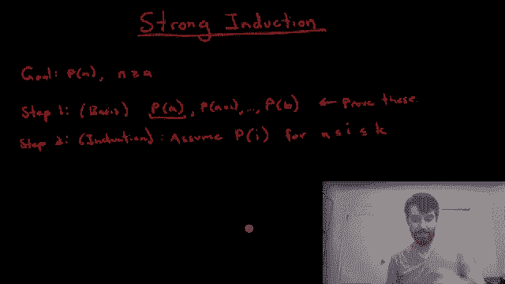

用公式描述，归纳步骤的假设是：
```
∀i (a ≤ i ≤ k) → P(i)
```
需要证明的结论是：
```
P(k+1)
```

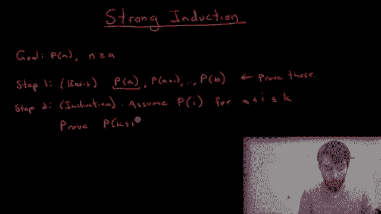

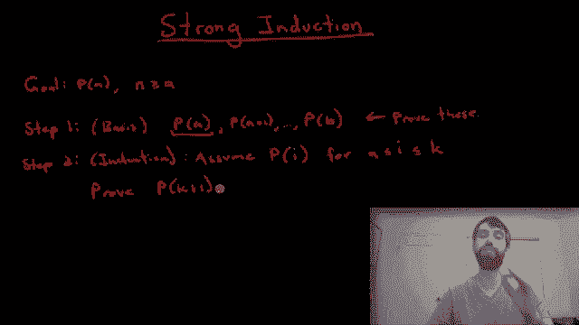

如果这两个步骤都成功完成，那么根据强归纳原理，命题 `P(n)` 就对所有 `n ≥ a` 成立。

## 强归纳法示例 📝

现在，我们通过一个具体的例子来演示强归纳法的应用。

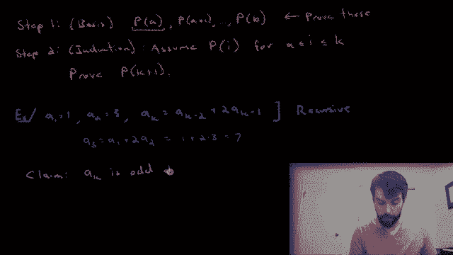

我们定义一个数列。该数列的第一项 `a₁ = 1`，第二项 `a₂ = 3`。从第三项开始，每一项由递归公式定义：
```
aₖ = aₖ₋₂ + 2 * aₖ₋₁
```
例如，`a₃ = a₁ + 2*a₂ = 1 + 2*3 = 7`。

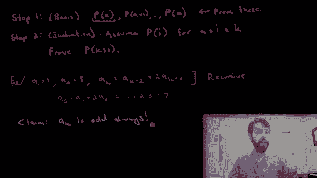

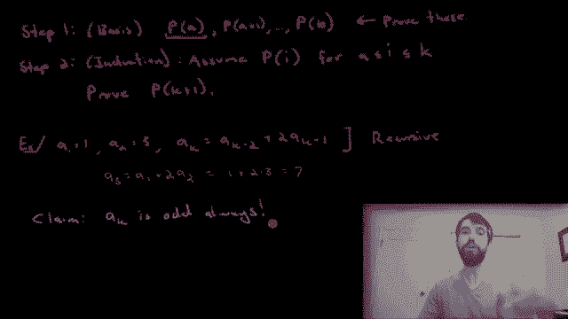

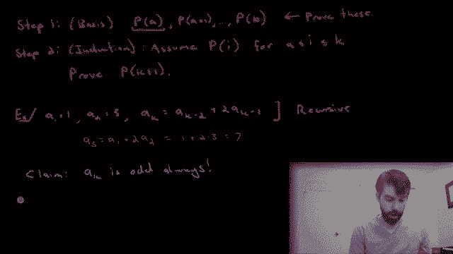

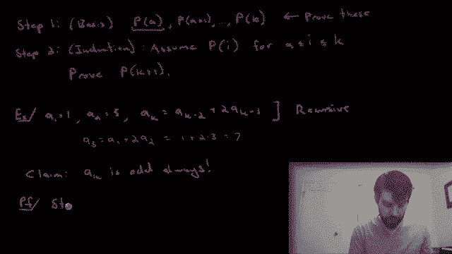

我们想要证明的命题是：**这个数列的每一项 `aₖ` 都是奇数**。

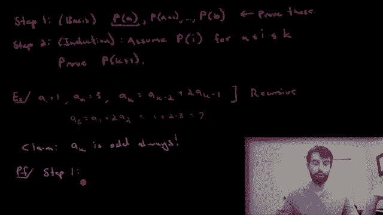

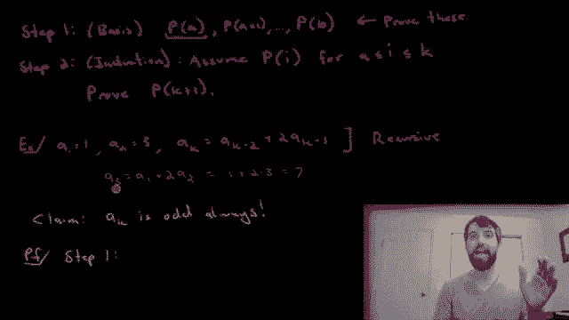

我们将使用强归纳法来证明。

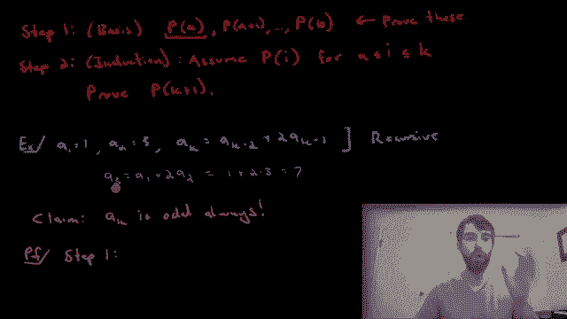

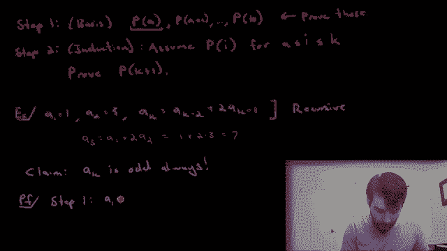

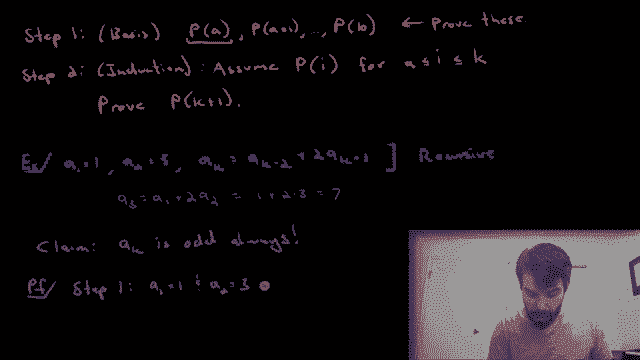

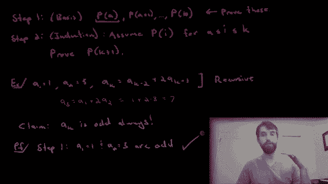

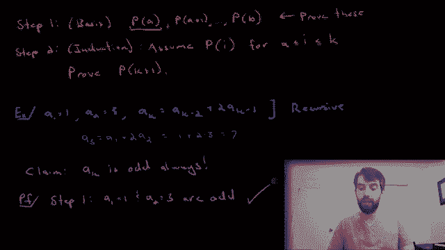

### 证明过程

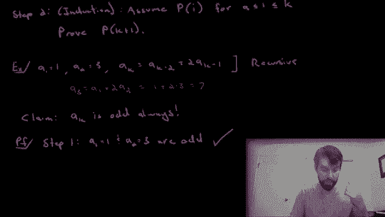

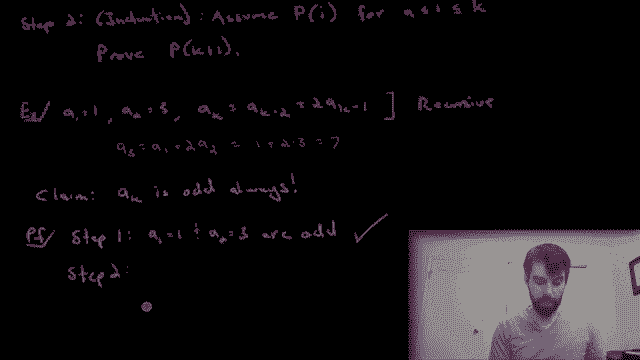

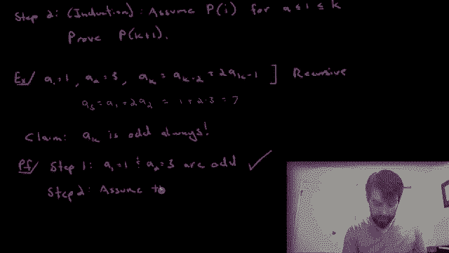

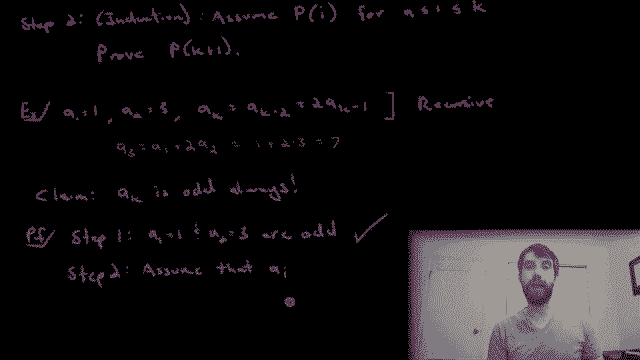

**基础步骤**：
我们需要验证初始的几项。由于递归公式 `aₖ = aₖ₋₂ + 2*aₖ₋₁` 依赖于前两项，因此我们的基础步骤需要证明前两项都是奇数。
*   `a₁ = 1`，是奇数。
*   `a₂ = 3`，是奇数。
基础步骤完成。

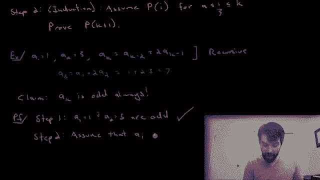

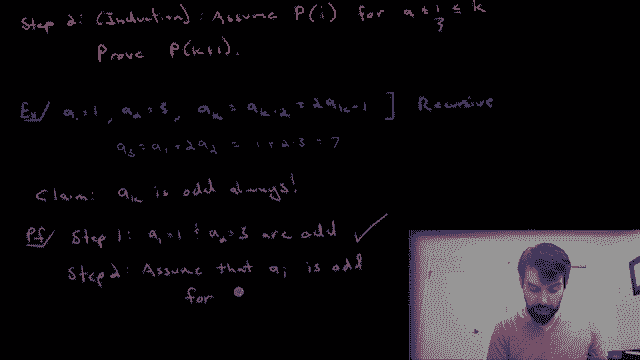

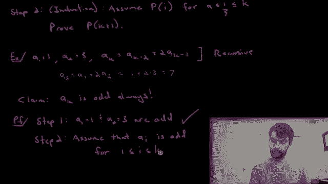

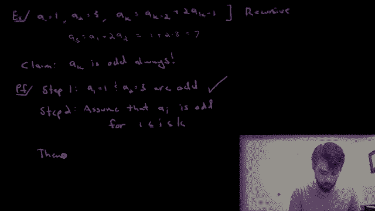

**归纳步骤**：
现在，我们进行归纳假设。假设对于某个整数 `k ≥ 2`，命题对所有 `i`（`1 ≤ i ≤ k`）都成立，即：
```
aᵢ 是奇数，对于所有 1 ≤ i ≤ k。
```
在这个假设下，我们需要证明 `aₖ₊₁` 也是奇数。

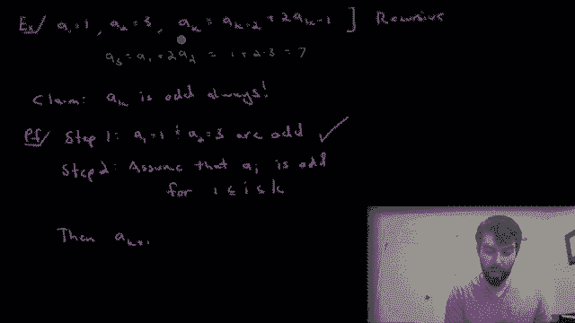

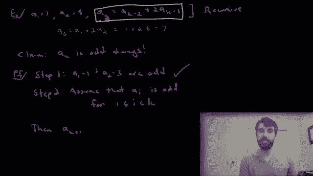

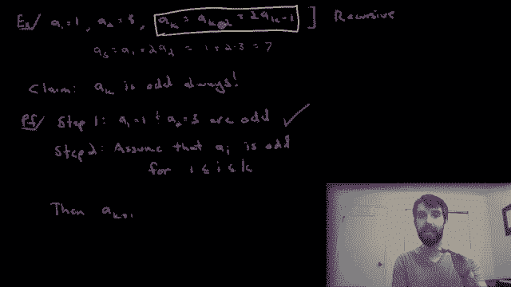

根据数列的递归定义：
```
aₖ₊₁ = a₍ₖ₊₁₎₋₂ + 2 * a₍ₖ₊₁₎₋₁ = aₖ₋₁ + 2 * aₖ
```
根据我们的归纳假设，`aₖ₋₁` 和 `aₖ` 都是奇数。任何奇数都可以写成 `2m + 1` 的形式，其中 `m` 是整数。

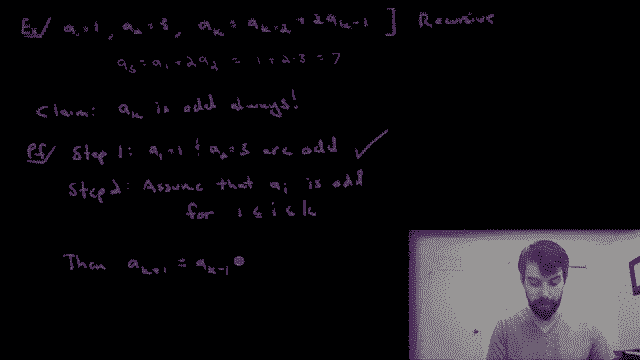

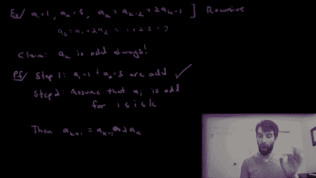

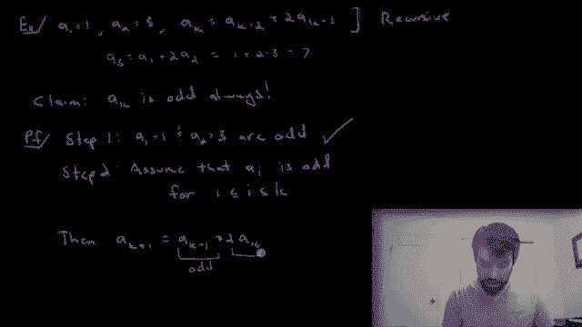

因此，设：
```
aₖ₋₁ = 2p + 1
aₖ = 2q + 1
```
其中 `p` 和 `q` 是整数。

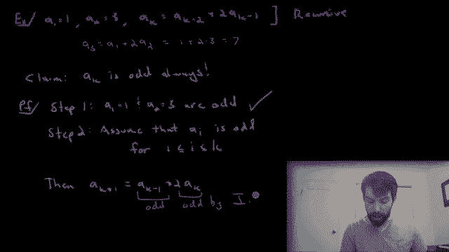

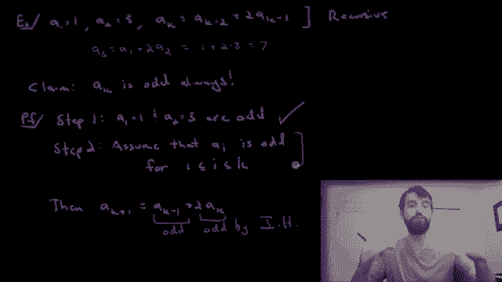

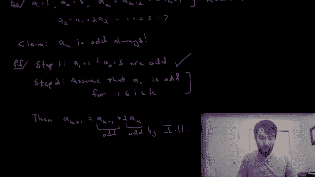

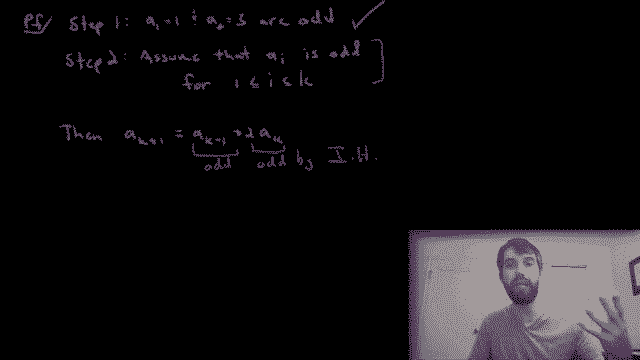

将它们代入 `aₖ₊₁` 的表达式：
```
aₖ₊₁ = (2p + 1) + 2 * (2q + 1)
     = 2p + 1 + 4q + 2
     = 2p + 4q + 3
     = 2(p + 2q + 1) + 1
```
令 `r = p + 2q + 1`，显然 `r` 是整数。于是：
```
aₖ₊₁ = 2r + 1
```
这正是一个奇数的标准形式。因此，我们证明了在归纳假设下，`aₖ₊₁` 也是奇数。

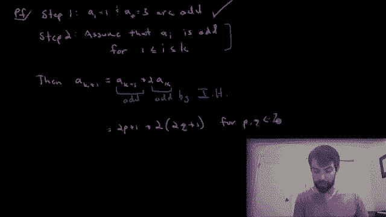

**结论**：
根据强归纳原理，我们证明了对于所有正整数 `k`，`aₖ` 都是奇数。

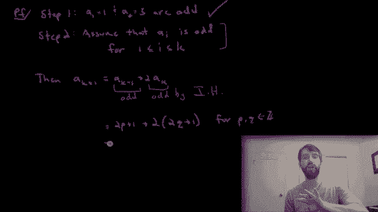

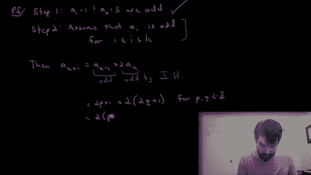

## 总结 📚

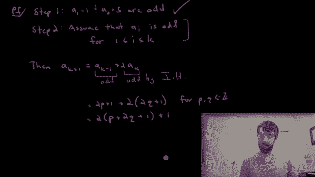

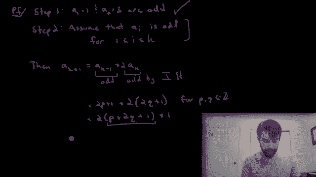

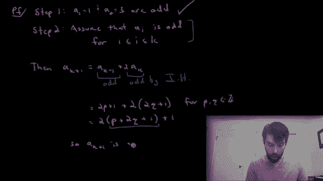

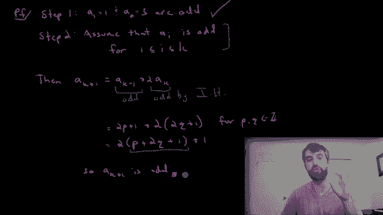

本节课中我们一起学习了**强归纳法**。它与普通归纳法的核心区别在于归纳步骤的假设更强：我们假设命题对所有小于等于 `k` 的情况都成立，而不仅仅是 `k` 本身。这种方法特别适用于证明涉及递归定义（即当前项依赖于前多项）的命题。通过一个证明数列项均为奇数的例子，我们完整地演练了强归纳法的两个步骤——基础步骤和归纳步骤。