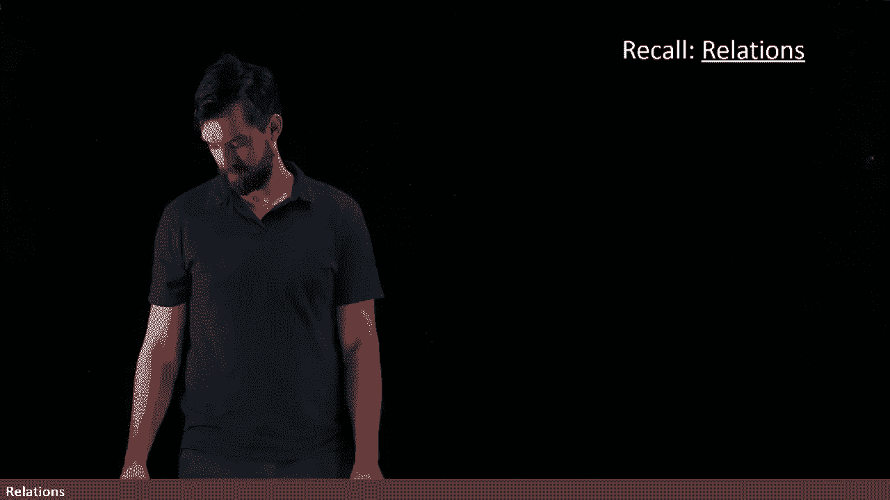
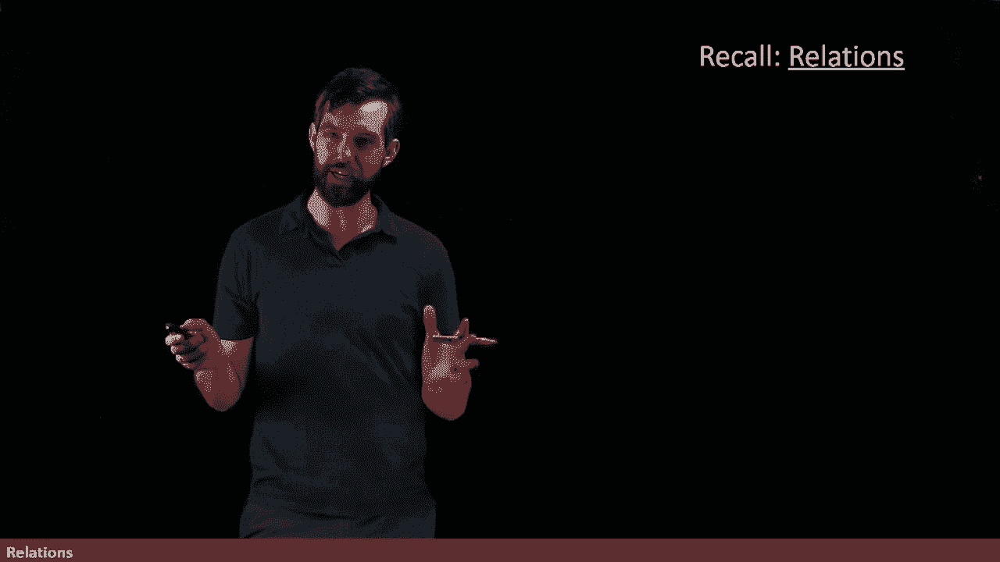
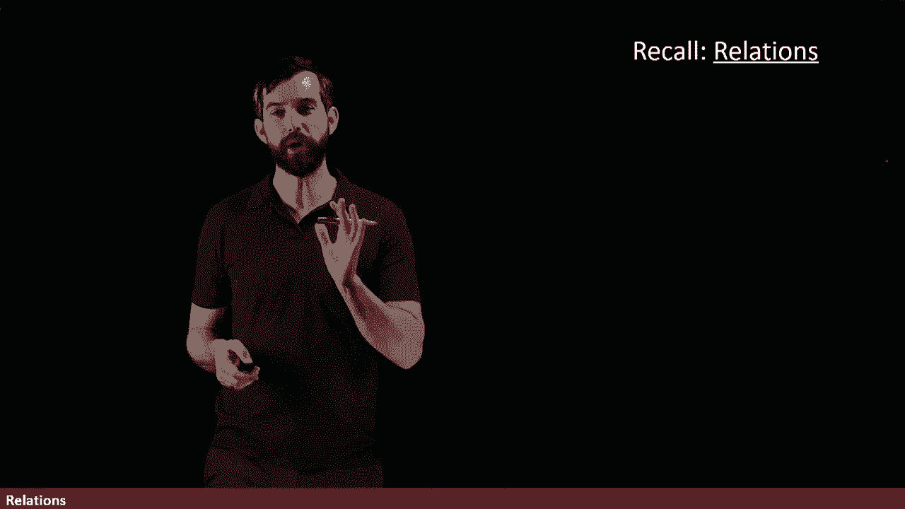
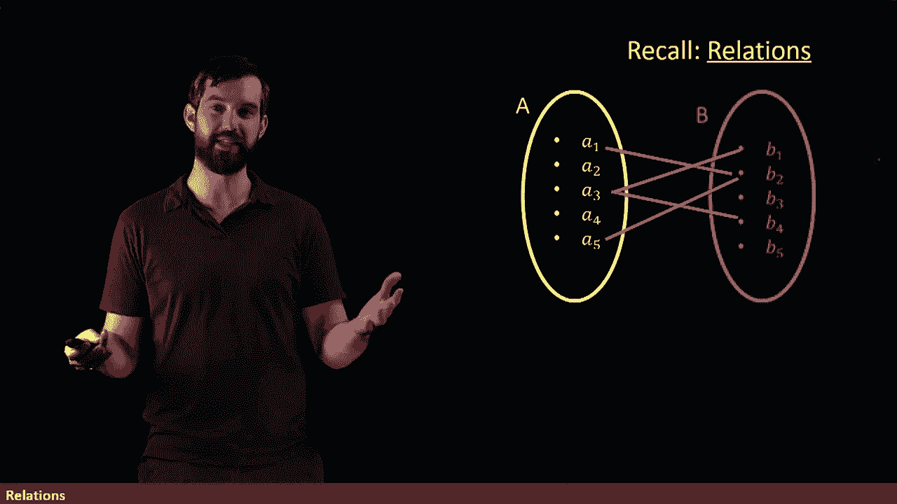
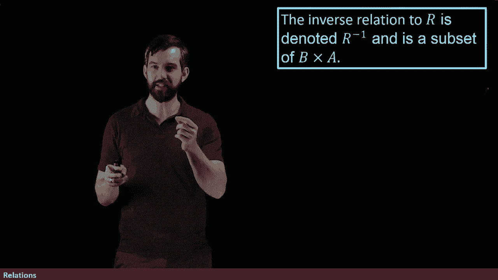
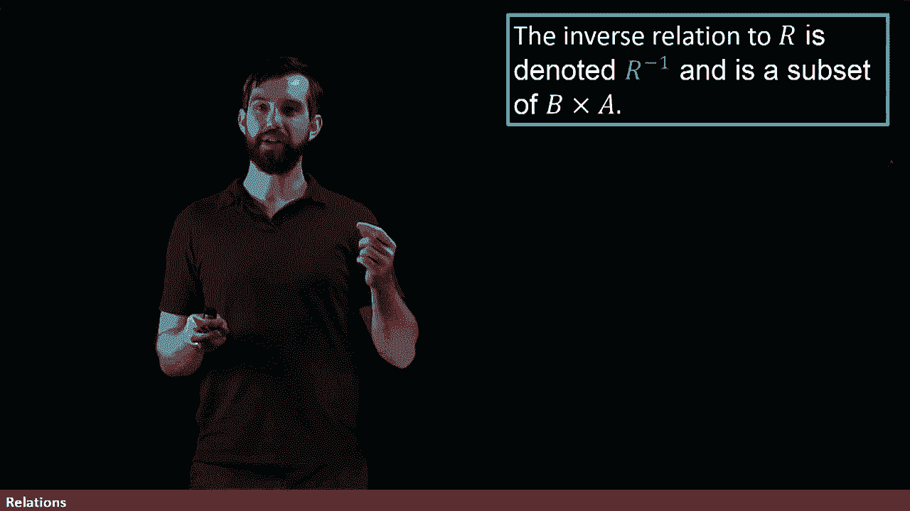

# 56：关系及其逆关系

在本节课中，我们将深入学习关系的概念，并探讨如何从一个给定的关系构造其逆关系。

## 关系的回顾

上一节我们介绍了集合与函数的基本概念。本节中，我们来看看关系的定义。

关系涉及两个不同的集合。设有一个集合 **A** 和一个集合 **B**。集合 **A** 中包含若干元素，集合 **B** 中也包含若干元素。

我们可以通过箭头图来可视化一个关系，即从集合 **A** 到集合 **B** 的连接。例如，元素 **a1** 连接到 **b2**，元素 **a5** 也连接到 **b2**，元素 **a3** 则连接到 **b1** 和 **b4**，依此类推。

有时，如果一个关系额外满足垂直线测试的性质，并且定义域中的每个元素都有映射，我们就可以称该关系为一个函数。这一点我们之前已经讨论过。

关系的正式定义如下：关系是笛卡尔积的一个子集。笛卡尔积是指所有有序对 **(a, b)** 的集合，其中 **a** 来自 **A**，**b** 来自 **B**。

我们说一个有序对，例如 **(a1, b2)**，是关系 **R** 中的一个元素，当且仅当在箭头图中，**a1** 确实与 **b2** 相关联。在记法上，当 **(a, b)** 是笛卡尔积中的一个元素（或在箭头图中存在一条从 **a** 到 **b** 的箭头）时，我们写作 **a R b**。

## 逆关系的引入

现在，如果我们有一个关系，我们还可以定义其逆关系。

逆关系的核心思想是，它执行了从 **A** 到 **B** 的关系所做的操作，但将其方向翻转过来。

例如，让我们回顾之前看到的关系 **R**。对于逆关系，我们将尝试交换 **A** 和 **B** 的角色。

首先，逆关系的起始集合（即定义域）变成了原来的 **B**，而目标集合（即陪域）变成了原来的 **A**。然后，我们需要考虑如何连接这些元素。

具体来说，如果原关系中 **b1** 连接到 **a3**，那么在逆关系中，**b1** 就作为起点连接到 **a3**。同样，原关系中 **b2** 连接到 **a1** 和 **a5**，那么在逆关系中，**b2** 就作为起点连接到 **a1** 和 **a5**。因此，我们可以画出这些连接线，它们恰好是原关系图的镜像。

## 核心概念总结

以下是本节课的核心概念总结：

*   **关系**：一个从集合 **A** 到集合 **B** 的关系 **R**，是笛卡尔积 **A × B** 的一个子集。记作 **R ⊆ A × B**。
*   **逆关系**：给定关系 **R ⊆ A × B**，其逆关系 **R⁻¹** 定义为 **R⁻¹ = {(b, a) | (a, b) ∈ R}**。这意味着 **R⁻¹** 是从 **B** 到 **A** 的关系。

本节课中我们一起学习了关系的正式定义，并掌握了如何通过交换有序对中元素的顺序来构造一个关系的逆关系。理解关系及其逆是学习更复杂数学结构（如函数和等价关系）的重要基础。