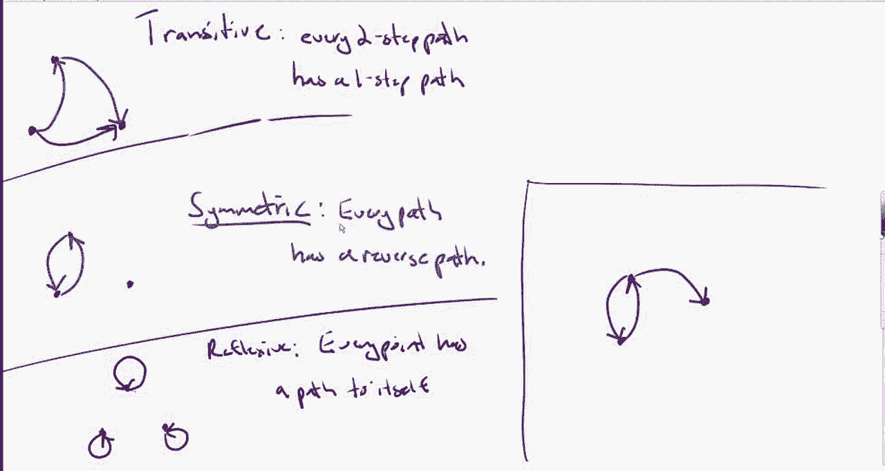
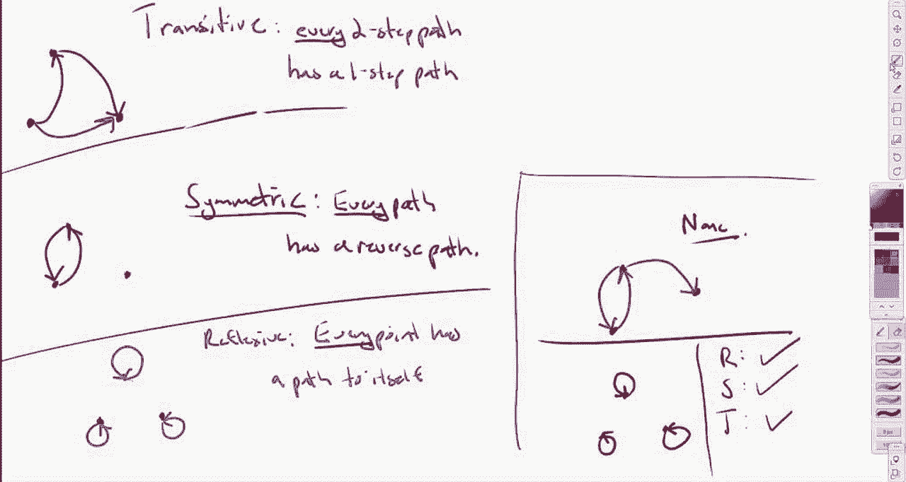

# 离散数学：L59：关系性质的判定与常见误区

在本节课中，我们将学习如何判定一个关系是否满足自反性、对称性和传递性。我们将通过具体的图示例子，深入理解这些性质的定义，并澄清初学者容易混淆的常见误区。

## 概述

关系的三个基本性质——自反性、对称性和传递性——是离散数学的核心概念。我们将通过分析关系图，学习如何逐一检查这些性质。关键在于理解定义中的“每一个”元素或路径都必须满足条件，这一点常常被忽略。

## 判定自反性

上一节我们介绍了关系性质的基本概念，本节中我们来看看如何具体判定自反性。

一个关系 **R** 在集合 **A** 上是自反的，当且仅当集合 **A** 中的**每一个**元素都与自身相关。在关系图中，这表现为每个节点都必须有一个指向自身的环（loop）。

**公式定义**：∀a ∈ A, (a, a) ∈ R

请看以下关系图示例：

以下是判定步骤：
*   检查图中的每一个点（元素）。
*   观察每个点上是否都有一个从自身出发并指向自身的箭头（环）。
*   如果**所有**的点都有这样的环，则关系是自反的。如果有一个点没有，则不是自反的。

在上图中，没有任何一个节点有指向自身的环，因此这个关系**不是自反的**。

## 判定对称性

理解了自反性后，我们来看看对称性。对称性要求关系的方向是可逆的。

一个关系 **R** 是对称的，当且仅当每当存在从元素 **a** 到 **b** 的路径时，也必然存在从 **b** 回到 **a** 的路径。在图中，这意味着**每一条**有向箭头都必须有其反向箭头。

**公式定义**：∀a, b ∈ A, if (a, b) ∈ R then (b, a) ∈ R

现在，让我们用同一张图来检验对称性。以下是分析思路：
*   你需要检查图中的**每一条**有向路径。
*   对于从点X到点Y的箭头，必须存在一个从点Y回到点X的箭头。
*   如果**所有**的路径都满足这个条件，关系才是对称的。

观察上图，从左上角节点出发有一条指向右侧节点的路径，并且确实存在一条返回的路径。然而，从右侧节点出发有一条指向下方节点的路径，**却没有**从下方节点返回的路径。由于存在不满足条件的路径，因此这个关系**不是对称的**。不能因为部分路径可逆就认为整个关系对称。

## 判定传递性

最后，我们来探讨传递性。传递性关注的是路径的“短路”能力。

一个关系 **R** 是传递的，当且仅当每当存在从 **a** 到 **b** 以及从 **b** 到 **c** 的路径（一个两步路径）时，也必然存在直接从 **a** 到 **c** 的路径（一个一步路径）。

**公式定义**：∀a, b, c ∈ A, if (a, b) ∈ R and (b, c) ∈ R then (a, c) ∈ R

我们继续分析上图。以下是判定方法：
*   你需要找出所有可能的“两步”路径（即通过一个中间节点连接的两段箭头）。
*   对于每一个这样的两步路径，都必须存在一个直接的“一步”箭头连接起点和终点。
*   如果**所有**的两步路径都满足此条件，关系才是传递的。

在上图中，存在一个两步路径：从左上角节点到右侧节点，再到下方节点。但是，不存在从左上角节点直接指向下方节点的一步路径。因此，这个关系**不是传递的**。

综上所述，对于展示的关系图，它**不满足自反、对称、传递中的任何一条性质**。

## 一个微妙的特例

现在，我们来看一个更具迷惑性的例子，它能帮助我们更深刻地理解定义中的逻辑。

这个关系是自反的吗？是的，因为**每一个**节点都有一个指向自身的环，这符合自反性的定义。

那么，它是对称的吗？直觉上可能认为“不是”，因为图中没有成对出现的反向箭头。但请仔细回想定义：**如果**存在一条从a到b的路径，**那么**必须存在一条从b到a的路径。

以下是关键分析：
*   在这个图中，**根本不存在**任何从一个节点指向另一个不同节点的“外出”路径。
*   由于“如果……”的前提条件（即存在路径(a, b)）永远不成立，那么“那么……”的结论（即存在路径(b, a)）就无需被检验。
*   在逻辑上，一个“如果假，那么……”的陈述总是为真。因此，这个关系**是（平凡地）对称的**。

同理，判定传递性：
*   传递性的条件是：**如果**存在路径(a, b)和(b, c)，**那么**必须存在路径(a, c)。
*   在此图中，**不存在任何**两步路径（因为连一步路径都没有）。
*   前提条件永不成立，因此结论无需满足，该关系也**是（平凡地）传递的**。

这个例子说明了，一个只有自反环（每个点指向自己）而没有其他任何箭头的关系，同时满足自反、对称和传递性。它之所以满足后两者，是因为定义中的条件语句前提未被触发。

## 总结

本节课中我们一起学习了如何判定关系的三大性质：
1.  **自反性**：检查**每一个**元素是否有指向自身的环。
2.  **对称性**：检查**每一条**路径是否有其反向路径。
3.  **传递性**：检查**每一条**两步路径是否有对应的一步直达路径。

核心要点在于定义中的“每一个”（∀）这个词。你必须检查所有相关元素或路径，不能因为部分满足就下结论。同时，也要注意逻辑条件语句（if...then...）的微妙之处：当前提条件不成立时，整个语句被视为真。掌握这些细节，才能准确无误地判断关系的性质。