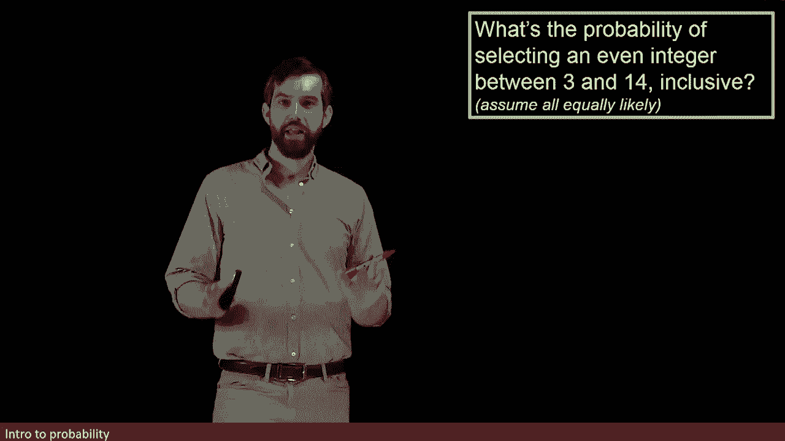
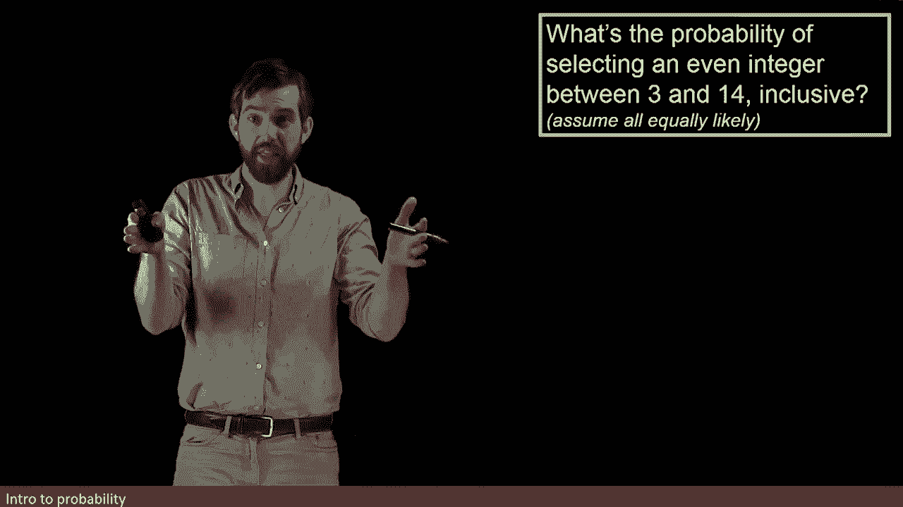
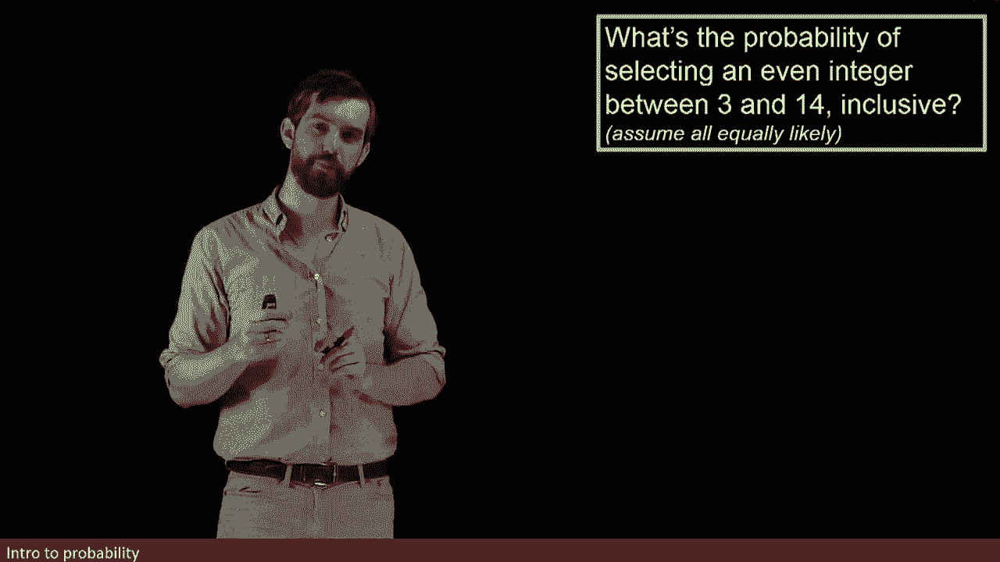
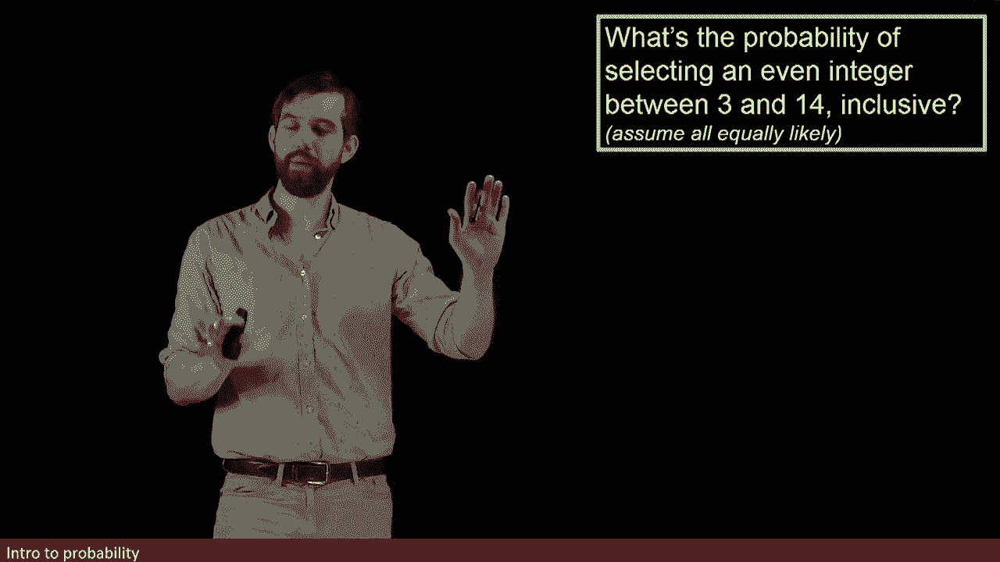
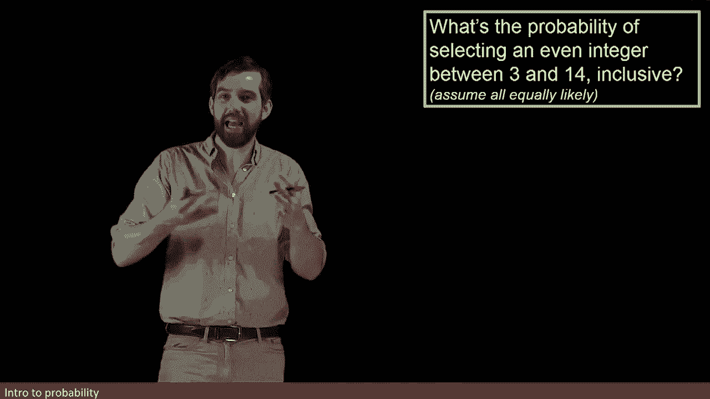
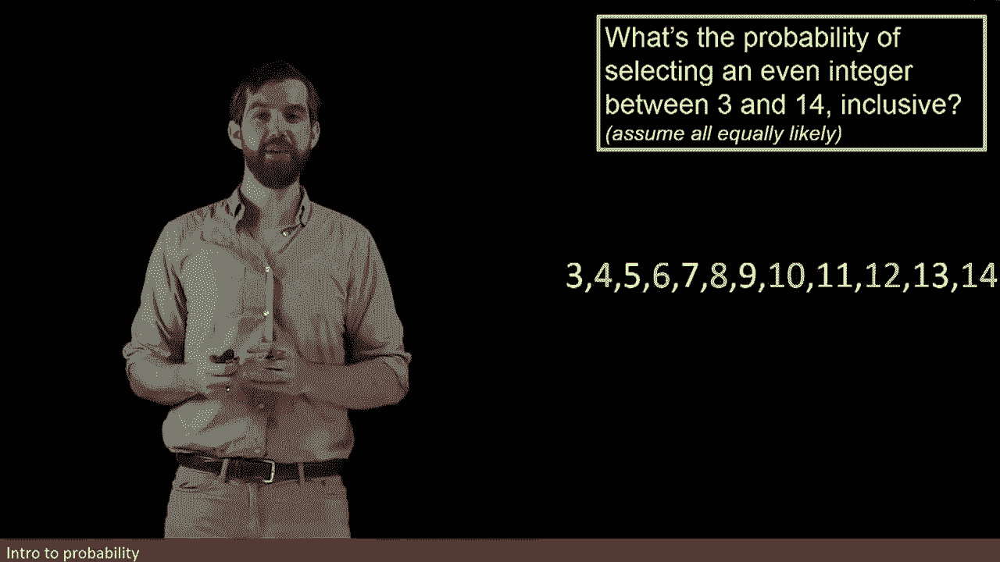
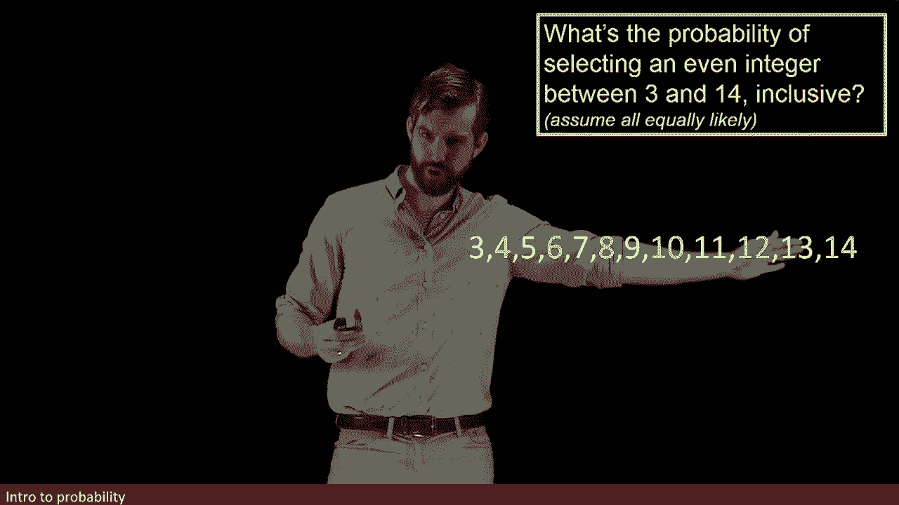
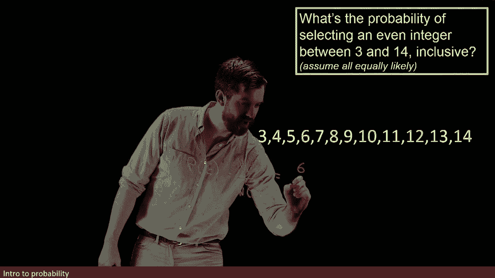
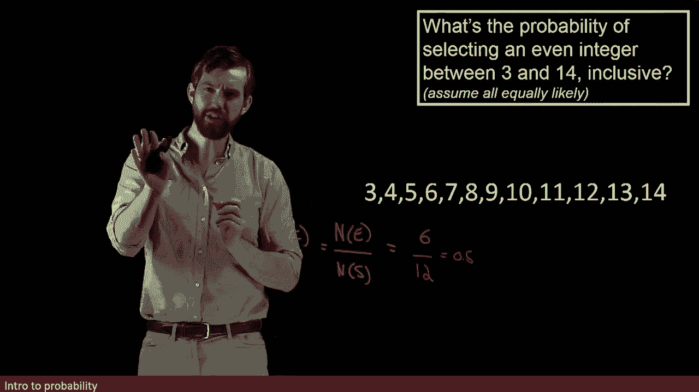
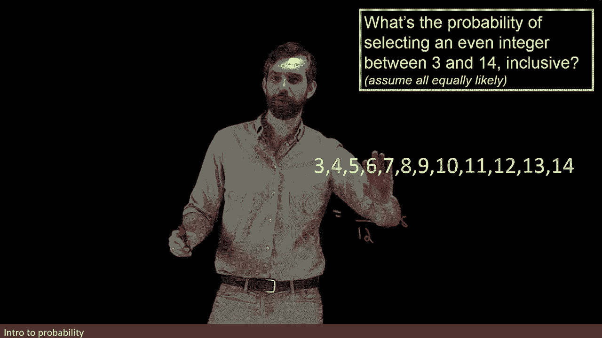

# 61：使用P(E)=N(E)/N(S)计算概率的示例

在本节课中，我们将通过一个具体示例，学习如何使用基本概率公式 **P(E) = N(E) / N(S)** 来计算事件的概率。我们将从一个简单的整数选择问题入手，并探讨概率与计数之间的紧密联系。

## 问题描述

在这个示例中，我们想要计算一个概率：如果我在3到14之间（包括3和14）随机选择一个整数，那么这个数是偶数的概率是多少？

## 概率与计数的联系

上一节我们介绍了概率的基本概念。本节中我们来看看，概率问题本质上与计数问题紧密相连。解答一个概率问题，通常就是在解答一个关于计数的问题。

让我们先列出我们感兴趣的所有整数。从3开始，一直到14。下图用黄色高亮标出了其中的偶数。

## 应用概率公式

我们的概率公式告诉我们，需要计算事件E中元素的数量 **N(E)**，除以样本空间S中元素的总数 **N(S)**。公式如下：

**P(E) = N(E) / N(S)**

以下是计算步骤：

首先，计算事件E（选到偶数）的数量。从列表中数出偶数：4， 6， 8， 10， 12， 14。总共有6个偶数。因此，**N(E) = 6**。

然后，计算样本空间S（所有可能选择的整数）的总数。从3到14（包括两端）的整数总数为12个。因此，**N(S) = 12**。

将数值代入公式：

**P(偶数) = 6 / 12 = 0.5**

换句话说，概率是0.5或50%。

## 改变问题条件

现在，让我们看看如果改变问题的条件，概率会如何变化。

假设我将选择范围改为从3一直到50。

这会产生什么影响？15不是偶数，所以事件E中的偶数数量 **N(E)** 没有变化。但是，样本空间的总数 **N(S)** 从12增加到了48（从3到50，包括两端，共有48个整数）。

因此，新的概率计算如下：

**P(偶数) = N(E) / N(S) = 6 / 48 = 0.125**

这个例子说明，即使事件本身（选到偶数）没有改变，样本空间的扩大也会直接影响概率值。

## 总结

本节课中，我们一起学习了如何使用基本概率公式 **P(E) = N(E) / N(S)** 来计算简单事件的概率。我们通过一个选择偶数的例子，实践了如何确定事件数量和样本空间总数，并将它们代入公式。最后，我们通过改变样本空间的大小，观察了概率如何随之变化，从而加深了对概率与计数之间关系的理解。