# 69：计数与概率演练 🧮

在本节课中，我们将通过一系列具体问题，学习并应用组合计数与概率的基本概念。我们将从简单的组合数计算开始，逐步深入到更复杂的场景，如排列单词、抛硬币、设计考试题目以及扑克牌组合等。

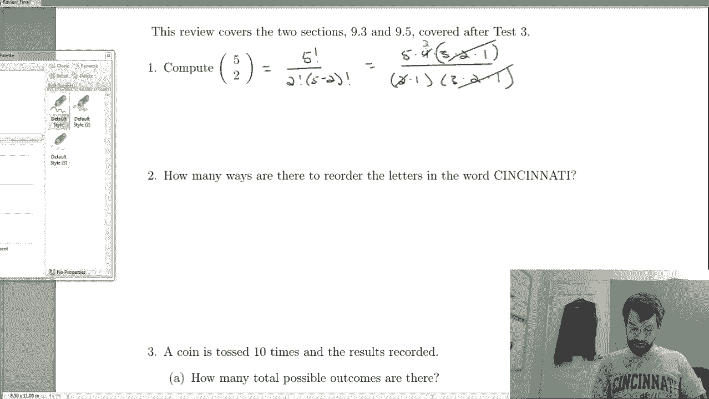

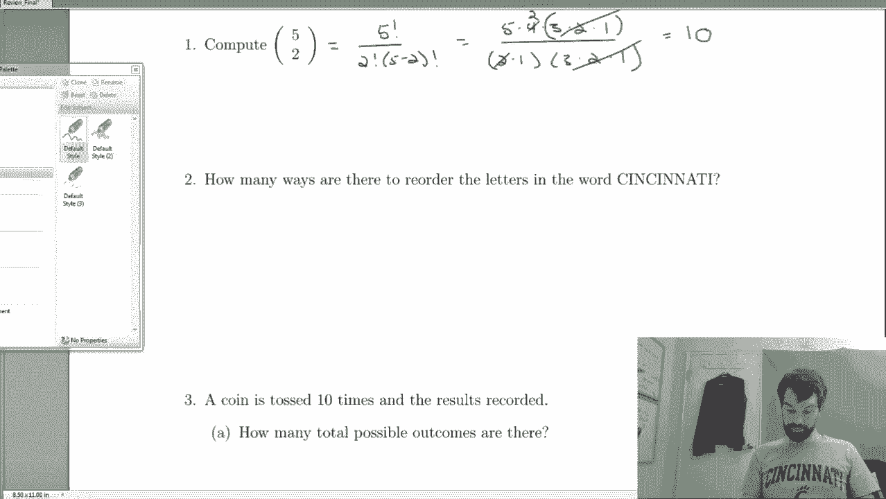

---

## 组合数公式回顾

首先，我们回顾组合数的基本公式。组合数 `C(n, r)` 表示从 `n` 个不同元素中选取 `r` 个元素的方法数，其计算公式为：

**公式：** `C(n, r) = n! / [r! * (n - r)!]`

例如，计算 `C(5, 2)`：
1.  根据公式：`5! / (2! * 3!)`
2.  展开计算：`(5*4*3*2*1) / [(2*1) * (3*2*1)]`
3.  约分后得到结果：`10`

这个公式是解决后续所有计数问题的基础。

---

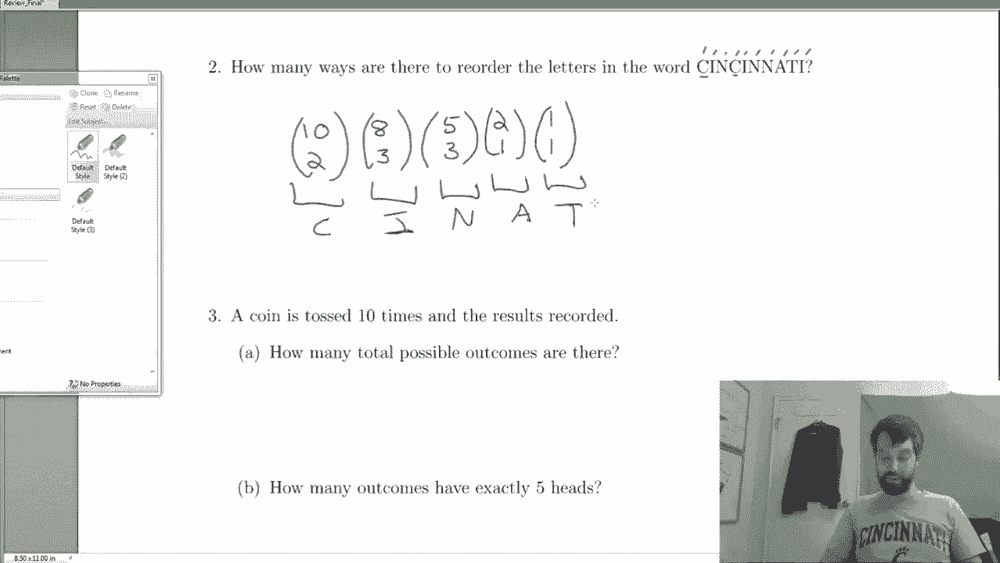

## 单词字母重排 🔤

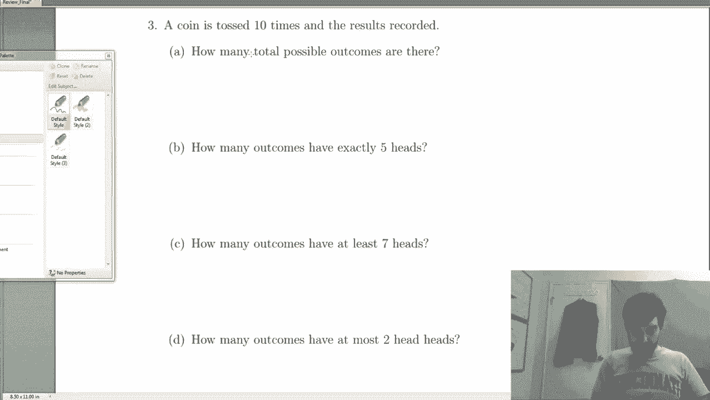

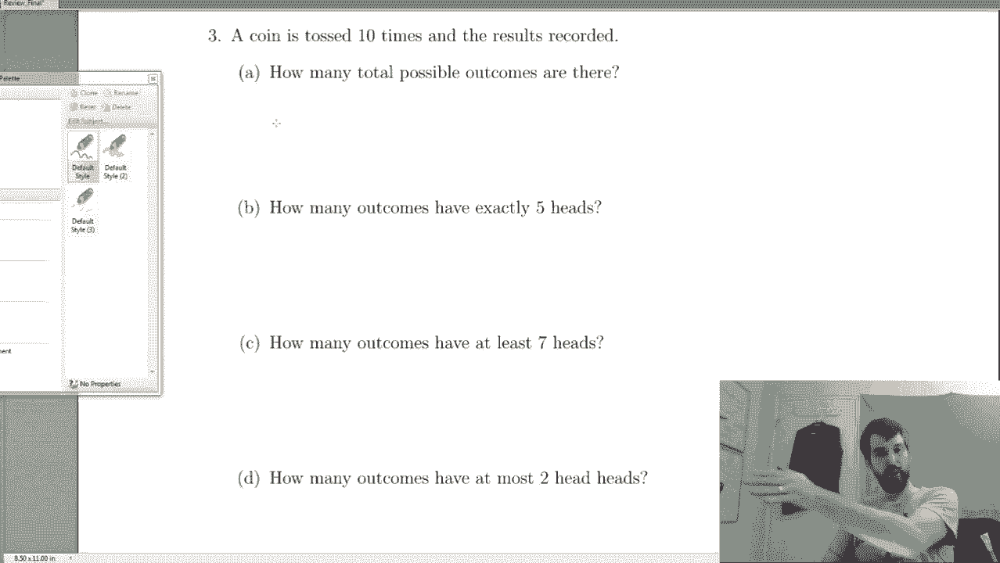

上一节我们回顾了组合数公式，本节中我们来看看如何将其应用于实际排列问题。以单词 “Cincinnati” 为例，我们需要计算其所有字母的重新排列方式总数。

解题思路是分步为每个字母选择位置。以下是具体步骤：

1.  **放置字母 C**：单词中有 2 个 C。首先从 10 个位置中选择 2 个给 C：`C(10, 2)`。
2.  **放置字母 I**：单词中有 3 个 I。此时已用掉 2 个位置，剩余 8 个。从这 8 个位置中选择 3 个给 I：`C(8, 3)`。
3.  **放置字母 N**：单词中有 3 个 N。此时已用掉 5 个位置，剩余 5 个。从这 5 个位置中选择 3 个给 N：`C(5, 3)`。
4.  **放置字母 A 和 T**：剩余字母 A 和 T 各 1 个。从最后 2 个位置中选择 1 个给 A：`C(2, 1)`。最后一个位置自动留给 T：`C(1, 1) = 1`。

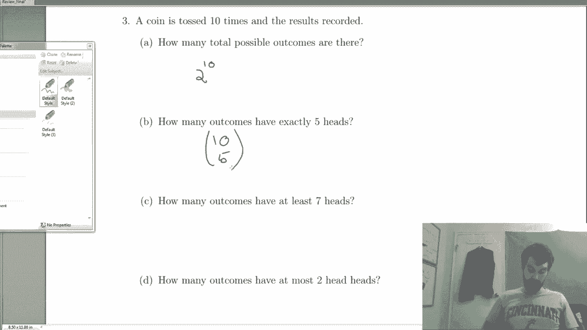

总排列数即为以上各步组合数的乘积。注意，选择字母的顺序可以变化，但最终结果相同。

---

## 抛硬币问题 🪙

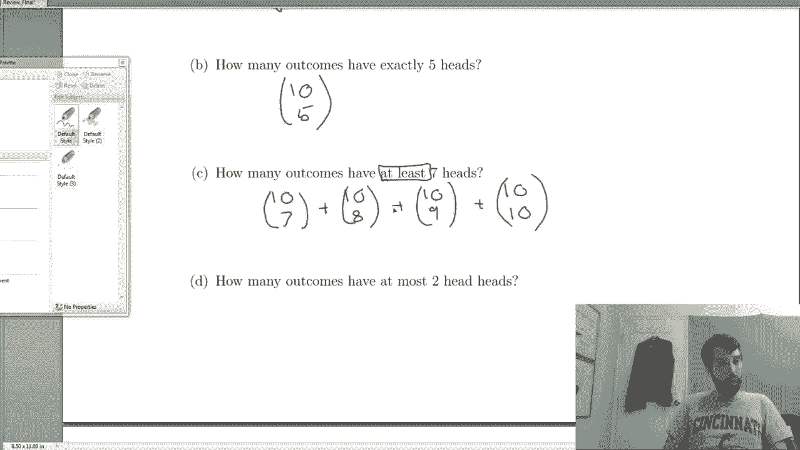

现在，我们将计数原理应用于一个经典的二项式场景：抛硬币。

### 总可能结果数

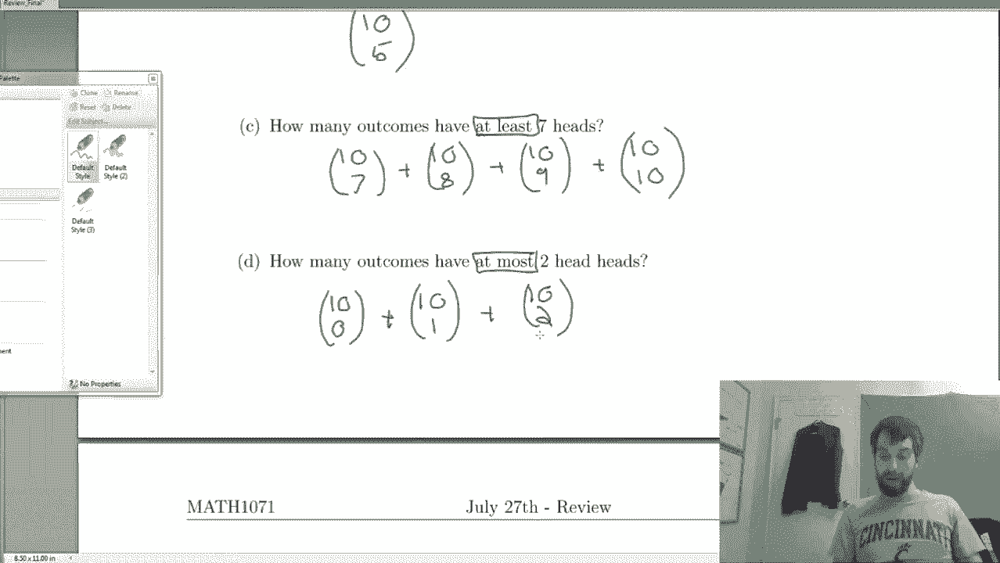

一枚硬币抛掷 10 次，每次结果有两种可能（正面或反面）。因此，总的结果数为：
**公式：** `2^10`

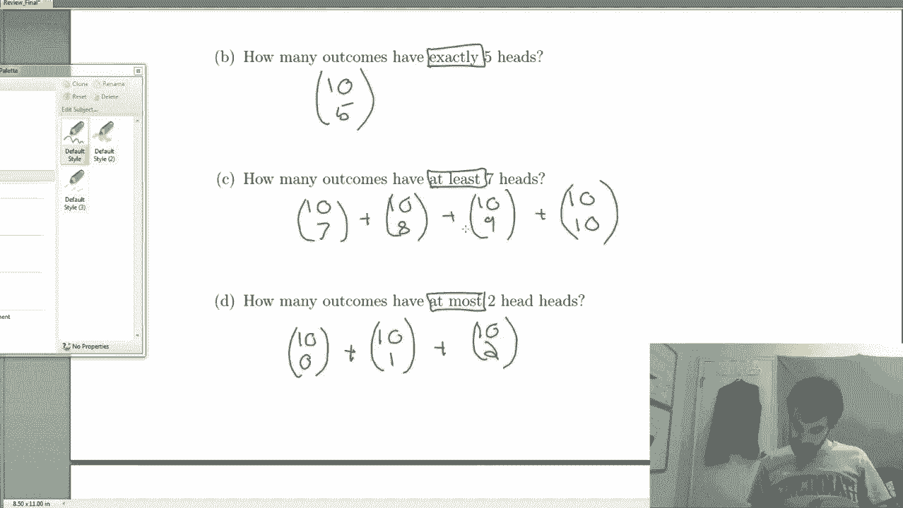

### 恰好出现 5 次正面的结果数

由于每次试验是独立的，且结果非正即反，确定哪些位置是正面后，其余位置自动为反面。因此，问题转化为从 10 次抛掷中选择 5 次作为正面：
**公式：** `C(10, 5)`

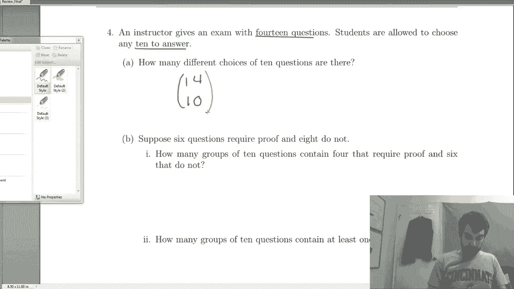

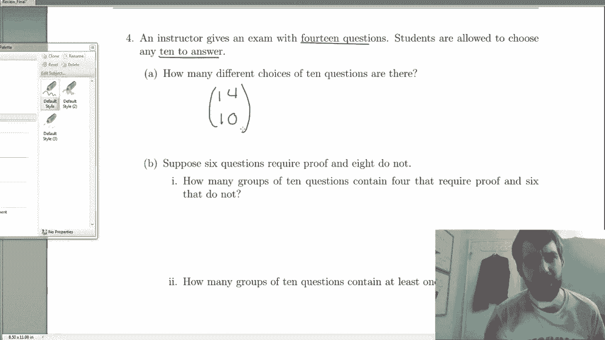

### 至少出现 7 次正面的结果数

“至少 7 次正面” 包含 7次、8次、9次和10次正面四种情况。我们需要分别计算并求和：
**公式：** `C(10, 7) + C(10, 8) + C(10, 9) + C(10, 10)`

### 至多出现 2 次正面的结果数

“至多 2 次正面” 包含 0次、1次和2次正面三种情况。同样需要分别计算并求和：
**公式：** `C(10, 0) + C(10, 1) + C(10, 2)`

关键是要准确理解“恰好”、“至少”和“至多”这些限定词的含义。

---

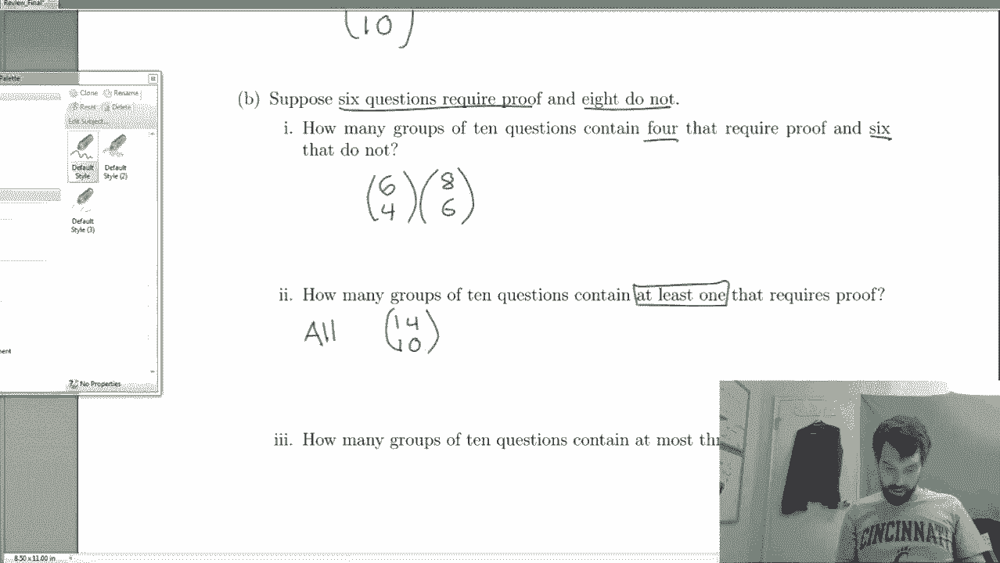

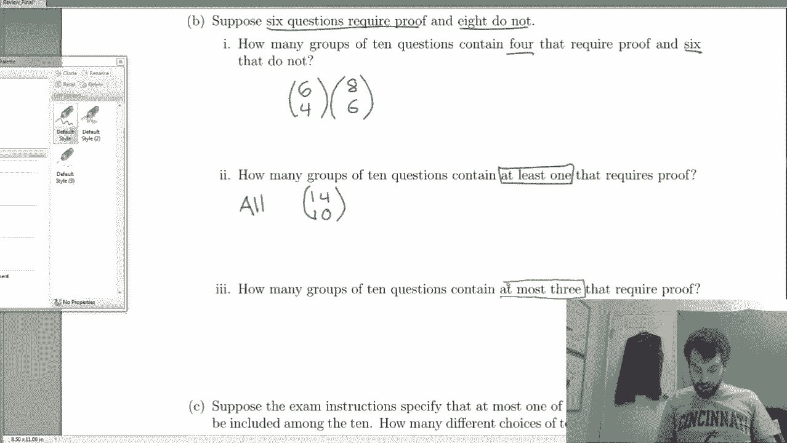

## 考试题目选择问题 📝

接下来，我们分析一个更复杂的场景：学生从一套试题中选择部分题目作答。

### 基础情况

一场考试共有 14 道题，学生需选择其中 10 道作答。选择方式总数为：
**公式：** `C(14, 10)`

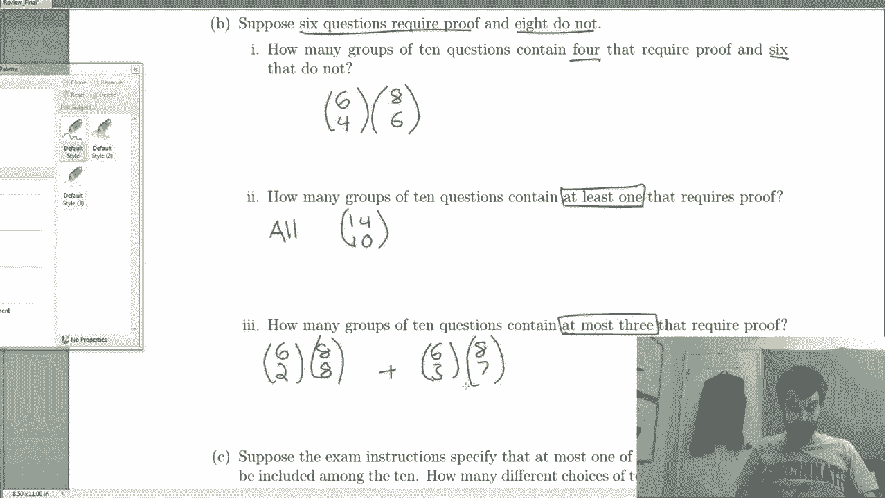

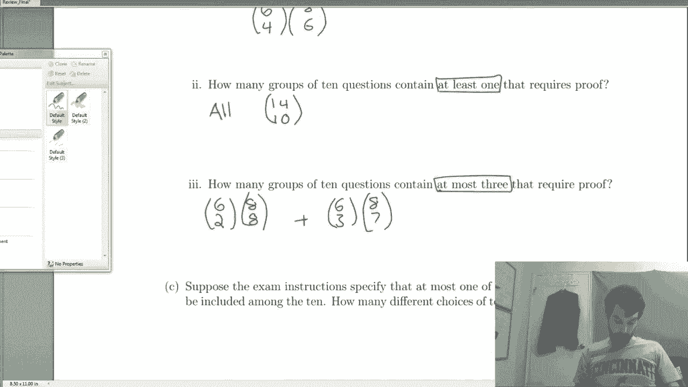

### 带有限制条件的选择

现在，我们为题目增加属性。假设 14 题中，有 6 题需要证明，8 题不需要。

**情况一：选择4道需证明的题和6道不需证明的题。**
这是一个分步独立事件：先从6道证明题中选4道，再从8道非证明题中选6道。
**公式：** `C(6, 4) * C(8, 6)`

**情况二：选择的10题中至少包含1道需证明的题。**
由于非证明题只有8道，任何10题的组合都至少包含2道证明题。因此，这个数量等于总选择数：
**公式：** `C(14, 10)`

**情况三：选择的10题中至多包含3道需证明的题。**
“至多3道”意味着可能包含2道或3道证明题（因为至少需要2道来凑够10题）。我们需要计算这两种情况并相加：
*   2道证明题 + 8道非证明题：`C(6, 2) * C(8, 8)`
*   3道证明题 + 7道非证明题：`C(6, 3) * C(8, 7)`
**总公式：** `C(6, 2)*C(8, 8) + C(6, 3)*C(8, 7)`

### 针对特定题目的限制

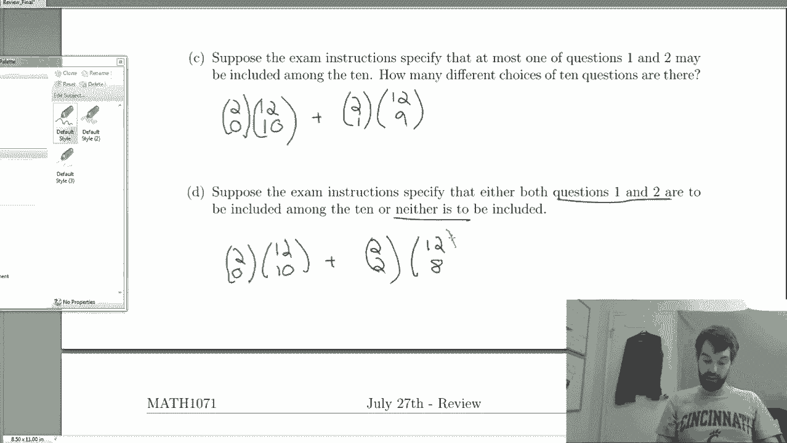

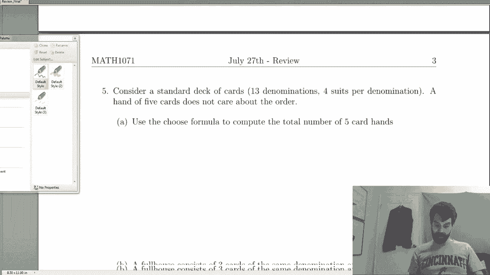

假设考试规定，第1题和第2题中至多有一道能被选入10题中。
这分为两种情况：
1.  **两道题都不选**：从剩余12题中选10题。`C(2, 0) * C(12, 10)`
2.  **只选其中一道**：先从第1、2题中选1道 (`C(2, 1)`)，再从剩余12题中选9道 (`C(12, 9)`)。
**总公式：** `C(2, 0)*C(12, 10) + C(2, 1)*C(12, 9)`

假设考试规定，第1题和第2题要么同时被选，要么同时不被选。
这也分为两种情况：
1.  **两道都不选**：从剩余12题中选10题。`C(2, 0) * C(12, 10)`
2.  **两道都选**：先确定选上第1、2题 (`C(2, 2)`)，再从剩余12题中选8道 (`C(12, 8)`)。
**总公式：** `C(2, 0)*C(12, 10) + C(2, 2)*C(12, 8)`

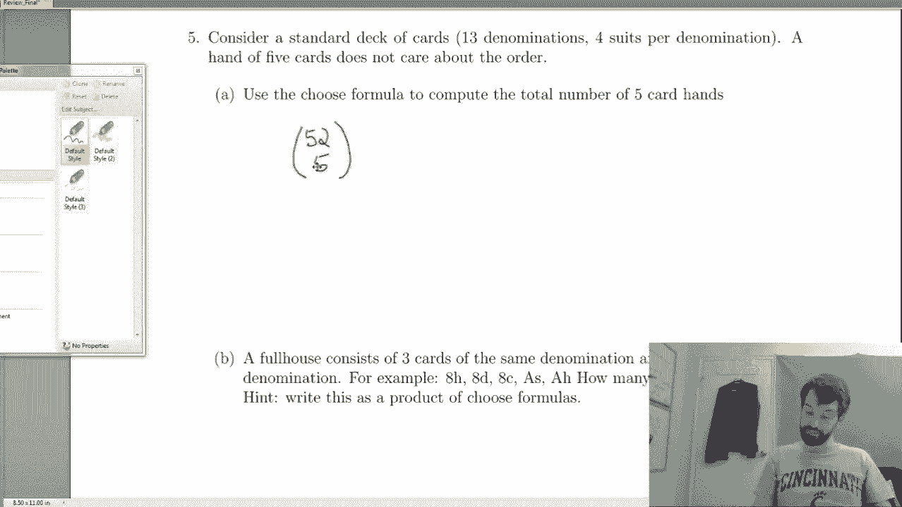

---

## 扑克牌组合问题 ♠️♥️♣️♦️

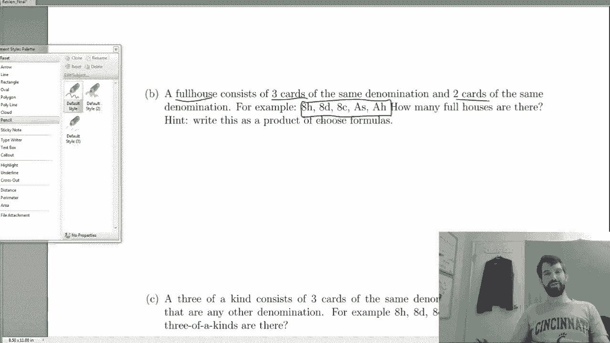

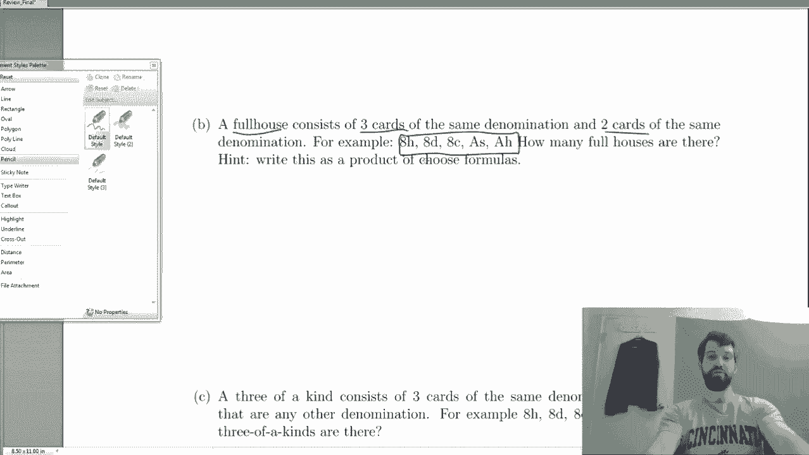

最后，我们应用计数原理来计算扑克牌中的特定牌型。一副标准扑克牌有52张，包含13种点数，每种点数有4种花色。

### 总手牌数

一手5张牌的组合数（不考虑顺序）为：
**公式：** `C(52, 5)`

### 满堂红（Full House）

满堂红指3张同点数加一对其他点数的牌型（例如，3张8和一对A）。
计算策略分两步：先选点数，再为选定的点数分配花色。
1.  **选择点数**：先从13种点数中选1种作为3张牌的点数 (`C(13, 1)`)，再从剩余12种点数中选1种作为一对牌的点数 (`C(12, 1)`)。
2.  **选择花色**：对于3张牌，从4种花色中选3种 (`C(4, 3)`)。对于一对牌，从4种花色中选2种 (`C(4, 2)`)。
**总公式：** `C(13, 1) * C(12, 1) * C(4, 3) * C(4, 2)`

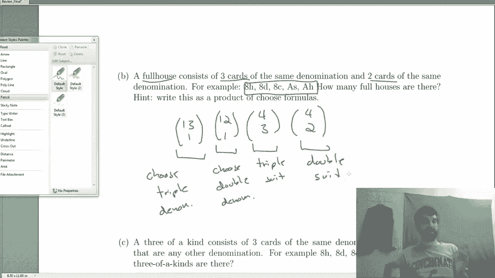

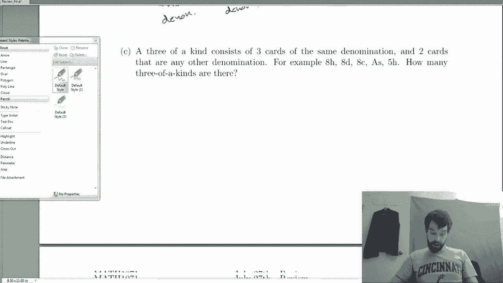

### 三条（Three of a Kind）

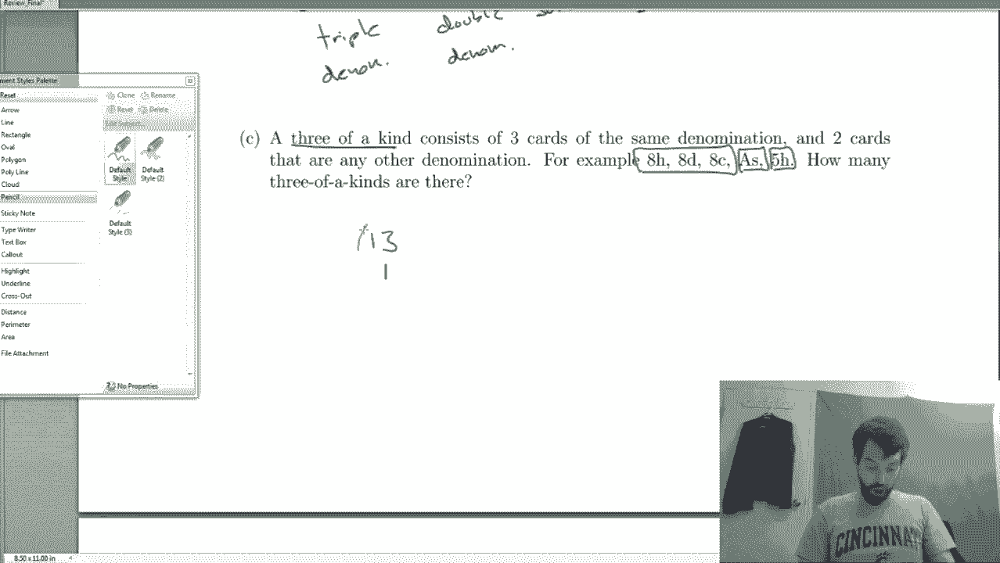

三条指3张同点数，外加2张点数彼此不同且与前三张也不同的牌型。
计算步骤：
1.  **选择三条的点数**：`C(13, 1)`
2.  **选择另外两张牌的点数**：从剩余12种点数中选2种 (`C(12, 2)`)，注意这里用组合而非排列，因为这两张牌点数顺序不重要。
3.  **选择花色**：
    *   三条：从4种花色中选3种 (`C(4, 3)`)。
    *   第一张杂牌：从4种花色中任选1种 (`C(4, 1)`)。
    *   第二张杂牌：从4种花色中任选1种 (`C(4, 1)`)。
**总公式：** `C(13, 1) * C(12, 2) * C(4, 3) * C(4, 1) * C(4, 1)`

---

## 密码设置问题 🔐

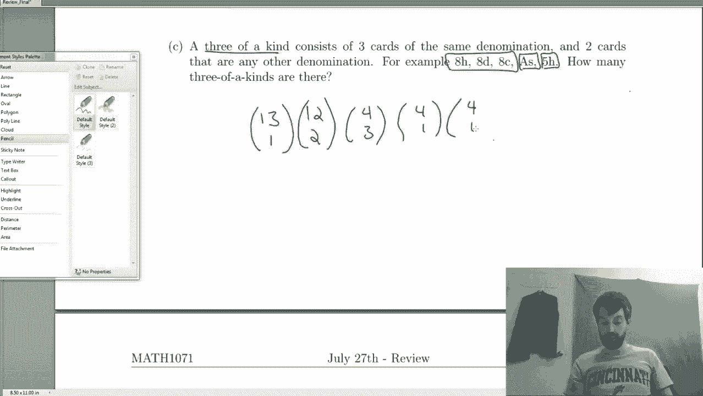

考虑一个密码系统，密码长度可以是3、4或5个符号，符号取自26个英文字母。

### 允许重复符号时

对于每种长度，每个位置都有26种选择。
*   3位密码数：`26^3`
*   4位密码数：`26^4`
*   5位密码数：`26^5`
**总密码数：** `26^3 + 26^4 + 26^5`

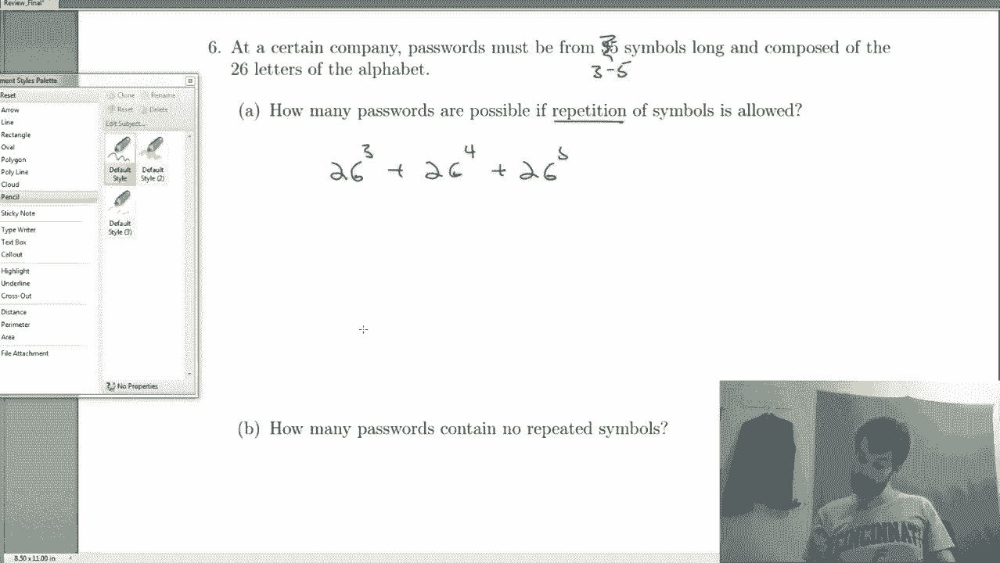

### 不允许重复符号时

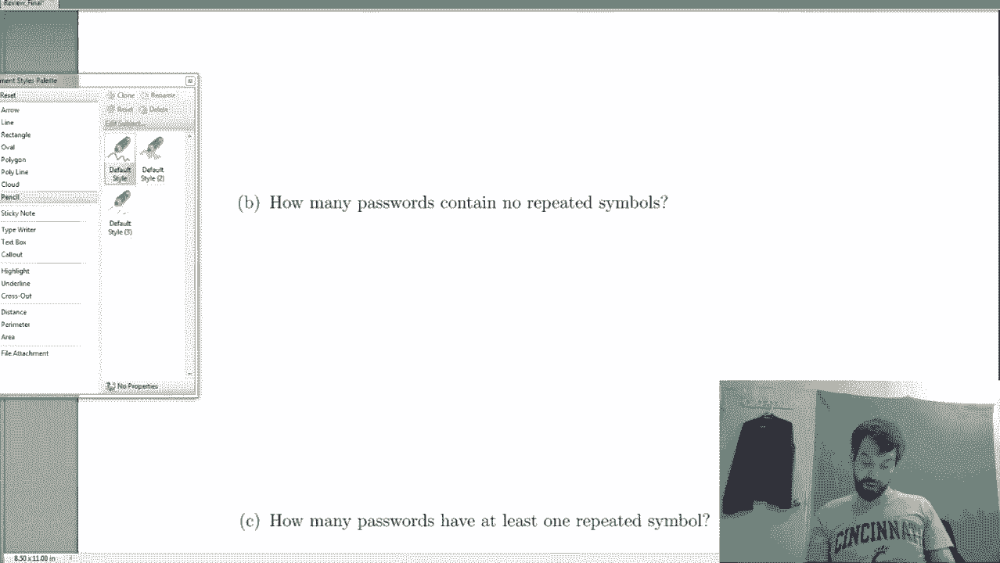

对于每种长度，选择符号后不能重复使用。
*   3位密码数：`26 * 25 * 24`
*   4位密码数：`26 * 25 * 24 * 23`
*   5位密码数：`26 * 25 * 24 * 23 * 22`
**总密码数：** `(26*25*24) + (26*25*24*23) + (26*25*24*23*22)`

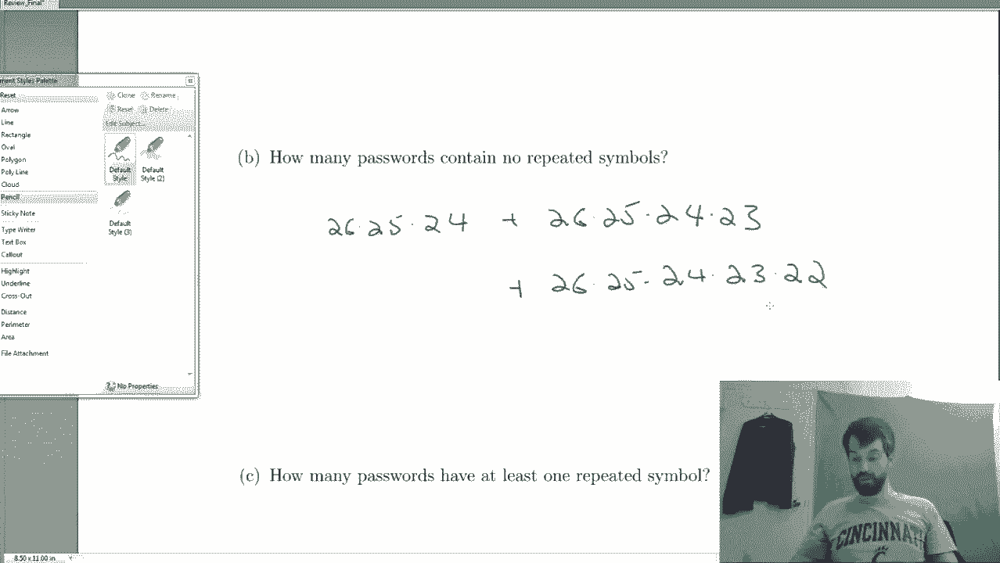

### 至少包含一个重复符号时

直接计算“至少一个重复”的情况较复杂。更简单的方法是使用互补原理：
**至少一个重复的密码数 = 总密码数 - 无重复符号的密码数**
即，用“允许重复时的总密码数”减去“不允许重复时的总密码数”。

---

## 总结 📚

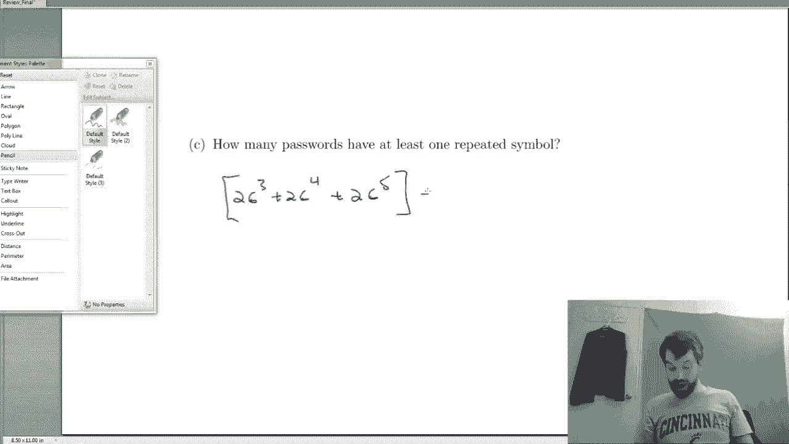

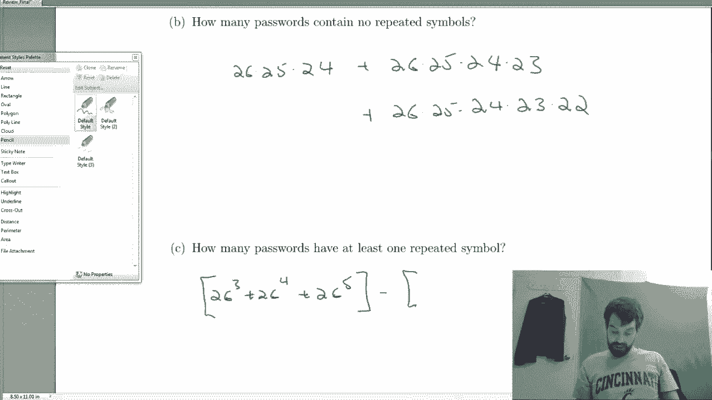

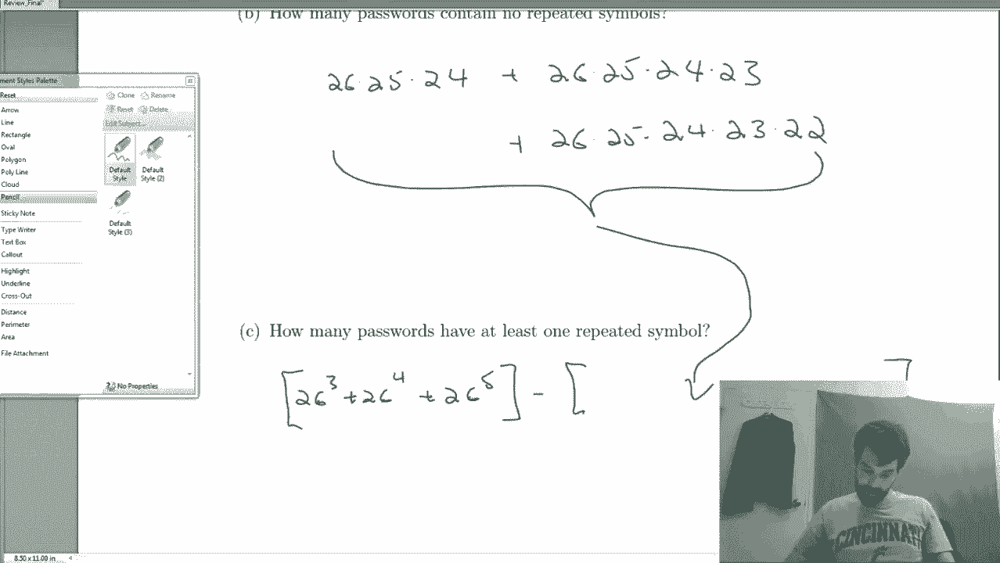

本节课中，我们一起学习了组合计数在各种场景下的应用。我们从基础的组合数公式 `C(n, r)` 出发，逐步解决了单词排列、二项分布（抛硬币）、条件选择（考试选题）、扑克牌型以及密码组合等问题。核心在于：
1.  准确理解问题中的“恰好”、“至少”、“至多”等关键词。
2.  掌握分步计数（乘法原理）与分类计数（加法原理）。
3.  在复杂情况下，灵活运用互补原理简化计算。
通过这些问题，我们巩固了离散数学中计数原理的核心思想，为学习概率论打下了坚实的基础。