# 离散数学：L78：线性规划与单纯形法入门 🧮

在本节课中，我们将学习一种强大的优化技术——线性规划。我们将通过一个木匠问题的例子，直观地理解线性规划的核心思想，并学习如何通过几何方法找到最优解。

## 什么是线性规划？

线性规划的目标是优化一个**线性函数**，同时满足一系列**线性不等式**约束。例如，我们可能希望最大化函数 `180x + 200y`，但变量 `x` 和 `y` 必须满足某些条件，如 `5x + 4y ≤ 80` 和 `10x + 20y ≤ 200`，且 `x ≥ 0`， `y ≥ 0`。

**核心公式**：
*   目标函数：`P = 180x + 200y`
*   约束条件：
    *   `5x + 4y ≤ 80`
    *   `10x + 20y ≤ 200`
    *   `x ≥ 0`
    *   `y ≥ 0`

## 从文字问题到数学模型

上一节我们介绍了线性规划的基本形式，本节中我们来看看如何将一个实际问题转化为数学模型。我们以“木匠问题”为例。

一位木匠可以制作桌子或书架。
*   制作一张桌子需要10单位木材和5小时劳动，利润为180美元。
*   制作一个书架需要20单位木材和4小时劳动，利润为200美元。
*   可用资源为200单位木材和80小时劳动。

我们的目标是最大化总利润。

以下是建模步骤：
1.  **定义变量**：设 `x` 为制作的桌子数量，`y` 为制作的书架数量。
2.  **建立目标函数**：总利润 `P = 180x + 200y`。
3.  **列出约束条件**：
    *   劳动时间约束：`5x + 4y ≤ 80`
    *   木材约束：`10x + 20y ≤ 200`
    *   非负约束：`x ≥ 0`， `y ≥ 0`

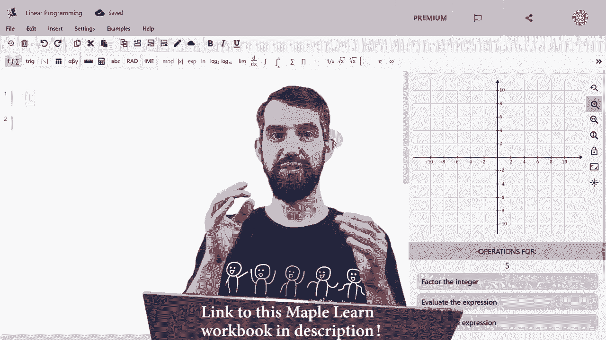

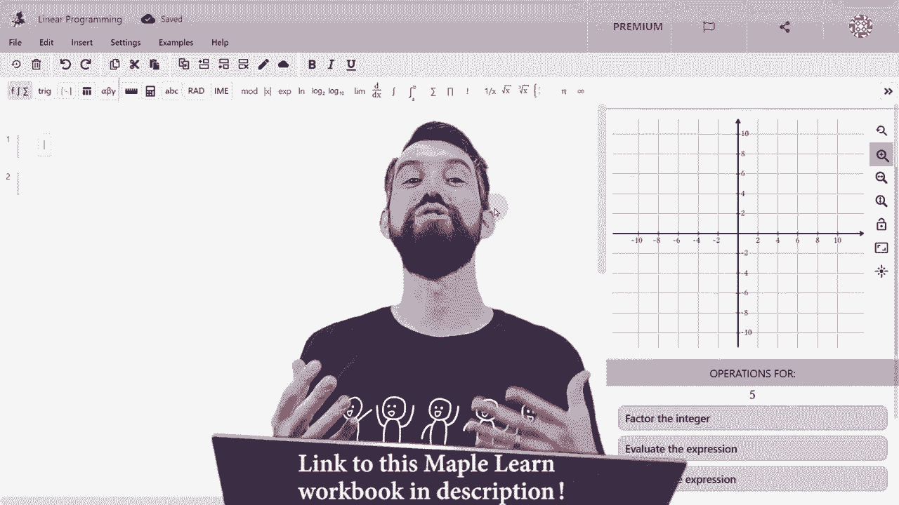

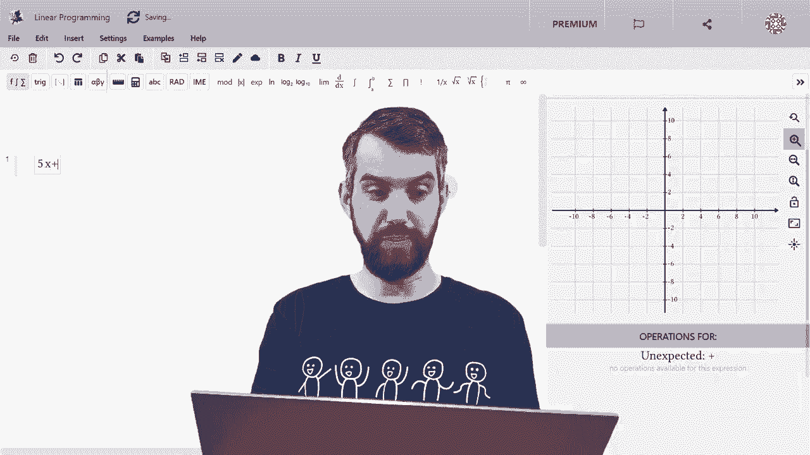

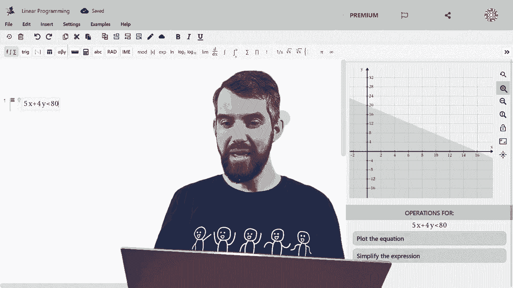

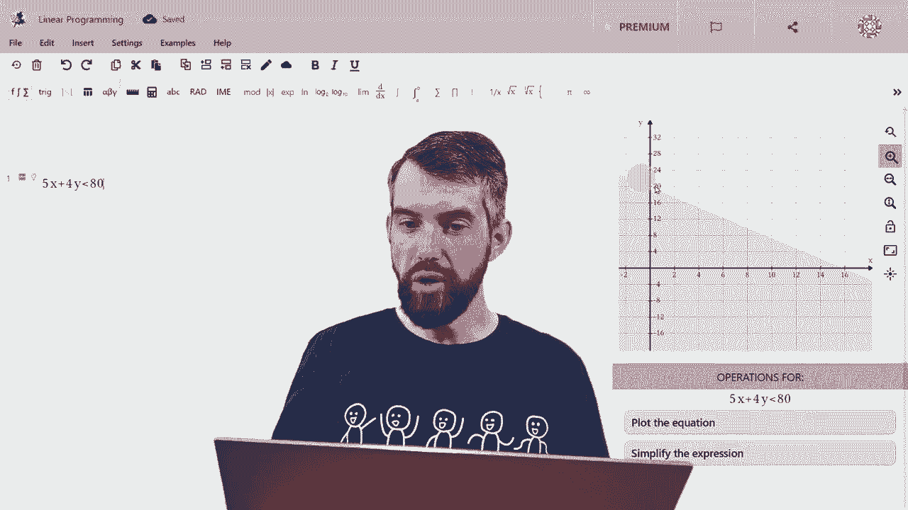

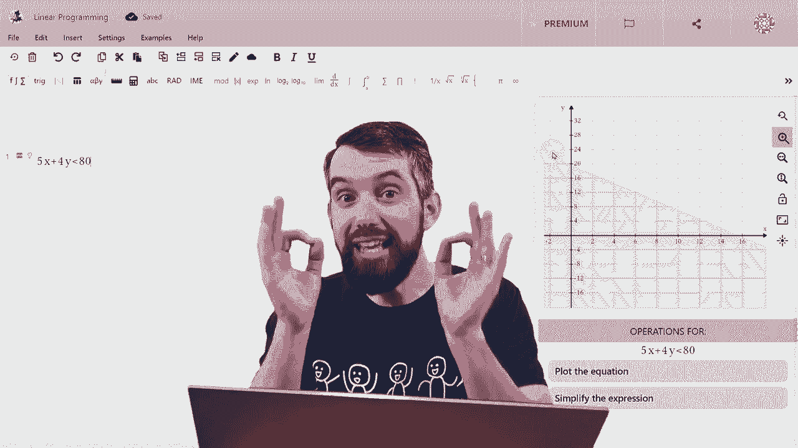

## 可行域与几何直观

现在，我们有了一个由不等式组定义的数学模型。为了直观理解这些约束，我们可以在坐标系中画出它们。

每个线性不等式（如 `5x + 4y ≤ 80`）都表示坐标系中的一个半平面（直线 `5x + 4y = 80` 的一侧）。所有约束条件所代表的半平面的**交集**，就构成了**可行域**。

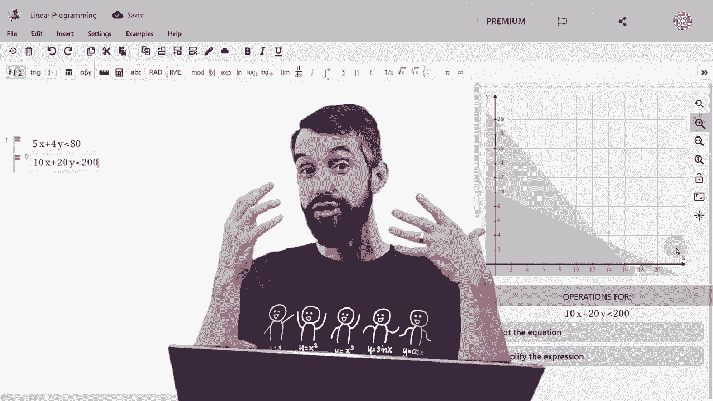

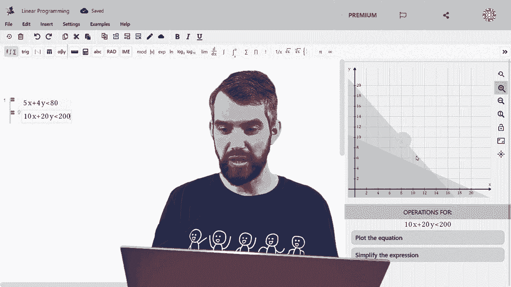

可行域是一个凸多边形区域，其中的每一个点 `(x, y)` 都代表一个满足所有约束条件的可行生产方案。

**核心概念**：**可行域**是所有满足约束条件的 `(x, y)` 点的集合。

## 最优解在顶点处

关键问题来了：在可行域这个多边形中，哪个点能使我们的利润函数 `P = 180x + 200y` 最大？

一个重要结论是：**线性目标函数在凸多边形可行域上的最大值和最小值，必定出现在该多边形的某个顶点上。**

我们可以这样直观理解：利润函数 `P = 180x + 200y` 可以写成一系列**等值线**（`180x + 200y = C`）。随着常数 `C` 增大，这条直线会平行移动。
*   当 `C` 很小时，等值线会穿过可行域内部。
*   逐渐增大 `C`，等值线会向外平移。
*   那个**刚好擦过可行域**（即与可行域有交点，但再增大 `C` 就没有交点了）的等值线所对应的 `C` 值，就是最大利润。而这个“擦过”的点，通常是可行域的一个**顶点**。

因此，寻找最优解的方法简化为：**计算可行域所有顶点的坐标，然后分别代入目标函数，找出使函数值最大（或最小）的那个顶点。**

## 求解木匠问题

让我们应用这个方法来求解木匠问题。

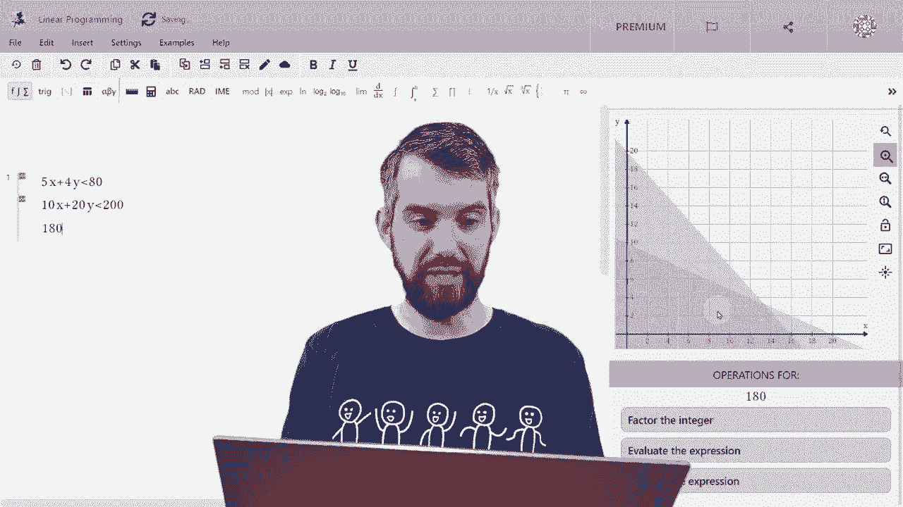

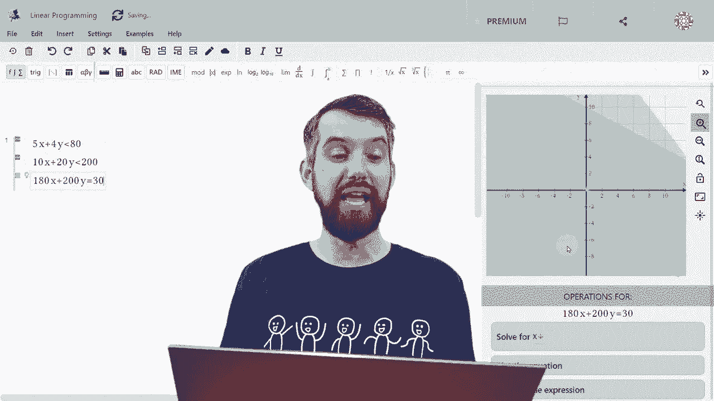

首先，找出由四个约束条件边界线围成的可行域的顶点。顶点是以下直线的交点：

以下是顶点列表及其利润计算：
1.  **顶点 A (原点)**：`(0, 0)`。利润 `P = 180*0 + 200*0 = 0`。
2.  **顶点 B (仅桌子)**：直线 `5x + 4y = 80` 与 `y=0` 的交点。解得 `x=16`， `y=0`。利润 `P = 180*16 + 200*0 = 2880`。
3.  **顶点 C (仅书架)**：直线 `10x + 20y = 200` 与 `x=0` 的交点。解得 `x=0`， `y=10`。利润 `P = 180*0 + 200*10 = 2000`。
4.  **顶点 D (同时使用所有资源)**：直线 `5x + 4y = 80` 与 `10x + 20y = 200` 的交点。
    *   解方程组：
        *   `5x + 4y = 80`
        *   `10x + 20y = 200`
    *   解得 `x = 40/3 ≈ 13.33`， `y = 10/3 ≈ 3.33`。
    *   利润 `P = 180*(40/3) + 200*(10/3) = 3066.67`。

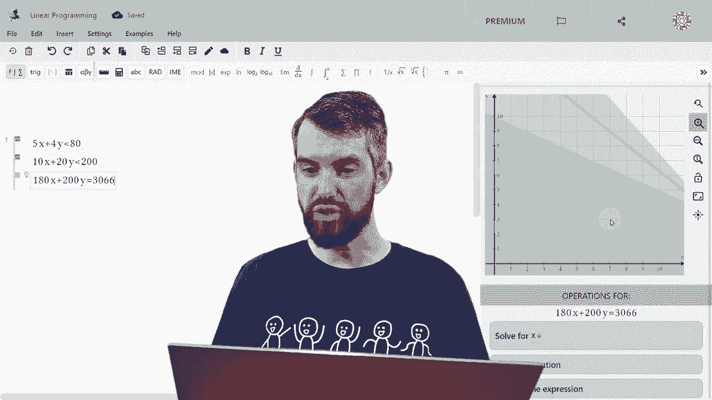

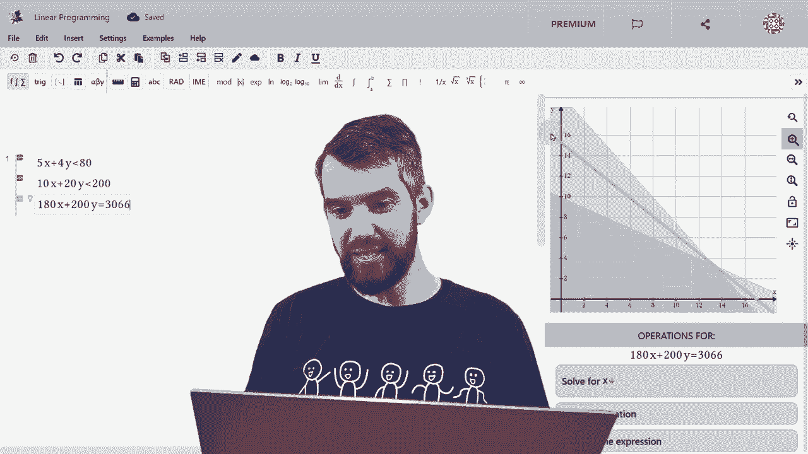

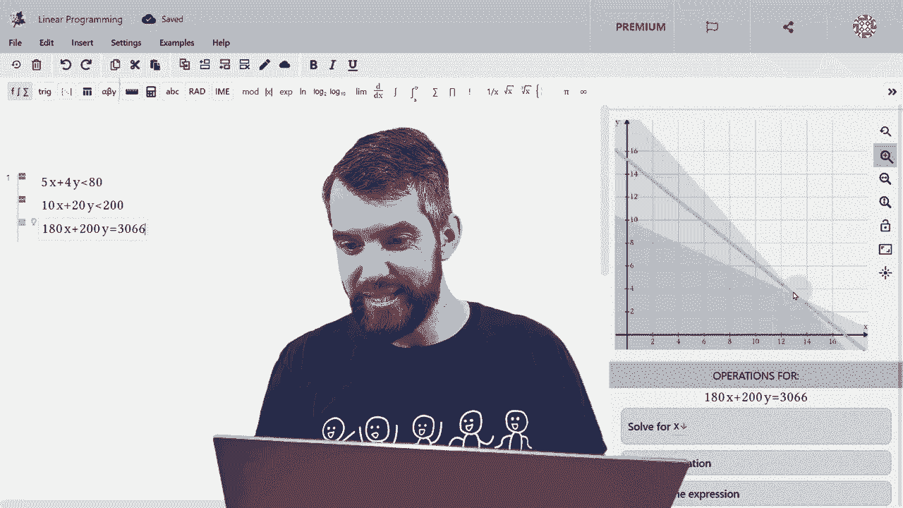

比较四个顶点的利润值：`3066.67 > 2880 > 2000 > 0`。

**因此，最优解是顶点 D**。木匠应制作约13.33张桌子和3.33个书架，可获得最大利润约3066.67美元。在实际生产中，可能需要取整，但此解给出了理论上的最优值。

## 总结与核心思想

本节课中我们一起学习了线性规划的基础知识。

1.  **核心定义**：线性规划是在一组**线性不等式**约束下，优化一个**线性目标函数**的问题。
2.  **建模**：将实际问题转化为变量、目标函数和约束条件的数学模型。
3.  **可行域**：约束条件在几何上定义了一个凸多边形区域，称为可行域，其中的点都是可行解。
4.  **关键定理**：线性目标函数在凸多边形可行域上的极值（最大或最小值）必定在区域的**顶点**处取得。
5.  **求解方法（几何法/单纯形法思想）**：
    *   找出可行域的所有顶点。
    *   计算每个顶点对应的目标函数值。
    *   比较这些值，最大者为最大值，最小者为最小值。

这种方法避免了复杂的微积分或高等代数，仅通过简单的几何和代数运算，就能解决一大类重要的优化问题，体现了数学的简洁与力量。在后续课程中，对于更复杂、变量更多的问题，我们将学习系统化的**单纯形法**来高效地寻找这些顶点和最优解。