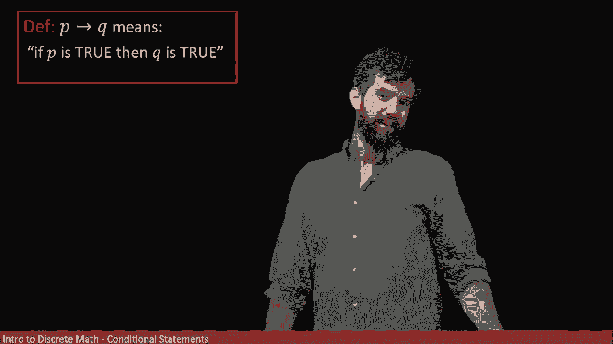
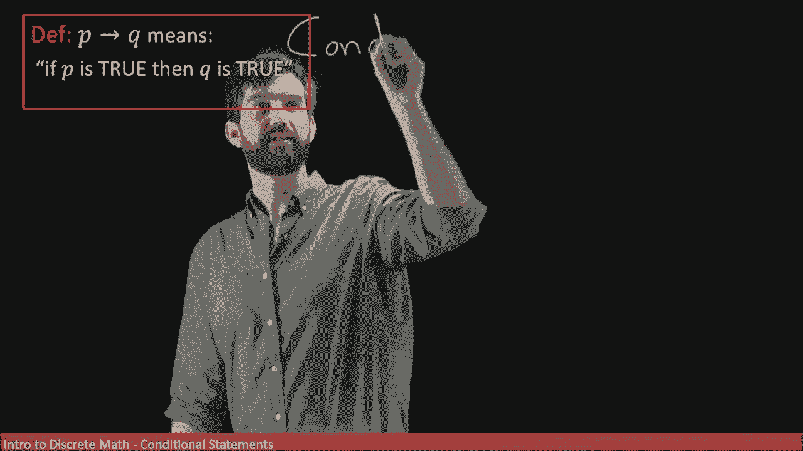
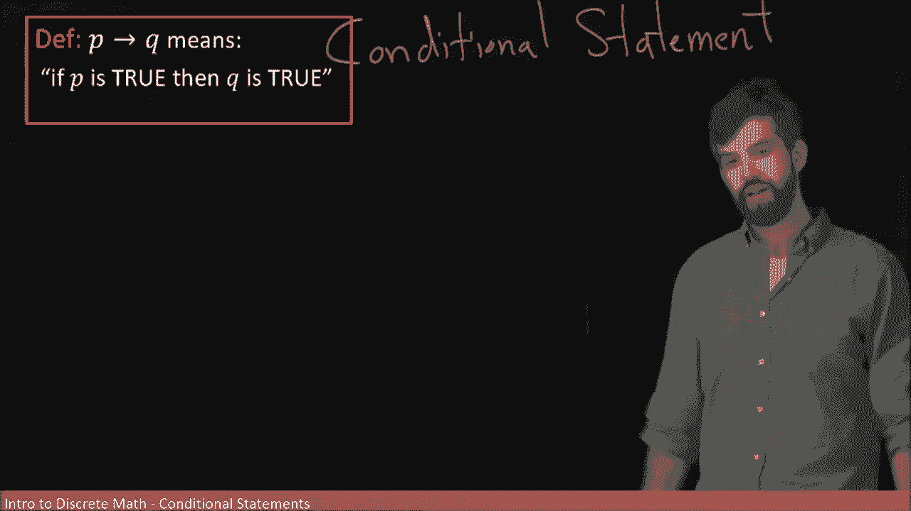
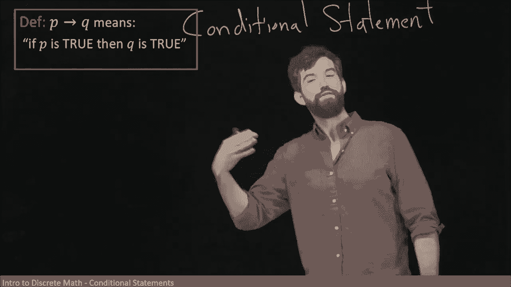
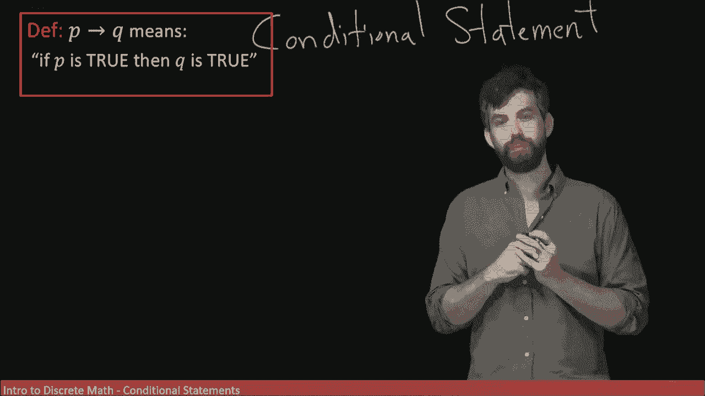
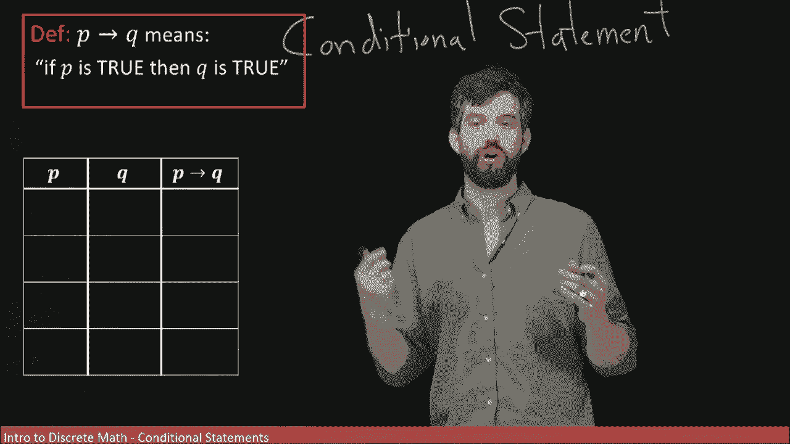
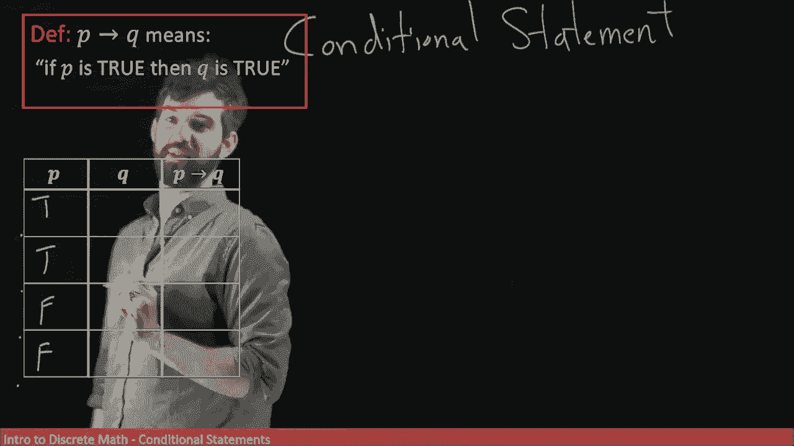
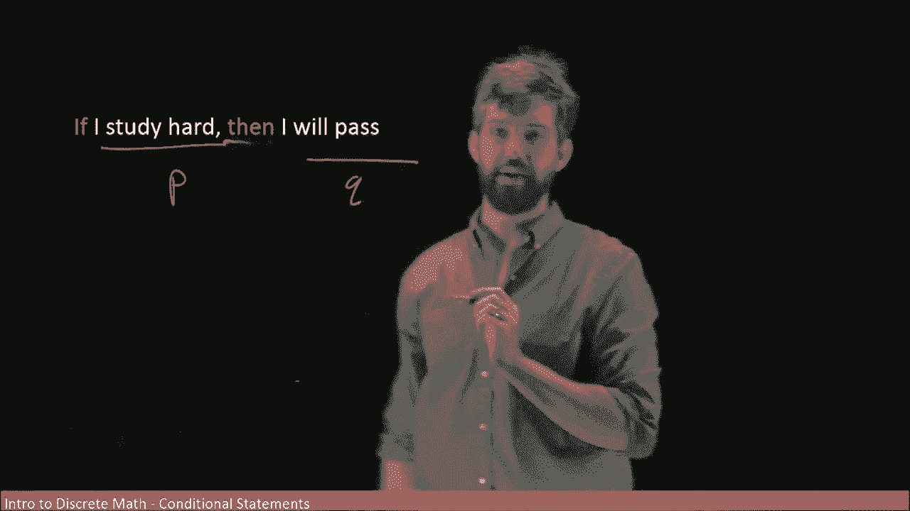
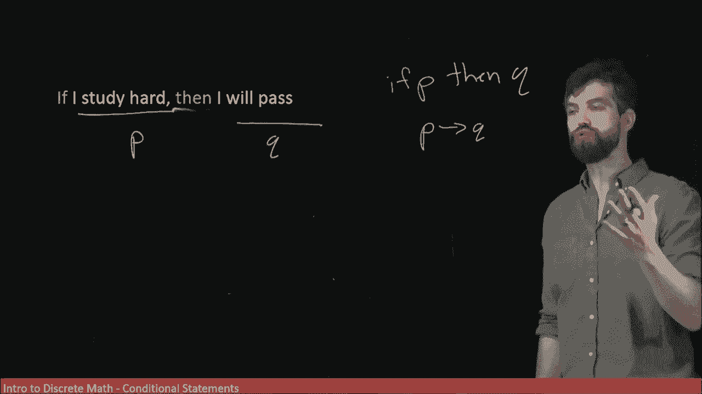
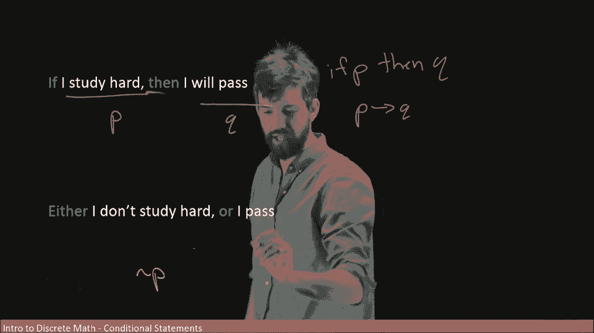

# 【双语字幕+资料下载】辛辛那提 MATH1071 ｜ 离散数学(2020·完整版) - P16：L16- Conditional Statements - if p then q - ShowMeAI - BV1Sq4y1K7tZ

In this video， we're going to investigate something called conditional statements。

And a conditional statement is one of the form。

If P， then Q， you want to say that there is an initial statement I hypothesis P。

 and that if that hypothesis is true， then the conclusion， the second statement， Q must also be true。

Now we've seen some statements like these before， but what we want to investigate in this video is how can we deal with things like truth tables。

 how we can we combine this with other statements and so on so for instance let's try to come up with a truth table for the implication for the conditional P implies Q。

😡。

So our first step as always， is going to be to fill in the variables。

 so I'm going to say that I've got a true is a possibility， true is a possibility。

 false is a possibility， and false is a possibility for my P variable， and then for my Q variable。

 we could have it being true， we could have it being false， we could have it being true。

 we could have it being false。😡。

Now， the idea of the implication is that whenever the first thing is true。

 whenever the hypothesis is true， then so true is going to be the conclusion。

 so if I read off of the first row， this is a scenario where the hypothesis P is true and the conclusion also ends up being true so the implication is true in this scenario。

 this is scenario where when the first thing is true。

 the second thing is going to be true and so I'm going to say that my implication is going to be true。

😡，Now， for the second scenario， the hypothesis is still true， but the conclusion Q is false。

 so the implication is not true， it's not the case that when p is true， then Q is going to be true。

 so I'm going to go and say that this is going to be false as well。

And then in the second set of scenarios。In a sense， the conditional doesn't apply here。

 what it says is that if P is true， then the conclusion is going to be true。

 but in these bottom two scenarios here， the assumption isn't even true so the condition isn't true to be even considered it's not the case that P is true。

 so I don't have if P is true。 So for these bottom two rows。

 we are going to say they are vacuously true。 we are going to give them the truth value of being true。

😡，And the reason why we're doing this is that there's first of all。

 no reason to think that they're false， right it's not a scenario where the first thing was true and the second thing was false so I'm not saying the implication is false。

 and we're going to sort of think that we haven't even had the chance to get off the ground of considering this。

 and so we're going to just label them as being true nonetheless。

 to make a little bit more sense of this。 I'm going to put up a couple different columns in my truth table。

 So I'm going to put up not P in the statement， not P or Q。😡。

So let me first just fill in that table and then we're gonna try to analyze them。

 So if I have my P's over here， then if I want to look at what my not p's are going to be。

 they're just not whatever the P was。 So I'm going to put it in as a false。

 I can put this as P is true， not P is false。 P is false here and therefore not P is true and P is false here and therefore not P is likewise true。

 So that was easy to fill in that table。 And now what we have is an or statement。 not P or Q。

 So in this scenario we have true here for my Q false here for not P because it's an or。

 I only need one of them to be true。 So I'm going to say that this is gonna to be true。😡。

Down here， false and false， therefore my or statement is going to be false， true and true。

 therefore true， false and true， I only need one of them and so true as well。😡。

Now here's the big takeaway。This column that we're interested in， this is the。P implies Q column。

 And this column that we're interested in。 This is the not P or Q column， these things。

Are both the same， In other words， the implication， which might seem a little bit confusing at first。

 has the same truth table as the statement not P or Q。And indeed。

 this gets to this point of how we're going to think about why these bottom rows are going to be true in the case of an implication。

If we think of it as my implication as one of two different things。

 either my conclusion is true or it is the case that my initial assumption， my P value was false。

 if my initial assumption， my P value was false， then I'm not worrying about my conditional I haven't even got started。

 my initial assumption if this thing is true is not even true。😡。

And so I can think of this as not P or Q and that is the same logical thing as P implies Q so let's look at this statement。

 if I study hard， then I will pass so this is a conditional we have two different components to it first of all we have this statement here if I study hard I am going to denote that by the symbol P。

😡。

And then we have the property that。If I study hard， then I will pass， and I will pass。

 I will give the statement Q。

So I can rewrite this as saying。

If P， then Q。And I can even combine this into a shorthand by saying the symbol P implies Q。

 So all of these things mean the same thing。 First I've replaced by English phrases with just logical symbols P and Q。

 I've kept the if and the then， and then my implication arrow was a way that I could sort of hide the English words if P then Q。

 they mean the same thing。😡，All right， so let's look at the other one。

 we just said that a logical implication or a conditional was the same thing as not PR Q。

 so let me try to write out not PR Q I claim it is going to be this sentence。

So here we have either I don't study hard， I claim that this is the symbol not P right if P is study hard。

 then I don't study hard is not P and then I will pass that was my statement Q and so I'm going to go and put that as a Q and then you'll note that this bottom one is phrased as an either or either it's this first thing the not P or it's a second so I can connect them by putting in my disjunctive symbol my or。

😡。

And I think that these two things do logically mean the same thing， so if I study hard。

 then I will pass， that sets up a couple different possibilities。It might be that I pass a course。

 or it might be that I don't study hard， so indeed these two things are logically the same。😡。

