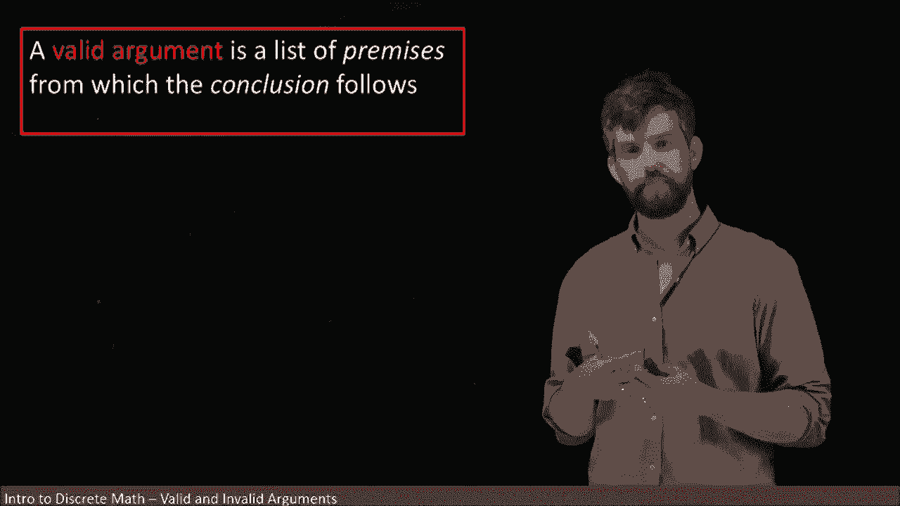
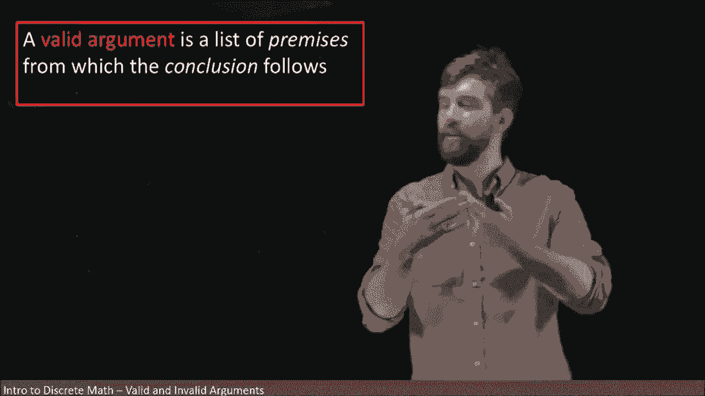
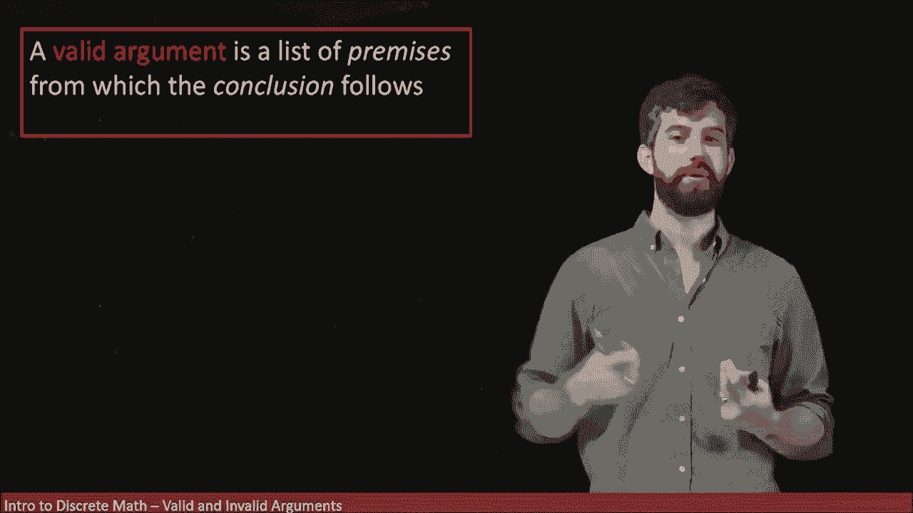
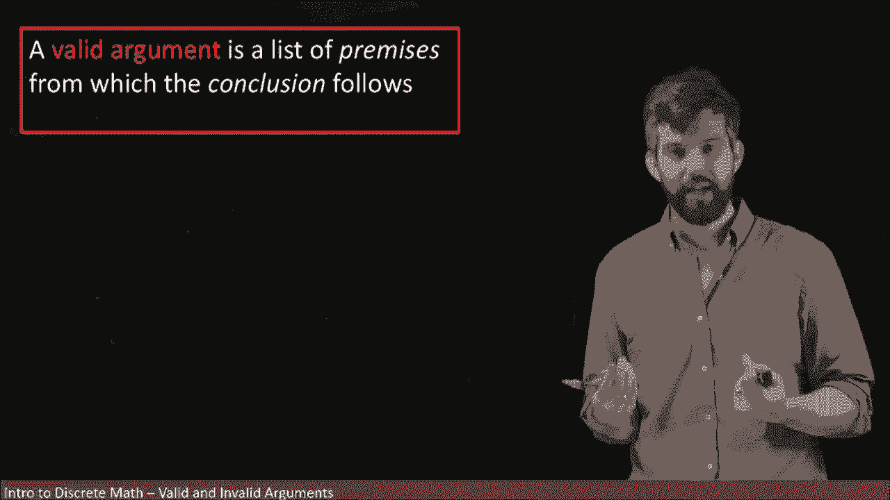
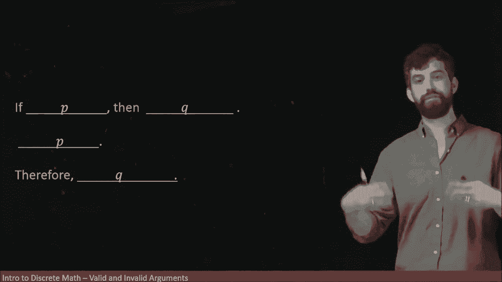
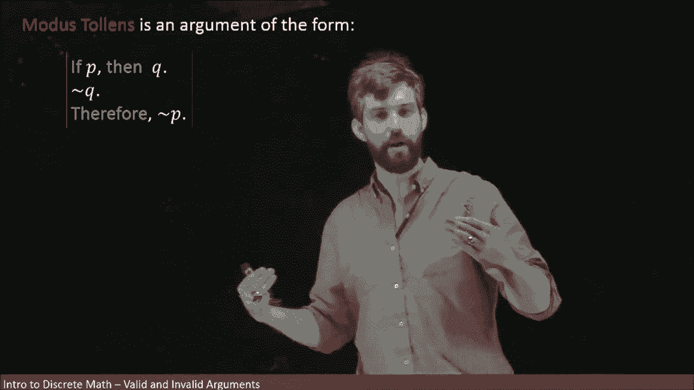

# 【双语字幕+资料下载】辛辛那提 MATH1071 ｜ 离散数学(2020·完整版) - P22：L22- Logical Arguments - Modus Ponens & Modus Tollens - ShowMeAI - BV1Sq4y1K7tZ

So far we've been investigating statements as if they're just this thing that I might just utter for fun。

 regardless the statement and we've been investigating， is it true， is it false。

 we try to take a statement， break it up into its logical form。

But what we really want to be doing is making arguments that persuade us that conclusions are going to be true。

So a valid argument is going to be this list of statements that we're going to refer to as premises and then if you accept all of these different premises。

 then the conclusion logically follows that's a real goal we want to be able to prove theorems or we want to argue to somebody why something might be true。

 we're going to try to come up with a logically valid argument that does this。😡。

Now the idea of a logically valid argument is to say that the structure of it is indisputable。

 that we can not dispute that the conclusion follows from the premises。

 There might be other ways to go about it， you might have many criticisms of the argument for once you might say。

 well， look， the premise that you told me it isn't even true。

 So then the conclusion doesn't follow if the premises aren't even true。😡。

But if you written a valid argument， then everybody should be able to agree that your argument is indeed valid in the sense that the conclusion does indeed follow from the premises。

So here's a sample argument。I've broken it up into a couple different parts。 I say first of all。

 if I do the dishes， then my wife will be happy with me， this is just a premise。

 not saying it's a true premise not the same it's a false premise。

 but it's just a it is a statement and in particular as a conditional。😡。

Then I'm going to click the claim I do the dishes。And then the conclusion here is that my wife is happy with me。

Now， both of these premises may not be true， maybe I don't do the dishes。

 maybe this is way too simplistic of a escape to deduce my wife being happy with me。

 but the logic of it， I think is sound if I have this one thing， if I have this hypothesis。

 then I get the conclusion， I'm assuming that I do have the hypothesis。

 therefore I do get the conclusion and I have this structure。

So let's just look at the structure for itself for a moment now now I fill it in with a kind of joke example here。

 but I could fill in this structure with anything， for example。

 I could just put peas and cues in place of these statements so where I had I do the dishes in both of these two places I'm going to put it into a pea and when I have my wife will be happy with me。

 Im going to replace those with cubees。😡，So this is what we refer to as a logical form or an argument for and in particular it's one that's got a name of modusponents now moduspons is yeah。

 it's a fancy la name for it， but what it means is a logical structure of the form， if P then Q。

 so if an assumption then a conclusion， and then you take that assumption and therefore you get the conclusion。

😡。

Now， I think that this argument seems relatively reasonable if you have an assumption and then you get the inclusion and I assert you do have the assumption。

 so therefore you do get the conclusion， that seems intuitively reasonable to me。And indeed。

 I think we use arguments like this all the time in our daily lives。

 although we may not structure it quite so explicitly。However。

 let's try to look at the level of truth tables to verify that this argument that intuitively makes a lot of sense actually is indeed valid。

 So the first thing I'm going to do is I'm going to put down my variables。

 I'm not in follow by myself because we do the same thing every single time。

 I have my variables P and Q。😡，So if I go and look at my argument。

 I've got these three different lines， the first of them I will sometimes call P1 for premise1。

 and then the second of the two I will sometimes call P2 for premise2。

 and then the third of them I might call C for conclusion。

So what I want to do in my truth table is to now put up my two premises。

 so here we go we have the P implies Q and the P。So first of all， the P implies Q， we know true。

 true， this is going to give us a true as well。Then we're going to have true false。

 that's going to be false。And then I have these two falses down here in the P column and so we got the vacuously true scenarios so I can put true。

 true in there as well。And then I'm sort of just repeating myself。

 I've also put P because P was a premise， but P was also a variable。

 so I'm going kind of just copy and paste this particular column so it's a little bit tedious。

 but whatever， that's all right。And I'm doing it in this way just because I want to have one sort of block here that's got all of my premises。

 So even though P， which was a premise just happened to by coincidence be a variable as well。

 I'm going put it down in this section over here So there my variables that got my premises final thing I want to write down is my conclusion All right。

 So my conclusion is going to be Q and what we're trying to say is that in any scenario where both premises are true。

 we want the conclusion to be true as well。😡，But if I look at my premises， there's a false here。

 there's a false here， there's a false there， the only one where both premises are true is this one。

 and so I care about this row and in this scenario true。

 true and if I look over what Q was over here， Q is true as well， so what do I get， I have a true。

And then I actually don't even care to fill in this part at all。

 It doesn't really matter to me what goes in there， because in this scenario。

 the premises are not satisfied in this logical argument。

 I am assuming that both of my premises are true and if my premises were not true。

 I don't care my argument doesn't matter whether it's valid or not。

 So all that matters in this scenario is this first row here just because that's when all of the premises are going to be true and what do we have indeed。

 the conclusion is true because it matches the claim over here。

 the variable cu is the same thing as this。 So I think yes。

 I think this is logically valid that modus opponents does indeed work and the intuition is proven by our truth table。

😡，Another very famous and important logical argument is a form referred to as Mous Tolins。

And this is the statement， it's one premise if P then Q， a second premise， not Q， and the conclusion。

 therefore not P。And the idea here is that if you have a conditional that P implies Q。

 but that your conclusion is false， it could not be that your assumption was true because if your assumption was true。

 your conclusion would have to be true as well so knowing your conclusion is false forces the assumption to be false as well if you have this conditional if we wanted to we could go and write out the truth table exactly as we did for modiss pos and we could get that indeed the columns matched and so we would have that this argument form was going to be valid。

😡，I'm going to note that both modus pos and modus tos are referred to as syllogisms。

 these are examples where you have two different premises。

 sort of a major premise and a minor premise， and therefore you get a conclusion out of it。

So let's see an example of one of these。Heres my argument for it。

If I'm the president of the United States， then I'm an American citizen。I am not an American citizen。

 true fact， I happen to be a Canadian， and therefore I am not the president of the United States。

This is not the only way I could prove that I'm not president of the United States。

 but it is one argument that is logically valid。 And， in fact。

 both of these different conditions are going to be true。

 You have to be an American citizen to be the president of the United States。

 I am not an American citizen。 Therefore， it must be that I am not the president of the United States。

 And indeed， if we come through and try to to look at our structure here。

 I' am going to say that that I am the president of the United States， that's going to be my P here。

I am an American citizen， that's going to be the statement Q。

And then what I'm doing down here is that I am negating this。

 I am saying I am not an American citizen， and therefore I am getting out of this。😡。

Not being the president of the United States。 So I have proven that I am not the president of the United States。

😡。